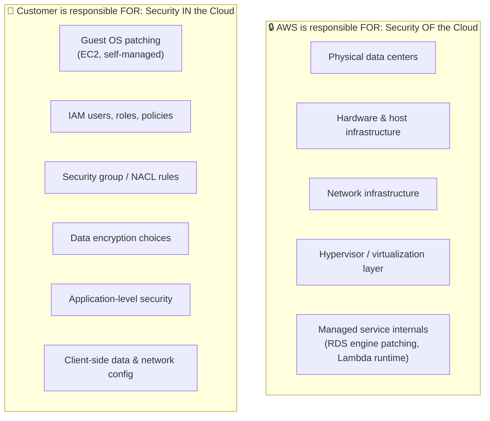
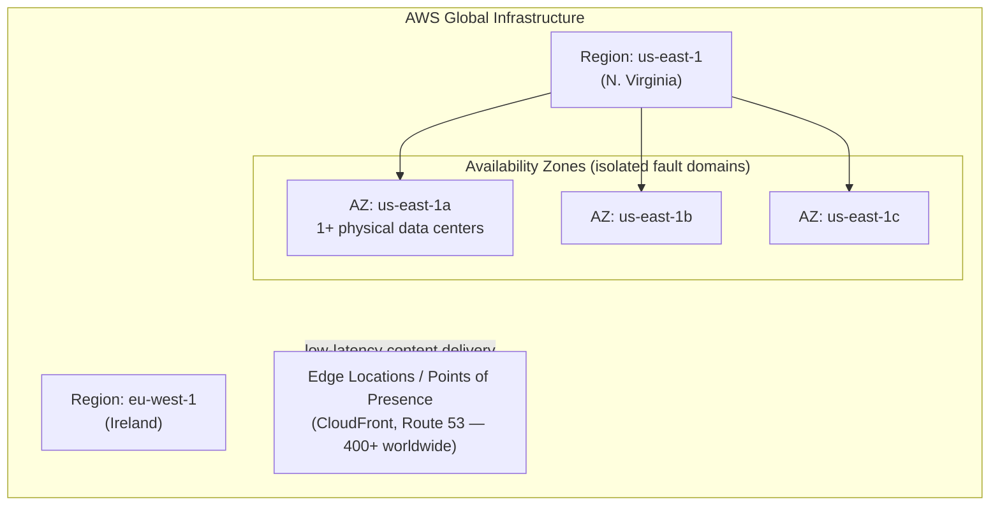
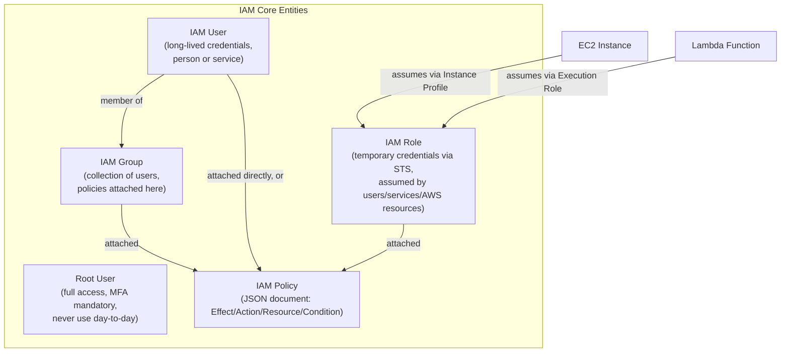
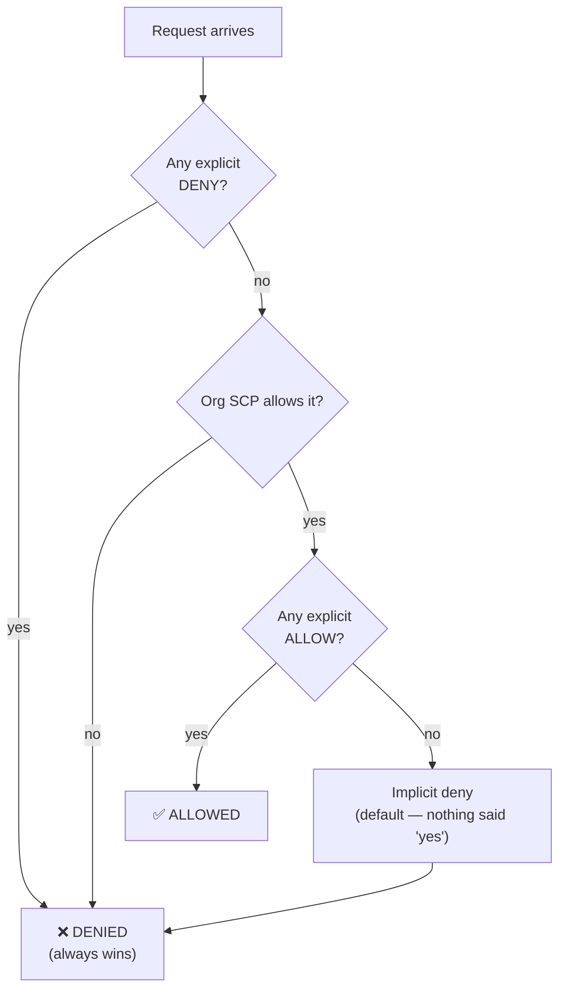
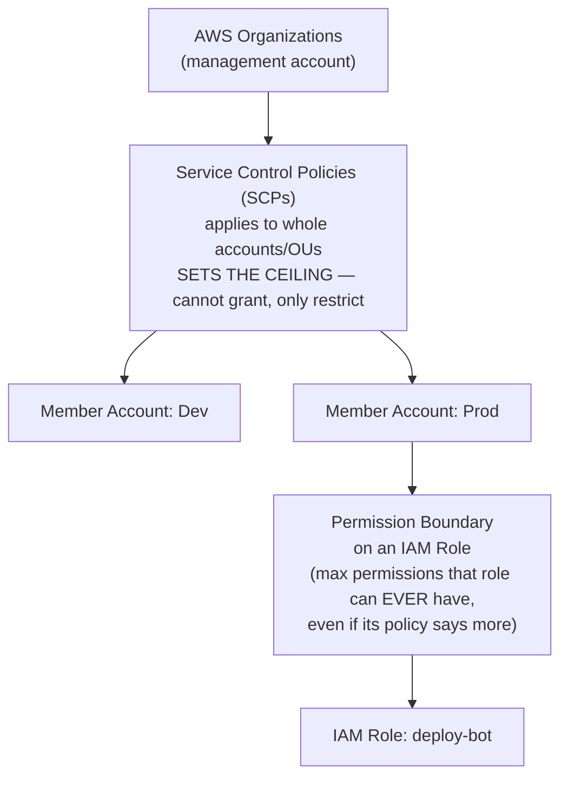
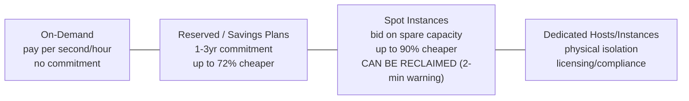
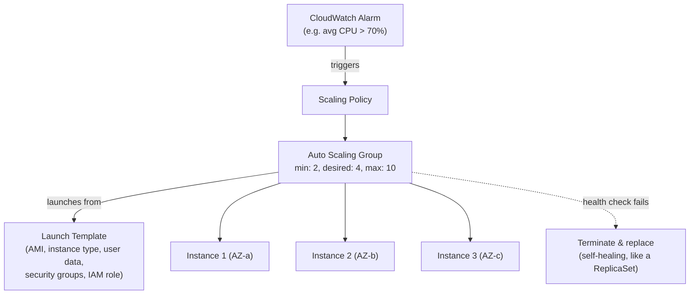
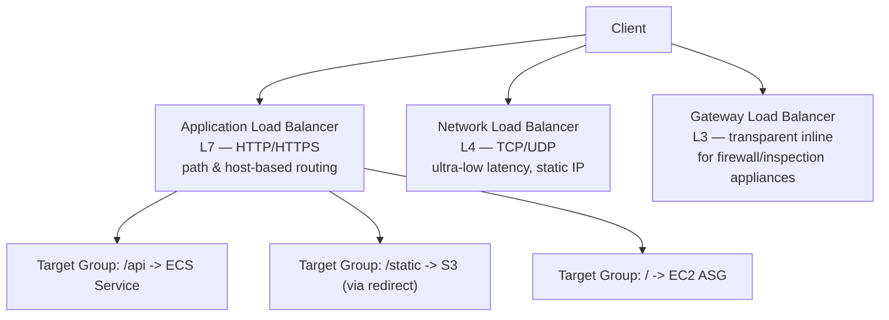

---

## AWS Architecture — Deep Study Guide for DevOps Engineers
> [!info] Scope
> This is not exam prep — it's a systems-level map of AWS the way a DevOps engineer actually uses it: provisioning compute, running containers/K8s, wiring networks, automating deploys, and keeping the whole thing observable and secure. Depth ranges from foundational (Cloud Practitioner) through Associate/DevOps-relevant internals where it matters.

##  Map of this vault
```dataview
TABLE domain, depth
FROM #aws-study
SORT domain ASC
```

| # | Domain |
|---|---|
| 1 | Foundations — Shared Responsibility & Global Infrastructure |
| 2 | IAM — Identity & Access |
| 3 | Compute — EC2, Auto Scaling, Load Balancing |
| 4 | Containers — ECS, EKS, Fargate, ECR |
| 5 | Serverless — Lambda, API Gateway, Step Functions |
| 6 | Storage — S3, EBS, EFS, FSx |
| 7 | Databases — RDS, Aurora, DynamoDB, ElastiCache |
| 8 | Networking — VPC Deep Dive, Route 53, CloudFront |
| 9 | IaC & CI/CD — CloudFormation, CDK, CodePipeline |
| 10 | Messaging & Integration — SQS, SNS, EventBridge, Kinesis |
| 11 | Observability — CloudWatch, CloudTrail, X-Ray, Config |
| 12 | Security — KMS, Secrets Manager, WAF, GuardDuty |
| 13 | Cost Management |
| 14 | Well-Architected Framework |
| 15 | EKS Deep Dive — AWS for Kubernetes Engineers |

---

# 1. Foundations

## 1.1 The Shared Responsibility Model

> [!info] Concept
> AWS secures the cloud; **you** secure what's *in* the cloud. Where the line falls shifts depending on the service's abstraction level.



| Service model | AWS handles | You handle |
|---|---|---|
| **IaaS** (EC2) | Physical host, hypervisor, network | OS, patches, app, data, firewall rules |
| **PaaS/Managed** (RDS) | + engine install, patching, backups infra | Schema, queries, IAM access, data |
| **Serverless** (Lambda, DynamoDB) | + OS, runtime, scaling | Code, IAM permissions, data |

> [!warning] Watch Out
> The model doesn't disappear as you go "more managed" — it *shifts*. Even in Lambda, **you** are 100% responsible for IAM permissions, secrets in your code, and application logic vulnerabilities. AWS never inherits your app-layer mistakes.

## 1.2 Global Infrastructure



| Concept | Definition | DevOps implication |
|---|---|---|
| **Region** | A geographic area with multiple isolated AZs | Data residency, latency, compliance boundary |
| **Availability Zone (AZ)** | 1+ discrete data centers with independent power/cooling/network, low-latency links to sibling AZs | Deploy across ≥2 AZs for HA — a single AZ failure shouldn't take down your app |
| **Edge Location** | Caching/PoP for CloudFront & Route 53 | Reduces latency for global users, absorbs DDoS at the edge |
| **Local Zone / Wavelength** | Extends AWS infra closer to end users / 5G networks | Ultra-low-latency use cases |

> [!tip] Best Practice
> Multi-AZ is the baseline for production — it's usually free-ish (no cross-region data transfer) and protects against a single data center failure. Multi-**Region** is a separate, more expensive decision reserved for DR/compliance/global-latency requirements.

### Self-Check Q&A — Foundations
> [!question]- 1. Under the Shared Responsibility Model, who patches the guest OS on an EC2 instance vs. an RDS instance?
> EC2: you patch the guest OS — it's IaaS, AWS only guarantees the hypervisor and hardware. RDS: AWS patches the underlying OS and database engine (with a maintenance window you control) — it's a managed service, though you still own the schema, queries, and IAM access to it.

> [!question]- 2. Why deploy across multiple AZs instead of multiple Regions for standard HA?
> AZs give you fault isolation (separate power/cooling/network) with low-latency, often free intra-region links between them — cheap HA. Multi-Region adds cross-region data transfer costs, replication lag, and complexity — reserved for DR or global latency needs, not default HA.

---

# 2. IAM — Identity & Access Management

> [!info] Concept
> IAM is **global** (not region-scoped) and controls *who* can do *what* to *which* AWS resource. Everything in AWS — API calls, console clicks, SDK calls — is an IAM-authenticated and IAM-authorized request.



> [!example] YAML Manifest — IAM Policy (JSON, the actual format)
> ```json
> {
>   "Version": "2012-10-17",
>   "Statement": [
>     {
>       "Effect": "Allow",
>       "Action": ["s3:GetObject", "s3:PutObject"],
>       "Resource": "arn:aws:s3:::my-app-bucket/*",
>       "Condition": {
>         "StringEquals": {"aws:RequestedRegion": "eu-west-1"}
>       }
>     }
>   ]
> }
> ```

## 2.1 Policy Evaluation Logic



> [!warning] Watch Out
> **Explicit DENY always wins**, no matter how many ALLOWs exist elsewhere (identity policy, resource policy, permission boundary, SCP). The default posture is **implicit deny** — if nothing explicitly allows an action, it's denied. This is why a "why can't I do X" debugging session always starts by hunting for a stray Deny statement or a missing Allow, not by assuming something is broken.

## 2.2 Users vs Roles vs Groups — When to Use What

| Entity | Credentials | Use for |
|---|---|---|
| **IAM User** | Long-lived access keys / password | Individual humans needing console/CLI access (increasingly discouraged in favor of federated SSO) |
| **IAM Group** | N/A — just a policy container | Bundling permissions for a team (e.g., `developers`, `read-only-auditors`) |
| **IAM Role** | Short-lived, auto-rotated via STS (`AssumeRole`) | **EC2 instances, Lambda functions, ECS tasks, cross-account access, federated users** — anything that shouldn't hold a static secret |

> [!tip] Best Practice — The #1 DevOps IAM Rule
> **Never hardcode long-lived access keys in EC2 instances, containers, or CI/CD pipelines.** Attach an **IAM Role** instead:
> - EC2 → **Instance Profile** (role auto-delivered via the instance metadata service)
> - Lambda → **Execution Role**
> - ECS Task → **Task Role** (permissions for the app) vs **Task Execution Role** (permissions for ECS itself to pull images/push logs)
> - EKS Pod → **IRSA** (IAM Roles for Service Accounts) — see EKS Deep Dive section

## 2.3 Permission Boundaries, SCPs & Organizations



| Guardrail | Scope | Effect |
|---|---|---|
| **SCP** | Account / Organizational Unit | Ceiling for the WHOLE account — even the root user in that account can't exceed it |
| **Permission Boundary** | Individual IAM user/role | Ceiling for ONE identity — used to let a team self-serve IAM without granting privilege escalation |
| **Identity Policy** | Attached to user/role | What that identity CAN do (still bounded by the above) |
| **Resource Policy** | Attached to a resource (S3 bucket, KMS key) | Who else can access THIS resource, including cross-account |

> [!tip] Best Practice
> Use **Organizations + SCPs** to enforce org-wide non-negotiables (e.g., "no one can disable CloudTrail," "only these regions are allowed"). Use **permission boundaries** to safely let application/platform teams create their own IAM roles without risking privilege escalation to admin.

### Self-Check Q&A — IAM
> [!question]- 1. An engineer has an identity policy granting `s3:*` on a bucket, but access still fails. What are the two most likely causes, in priority order?
> First check for an explicit **Deny** anywhere (identity policy, resource policy, permission boundary, or SCP) — Deny always wins regardless of any Allow. Second, check whether an **SCP** at the org/OU level restricts that action for the account — SCPs are a ceiling that no identity policy can exceed.

> [!question]- 2. Why should a CI/CD pipeline running on EC2 use an IAM Role instead of embedding an IAM user's access keys?
> Roles issue short-lived, auto-rotated credentials via STS delivered through the instance metadata service — no static secret to leak, rotate manually, or accidentally commit to a repo. It's the difference between a credential that expires in hours and one that's valid until someone remembers to revoke it.

> [!question]- 3. What's the practical difference between an ECS Task Role and a Task Execution Role?
> Task Role = permissions the **application code inside the container** needs (e.g., read from S3). Task Execution Role = permissions **ECS itself** needs on the task's behalf (pull the image from ECR, write logs to CloudWatch) — separating "what my app can do" from "what the platform can do to launch my app."

---

# 3. Compute — EC2, Auto Scaling, Load Balancing

## 3.1 EC2 Instance Types

| Family | Optimized for | Example use case |
|---|---|---|
| **T** (Burstable) | Baseline + burst credits | Dev/test, low-traffic web servers |
| **M** (General purpose) | Balanced CPU:RAM | Most application servers |
| **C** (Compute optimized) | High CPU:RAM ratio | Batch processing, CI runners, video encoding |
| **R** (Memory optimized) | High RAM:CPU ratio | In-memory caches, real-time big data |
| **I** (Storage optimized) | High-speed local NVMe | Distributed file systems, NoSQL databases |
| **G/P** (Accelerated) | GPUs | ML training, rendering |

## 3.2 Purchasing Options



| Option | Commitment | Interruption risk | Best for |
|---|---|---|---|
| **On-Demand** | None | None | Unpredictable, short-term workloads |
| **Reserved Instance (RI)** | 1 or 3 years | None | Steady-state, predictable baseline |
| **Savings Plans** | 1 or 3 years ($ commitment, not instance-specific) | None | Flexible RI alternative — spans EC2/Fargate/Lambda |
| **Spot Instance** | None | **Yes** — 2-min reclaim notice | Fault-tolerant, stateless, batch/CI workloads |
| **Dedicated Host** | Optional | None | BYOL licensing, compliance requiring physical isolation |

> [!tip] Best Practice — DevOps Spot Strategy
> Spot Instances are ideal for **CI/CD build runners, batch jobs, and stateless worker fleets** in an Auto Scaling Group with a mixed-instance policy (On-Demand baseline + Spot for burst). Never run stateful, single-point-of-failure workloads (databases, leader nodes) on Spot without a robust interruption-handling strategy.

## 3.3 Auto Scaling Group (ASG)



| Scaling policy type | Behavior |
|---|---|
| **Target Tracking** | "Keep average CPU at 50%" — auto-computes needed capacity (most common, simplest) |
| **Step Scaling** | Different scaling amounts based on alarm breach severity |
| **Scheduled Scaling** | Pre-planned capacity changes (e.g., scale up before known traffic events) |
| **Predictive Scaling** | ML-based forecast, pre-scales ahead of predicted load |

> [!tip] Best Practice
> This maps almost 1:1 to Kubernetes: an ASG is conceptually a **ReplicaSet for EC2 instances** — it maintains a desired count, self-heals failed instances via health checks, and reacts to metrics like an HPA reacts to CPU. The Launch Template is the "Pod template" equivalent.

## 3.4 Elastic Load Balancing (ELB)



| Type | Layer | Use case |
|---|---|---|
| **ALB** | L7 (HTTP/HTTPS/gRPC) | Microservices, path/host-based routing, container workloads |
| **NLB** | L4 (TCP/UDP/TLS) | Extreme performance, static IP requirement, non-HTTP protocols |
| **GWLB** | L3 (transparent) | Inserting third-party firewalls/IDS inline with traffic |
| **CLB** *(legacy)* | L4/L7 | Deprecated — avoid for new workloads |

> [!warning] Watch Out
> Health checks are what actually make an ALB safe during deploys — a target failing its health check is pulled from rotation just like a Kubernetes readiness probe pulls a Pod from Service Endpoints. Misconfigured health check paths/thresholds are the #1 cause of "deploy looks fine but users get 502s."

### Self-Check Q&A — Compute
> [!question]- 1. Why are Spot Instances risky for a database primary but excellent for CI build runners?
> Spot capacity can be reclaimed with only a 2-minute warning whenever AWS needs it back — fine for stateless, restartable, fault-tolerant work like CI jobs (just retry), catastrophic for a stateful single point of failure like a DB primary that would need failover mid-reclaim.

> [!question]- 2. What's the closest Kubernetes analogy to an EC2 Auto Scaling Group, and where does the analogy break down?
> Closest to a ReplicaSet/Deployment: maintains a desired instance count, replaces unhealthy instances, reacts to metrics for scaling. It breaks down because an ASG operates at the **infrastructure** layer (whole VMs) while a ReplicaSet operates at the **application** layer (Pods) — in EKS, you typically need both: an ASG/Karpenter scaling *nodes*, and an HPA scaling *Pods* on those nodes.

> [!question]- 3. When would you choose an NLB over an ALB?
> When you need L4 performance/latency characteristics AWS doesn't offer at L7, a static IP address for the load balancer itself, or you're load-balancing a non-HTTP protocol (raw TCP/UDP, custom protocols, gRPC edge cases needing pass-through TLS).

---
