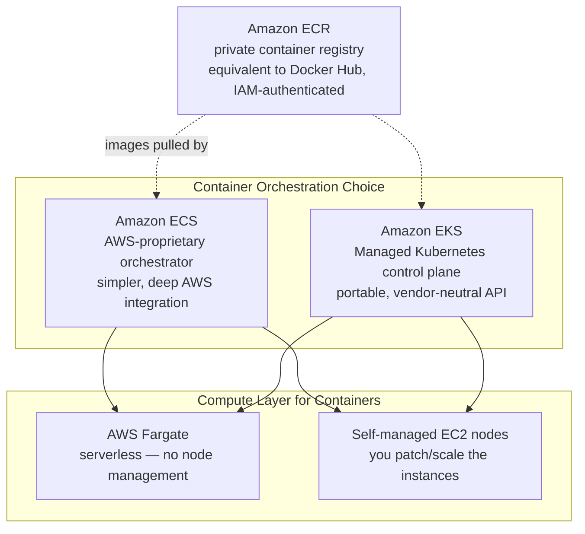
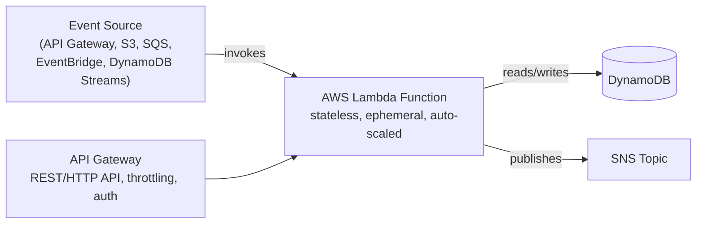
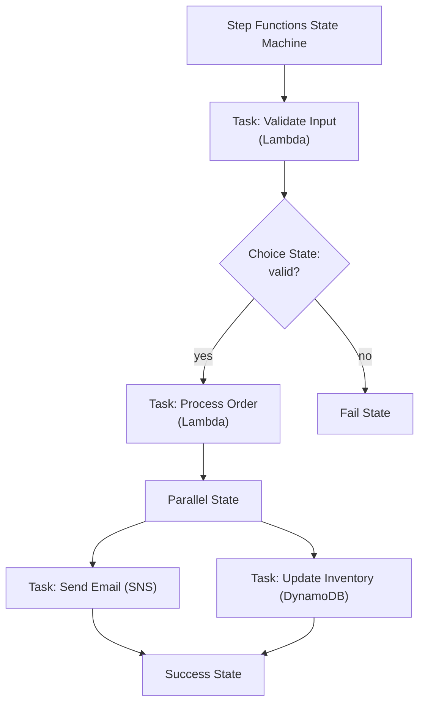
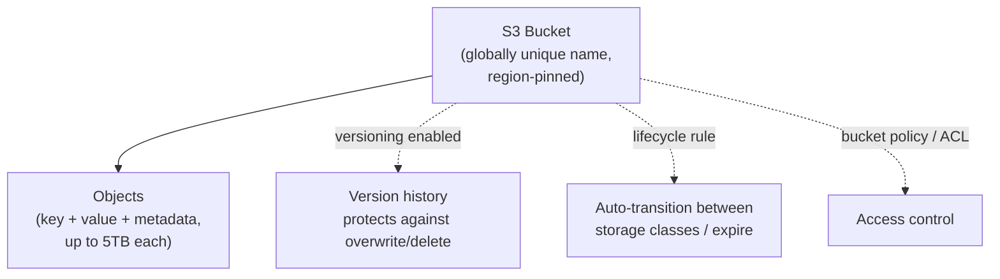
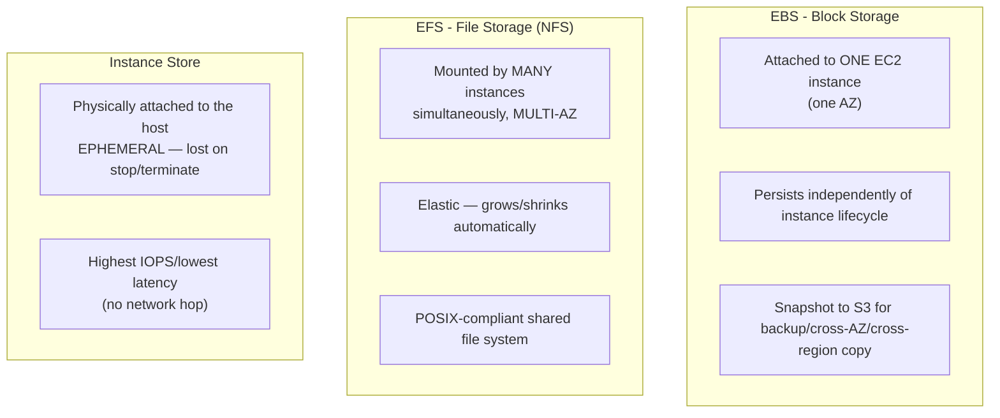

# 4. Containers — ECS, EKS, Fargate, ECR



| | ECS | EKS |
|---|---|---|
| Control plane | AWS-proprietary | **Kubernetes** (upstream-compatible API) |
| Portability | AWS-only | Portable — same manifests work on GKE/AKS/on-prem |
| Learning curve | Lower — AWS-native concepts (Task, Service, Cluster) | Higher — full K8s object model |
| Ecosystem | Smaller, AWS-curated | **Huge** — Helm, operators, CNCF tooling |
| Cost | No control-plane fee | ~$0.10/hr per cluster control plane |
| Best for | Teams fully committed to AWS, wanting simplicity | Teams needing portability, existing K8s expertise, or CNCF tooling |

## 4.1 Fargate vs EC2 Launch Type

> [!info] Concept
> This choice is orthogonal to ECS vs EKS — it's about **who manages the underlying compute**.

| | Fargate | EC2 Launch Type |
|---|---|---|
| Node management | **None** — AWS provisions per-task/per-pod compute | You manage the ASG/node group (patching, scaling, AMIs) |
| Billing | Per vCPU/memory-second requested by the task/pod | Per EC2 instance-hour, regardless of packing efficiency |
| Bin-packing control | None — no visibility into underlying host | Full — you can optimize instance size vs workload density |
| DaemonSets (EKS) | **Not supported** | Supported |
| Use for | Variable/bursty workloads, minimizing ops overhead | Dense packing for cost efficiency, DaemonSets, GPU workloads |

## 4.2 ECS Core Objects (for comparison against K8s vocabulary)

| ECS term | Kubernetes equivalent | Notes |
|---|---|---|
| Task Definition | Pod spec (template) | JSON, defines containers/resources/roles |
| Task | Pod | A running instance of a Task Definition |
| Service | Deployment + Service | Maintains desired task count, integrates with ALB |
| Cluster | Node pool / cluster | Logical grouping of compute capacity |
| Task Role | Kubernetes ServiceAccount + IAM (via IRSA) | IAM permissions for the running container |

> [!example] YAML Manifest — ECS Task Definition (JSON)
> ```json
> {
>   "family": "vote-app",
>   "networkMode": "awsvpc",
>   "requiresCompatibilities": ["FARGATE"],
>   "cpu": "256",
>   "memory": "512",
>   "executionRoleArn": "arn:aws:iam::123456789012:role/ecsTaskExecutionRole",
>   "taskRoleArn": "arn:aws:iam::123456789012:role/voteAppTaskRole",
>   "containerDefinitions": [
>     {
>       "name": "vote",
>       "image": "123456789012.dkr.ecr.eu-west-1.amazonaws.com/vote:v1",
>       "portMappings": [{"containerPort": 80}],
>       "logConfiguration": {
>         "logDriver": "awslogs",
>         "options": {"awslogs-group": "/ecs/vote", "awslogs-region": "eu-west-1"}
>       }
>     }
>   ]
> }
> ```

> [!tip] Best Practice
> Push images to **ECR**, not Docker Hub, for anything running in AWS — private by default, IAM-authenticated (no separate registry credentials to manage), integrated vulnerability scanning, and lifecycle policies to auto-expire old tags.

### Self-Check Q&A — Containers
> [!question]- 1. Your team already has deep Kubernetes expertise and multi-cloud ambitions. Which should you pick, ECS or EKS, and why?
> **EKS** — it exposes the standard Kubernetes API, so existing manifests, Helm charts, and operator knowledge transfer directly, and workloads remain portable to other clouds or on-prem clusters if the multi-cloud strategy materializes.

> [!question]- 2. Why can't you run a logging DaemonSet on Fargate-backed EKS nodes?
> Fargate provisions isolated per-Pod micro-VMs with no shared underlying node you have access to — DaemonSets require a persistent node to schedule one Pod per node onto, which doesn't exist as a concept under Fargate. Sidecar containers or a separate EC2 node group are the workarounds.

> [!question]- 3. What's the difference between an ECS Task Role and Task Execution Role, mapped to Kubernetes concepts?
> Task Role ≈ what a Pod's ServiceAccount (via IRSA) can do — the app's own AWS permissions. Task Execution Role ≈ permissions the *kubelet/container runtime* would need — pulling the image, writing logs — infrastructure-level, not application-level.

---

# 5. Serverless — Lambda, API Gateway, Step Functions



> [!info] Concept
> Lambda runs your code in response to events, scales automatically per-request, and you pay only for execution time (ms-level billing) — there's no server to provision, patch, or scale. It's the ultimate expression of the Shared Responsibility Model shifting toward AWS.

| Concept | Detail |
|---|---|
| **Cold start** | First invocation (or after scale-to-zero) pays a startup penalty — worse for large deployment packages, VPC-attached functions, and heavier runtimes (Java > Node/Python) |
| **Concurrency** | Number of simultaneous executions; **Reserved Concurrency** caps/guarantees capacity per function; **Provisioned Concurrency** pre-warms instances to eliminate cold starts |
| **Timeout** | Max 15 minutes per invocation — anything longer needs Step Functions, ECS, or Batch |
| **Layers** | Shared code/dependencies packaged separately, attached to multiple functions |

> [!warning] Watch Out
> A Lambda inside a VPC needs an **ENI (Elastic Network Interface)** to reach VPC resources — historically a major cold-start/cost pain point. Modern Hyperplane ENIs mostly fixed this, but VPC-attached Lambdas calling the public internet still need a **NAT Gateway** — a classic "why can't my Lambda reach the internet" bug.

## 5.1 Step Functions — Orchestrating Serverless Workflows



> [!tip] Best Practice
> Step Functions is the serverless equivalent of a Kubernetes **Job/CronJob DAG orchestration** need — use it instead of chaining Lambdas together with SQS/manual polling when you need visual workflow state, built-in retries/error handling, and human-readable audit trails of a multi-step process.

### Self-Check Q&A — Serverless
> [!question]- 1. Why would a Lambda function attached to a VPC fail to reach an external API, and what fixes it?
> By default, VPC-attached Lambdas only have private subnet routing — no path to the internet. Fix: route the Lambda's subnet through a **NAT Gateway** in a public subnet, or avoid VPC attachment entirely if the function doesn't need to reach VPC-private resources.

> [!question]- 2. When should you reach for Step Functions instead of a Lambda calling other Lambdas directly?
> When the workflow has multiple sequential/parallel/conditional steps that need visual state tracking, built-in retry/catch semantics per step, and long-running durations beyond Lambda's 15-minute cap — Step Functions externalizes the orchestration logic instead of burying it in application code.

---

# 6. Storage — S3, EBS, EFS, FSx

## 6.1 Amazon S3 — Object Storage



### Storage Classes

| Class | Retrieval | Min duration | Use case |
|---|---|---|---|
| **S3 Standard** | Instant | None | Frequently accessed data |
| **S3 Intelligent-Tiering** | Instant | None | Unknown/changing access patterns — auto-optimizes cost |
| **S3 Standard-IA** | Instant | 30 days | Infrequent access, still needs fast retrieval |
| **S3 One Zone-IA** | Instant | 30 days | Infrequent, re-creatable data (single AZ = cheaper, less durable) |
| **S3 Glacier Instant Retrieval** | Instant | 90 days | Archive needing millisecond access |
| **S3 Glacier Flexible Retrieval** | Minutes–hours | 90 days | Archive, occasional access |
| **S3 Glacier Deep Archive** | 12 hours | 180 days | Long-term compliance archive, cheapest |

> [!tip] Best Practice
> Attach a **Lifecycle Policy** to auto-transition objects (e.g., Standard → IA after 30 days → Glacier after 90 → delete after 365) instead of manually managing storage class — this is the S3 equivalent of a `rollout restart` cron: set it once, let policy do the work.

### S3 Consistency & Durability

> [!info] Concept
> S3 provides **strong read-after-write consistency** for all operations (as of Dec 2020) — a `PUT` followed immediately by a `GET` always returns the latest data, no eventual-consistency race condition to design around. Durability is **11 nines (99.999999999%)** via automatic redundancy across ≥3 AZs within the region (Standard/IA classes).

> [!warning] Watch Out
> **Versioning + MFA Delete** is the real protection against accidental/malicious object deletion — a bucket policy alone doesn't stop an authorized-but-mistaken `DeleteObject` call. Once enabled, versioning cannot be *disabled*, only suspended — plan for the storage cost of retained old versions.

### S3 Security Layers

| Layer | Scope | Mechanism |
|---|---|---|
| **Block Public Access** | Account or bucket | Blanket override — prevents public exposure regardless of policy/ACL |
| **Bucket Policy** | Bucket | JSON resource policy — can grant cross-account access |
| **IAM Policy** | Identity | What the calling user/role can do |
| **ACL** *(legacy, mostly disabled by default now)* | Object/bucket | Older grant mechanism, avoid for new buckets |
| **Encryption** | Object | SSE-S3 (AWS-managed key), SSE-KMS (customer-managed key, audit trail), SSE-C (customer-supplied key), or client-side |

## 6.2 EBS vs EFS vs Instance Store vs FSx



| | EBS | EFS | Instance Store |
|---|---|---|---|
| Scope | Single AZ, single instance (at a time) | Multi-AZ, many instances concurrently | Single instance, ephemeral |
| Persistence | Survives instance stop/terminate (if not deleted) | Fully independent lifecycle | **Lost** on stop/terminate |
| Analogy | PersistentVolume (RWO) | PersistentVolume (RWX / NFS) | emptyDir |
| Use for | Boot volumes, databases | Shared config, CMS uploads, ML training data | Scratch/cache, high-IOPS temp data |

> [!tip] Best Practice
> This maps directly onto the Kubernetes storage model you already know: **EBS ≈ ReadWriteOnce PV**, **EFS ≈ ReadWriteMany PV**, **Instance Store ≈ emptyDir**. In EKS, the AWS EBS CSI driver and EFS CSI driver are literally how PVCs get backed by these services.

### Self-Check Q&A — Storage
> [!question]- 1. You need shared, POSIX-compliant storage mounted concurrently by 20 EC2 instances across 3 AZs. Which service, and why not EBS?
> **EFS** — it's a network file system designed for concurrent multi-AZ, multi-instance mounts. EBS volumes attach to exactly one instance at a time within a single AZ (except Multi-Attach, a narrow io1/io2 feature) — wrong shape for this requirement.

> [!question]- 2. Why is S3 Versioning + MFA Delete considered stronger protection than a restrictive bucket policy alone?
> A bucket policy only controls *who* can call `DeleteObject` — an authorized user with a policy-granted delete permission (or a compromised credential) can still delete data. Versioning retains prior object versions even after deletion (a delete just adds a delete marker), and MFA Delete adds a hard requirement for physical MFA token approval before a version or the versioning state itself can be permanently removed.

> [!question]- 3. What determines whether data survives an EC2 instance stop vs terminate, for EBS-backed vs Instance-Store-backed instances?
> EBS-backed: root/attached EBS volumes persist through `stop` (data intact) and can persist through `terminate` if `DeleteOnTermination` is false. Instance Store: data is physically tied to the host hardware and is **always lost** on both `stop` and `terminate` — there's no way to preserve it, only snapshot beforehand to something else.

---
