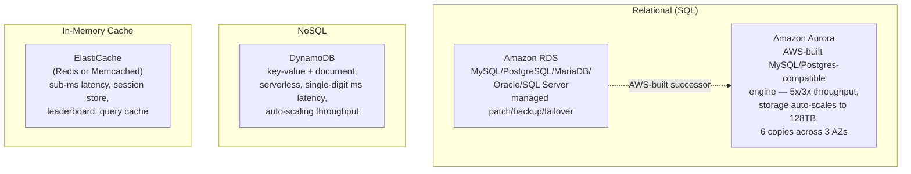
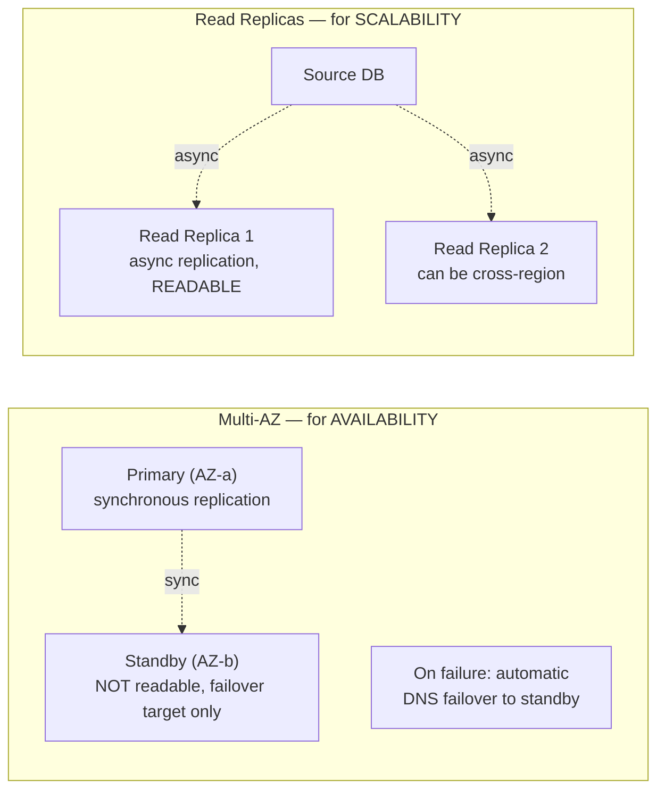
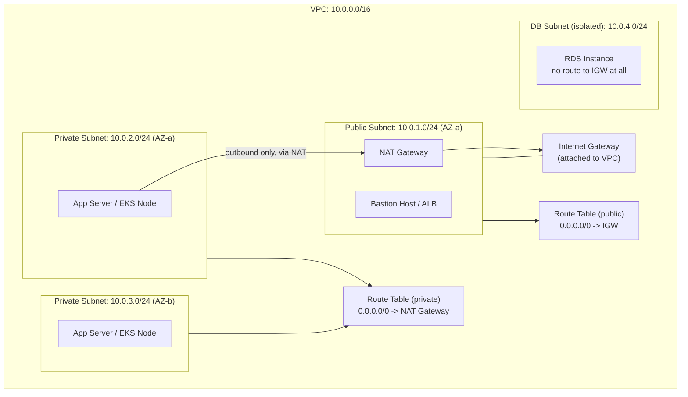
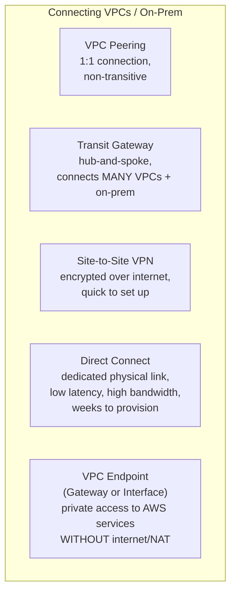
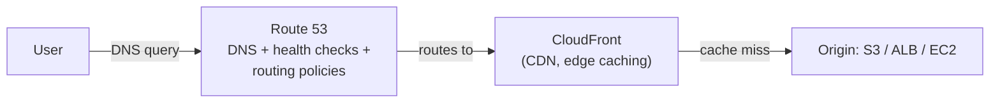

# 7. Databases — RDS, Aurora, DynamoDB, ElastiCache

## 7.1 RDS Multi-AZ vs Read Replicas

> [!warning] Watch Out — The #1 RDS Confusion
> These solve **different problems** and are often both needed together.

| | Multi-AZ | Read Replica |
|---|---|---|
| Purpose | **High availability / DR** | **Read scalability / offloading** |
| Replication | Synchronous | Asynchronous |
| Standby readable? | **No** | **Yes** — serves read traffic |
| Failover | Automatic (DNS switch, ~1-2 min) | Manual promotion required |
| Cross-region? | No (Multi-AZ is intra-region) | Yes, supported |

## 7.2 DynamoDB Core Concepts

| Concept | Detail |
|---|---|
| **Partition Key** | Determines which physical partition stores the item — choose high-cardinality keys to avoid hot partitions |
| **Sort Key** *(optional)* | Combined with partition key for composite primary key, enables range queries |
| **Read/Write Capacity** | On-Demand (pay-per-request, auto-scales) or Provisioned (set RCU/WCU, cheaper at steady predictable load) |
| **DynamoDB Streams** | Change-data-capture feed — triggers Lambda on item insert/update/delete |
| **Global Tables** | Multi-region, multi-active replication — for globally distributed low-latency access |
| **DAX (DynamoDB Accelerator)** | In-memory read-through cache, microsecond latency |

> [!warning] Watch Out — Hot Partitions
> A poorly chosen partition key (e.g., a `status` field with only 3 possible values across millions of items) concentrates all traffic onto a handful of physical partitions, throttling requests regardless of overall provisioned capacity. Always design partition keys around **access pattern cardinality**, not just what seems like a "natural" identifier.

### Self-Check Q&A — Databases
> [!question]- 1. Your app is read-heavy and you want to reduce load on the primary database without changing failover behavior. Multi-AZ or Read Replica?
> **Read Replica** — it's specifically for offloading read traffic (standby in Multi-AZ isn't queryable). You could layer both: Multi-AZ for HA/failover, plus one or more Read Replicas for read scaling — they're complementary, not mutually exclusive.

> [!question]- 2. Why might a DynamoDB table with plenty of provisioned capacity still throttle requests under real traffic?
> A hot partition — if the partition key has low cardinality or traffic skews heavily toward a few key values, those specific physical partitions get overwhelmed even though the table's *aggregate* capacity is sufficient. The fix is redesigning the key schema, not raising capacity.

> [!question]- 3. When would you choose Aurora over standard RDS MySQL?
> When you need higher throughput (Aurora claims ~5x MySQL), storage that auto-scales up to 128TB without manual provisioning, faster failover (typically <30s via Aurora Replicas), and you're not tied to a database engine RDS doesn't have an Aurora-compatible version of (Aurora only supports MySQL- and PostgreSQL-compatible modes).

---

# 8. Networking — VPC Deep Dive, Route 53, CloudFront

## 8.1 VPC Anatomy

| Component | Role |
|---|---|
| **VPC** | Isolated virtual network, defined by a CIDR block (e.g., `10.0.0.0/16`) |
| **Subnet** | Slice of the VPC CIDR, pinned to **one AZ** |
| **Internet Gateway (IGW)** | Attached to the VPC; enables bidirectional internet access for public subnets |
| **NAT Gateway** | Sits in a public subnet; lets **private** subnet resources initiate outbound internet traffic without being reachable from outside |
| **Route Table** | Determines where subnet traffic goes; "public" vs "private" subnet is defined ENTIRELY by its route table (does it route `0.0.0.0/0` to an IGW or a NAT?) |

> [!info] Concept
> A subnet is "public" purely because its route table sends `0.0.0.0/0` traffic to an Internet Gateway — there's no separate "public subnet" flag. This is a common misconception; the distinction is 100% about routing, not a subnet property.

## 8.2 Security Groups vs Network ACLs

| | Security Group | Network ACL (NACL) |
|---|---|---|
| Level | **Instance/ENI-level** | **Subnet-level** |
| Statefulness | **Stateful** — return traffic auto-allowed | **Stateless** — must explicitly allow both directions |
| Rules | Allow only (no explicit deny) | Allow AND Deny rules, evaluated in **rule number order** |
| Default | Deny all inbound, allow all outbound | Allow all in and out (default NACL) |
| Scope | Attached to specific resources | Applies to every resource in the subnet |

> [!warning] Watch Out
> Because NACLs are **stateless**, an inbound-allow rule for port 443 doesn't automatically permit the response traffic back out — you need a corresponding outbound rule for the ephemeral port range (1024-65535) too. This is the classic "Security Group looks right, but the subnet's NACL is silently dropping return traffic" debugging trap.

## 8.3 VPC Connectivity Options

| Option | Topology | Best for |
|---|---|---|
| **VPC Peering** | 1:1, **non-transitive** (A↔B and B↔C does NOT give A↔C) | Small number of VPCs needing direct connectivity |
| **Transit Gateway** | Hub-and-spoke, transitive | Many VPCs / accounts / on-prem sites — scales where peering becomes unmanageable (N² problem) |
| **Site-to-Site VPN** | Encrypted tunnel over public internet | Quick, cheaper on-prem connectivity, backup path for Direct Connect |
| **Direct Connect** | Dedicated physical fiber link | Consistent low latency/high bandwidth, large steady data transfer, compliance requiring non-internet paths |
| **VPC Endpoint** | Private route to an AWS service (S3, DynamoDB via Gateway; most others via Interface/PrivateLink) | Avoid NAT Gateway costs and internet exposure for AWS API traffic from private subnets |

> [!tip] Best Practice
> VPC Peering's non-transitivity is the classic scaling trap — 10 VPCs needing full mesh connectivity require 45 peering connections. **Transit Gateway** collapses this to 10 attachments and adds centralized routing control — always the right call once you're managing more than a handful of VPCs.

## 8.4 Route 53 & CloudFront

### Route 53 Routing Policies

| Policy | Behavior |
|---|---|
| **Simple** | One record, no health checks, no logic |
| **Weighted** | Split traffic by percentage — canary/blue-green testing |
| **Latency-based** | Route to the region with lowest latency for the user |
| **Failover** | Active-passive — route to secondary only if primary health check fails |
| **Geolocation** | Route based on user's geographic location |
| **Geoproximity** | Route based on geographic distance, with bias adjustment |
| **Multi-value Answer** | Return multiple healthy IPs, client-side selection (like DNS-based load balancing) |

> [!tip] Best Practice
> Weighted routing is how you do a **DNS-level canary release** — send 5% of traffic to a new version's endpoint, watch CloudWatch metrics, dial the weight up gradually. This is the AWS-networking-layer equivalent of a Kubernetes rolling update's `maxSurge`, just operating at DNS instead of Pod replacement.

### Self-Check Q&A — Networking
> [!question]- 1. What makes a subnet "public" in AWS — is it a flag you set on the subnet itself?
> No — there's no such flag. A subnet is public purely because its associated **route table** sends `0.0.0.0/0` traffic to an **Internet Gateway**. Attach a different route table (pointing to a NAT Gateway instead) and the same subnet becomes private.

> [!question]- 2. Traffic is allowed by the Security Group but still isn't reaching the instance. What subnet-level construct should you check next, and why?
> The **Network ACL** — unlike stateful Security Groups, NACLs are stateless and require explicit allow rules for BOTH inbound and outbound (including the ephemeral return-traffic port range). A missing outbound NACL rule silently drops return packets even when the Security Group and inbound NACL rule are correct.

> [!question]- 3. You have 15 VPCs that all need to talk to each other. Why is VPC Peering the wrong tool, and what should you use instead?
> VPC Peering is non-transitive and 1:1 — full mesh connectivity for 15 VPCs would require 105 individual peering connections, an operational nightmare to manage and audit. **Transit Gateway** provides hub-and-spoke transitive routing, reducing this to 15 attachments with centralized route table control.

---
