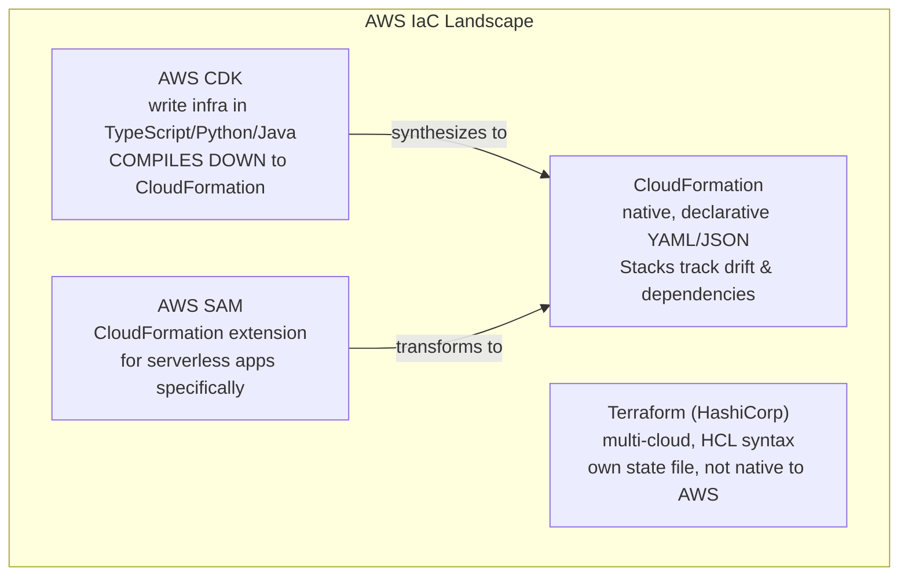
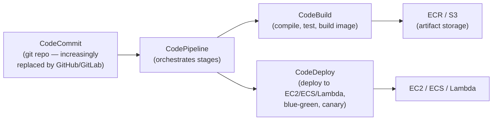
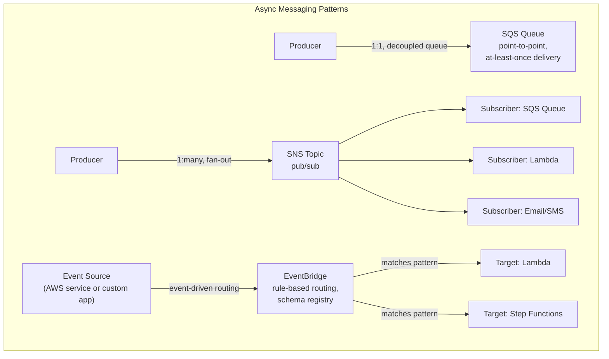
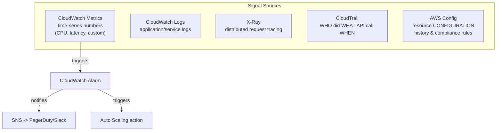

# 9. IaC & CI/CD — CloudFormation, CDK, CodePipeline

## 9.1 Infrastructure as Code Options



| Tool | Native to AWS? | Language | State management | Multi-cloud? |
|---|---|---|---|---|
| **CloudFormation** | Yes | YAML/JSON | AWS-managed (Stacks) | No |
| **CDK** | Yes (compiles to CFN) | TypeScript/Python/Java/Go | Inherits CFN state | No |
| **SAM** | Yes (CFN extension) | YAML | Inherits CFN state | No (serverless-focused) |
| **Terraform** | No (third-party) | HCL | Self-managed state file (often in S3+DynamoDB lock) | **Yes** |

> [!info] Concept
> CloudFormation's core value is that it's **declarative and stateful like Kubernetes manifests** — you describe desired infrastructure, submit a "Stack," and CloudFormation diffs against current state to compute a change set, exactly like `kubectl apply` diffing against etcd.

> [!example] YAML Manifest — CloudFormation Stack (simplified)
> ```yaml
> AWSTemplateFormatVersion: "2010-09-09"
> Resources:
>   AppBucket:
>     Type: AWS::S3::Bucket
>     Properties:
>       BucketName: my-app-artifacts
>       VersioningConfiguration:
>         Status: Enabled
>   AppInstance:
>     Type: AWS::EC2::Instance
>     Properties:
>       InstanceType: t3.micro
>       ImageId: ami-0abcdef1234567890
>       IamInstanceProfile: !Ref AppInstanceProfile
> Outputs:
>   BucketName:
>     Value: !Ref AppBucket
> ```

> [!warning] Watch Out
> A CloudFormation Stack **drifts** when someone manually edits a resource in the console/CLI outside of the template — `Detect Drift` catches this, but nothing prevents it proactively. This is the AWS analogue of a Kubernetes controller reconciling away manual `kubectl edit` changes — except CloudFormation does NOT auto-correct drift, it only reports it. Treat the console as read-only for anything managed by IaC.

## 9.2 CI/CD Pipeline Services



| Service | Role | Kubernetes/general analogy |
|---|---|---|
| **CodeCommit** | Git-hosted source repo | GitHub/GitLab |
| **CodePipeline** | Orchestrates multi-stage release workflow | Argo Workflows / GitHub Actions workflow |
| **CodeBuild** | Managed build/test compute (Docker-based) | A CI runner (GitHub Actions runner, GitLab runner) |
| **CodeDeploy** | Automates deployment with health-checked rollout strategies | A Deployment's rolling-update controller |
| **CodeArtifact** | Private package repository (npm, Maven, PyPI, etc.) | Artifactory/Nexus equivalent |

### CodeDeploy Deployment Strategies

| Strategy | Behavior |
|---|---|
| **In-place** | Update existing instances directly (EC2 only) — downtime risk |
| **Blue/Green** | Stand up a fully new environment, cut traffic over, keep old for rollback | 
| **Canary (Lambda/ECS)** | Shift a small % of traffic first, then the rest after a bake period |
| **Linear (Lambda/ECS)** | Shift traffic in equal increments over time |

> [!tip] Best Practice
> This maps directly to what you already know from Kubernetes rollouts: **Blue/Green ≈ standing up a new ReplicaSet fully before cutting over** (no `maxSurge`/`maxUnavailable` gradualism), while **Canary/Linear ≈ a controlled rolling update with explicit traffic-shift steps** — CodeDeploy just adds automated health-check gating and one-command rollback on top.

### Self-Check Q&A — IaC & CI/CD
> [!question]- 1. Why is manually editing a CloudFormation-managed resource in the console dangerous, and does CloudFormation fix it automatically?
> It causes **drift** — the actual resource state no longer matches the template's declared state. Unlike a Kubernetes controller, CloudFormation does **not** auto-correct drift on its own; it only detects and reports it via `Detect Drift`. The next Stack update can also produce unexpected results if it doesn't account for the manual change.

> [!question]- 2. When would you choose CDK over raw CloudFormation YAML?
> When you want to express infrastructure using a real programming language's abstractions — loops, conditionals, reusable classes/constructs, type checking, and unit tests — rather than YAML templating tricks (`Fn::If`, nested stacks) for anything non-trivial. CDK still ultimately synthesizes to CloudFormation, so all the same Stack/drift semantics apply underneath.

> [!question]- 3. What's the key difference between CodeDeploy's Blue/Green and Canary strategies?
> Blue/Green cuts traffic over to the fully-new environment essentially all at once after it's verified healthy (fast rollback = just flip back). Canary shifts a small percentage of traffic first, bakes for a defined period to watch for errors, then proceeds — trading a slower rollout for earlier detection of a bad release with less blast radius.

---

# 10. Messaging & Integration — SQS, SNS, EventBridge, Kinesis



| Service | Pattern | Delivery | Use case |
|---|---|---|---|
| **SQS** | Point-to-point queue | At-least-once (Standard), exactly-once (FIFO) | Decouple producer/consumer, buffer bursts, worker queues |
| **SNS** | Pub/sub fan-out | At-least-once | Broadcast one event to many subscribers simultaneously |
| **EventBridge** | Event bus with routing rules | At-least-once | Complex event-driven architectures, SaaS integrations, scheduled rules |
| **Kinesis Data Streams** | Ordered, replayable stream | Ordered per shard | Real-time analytics, log/clickstream processing at scale |

> [!info] Concept
> **SQS decouples** producer and consumer in time — the producer doesn't need the consumer to be available right now; messages wait in the queue. This is the messaging equivalent of what the Voting App's `redis` queue does between `vote` and `worker` in the Kubernetes course — SQS is simply the managed, durable, AWS-native version of that same pattern.

| SQS Standard | SQS FIFO |
|---|---|
| At-least-once delivery (possible duplicates) | Exactly-once processing |
| Best-effort ordering | Strict ordering within a Message Group |
| Nearly unlimited throughput | Limited throughput (300-3000 msg/s depending on batching) |

> [!warning] Watch Out — SQS Visibility Timeout
> When a consumer receives a message, it becomes **invisible** to other consumers for the `VisibilityTimeout` duration — not deleted. If the consumer crashes before calling `DeleteMessage`, the message reappears after the timeout for another consumer to pick up. Set the timeout too short and a slow-but-healthy consumer causes duplicate processing; too long and a crashed consumer's message sits idle before retry.

### Self-Check Q&A — Messaging
> [!question]- 1. A single event needs to trigger three completely independent downstream processes. SQS or SNS?
> **SNS** — it's built for fan-out pub/sub, delivering the same message to multiple independent subscribers simultaneously. SQS is point-to-point; you'd need one queue per consumer and manual duplication logic, which is exactly what SNS→multiple SQS subscriptions solves natively.

> [!question]- 2. Why might a message get processed twice even though the consumer successfully finished processing it?
> If the consumer finishes work but crashes or is too slow to call `DeleteMessage` before the **Visibility Timeout** expires, SQS assumes the message wasn't handled and makes it visible again for redelivery — a timeout misconfigured shorter than actual processing time is the classic cause of unexpected duplicate processing on SQS Standard queues.

---

# 11. Observability — CloudWatch, CloudTrail, X-Ray, Config



| Service | Answers | Analogy from K8s world |
|---|---|---|
| **CloudWatch Metrics** | "How is it performing?" (CPU, latency, error rate) | `kubectl top`, Prometheus metrics |
| **CloudWatch Logs** | "What did it say?" | `kubectl logs` |
| **CloudWatch Alarms** | "Should someone/something react?" | Alertmanager / HPA trigger |
| **X-Ray** | "Where's the request spending time across services?" | Distributed tracing (Jaeger/Zipkin equivalent) |
| **CloudTrail** | "Who made this API call, and when?" (audit log of AWS API activity itself) | Kubernetes audit logs |
| **AWS Config** | "What did this resource's configuration look like at time T, and does it comply with a rule?" | Policy-as-code / OPA Gatekeeper for AWS resources |

> [!warning] Watch Out — CloudTrail vs CloudWatch Logs, the #1 Confusion
> **CloudTrail logs API calls made TO AWS** (who called `RunInstances`, who deleted a bucket) — it's an audit trail of control-plane actions. **CloudWatch Logs holds application/service output** (what your app printed, ALB access logs, VPC Flow Logs). They answer completely different questions and neither substitutes for the other — a security investigation into "who deleted this resource" needs CloudTrail; debugging "why did my app 500" needs CloudWatch Logs.

> [!tip] Best Practice
> Enable a CloudTrail **Organization Trail** logging to a centralized, access-restricted S3 bucket in a dedicated logging account, with **log file validation** enabled — this is your tamper-evident forensic record and should never be something a compromised workload account can delete or disable.

### Self-Check Q&A — Observability
> [!question]- 1. Someone deleted a production S3 bucket. Which service tells you WHO did it, and which service would show what the bucket's configuration looked like beforehand?
> **CloudTrail** identifies who made the `DeleteBucket` API call and when. **AWS Config** shows the resource's configuration history and can flag the change as non-compliant if a rule required deletion protection or specific settings.

> [!question]- 2. Why isn't CloudWatch Logs sufficient for a security audit of "who changed this IAM policy"?
> CloudWatch Logs captures application/infrastructure *output* (what services print), not a record of the AWS API control-plane action itself. Only **CloudTrail** records the actual `PutUserPolicy`/`AttachRolePolicy` API call, the identity that made it, the source IP, and the timestamp — it's purpose-built as the audit trail for AWS account activity.

---
