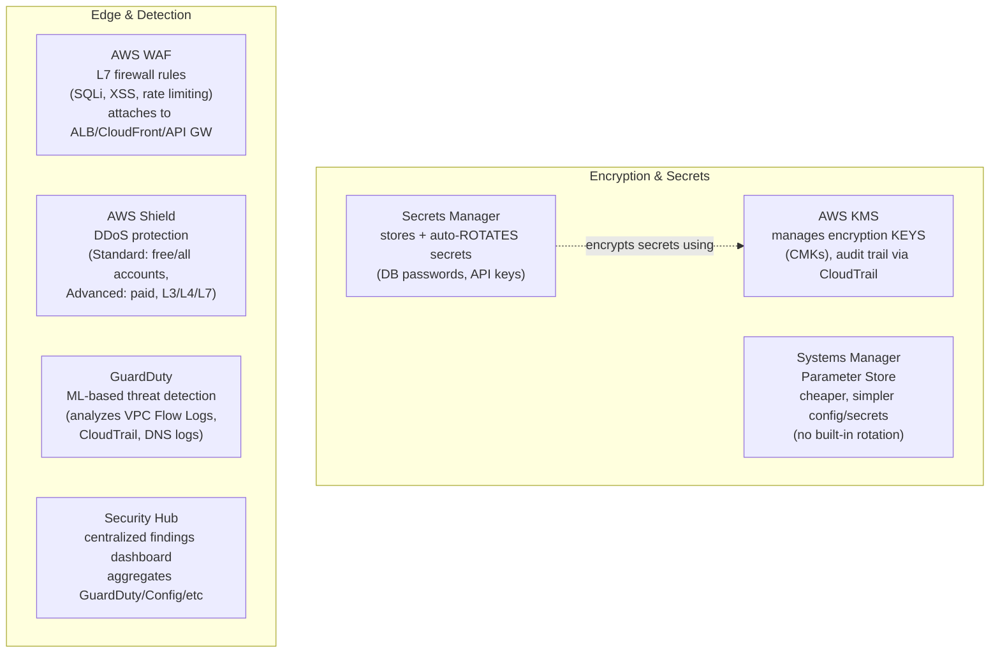
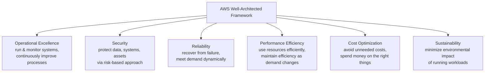
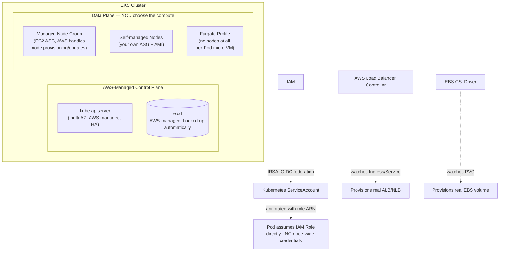
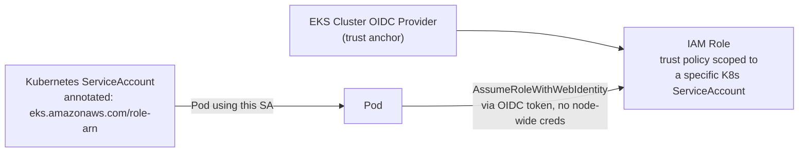

# 12. Security — KMS, Secrets Manager, WAF, GuardDuty



| Service | Purpose | Key distinction |
|---|---|---|
| **KMS** | Manage & audit encryption keys | The **key management** layer underneath S3/EBS/RDS encryption |
| **Secrets Manager** | Store secrets with **automatic rotation** | Costs more than Parameter Store, but rotation is built-in (e.g., auto-rotates an RDS password on a schedule) |
| **Parameter Store** | Store config/secrets, no native rotation | Cheaper, simpler, fine for static config or when rotation is handled elsewhere |
| **WAF** | Block malicious HTTP requests at L7 | Rules engine for SQLi/XSS/rate-limiting — sits in front of ALB/CloudFront/API Gateway |
| **Shield Standard** | Basic DDoS protection | Automatic, free, on every AWS account |
| **Shield Advanced** | Enhanced DDoS protection + cost protection + 24/7 DRT support | Paid, for internet-facing critical workloads |
| **GuardDuty** | Continuous threat detection | Analyzes VPC Flow Logs, CloudTrail, DNS logs for anomalies (crypto-mining, credential compromise, recon) |
| **Security Hub** | Aggregated compliance/finding dashboard | Doesn't detect anything itself — centralizes findings from GuardDuty, Config, Inspector, etc. |

> [!tip] Best Practice
> Use **Secrets Manager** for anything needing automatic rotation (database credentials especially — a stale, never-rotated DB password sitting in Parameter Store for years is a common audit finding). Use **Parameter Store** for everything else to control cost — it supports encryption via KMS too, just without the rotation automation.

### Self-Check Q&A — Security
> [!question]- 1. Why choose Secrets Manager over Parameter Store for a database password, despite the higher cost?
> Secrets Manager provides **native automatic rotation** — it can be configured to rotate an RDS password on a schedule via a built-in Lambda rotation function, updating both the secret and the database simultaneously. Parameter Store stores the value securely but has no built-in rotation mechanism — you'd have to build that automation yourself.

> [!question]- 2. What's the functional difference between GuardDuty and Security Hub — are they redundant?
> Not redundant — they're different layers. **GuardDuty** is a detection engine that actively analyzes logs (VPC Flow Logs, CloudTrail, DNS) for threats using ML/threat intelligence. **Security Hub** doesn't detect anything on its own — it's an aggregation and dashboard layer that pulls findings from GuardDuty (and Config, Inspector, Macie, etc.) into one place for centralized triage and compliance scoring.

---

# 13. Cost Management

| Tool | Purpose |
|---|---|
| **Cost Explorer** | Visualize/analyze historical spend, forecast future costs |
| **AWS Budgets** | Set spend thresholds, alert (or trigger actions) when exceeded/forecasted to exceed |
| **Cost & Usage Report (CUR)** | Most granular billing data export, for custom analysis/BI tooling |
| **Trusted Advisor** | Automated checks across cost, performance, security, fault tolerance, service limits |
| **Compute Optimizer** | ML-based rightsizing recommendations for EC2/EBS/Lambda |

| Discount mechanism | How it works |
|---|---|
| **Reserved Instances** | Commit to specific instance family/region for 1-3yr, up to ~72% off |
| **Savings Plans** | Commit to a $/hour spend for 1-3yr, flexible across instance types/regions/even Fargate & Lambda |
| **Spot Instances** | Bid on spare capacity, up to 90% off, interruptible |
| **Volume Discounts** | Automatic — S3/data transfer gets cheaper per-GB at higher usage tiers |

> [!tip] Best Practice — DevOps Cost Tagging
> Tag every resource with `Environment`, `Team`, `CostCenter`, and `Project` at creation time (bake it into your CloudFormation/CDK/Terraform templates) — untagged resources are nearly impossible to attribute in Cost Explorer after the fact, and this is consistently the #1 blocker to any meaningful cost-allocation effort.

### Self-Check Q&A — Cost
> [!question]- 1. You have a steady-state production fleet running 24/7 for the next 2 years and unpredictable CI build spikes. What purchasing options fit each?
> Production fleet → **Reserved Instances or Savings Plans** (known, steady, long-term = maximum discount). CI build spikes → **Spot Instances** in an Auto Scaling Group (unpredictable, fault-tolerant, restart-friendly = best fit for interruptible capacity).

> [!question]- 2. Why is resource tagging described as a prerequisite for cost management rather than a nice-to-have?
> Cost Explorer and CUR can only attribute spend to a team/project/environment if resources carry consistent tags — untagged resources show up as unattributed spend with no way to retroactively determine ownership, making chargebacks, budget alerts per team, and waste identification effectively impossible.

---

# 14. Well-Architected Framework — Six Pillars



| Pillar | Core question | Example practice |
|---|---|---|
| **Operational Excellence** | Can you run and improve this reliably? | IaC, small frequent changes, runbooks, blameless post-mortems |
| **Security** | Is data/access protected? | Least-privilege IAM, encryption everywhere, defense in depth |
| **Reliability** | Will it recover from failure and meet demand? | Multi-AZ, auto-scaling, health checks, chaos testing |
| **Performance Efficiency** | Are you using the right resources efficiently? | Right-sizing, serverless where it fits, caching |
| **Cost Optimization** | Are you spending on the right things? | Tagging, Reserved/Spot mix, rightsizing, lifecycle policies |
| **Sustainability** | Is environmental impact minimized? | Rightsizing, managed services (shared efficiency), region selection |

> [!tip] Best Practice
> These six pillars are almost always in **tension** with each other (max Reliability costs more; max Cost Optimization risks Reliability) — the Well-Architected Framework isn't a checklist to max out on all six, it's a lens for making **conscious trade-offs** appropriate to each specific workload's actual requirements.

---

# 15. EKS Deep Dive — AWS for Kubernetes Engineers

> [!info] Concept
> If you already know vanilla Kubernetes (kubeadm/kind), EKS is the same Kubernetes API with AWS running (and often replacing) the control-plane components you learned about — plus AWS-specific glue for IAM, networking, and storage.



## 15.1 What AWS Manages vs What You Still Manage

| Component | Who manages it |
|---|---|
| kube-apiserver, etcd | **AWS** — fully managed, multi-AZ, patched |
| kube-scheduler, controller-manager | **AWS** |
| kubelet, kube-proxy, container runtime | **You** (Managed Node Group automates the lifecycle, but it's still your compute) — N/A entirely under Fargate |
| CNI plugin (networking) | **You choose** — default is the AWS VPC CNI |
| Add-ons (CoreDNS, metrics-server, ingress controller) | **You** (some available as EKS-managed add-ons for easier lifecycle) |

## 15.2 IRSA — IAM Roles for Service Accounts

> [!warning] Watch Out — The Old, Wrong Way
> Before IRSA, Pods commonly got AWS permissions by inheriting the **EC2 node's IAM role** — meaning every Pod on that node had the same AWS permissions, regardless of which team's workload it was. This violates least-privilege badly: a compromised low-privilege Pod could access anything the node's role allowed.



> [!tip] Best Practice
> **IRSA gives each Pod its own scoped IAM identity**, tied to its Kubernetes ServiceAccount, not the underlying node. This is the direct AWS-native answer to "how do I do least-privilege IAM per-microservice in Kubernetes" — the successor pattern is **EKS Pod Identity** (simpler setup, same underlying goal), which AWS now recommends over classic IRSA for new clusters.

> [!example] YAML Manifest — ServiceAccount with IRSA
> ```yaml
> apiVersion: v1
> kind: ServiceAccount
> metadata:
>   name: vote-sa
>   namespace: vote
>   annotations:
>     eks.amazonaws.com/role-arn: arn:aws:iam::123456789012:role/vote-app-role
> ---
> # then referenced in the Deployment:
> spec:
>   template:
>     spec:
>       serviceAccountName: vote-sa
> ```

## 15.3 EKS Networking — AWS VPC CNI

> [!info] Concept
> Unlike most CNI plugins (Calico, Flannel) that create an overlay network, the default **AWS VPC CNI** assigns each Pod a **real IP address from the VPC's CIDR range** — Pods are first-class VPC citizens, directly reachable from other VPC resources without any NAT/overlay translation.

| Implication | Detail |
|---|---|
| Pods consume real VPC IPs | Subnet sizing matters a LOT — undersized subnets cause `IP address exhausted` failures blocking new Pods |
| Security Groups can apply per-Pod | Via `SecurityGroupPolicy` — genuine AWS-native network segmentation down to the Pod level |
| NetworkPolicy still needed | AWS VPC CNI supports Kubernetes NetworkPolicy enforcement (via added components), but it's not automatic like some other CNIs |

> [!warning] Watch Out
> The classic EKS scaling failure: nodes report `Ready` and have CPU/memory headroom, but new Pods stay `Pending` because the node has **run out of assignable ENI/secondary-IP slots** from its VPC subnet — a completely different failure mode than the CPU/memory pressure you'd expect from vanilla Kubernetes, and it requires checking VPC subnet capacity, not `kubectl describe node` resource pressure.

## 15.4 Storage & Load Balancing Integration

| Kubernetes object | AWS controller | Provisions |
|---|---|---|
| PVC (`storageClassName: ebs-sc`) | **EBS CSI Driver** | Real EBS volume, attached to the node running the Pod |
| PVC (`storageClassName: efs-sc`) | **EFS CSI Driver** | Mount target on an existing EFS file system (multi-AZ, RWX) |
| Service `type: LoadBalancer` / Ingress | **AWS Load Balancer Controller** | Real ALB (from Ingress) or NLB (from Service type LoadBalancer) |

> [!tip] Best Practice
> None of these controllers ship with EKS by default except via EKS Add-ons or manual Helm install — a fresh EKS cluster with no add-ons installed will have `PersistentVolumeClaim`s stuck `Pending` and `LoadBalancer` Services stuck without an external IP until you deploy the relevant CSI driver / LB Controller. This trips up everyone coming from `kind`/`minikube`, where these often "just work" via built-in provisioners.

### Self-Check Q&A — EKS
> [!question]- 1. What's the security problem with letting Pods inherit their EC2 node's IAM role, and what replaces it?
> Every Pod scheduled on that node gets identical AWS permissions regardless of which workload/team it belongs to — a compromised or over-privileged Pod can access anything the node role allows, violating least privilege. **IRSA** (or the newer **EKS Pod Identity**) scopes IAM permissions to individual Kubernetes ServiceAccounts instead, so each Pod only gets exactly what its own workload needs.

> [!question]- 2. Nodes show `Ready` with plenty of free CPU/memory, but new Pods sit `Pending`. What EKS-specific cause should you check that wouldn't apply to a kind/kubeadm cluster?
> **VPC subnet IP exhaustion** — the AWS VPC CNI assigns each Pod a real VPC IP address via node ENIs, and a node can run out of assignable secondary IPs (or the subnet itself can run out of free addresses) well before it runs out of compute resources. Check subnet CIDR sizing and the node's available ENI/IP slots, not just `describe node` resource pressure.

> [!question]- 3. You create a `PersistentVolumeClaim` on a fresh EKS cluster and it stays `Pending` forever, even though the exact same manifest worked instantly on `kind`. Why?
> `kind` (and minikube) ship a default local-path storage provisioner out of the box. EKS does not auto-install the **EBS CSI Driver** — without deploying it (as an EKS Add-on or via Helm), there's no controller watching PVCs to provision real EBS volumes, so the claim has nothing to bind to and stays `Pending` indefinitely.

---
