---

## AWS Architecture — Deep Study Guide for DevOps Engineers
> [!info] Scope
> This is not exam prep — it's a systems-level map of AWS the way a DevOps engineer actually uses it: provisioning compute, running containers/K8s, wiring networks, automating deploys, and keeping the whole thing observable and secure. Depth ranges from foundational (Cloud Practitioner) through Associate/DevOps-relevant internals where it matters.

##  Map of this vault
```dataview
TABLE domain, depth
FROM #aws-study
SORT domain ASC
```

| # | Domain |
|---|---|
| 1 | Foundations — Shared Responsibility & Global Infrastructure |
| 2 | IAM — Identity & Access |
| 3 | Compute — EC2, Auto Scaling, Load Balancing |
| 4 | Containers — ECS, EKS, Fargate, ECR |
| 5 | Serverless — Lambda, API Gateway, Step Functions |
| 6 | Storage — S3, EBS, EFS, FSx |
| 7 | Databases — RDS, Aurora, DynamoDB, ElastiCache |
| 8 | Networking — VPC Deep Dive, Route 53, CloudFront |
| 9 | IaC & CI/CD — CloudFormation, CDK, CodePipeline |
| 10 | Messaging & Integration — SQS, SNS, EventBridge, Kinesis |
| 11 | Observability — CloudWatch, CloudTrail, X-Ray, Config |
| 12 | Security — KMS, Secrets Manager, WAF, GuardDuty |
| 13 | Cost Management |
| 14 | Well-Architected Framework |
| 15 | EKS Deep Dive — AWS for Kubernetes Engineers |

---

# 1. Foundations

## 1.1 The Shared Responsibility Model

> [!info] Concept
> AWS secures the cloud; **you** secure what's *in* the cloud. Where the line falls shifts depending on the service's abstraction level.

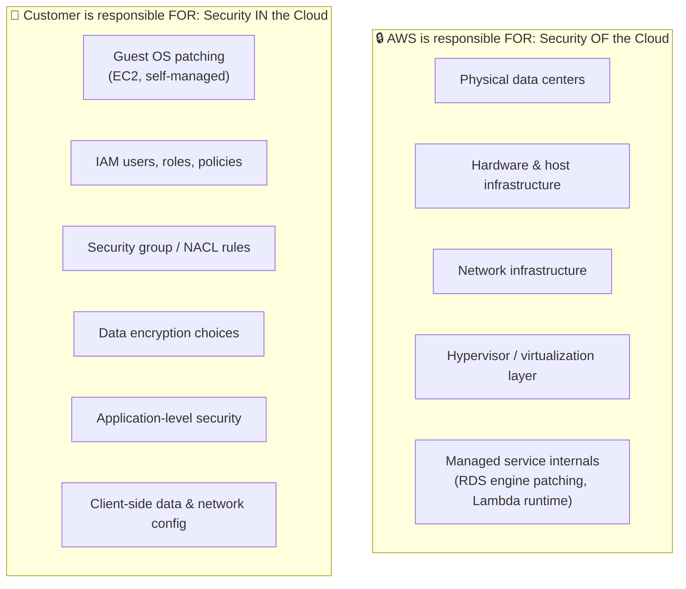

| Service model | AWS handles | You handle |
|---|---|---|
| **IaaS** (EC2) | Physical host, hypervisor, network | OS, patches, app, data, firewall rules |
| **PaaS/Managed** (RDS) | + engine install, patching, backups infra | Schema, queries, IAM access, data |
| **Serverless** (Lambda, DynamoDB) | + OS, runtime, scaling | Code, IAM permissions, data |

> [!warning] Watch Out
> The model doesn't disappear as you go "more managed" — it *shifts*. Even in Lambda, **you** are 100% responsible for IAM permissions, secrets in your code, and application logic vulnerabilities. AWS never inherits your app-layer mistakes.

## 1.2 Global Infrastructure

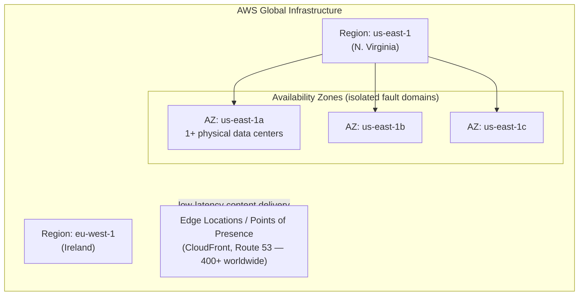

| Concept | Definition | DevOps implication |
|---|---|---|
| **Region** | A geographic area with multiple isolated AZs | Data residency, latency, compliance boundary |
| **Availability Zone (AZ)** | 1+ discrete data centers with independent power/cooling/network, low-latency links to sibling AZs | Deploy across ≥2 AZs for HA — a single AZ failure shouldn't take down your app |
| **Edge Location** | Caching/PoP for CloudFront & Route 53 | Reduces latency for global users, absorbs DDoS at the edge |
| **Local Zone / Wavelength** | Extends AWS infra closer to end users / 5G networks | Ultra-low-latency use cases |

> [!tip] Best Practice
> Multi-AZ is the baseline for production — it's usually free-ish (no cross-region data transfer) and protects against a single data center failure. Multi-**Region** is a separate, more expensive decision reserved for DR/compliance/global-latency requirements.

### Self-Check Q&A — Foundations
> [!question]- 1. Under the Shared Responsibility Model, who patches the guest OS on an EC2 instance vs. an RDS instance?
> EC2: you patch the guest OS — it's IaaS, AWS only guarantees the hypervisor and hardware. RDS: AWS patches the underlying OS and database engine (with a maintenance window you control) — it's a managed service, though you still own the schema, queries, and IAM access to it.

> [!question]- 2. Why deploy across multiple AZs instead of multiple Regions for standard HA?
> AZs give you fault isolation (separate power/cooling/network) with low-latency, often free intra-region links between them — cheap HA. Multi-Region adds cross-region data transfer costs, replication lag, and complexity — reserved for DR or global latency needs, not default HA.

---

# 2. IAM — Identity & Access Management

> [!info] Concept
> IAM is **global** (not region-scoped) and controls *who* can do *what* to *which* AWS resource. Everything in AWS — API calls, console clicks, SDK calls — is an IAM-authenticated and IAM-authorized request.

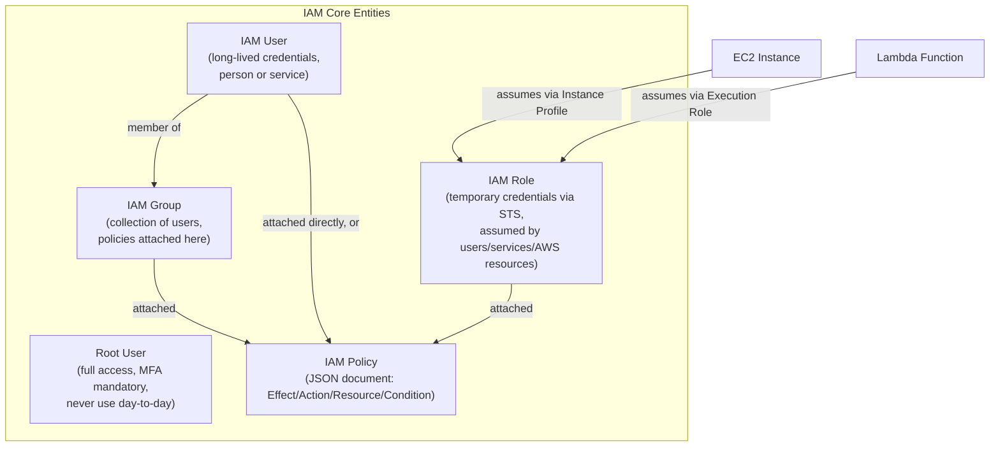

> [!example] YAML Manifest — IAM Policy (JSON, the actual format)
> ```json
> {
>   "Version": "2012-10-17",
>   "Statement": [
>     {
>       "Effect": "Allow",
>       "Action": ["s3:GetObject", "s3:PutObject"],
>       "Resource": "arn:aws:s3:::my-app-bucket/*",
>       "Condition": {
>         "StringEquals": {"aws:RequestedRegion": "eu-west-1"}
>       }
>     }
>   ]
> }
> ```

## 2.1 Policy Evaluation Logic

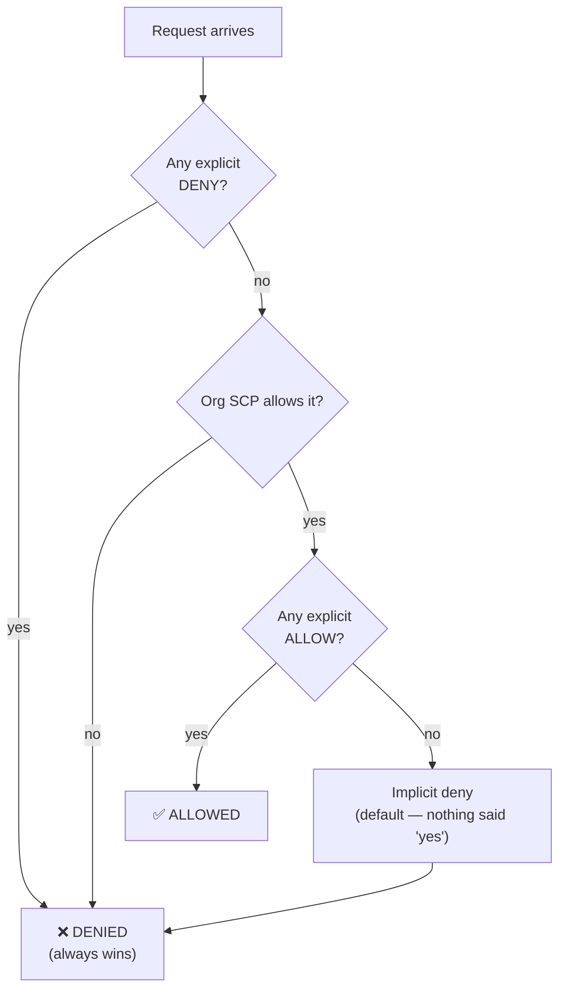

> [!warning] Watch Out
> **Explicit DENY always wins**, no matter how many ALLOWs exist elsewhere (identity policy, resource policy, permission boundary, SCP). The default posture is **implicit deny** — if nothing explicitly allows an action, it's denied. This is why a "why can't I do X" debugging session always starts by hunting for a stray Deny statement or a missing Allow, not by assuming something is broken.

## 2.2 Users vs Roles vs Groups — When to Use What

| Entity | Credentials | Use for |
|---|---|---|
| **IAM User** | Long-lived access keys / password | Individual humans needing console/CLI access (increasingly discouraged in favor of federated SSO) |
| **IAM Group** | N/A — just a policy container | Bundling permissions for a team (e.g., `developers`, `read-only-auditors`) |
| **IAM Role** | Short-lived, auto-rotated via STS (`AssumeRole`) | **EC2 instances, Lambda functions, ECS tasks, cross-account access, federated users** — anything that shouldn't hold a static secret |

> [!tip] Best Practice — The #1 DevOps IAM Rule
> **Never hardcode long-lived access keys in EC2 instances, containers, or CI/CD pipelines.** Attach an **IAM Role** instead:
> - EC2 → **Instance Profile** (role auto-delivered via the instance metadata service)
> - Lambda → **Execution Role**
> - ECS Task → **Task Role** (permissions for the app) vs **Task Execution Role** (permissions for ECS itself to pull images/push logs)
> - EKS Pod → **IRSA** (IAM Roles for Service Accounts) — see EKS Deep Dive section

## 2.3 Permission Boundaries, SCPs & Organizations

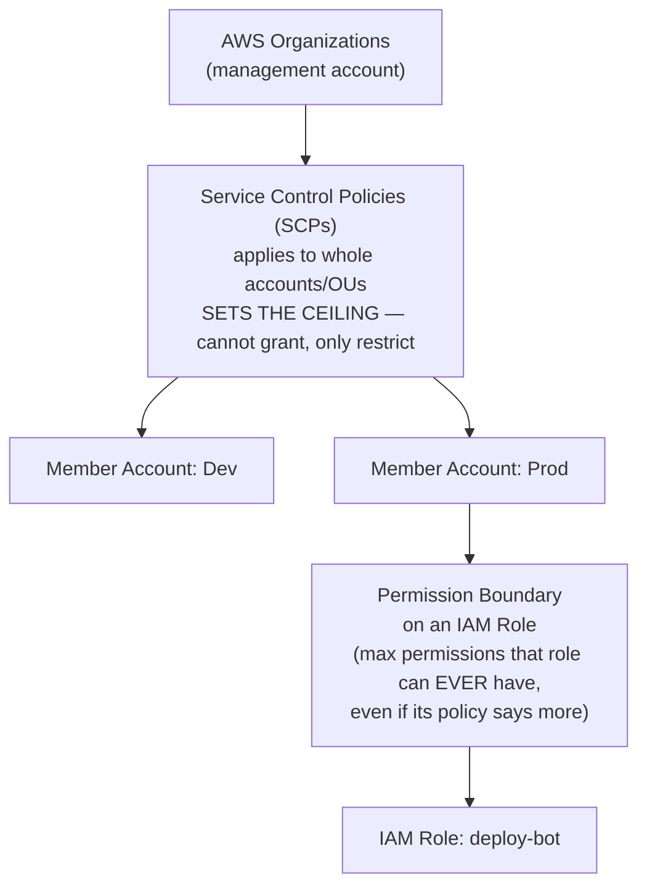

| Guardrail | Scope | Effect |
|---|---|---|
| **SCP** | Account / Organizational Unit | Ceiling for the WHOLE account — even the root user in that account can't exceed it |
| **Permission Boundary** | Individual IAM user/role | Ceiling for ONE identity — used to let a team self-serve IAM without granting privilege escalation |
| **Identity Policy** | Attached to user/role | What that identity CAN do (still bounded by the above) |
| **Resource Policy** | Attached to a resource (S3 bucket, KMS key) | Who else can access THIS resource, including cross-account |

> [!tip] Best Practice
> Use **Organizations + SCPs** to enforce org-wide non-negotiables (e.g., "no one can disable CloudTrail," "only these regions are allowed"). Use **permission boundaries** to safely let application/platform teams create their own IAM roles without risking privilege escalation to admin.

### Self-Check Q&A — IAM
> [!question]- 1. An engineer has an identity policy granting `s3:*` on a bucket, but access still fails. What are the two most likely causes, in priority order?
> First check for an explicit **Deny** anywhere (identity policy, resource policy, permission boundary, or SCP) — Deny always wins regardless of any Allow. Second, check whether an **SCP** at the org/OU level restricts that action for the account — SCPs are a ceiling that no identity policy can exceed.

> [!question]- 2. Why should a CI/CD pipeline running on EC2 use an IAM Role instead of embedding an IAM user's access keys?
> Roles issue short-lived, auto-rotated credentials via STS delivered through the instance metadata service — no static secret to leak, rotate manually, or accidentally commit to a repo. It's the difference between a credential that expires in hours and one that's valid until someone remembers to revoke it.

> [!question]- 3. What's the practical difference between an ECS Task Role and a Task Execution Role?
> Task Role = permissions the **application code inside the container** needs (e.g., read from S3). Task Execution Role = permissions **ECS itself** needs on the task's behalf (pull the image from ECR, write logs to CloudWatch) — separating "what my app can do" from "what the platform can do to launch my app."

---

# 3. Compute — EC2, Auto Scaling, Load Balancing

## 3.1 EC2 Instance Types

| Family | Optimized for | Example use case |
|---|---|---|
| **T** (Burstable) | Baseline + burst credits | Dev/test, low-traffic web servers |
| **M** (General purpose) | Balanced CPU:RAM | Most application servers |
| **C** (Compute optimized) | High CPU:RAM ratio | Batch processing, CI runners, video encoding |
| **R** (Memory optimized) | High RAM:CPU ratio | In-memory caches, real-time big data |
| **I** (Storage optimized) | High-speed local NVMe | Distributed file systems, NoSQL databases |
| **G/P** (Accelerated) | GPUs | ML training, rendering |

## 3.2 Purchasing Options

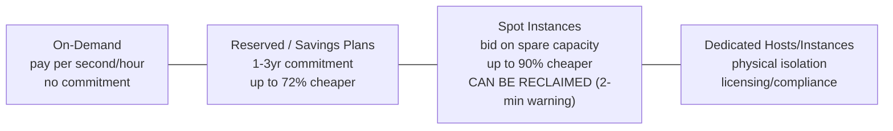

| Option | Commitment | Interruption risk | Best for |
|---|---|---|---|
| **On-Demand** | None | None | Unpredictable, short-term workloads |
| **Reserved Instance (RI)** | 1 or 3 years | None | Steady-state, predictable baseline |
| **Savings Plans** | 1 or 3 years ($ commitment, not instance-specific) | None | Flexible RI alternative — spans EC2/Fargate/Lambda |
| **Spot Instance** | None | **Yes** — 2-min reclaim notice | Fault-tolerant, stateless, batch/CI workloads |
| **Dedicated Host** | Optional | None | BYOL licensing, compliance requiring physical isolation |

> [!tip] Best Practice — DevOps Spot Strategy
> Spot Instances are ideal for **CI/CD build runners, batch jobs, and stateless worker fleets** in an Auto Scaling Group with a mixed-instance policy (On-Demand baseline + Spot for burst). Never run stateful, single-point-of-failure workloads (databases, leader nodes) on Spot without a robust interruption-handling strategy.

## 3.3 Auto Scaling Group (ASG)

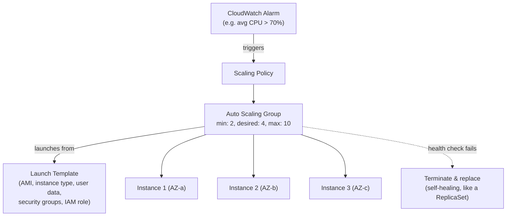

| Scaling policy type | Behavior |
|---|---|
| **Target Tracking** | "Keep average CPU at 50%" — auto-computes needed capacity (most common, simplest) |
| **Step Scaling** | Different scaling amounts based on alarm breach severity |
| **Scheduled Scaling** | Pre-planned capacity changes (e.g., scale up before known traffic events) |
| **Predictive Scaling** | ML-based forecast, pre-scales ahead of predicted load |

> [!tip] Best Practice
> This maps almost 1:1 to Kubernetes: an ASG is conceptually a **ReplicaSet for EC2 instances** — it maintains a desired count, self-heals failed instances via health checks, and reacts to metrics like an HPA reacts to CPU. The Launch Template is the "Pod template" equivalent.

## 3.4 Elastic Load Balancing (ELB)

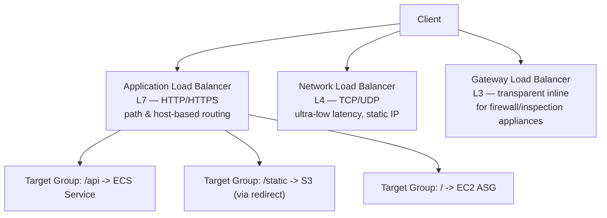

| Type | Layer | Use case |
|---|---|---|
| **ALB** | L7 (HTTP/HTTPS/gRPC) | Microservices, path/host-based routing, container workloads |
| **NLB** | L4 (TCP/UDP/TLS) | Extreme performance, static IP requirement, non-HTTP protocols |
| **GWLB** | L3 (transparent) | Inserting third-party firewalls/IDS inline with traffic |
| **CLB** *(legacy)* | L4/L7 | Deprecated — avoid for new workloads |

> [!warning] Watch Out
> Health checks are what actually make an ALB safe during deploys — a target failing its health check is pulled from rotation just like a Kubernetes readiness probe pulls a Pod from Service Endpoints. Misconfigured health check paths/thresholds are the #1 cause of "deploy looks fine but users get 502s."

### Self-Check Q&A — Compute
> [!question]- 1. Why are Spot Instances risky for a database primary but excellent for CI build runners?
> Spot capacity can be reclaimed with only a 2-minute warning whenever AWS needs it back — fine for stateless, restartable, fault-tolerant work like CI jobs (just retry), catastrophic for a stateful single point of failure like a DB primary that would need failover mid-reclaim.

> [!question]- 2. What's the closest Kubernetes analogy to an EC2 Auto Scaling Group, and where does the analogy break down?
> Closest to a ReplicaSet/Deployment: maintains a desired instance count, replaces unhealthy instances, reacts to metrics for scaling. It breaks down because an ASG operates at the **infrastructure** layer (whole VMs) while a ReplicaSet operates at the **application** layer (Pods) — in EKS, you typically need both: an ASG/Karpenter scaling *nodes*, and an HPA scaling *Pods* on those nodes.

> [!question]- 3. When would you choose an NLB over an ALB?
> When you need L4 performance/latency characteristics AWS doesn't offer at L7, a static IP address for the load balancer itself, or you're load-balancing a non-HTTP protocol (raw TCP/UDP, custom protocols, gRPC edge cases needing pass-through TLS).

---

# 4. Containers — ECS, EKS, Fargate, ECR

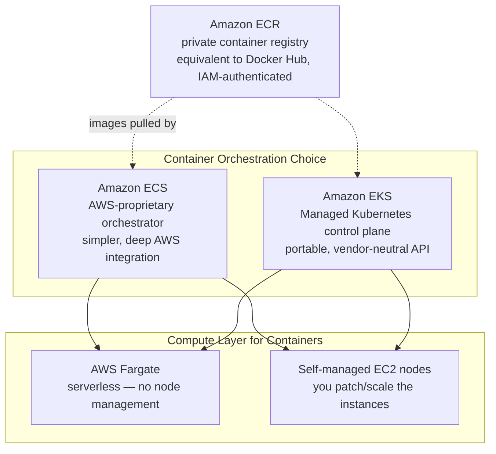

| | ECS | EKS |
|---|---|---|
| Control plane | AWS-proprietary | **Kubernetes** (upstream-compatible API) |
| Portability | AWS-only | Portable — same manifests work on GKE/AKS/on-prem |
| Learning curve | Lower — AWS-native concepts (Task, Service, Cluster) | Higher — full K8s object model |
| Ecosystem | Smaller, AWS-curated | **Huge** — Helm, operators, CNCF tooling |
| Cost | No control-plane fee | ~$0.10/hr per cluster control plane |
| Best for | Teams fully committed to AWS, wanting simplicity | Teams needing portability, existing K8s expertise, or CNCF tooling |

## 4.1 Fargate vs EC2 Launch Type

> [!info] Concept
> This choice is orthogonal to ECS vs EKS — it's about **who manages the underlying compute**.

| | Fargate | EC2 Launch Type |
|---|---|---|
| Node management | **None** — AWS provisions per-task/per-pod compute | You manage the ASG/node group (patching, scaling, AMIs) |
| Billing | Per vCPU/memory-second requested by the task/pod | Per EC2 instance-hour, regardless of packing efficiency |
| Bin-packing control | None — no visibility into underlying host | Full — you can optimize instance size vs workload density |
| DaemonSets (EKS) | **Not supported** | Supported |
| Use for | Variable/bursty workloads, minimizing ops overhead | Dense packing for cost efficiency, DaemonSets, GPU workloads |

## 4.2 ECS Core Objects (for comparison against K8s vocabulary)

| ECS term | Kubernetes equivalent | Notes |
|---|---|---|
| Task Definition | Pod spec (template) | JSON, defines containers/resources/roles |
| Task | Pod | A running instance of a Task Definition |
| Service | Deployment + Service | Maintains desired task count, integrates with ALB |
| Cluster | Node pool / cluster | Logical grouping of compute capacity |
| Task Role | Kubernetes ServiceAccount + IAM (via IRSA) | IAM permissions for the running container |

> [!example] YAML Manifest — ECS Task Definition (JSON)
> ```json
> {
>   "family": "vote-app",
>   "networkMode": "awsvpc",
>   "requiresCompatibilities": ["FARGATE"],
>   "cpu": "256",
>   "memory": "512",
>   "executionRoleArn": "arn:aws:iam::123456789012:role/ecsTaskExecutionRole",
>   "taskRoleArn": "arn:aws:iam::123456789012:role/voteAppTaskRole",
>   "containerDefinitions": [
>     {
>       "name": "vote",
>       "image": "123456789012.dkr.ecr.eu-west-1.amazonaws.com/vote:v1",
>       "portMappings": [{"containerPort": 80}],
>       "logConfiguration": {
>         "logDriver": "awslogs",
>         "options": {"awslogs-group": "/ecs/vote", "awslogs-region": "eu-west-1"}
>       }
>     }
>   ]
> }
> ```

> [!tip] Best Practice
> Push images to **ECR**, not Docker Hub, for anything running in AWS — private by default, IAM-authenticated (no separate registry credentials to manage), integrated vulnerability scanning, and lifecycle policies to auto-expire old tags.

### Self-Check Q&A — Containers
> [!question]- 1. Your team already has deep Kubernetes expertise and multi-cloud ambitions. Which should you pick, ECS or EKS, and why?
> **EKS** — it exposes the standard Kubernetes API, so existing manifests, Helm charts, and operator knowledge transfer directly, and workloads remain portable to other clouds or on-prem clusters if the multi-cloud strategy materializes.

> [!question]- 2. Why can't you run a logging DaemonSet on Fargate-backed EKS nodes?
> Fargate provisions isolated per-Pod micro-VMs with no shared underlying node you have access to — DaemonSets require a persistent node to schedule one Pod per node onto, which doesn't exist as a concept under Fargate. Sidecar containers or a separate EC2 node group are the workarounds.

> [!question]- 3. What's the difference between an ECS Task Role and Task Execution Role, mapped to Kubernetes concepts?
> Task Role ≈ what a Pod's ServiceAccount (via IRSA) can do — the app's own AWS permissions. Task Execution Role ≈ permissions the *kubelet/container runtime* would need — pulling the image, writing logs — infrastructure-level, not application-level.

---

# 5. Serverless — Lambda, API Gateway, Step Functions

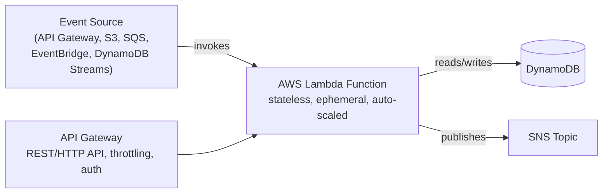

> [!info] Concept
> Lambda runs your code in response to events, scales automatically per-request, and you pay only for execution time (ms-level billing) — there's no server to provision, patch, or scale. It's the ultimate expression of the Shared Responsibility Model shifting toward AWS.

| Concept | Detail |
|---|---|
| **Cold start** | First invocation (or after scale-to-zero) pays a startup penalty — worse for large deployment packages, VPC-attached functions, and heavier runtimes (Java > Node/Python) |
| **Concurrency** | Number of simultaneous executions; **Reserved Concurrency** caps/guarantees capacity per function; **Provisioned Concurrency** pre-warms instances to eliminate cold starts |
| **Timeout** | Max 15 minutes per invocation — anything longer needs Step Functions, ECS, or Batch |
| **Layers** | Shared code/dependencies packaged separately, attached to multiple functions |

> [!warning] Watch Out
> A Lambda inside a VPC needs an **ENI (Elastic Network Interface)** to reach VPC resources — historically a major cold-start/cost pain point. Modern Hyperplane ENIs mostly fixed this, but VPC-attached Lambdas calling the public internet still need a **NAT Gateway** — a classic "why can't my Lambda reach the internet" bug.

## 5.1 Step Functions — Orchestrating Serverless Workflows

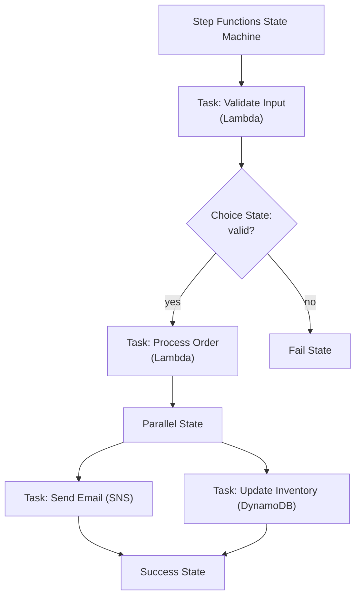

> [!tip] Best Practice
> Step Functions is the serverless equivalent of a Kubernetes **Job/CronJob DAG orchestration** need — use it instead of chaining Lambdas together with SQS/manual polling when you need visual workflow state, built-in retries/error handling, and human-readable audit trails of a multi-step process.

### Self-Check Q&A — Serverless
> [!question]- 1. Why would a Lambda function attached to a VPC fail to reach an external API, and what fixes it?
> By default, VPC-attached Lambdas only have private subnet routing — no path to the internet. Fix: route the Lambda's subnet through a **NAT Gateway** in a public subnet, or avoid VPC attachment entirely if the function doesn't need to reach VPC-private resources.

> [!question]- 2. When should you reach for Step Functions instead of a Lambda calling other Lambdas directly?
> When the workflow has multiple sequential/parallel/conditional steps that need visual state tracking, built-in retry/catch semantics per step, and long-running durations beyond Lambda's 15-minute cap — Step Functions externalizes the orchestration logic instead of burying it in application code.

---

# 6. Storage — S3, EBS, EFS, FSx

## 6.1 Amazon S3 — Object Storage

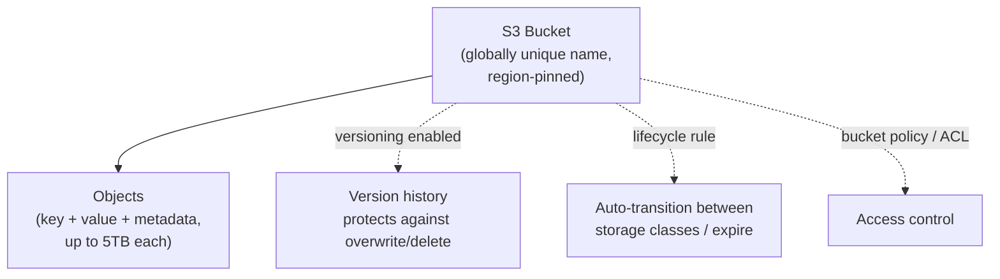

### Storage Classes

| Class | Retrieval | Min duration | Use case |
|---|---|---|---|
| **S3 Standard** | Instant | None | Frequently accessed data |
| **S3 Intelligent-Tiering** | Instant | None | Unknown/changing access patterns — auto-optimizes cost |
| **S3 Standard-IA** | Instant | 30 days | Infrequent access, still needs fast retrieval |
| **S3 One Zone-IA** | Instant | 30 days | Infrequent, re-creatable data (single AZ = cheaper, less durable) |
| **S3 Glacier Instant Retrieval** | Instant | 90 days | Archive needing millisecond access |
| **S3 Glacier Flexible Retrieval** | Minutes–hours | 90 days | Archive, occasional access |
| **S3 Glacier Deep Archive** | 12 hours | 180 days | Long-term compliance archive, cheapest |

> [!tip] Best Practice
> Attach a **Lifecycle Policy** to auto-transition objects (e.g., Standard → IA after 30 days → Glacier after 90 → delete after 365) instead of manually managing storage class — this is the S3 equivalent of a `rollout restart` cron: set it once, let policy do the work.

### S3 Consistency & Durability

> [!info] Concept
> S3 provides **strong read-after-write consistency** for all operations (as of Dec 2020) — a `PUT` followed immediately by a `GET` always returns the latest data, no eventual-consistency race condition to design around. Durability is **11 nines (99.999999999%)** via automatic redundancy across ≥3 AZs within the region (Standard/IA classes).

> [!warning] Watch Out
> **Versioning + MFA Delete** is the real protection against accidental/malicious object deletion — a bucket policy alone doesn't stop an authorized-but-mistaken `DeleteObject` call. Once enabled, versioning cannot be *disabled*, only suspended — plan for the storage cost of retained old versions.

### S3 Security Layers

| Layer | Scope | Mechanism |
|---|---|---|
| **Block Public Access** | Account or bucket | Blanket override — prevents public exposure regardless of policy/ACL |
| **Bucket Policy** | Bucket | JSON resource policy — can grant cross-account access |
| **IAM Policy** | Identity | What the calling user/role can do |
| **ACL** *(legacy, mostly disabled by default now)* | Object/bucket | Older grant mechanism, avoid for new buckets |
| **Encryption** | Object | SSE-S3 (AWS-managed key), SSE-KMS (customer-managed key, audit trail), SSE-C (customer-supplied key), or client-side |

## 6.2 EBS vs EFS vs Instance Store vs FSx

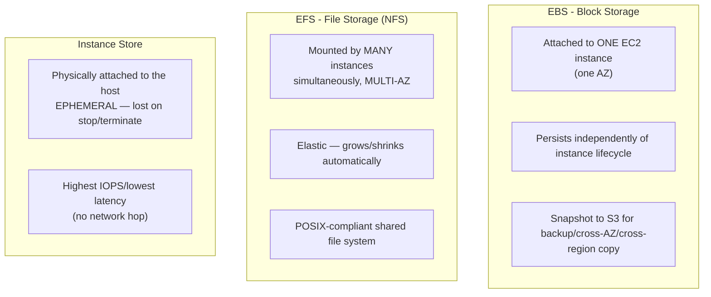

| | EBS | EFS | Instance Store |
|---|---|---|---|
| Scope | Single AZ, single instance (at a time) | Multi-AZ, many instances concurrently | Single instance, ephemeral |
| Persistence | Survives instance stop/terminate (if not deleted) | Fully independent lifecycle | **Lost** on stop/terminate |
| Analogy | PersistentVolume (RWO) | PersistentVolume (RWX / NFS) | emptyDir |
| Use for | Boot volumes, databases | Shared config, CMS uploads, ML training data | Scratch/cache, high-IOPS temp data |

> [!tip] Best Practice
> This maps directly onto the Kubernetes storage model you already know: **EBS ≈ ReadWriteOnce PV**, **EFS ≈ ReadWriteMany PV**, **Instance Store ≈ emptyDir**. In EKS, the AWS EBS CSI driver and EFS CSI driver are literally how PVCs get backed by these services.

### Self-Check Q&A — Storage
> [!question]- 1. You need shared, POSIX-compliant storage mounted concurrently by 20 EC2 instances across 3 AZs. Which service, and why not EBS?
> **EFS** — it's a network file system designed for concurrent multi-AZ, multi-instance mounts. EBS volumes attach to exactly one instance at a time within a single AZ (except Multi-Attach, a narrow io1/io2 feature) — wrong shape for this requirement.

> [!question]- 2. Why is S3 Versioning + MFA Delete considered stronger protection than a restrictive bucket policy alone?
> A bucket policy only controls *who* can call `DeleteObject` — an authorized user with a policy-granted delete permission (or a compromised credential) can still delete data. Versioning retains prior object versions even after deletion (a delete just adds a delete marker), and MFA Delete adds a hard requirement for physical MFA token approval before a version or the versioning state itself can be permanently removed.

> [!question]- 3. What determines whether data survives an EC2 instance stop vs terminate, for EBS-backed vs Instance-Store-backed instances?
> EBS-backed: root/attached EBS volumes persist through `stop` (data intact) and can persist through `terminate` if `DeleteOnTermination` is false. Instance Store: data is physically tied to the host hardware and is **always lost** on both `stop` and `terminate` — there's no way to preserve it, only snapshot beforehand to something else.

---

# 7. Databases — RDS, Aurora, DynamoDB, ElastiCache

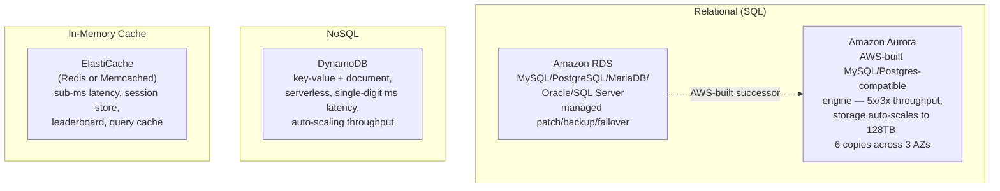

## 7.1 RDS Multi-AZ vs Read Replicas

> [!warning] Watch Out — The #1 RDS Confusion
> These solve **different problems** and are often both needed together.

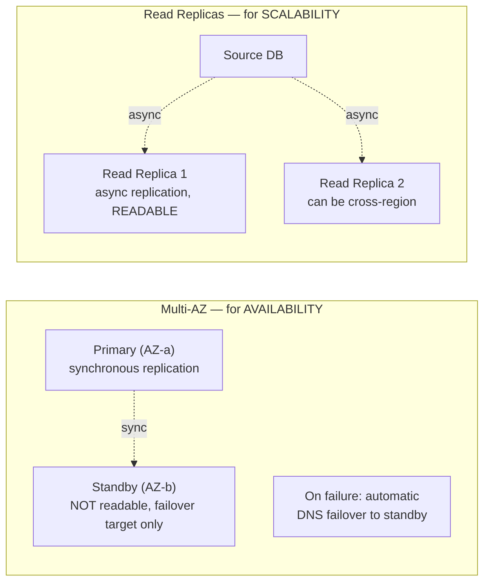

| | Multi-AZ | Read Replica |
|---|---|---|
| Purpose | **High availability / DR** | **Read scalability / offloading** |
| Replication | Synchronous | Asynchronous |
| Standby readable? | **No** | **Yes** — serves read traffic |
| Failover | Automatic (DNS switch, ~1-2 min) | Manual promotion required |
| Cross-region? | No (Multi-AZ is intra-region) | Yes, supported |

## 7.2 DynamoDB Core Concepts

| Concept | Detail |
|---|---|
| **Partition Key** | Determines which physical partition stores the item — choose high-cardinality keys to avoid hot partitions |
| **Sort Key** *(optional)* | Combined with partition key for composite primary key, enables range queries |
| **Read/Write Capacity** | On-Demand (pay-per-request, auto-scales) or Provisioned (set RCU/WCU, cheaper at steady predictable load) |
| **DynamoDB Streams** | Change-data-capture feed — triggers Lambda on item insert/update/delete |
| **Global Tables** | Multi-region, multi-active replication — for globally distributed low-latency access |
| **DAX (DynamoDB Accelerator)** | In-memory read-through cache, microsecond latency |

> [!warning] Watch Out — Hot Partitions
> A poorly chosen partition key (e.g., a `status` field with only 3 possible values across millions of items) concentrates all traffic onto a handful of physical partitions, throttling requests regardless of overall provisioned capacity. Always design partition keys around **access pattern cardinality**, not just what seems like a "natural" identifier.

### Self-Check Q&A — Databases
> [!question]- 1. Your app is read-heavy and you want to reduce load on the primary database without changing failover behavior. Multi-AZ or Read Replica?
> **Read Replica** — it's specifically for offloading read traffic (standby in Multi-AZ isn't queryable). You could layer both: Multi-AZ for HA/failover, plus one or more Read Replicas for read scaling — they're complementary, not mutually exclusive.

> [!question]- 2. Why might a DynamoDB table with plenty of provisioned capacity still throttle requests under real traffic?
> A hot partition — if the partition key has low cardinality or traffic skews heavily toward a few key values, those specific physical partitions get overwhelmed even though the table's *aggregate* capacity is sufficient. The fix is redesigning the key schema, not raising capacity.

> [!question]- 3. When would you choose Aurora over standard RDS MySQL?
> When you need higher throughput (Aurora claims ~5x MySQL), storage that auto-scales up to 128TB without manual provisioning, faster failover (typically <30s via Aurora Replicas), and you're not tied to a database engine RDS doesn't have an Aurora-compatible version of (Aurora only supports MySQL- and PostgreSQL-compatible modes).

---

# 8. Networking — VPC Deep Dive, Route 53, CloudFront

## 8.1 VPC Anatomy

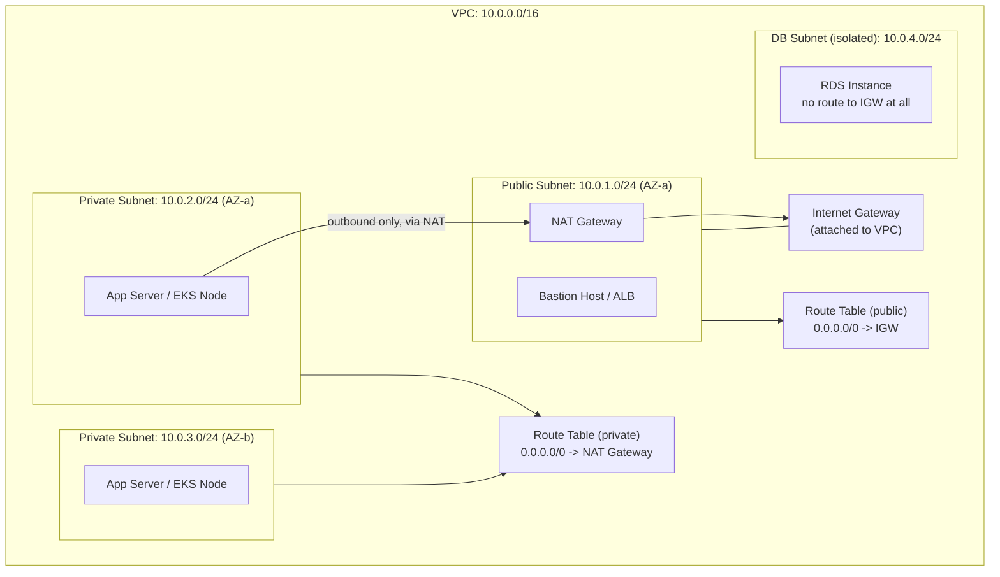

| Component | Role |
|---|---|
| **VPC** | Isolated virtual network, defined by a CIDR block (e.g., `10.0.0.0/16`) |
| **Subnet** | Slice of the VPC CIDR, pinned to **one AZ** |
| **Internet Gateway (IGW)** | Attached to the VPC; enables bidirectional internet access for public subnets |
| **NAT Gateway** | Sits in a public subnet; lets **private** subnet resources initiate outbound internet traffic without being reachable from outside |
| **Route Table** | Determines where subnet traffic goes; "public" vs "private" subnet is defined ENTIRELY by its route table (does it route `0.0.0.0/0` to an IGW or a NAT?) |

> [!info] Concept
> A subnet is "public" purely because its route table sends `0.0.0.0/0` traffic to an Internet Gateway — there's no separate "public subnet" flag. This is a common misconception; the distinction is 100% about routing, not a subnet property.

## 8.2 Security Groups vs Network ACLs

| | Security Group | Network ACL (NACL) |
|---|---|---|
| Level | **Instance/ENI-level** | **Subnet-level** |
| Statefulness | **Stateful** — return traffic auto-allowed | **Stateless** — must explicitly allow both directions |
| Rules | Allow only (no explicit deny) | Allow AND Deny rules, evaluated in **rule number order** |
| Default | Deny all inbound, allow all outbound | Allow all in and out (default NACL) |
| Scope | Attached to specific resources | Applies to every resource in the subnet |

> [!warning] Watch Out
> Because NACLs are **stateless**, an inbound-allow rule for port 443 doesn't automatically permit the response traffic back out — you need a corresponding outbound rule for the ephemeral port range (1024-65535) too. This is the classic "Security Group looks right, but the subnet's NACL is silently dropping return traffic" debugging trap.

## 8.3 VPC Connectivity Options

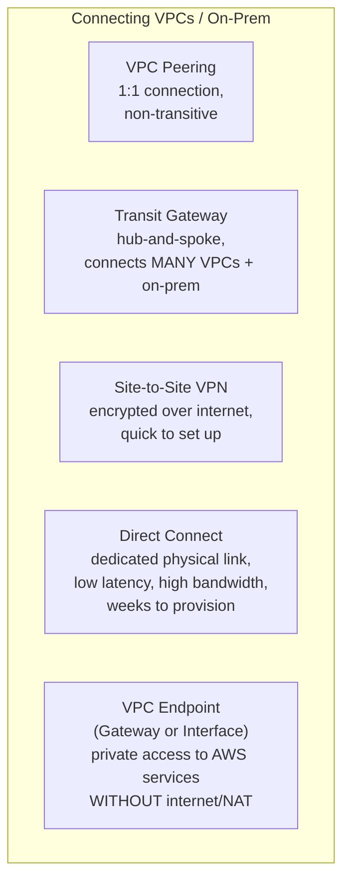

| Option | Topology | Best for |
|---|---|---|
| **VPC Peering** | 1:1, **non-transitive** (A↔B and B↔C does NOT give A↔C) | Small number of VPCs needing direct connectivity |
| **Transit Gateway** | Hub-and-spoke, transitive | Many VPCs / accounts / on-prem sites — scales where peering becomes unmanageable (N² problem) |
| **Site-to-Site VPN** | Encrypted tunnel over public internet | Quick, cheaper on-prem connectivity, backup path for Direct Connect |
| **Direct Connect** | Dedicated physical fiber link | Consistent low latency/high bandwidth, large steady data transfer, compliance requiring non-internet paths |
| **VPC Endpoint** | Private route to an AWS service (S3, DynamoDB via Gateway; most others via Interface/PrivateLink) | Avoid NAT Gateway costs and internet exposure for AWS API traffic from private subnets |

> [!tip] Best Practice
> VPC Peering's non-transitivity is the classic scaling trap — 10 VPCs needing full mesh connectivity require 45 peering connections. **Transit Gateway** collapses this to 10 attachments and adds centralized routing control — always the right call once you're managing more than a handful of VPCs.

## 8.4 Route 53 & CloudFront

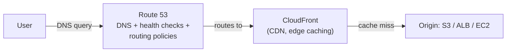

### Route 53 Routing Policies

| Policy | Behavior |
|---|---|
| **Simple** | One record, no health checks, no logic |
| **Weighted** | Split traffic by percentage — canary/blue-green testing |
| **Latency-based** | Route to the region with lowest latency for the user |
| **Failover** | Active-passive — route to secondary only if primary health check fails |
| **Geolocation** | Route based on user's geographic location |
| **Geoproximity** | Route based on geographic distance, with bias adjustment |
| **Multi-value Answer** | Return multiple healthy IPs, client-side selection (like DNS-based load balancing) |

> [!tip] Best Practice
> Weighted routing is how you do a **DNS-level canary release** — send 5% of traffic to a new version's endpoint, watch CloudWatch metrics, dial the weight up gradually. This is the AWS-networking-layer equivalent of a Kubernetes rolling update's `maxSurge`, just operating at DNS instead of Pod replacement.

### Self-Check Q&A — Networking
> [!question]- 1. What makes a subnet "public" in AWS — is it a flag you set on the subnet itself?
> No — there's no such flag. A subnet is public purely because its associated **route table** sends `0.0.0.0/0` traffic to an **Internet Gateway**. Attach a different route table (pointing to a NAT Gateway instead) and the same subnet becomes private.

> [!question]- 2. Traffic is allowed by the Security Group but still isn't reaching the instance. What subnet-level construct should you check next, and why?
> The **Network ACL** — unlike stateful Security Groups, NACLs are stateless and require explicit allow rules for BOTH inbound and outbound (including the ephemeral return-traffic port range). A missing outbound NACL rule silently drops return packets even when the Security Group and inbound NACL rule are correct.

> [!question]- 3. You have 15 VPCs that all need to talk to each other. Why is VPC Peering the wrong tool, and what should you use instead?
> VPC Peering is non-transitive and 1:1 — full mesh connectivity for 15 VPCs would require 105 individual peering connections, an operational nightmare to manage and audit. **Transit Gateway** provides hub-and-spoke transitive routing, reducing this to 15 attachments with centralized route table control.

---

# 9. IaC & CI/CD — CloudFormation, CDK, CodePipeline

## 9.1 Infrastructure as Code Options

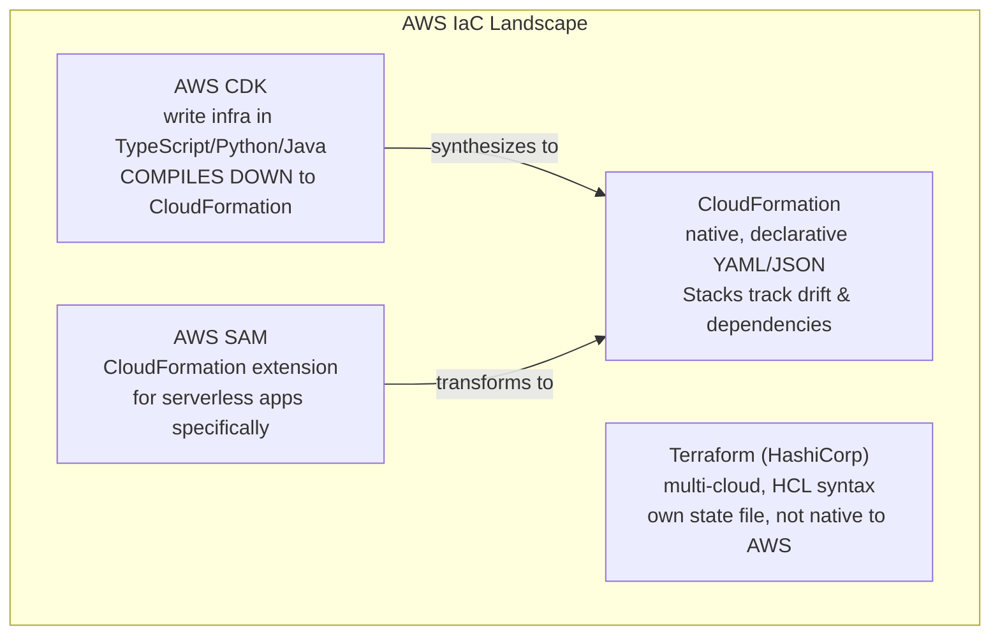

| Tool | Native to AWS? | Language | State management | Multi-cloud? |
|---|---|---|---|---|
| **CloudFormation** | Yes | YAML/JSON | AWS-managed (Stacks) | No |
| **CDK** | Yes (compiles to CFN) | TypeScript/Python/Java/Go | Inherits CFN state | No |
| **SAM** | Yes (CFN extension) | YAML | Inherits CFN state | No (serverless-focused) |
| **Terraform** | No (third-party) | HCL | Self-managed state file (often in S3+DynamoDB lock) | **Yes** |

> [!info] Concept
> CloudFormation's core value is that it's **declarative and stateful like Kubernetes manifests** — you describe desired infrastructure, submit a "Stack," and CloudFormation diffs against current state to compute a change set, exactly like `kubectl apply` diffing against etcd.

> [!example] YAML Manifest — CloudFormation Stack (simplified)
> ```yaml
> AWSTemplateFormatVersion: "2010-09-09"
> Resources:
>   AppBucket:
>     Type: AWS::S3::Bucket
>     Properties:
>       BucketName: my-app-artifacts
>       VersioningConfiguration:
>         Status: Enabled
>   AppInstance:
>     Type: AWS::EC2::Instance
>     Properties:
>       InstanceType: t3.micro
>       ImageId: ami-0abcdef1234567890
>       IamInstanceProfile: !Ref AppInstanceProfile
> Outputs:
>   BucketName:
>     Value: !Ref AppBucket
> ```

> [!warning] Watch Out
> A CloudFormation Stack **drifts** when someone manually edits a resource in the console/CLI outside of the template — `Detect Drift` catches this, but nothing prevents it proactively. This is the AWS analogue of a Kubernetes controller reconciling away manual `kubectl edit` changes — except CloudFormation does NOT auto-correct drift, it only reports it. Treat the console as read-only for anything managed by IaC.

## 9.2 CI/CD Pipeline Services

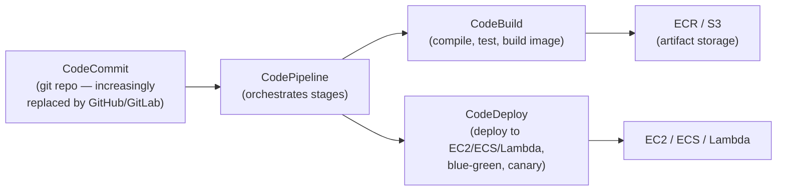

| Service | Role | Kubernetes/general analogy |
|---|---|---|
| **CodeCommit** | Git-hosted source repo | GitHub/GitLab |
| **CodePipeline** | Orchestrates multi-stage release workflow | Argo Workflows / GitHub Actions workflow |
| **CodeBuild** | Managed build/test compute (Docker-based) | A CI runner (GitHub Actions runner, GitLab runner) |
| **CodeDeploy** | Automates deployment with health-checked rollout strategies | A Deployment's rolling-update controller |
| **CodeArtifact** | Private package repository (npm, Maven, PyPI, etc.) | Artifactory/Nexus equivalent |

### CodeDeploy Deployment Strategies

| Strategy | Behavior |
|---|---|
| **In-place** | Update existing instances directly (EC2 only) — downtime risk |
| **Blue/Green** | Stand up a fully new environment, cut traffic over, keep old for rollback | 
| **Canary (Lambda/ECS)** | Shift a small % of traffic first, then the rest after a bake period |
| **Linear (Lambda/ECS)** | Shift traffic in equal increments over time |

> [!tip] Best Practice
> This maps directly to what you already know from Kubernetes rollouts: **Blue/Green ≈ standing up a new ReplicaSet fully before cutting over** (no `maxSurge`/`maxUnavailable` gradualism), while **Canary/Linear ≈ a controlled rolling update with explicit traffic-shift steps** — CodeDeploy just adds automated health-check gating and one-command rollback on top.

### Self-Check Q&A — IaC & CI/CD
> [!question]- 1. Why is manually editing a CloudFormation-managed resource in the console dangerous, and does CloudFormation fix it automatically?
> It causes **drift** — the actual resource state no longer matches the template's declared state. Unlike a Kubernetes controller, CloudFormation does **not** auto-correct drift on its own; it only detects and reports it via `Detect Drift`. The next Stack update can also produce unexpected results if it doesn't account for the manual change.

> [!question]- 2. When would you choose CDK over raw CloudFormation YAML?
> When you want to express infrastructure using a real programming language's abstractions — loops, conditionals, reusable classes/constructs, type checking, and unit tests — rather than YAML templating tricks (`Fn::If`, nested stacks) for anything non-trivial. CDK still ultimately synthesizes to CloudFormation, so all the same Stack/drift semantics apply underneath.

> [!question]- 3. What's the key difference between CodeDeploy's Blue/Green and Canary strategies?
> Blue/Green cuts traffic over to the fully-new environment essentially all at once after it's verified healthy (fast rollback = just flip back). Canary shifts a small percentage of traffic first, bakes for a defined period to watch for errors, then proceeds — trading a slower rollout for earlier detection of a bad release with less blast radius.

---

# 10. Messaging & Integration — SQS, SNS, EventBridge, Kinesis

```mermaid
graph TD
    subgraph PATTERNS["Async Messaging Patterns"]
        PRODUCER["Producer"] -->|1:1, decoupled queue| SQS["SQS Queue\npoint-to-point,\nat-least-once delivery"]
        PRODUCER2["Producer"] -->|1:many, fan-out| SNS["SNS Topic\npub/sub"]
        SNS --> SUB1["Subscriber: SQS Queue"]
        SNS --> SUB2["Subscriber: Lambda"]
        SNS --> SUB3["Subscriber: Email/SMS"]
        SOURCE["Event Source\n(AWS service or custom app)"] -->|event-driven routing| EB["EventBridge\nrule-based routing,\nschema registry"]
        EB -->|matches pattern| TARGET1["Target: Lambda"]
        EB -->|matches pattern| TARGET2["Target: Step Functions"]
    end
```

| Service | Pattern | Delivery | Use case |
|---|---|---|---|
| **SQS** | Point-to-point queue | At-least-once (Standard), exactly-once (FIFO) | Decouple producer/consumer, buffer bursts, worker queues |
| **SNS** | Pub/sub fan-out | At-least-once | Broadcast one event to many subscribers simultaneously |
| **EventBridge** | Event bus with routing rules | At-least-once | Complex event-driven architectures, SaaS integrations, scheduled rules |
| **Kinesis Data Streams** | Ordered, replayable stream | Ordered per shard | Real-time analytics, log/clickstream processing at scale |

> [!info] Concept
> **SQS decouples** producer and consumer in time — the producer doesn't need the consumer to be available right now; messages wait in the queue. This is the messaging equivalent of what the Voting App's `redis` queue does between `vote` and `worker` in the Kubernetes course — SQS is simply the managed, durable, AWS-native version of that same pattern.

| SQS Standard | SQS FIFO |
|---|---|
| At-least-once delivery (possible duplicates) | Exactly-once processing |
| Best-effort ordering | Strict ordering within a Message Group |
| Nearly unlimited throughput | Limited throughput (300-3000 msg/s depending on batching) |

> [!warning] Watch Out — SQS Visibility Timeout
> When a consumer receives a message, it becomes **invisible** to other consumers for the `VisibilityTimeout` duration — not deleted. If the consumer crashes before calling `DeleteMessage`, the message reappears after the timeout for another consumer to pick up. Set the timeout too short and a slow-but-healthy consumer causes duplicate processing; too long and a crashed consumer's message sits idle before retry.

### Self-Check Q&A — Messaging
> [!question]- 1. A single event needs to trigger three completely independent downstream processes. SQS or SNS?
> **SNS** — it's built for fan-out pub/sub, delivering the same message to multiple independent subscribers simultaneously. SQS is point-to-point; you'd need one queue per consumer and manual duplication logic, which is exactly what SNS→multiple SQS subscriptions solves natively.

> [!question]- 2. Why might a message get processed twice even though the consumer successfully finished processing it?
> If the consumer finishes work but crashes or is too slow to call `DeleteMessage` before the **Visibility Timeout** expires, SQS assumes the message wasn't handled and makes it visible again for redelivery — a timeout misconfigured shorter than actual processing time is the classic cause of unexpected duplicate processing on SQS Standard queues.

---

# 11. Observability — CloudWatch, CloudTrail, X-Ray, Config

```mermaid
graph TD
    subgraph SOURCES["Signal Sources"]
        METRICS["CloudWatch Metrics\ntime-series numbers\n(CPU, latency, custom)"]
        LOGS["CloudWatch Logs\napplication/service logs"]
        TRACES["X-Ray\ndistributed request tracing"]
        APICALLS["CloudTrail\nWHO did WHAT API call WHEN"]
        CONFIG["AWS Config\nresource CONFIGURATION\nhistory & compliance rules"]
    end
    METRICS -->|triggers| ALARM["CloudWatch Alarm"]
    ALARM -->|notifies| SNS2["SNS -> PagerDuty/Slack"]
    ALARM -->|triggers| ASGSCALE["Auto Scaling action"]
```

| Service | Answers | Analogy from K8s world |
|---|---|---|
| **CloudWatch Metrics** | "How is it performing?" (CPU, latency, error rate) | `kubectl top`, Prometheus metrics |
| **CloudWatch Logs** | "What did it say?" | `kubectl logs` |
| **CloudWatch Alarms** | "Should someone/something react?" | Alertmanager / HPA trigger |
| **X-Ray** | "Where's the request spending time across services?" | Distributed tracing (Jaeger/Zipkin equivalent) |
| **CloudTrail** | "Who made this API call, and when?" (audit log of AWS API activity itself) | Kubernetes audit logs |
| **AWS Config** | "What did this resource's configuration look like at time T, and does it comply with a rule?" | Policy-as-code / OPA Gatekeeper for AWS resources |

> [!warning] Watch Out — CloudTrail vs CloudWatch Logs, the #1 Confusion
> **CloudTrail logs API calls made TO AWS** (who called `RunInstances`, who deleted a bucket) — it's an audit trail of control-plane actions. **CloudWatch Logs holds application/service output** (what your app printed, ALB access logs, VPC Flow Logs). They answer completely different questions and neither substitutes for the other — a security investigation into "who deleted this resource" needs CloudTrail; debugging "why did my app 500" needs CloudWatch Logs.

> [!tip] Best Practice
> Enable a CloudTrail **Organization Trail** logging to a centralized, access-restricted S3 bucket in a dedicated logging account, with **log file validation** enabled — this is your tamper-evident forensic record and should never be something a compromised workload account can delete or disable.

### Self-Check Q&A — Observability
> [!question]- 1. Someone deleted a production S3 bucket. Which service tells you WHO did it, and which service would show what the bucket's configuration looked like beforehand?
> **CloudTrail** identifies who made the `DeleteBucket` API call and when. **AWS Config** shows the resource's configuration history and can flag the change as non-compliant if a rule required deletion protection or specific settings.

> [!question]- 2. Why isn't CloudWatch Logs sufficient for a security audit of "who changed this IAM policy"?
> CloudWatch Logs captures application/infrastructure *output* (what services print), not a record of the AWS API control-plane action itself. Only **CloudTrail** records the actual `PutUserPolicy`/`AttachRolePolicy` API call, the identity that made it, the source IP, and the timestamp — it's purpose-built as the audit trail for AWS account activity.

---

# 12. Security — KMS, Secrets Manager, WAF, GuardDuty

```mermaid
graph TD
    subgraph ENCRYPTION["Encryption & Secrets"]
        KMS["AWS KMS\nmanages encryption KEYS\n(CMKs), audit trail via CloudTrail"]
        SM["Secrets Manager\nstores + auto-ROTATES secrets\n(DB passwords, API keys)"]
        SM -.->|encrypts secrets using| KMS
        PS["Systems Manager\nParameter Store\ncheaper, simpler config/secrets\n(no built-in rotation)"]
    end
    subgraph EDGE_SEC["Edge & Detection"]
        WAF["AWS WAF\nL7 firewall rules\n(SQLi, XSS, rate limiting)\nattaches to ALB/CloudFront/API GW"]
        SHIELD["AWS Shield\nDDoS protection\n(Standard: free/all accounts,\nAdvanced: paid, L3/L4/L7)"]
        GD["GuardDuty\nML-based threat detection\n(analyzes VPC Flow Logs,\nCloudTrail, DNS logs)"]
        SH["Security Hub\ncentralized findings dashboard\naggregates GuardDuty/Config/etc"]
    end
```

| Service | Purpose | Key distinction |
|---|---|---|
| **KMS** | Manage & audit encryption keys | The **key management** layer underneath S3/EBS/RDS encryption |
| **Secrets Manager** | Store secrets with **automatic rotation** | Costs more than Parameter Store, but rotation is built-in (e.g., auto-rotates an RDS password on a schedule) |
| **Parameter Store** | Store config/secrets, no native rotation | Cheaper, simpler, fine for static config or when rotation is handled elsewhere |
| **WAF** | Block malicious HTTP requests at L7 | Rules engine for SQLi/XSS/rate-limiting — sits in front of ALB/CloudFront/API Gateway |
| **Shield Standard** | Basic DDoS protection | Automatic, free, on every AWS account |
| **Shield Advanced** | Enhanced DDoS protection + cost protection + 24/7 DRT support | Paid, for internet-facing critical workloads |
| **GuardDuty** | Continuous threat detection | Analyzes VPC Flow Logs, CloudTrail, DNS logs for anomalies (crypto-mining, credential compromise, recon) |
| **Security Hub** | Aggregated compliance/finding dashboard | Doesn't detect anything itself — centralizes findings from GuardDuty, Config, Inspector, etc. |

> [!tip] Best Practice
> Use **Secrets Manager** for anything needing automatic rotation (database credentials especially — a stale, never-rotated DB password sitting in Parameter Store for years is a common audit finding). Use **Parameter Store** for everything else to control cost — it supports encryption via KMS too, just without the rotation automation.

### Self-Check Q&A — Security
> [!question]- 1. Why choose Secrets Manager over Parameter Store for a database password, despite the higher cost?
> Secrets Manager provides **native automatic rotation** — it can be configured to rotate an RDS password on a schedule via a built-in Lambda rotation function, updating both the secret and the database simultaneously. Parameter Store stores the value securely but has no built-in rotation mechanism — you'd have to build that automation yourself.

> [!question]- 2. What's the functional difference between GuardDuty and Security Hub — are they redundant?
> Not redundant — they're different layers. **GuardDuty** is a detection engine that actively analyzes logs (VPC Flow Logs, CloudTrail, DNS) for threats using ML/threat intelligence. **Security Hub** doesn't detect anything on its own — it's an aggregation and dashboard layer that pulls findings from GuardDuty (and Config, Inspector, Macie, etc.) into one place for centralized triage and compliance scoring.

---

# 13. Cost Management

| Tool | Purpose |
|---|---|
| **Cost Explorer** | Visualize/analyze historical spend, forecast future costs |
| **AWS Budgets** | Set spend thresholds, alert (or trigger actions) when exceeded/forecasted to exceed |
| **Cost & Usage Report (CUR)** | Most granular billing data export, for custom analysis/BI tooling |
| **Trusted Advisor** | Automated checks across cost, performance, security, fault tolerance, service limits |
| **Compute Optimizer** | ML-based rightsizing recommendations for EC2/EBS/Lambda |

| Discount mechanism | How it works |
|---|---|
| **Reserved Instances** | Commit to specific instance family/region for 1-3yr, up to ~72% off |
| **Savings Plans** | Commit to a $/hour spend for 1-3yr, flexible across instance types/regions/even Fargate & Lambda |
| **Spot Instances** | Bid on spare capacity, up to 90% off, interruptible |
| **Volume Discounts** | Automatic — S3/data transfer gets cheaper per-GB at higher usage tiers |

> [!tip] Best Practice — DevOps Cost Tagging
> Tag every resource with `Environment`, `Team`, `CostCenter`, and `Project` at creation time (bake it into your CloudFormation/CDK/Terraform templates) — untagged resources are nearly impossible to attribute in Cost Explorer after the fact, and this is consistently the #1 blocker to any meaningful cost-allocation effort.

### Self-Check Q&A — Cost
> [!question]- 1. You have a steady-state production fleet running 24/7 for the next 2 years and unpredictable CI build spikes. What purchasing options fit each?
> Production fleet → **Reserved Instances or Savings Plans** (known, steady, long-term = maximum discount). CI build spikes → **Spot Instances** in an Auto Scaling Group (unpredictable, fault-tolerant, restart-friendly = best fit for interruptible capacity).

> [!question]- 2. Why is resource tagging described as a prerequisite for cost management rather than a nice-to-have?
> Cost Explorer and CUR can only attribute spend to a team/project/environment if resources carry consistent tags — untagged resources show up as unattributed spend with no way to retroactively determine ownership, making chargebacks, budget alerts per team, and waste identification effectively impossible.

---

# 14. Well-Architected Framework — Six Pillars

```mermaid
graph TD
    WAF2["AWS Well-Architected Framework"] --> P1["Operational Excellence\nrun & monitor systems,\ncontinuously improve processes"]
    WAF2 --> P2["Security\nprotect data, systems, assets\nvia risk-based approach"]
    WAF2 --> P3["Reliability\nrecover from failure,\nmeet demand dynamically"]
    WAF2 --> P4["Performance Efficiency\nuse resources efficiently,\nmaintain efficiency as demand changes"]
    WAF2 --> P5["Cost Optimization\navoid unneeded costs,\nspend money on the right things"]
    WAF2 --> P6["Sustainability\nminimize environmental impact\nof running workloads"]
```

| Pillar | Core question | Example practice |
|---|---|---|
| **Operational Excellence** | Can you run and improve this reliably? | IaC, small frequent changes, runbooks, blameless post-mortems |
| **Security** | Is data/access protected? | Least-privilege IAM, encryption everywhere, defense in depth |
| **Reliability** | Will it recover from failure and meet demand? | Multi-AZ, auto-scaling, health checks, chaos testing |
| **Performance Efficiency** | Are you using the right resources efficiently? | Right-sizing, serverless where it fits, caching |
| **Cost Optimization** | Are you spending on the right things? | Tagging, Reserved/Spot mix, rightsizing, lifecycle policies |
| **Sustainability** | Is environmental impact minimized? | Rightsizing, managed services (shared efficiency), region selection |

> [!tip] Best Practice
> These six pillars are almost always in **tension** with each other (max Reliability costs more; max Cost Optimization risks Reliability) — the Well-Architected Framework isn't a checklist to max out on all six, it's a lens for making **conscious trade-offs** appropriate to each specific workload's actual requirements.

---

# 15. EKS Deep Dive — AWS for Kubernetes Engineers

> [!info] Concept
> If you already know vanilla Kubernetes (kubeadm/kind), EKS is the same Kubernetes API with AWS running (and often replacing) the control-plane components you learned about — plus AWS-specific glue for IAM, networking, and storage.

```mermaid
graph TD
    subgraph EKSCLUSTER["EKS Cluster"]
        subgraph MANAGED["AWS-Managed Control Plane"]
            API2["kube-apiserver\n(multi-AZ, AWS-managed, HA)"]
            ETCD2[("etcd\nAWS-managed, backed up automatically")]
        end
        subgraph DATA["Data Plane — YOU choose the compute"]
            MNG["Managed Node Group\n(EC2 ASG, AWS handles\nnode provisioning/updates)"]
            SELFMNG["Self-managed Nodes\n(your own ASG + AMI)"]
            FARGATE2["Fargate Profile\n(no nodes at all,\nper-Pod micro-VM)"]
        end
    end
    IAM2["IAM"] -.->|IRSA: OIDC federation| SA["Kubernetes ServiceAccount"]
    SA -.->|annotated with role ARN| POD5["Pod assumes IAM Role\ndirectly - NO node-wide credentials"]
    ALBCTRL["AWS Load Balancer Controller"] -.->|watches Ingress/Service| ALB2["Provisions real ALB/NLB"]
    EBS_CSI["EBS CSI Driver"] -.->|watches PVC| EBSVOL["Provisions real EBS volume"]
```

## 15.1 What AWS Manages vs What You Still Manage

| Component | Who manages it |
|---|---|
| kube-apiserver, etcd | **AWS** — fully managed, multi-AZ, patched |
| kube-scheduler, controller-manager | **AWS** |
| kubelet, kube-proxy, container runtime | **You** (Managed Node Group automates the lifecycle, but it's still your compute) — N/A entirely under Fargate |
| CNI plugin (networking) | **You choose** — default is the AWS VPC CNI |
| Add-ons (CoreDNS, metrics-server, ingress controller) | **You** (some available as EKS-managed add-ons for easier lifecycle) |

## 15.2 IRSA — IAM Roles for Service Accounts

> [!warning] Watch Out — The Old, Wrong Way
> Before IRSA, Pods commonly got AWS permissions by inheriting the **EC2 node's IAM role** — meaning every Pod on that node had the same AWS permissions, regardless of which team's workload it was. This violates least-privilege badly: a compromised low-privilege Pod could access anything the node's role allowed.

```mermaid
graph LR
    OIDC["EKS Cluster OIDC Provider\n(trust anchor)"] --> IAMROLE["IAM Role\ntrust policy scoped to\na specific K8s ServiceAccount"]
    SA2["Kubernetes ServiceAccount\nannotated: eks.amazonaws.com/role-arn"] -->|Pod using this SA| POD6["Pod"]
    POD6 -->|AssumeRoleWithWebIdentity\nvia OIDC token, no node-wide creds| IAMROLE
```

> [!tip] Best Practice
> **IRSA gives each Pod its own scoped IAM identity**, tied to its Kubernetes ServiceAccount, not the underlying node. This is the direct AWS-native answer to "how do I do least-privilege IAM per-microservice in Kubernetes" — the successor pattern is **EKS Pod Identity** (simpler setup, same underlying goal), which AWS now recommends over classic IRSA for new clusters.

> [!example] YAML Manifest — ServiceAccount with IRSA
> ```yaml
> apiVersion: v1
> kind: ServiceAccount
> metadata:
>   name: vote-sa
>   namespace: vote
>   annotations:
>     eks.amazonaws.com/role-arn: arn:aws:iam::123456789012:role/vote-app-role
> ---
> # then referenced in the Deployment:
> spec:
>   template:
>     spec:
>       serviceAccountName: vote-sa
> ```

## 15.3 EKS Networking — AWS VPC CNI

> [!info] Concept
> Unlike most CNI plugins (Calico, Flannel) that create an overlay network, the default **AWS VPC CNI** assigns each Pod a **real IP address from the VPC's CIDR range** — Pods are first-class VPC citizens, directly reachable from other VPC resources without any NAT/overlay translation.

| Implication | Detail |
|---|---|
| Pods consume real VPC IPs | Subnet sizing matters a LOT — undersized subnets cause `IP address exhausted` failures blocking new Pods |
| Security Groups can apply per-Pod | Via `SecurityGroupPolicy` — genuine AWS-native network segmentation down to the Pod level |
| NetworkPolicy still needed | AWS VPC CNI supports Kubernetes NetworkPolicy enforcement (via added components), but it's not automatic like some other CNIs |

> [!warning] Watch Out
> The classic EKS scaling failure: nodes report `Ready` and have CPU/memory headroom, but new Pods stay `Pending` because the node has **run out of assignable ENI/secondary-IP slots** from its VPC subnet — a completely different failure mode than the CPU/memory pressure you'd expect from vanilla Kubernetes, and it requires checking VPC subnet capacity, not `kubectl describe node` resource pressure.

## 15.4 Storage & Load Balancing Integration

| Kubernetes object | AWS controller | Provisions |
|---|---|---|
| PVC (`storageClassName: ebs-sc`) | **EBS CSI Driver** | Real EBS volume, attached to the node running the Pod |
| PVC (`storageClassName: efs-sc`) | **EFS CSI Driver** | Mount target on an existing EFS file system (multi-AZ, RWX) |
| Service `type: LoadBalancer` / Ingress | **AWS Load Balancer Controller** | Real ALB (from Ingress) or NLB (from Service type LoadBalancer) |

> [!tip] Best Practice
> None of these controllers ship with EKS by default except via EKS Add-ons or manual Helm install — a fresh EKS cluster with no add-ons installed will have `PersistentVolumeClaim`s stuck `Pending` and `LoadBalancer` Services stuck without an external IP until you deploy the relevant CSI driver / LB Controller. This trips up everyone coming from `kind`/`minikube`, where these often "just work" via built-in provisioners.

### Self-Check Q&A — EKS
> [!question]- 1. What's the security problem with letting Pods inherit their EC2 node's IAM role, and what replaces it?
> Every Pod scheduled on that node gets identical AWS permissions regardless of which workload/team it belongs to — a compromised or over-privileged Pod can access anything the node role allows, violating least privilege. **IRSA** (or the newer **EKS Pod Identity**) scopes IAM permissions to individual Kubernetes ServiceAccounts instead, so each Pod only gets exactly what its own workload needs.

> [!question]- 2. Nodes show `Ready` with plenty of free CPU/memory, but new Pods sit `Pending`. What EKS-specific cause should you check that wouldn't apply to a kind/kubeadm cluster?
> **VPC subnet IP exhaustion** — the AWS VPC CNI assigns each Pod a real VPC IP address via node ENIs, and a node can run out of assignable secondary IPs (or the subnet itself can run out of free addresses) well before it runs out of compute resources. Check subnet CIDR sizing and the node's available ENI/IP slots, not just `describe node` resource pressure.

> [!question]- 3. You create a `PersistentVolumeClaim` on a fresh EKS cluster and it stays `Pending` forever, even though the exact same manifest worked instantly on `kind`. Why?
> `kind` (and minikube) ship a default local-path storage provisioner out of the box. EKS does not auto-install the **EBS CSI Driver** — without deploying it (as an EKS Add-on or via Helm), there's no controller watching PVCs to provision real EBS volumes, so the claim has nothing to bind to and stays `Pending` indefinitely.

---

# 🧾 Master AWS CLI Cheat Sheet

```bash
# ── Identity & Auth ─────────────────────────────────────────
aws sts get-caller-identity                     # who am I?
aws configure list                              # active profile/creds

# ── EC2 ──────────────────────────────────────────────────────
aws ec2 describe-instances --filters "Name=instance-state-name,Values=running"
aws ec2 start-instances --instance-ids i-0abc123
aws ec2 create-snapshot --volume-id vol-0abc123

# ── S3 ───────────────────────────────────────────────────────
aws s3 ls s3://my-bucket/
aws s3 cp ./file.txt s3://my-bucket/path/
aws s3 sync ./dist s3://my-bucket/ --delete

# ── ECR / ECS ────────────────────────────────────────────────
aws ecr get-login-password | docker login --username AWS --password-stdin <acct>.dkr.ecr.<region>.amazonaws.com
aws ecs update-service --cluster my-cluster --service my-svc --force-new-deployment

# ── EKS ──────────────────────────────────────────────────────
aws eks update-kubeconfig --name my-cluster --region eu-west-1
eksctl create nodegroup --cluster my-cluster --managed
kubectl get nodes    # standard kubectl works once kubeconfig is updated

# ── CloudFormation ───────────────────────────────────────────
aws cloudformation deploy --template-file template.yaml --stack-name my-stack
aws cloudformation describe-stack-events --stack-name my-stack

# ── CloudWatch Logs ──────────────────────────────────────────
aws logs tail /ecs/vote --follow

# ── IAM ──────────────────────────────────────────────────────
aws iam simulate-principal-policy --policy-source-arn <role-arn> --action-names s3:GetObject
```

---

# 🎯 Final Cross-Domain Rapid-Fire

> [!question]- What's the single mental model that ties EC2, ECS, EKS, and Lambda together on the "who manages what" spectrum?
> They form a ladder of decreasing operational responsibility: EC2 (you manage OS+runtime), ECS/EKS-on-EC2 (you manage nodes, AWS/K8s manages scheduling), ECS/EKS-on-Fargate (AWS manages compute entirely, you manage container spec), Lambda (AWS manages everything except your code) — the Shared Responsibility Model sliding further toward AWS at each rung, and each rung trading flexibility for reduced ops burden.

> [!question]- A production incident: users report intermittent 502s from an ALB right after a deploy. What are the two most likely AWS-specific causes to check first?
> (1) **Target Group health checks** failing on the new targets — misconfigured health check path/threshold pulling healthy-but-not-yet-ready instances out of rotation too aggressively or not fast enough; (2) **deployment strategy timing** — if using an in-place/rolling ECS or ASG deployment without proper connection draining, old targets may be terminated before in-flight requests complete.

> [!question]- Name the AWS-native equivalent for each Kubernetes concept: ReplicaSet, PersistentVolume (RWO), PersistentVolume (RWX), Service DNS discovery, ConfigMap/Secret.
> ReplicaSet → Auto Scaling Group. PV (RWO) → EBS volume. PV (RWX) → EFS file system. Service DNS discovery → Route 53 (or Cloud Map for service discovery specifically). ConfigMap/Secret → Systems Manager Parameter Store / Secrets Manager.
