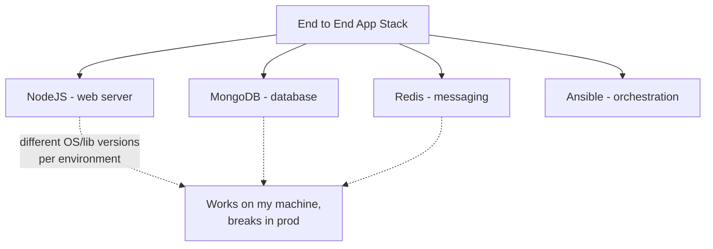
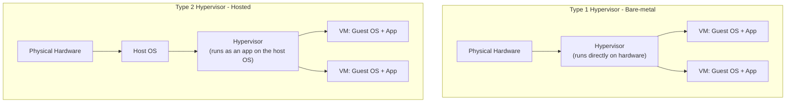
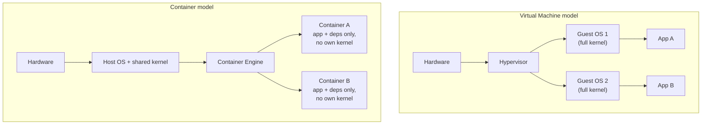
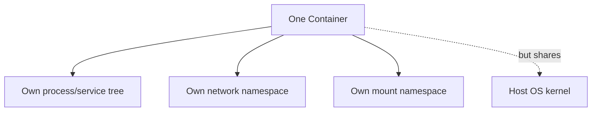
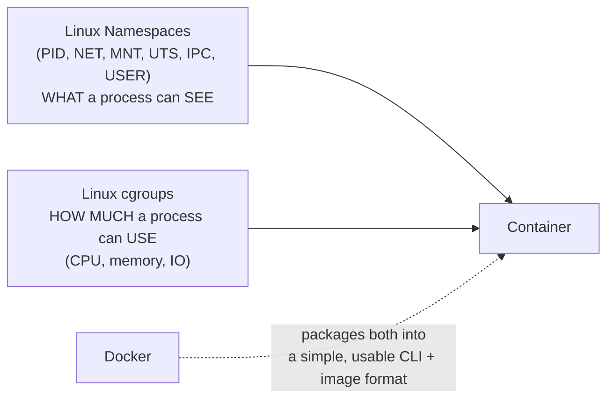
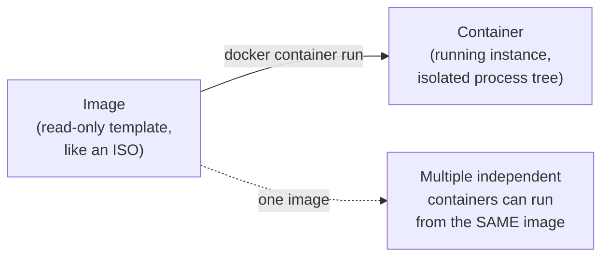

---
# Docker Containerization Essentials - Complete Notes

> [!info] How to read this note
> Everything traces back to the slide deck unless a line, block, or section is tagged **[EXTRA]** in bold. No emoji are used anywhere in this file, including callout titles.

---

# 01 - Why Do You Need Docker

> [!quote] Deck's scenario
> You need to set up an END TO END Application Stack including various technology: Web Server (NodeJS), Database (MongoDB), Messaging (Redis), Orchestration (Ansible). What are your expected issues?

> [!quote] Deck's definition
> E2E Application is a complete software application that covers every stage of workflow from start to finish.

## Issues (Cont')

> [!quote] Deck's content
> Compatibility. OS and Technologies. Libraries and Dependencies with Hardware. Environment Setup Time. Different DEV/TEST/PROD Environment.



**[EXTRA]** The deck lists the issues without naming the underlying pattern - this is literally the "works on my machine" problem, the single most common reason containerization exists at all. Each of the four listed issues (compatibility, OS/tech mismatch, library/hardware dependency drift, slow environment setup, DEV/TEST/PROD divergence) traces back to one root cause: an application's runtime environment was never captured as an artifact - it lived only in whatever state a specific machine happened to be in.

### Self-Check Q and A

1. **Q: The deck lists five separate "issues" (compatibility, OS/tech, libraries/hardware, setup time, DEV/TEST/PROD difference). What single underlying problem do all five actually stem from?**
   A: **[EXTRA]** None of these environments captured the application's actual runtime dependencies as a reproducible artifact - configuration and installed versions lived only in the state of a specific machine, so any two machines (a developer's laptop, a test server, production) could silently diverge. This is the "works on my machine" problem, and it's the reason containerization exists.

---

# 02 - Solutions - Initial Thoughts

> [!quote] Deck's content
> Solutions? Initial thoughts: separate each component into different infrastructure. Totally different physical machines? Virtual Machines.

## Virtual Machines

> [!quote] Deck's content
> Virtual Machines: a computer created by software instead of hardware. Type 1 (Bare-metal). Type 2 (Hosted). Issues: overhead because of higher utilization, heavy (GB), high boot time.

> [!quote] Deck's definition
> Utilization: how much of the machine's allocated resources it is using.



| Type | Runs on | Examples | Typical use |
|---|---|---|---|
| Type 1 (bare-metal) | Directly on hardware, no host OS underneath | VMware ESXi, Microsoft Hyper-V, KVM | Production data centers, cloud provider hypervisors (EC2 runs on a Type 1-style hypervisor) |
| Type 2 (hosted) | On top of an existing host OS, as an application | VirtualBox, VMware Workstation, Parallels | Local development/testing on a laptop |

**[EXTRA]** The deck names Type 1 and Type 2 without examples or the practical distinction that matters: Type 1 hypervisors have no host OS between themselves and the hardware, so they lose less performance to overhead and are what production cloud infrastructure (AWS EC2, VMware vSphere) actually runs on. Type 2 hypervisors run as a regular application inside an already-running OS, which is why they're heavier and slower but far more convenient for local development on a personal laptop.

### Self-Check Q and A

1. **Q: Why would a cloud provider like AWS use a Type 1 hypervisor for EC2 instances rather than a Type 2 hypervisor?**
   A: **[EXTRA]** Type 1 runs directly on the physical hardware with no host OS in between, minimizing the overhead layer and maximizing performance and density across many customer VMs on the same physical server - exactly what a cloud provider needs at scale. A Type 2 hypervisor's extra host-OS layer would waste resources and add latency across thousands of production hosts.

---

# 03 - What Is a Container

> [!quote] Deck's content
> Containers: what's making each OS different. A small, isolated box that contains your application + its dependencies (but it shares the host's OS kernel). Advantages: lower utilization, lightweight (less than GB), low boot time.

> [!quote] Deck's definition
> Utilization: how much of the container's allocated resources it is using.



| | Virtual Machine | Container |
|---|---|---|
| Isolation unit | Full guest OS, own kernel | Process-level, shares host kernel |
| Size | GB range | MB range (less than GB, per the deck) |
| Boot time | High | Low |
| Utilization overhead | Higher | Lower |

### Self-Check Q and A

1. **Q: The deck says a container "shares the host's OS kernel." What does this actually mean for what a container CAN and CANNOT do compared to a VM?**
   A: **[EXTRA]** A container has no kernel of its own - it makes system calls directly into the host's single running kernel, isolated only by kernel-level mechanisms (namespaces and cgroups, covered next). This is why a container starts almost instantly (no kernel to boot) but also why a container cannot run a different OS kernel than the host (a Linux container needs a Linux host kernel), unlike a VM, which boots its own independent guest kernel and can therefore run a genuinely different OS.

---

# 04 - Docker as a Containerization Tool

> [!quote] Deck's content
> A container is an isolated environment that has its own process/services, network, mounts. Like a VM but shares the same host OS kernel. Containers idea existed before Docker. Install Docker.



**[EXTRA]** The deck states "containers idea exist before Docker" as a bare fact without naming what came before. This is worth completing: Linux containers as a concept predate Docker by years, built on kernel primitives called **namespaces** (isolating what a process can see - its own PID tree, network stack, mount points, hostname) and **cgroups** (control groups - limiting how much CPU/memory/IO a process can use, covered later in the deck's own security section). Tools like LXC (Linux Containers) and even earlier `chroot`-based jails used these same primitives before Docker existed. Docker's actual innovation was not inventing containers - it was making them genuinely easy to build, package, distribute, and run through a simple CLI, a standard image format, and a public registry (Docker Hub) - turning a kernel feature that required deep expertise into something any developer could use in minutes.



### Self-Check Q and A

1. **Q: If the underlying kernel primitives (namespaces, cgroups) existed before Docker, what did Docker actually invent?**
   A: **[EXTRA]** Not the isolation mechanism itself - Docker's real contribution was tooling: a simple CLI to build and run containers, a standardized, portable image format (layered filesystem images), and a public registry (Docker Hub) for sharing them. It turned a low-level kernel capability that previously required deep Linux expertise (manually configuring namespaces/cgroups, or using LXC) into something usable by any developer in a few commands.
2. **Q: What are the three isolated resources the deck lists for a container, and which underlying kernel mechanism provides each?**
   A: Process/services, network, and mounts - each is isolated by a corresponding Linux namespace (PID namespace for processes, network namespace for networking, mount namespace for the filesystem view).

---

# 05 - Docker Platform Requirements

> [!quote] Deck's content
> Docker is available for Linux-based systems. Windows machines work around by installing Docker Desktop, which installs a Linux machine hypervisor. We will not use Docker Desktop - you need a Linux OS.

```bash
docker --version
```

**[EXTRA]** The deck's statement that Docker Desktop "installs a Linux machine hypervisor" is worth expanding, since it explains a genuinely common point of confusion for Windows/Mac users: because the Linux kernel is required (per section 04's sharing-the-host-kernel point), and Windows/macOS don't have a Linux kernel, Docker Desktop actually runs a lightweight Linux VM in the background (using WSL2 on Windows, or a hypervisor VM on macOS) and transparently routes all container operations into that VM. This means even a "native" Docker Desktop install is still ultimately running containers inside a real Linux kernel - the deck's own earlier point that containers cannot exist without a Linux kernel to share still holds true even there.

### Self-Check Q and A

1. **Q: A student installs Docker Desktop on Windows and successfully runs Linux containers. Does this contradict the deck's earlier statement that containers share the host's kernel, which must be Linux?**
   A: **[EXTRA]** No - Docker Desktop on Windows transparently runs a real Linux kernel underneath (via WSL2 or a lightweight VM) and routes all container operations into it. The containers are still sharing a genuine Linux kernel; it's simply hidden inside a VM layer that Docker Desktop manages automatically, so from the container's perspective nothing is different.

---

# 06 - Image and Container Definitions

> [!quote] Deck's content
> Image: is a package or template or definition used to create a container - think of it as an ISO. Container: running instance of an image, isolated, has its own set of processes.



**[EXTRA]** The deck's own ISO analogy is genuinely useful and worth extending: an ISO file is a static template you can install/boot from repeatedly without the ISO itself ever changing. Similarly, one Docker image can spawn any number of independent, isolated running containers - starting a second or third container from the same image does not modify the image at all, and each running container gets its own writable layer on top of the shared read-only image layers (this writable layer concept is expanded in the layered architecture section later).

### Self-Check Q and A

1. **Q: You run `docker container run nginx` three times without removing any of the resulting containers. How many images exist afterward, and how many containers?**
   A: One image (`nginx`, unchanged by any of the runs) and three separate, independent containers - each is its own isolated running instance with its own writable layer, process tree, and (unless configured otherwise) its own network identity, all created from the same unmodified image template.

---
