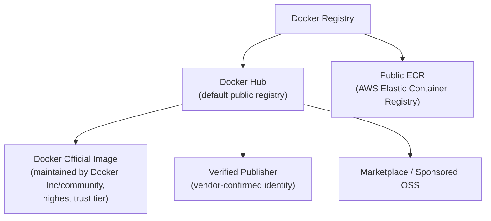
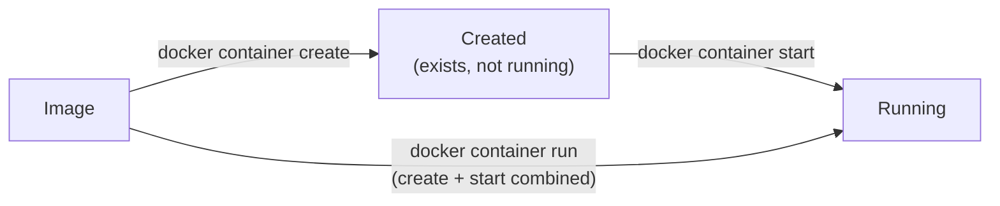
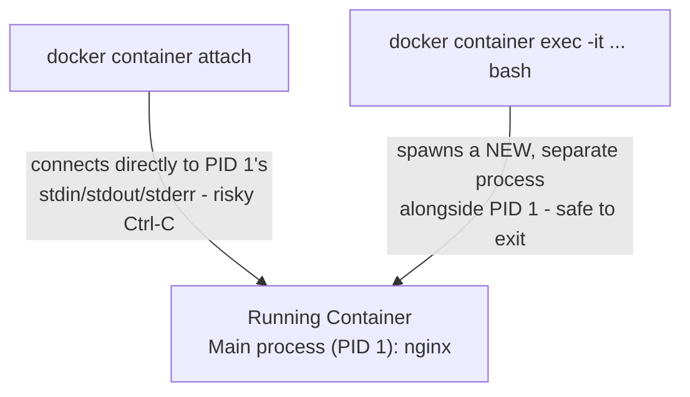
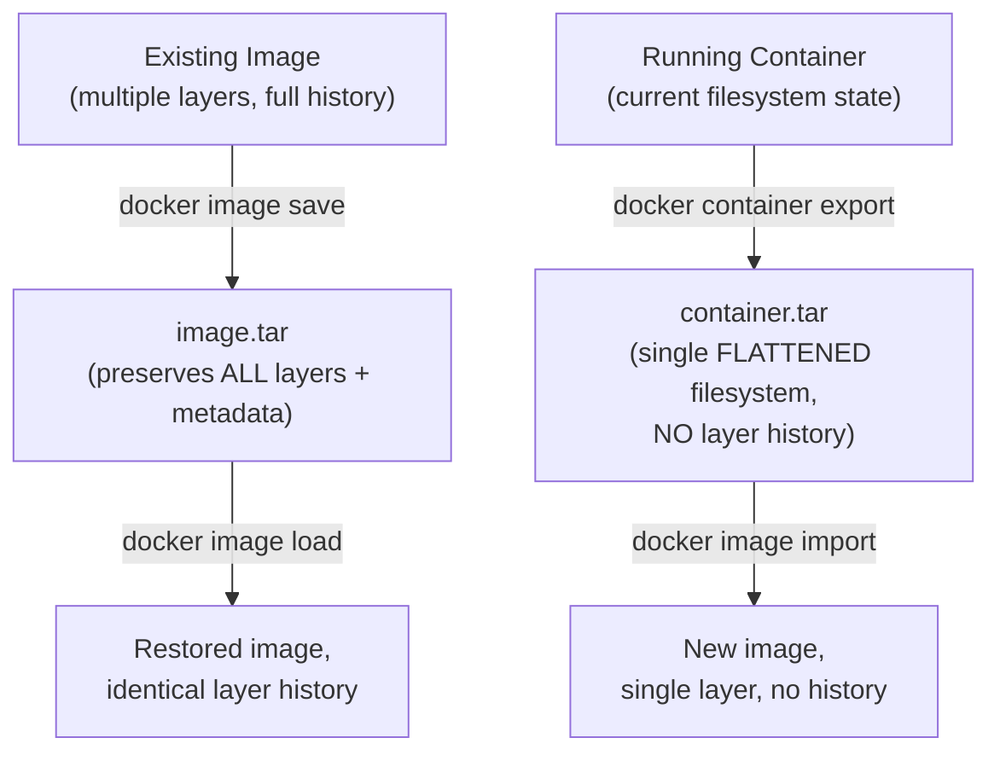
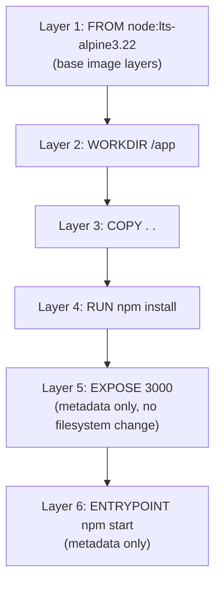
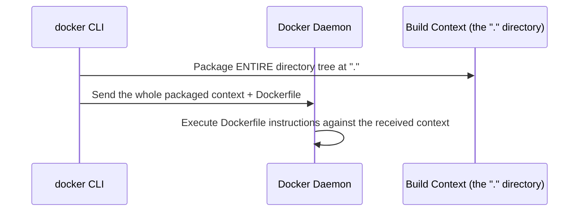
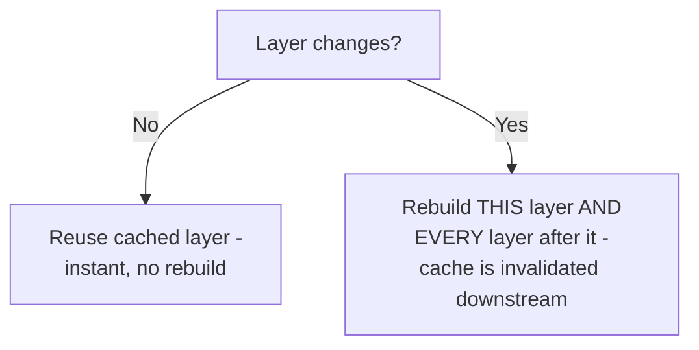
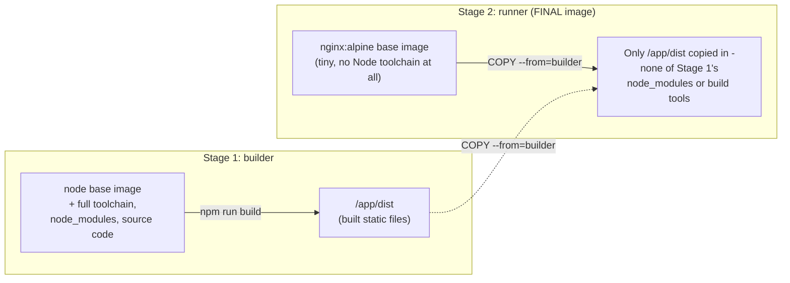

# 07 - Docker Registries and Image Types

> [!quote] Deck's content
> To create a container you need the template. Docker Registry: Docker Hub, Public ECR ("Elastic Container Registry"). Image Types: Docker Official Image, Verified Publisher, Marketplace/Sponsored OSS.



**[EXTRA]** The deck names three image trust tiers without explaining why the distinction matters practically. This is a genuine security consideration: an Official Image undergoes Docker's own review and hardening process and is generally the safest starting point for a base image (e.g., `nginx`, `node`, `postgres` with no username prefix are official images). A Verified Publisher image confirms the publishing organization's identity but doesn't carry Docker's own review. Anything else - a random user's public image with no verification - carries the least trust, since it could contain anything, including malware, unpatched CVEs, or intentionally backdoored software. For production use, defaulting to Official Images or explicitly vetted Verified Publisher images (and scanning everything regardless, covered in the security section later) is standard practice.

**[EXTRA]** Private registries beyond the deck's two examples, genuinely relevant for a real DevOps role:

| Registry | Provider |
|---|---|
| Docker Hub | Docker Inc, public default |
| Amazon ECR | AWS - both public and private repositories |
| Google Artifact Registry / GCR | Google Cloud |
| Azure Container Registry (ACR) | Microsoft Azure |
| GitHub Container Registry (GHCR) | GitHub, tightly integrated with GitHub Actions CI |
| Harbor | Self-hosted, open-source private registry |

### Self-Check Q and A

1. **Q: Why would a company running production workloads on AWS choose a private Amazon ECR repository over pulling images directly from Docker Hub in their deployment pipeline?**
   A: **[EXTRA]** Private ECR keeps proprietary images out of any public registry, integrates directly with IAM for access control, avoids Docker Hub's public pull-rate limits, and typically has lower latency/cost when pulling from within the same AWS region than pulling across the public internet from Docker Hub.
2. **Q: Between an Official Image and a random unverified user's public image on Docker Hub, which is the safer default choice for a production base image, and why?**
   A: **[EXTRA]** The Official Image - it goes through Docker's own review/hardening process, whereas an unverified public image could contain anything from outdated vulnerable packages to intentionally malicious code, with no vetting at all.

---

# 08 - Image Naming Convention

> [!quote] Deck's content
> To create a container you need the template. Example: `docker.io/salma22/bakehouse:v1`. Parts: Registry, User, Image name, Tag => Version, Supported Infra. To bring an image before creating a container: `docker image pull <Image>`.

```
docker.io   /   salma22   /   bakehouse   :   v1
   |               |             |             |
registry         user       image name        tag
(hostname)     (namespace)                  (version)
```

```bash
docker image pull <Image>
```

**[EXTRA]** The deck labels the tag as "Version, Supported Infra" without unpacking what "supported infra" means in a real tag. Multi-platform image tags are a genuinely important, commonly misunderstood detail:
node:20-alpine # version 20, built on the lightweight Alpine Linux base  
node:20-bullseye # version 20, built on Debian Bullseye base - different OS underneath, different size/tooling  
node:20-slim # version 20, minimal Debian-based variant, smaller than full bullseye
> [!important] Omitting the registry defaults to Docker Hub
> **[EXTRA]** `docker image pull nginx` is shorthand for `docker image pull docker.io/library/nginx:latest` - if no registry is specified, Docker defaults to `docker.io`; if no user/namespace is given, official images live under the implicit `library/` namespace; if no tag is given, it defaults to `:latest`. Relying on `:latest` in production is itself a common anti-pattern, expanded on below.

> [!warning] `:latest` is not a stable version - it's a moving pointer
> **[EXTRA]** The `:latest` tag simply means "whatever the most recently pushed image was" - it is not guaranteed to be any particular version and can silently change to a different (potentially breaking) build between one pull and the next. Production deployments should always pin an explicit, immutable version tag (or better, a content-addressable digest, `image@sha256:...`) rather than relying on `:latest`, to guarantee the exact same image is deployed every time.

### Self-Check Q and A

1. **Q: `docker image pull nginx` and `docker image pull docker.io/library/nginx:latest` produce the exact same result. Why?**
   A: `nginx` alone is shorthand - Docker fills in the defaults: `docker.io` as the registry (since none was specified), `library/` as the implicit namespace for official images (since no user was given), and `:latest` as the tag (since none was given).
2. **Q: A production deployment pipeline pulls `myapp:latest` on every deploy. Six months later, a deploy suddenly breaks with no code change on the team's side. What's a likely cause, and how would pinning a specific tag or digest have prevented it?**
   A: **[EXTRA]** `:latest` is a mutable pointer - if anyone (a teammate, an automated build) pushed a new image under the `latest` tag in the meantime, the next pull silently retrieves that different image, which could contain breaking changes never reviewed by this deployment's own pipeline. Pinning to an explicit version tag or a content digest (`@sha256:...`) guarantees the exact same image bytes are pulled every single time, regardless of what else gets pushed to the registry later.

---

# 09 - Docker Command Structure

> [!quote] Deck's content
> Docker Commands Structure: `docker <Docker Object> <Sub Command> [Options] [Arguments]`. System.

docker container run -p 8080:80 nginx  
| | | | |  
tool object subcommand options argument

**[EXTRA]** The deck's grammar is correct but worth reinforcing with the actual object list, since every command covered in the rest of the deck follows this exact pattern:

| Docker Object | Example subcommands |
|---|---|
| `container` | `run`, `ls`, `stop`, `rm`, `exec`, `logs` |
| `image` | `pull`, `ls`, `rm`, `build`, `tag` |
| `volume` | `create`, `ls`, `rm`, `inspect` |
| `network` | `create`, `ls`, `rm`, `connect` |
| `system` | `df`, `prune`, `info` |
| `compose` | `up`, `down`, `ps`, `logs` |

> [!tip] Legacy shorthand commands still work but hide the object
> **[EXTRA]** Older Docker versions only had flat commands like `docker run`, `docker ps`, `docker rm` with no explicit object. These still work today as shortcuts (`docker run` is equivalent to `docker container run`), but the deck's structured `docker <object> <subcommand>` form is the modern, explicit, and more discoverable convention - and is what the rest of this deck consistently uses.

### Self-Check Q and A

1. **Q: `docker ps` and `docker container ls` do the same thing. Why do both exist?**
   A: **[EXTRA]** `docker ps` is the older, pre-object-model shorthand syntax, kept for backward compatibility. `docker container ls` is the modern, explicit `<object> <subcommand>` form the deck teaches, which is more consistent and discoverable across all Docker objects (`image ls`, `volume ls`, `network ls` all follow the same pattern, whereas the legacy shorthand commands don't share a consistent naming scheme).

---

# 10 - Container Basic Operations

> [!quote] Deck's content
> Container Basic Operation: `docker container create`, `docker container ls`, `docker container start`, `docker container run`.

```bash
docker container create <image>     # creates a container from an image, but does NOT start it
docker container ls                   # list RUNNING containers only
docker container ls -a                 # list ALL containers, including stopped ones
docker container start <container>      # start an already-created (or stopped) container
docker container run <image>              # create AND start in one step - the command actually used most often
```



**[EXTRA]** The deck lists `create`, `ls`, `start`, `run` without clarifying the relationship between `create`+`start` versus `run` - genuinely worth stating explicitly since beginners often don't realize `run` is just a convenience wrapper around the other two: `docker container run` = `docker container create` followed immediately by `docker container start`. You would use `create` alone (without immediately starting) in scripted setups where you want to configure something about the container between creation and first start - a rare need in practice, which is why `run` is by far the more commonly used command.

```bash
docker container run -d nginx           # -d = detached, runs in background, returns your shell immediately
docker container run -it ubuntu bash     # -i interactive + -t tty = an interactive shell session inside the container
docker container run --rm alpine echo hi  # --rm = automatically remove the container once it exits
```

### Self-Check Q and A

1. **Q: What's the actual relationship between `docker container run` and `docker container create` + `docker container start`?**
   A: `run` is a single command that performs both steps at once - create the container from the image, then immediately start it. They produce an identical end result; `run` is simply more convenient for the overwhelmingly common case of wanting a container running right away.
2. **Q: `docker container ls` shows nothing even though you know you ran several containers earlier. What flag reveals them, and why does the default `ls` hide them?**
   A: `docker container ls -a` (all). By default, `ls` only shows RUNNING containers - any container that has stopped (exited normally, crashed, or was manually stopped) is hidden unless you explicitly ask for all containers regardless of state.

---

# 11 - Container Interaction Operations

> [!quote] Deck's content
> Container Interaction Operation: `docker container attach`, `docker container exec`, `docker container cp`, `docker container run -p "publish port"`.

```bash
docker container attach <container>              # attach your terminal to the container's MAIN process (PID 1)
docker container exec -it <container> bash          # start a NEW additional process inside a running container
docker container cp <container>:/path ./local          # copy files between the container and the host, either direction
docker container run -p 8080:80 nginx                    # publish port: host_port:container_port
```

> [!important] `attach` versus `exec` - a genuinely important distinction the deck lists side by side without contrasting
> **[EXTRA]** `attach` connects your terminal directly to the container's already-running main process (PID 1) - if that process is a web server writing logs, you'll see its live stdout, and if you press Ctrl-C, you risk killing the container's main process entirely, stopping the container. `exec` instead starts a brand-new, separate process inside the already-running container's namespaces (most commonly an interactive shell) - closing that shell (or its own Ctrl-C) only ends that one exec'd process, leaving the container's actual main process completely untouched and still running. In almost all day-to-day troubleshooting ("let me get a shell inside this running container to poke around"), `exec` is the correct, safer tool - `attach` is reserved for genuinely wanting to interact with the container's own primary foreground process.



```bash
docker container run -p 8080:80 nginx    # host:8080 -> container:80
```

### Self-Check Q and A

1. **Q: You run `docker container attach webapp` to check on a running Node.js server, then press Ctrl-C to detach and return to your own shell. What actually happens to the container, and why?**
   A: **[EXTRA]** Ctrl-C sends SIGINT directly to the attached process (the container's PID 1, the Node server itself) - unless that process specifically ignores SIGINT, this stops the main process, which stops the entire container. This is exactly why `exec` is preferred for routine "let me look inside" troubleshooting - it avoids this risk entirely.
2. **Q: What does `-p 8080:80` in `docker container run -p 8080:80 nginx` actually mean, and which number is the container's internal port?**
   A: It maps host port 8080 to container port 80 - traffic hitting the HOST machine on port 8080 gets forwarded into the container's port 80 (where nginx is actually listening). The syntax order is always `host_port:container_port`.

---

# 12 - Container Monitoring Operations

> [!quote] Deck's content
> Container Monitoring Operation: `docker container inspect`, `docker container stats`, `docker container top`, `docker container logs`.

```bash
docker container inspect <container>    # full JSON dump - config, network settings, mounts, environment, everything
docker container stats <container>        # live CPU/memory/network/IO usage, updating continuously
docker container top <container>           # list processes running INSIDE the container (like ps, but scoped to it)
docker container logs <container>           # view the container's captured stdout/stderr output
docker container logs -f <container>          # follow logs live, same concept as "tail -f"
```

**[EXTRA]** The deck lists these four commands without indicating which one to reach for in which situation - a practical troubleshooting order worth adding:

| Symptom | Reach for |
|---|---|
| "Why did the app inside crash / what did it print before dying?" | `logs` |
| "Is this container eating all my host's CPU/RAM right now?" | `stats` |
| "What processes are actually running inside this container?" | `top` |
| "What exact config/network/mount settings does this container have?" | `inspect` |

### Self-Check Q and A

1. **Q: A container is consuming an unexpectedly large amount of memory. Which monitoring command shows this live, and which would you check next to find out WHY?**
   A: **[EXTRA]** `docker container stats` shows live resource consumption first, confirming and quantifying the memory usage. `docker container top` (to see what processes are actually running inside) or `docker container logs` (to see if the app itself is logging errors, memory leaks, or unusual activity) would be the natural next steps to find the root cause.

---

# 13 - Stopping and Removing Containers

> [!quote] Deck's content
> Stopping and Removing Containers Operation: `docker container pause`, `docker container unpause`, `docker container stop`, `docker container kill`, `docker container rm`, `docker container prune`.

```bash
docker container pause <container>       # freeze ALL processes inside - no CPU time at all, but stays in memory
docker container unpause <container>       # resume from paused state
docker container stop <container>            # send SIGTERM (graceful), then SIGKILL after a grace period if it hasn't exited
docker container kill <container>              # send SIGKILL immediately - no grace period, no chance to clean up
docker container rm <container>                  # remove a STOPPED container (fails on a running one without -f)
docker container prune                              # remove ALL stopped containers at once, bulk cleanup
```

> [!important] `stop` versus `kill` - the same distinction that matters for signals generally
> **[EXTRA]** The deck lists these side by side without contrasting the actual behavior difference. `stop` is the graceful option: it sends SIGTERM, giving the process inside a chance to shut down cleanly (close database connections, flush buffers, finish in-flight requests), and only escalates to a forceful SIGKILL if the process hasn't exited within a grace period (10 seconds by default). `kill` skips straight to SIGKILL with zero grace period - the process is terminated instantly with no chance to clean up anything. `stop` should be the default choice; `kill` is for genuinely unresponsive containers that `stop` already failed to shut down.

> [!important] `pause` is fundamentally different from `stop`
> **[EXTRA]** `pause` does not terminate anything - it uses the cgroup freezer to suspend every process inside the container so it receives zero CPU cycles, while the container's full state (memory, open connections, process tree) remains intact in memory. `unpause` resumes it exactly where it left off. This is useful for temporarily freeing up CPU for something else without losing container state, genuinely different from `stop`'s termination-and-restart model.

### Self-Check Q and A

1. **Q: A container running a database becomes unresponsive to `docker container stop` even after the default grace period. What's the next escalation, and what's the tradeoff of using it?**
   A: `docker container kill`, which sends SIGKILL immediately with no further grace period. The tradeoff: the process inside gets absolutely no chance to flush buffers or close connections cleanly, risking data corruption for a database specifically - `kill` should genuinely be a last resort after `stop` has already been given a fair chance.
2. **Q: What's the practical difference between pausing a container and stopping it?**
   A: **[EXTRA]** `pause` freezes all processes inside in place (via the cgroup freezer) with zero CPU usage but the full container state intact in memory, resumable instantly with `unpause`. `stop` actually terminates the container's main process - restarting it later means the process starts fresh, not resuming mid-execution.

---

# 14 - Image Basic Operations

> [!quote] Deck's content
> Image basic Operation: `docker login`, `docker image pull`, `docker image ls`, `docker image search`.

```bash
docker login                  # authenticate against a registry (Docker Hub by default)
docker image pull <image>       # download an image from a registry
docker image ls                  # list images stored locally
docker image search <term>         # search Docker Hub for images matching a keyword
```

### Self-Check Q and A

1. **Q: Why is `docker login` a prerequisite before pulling certain images, when many public images (like `nginx`) can be pulled without ever logging in?**
   A: **[EXTRA]** Public images on a public registry require no authentication at all. `docker login` is only required for private images/repositories (your own company's private ECR/Docker Hub repo) or to raise Docker Hub's anonymous pull-rate limits, which are more restrictive for unauthenticated pulls than for logged-in accounts.

## Image Create Operations

> [!quote] Deck's content
> Image Create Operation: `docker image tag`, `docker image save`, `docker image load`. From Running Container: `docker container export`, `docker container commit`. Then: `docker image import`.

```bash
docker image tag <source> <target>        # give an existing image an additional name/tag - no new image data created
docker image save <image> -o file.tar        # export an image (with all its layers/history) to a tar archive
docker image load -i file.tar                  # import an image previously saved with "save" - restores full layer history

docker container export <container> -o file.tar   # export a container's CURRENT FILESYSTEM STATE (flattened, no layer history)
docker image import file.tar                        # import that flattened filesystem as a new single-layer image
docker container commit <container> <new-image>       # turn a running/stopped container's current state directly into a new image
```

> [!important] `save`/`load` versus `export`/`import` - genuinely different, easy to conflate
> **[EXTRA]** The deck places these in the same slide without contrasting them, but they operate on fundamentally different things and produce different results. `save`/`load` operate on an IMAGE and preserve its full layer history and metadata (tags, build history) - the round trip is lossless. `export`/`import` operate on a CONTAINER's current filesystem and produce a single flattened layer with no history at all - useful for capturing a container's exact current disk state as a fresh base image, but you lose the original image's layer-by-layer build history in the process.



### Self-Check Q and A

1. **Q: A colleague uses `docker container export` on a running container to "back it up as an image," expecting to later inspect the individual build layers with `docker history`. What will they actually find?**
   A: **[EXTRA]** `export` flattens the container's entire filesystem into a single archive with no layer history at all - the resulting imported image will show as one single layer via `docker history`, with none of the original build steps preserved. `docker image save` on the original image (not `container export`) would have been the correct choice to preserve full layer history.
2. **Q: What's the practical use case for `docker container commit`?**
   A: Capturing whatever state a running container has reached right now - including any manual changes made interactively inside it (installed packages, edited config files) - directly as a new reusable image, without writing or rebuilding from a Dockerfile. Useful for quick experimentation, though generally considered less reproducible/maintainable than defining the same changes in a Dockerfile.

## Image Remove Operations

> [!quote] Deck's content
> Image Remove Operation: `docker image rm`, `docker image prune`.

```bash
docker image rm <image>       # remove a specific image (fails if a container still references it)
docker image prune              # remove all DANGLING images (untagged, unreferenced layers) - safe cleanup
docker image prune -a             # remove ALL images not currently used by any container - aggressive cleanup
```

### Self-Check Q and A

1. **Q: What's the difference between `docker image prune` and `docker image prune -a`, and why does the distinction matter before running either on a shared build server?**
   A: **[EXTRA]** Plain `prune` only removes dangling images - untagged layers left behind from rebuilds that nothing references anymore, genuinely safe cleanup. `prune -a` removes every image not currently backing a running container, including tagged images you may still want cached locally for a future build or deploy - running it carelessly on a shared CI/build server can force expensive re-pulls of images the next job actually needed.

---

# 15 - Customized Images

> [!quote] Deck's content
> Why would you need to create your own image: not find a component or service, your application dockerized for ease of shipping and deploying. You need to know: what are you containerizing or what application we are creating an image for, how the application is built (steps to deploy the application manually).

> [!important] Deck's own key insight
> Before writing a Dockerfile for anything, you must already know how to deploy that application manually, step by step, on a bare machine - a Dockerfile is just those exact same manual steps expressed as automated, repeatable instructions.

**[EXTRA]** This is worth reinforcing as the single most important mental model for writing any Dockerfile: if you cannot describe, in order, exactly how you would install and run an application on a fresh Linux machine by hand (install runtime, install dependencies, copy code, set environment, run the start command), you are not ready to write a correct Dockerfile for it - the Dockerfile is a literal, automatable transcription of that manual process.

### Self-Check Q and A

1. **Q: Why does the deck insist you must know "how the application is built [steps to deploy manually]" before writing a Dockerfile?**
   A: A Dockerfile is fundamentally a scripted, repeatable version of the exact manual deployment steps - installing the runtime, dependencies, copying code, configuring the environment, and specifying the start command. Without first knowing those manual steps, there is no correct sequence of instructions to automate.

## Dockerfile Instructions - FROM, RUN, COPY, ENTRYPOINT

> [!quote] Deck's content
> Dockerfile must start with a FROM instruction (base image). RUN instruction: run a particular command. COPY instruction: copy from local to image. ENTRYPOINT: allow us to specify the command/task that will run in the container.

```bash
mkdir simple-node-app
cd simple-node-app
npm init -y
npm install express
```

```javascript
// server.js
const express = require("express");
const app = express();

app.get("/", (req, res) => {
  res.send("Hello from simple Node.js app!");
});

const PORT = 3000;
app.listen(PORT, () => {
  console.log(`App running on http://localhost:${PORT}`);
});
```

| Instruction | Purpose per the deck |
|---|---|
| `FROM` | The base image everything else builds on top of - MANDATORY first instruction |
| `RUN` | Execute a command at BUILD time (installing packages, compiling code) |
| `COPY` | Copy files from the local build context into the image filesystem |
| `ENTRYPOINT` | Specify the command/task that runs when the CONTAINER starts |

> [!important] Why FROM must be first, mechanically
> **[EXTRA]** Every subsequent instruction operates on top of the filesystem state established by the base image - `RUN`, `COPY`, and everything else need a starting filesystem to modify. There is no valid "blank slate" to build from without first declaring a base image (even `FROM scratch`, an genuinely empty base, is still an explicit FROM statement).

### Self-Check Q and A

1. **Q: What's the actual difference in WHEN `RUN` and `ENTRYPOINT` instructions execute?**
   A: `RUN` executes during the IMAGE BUILD process (`docker build`) - its effects become a permanent layer baked into the image. `ENTRYPOINT` defines what runs when a CONTAINER STARTS (`docker container run`) - it executes fresh every time a new container is launched from that image, not during the build.

## Layered Architecture

> [!quote] Deck's content
> Each line of instruction creates a new layer inside the Docker image, with just the change from the previous layer. Each layer is cached.

```dockerfile
FROM node:lts-alpine3.22
WORKDIR /app
COPY . .
RUN npm install
EXPOSE 3000
ENTRYPOINT npm start
```

```bash
docker build . -t mynode-app
```



**[EXTRA]** The deck states each instruction creates a layer and each layer is cached, but doesn't explain the practical consequence of layer ORDER - which is exactly what the next two deck sections (build context, caching/invalidation) build directly on. Layers are stacked and each one is only rebuilt if it OR anything before it in the file changes - so instruction order in a Dockerfile has a real, measurable performance impact, expanded fully below in the caching section.

**[EXTRA]** Not every instruction produces a filesystem layer. `EXPOSE`, `ENV`, `LABEL`, `CMD`, and `ENTRYPOINT` are metadata-only instructions - they add a tiny metadata layer to the image manifest but do not change the actual filesystem contents, unlike `RUN`, `COPY`, and `ADD`, which do write real filesystem changes into a new layer.

### Self-Check Q and A

1. **Q: Does `EXPOSE 3000` in a Dockerfile create a filesystem layer the same way `RUN npm install` does?**
   A: **[EXTRA]** No - `EXPOSE` (like `ENV`, `LABEL`, `CMD`, `ENTRYPOINT`) is a metadata-only instruction. It adds an entry to the image's manifest/config but writes no actual files to the image filesystem, unlike `RUN`, `COPY`, and `ADD`, which produce real filesystem-changing layers.

## Build Context

> [!quote] Deck's content
> `docker build . -t mynode-app`. Where the Docker daemon should search for the Dockerfile and supporting/using files. Important to make sure that you only have necessary files for the build image. Temporary/unneeded files (logs, local builds) will increase build time.



> [!important] The build context is sent to the daemon in full, before the build even starts
> **[EXTRA]** The deck states this but is worth making mechanically explicit: `docker build .` does not simply "look at" the current directory - the Docker client packages the ENTIRE contents of that directory (every file, every subdirectory, recursively) and transmits it to the Docker daemon BEFORE a single build instruction executes. If that directory contains a multi-gigabyte `node_modules/`, a `.git/` history, or old log files, all of it gets uploaded to the daemon on every single build, regardless of whether the Dockerfile ever references those files - this is exactly the performance problem the deck flags and exactly what `.dockerignore` (next section) exists to solve.

### Self-Check Q and A

1. **Q: A Dockerfile's `COPY . .` instruction only copies specific application files that the container actually needs, but `docker build .` is still consistently slow on a project with a large `.git` directory. Why does the .git directory slow the build down if the Dockerfile never references it?**
   A: **[EXTRA]** The entire build context - everything in the directory passed to `docker build`, including `.git` - gets transmitted to the Docker daemon before any Dockerfile instruction runs, regardless of whether the Dockerfile's `COPY` instructions ever reference those specific files. The slowdown happens at the context-transmission step, not at the `COPY` step.

## .dockerignore

> [!quote] Deck's content
> Defines files/directories to be ignored and won't be sent to the Docker daemon.

```dockerfile
FROM node:lts-alpine3.22
WORKDIR /app
COPY . .
RUN npm install
EXPOSE 3000
ENTRYPOINT npm start
```

## .dockerignore - directly solves the build context problem above

node_modules  
.git  
*.log  
.env  
Dockerfile  
.dockerignore

> [!important] `.dockerignore` works exactly like `.gitignore`, and solves the exact problem from the previous section
> **[EXTRA]** Excluding `node_modules` is especially important here - if it's present locally and not ignored, it gets uploaded into the build context, then `RUN npm install` inside the container reinstalls dependencies fresh anyway (since the container's OS/architecture may differ from the host's), making the locally-present `node_modules` pure wasted upload with zero benefit.

### Self-Check Q and A

1. **Q: Why is excluding `node_modules` from `.dockerignore` a double waste, not just a slow build context upload?**
   A: **[EXTRA]** It's uploaded into the build context for nothing (the Dockerfile's own `RUN npm install` reinstalls dependencies fresh inside the container regardless, since the container's OS/CPU architecture may not match the host's local `node_modules` build), AND it bloats every single `docker build` invocation with a large, entirely unnecessary upload.

## Caching Layers and Invalidation

> [!quote] Deck's content
> Compare instructions in the Dockerfile. Compare checksums of files in ADD or COPY instructions.

```dockerfile
FROM node:lts-alpine3.22
WORKDIR /app
COPY . .
RUN pwd
RUN npm install        # Invalidate Layer
EXPOSE 3000              # Invalidate Layer
ENTRYPOINT npm start       # Invalidate Layer
```

```bash
docker build . -t mynode-app:v3 --no-cache=true
```

> [!quote] Deck's own question, and its cache-busting example
> What is the issue?
> ```
> RUN apt-get update
> RUN apt-get install -y python
> ```
> Cache Busting.



**[EXTRA]** Answering the deck's own open question ("What is the issue???") about the `apt-get update` / `apt-get install` example, since the deck poses it without answering it: this is the classic Docker cache-busting bug. `RUN apt-get update` refreshes the package index and gets cached as a layer. On a REBUILD days or weeks later, if nothing above that line in the Dockerfile changed, Docker reuses the CACHED `apt-get update` layer rather than re-running it - meaning the package index inside the image can silently become stale relative to the actual upstream repositories, while `apt-get install -y python` on the next line still runs (or is also cached) against that now-outdated index, potentially failing to find a package, pulling in an unexpectedly old version, or failing outright if the cached index references packages that have since been removed upstream.

```dockerfile
# The fix - combine update and install into ONE instruction, so caching treats them as one atomic unit:
RUN apt-get update && apt-get install -y python
```

> [!important] Why combining into one RUN line fixes it
> **[EXTRA]** Docker's cache key for a `RUN` instruction is the instruction's exact text plus everything that came before it - it has no way to know that a separate, later `RUN apt-get install` logically depends on a fresh index from an earlier, separately-cached `RUN apt-get update`. Combining them into a single `RUN` line with `&&` means the ENTIRE operation (update AND install together) is cached or invalidated as one atomic unit - if the layer runs at all, both `update` and `install` genuinely run together, fresh, using the same package index.

> [!important] Layer invalidation cascades downstream
> **[EXTRA]** The deck marks `RUN npm install`, `EXPOSE 3000`, and `ENTRYPOINT npm start` as "Invalidate Layer" in its own example, worth explaining why: once `COPY . .` changes (any file in the copied context differs, detected via checksum comparison as the deck states), every single instruction AFTER that point in the Dockerfile must be rebuilt from scratch, even if those later instructions' own text never changed - caching only reuses a layer if its own instruction text is unchanged AND every layer before it was also reused from cache. This is exactly why Dockerfile instruction ORDER matters for build speed: put instructions that change rarely (installing the runtime, installing dependencies from a lockfile) BEFORE instructions that change on every single build (copying application source code), so the expensive, rarely-changing steps stay cached across most builds.

```dockerfile
# BETTER ORDER - dependencies installed BEFORE the full source copy,
# so "npm install" stays cached even when application code changes:
FROM node:lts-alpine3.22
WORKDIR /app
COPY package*.json ./         # only the small, rarely-changing dependency manifest
RUN npm install                 # cached across builds UNLESS package*.json actually changed
COPY . .                          # the frequently-changing application source, copied LAST
EXPOSE 3000
ENTRYPOINT npm start
```

### Self-Check Q and A

1. **Q: The deck's own example marks `RUN apt-get update` followed by a separate `RUN apt-get install -y python` as buggy, and asks "what is the issue?" without answering. What is the actual issue?**
   A: **[EXTRA]** Docker caches each `RUN` line independently by its own instruction text. On a rebuild, if the `apt-get update` line's text hasn't changed, Docker reuses its CACHED result rather than genuinely re-running it - meaning the package index can silently go stale across rebuilds, while `apt-get install` runs against that potentially outdated index, risking missing packages, unexpected old versions, or install failures. The fix is combining both into a single `RUN apt-get update && apt-get install -y python` line so they're cached and invalidated together as one atomic operation.
2. **Q: Given the caching mechanics, why does copying `package*.json` and running `npm install` BEFORE copying the rest of the application source code (rather than one combined `COPY . .` followed by `npm install`) meaningfully speed up most day-to-day rebuilds?**
   A: **[EXTRA]** Application source code changes on nearly every build, but the dependency manifest (`package.json`/`package-lock.json`) changes rarely. By copying only the manifest first and running `npm install` against just that, the (often slow) install step stays cached across every rebuild where only the application source changed - the full, slower `npm install` only re-runs when dependencies themselves genuinely changed, not on every single code edit.

## COPY versus ADD

> [!quote] Deck's content
> Both COPY and ADD are used to copy files from the local filesystem to the image filesystem. `FROM ubuntu` + `COPY /src /dist` versus `FROM ubuntu` + `ADD /src /dist`. It is recommended to use COPY - straightforward. ADD extracts tar files from local to image, or can specify a URL and download into a particular path in the image filesystem.

| | COPY | ADD |
|---|---|---|
| Copies local files | Yes | Yes |
| Auto-extracts local tar archives | No | Yes |
| Can fetch a remote URL | No | Yes |
| Recommended default | Yes, per the deck | Only for its specific extra behaviors |

> [!warning] Why COPY is the recommended default, beyond just "straightforward"
> **[EXTRA]** ADD's extra behaviors (auto tar-extraction, remote URL fetching) are implicit and can surprise anyone reading the Dockerfile later - a `COPY` instruction always does exactly one predictable thing (plain file copy), while an `ADD` instruction's actual behavior depends on the source argument's content, which is not obvious from reading the Dockerfile text alone. This is the actual reasoning, beyond the deck's brief "straightforward," behind official Docker best-practice guidance to default to COPY and reach for ADD only when its specific extra behavior (tar extraction, remote fetch) is genuinely needed.

### Self-Check Q and A

1. **Q: A Dockerfile uses `ADD https://example.com/app.tar.gz /app/` instead of downloading the file separately and using COPY. What real risk does this introduce that a plain COPY of a local file wouldn't have?**
   A: **[EXTRA]** The remote URL's content is fetched fresh at build time from a third party outside your control - if that URL changes, goes down, or is compromised, your build result silently changes or fails, with no local record of exactly what was fetched. A COPY of a locally-vendored file (downloaded once, checked into or cached alongside your build context) is fully reproducible and auditable in a way a live remote fetch inside ADD is not.

## EXPOSE, USER, WORKDIR

> [!quote] Deck's content
> DockerFile Instructions: EXPOSE, USER, WORKDIR.

| Instruction | Purpose |
|---|---|
| `EXPOSE` | Documents which port(s) the container listens on - purely informational/metadata, does NOT actually publish the port (that's what `-p` on `docker container run` does) |
| `USER` | Sets which user the container's subsequent instructions and the final running process execute as - directly relevant to the deck's own later root-user security section |
| `WORKDIR` | Sets the working directory for all subsequent instructions (RUN, COPY, CMD, ENTRYPOINT) - also creates the directory if it doesn't exist |

> [!important] EXPOSE does not actually open or publish anything
> **[EXTRA]** This is a very common beginner misconception the deck's bare list doesn't warn against: `EXPOSE 3000` in a Dockerfile is purely documentation/metadata for anyone reading the image (and for tools like `docker container run -P`, which auto-publishes all EXPOSE'd ports to random host ports) - it does not, by itself, make the port reachable from outside the container. Actually publishing a port to the host requires the `-p host_port:container_port` flag on `docker container run`, entirely independent of whatever the Dockerfile's EXPOSE instruction says.

```dockerfile
FROM node:lts-alpine3.22
WORKDIR /app
COPY . .
RUN npm install
EXPOSE 3000
USER node                 # run as the non-root 'node' user provided by the official node image, not root
ENTRYPOINT npm start
```

> [!important] USER connects directly to the deck's own later security section
> **[EXTRA]** Running a container's main process as root (the default if `USER` is never specified) means that, per the deck's own root-user comparison table covered later, any process compromise inside the container starts from root privileges within the container's own namespace - a real, avoidable risk. Setting `USER` to a non-root user explicitly is one of the simplest, most effective hardening steps available, directly reducing the blast radius the deck's own security slides describe.

### Self-Check Q and A

1. **Q: A Dockerfile has `EXPOSE 3000`, but running `docker container run myapp` (without any `-p` flag) still leaves the app unreachable from the host machine. Is this a bug?**
   A: No - `EXPOSE` is documentation/metadata only and never actually publishes a port on its own. The container must be run with an explicit `-p 3000:3000` (or similar) flag to actually forward host traffic into the container's port, regardless of what EXPOSE declares.
2. **Q: Why would adding a single `USER node` line to a Dockerfile be considered a meaningful security improvement rather than a cosmetic change?**
   A: **[EXTRA]** Without it, the container's main process runs as root by default - if that process is compromised (e.g., through an exploited application vulnerability), the attacker starts with root privileges inside the container's namespace, which meaningfully widens what they can do (per the deck's own later root-user comparison table) compared to a compromised process already confined to an unprivileged user.

## Multi-Stage Build

> [!quote] Deck's content
> Multi Stage Build.

```dockerfile
# -----------------------------
# 1) BUILD STAGE (Vite build)
# -----------------------------
FROM node AS builder

WORKDIR /app

# Copy package files first
COPY package*.json ./
# Install dependencies
RUN npm install
# Copy the rest of the project
COPY . .
# Build Vite (outputs to 'dist')
RUN npm run build

# -----------------------------
# 2) RUN STAGE (Serve with Nginx)
# -----------------------------
FROM nginx:alpine AS runner

# Remove default nginx website
RUN rm -rf /usr/share/nginx/html/*
# Copy Vite build from previous stage
COPY --from=builder /app/dist /usr/share/nginx/html
# Expose port
EXPOSE 80
# Start Nginx
CMD ["nginx", "-g", "daemon off;"]
```



**[EXTRA]** The deck shows a genuinely excellent real-world multi-stage example but the slide's own title is the only explanation given - worth stating the core payoff explicitly: the FINAL image contains only `nginx:alpine` plus the built static output files - none of the Node.js runtime, `node_modules`, npm cache, or source code from the build stage ever exist in the final shipped image at all. This can be the difference between a multi-gigabyte final image (if everything from the build toolchain were included) and a genuinely tiny few-tens-of-megabytes final image, since Alpine-based nginx is extremely small and nothing from Stage 1 survives except the explicitly copied `/app/dist` directory.

> [!important] Why this matters beyond just image size
> **[EXTRA]** Smaller final images mean faster pulls/deploys, a smaller attack surface (no compiler, no npm, no leftover source code sitting in the shipped production image for an attacker to potentially exploit or read), and a cleaner separation between "what it takes to BUILD the app" and "what it takes to RUN the app" - two genuinely different concerns that multi-stage builds let you express in a single Dockerfile.

### Self-Check Q and A

1. **Q: In the deck's own multi-stage example, does the final shipped image contain Node.js or npm at all?**
   A: No - the final stage's base image is `nginx:alpine`, which has no Node.js toolchain whatsoever. Only the `/app/dist` directory (the already-built static output) is copied over from the builder stage via `COPY --from=builder`; the entire Node.js runtime, npm, and `node_modules` from Stage 1 are discarded and never present in the final image.
2. **Q: Beyond smaller image size, what security benefit does discarding the build stage's tooling provide?**
   A: **[EXTRA]** It reduces the final image's attack surface - no compiler, package manager, or full source tree sitting in a production container that an attacker who gains any foothold could otherwise use to install additional tools, inspect source code, or pivot further.

---
