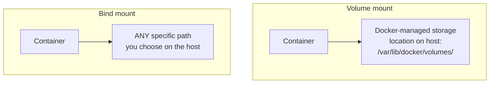
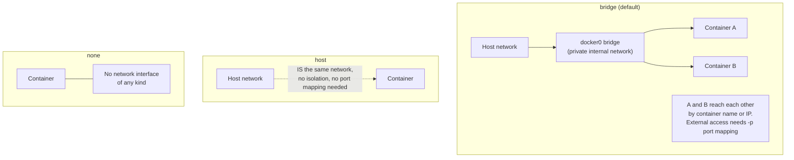
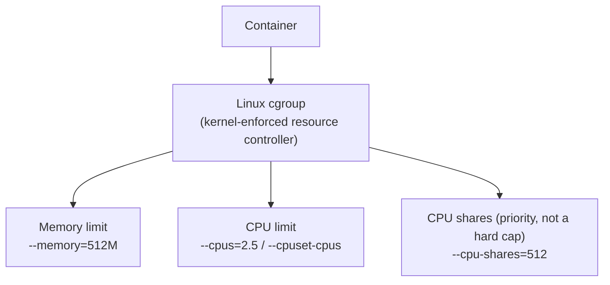
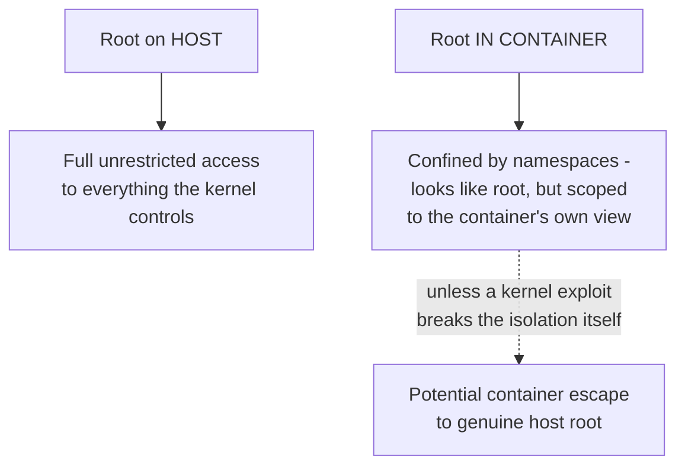
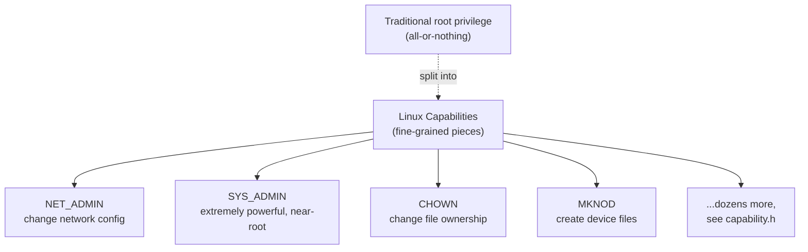
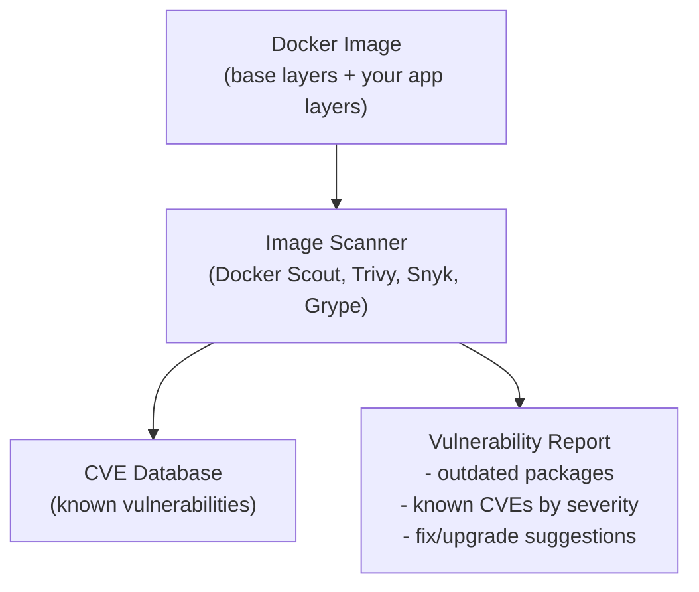

# 16 - Docker Volumes

> [!quote] Deck's content
> Volume mount. Bind mount. `/var/lib/docker/volume`.



**[EXTRA]** The deck names both mount types and gives the volume storage path but doesn't contrast when to use which - a genuinely important practical distinction:

| | Volume mount | Bind mount |
|---|---|---|
| Managed by | Docker itself, in `/var/lib/docker/volumes/` | You - any host path you specify |
| Created via | `docker volume create`, or implicitly by `-v myvolume:/path` | `-v /host/path:/container/path` with an existing host path |
| Portable across hosts | Yes - Docker manages the underlying location, works the same regardless of host OS specifics | No - depends on that exact host path existing with that exact layout |
| Typical use | Persisting database data, anything Docker itself should manage and back up | Local development - live-mounting your source code directory so edits reflect instantly inside a running container |
| Survives `docker volume prune`/container removal | Survives container removal, but a named volume can be explicitly pruned | The host directory is completely unaffected either way - it's not Docker's to manage or delete |

```bash
docker volume create mydata
docker container run -v mydata:/var/lib/postgresql/data postgres     # volume mount - Docker manages storage location
docker container run -v $(pwd)/src:/app/src node                       # bind mount - your exact local directory
docker volume ls
docker volume inspect mydata
docker volume rm mydata
docker volume prune
```

> [!important] Why volume mounts are generally preferred for production data, bind mounts for local development
> **[EXTRA]** A volume mount is fully decoupled from any specific host directory structure, works identically across different hosts (relevant for portability and for orchestrators like Kubernetes/Swarm scheduling a container onto different nodes), and Docker manages its lifecycle. A bind mount ties a container directly to one exact host path - extremely convenient for local development (edit code on your machine, see the change reflected live inside the running container instantly, no rebuild needed) but a poor fit for portable production deployments, since the exact host path may not exist (or have different content) on a different machine.

### Self-Check Q and A

1. **Q: A developer wants their local code edits to appear instantly inside a running container without rebuilding the image every time. Which mount type is appropriate, and why wouldn't a volume mount work as well for this specific use case?**
   A: **[EXTRA]** A bind mount, pointing directly at the local source code directory (`-v $(pwd)/src:/app/src`) - edits made on the host filesystem are immediately visible inside the container since it's literally the same underlying files, no copy or sync step involved. A Docker-managed volume mount would instead point at Docker's own internal storage location, disconnected from the developer's actual working directory, requiring an explicit copy-in step rather than live-reflecting edits.
2. **Q: Why is a Docker-managed volume generally the better choice for a production database's data directory rather than a bind mount to an arbitrary host path?**
   A: **[EXTRA]** A named volume is portable and fully managed by Docker - it doesn't depend on a specific host directory existing with specific permissions, and it integrates cleanly with Docker's own backup/inspect/prune tooling. A bind mount to a hardcoded host path ties the deployment to that exact machine's filesystem layout, which breaks portability if the container ever needs to run on a different host.

---

# 17 - Docker Networks

> [!quote] Deck's content
> 3 default created networks.

| Network | Deck's description |
|---|---|
| Bridge | Private internal network (default) created by Docker that containers attach to. Containers can access each other using IP or container name. |
| Host | Takes any network isolation away between the Docker host and the container (no need for port mapping). `docker container run --network=none`. Issue? |
| None | The container doesn't have any access to an external network - completely isolated. `docker container run --network=none` |

> [!warning] Correction to the deck's own command examples
> The deck's table lists `docker container run --network=none` under BOTH the Host row and the None row. This is a copy error in the source slide - the Host network mode is actually invoked with `docker container run --network=host`, not `--network=none`. The `--network=none` command correctly belongs only under the None row, exactly as described in that row's own text ("Container doesn't have any access to external network - completely isolate").

```bash
docker container run --network=bridge nginx     # default - private internal network, container-to-container by name or IP
docker container run --network=host nginx         # shares the HOST's network namespace directly - no isolation at all
docker container run --network=none nginx           # zero network access whatsoever - fully isolated
```



> [!important] Deck's own posed "Issue?" for host networking, answered
> **[EXTRA]** The deck poses "Issue?" as an open question under the Host network row without answering it. The actual issue: with `--network=host`, the container shares the exact same network namespace and port space as the host machine - meaning if the container's application binds to port 80, it directly occupies port 80 on the HOST itself, with no isolation and no ability to run two containers on the host that both want the same port (since there's no per-container port mapping layer to disambiguate them). It also removes an entire layer of network isolation as a security boundary - a compromised container with host networking has direct visibility into the host's own network interfaces and any other services listening there, unlike the isolated, port-mapped bridge network.

### Self-Check Q and A

1. **Q: The deck's own table appears to list the same `--network=none` command under both the Host and None network types. Which network mode does `--network=host` actually enable, and how does it differ from `--network=none`?**
   A: `--network=host` makes the container directly share the host's own network namespace (full network access, no isolation, no port mapping needed) - the opposite of `--network=none`, which removes ALL network access entirely. They are functionally opposite settings that were miswritten identically in the source slide's table.
2. **Q: What is the actual "issue" with host networking that the deck poses as an open question?**
   A: **[EXTRA]** Since the container shares the host's exact network namespace, any port the containerized application binds to directly occupies that same port on the host machine itself - removing the ability to run multiple containers that each want the same port (no per-container port mapping to disambiguate), and removing network isolation as a security boundary between the container and the host's other network-facing services.

---

# 18 - Docker Security - Resource Limits (cgroups)

> [!quote] Deck's content
> Resource Level. `docker container run --memory 512M --cpu-shares=512 --cpuset-cpus=0,1` or `--cpus=2.5`.

| Option | Behavior, per the deck | Hard limit? |
|---|---|---|
| `--memory=512M` | Restrict memory consumed by container (RAM) | Yes |
| `--memory-swap` | Max RAM + swap | Yes |
| `--memory-reservation` | "This container usually needs this much memory" - a soft target, not enforced | No |
| `--cpu-shares=512` | Priority to enter CPU, default 1024. Higher number = higher priority. Works only when the host CPU is under load. | No |
| `--cpuset-cpus=0,1` | Pin to certain CPU cores (by ID) | Yes |
| `--cpus=2.5` (about 83 percent) | Hard CPU limit - can only use 2.5 cores out of 3 | Yes |



> [!important] Hard limit versus priority - the single most important distinction on this slide
> **[EXTRA]** The deck's own table already flags which options are "Hard Limit: Yes" versus "No," but the practical consequence is worth stating directly: `--cpu-shares` (and `--memory-reservation`) are NOT caps at all - they only matter when the host is under CPU/memory contention, and even then they only influence relative PRIORITY between competing containers, never an absolute ceiling. A container with `--cpu-shares=512` set can still consume 100 percent of available CPU if the host isn't under load and nothing else is competing for cycles. Genuine hard caps (`--memory`, `--cpus`, `--cpuset-cpus`) are enforced unconditionally by the kernel's cgroup mechanism regardless of host load.

**[EXTRA]** This entire resource-limiting slide is the practical, hands-on application of the cgroups concept the deck itself named back in section 04 ("containers idea exist before Docker") without yet demonstrating - these flags are literally Docker exposing the Linux cgroup kernel primitive through its CLI.

### Self-Check Q and A

1. **Q: A container is given `--cpu-shares=256` (a low priority relative to the default 1024) but no other CPU limit. On an otherwise idle host with no other containers running, how much CPU can it actually use?**
   A: **[EXTRA]** Up to 100 percent of available CPU - `--cpu-shares` only affects relative priority DURING contention between multiple processes competing for CPU. With no competition at all, the low share value has no effect whatsoever; it is not a cap.
2. **Q: Why does `--memory-reservation` provide no guarantee, unlike `--memory`?**
   A: Per the deck's own table, `--memory-reservation` is a soft target ("this container usually needs this much") with no enforcement (Hard Limit: No) - the container CAN exceed it under normal operation; it only becomes relevant as a hint during host-wide memory pressure. `--memory` is a hard, kernel-enforced ceiling the container cannot exceed under any circumstance.

---

# 19 - Docker Security - Root User

> [!quote] Deck's content on Root User
> Table comparing Root on Host versus Root in Container:

| Action | Root on Host | Root in Container |
|---|---|---|
| Install packages | Yes | No (only inside container filesystem) |
| Access host files | Yes | No (unless bind-mounted) |
| Change host network | Yes | No |
| Load kernel modules | Yes | No |
| Kill host processes | Yes | No |
| Change kernel params | Yes | No |
| Break out of container | (not applicable) | Possible with kernel exploits |



> [!important] "Root in container" is not the same privilege level as "root on host" - but it is still real risk
> The deck's own table makes this precise: being root INSIDE a container is confined by the namespace boundary - it cannot directly touch the host's files, network, kernel modules, or other processes UNLESS the container was explicitly configured to allow it (a bind mount exposing host files, `--network=host`, or `--privileged` mode). The one caveat the deck flags with a warning symbol is genuine and important: if the underlying kernel itself has an exploitable vulnerability, container root CAN potentially escape the namespace boundary entirely and become genuine host root - this is exactly why kernel patching and the capability-dropping techniques (next section) matter as defense in depth, not just namespace isolation alone.

### Self-Check Q and A

1. **Q: Per the deck's own table, why can't root inside a container simply install packages that also become visible on the host, the way root on the host could?**
   A: The container's filesystem is isolated by the mount namespace - "installing packages" as container root only ever writes to the container's own isolated filesystem view, which is layered on top of (but never merges into) the host's actual filesystem, unless a specific bind mount was configured to expose a shared path.
2. **Q: The deck marks "Break out of container" with a warning symbol and "Possible with kernel exploits." What does this specifically mean for why container isolation should not be treated as an absolute security boundary equivalent to a VM's?**
   A: **[EXTRA]** Since containers share the host's single kernel (unlike a VM, which has its own independent kernel), a vulnerability in that shared kernel can potentially be exploited from inside a container to break out of the namespace confinement entirely and gain genuine host-level root access - a category of risk that simply doesn't exist for VM isolation, where a guest kernel exploit at worst compromises that one VM's own kernel, not the hypervisor host's.

## Docker Security - Capabilities

> [!quote] Deck's content
> Linux splits root privileges into small pieces called capabilities. A container normally gets several capabilities by default - which is risky. If you don't drop capabilities, container root may: modify container namespaces, attack the kernel if a vulnerability exists, escape the container (if misconfigured). This is why: drop capabilities, use rootless containers or user mapping. `docker run --user --cap-drop=ALL --cap-add=NET_BIND_SERVICE nginx`.

> [!quote] Deck's listed capability examples
> `NET_ADMIN` -> change network config. `SYS_ADMIN` -> extremely powerful. `CHOWN` -> change file ownership. `MKNOD` -> create device files. Reference: `/usr/include/linux/capability.h`.



```bash
docker run --user --cap-drop=ALL --cap-add=NET_BIND_SERVICE nginx
```

> [!important] The principle demonstrated by the deck's own example command
> **[EXTRA]** `--cap-drop=ALL` strips every single Linux capability from the container's root user first - reducing it to a genuinely powerless "root in name only." `--cap-add=NET_BIND_SERVICE` then adds back exactly ONE narrow capability - specifically, the ability to bind to privileged ports below 1024 (which nginx genuinely needs to listen on port 80). This is the principle of least privilege applied directly to container root: rather than trusting the container's default (risky) capability set, explicitly start from nothing and grant back only the exact, minimal set of capabilities the specific application genuinely requires - nothing more.

**[EXTRA]** The deck names `SYS_ADMIN` as "extremely powerful" without elaborating why it's specifically called out this way, worth making explicit: `SYS_ADMIN` is often described as "the new root" among capabilities - it bundles a huge number of sensitive operations (mounting filesystems, modifying namespaces, and more) into one single capability, making it functionally close to full root even after other capabilities have been dropped. It should be treated as a major red flag if any container genuinely requests it, and almost never actually needed by ordinary application containers.

### Self-Check Q and A

1. **Q: In `docker run --cap-drop=ALL --cap-add=NET_BIND_SERVICE nginx`, why is dropping ALL capabilities first and adding back exactly one better security practice than simply leaving Docker's default capability set in place?**
   A: **[EXTRA]** Docker's default capability set grants a container root user several capabilities it likely never needs for its specific job, widening the potential blast radius if that process is ever compromised. Starting from zero and adding back only the one narrow capability the application genuinely requires (here, binding to a privileged port) follows least-privilege - even a fully compromised process inside that container has no other capabilities to abuse beyond that single narrow permission.
2. **Q: Why does the deck single out `SYS_ADMIN` specifically as "extremely powerful" compared to the other three listed capabilities?**
   A: **[EXTRA]** `SYS_ADMIN` bundles together a very broad set of sensitive kernel-level operations (including namespace and mount manipulation) into one capability, making it functionally close to full root privilege even in an otherwise capability-dropped container - it's often referred to informally as "the new root" precisely because granting it can undo most of the benefit of dropping every other capability.

---

# 20 - Docker Security - Image Level

> [!quote] Deck's content
> Docker Scout Image Scanning. https://docs.docker.com/scout/

**[EXTRA]** The deck names Docker Scout with just a link, without explaining what image scanning actually does or why the earlier trust-tier discussion (Official/Verified/Marketplace images) doesn't make scanning optional. Image scanning tools analyze an image's layers against known vulnerability databases (CVE databases) to surface outdated packages or known-vulnerable dependencies baked into the image - genuinely necessary even for a trusted Official base image, since new CVEs are discovered continuously after an image was originally built and pushed, and your own application's added layers (npm/pip packages, OS packages installed via `RUN apt-get install`) are never covered by the base image's own original trust tier at all.



**[EXTRA]** Docker Scout is not the only tool in this category - genuinely relevant alternatives worth knowing for CI pipeline integration:

| Tool | Notes |
|---|---|
| Docker Scout | Docker's own native scanning, integrated into `docker` CLI and Docker Hub |
| Trivy | Open source, widely used in CI pipelines, scans images/filesystems/IaC configs |
| Snyk Container | Commercial, deep integration with developer workflows and PR checks |
| Grype | Open source, fast, from the makers of Syft (SBOM generation) |

```bash
docker scout cves myimage:latest      # example Docker Scout usage
trivy image myimage:latest              # equivalent scan using Trivy
```

### Self-Check Q and A

1. **Q: A team only ever builds on top of Docker Official base images and assumes this alone makes scanning unnecessary. Why is this assumption wrong?**
   A: **[EXTRA]** An Official base image's trust tier reflects Docker's review of the base at the time it was published - it says nothing about vulnerabilities discovered AFTER that publish date, nor does it cover anything the team's own Dockerfile adds on top (application dependencies via npm/pip, additional OS packages via `apt-get install`). Scanning is necessary regardless of base image trust tier because new CVEs are discovered continuously and because your own added layers are entirely outside the base image's original review.

---
