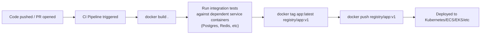
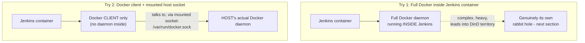
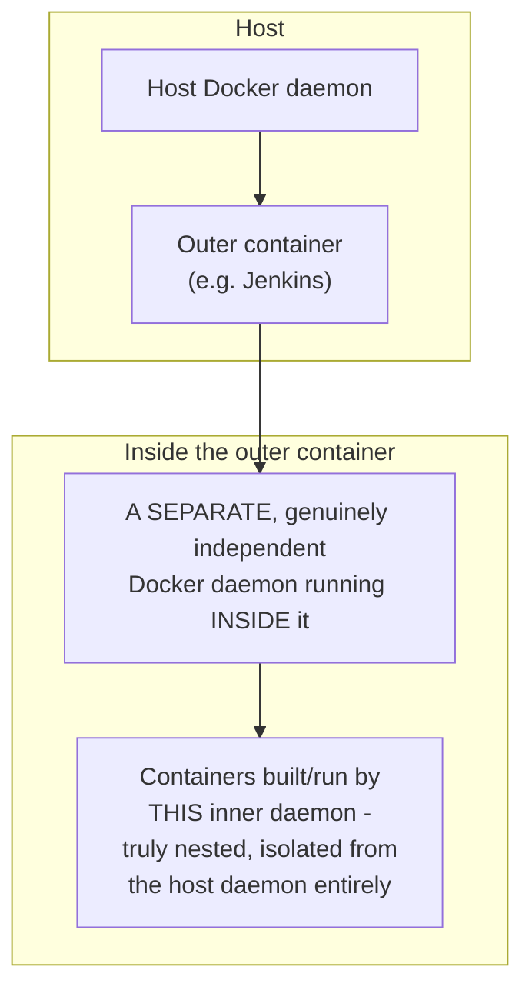
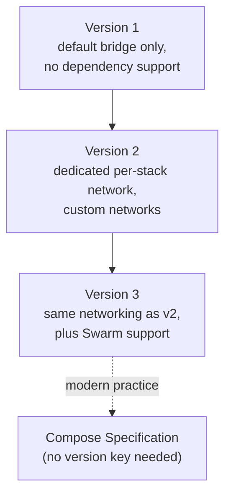
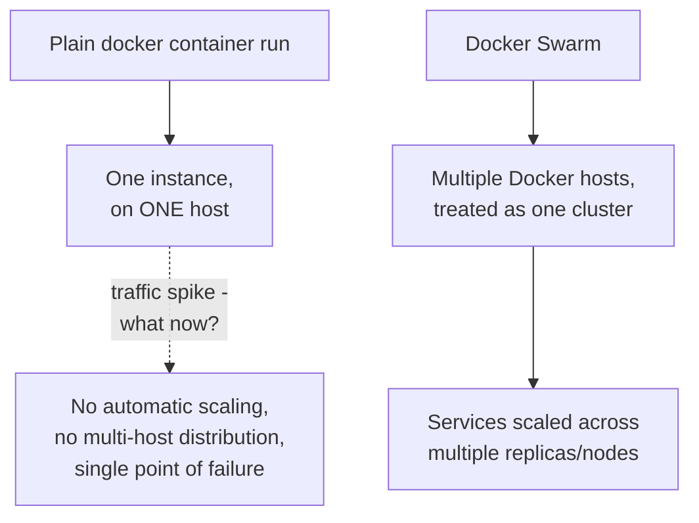

# 21 - Running Docker Tasks in CI

> [!quote] Deck's content
> CI Continuous Integration Pipelines: to build Docker images for your application, to run integration tests in isolated containers, to ensure builds are reproducible everywhere.

> [!quote] Deck's speaker notes
> If your deployment platform uses containers (Kubernetes, ECS, EKS, Azure ACI, App Engine, Cloud Run...), your CI pipeline must produce a Docker image. CI runners themselves aren't usually container hosts, so they must use Docker to: build images (`docker build .`), tag them (`docker tag app:latest registry/app:v1`), push them (`docker push registry/app:v1`). Even if you don't deploy with Docker, many teams package apps as images for consistency. Some tests require dependent services: Postgres, Redis, Localstack, Elasticsearch, RabbitMQ. Instead of installing them on every CI agent, CI runs them as containers.



> [!important] The deck's key insight: "CI runners themselves aren't usually container hosts"
> **[EXTRA]** This is worth expanding, since it directly sets up the next two sections (mounting the Docker socket, DinD). A typical CI agent (a Jenkins worker, a GitHub Actions runner) is just a regular machine - it does not automatically have Docker's build/run capabilities available inside whatever job is executing unless that capability is specifically wired up. This is exactly the practical problem the deck's next two sections (socket mounting versus Docker-in-Docker) exist to solve: how does a CI job that itself might be running inside a container get access to genuine Docker build/run functionality?

### Self-Check Q and A

1. **Q: Why does the deck state that even teams who don't deploy their application using Docker/containers in production might still build a Docker image as part of their CI pipeline?**
   A: For consistency and reproducibility - packaging the application as an image guarantees the exact same artifact (with all its dependencies frozen) is what gets tested in CI and what would be deployed, even if the actual production deployment mechanism doesn't ultimately run that image as a container. It's also common to use disposable containers for dependent test services (Postgres, Redis) regardless of the production deployment model, since spinning up isolated service containers for integration tests is far faster and cleaner than installing those services directly on every CI agent.

---

# 22 - Mount Docker Socket

> [!quote] Deck's content
> TRY 1: Install FULL Docker inside your Jenkins. TRY 2: Install only the client and use the host Docker socket.



```bash
docker container run -v /var/run/docker.sock:/var/run/docker.sock ... jenkins
```

**[EXTRA]** The deck names "Try 2" but doesn't spell out the actual mount syntax or the mechanism, worth completing directly: the Docker daemon exposes its API over a Unix socket file at `/var/run/docker.sock` on the host. Bind-mounting that exact socket file INTO a container (via `-v /var/run/docker.sock:/var/run/docker.sock`) lets a Docker CLIENT running inside that container talk directly to the HOST's own Docker daemon, as if it were running natively on the host - the container issuing `docker build` commands is not running its own separate daemon at all; every container it builds or runs is actually created by, and visible to, the host's Docker daemon, as a sibling of the Jenkins container itself, not a nested child inside it.

> [!warning] Mounting the Docker socket is a significant security tradeoff, genuinely worth stating explicitly
> **[EXTRA]** Any process with access to `/var/run/docker.sock` effectively has root-equivalent control over the ENTIRE host Docker daemon - it can create, inspect, or destroy any container on the host, including containers completely unrelated to the CI job itself, and can trivially escape to full host root by simply running a privileged container that bind-mounts the host's root filesystem. Mounting the socket into a CI container is a well-known, widely-used pattern (exactly what the deck's "Try 2" describes), but it should be treated as granting that CI job effective host-root-equivalent access, not a sandboxed capability.

### Self-Check Q and A

1. **Q: When a Jenkins container mounts the host's Docker socket and runs `docker build`, is the resulting image built by a Docker daemon running inside the Jenkins container itself?**
   A: No - the Jenkins container only has the Docker CLIENT installed; every command it issues is sent, via the mounted socket file, to the HOST's own Docker daemon, which does the actual building. Any containers or images created this way are managed by and visible to the host daemon directly, as siblings of the Jenkins container, not nested inside it.
2. **Q: Why is mounting `/var/run/docker.sock` into a CI container considered a meaningful security tradeoff rather than a free convenience?**
   A: **[EXTRA]** Access to that socket is effectively equivalent to root access on the host - a process with socket access can run an arbitrary privileged container that mounts the host's own root filesystem, achieving genuine host root, or interfere with any other container on that host regardless of the CI job's own intended scope.

---

# 23 - Docker in Docker (DIND)

> [!quote] Deck's content
> Running a Docker daemon inside a Docker container, so that the container can build and run other containers without using the host Docker engine.



**[EXTRA]** Contrasting DinD directly against the previous section's socket-mounting approach, since the deck presents them back to back as "Try 1" versus "Try 2" without an explicit side-by-side comparison:

| | Socket mounting | Docker in Docker (DinD) |
|---|---|---|
| Daemon used | The HOST's actual daemon, shared | A genuinely separate, independent daemon running inside the container |
| Containers built are visible to | The host, as siblings alongside the CI container | Only inside the DinD container itself - fully isolated from the host's own container list |
| Security exposure | Effectively host-root-equivalent access via the socket | Requires the outer container to run in `--privileged` mode, which is its own significant security exposure |
| Complexity | Simpler - no nested daemon to manage | More complex - a full daemon running inside a container, with its own storage/networking concerns |

> [!important] Why DinD generally requires `--privileged` mode
> **[EXTRA]** Running a genuine Docker daemon inside a container requires kernel capabilities that go well beyond a typical container's default permission set - namespace and cgroup manipulation, device access, and more - which in practice usually means running the outer container in `--privileged` mode (effectively disabling most of the container's own security isolation from the host). This trades one security concern (the socket-mounting approach's host-root-equivalent access) for a different one (a privileged container with broad kernel access) - the deck's own two "Try" options are genuinely both real tradeoffs, not a clearly superior/inferior pair.

### Self-Check Q and A

1. **Q: A container built and run via Docker-in-Docker inside a Jenkins pipeline - does that container show up in `docker container ls` run directly on the host machine?**
   A: No - the DinD daemon running inside the outer container is a genuinely separate, independent daemon, managing its own containers entirely within its own scope. Those inner containers are invisible to the host's own Docker daemon and would not appear in a `docker container ls` run on the host itself, unlike containers built via the socket-mounting approach, which ARE the host daemon's own containers.
2. **Q: Why can't Docker-in-Docker typically run with a container's normal default permissions, unlike most application containers?**
   A: **[EXTRA]** Running an actual Docker daemon requires deep kernel-level capabilities (namespace/cgroup management, device access) well beyond what a standard container's default capability set and isolation model allow - in practice this usually requires `--privileged` mode, which removes most of the container's own isolation from the host kernel, itself a significant security tradeoff.

---

# 24 - Docker Compose

> [!quote] Deck's content
> `docker-compose.yaml`. Version 1, Version 2, Version 3.

| | Version 1 | Version 2 | Version 3 |
|---|---|---|---|
| Networking | Use only default network bridge, you cannot add dependency | Create a dedicated network for each stack; you can define your own networks and assign containers to them | Same networking capability as v2, plus Swarm support |
| Dependency support | You can't add dependency | (implied improvement over v1) | Full support |
| Orchestration | No | No | Supports Docker Swarm |

> [!important] Correction/clarification - Compose file versioning is now largely legacy
> **[EXTRA]** The deck's version comparison reflects the historical evolution of the `docker-compose.yaml` format, but current Docker Compose (the `docker compose` CLI plugin, note the space rather than hyphen) has moved to the "Compose Specification," where the top-level `version:` key is now considered obsolete/optional - modern Compose simply reads whatever schema is present without requiring an explicit version declaration, and the CLI has effectively unified the version 2/3 feature set. Understanding the v1/v2/v3 history the deck teaches is still useful for reading older `docker-compose.yaml` files in existing projects, but new files written today typically omit the `version:` key entirely.



**[EXTRA]** The deck names the three versions without ever showing a complete example file - filling that gap with a realistic multi-service compose file tying together several concepts already covered in this note (networks, volumes, environment):

```yaml
services:
  web:
    build: .
    ports:
      - "3000:3000"
    environment:
      - DATABASE_URL=postgres://user:pass@db:5432/appdb
    depends_on:
      - db
    networks:
      - appnet

  db:
    image: postgres:16
    volumes:
      - dbdata:/var/lib/postgresql/data
    environment:
      - POSTGRES_PASSWORD=pass
      - POSTGRES_DB=appdb
    networks:
      - appnet

volumes:
  dbdata:

networks:
  appnet:
```

### Self-Check Q and A

1. **Q: You open a `docker-compose.yaml` file for an older project and see `version: '3.8'` at the top, but a brand-new project's compose file has no version key at all. Is the newer file broken or missing something?**
   A: **[EXTRA]** No - modern Docker Compose has moved to the Compose Specification, where the version key is optional/obsolete. Omitting it is the current recommended practice; the older file's explicit version declaration reflects the format's earlier, versioned history that the deck's own v1/v2/v3 comparison describes.
2. **Q: In the example compose file above, why does the `web` service's `DATABASE_URL` reference the hostname `db` rather than an IP address?**
   A: **[EXTRA]** Compose automatically creates a private network (`appnet` here) and registers each service's name as a resolvable DNS hostname within it - `db` resolves to the database container's address on that shared network, the same container-name-based resolution the deck's own networking section described for the default bridge network, just scoped to this Compose-managed network instead.

## Docker Compose Commands

> [!quote] Deck's content
> `docker compose up`, `docker compose stop`, `docker compose down`, `docker compose ps`, `docker compose logs`, `docker compose top`.

```bash
docker compose up          # create and start every service defined in the compose file
docker compose up -d         # same, but detached (background)
docker compose stop            # stop all services, but keep containers/networks/volumes intact
docker compose down              # stop AND remove containers/networks created by up (volumes kept unless -v is added)
docker compose ps                  # list the status of this project's services
docker compose logs                  # view logs from all services
docker compose logs -f                 # follow logs live, across all services
docker compose top                       # list running processes per service, like docker container top for the whole stack
```

> [!important] `stop` versus `down` - directly parallel to the earlier container-level distinction
> **[EXTRA]** This mirrors the deck's own earlier `docker container stop` versus `rm` distinction, applied at the whole-stack level: `stop` halts every service's containers but leaves them (and the networks/volumes Compose created) in place, ready to be restarted quickly with `docker compose start`. `down` goes further and actually removes the containers and networks entirely (though named volumes persist by default unless you explicitly add the `-v` flag) - `down` is the command to use when you want a genuinely clean slate, `stop` when you just want to pause everything temporarily.

### Self-Check Q and A

1. **Q: After running `docker compose down`, does the database's persisted data (stored in a named volume) get deleted along with the containers?**
   A: **[EXTRA]** No, not by default - named volumes persist even after `docker compose down` removes the containers and networks. The data would only be deleted if `docker compose down -v` is run explicitly, with the `-v` flag specifically requesting volume removal as well.

---

# 25 - Docker Swarm

> [!quote] Deck's content
> With Docker you create one instance of an application. Spike? Container Orchestration (multi Docker host). Consists of tools and scripts that help deploy containers in a production environment.



> [!important] The deck's own posed question ("Spike?") is the entire motivation for orchestration
> **[EXTRA]** This connects directly back to the deck's very first section (why you need Docker at all) and to the Kubernetes-style orchestration concepts covered in a separate note: a single `docker container run` gives you exactly one instance of an application on exactly one host - if traffic spikes beyond what that one instance/host can handle, or if that one host fails entirely, there is no built-in mechanism to add more instances or reschedule elsewhere. Docker Swarm (and, at a much larger and more capable scale, Kubernetes) exists specifically to solve this: treating a pool of multiple Docker hosts as one logical cluster, and providing tooling to deploy, scale, and reschedule containers ("services" in Swarm terminology) across that pool automatically.

**[EXTRA]** The deck introduces Swarm as a closing topic without commands or a worked example, since the deck ends here. Worth noting for anyone continuing past this deck: Docker Swarm and Kubernetes solve the same fundamental problem (multi-host container orchestration) with different tradeoffs - Swarm is built directly into the Docker CLI (`docker swarm init`, `docker service create`) and is genuinely simpler to get started with, while Kubernetes has become the dominant industry-standard orchestrator with a much larger ecosystem, steeper learning curve, and far more configuration surface. For anyone pursuing DevOps/cloud roles, Kubernetes is generally the more directly employable skill, though understanding Swarm's simpler model is a reasonable stepping stone toward it.

### Self-Check Q and A

1. **Q: A single container running an application experiences a sudden traffic spike that exceeds what its one host machine can handle. What does plain Docker (without Swarm or another orchestrator) do about this automatically?**
   A: Nothing - a single `docker container run` invocation has no built-in awareness of load, no automatic scaling, and no mechanism to add capacity or move to a different host. This exact gap - the deck's own "Spike?" question - is precisely the problem container orchestration tools like Docker Swarm (or Kubernetes) are built to solve.
2. **Q: What's the fundamental capability Docker Swarm adds that plain `docker container run` commands, no matter how many you issue by hand, cannot replicate?**
   A: **[EXTRA]** Treating multiple separate Docker hosts as one unified logical cluster, with built-in scheduling, scaling, and rescheduling logic - Swarm decides WHICH host a given container instance runs on and can automatically react to failures or scaling needs across that whole pool, something manually issuing individual `docker run` commands on individually-chosen hosts cannot do.

---
