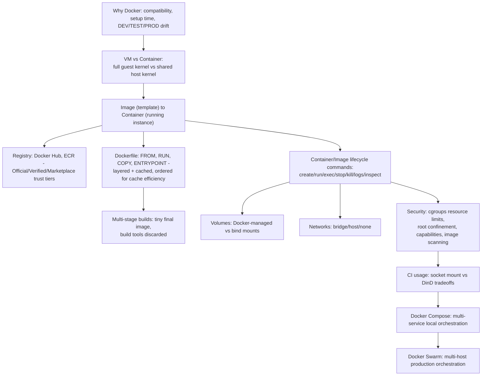

# Master Recap Diagram

# Rapid-Fire Interview Bank

- Why Docker over plain VMs? Shared host kernel means lighter weight, faster boot, lower overhead - VMs boot a full independent guest kernel.
- Image versus container? Static read-only template versus a running, isolated instance created from it.
- attach versus exec? Connects to the container's own PID 1 (risky Ctrl-C) versus spawns a new separate process inside (safe to exit).
- stop versus kill? Graceful SIGTERM with a grace period versus immediate SIGKILL, no cleanup chance.
- Volume mount versus bind mount? Docker-managed storage location, portable, versus an exact host path you specify, great for local dev live-editing.
- bridge versus host versus none network? Isolated internal network with port mapping versus full host network sharing (no isolation) versus zero network access.
- Why drop all capabilities and add back only what's needed? Least privilege - default container root has more power than most applications actually require.
- COPY versus ADD? COPY is a plain, predictable file copy; ADD has implicit extra behavior (tar extraction, URL fetch) that can surprise readers.
- Why does layer/build order matter? Docker caches each layer; changing an earlier instruction invalidates every layer after it - put rarely-changing steps first.
- Multi-stage build payoff? Final image contains only what's copied from the build stage, none of the build toolchain - smaller, more secure image.
- Socket mounting versus Docker-in-Docker for CI? Host-root-equivalent socket access versus a genuinely separate nested daemon requiring privileged mode - both are real security tradeoffs, not a clean win/lose pair.
- Docker Compose versus Docker Swarm? Multi-container orchestration on ONE host versus multi-HOST orchestration across a cluster.

# Self-Assessment - Can You Explain These Without Notes

- [ ] Why a container shares the host kernel but a VM does not, and the practical consequence for size/boot time
- [ ] The image-to-container relationship, using the deck's own ISO analogy
- [ ] Why `:latest` is a dangerous tag to rely on in production
- [ ] The attach-versus-exec distinction, with a concrete risk scenario
- [ ] How Docker's layer caching actually decides what to rebuild, and why instruction order matters
- [ ] The answer to the deck's own unresolved "what is the issue" question about apt-get update/install caching
- [ ] Why EXPOSE alone does not publish a port
- [ ] What a multi-stage build's final image does and does not contain
- [ ] The real difference between a volume mount and a bind mount, and when to use each
- [ ] Why root inside a container is not equivalent to root on the host, and the one real caveat to that
- [ ] What Linux capabilities are, and why `--cap-drop=ALL --cap-add=<specific>` is best practice
- [ ] The security tradeoff of mounting the Docker socket into a CI container
- [ ] Why Docker Swarm/orchestration exists at all, tied back to the deck's own "Spike?" question