---
# Docker Containerization Essentials - Complete Notes

> [!info] How to read this note
> Everything traces back to the slide deck unless a line, block, or section is tagged **[EXTRA]** in bold. No emoji are used anywhere in this file, including callout titles.

---

# 01 - Why Do You Need Docker

> [!quote] Deck's scenario
> You need to set up an END TO END Application Stack including various technology: Web Server (NodeJS), Database (MongoDB), Messaging (Redis), Orchestration (Ansible). What are your expected issues?

> [!quote] Deck's definition
> E2E Application is a complete software application that covers every stage of workflow from start to finish.

## Issues (Cont')

> [!quote] Deck's content
> Compatibility. OS and Technologies. Libraries and Dependencies with Hardware. Environment Setup Time. Different DEV/TEST/PROD Environment.

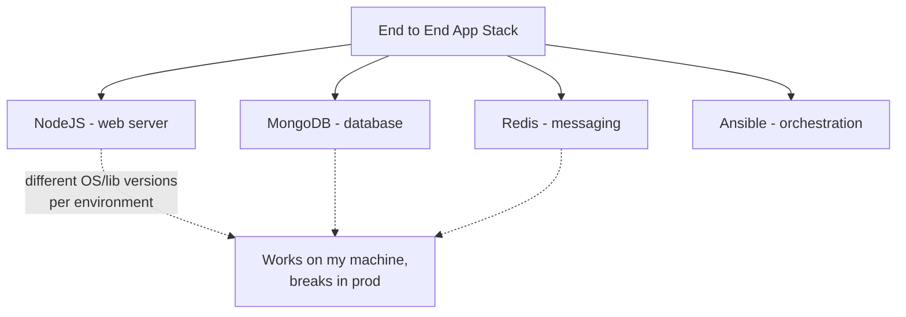

**[EXTRA]** The deck lists the issues without naming the underlying pattern - this is literally the "works on my machine" problem, the single most common reason containerization exists at all. Each of the four listed issues (compatibility, OS/tech mismatch, library/hardware dependency drift, slow environment setup, DEV/TEST/PROD divergence) traces back to one root cause: an application's runtime environment was never captured as an artifact - it lived only in whatever state a specific machine happened to be in.

### Self-Check Q and A

1. **Q: The deck lists five separate "issues" (compatibility, OS/tech, libraries/hardware, setup time, DEV/TEST/PROD difference). What single underlying problem do all five actually stem from?**
   A: **[EXTRA]** None of these environments captured the application's actual runtime dependencies as a reproducible artifact - configuration and installed versions lived only in the state of a specific machine, so any two machines (a developer's laptop, a test server, production) could silently diverge. This is the "works on my machine" problem, and it's the reason containerization exists.

---

# 02 - Solutions - Initial Thoughts

> [!quote] Deck's content
> Solutions? Initial thoughts: separate each component into different infrastructure. Totally different physical machines? Virtual Machines.

## Virtual Machines

> [!quote] Deck's content
> Virtual Machines: a computer created by software instead of hardware. Type 1 (Bare-metal). Type 2 (Hosted). Issues: overhead because of higher utilization, heavy (GB), high boot time.

> [!quote] Deck's definition
> Utilization: how much of the machine's allocated resources it is using.

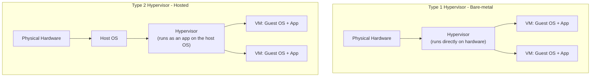

| Type | Runs on | Examples | Typical use |
|---|---|---|---|
| Type 1 (bare-metal) | Directly on hardware, no host OS underneath | VMware ESXi, Microsoft Hyper-V, KVM | Production data centers, cloud provider hypervisors (EC2 runs on a Type 1-style hypervisor) |
| Type 2 (hosted) | On top of an existing host OS, as an application | VirtualBox, VMware Workstation, Parallels | Local development/testing on a laptop |

**[EXTRA]** The deck names Type 1 and Type 2 without examples or the practical distinction that matters: Type 1 hypervisors have no host OS between themselves and the hardware, so they lose less performance to overhead and are what production cloud infrastructure (AWS EC2, VMware vSphere) actually runs on. Type 2 hypervisors run as a regular application inside an already-running OS, which is why they're heavier and slower but far more convenient for local development on a personal laptop.

### Self-Check Q and A

1. **Q: Why would a cloud provider like AWS use a Type 1 hypervisor for EC2 instances rather than a Type 2 hypervisor?**
   A: **[EXTRA]** Type 1 runs directly on the physical hardware with no host OS in between, minimizing the overhead layer and maximizing performance and density across many customer VMs on the same physical server - exactly what a cloud provider needs at scale. A Type 2 hypervisor's extra host-OS layer would waste resources and add latency across thousands of production hosts.

---

# 03 - What Is a Container

> [!quote] Deck's content
> Containers: what's making each OS different. A small, isolated box that contains your application + its dependencies (but it shares the host's OS kernel). Advantages: lower utilization, lightweight (less than GB), low boot time.

> [!quote] Deck's definition
> Utilization: how much of the container's allocated resources it is using.

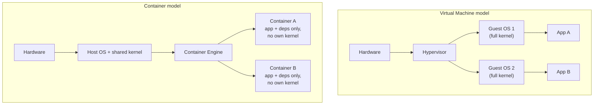

| | Virtual Machine | Container |
|---|---|---|
| Isolation unit | Full guest OS, own kernel | Process-level, shares host kernel |
| Size | GB range | MB range (less than GB, per the deck) |
| Boot time | High | Low |
| Utilization overhead | Higher | Lower |

### Self-Check Q and A

1. **Q: The deck says a container "shares the host's OS kernel." What does this actually mean for what a container CAN and CANNOT do compared to a VM?**
   A: **[EXTRA]** A container has no kernel of its own - it makes system calls directly into the host's single running kernel, isolated only by kernel-level mechanisms (namespaces and cgroups, covered next). This is why a container starts almost instantly (no kernel to boot) but also why a container cannot run a different OS kernel than the host (a Linux container needs a Linux host kernel), unlike a VM, which boots its own independent guest kernel and can therefore run a genuinely different OS.

---

# 04 - Docker as a Containerization Tool

> [!quote] Deck's content
> A container is an isolated environment that has its own process/services, network, mounts. Like a VM but shares the same host OS kernel. Containers idea existed before Docker. Install Docker.

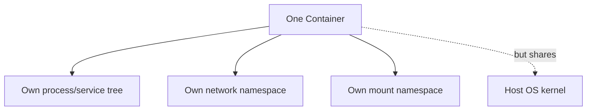

**[EXTRA]** The deck states "containers idea exist before Docker" as a bare fact without naming what came before. This is worth completing: Linux containers as a concept predate Docker by years, built on kernel primitives called **namespaces** (isolating what a process can see - its own PID tree, network stack, mount points, hostname) and **cgroups** (control groups - limiting how much CPU/memory/IO a process can use, covered later in the deck's own security section). Tools like LXC (Linux Containers) and even earlier `chroot`-based jails used these same primitives before Docker existed. Docker's actual innovation was not inventing containers - it was making them genuinely easy to build, package, distribute, and run through a simple CLI, a standard image format, and a public registry (Docker Hub) - turning a kernel feature that required deep expertise into something any developer could use in minutes.

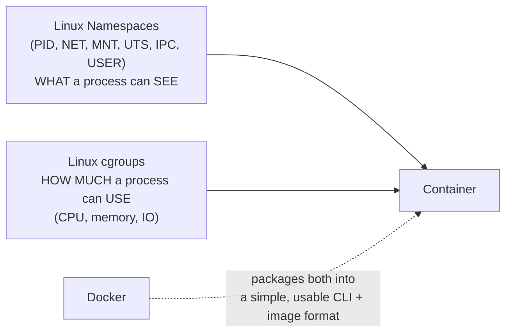

### Self-Check Q and A

1. **Q: If the underlying kernel primitives (namespaces, cgroups) existed before Docker, what did Docker actually invent?**
   A: **[EXTRA]** Not the isolation mechanism itself - Docker's real contribution was tooling: a simple CLI to build and run containers, a standardized, portable image format (layered filesystem images), and a public registry (Docker Hub) for sharing them. It turned a low-level kernel capability that previously required deep Linux expertise (manually configuring namespaces/cgroups, or using LXC) into something usable by any developer in a few commands.
2. **Q: What are the three isolated resources the deck lists for a container, and which underlying kernel mechanism provides each?**
   A: Process/services, network, and mounts - each is isolated by a corresponding Linux namespace (PID namespace for processes, network namespace for networking, mount namespace for the filesystem view).

---

# 05 - Docker Platform Requirements

> [!quote] Deck's content
> Docker is available for Linux-based systems. Windows machines work around by installing Docker Desktop, which installs a Linux machine hypervisor. We will not use Docker Desktop - you need a Linux OS.

```bash
docker --version
```

**[EXTRA]** The deck's statement that Docker Desktop "installs a Linux machine hypervisor" is worth expanding, since it explains a genuinely common point of confusion for Windows/Mac users: because the Linux kernel is required (per section 04's sharing-the-host-kernel point), and Windows/macOS don't have a Linux kernel, Docker Desktop actually runs a lightweight Linux VM in the background (using WSL2 on Windows, or a hypervisor VM on macOS) and transparently routes all container operations into that VM. This means even a "native" Docker Desktop install is still ultimately running containers inside a real Linux kernel - the deck's own earlier point that containers cannot exist without a Linux kernel to share still holds true even there.

### Self-Check Q and A

1. **Q: A student installs Docker Desktop on Windows and successfully runs Linux containers. Does this contradict the deck's earlier statement that containers share the host's kernel, which must be Linux?**
   A: **[EXTRA]** No - Docker Desktop on Windows transparently runs a real Linux kernel underneath (via WSL2 or a lightweight VM) and routes all container operations into it. The containers are still sharing a genuine Linux kernel; it's simply hidden inside a VM layer that Docker Desktop manages automatically, so from the container's perspective nothing is different.

---

# 06 - Image and Container Definitions

> [!quote] Deck's content
> Image: is a package or template or definition used to create a container - think of it as an ISO. Container: running instance of an image, isolated, has its own set of processes.

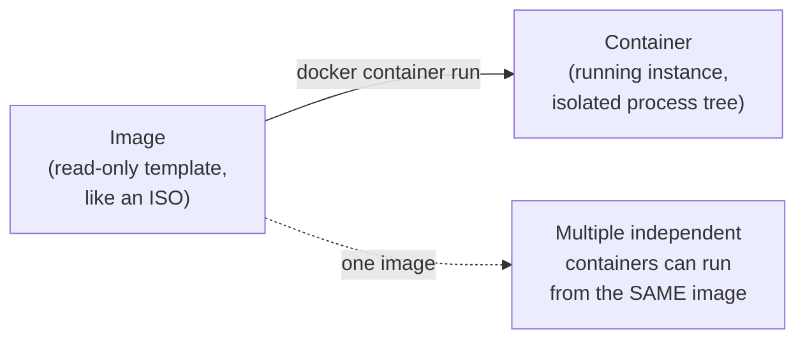

**[EXTRA]** The deck's own ISO analogy is genuinely useful and worth extending: an ISO file is a static template you can install/boot from repeatedly without the ISO itself ever changing. Similarly, one Docker image can spawn any number of independent, isolated running containers - starting a second or third container from the same image does not modify the image at all, and each running container gets its own writable layer on top of the shared read-only image layers (this writable layer concept is expanded in the layered architecture section later).

### Self-Check Q and A

1. **Q: You run `docker container run nginx` three times without removing any of the resulting containers. How many images exist afterward, and how many containers?**
   A: One image (`nginx`, unchanged by any of the runs) and three separate, independent containers - each is its own isolated running instance with its own writable layer, process tree, and (unless configured otherwise) its own network identity, all created from the same unmodified image template.

---

# 07 - Docker Registries and Image Types

> [!quote] Deck's content
> To create a container you need the template. Docker Registry: Docker Hub, Public ECR ("Elastic Container Registry"). Image Types: Docker Official Image, Verified Publisher, Marketplace/Sponsored OSS.

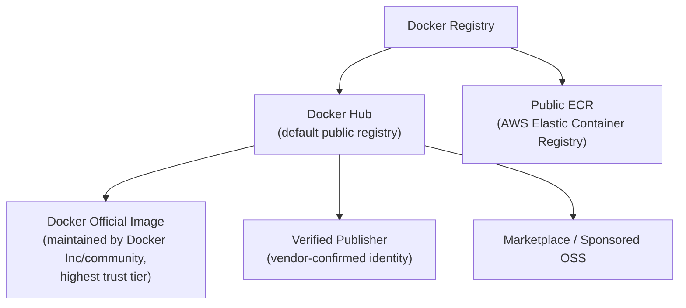

**[EXTRA]** The deck names three image trust tiers without explaining why the distinction matters practically. This is a genuine security consideration: an Official Image undergoes Docker's own review and hardening process and is generally the safest starting point for a base image (e.g., `nginx`, `node`, `postgres` with no username prefix are official images). A Verified Publisher image confirms the publishing organization's identity but doesn't carry Docker's own review. Anything else - a random user's public image with no verification - carries the least trust, since it could contain anything, including malware, unpatched CVEs, or intentionally backdoored software. For production use, defaulting to Official Images or explicitly vetted Verified Publisher images (and scanning everything regardless, covered in the security section later) is standard practice.

**[EXTRA]** Private registries beyond the deck's two examples, genuinely relevant for a real DevOps role:

| Registry | Provider |
|---|---|
| Docker Hub | Docker Inc, public default |
| Amazon ECR | AWS - both public and private repositories |
| Google Artifact Registry / GCR | Google Cloud |
| Azure Container Registry (ACR) | Microsoft Azure |
| GitHub Container Registry (GHCR) | GitHub, tightly integrated with GitHub Actions CI |
| Harbor | Self-hosted, open-source private registry |

### Self-Check Q and A

1. **Q: Why would a company running production workloads on AWS choose a private Amazon ECR repository over pulling images directly from Docker Hub in their deployment pipeline?**
   A: **[EXTRA]** Private ECR keeps proprietary images out of any public registry, integrates directly with IAM for access control, avoids Docker Hub's public pull-rate limits, and typically has lower latency/cost when pulling from within the same AWS region than pulling across the public internet from Docker Hub.
2. **Q: Between an Official Image and a random unverified user's public image on Docker Hub, which is the safer default choice for a production base image, and why?**
   A: **[EXTRA]** The Official Image - it goes through Docker's own review/hardening process, whereas an unverified public image could contain anything from outdated vulnerable packages to intentionally malicious code, with no vetting at all.

---

# 08 - Image Naming Convention

> [!quote] Deck's content
> To create a container you need the template. Example: `docker.io/salma22/bakehouse:v1`. Parts: Registry, User, Image name, Tag => Version, Supported Infra. To bring an image before creating a container: `docker image pull <Image>`.

```
docker.io   /   salma22   /   bakehouse   :   v1
   |               |             |             |
registry         user       image name        tag
(hostname)     (namespace)                  (version)
```

```bash
docker image pull <Image>
```

**[EXTRA]** The deck labels the tag as "Version, Supported Infra" without unpacking what "supported infra" means in a real tag. Multi-platform image tags are a genuinely important, commonly misunderstood detail:
node:20-alpine # version 20, built on the lightweight Alpine Linux base  
node:20-bullseye # version 20, built on Debian Bullseye base - different OS underneath, different size/tooling  
node:20-slim # version 20, minimal Debian-based variant, smaller than full bullseye
> [!important] Omitting the registry defaults to Docker Hub
> **[EXTRA]** `docker image pull nginx` is shorthand for `docker image pull docker.io/library/nginx:latest` - if no registry is specified, Docker defaults to `docker.io`; if no user/namespace is given, official images live under the implicit `library/` namespace; if no tag is given, it defaults to `:latest`. Relying on `:latest` in production is itself a common anti-pattern, expanded on below.

> [!warning] `:latest` is not a stable version - it's a moving pointer
> **[EXTRA]** The `:latest` tag simply means "whatever the most recently pushed image was" - it is not guaranteed to be any particular version and can silently change to a different (potentially breaking) build between one pull and the next. Production deployments should always pin an explicit, immutable version tag (or better, a content-addressable digest, `image@sha256:...`) rather than relying on `:latest`, to guarantee the exact same image is deployed every time.

### Self-Check Q and A

1. **Q: `docker image pull nginx` and `docker image pull docker.io/library/nginx:latest` produce the exact same result. Why?**
   A: `nginx` alone is shorthand - Docker fills in the defaults: `docker.io` as the registry (since none was specified), `library/` as the implicit namespace for official images (since no user was given), and `:latest` as the tag (since none was given).
2. **Q: A production deployment pipeline pulls `myapp:latest` on every deploy. Six months later, a deploy suddenly breaks with no code change on the team's side. What's a likely cause, and how would pinning a specific tag or digest have prevented it?**
   A: **[EXTRA]** `:latest` is a mutable pointer - if anyone (a teammate, an automated build) pushed a new image under the `latest` tag in the meantime, the next pull silently retrieves that different image, which could contain breaking changes never reviewed by this deployment's own pipeline. Pinning to an explicit version tag or a content digest (`@sha256:...`) guarantees the exact same image bytes are pulled every single time, regardless of what else gets pushed to the registry later.

---

# 09 - Docker Command Structure

> [!quote] Deck's content
> Docker Commands Structure: `docker <Docker Object> <Sub Command> [Options] [Arguments]`. System.

docker container run -p 8080:80 nginx  
| | | | |  
tool object subcommand options argument

**[EXTRA]** The deck's grammar is correct but worth reinforcing with the actual object list, since every command covered in the rest of the deck follows this exact pattern:

| Docker Object | Example subcommands |
|---|---|
| `container` | `run`, `ls`, `stop`, `rm`, `exec`, `logs` |
| `image` | `pull`, `ls`, `rm`, `build`, `tag` |
| `volume` | `create`, `ls`, `rm`, `inspect` |
| `network` | `create`, `ls`, `rm`, `connect` |
| `system` | `df`, `prune`, `info` |
| `compose` | `up`, `down`, `ps`, `logs` |

> [!tip] Legacy shorthand commands still work but hide the object
> **[EXTRA]** Older Docker versions only had flat commands like `docker run`, `docker ps`, `docker rm` with no explicit object. These still work today as shortcuts (`docker run` is equivalent to `docker container run`), but the deck's structured `docker <object> <subcommand>` form is the modern, explicit, and more discoverable convention - and is what the rest of this deck consistently uses.

### Self-Check Q and A

1. **Q: `docker ps` and `docker container ls` do the same thing. Why do both exist?**
   A: **[EXTRA]** `docker ps` is the older, pre-object-model shorthand syntax, kept for backward compatibility. `docker container ls` is the modern, explicit `<object> <subcommand>` form the deck teaches, which is more consistent and discoverable across all Docker objects (`image ls`, `volume ls`, `network ls` all follow the same pattern, whereas the legacy shorthand commands don't share a consistent naming scheme).

---

# 10 - Container Basic Operations

> [!quote] Deck's content
> Container Basic Operation: `docker container create`, `docker container ls`, `docker container start`, `docker container run`.

```bash
docker container create <image>     # creates a container from an image, but does NOT start it
docker container ls                   # list RUNNING containers only
docker container ls -a                 # list ALL containers, including stopped ones
docker container start <container>      # start an already-created (or stopped) container
docker container run <image>              # create AND start in one step - the command actually used most often
```

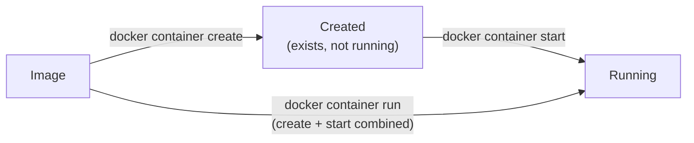

**[EXTRA]** The deck lists `create`, `ls`, `start`, `run` without clarifying the relationship between `create`+`start` versus `run` - genuinely worth stating explicitly since beginners often don't realize `run` is just a convenience wrapper around the other two: `docker container run` = `docker container create` followed immediately by `docker container start`. You would use `create` alone (without immediately starting) in scripted setups where you want to configure something about the container between creation and first start - a rare need in practice, which is why `run` is by far the more commonly used command.

```bash
docker container run -d nginx           # -d = detached, runs in background, returns your shell immediately
docker container run -it ubuntu bash     # -i interactive + -t tty = an interactive shell session inside the container
docker container run --rm alpine echo hi  # --rm = automatically remove the container once it exits
```

### Self-Check Q and A

1. **Q: What's the actual relationship between `docker container run` and `docker container create` + `docker container start`?**
   A: `run` is a single command that performs both steps at once - create the container from the image, then immediately start it. They produce an identical end result; `run` is simply more convenient for the overwhelmingly common case of wanting a container running right away.
2. **Q: `docker container ls` shows nothing even though you know you ran several containers earlier. What flag reveals them, and why does the default `ls` hide them?**
   A: `docker container ls -a` (all). By default, `ls` only shows RUNNING containers - any container that has stopped (exited normally, crashed, or was manually stopped) is hidden unless you explicitly ask for all containers regardless of state.

---

# 11 - Container Interaction Operations

> [!quote] Deck's content
> Container Interaction Operation: `docker container attach`, `docker container exec`, `docker container cp`, `docker container run -p "publish port"`.

```bash
docker container attach <container>              # attach your terminal to the container's MAIN process (PID 1)
docker container exec -it <container> bash          # start a NEW additional process inside a running container
docker container cp <container>:/path ./local          # copy files between the container and the host, either direction
docker container run -p 8080:80 nginx                    # publish port: host_port:container_port
```

> [!important] `attach` versus `exec` - a genuinely important distinction the deck lists side by side without contrasting
> **[EXTRA]** `attach` connects your terminal directly to the container's already-running main process (PID 1) - if that process is a web server writing logs, you'll see its live stdout, and if you press Ctrl-C, you risk killing the container's main process entirely, stopping the container. `exec` instead starts a brand-new, separate process inside the already-running container's namespaces (most commonly an interactive shell) - closing that shell (or its own Ctrl-C) only ends that one exec'd process, leaving the container's actual main process completely untouched and still running. In almost all day-to-day troubleshooting ("let me get a shell inside this running container to poke around"), `exec` is the correct, safer tool - `attach` is reserved for genuinely wanting to interact with the container's own primary foreground process.

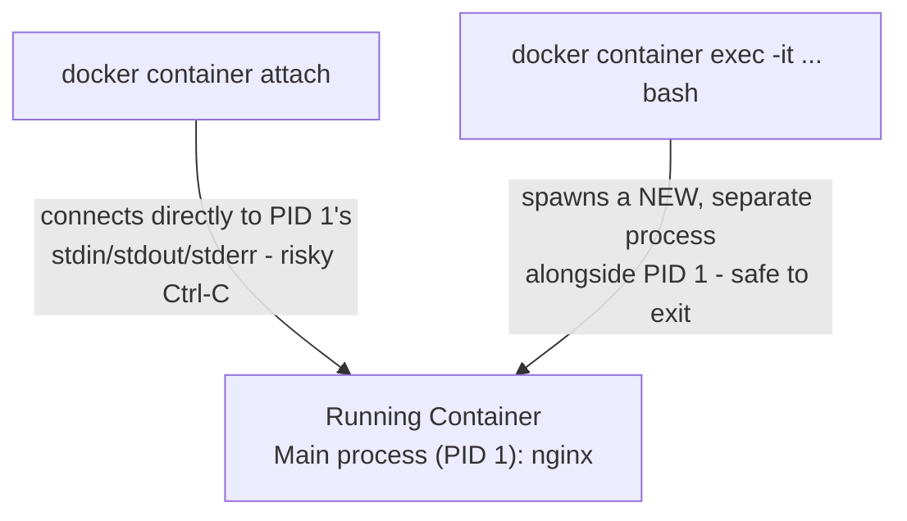

```bash
docker container run -p 8080:80 nginx    # host:8080 -> container:80
```

### Self-Check Q and A

1. **Q: You run `docker container attach webapp` to check on a running Node.js server, then press Ctrl-C to detach and return to your own shell. What actually happens to the container, and why?**
   A: **[EXTRA]** Ctrl-C sends SIGINT directly to the attached process (the container's PID 1, the Node server itself) - unless that process specifically ignores SIGINT, this stops the main process, which stops the entire container. This is exactly why `exec` is preferred for routine "let me look inside" troubleshooting - it avoids this risk entirely.
2. **Q: What does `-p 8080:80` in `docker container run -p 8080:80 nginx` actually mean, and which number is the container's internal port?**
   A: It maps host port 8080 to container port 80 - traffic hitting the HOST machine on port 8080 gets forwarded into the container's port 80 (where nginx is actually listening). The syntax order is always `host_port:container_port`.

---

# 12 - Container Monitoring Operations

> [!quote] Deck's content
> Container Monitoring Operation: `docker container inspect`, `docker container stats`, `docker container top`, `docker container logs`.

```bash
docker container inspect <container>    # full JSON dump - config, network settings, mounts, environment, everything
docker container stats <container>        # live CPU/memory/network/IO usage, updating continuously
docker container top <container>           # list processes running INSIDE the container (like ps, but scoped to it)
docker container logs <container>           # view the container's captured stdout/stderr output
docker container logs -f <container>          # follow logs live, same concept as "tail -f"
```

**[EXTRA]** The deck lists these four commands without indicating which one to reach for in which situation - a practical troubleshooting order worth adding:

| Symptom | Reach for |
|---|---|
| "Why did the app inside crash / what did it print before dying?" | `logs` |
| "Is this container eating all my host's CPU/RAM right now?" | `stats` |
| "What processes are actually running inside this container?" | `top` |
| "What exact config/network/mount settings does this container have?" | `inspect` |

### Self-Check Q and A

1. **Q: A container is consuming an unexpectedly large amount of memory. Which monitoring command shows this live, and which would you check next to find out WHY?**
   A: **[EXTRA]** `docker container stats` shows live resource consumption first, confirming and quantifying the memory usage. `docker container top` (to see what processes are actually running inside) or `docker container logs` (to see if the app itself is logging errors, memory leaks, or unusual activity) would be the natural next steps to find the root cause.

---

# 13 - Stopping and Removing Containers

> [!quote] Deck's content
> Stopping and Removing Containers Operation: `docker container pause`, `docker container unpause`, `docker container stop`, `docker container kill`, `docker container rm`, `docker container prune`.

```bash
docker container pause <container>       # freeze ALL processes inside - no CPU time at all, but stays in memory
docker container unpause <container>       # resume from paused state
docker container stop <container>            # send SIGTERM (graceful), then SIGKILL after a grace period if it hasn't exited
docker container kill <container>              # send SIGKILL immediately - no grace period, no chance to clean up
docker container rm <container>                  # remove a STOPPED container (fails on a running one without -f)
docker container prune                              # remove ALL stopped containers at once, bulk cleanup
```

> [!important] `stop` versus `kill` - the same distinction that matters for signals generally
> **[EXTRA]** The deck lists these side by side without contrasting the actual behavior difference. `stop` is the graceful option: it sends SIGTERM, giving the process inside a chance to shut down cleanly (close database connections, flush buffers, finish in-flight requests), and only escalates to a forceful SIGKILL if the process hasn't exited within a grace period (10 seconds by default). `kill` skips straight to SIGKILL with zero grace period - the process is terminated instantly with no chance to clean up anything. `stop` should be the default choice; `kill` is for genuinely unresponsive containers that `stop` already failed to shut down.

> [!important] `pause` is fundamentally different from `stop`
> **[EXTRA]** `pause` does not terminate anything - it uses the cgroup freezer to suspend every process inside the container so it receives zero CPU cycles, while the container's full state (memory, open connections, process tree) remains intact in memory. `unpause` resumes it exactly where it left off. This is useful for temporarily freeing up CPU for something else without losing container state, genuinely different from `stop`'s termination-and-restart model.

### Self-Check Q and A

1. **Q: A container running a database becomes unresponsive to `docker container stop` even after the default grace period. What's the next escalation, and what's the tradeoff of using it?**
   A: `docker container kill`, which sends SIGKILL immediately with no further grace period. The tradeoff: the process inside gets absolutely no chance to flush buffers or close connections cleanly, risking data corruption for a database specifically - `kill` should genuinely be a last resort after `stop` has already been given a fair chance.
2. **Q: What's the practical difference between pausing a container and stopping it?**
   A: **[EXTRA]** `pause` freezes all processes inside in place (via the cgroup freezer) with zero CPU usage but the full container state intact in memory, resumable instantly with `unpause`. `stop` actually terminates the container's main process - restarting it later means the process starts fresh, not resuming mid-execution.

---

# 14 - Image Basic Operations

> [!quote] Deck's content
> Image basic Operation: `docker login`, `docker image pull`, `docker image ls`, `docker image search`.

```bash
docker login                  # authenticate against a registry (Docker Hub by default)
docker image pull <image>       # download an image from a registry
docker image ls                  # list images stored locally
docker image search <term>         # search Docker Hub for images matching a keyword
```

### Self-Check Q and A

1. **Q: Why is `docker login` a prerequisite before pulling certain images, when many public images (like `nginx`) can be pulled without ever logging in?**
   A: **[EXTRA]** Public images on a public registry require no authentication at all. `docker login` is only required for private images/repositories (your own company's private ECR/Docker Hub repo) or to raise Docker Hub's anonymous pull-rate limits, which are more restrictive for unauthenticated pulls than for logged-in accounts.

## Image Create Operations

> [!quote] Deck's content
> Image Create Operation: `docker image tag`, `docker image save`, `docker image load`. From Running Container: `docker container export`, `docker container commit`. Then: `docker image import`.

```bash
docker image tag <source> <target>        # give an existing image an additional name/tag - no new image data created
docker image save <image> -o file.tar        # export an image (with all its layers/history) to a tar archive
docker image load -i file.tar                  # import an image previously saved with "save" - restores full layer history

docker container export <container> -o file.tar   # export a container's CURRENT FILESYSTEM STATE (flattened, no layer history)
docker image import file.tar                        # import that flattened filesystem as a new single-layer image
docker container commit <container> <new-image>       # turn a running/stopped container's current state directly into a new image
```

> [!important] `save`/`load` versus `export`/`import` - genuinely different, easy to conflate
> **[EXTRA]** The deck places these in the same slide without contrasting them, but they operate on fundamentally different things and produce different results. `save`/`load` operate on an IMAGE and preserve its full layer history and metadata (tags, build history) - the round trip is lossless. `export`/`import` operate on a CONTAINER's current filesystem and produce a single flattened layer with no history at all - useful for capturing a container's exact current disk state as a fresh base image, but you lose the original image's layer-by-layer build history in the process.

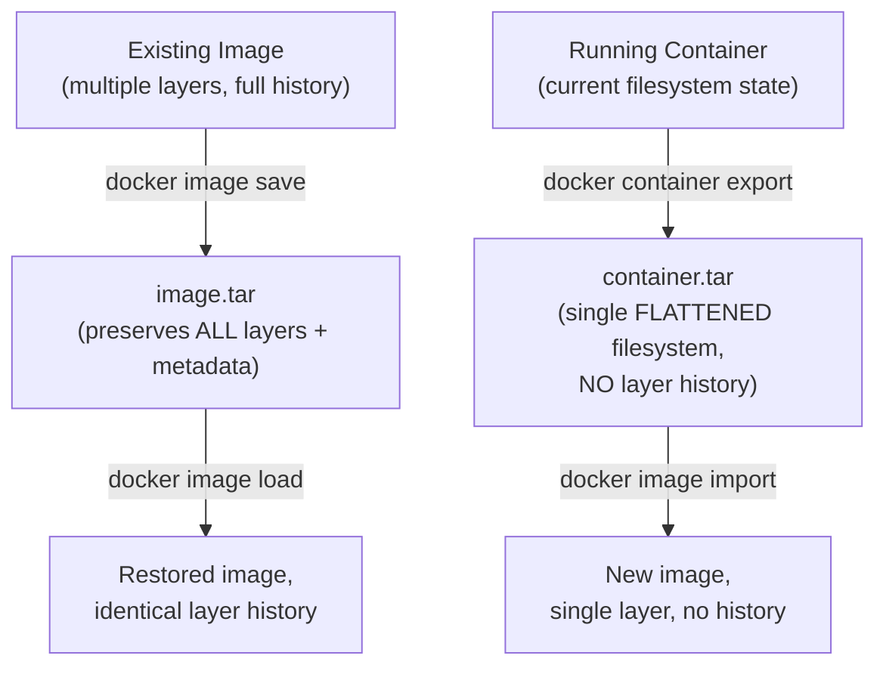

### Self-Check Q and A

1. **Q: A colleague uses `docker container export` on a running container to "back it up as an image," expecting to later inspect the individual build layers with `docker history`. What will they actually find?**
   A: **[EXTRA]** `export` flattens the container's entire filesystem into a single archive with no layer history at all - the resulting imported image will show as one single layer via `docker history`, with none of the original build steps preserved. `docker image save` on the original image (not `container export`) would have been the correct choice to preserve full layer history.
2. **Q: What's the practical use case for `docker container commit`?**
   A: Capturing whatever state a running container has reached right now - including any manual changes made interactively inside it (installed packages, edited config files) - directly as a new reusable image, without writing or rebuilding from a Dockerfile. Useful for quick experimentation, though generally considered less reproducible/maintainable than defining the same changes in a Dockerfile.

## Image Remove Operations

> [!quote] Deck's content
> Image Remove Operation: `docker image rm`, `docker image prune`.

```bash
docker image rm <image>       # remove a specific image (fails if a container still references it)
docker image prune              # remove all DANGLING images (untagged, unreferenced layers) - safe cleanup
docker image prune -a             # remove ALL images not currently used by any container - aggressive cleanup
```

### Self-Check Q and A

1. **Q: What's the difference between `docker image prune` and `docker image prune -a`, and why does the distinction matter before running either on a shared build server?**
   A: **[EXTRA]** Plain `prune` only removes dangling images - untagged layers left behind from rebuilds that nothing references anymore, genuinely safe cleanup. `prune -a` removes every image not currently backing a running container, including tagged images you may still want cached locally for a future build or deploy - running it carelessly on a shared CI/build server can force expensive re-pulls of images the next job actually needed.

---

# 15 - Customized Images

> [!quote] Deck's content
> Why would you need to create your own image: not find a component or service, your application dockerized for ease of shipping and deploying. You need to know: what are you containerizing or what application we are creating an image for, how the application is built (steps to deploy the application manually).

> [!important] Deck's own key insight
> Before writing a Dockerfile for anything, you must already know how to deploy that application manually, step by step, on a bare machine - a Dockerfile is just those exact same manual steps expressed as automated, repeatable instructions.

**[EXTRA]** This is worth reinforcing as the single most important mental model for writing any Dockerfile: if you cannot describe, in order, exactly how you would install and run an application on a fresh Linux machine by hand (install runtime, install dependencies, copy code, set environment, run the start command), you are not ready to write a correct Dockerfile for it - the Dockerfile is a literal, automatable transcription of that manual process.

### Self-Check Q and A

1. **Q: Why does the deck insist you must know "how the application is built [steps to deploy manually]" before writing a Dockerfile?**
   A: A Dockerfile is fundamentally a scripted, repeatable version of the exact manual deployment steps - installing the runtime, dependencies, copying code, configuring the environment, and specifying the start command. Without first knowing those manual steps, there is no correct sequence of instructions to automate.

## Dockerfile Instructions - FROM, RUN, COPY, ENTRYPOINT

> [!quote] Deck's content
> Dockerfile must start with a FROM instruction (base image). RUN instruction: run a particular command. COPY instruction: copy from local to image. ENTRYPOINT: allow us to specify the command/task that will run in the container.

```bash
mkdir simple-node-app
cd simple-node-app
npm init -y
npm install express
```

```javascript
// server.js
const express = require("express");
const app = express();

app.get("/", (req, res) => {
  res.send("Hello from simple Node.js app!");
});

const PORT = 3000;
app.listen(PORT, () => {
  console.log(`App running on http://localhost:${PORT}`);
});
```

| Instruction | Purpose per the deck |
|---|---|
| `FROM` | The base image everything else builds on top of - MANDATORY first instruction |
| `RUN` | Execute a command at BUILD time (installing packages, compiling code) |
| `COPY` | Copy files from the local build context into the image filesystem |
| `ENTRYPOINT` | Specify the command/task that runs when the CONTAINER starts |

> [!important] Why FROM must be first, mechanically
> **[EXTRA]** Every subsequent instruction operates on top of the filesystem state established by the base image - `RUN`, `COPY`, and everything else need a starting filesystem to modify. There is no valid "blank slate" to build from without first declaring a base image (even `FROM scratch`, an genuinely empty base, is still an explicit FROM statement).

### Self-Check Q and A

1. **Q: What's the actual difference in WHEN `RUN` and `ENTRYPOINT` instructions execute?**
   A: `RUN` executes during the IMAGE BUILD process (`docker build`) - its effects become a permanent layer baked into the image. `ENTRYPOINT` defines what runs when a CONTAINER STARTS (`docker container run`) - it executes fresh every time a new container is launched from that image, not during the build.

## Layered Architecture

> [!quote] Deck's content
> Each line of instruction creates a new layer inside the Docker image, with just the change from the previous layer. Each layer is cached.

```dockerfile
FROM node:lts-alpine3.22
WORKDIR /app
COPY . .
RUN npm install
EXPOSE 3000
ENTRYPOINT npm start
```

```bash
docker build . -t mynode-app
```

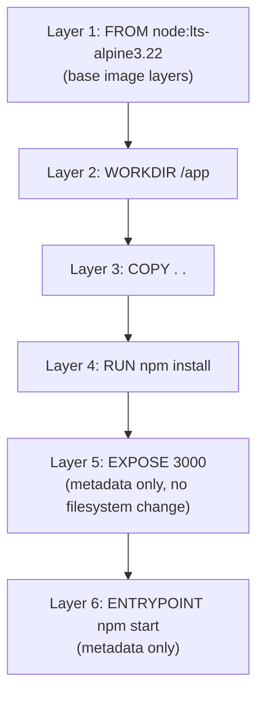

**[EXTRA]** The deck states each instruction creates a layer and each layer is cached, but doesn't explain the practical consequence of layer ORDER - which is exactly what the next two deck sections (build context, caching/invalidation) build directly on. Layers are stacked and each one is only rebuilt if it OR anything before it in the file changes - so instruction order in a Dockerfile has a real, measurable performance impact, expanded fully below in the caching section.

**[EXTRA]** Not every instruction produces a filesystem layer. `EXPOSE`, `ENV`, `LABEL`, `CMD`, and `ENTRYPOINT` are metadata-only instructions - they add a tiny metadata layer to the image manifest but do not change the actual filesystem contents, unlike `RUN`, `COPY`, and `ADD`, which do write real filesystem changes into a new layer.

### Self-Check Q and A

1. **Q: Does `EXPOSE 3000` in a Dockerfile create a filesystem layer the same way `RUN npm install` does?**
   A: **[EXTRA]** No - `EXPOSE` (like `ENV`, `LABEL`, `CMD`, `ENTRYPOINT`) is a metadata-only instruction. It adds an entry to the image's manifest/config but writes no actual files to the image filesystem, unlike `RUN`, `COPY`, and `ADD`, which produce real filesystem-changing layers.

## Build Context

> [!quote] Deck's content
> `docker build . -t mynode-app`. Where the Docker daemon should search for the Dockerfile and supporting/using files. Important to make sure that you only have necessary files for the build image. Temporary/unneeded files (logs, local builds) will increase build time.

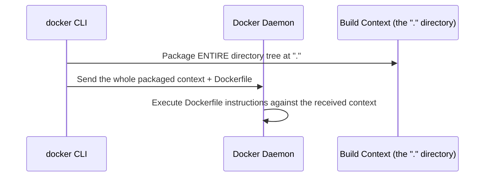

> [!important] The build context is sent to the daemon in full, before the build even starts
> **[EXTRA]** The deck states this but is worth making mechanically explicit: `docker build .` does not simply "look at" the current directory - the Docker client packages the ENTIRE contents of that directory (every file, every subdirectory, recursively) and transmits it to the Docker daemon BEFORE a single build instruction executes. If that directory contains a multi-gigabyte `node_modules/`, a `.git/` history, or old log files, all of it gets uploaded to the daemon on every single build, regardless of whether the Dockerfile ever references those files - this is exactly the performance problem the deck flags and exactly what `.dockerignore` (next section) exists to solve.

### Self-Check Q and A

1. **Q: A Dockerfile's `COPY . .` instruction only copies specific application files that the container actually needs, but `docker build .` is still consistently slow on a project with a large `.git` directory. Why does the .git directory slow the build down if the Dockerfile never references it?**
   A: **[EXTRA]** The entire build context - everything in the directory passed to `docker build`, including `.git` - gets transmitted to the Docker daemon before any Dockerfile instruction runs, regardless of whether the Dockerfile's `COPY` instructions ever reference those specific files. The slowdown happens at the context-transmission step, not at the `COPY` step.

## .dockerignore

> [!quote] Deck's content
> Defines files/directories to be ignored and won't be sent to the Docker daemon.

```dockerfile
FROM node:lts-alpine3.22
WORKDIR /app
COPY . .
RUN npm install
EXPOSE 3000
ENTRYPOINT npm start
```

## .dockerignore - directly solves the build context problem above

node_modules  
.git  
*.log  
.env  
Dockerfile  
.dockerignore

> [!important] `.dockerignore` works exactly like `.gitignore`, and solves the exact problem from the previous section
> **[EXTRA]** Excluding `node_modules` is especially important here - if it's present locally and not ignored, it gets uploaded into the build context, then `RUN npm install` inside the container reinstalls dependencies fresh anyway (since the container's OS/architecture may differ from the host's), making the locally-present `node_modules` pure wasted upload with zero benefit.

### Self-Check Q and A

1. **Q: Why is excluding `node_modules` from `.dockerignore` a double waste, not just a slow build context upload?**
   A: **[EXTRA]** It's uploaded into the build context for nothing (the Dockerfile's own `RUN npm install` reinstalls dependencies fresh inside the container regardless, since the container's OS/CPU architecture may not match the host's local `node_modules` build), AND it bloats every single `docker build` invocation with a large, entirely unnecessary upload.

## Caching Layers and Invalidation

> [!quote] Deck's content
> Compare instructions in the Dockerfile. Compare checksums of files in ADD or COPY instructions.

```dockerfile
FROM node:lts-alpine3.22
WORKDIR /app
COPY . .
RUN pwd
RUN npm install        # Invalidate Layer
EXPOSE 3000              # Invalidate Layer
ENTRYPOINT npm start       # Invalidate Layer
```

```bash
docker build . -t mynode-app:v3 --no-cache=true
```

> [!quote] Deck's own question, and its cache-busting example
> What is the issue?
> ```
> RUN apt-get update
> RUN apt-get install -y python
> ```
> Cache Busting.

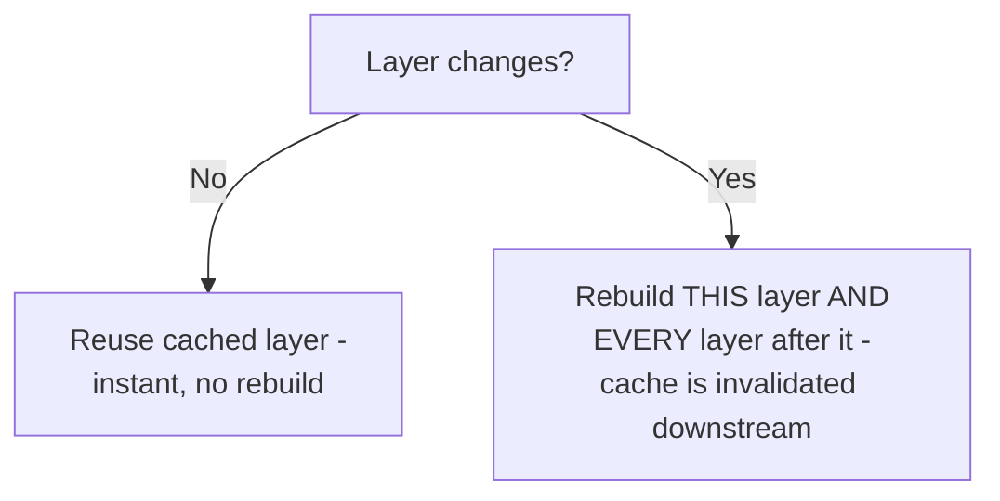

**[EXTRA]** Answering the deck's own open question ("What is the issue???") about the `apt-get update` / `apt-get install` example, since the deck poses it without answering it: this is the classic Docker cache-busting bug. `RUN apt-get update` refreshes the package index and gets cached as a layer. On a REBUILD days or weeks later, if nothing above that line in the Dockerfile changed, Docker reuses the CACHED `apt-get update` layer rather than re-running it - meaning the package index inside the image can silently become stale relative to the actual upstream repositories, while `apt-get install -y python` on the next line still runs (or is also cached) against that now-outdated index, potentially failing to find a package, pulling in an unexpectedly old version, or failing outright if the cached index references packages that have since been removed upstream.

```dockerfile
# The fix - combine update and install into ONE instruction, so caching treats them as one atomic unit:
RUN apt-get update && apt-get install -y python
```

> [!important] Why combining into one RUN line fixes it
> **[EXTRA]** Docker's cache key for a `RUN` instruction is the instruction's exact text plus everything that came before it - it has no way to know that a separate, later `RUN apt-get install` logically depends on a fresh index from an earlier, separately-cached `RUN apt-get update`. Combining them into a single `RUN` line with `&&` means the ENTIRE operation (update AND install together) is cached or invalidated as one atomic unit - if the layer runs at all, both `update` and `install` genuinely run together, fresh, using the same package index.

> [!important] Layer invalidation cascades downstream
> **[EXTRA]** The deck marks `RUN npm install`, `EXPOSE 3000`, and `ENTRYPOINT npm start` as "Invalidate Layer" in its own example, worth explaining why: once `COPY . .` changes (any file in the copied context differs, detected via checksum comparison as the deck states), every single instruction AFTER that point in the Dockerfile must be rebuilt from scratch, even if those later instructions' own text never changed - caching only reuses a layer if its own instruction text is unchanged AND every layer before it was also reused from cache. This is exactly why Dockerfile instruction ORDER matters for build speed: put instructions that change rarely (installing the runtime, installing dependencies from a lockfile) BEFORE instructions that change on every single build (copying application source code), so the expensive, rarely-changing steps stay cached across most builds.

```dockerfile
# BETTER ORDER - dependencies installed BEFORE the full source copy,
# so "npm install" stays cached even when application code changes:
FROM node:lts-alpine3.22
WORKDIR /app
COPY package*.json ./         # only the small, rarely-changing dependency manifest
RUN npm install                 # cached across builds UNLESS package*.json actually changed
COPY . .                          # the frequently-changing application source, copied LAST
EXPOSE 3000
ENTRYPOINT npm start
```

### Self-Check Q and A

1. **Q: The deck's own example marks `RUN apt-get update` followed by a separate `RUN apt-get install -y python` as buggy, and asks "what is the issue?" without answering. What is the actual issue?**
   A: **[EXTRA]** Docker caches each `RUN` line independently by its own instruction text. On a rebuild, if the `apt-get update` line's text hasn't changed, Docker reuses its CACHED result rather than genuinely re-running it - meaning the package index can silently go stale across rebuilds, while `apt-get install` runs against that potentially outdated index, risking missing packages, unexpected old versions, or install failures. The fix is combining both into a single `RUN apt-get update && apt-get install -y python` line so they're cached and invalidated together as one atomic operation.
2. **Q: Given the caching mechanics, why does copying `package*.json` and running `npm install` BEFORE copying the rest of the application source code (rather than one combined `COPY . .` followed by `npm install`) meaningfully speed up most day-to-day rebuilds?**
   A: **[EXTRA]** Application source code changes on nearly every build, but the dependency manifest (`package.json`/`package-lock.json`) changes rarely. By copying only the manifest first and running `npm install` against just that, the (often slow) install step stays cached across every rebuild where only the application source changed - the full, slower `npm install` only re-runs when dependencies themselves genuinely changed, not on every single code edit.

## COPY versus ADD

> [!quote] Deck's content
> Both COPY and ADD are used to copy files from the local filesystem to the image filesystem. `FROM ubuntu` + `COPY /src /dist` versus `FROM ubuntu` + `ADD /src /dist`. It is recommended to use COPY - straightforward. ADD extracts tar files from local to image, or can specify a URL and download into a particular path in the image filesystem.

| | COPY | ADD |
|---|---|---|
| Copies local files | Yes | Yes |
| Auto-extracts local tar archives | No | Yes |
| Can fetch a remote URL | No | Yes |
| Recommended default | Yes, per the deck | Only for its specific extra behaviors |

> [!warning] Why COPY is the recommended default, beyond just "straightforward"
> **[EXTRA]** ADD's extra behaviors (auto tar-extraction, remote URL fetching) are implicit and can surprise anyone reading the Dockerfile later - a `COPY` instruction always does exactly one predictable thing (plain file copy), while an `ADD` instruction's actual behavior depends on the source argument's content, which is not obvious from reading the Dockerfile text alone. This is the actual reasoning, beyond the deck's brief "straightforward," behind official Docker best-practice guidance to default to COPY and reach for ADD only when its specific extra behavior (tar extraction, remote fetch) is genuinely needed.

### Self-Check Q and A

1. **Q: A Dockerfile uses `ADD https://example.com/app.tar.gz /app/` instead of downloading the file separately and using COPY. What real risk does this introduce that a plain COPY of a local file wouldn't have?**
   A: **[EXTRA]** The remote URL's content is fetched fresh at build time from a third party outside your control - if that URL changes, goes down, or is compromised, your build result silently changes or fails, with no local record of exactly what was fetched. A COPY of a locally-vendored file (downloaded once, checked into or cached alongside your build context) is fully reproducible and auditable in a way a live remote fetch inside ADD is not.

## EXPOSE, USER, WORKDIR

> [!quote] Deck's content
> DockerFile Instructions: EXPOSE, USER, WORKDIR.

| Instruction | Purpose |
|---|---|
| `EXPOSE` | Documents which port(s) the container listens on - purely informational/metadata, does NOT actually publish the port (that's what `-p` on `docker container run` does) |
| `USER` | Sets which user the container's subsequent instructions and the final running process execute as - directly relevant to the deck's own later root-user security section |
| `WORKDIR` | Sets the working directory for all subsequent instructions (RUN, COPY, CMD, ENTRYPOINT) - also creates the directory if it doesn't exist |

> [!important] EXPOSE does not actually open or publish anything
> **[EXTRA]** This is a very common beginner misconception the deck's bare list doesn't warn against: `EXPOSE 3000` in a Dockerfile is purely documentation/metadata for anyone reading the image (and for tools like `docker container run -P`, which auto-publishes all EXPOSE'd ports to random host ports) - it does not, by itself, make the port reachable from outside the container. Actually publishing a port to the host requires the `-p host_port:container_port` flag on `docker container run`, entirely independent of whatever the Dockerfile's EXPOSE instruction says.

```dockerfile
FROM node:lts-alpine3.22
WORKDIR /app
COPY . .
RUN npm install
EXPOSE 3000
USER node                 # run as the non-root 'node' user provided by the official node image, not root
ENTRYPOINT npm start
```

> [!important] USER connects directly to the deck's own later security section
> **[EXTRA]** Running a container's main process as root (the default if `USER` is never specified) means that, per the deck's own root-user comparison table covered later, any process compromise inside the container starts from root privileges within the container's own namespace - a real, avoidable risk. Setting `USER` to a non-root user explicitly is one of the simplest, most effective hardening steps available, directly reducing the blast radius the deck's own security slides describe.

### Self-Check Q and A

1. **Q: A Dockerfile has `EXPOSE 3000`, but running `docker container run myapp` (without any `-p` flag) still leaves the app unreachable from the host machine. Is this a bug?**
   A: No - `EXPOSE` is documentation/metadata only and never actually publishes a port on its own. The container must be run with an explicit `-p 3000:3000` (or similar) flag to actually forward host traffic into the container's port, regardless of what EXPOSE declares.
2. **Q: Why would adding a single `USER node` line to a Dockerfile be considered a meaningful security improvement rather than a cosmetic change?**
   A: **[EXTRA]** Without it, the container's main process runs as root by default - if that process is compromised (e.g., through an exploited application vulnerability), the attacker starts with root privileges inside the container's namespace, which meaningfully widens what they can do (per the deck's own later root-user comparison table) compared to a compromised process already confined to an unprivileged user.

## Multi-Stage Build

> [!quote] Deck's content
> Multi Stage Build.

```dockerfile
# -----------------------------
# 1) BUILD STAGE (Vite build)
# -----------------------------
FROM node AS builder

WORKDIR /app

# Copy package files first
COPY package*.json ./
# Install dependencies
RUN npm install
# Copy the rest of the project
COPY . .
# Build Vite (outputs to 'dist')
RUN npm run build

# -----------------------------
# 2) RUN STAGE (Serve with Nginx)
# -----------------------------
FROM nginx:alpine AS runner

# Remove default nginx website
RUN rm -rf /usr/share/nginx/html/*
# Copy Vite build from previous stage
COPY --from=builder /app/dist /usr/share/nginx/html
# Expose port
EXPOSE 80
# Start Nginx
CMD ["nginx", "-g", "daemon off;"]
```

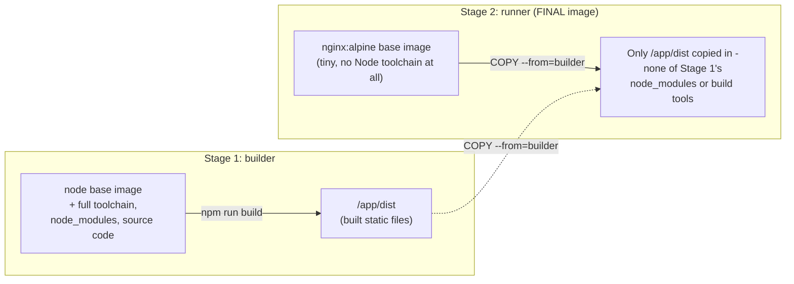

**[EXTRA]** The deck shows a genuinely excellent real-world multi-stage example but the slide's own title is the only explanation given - worth stating the core payoff explicitly: the FINAL image contains only `nginx:alpine` plus the built static output files - none of the Node.js runtime, `node_modules`, npm cache, or source code from the build stage ever exist in the final shipped image at all. This can be the difference between a multi-gigabyte final image (if everything from the build toolchain were included) and a genuinely tiny few-tens-of-megabytes final image, since Alpine-based nginx is extremely small and nothing from Stage 1 survives except the explicitly copied `/app/dist` directory.

> [!important] Why this matters beyond just image size
> **[EXTRA]** Smaller final images mean faster pulls/deploys, a smaller attack surface (no compiler, no npm, no leftover source code sitting in the shipped production image for an attacker to potentially exploit or read), and a cleaner separation between "what it takes to BUILD the app" and "what it takes to RUN the app" - two genuinely different concerns that multi-stage builds let you express in a single Dockerfile.

### Self-Check Q and A

1. **Q: In the deck's own multi-stage example, does the final shipped image contain Node.js or npm at all?**
   A: No - the final stage's base image is `nginx:alpine`, which has no Node.js toolchain whatsoever. Only the `/app/dist` directory (the already-built static output) is copied over from the builder stage via `COPY --from=builder`; the entire Node.js runtime, npm, and `node_modules` from Stage 1 are discarded and never present in the final image.
2. **Q: Beyond smaller image size, what security benefit does discarding the build stage's tooling provide?**
   A: **[EXTRA]** It reduces the final image's attack surface - no compiler, package manager, or full source tree sitting in a production container that an attacker who gains any foothold could otherwise use to install additional tools, inspect source code, or pivot further.

---

# 16 - Docker Volumes

> [!quote] Deck's content
> Volume mount. Bind mount. `/var/lib/docker/volume`.

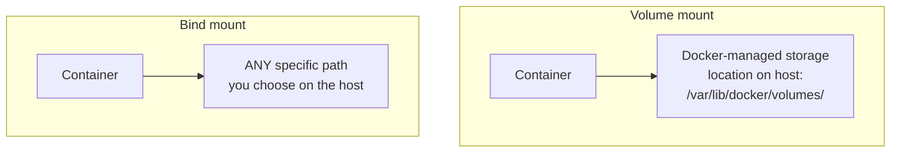

**[EXTRA]** The deck names both mount types and gives the volume storage path but doesn't contrast when to use which - a genuinely important practical distinction:

| | Volume mount | Bind mount |
|---|---|---|
| Managed by | Docker itself, in `/var/lib/docker/volumes/` | You - any host path you specify |
| Created via | `docker volume create`, or implicitly by `-v myvolume:/path` | `-v /host/path:/container/path` with an existing host path |
| Portable across hosts | Yes - Docker manages the underlying location, works the same regardless of host OS specifics | No - depends on that exact host path existing with that exact layout |
| Typical use | Persisting database data, anything Docker itself should manage and back up | Local development - live-mounting your source code directory so edits reflect instantly inside a running container |
| Survives `docker volume prune`/container removal | Survives container removal, but a named volume can be explicitly pruned | The host directory is completely unaffected either way - it's not Docker's to manage or delete |

```bash
docker volume create mydata
docker container run -v mydata:/var/lib/postgresql/data postgres     # volume mount - Docker manages storage location
docker container run -v $(pwd)/src:/app/src node                       # bind mount - your exact local directory
docker volume ls
docker volume inspect mydata
docker volume rm mydata
docker volume prune
```

> [!important] Why volume mounts are generally preferred for production data, bind mounts for local development
> **[EXTRA]** A volume mount is fully decoupled from any specific host directory structure, works identically across different hosts (relevant for portability and for orchestrators like Kubernetes/Swarm scheduling a container onto different nodes), and Docker manages its lifecycle. A bind mount ties a container directly to one exact host path - extremely convenient for local development (edit code on your machine, see the change reflected live inside the running container instantly, no rebuild needed) but a poor fit for portable production deployments, since the exact host path may not exist (or have different content) on a different machine.

### Self-Check Q and A

1. **Q: A developer wants their local code edits to appear instantly inside a running container without rebuilding the image every time. Which mount type is appropriate, and why wouldn't a volume mount work as well for this specific use case?**
   A: **[EXTRA]** A bind mount, pointing directly at the local source code directory (`-v $(pwd)/src:/app/src`) - edits made on the host filesystem are immediately visible inside the container since it's literally the same underlying files, no copy or sync step involved. A Docker-managed volume mount would instead point at Docker's own internal storage location, disconnected from the developer's actual working directory, requiring an explicit copy-in step rather than live-reflecting edits.
2. **Q: Why is a Docker-managed volume generally the better choice for a production database's data directory rather than a bind mount to an arbitrary host path?**
   A: **[EXTRA]** A named volume is portable and fully managed by Docker - it doesn't depend on a specific host directory existing with specific permissions, and it integrates cleanly with Docker's own backup/inspect/prune tooling. A bind mount to a hardcoded host path ties the deployment to that exact machine's filesystem layout, which breaks portability if the container ever needs to run on a different host.

---

# 17 - Docker Networks

> [!quote] Deck's content
> 3 default created networks.

| Network | Deck's description |
|---|---|
| Bridge | Private internal network (default) created by Docker that containers attach to. Containers can access each other using IP or container name. |
| Host | Takes any network isolation away between the Docker host and the container (no need for port mapping). `docker container run --network=none`. Issue? |
| None | The container doesn't have any access to an external network - completely isolated. `docker container run --network=none` |

> [!warning] Correction to the deck's own command examples
> The deck's table lists `docker container run --network=none` under BOTH the Host row and the None row. This is a copy error in the source slide - the Host network mode is actually invoked with `docker container run --network=host`, not `--network=none`. The `--network=none` command correctly belongs only under the None row, exactly as described in that row's own text ("Container doesn't have any access to external network - completely isolate").

```bash
docker container run --network=bridge nginx     # default - private internal network, container-to-container by name or IP
docker container run --network=host nginx         # shares the HOST's network namespace directly - no isolation at all
docker container run --network=none nginx           # zero network access whatsoever - fully isolated
```

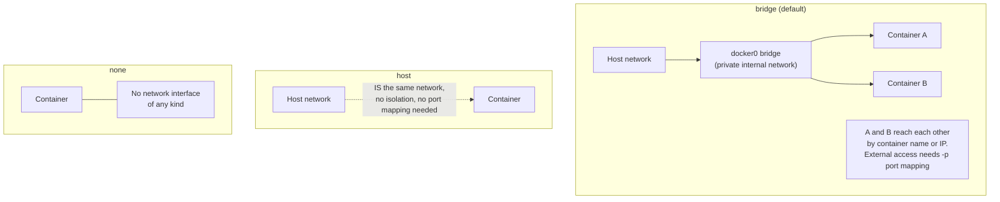

> [!important] Deck's own posed "Issue?" for host networking, answered
> **[EXTRA]** The deck poses "Issue?" as an open question under the Host network row without answering it. The actual issue: with `--network=host`, the container shares the exact same network namespace and port space as the host machine - meaning if the container's application binds to port 80, it directly occupies port 80 on the HOST itself, with no isolation and no ability to run two containers on the host that both want the same port (since there's no per-container port mapping layer to disambiguate them). It also removes an entire layer of network isolation as a security boundary - a compromised container with host networking has direct visibility into the host's own network interfaces and any other services listening there, unlike the isolated, port-mapped bridge network.

### Self-Check Q and A

1. **Q: The deck's own table appears to list the same `--network=none` command under both the Host and None network types. Which network mode does `--network=host` actually enable, and how does it differ from `--network=none`?**
   A: `--network=host` makes the container directly share the host's own network namespace (full network access, no isolation, no port mapping needed) - the opposite of `--network=none`, which removes ALL network access entirely. They are functionally opposite settings that were miswritten identically in the source slide's table.
2. **Q: What is the actual "issue" with host networking that the deck poses as an open question?**
   A: **[EXTRA]** Since the container shares the host's exact network namespace, any port the containerized application binds to directly occupies that same port on the host machine itself - removing the ability to run multiple containers that each want the same port (no per-container port mapping to disambiguate), and removing network isolation as a security boundary between the container and the host's other network-facing services.

---

# 18 - Docker Security - Resource Limits (cgroups)

> [!quote] Deck's content
> Resource Level. `docker container run --memory 512M --cpu-shares=512 --cpuset-cpus=0,1` or `--cpus=2.5`.

| Option | Behavior, per the deck | Hard limit? |
|---|---|---|
| `--memory=512M` | Restrict memory consumed by container (RAM) | Yes |
| `--memory-swap` | Max RAM + swap | Yes |
| `--memory-reservation` | "This container usually needs this much memory" - a soft target, not enforced | No |
| `--cpu-shares=512` | Priority to enter CPU, default 1024. Higher number = higher priority. Works only when the host CPU is under load. | No |
| `--cpuset-cpus=0,1` | Pin to certain CPU cores (by ID) | Yes |
| `--cpus=2.5` (about 83 percent) | Hard CPU limit - can only use 2.5 cores out of 3 | Yes |

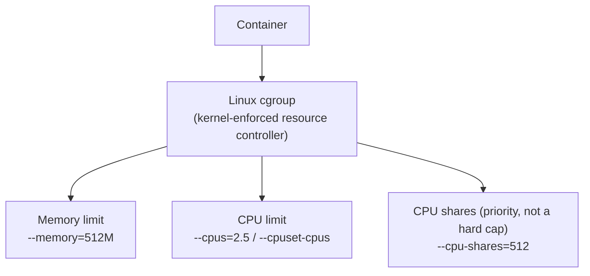

> [!important] Hard limit versus priority - the single most important distinction on this slide
> **[EXTRA]** The deck's own table already flags which options are "Hard Limit: Yes" versus "No," but the practical consequence is worth stating directly: `--cpu-shares` (and `--memory-reservation`) are NOT caps at all - they only matter when the host is under CPU/memory contention, and even then they only influence relative PRIORITY between competing containers, never an absolute ceiling. A container with `--cpu-shares=512` set can still consume 100 percent of available CPU if the host isn't under load and nothing else is competing for cycles. Genuine hard caps (`--memory`, `--cpus`, `--cpuset-cpus`) are enforced unconditionally by the kernel's cgroup mechanism regardless of host load.

**[EXTRA]** This entire resource-limiting slide is the practical, hands-on application of the cgroups concept the deck itself named back in section 04 ("containers idea exist before Docker") without yet demonstrating - these flags are literally Docker exposing the Linux cgroup kernel primitive through its CLI.

### Self-Check Q and A

1. **Q: A container is given `--cpu-shares=256` (a low priority relative to the default 1024) but no other CPU limit. On an otherwise idle host with no other containers running, how much CPU can it actually use?**
   A: **[EXTRA]** Up to 100 percent of available CPU - `--cpu-shares` only affects relative priority DURING contention between multiple processes competing for CPU. With no competition at all, the low share value has no effect whatsoever; it is not a cap.
2. **Q: Why does `--memory-reservation` provide no guarantee, unlike `--memory`?**
   A: Per the deck's own table, `--memory-reservation` is a soft target ("this container usually needs this much") with no enforcement (Hard Limit: No) - the container CAN exceed it under normal operation; it only becomes relevant as a hint during host-wide memory pressure. `--memory` is a hard, kernel-enforced ceiling the container cannot exceed under any circumstance.

---

# 19 - Docker Security - Root User

> [!quote] Deck's content on Root User
> Table comparing Root on Host versus Root in Container:

| Action | Root on Host | Root in Container |
|---|---|---|
| Install packages | Yes | No (only inside container filesystem) |
| Access host files | Yes | No (unless bind-mounted) |
| Change host network | Yes | No |
| Load kernel modules | Yes | No |
| Kill host processes | Yes | No |
| Change kernel params | Yes | No |
| Break out of container | (not applicable) | Possible with kernel exploits |

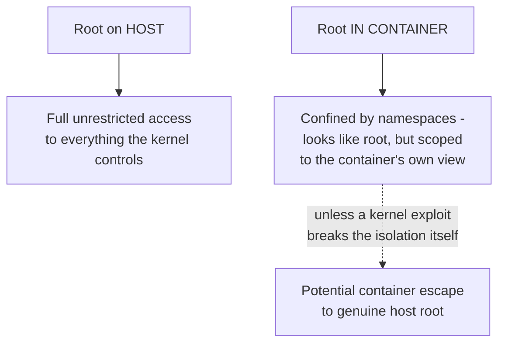

> [!important] "Root in container" is not the same privilege level as "root on host" - but it is still real risk
> The deck's own table makes this precise: being root INSIDE a container is confined by the namespace boundary - it cannot directly touch the host's files, network, kernel modules, or other processes UNLESS the container was explicitly configured to allow it (a bind mount exposing host files, `--network=host`, or `--privileged` mode). The one caveat the deck flags with a warning symbol is genuine and important: if the underlying kernel itself has an exploitable vulnerability, container root CAN potentially escape the namespace boundary entirely and become genuine host root - this is exactly why kernel patching and the capability-dropping techniques (next section) matter as defense in depth, not just namespace isolation alone.

### Self-Check Q and A

1. **Q: Per the deck's own table, why can't root inside a container simply install packages that also become visible on the host, the way root on the host could?**
   A: The container's filesystem is isolated by the mount namespace - "installing packages" as container root only ever writes to the container's own isolated filesystem view, which is layered on top of (but never merges into) the host's actual filesystem, unless a specific bind mount was configured to expose a shared path.
2. **Q: The deck marks "Break out of container" with a warning symbol and "Possible with kernel exploits." What does this specifically mean for why container isolation should not be treated as an absolute security boundary equivalent to a VM's?**
   A: **[EXTRA]** Since containers share the host's single kernel (unlike a VM, which has its own independent kernel), a vulnerability in that shared kernel can potentially be exploited from inside a container to break out of the namespace confinement entirely and gain genuine host-level root access - a category of risk that simply doesn't exist for VM isolation, where a guest kernel exploit at worst compromises that one VM's own kernel, not the hypervisor host's.

## Docker Security - Capabilities

> [!quote] Deck's content
> Linux splits root privileges into small pieces called capabilities. A container normally gets several capabilities by default - which is risky. If you don't drop capabilities, container root may: modify container namespaces, attack the kernel if a vulnerability exists, escape the container (if misconfigured). This is why: drop capabilities, use rootless containers or user mapping. `docker run --user --cap-drop=ALL --cap-add=NET_BIND_SERVICE nginx`.

> [!quote] Deck's listed capability examples
> `NET_ADMIN` -> change network config. `SYS_ADMIN` -> extremely powerful. `CHOWN` -> change file ownership. `MKNOD` -> create device files. Reference: `/usr/include/linux/capability.h`.

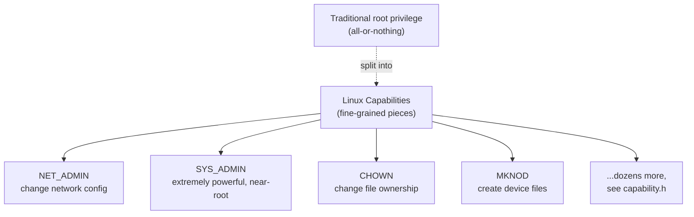

```bash
docker run --user --cap-drop=ALL --cap-add=NET_BIND_SERVICE nginx
```

> [!important] The principle demonstrated by the deck's own example command
> **[EXTRA]** `--cap-drop=ALL` strips every single Linux capability from the container's root user first - reducing it to a genuinely powerless "root in name only." `--cap-add=NET_BIND_SERVICE` then adds back exactly ONE narrow capability - specifically, the ability to bind to privileged ports below 1024 (which nginx genuinely needs to listen on port 80). This is the principle of least privilege applied directly to container root: rather than trusting the container's default (risky) capability set, explicitly start from nothing and grant back only the exact, minimal set of capabilities the specific application genuinely requires - nothing more.

**[EXTRA]** The deck names `SYS_ADMIN` as "extremely powerful" without elaborating why it's specifically called out this way, worth making explicit: `SYS_ADMIN` is often described as "the new root" among capabilities - it bundles a huge number of sensitive operations (mounting filesystems, modifying namespaces, and more) into one single capability, making it functionally close to full root even after other capabilities have been dropped. It should be treated as a major red flag if any container genuinely requests it, and almost never actually needed by ordinary application containers.

### Self-Check Q and A

1. **Q: In `docker run --cap-drop=ALL --cap-add=NET_BIND_SERVICE nginx`, why is dropping ALL capabilities first and adding back exactly one better security practice than simply leaving Docker's default capability set in place?**
   A: **[EXTRA]** Docker's default capability set grants a container root user several capabilities it likely never needs for its specific job, widening the potential blast radius if that process is ever compromised. Starting from zero and adding back only the one narrow capability the application genuinely requires (here, binding to a privileged port) follows least-privilege - even a fully compromised process inside that container has no other capabilities to abuse beyond that single narrow permission.
2. **Q: Why does the deck single out `SYS_ADMIN` specifically as "extremely powerful" compared to the other three listed capabilities?**
   A: **[EXTRA]** `SYS_ADMIN` bundles together a very broad set of sensitive kernel-level operations (including namespace and mount manipulation) into one capability, making it functionally close to full root privilege even in an otherwise capability-dropped container - it's often referred to informally as "the new root" precisely because granting it can undo most of the benefit of dropping every other capability.

---

# 20 - Docker Security - Image Level

> [!quote] Deck's content
> Docker Scout Image Scanning. https://docs.docker.com/scout/

**[EXTRA]** The deck names Docker Scout with just a link, without explaining what image scanning actually does or why the earlier trust-tier discussion (Official/Verified/Marketplace images) doesn't make scanning optional. Image scanning tools analyze an image's layers against known vulnerability databases (CVE databases) to surface outdated packages or known-vulnerable dependencies baked into the image - genuinely necessary even for a trusted Official base image, since new CVEs are discovered continuously after an image was originally built and pushed, and your own application's added layers (npm/pip packages, OS packages installed via `RUN apt-get install`) are never covered by the base image's own original trust tier at all.

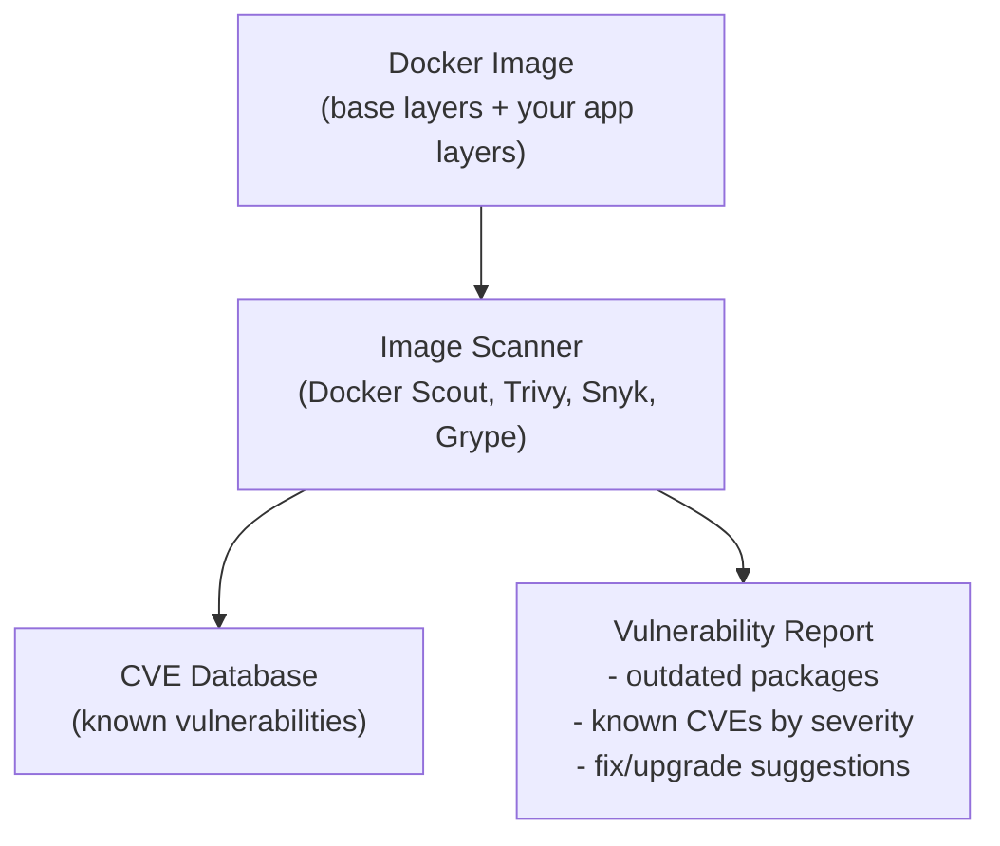

**[EXTRA]** Docker Scout is not the only tool in this category - genuinely relevant alternatives worth knowing for CI pipeline integration:

| Tool | Notes |
|---|---|
| Docker Scout | Docker's own native scanning, integrated into `docker` CLI and Docker Hub |
| Trivy | Open source, widely used in CI pipelines, scans images/filesystems/IaC configs |
| Snyk Container | Commercial, deep integration with developer workflows and PR checks |
| Grype | Open source, fast, from the makers of Syft (SBOM generation) |

```bash
docker scout cves myimage:latest      # example Docker Scout usage
trivy image myimage:latest              # equivalent scan using Trivy
```

### Self-Check Q and A

1. **Q: A team only ever builds on top of Docker Official base images and assumes this alone makes scanning unnecessary. Why is this assumption wrong?**
   A: **[EXTRA]** An Official base image's trust tier reflects Docker's review of the base at the time it was published - it says nothing about vulnerabilities discovered AFTER that publish date, nor does it cover anything the team's own Dockerfile adds on top (application dependencies via npm/pip, additional OS packages via `apt-get install`). Scanning is necessary regardless of base image trust tier because new CVEs are discovered continuously and because your own added layers are entirely outside the base image's original review.

---

# 21 - Running Docker Tasks in CI

> [!quote] Deck's content
> CI Continuous Integration Pipelines: to build Docker images for your application, to run integration tests in isolated containers, to ensure builds are reproducible everywhere.

> [!quote] Deck's speaker notes
> If your deployment platform uses containers (Kubernetes, ECS, EKS, Azure ACI, App Engine, Cloud Run...), your CI pipeline must produce a Docker image. CI runners themselves aren't usually container hosts, so they must use Docker to: build images (`docker build .`), tag them (`docker tag app:latest registry/app:v1`), push them (`docker push registry/app:v1`). Even if you don't deploy with Docker, many teams package apps as images for consistency. Some tests require dependent services: Postgres, Redis, Localstack, Elasticsearch, RabbitMQ. Instead of installing them on every CI agent, CI runs them as containers.

```mermaid
graph LR
    Code["Code pushed / PR opened"] --> CI["CI Pipeline triggered"]
    CI --> Build["docker build ."]
    Build --> Test["Run integration tests\nagainst dependent service containers\n(Postgres, Redis, etc)"]
    Test --> Tag["docker tag app:latest registry/app:v1"]
    Tag --> Push["docker push registry/app:v1"]
    Push --> Deploy["Deployed to Kubernetes/ECS/EKS/etc"]
```

> [!important] The deck's key insight: "CI runners themselves aren't usually container hosts"
> **[EXTRA]** This is worth expanding, since it directly sets up the next two sections (mounting the Docker socket, DinD). A typical CI agent (a Jenkins worker, a GitHub Actions runner) is just a regular machine - it does not automatically have Docker's build/run capabilities available inside whatever job is executing unless that capability is specifically wired up. This is exactly the practical problem the deck's next two sections (socket mounting versus Docker-in-Docker) exist to solve: how does a CI job that itself might be running inside a container get access to genuine Docker build/run functionality?

### Self-Check Q and A

1. **Q: Why does the deck state that even teams who don't deploy their application using Docker/containers in production might still build a Docker image as part of their CI pipeline?**
   A: For consistency and reproducibility - packaging the application as an image guarantees the exact same artifact (with all its dependencies frozen) is what gets tested in CI and what would be deployed, even if the actual production deployment mechanism doesn't ultimately run that image as a container. It's also common to use disposable containers for dependent test services (Postgres, Redis) regardless of the production deployment model, since spinning up isolated service containers for integration tests is far faster and cleaner than installing those services directly on every CI agent.

---

# 22 - Mount Docker Socket

> [!quote] Deck's content
> TRY 1: Install FULL Docker inside your Jenkins. TRY 2: Install only the client and use the host Docker socket.

```mermaid
graph TD
    subgraph Try1["Try 1: Full Docker inside Jenkins container"]
        JenkinsC1["Jenkins container"] --> FullDaemon["Full Docker daemon\nrunning INSIDE Jenkins"]
        FullDaemon -.->|"complex, heavy,\nleads into DinD territory"| Issues1["Genuinely its own\nrabbit hole - next section"]
    end
    subgraph Try2["Try 2: Docker client + mounted host socket"]
        JenkinsC2["Jenkins container"] --> ClientOnly["Docker CLIENT only\n(no daemon inside)"]
        ClientOnly -->|"talks to, via mounted socket:\n/var/run/docker.sock"| HostDaemon["HOST's actual Docker daemon"]
    end
```

```bash
docker container run -v /var/run/docker.sock:/var/run/docker.sock ... jenkins
```

**[EXTRA]** The deck names "Try 2" but doesn't spell out the actual mount syntax or the mechanism, worth completing directly: the Docker daemon exposes its API over a Unix socket file at `/var/run/docker.sock` on the host. Bind-mounting that exact socket file INTO a container (via `-v /var/run/docker.sock:/var/run/docker.sock`) lets a Docker CLIENT running inside that container talk directly to the HOST's own Docker daemon, as if it were running natively on the host - the container issuing `docker build` commands is not running its own separate daemon at all; every container it builds or runs is actually created by, and visible to, the host's Docker daemon, as a sibling of the Jenkins container itself, not a nested child inside it.

> [!warning] Mounting the Docker socket is a significant security tradeoff, genuinely worth stating explicitly
> **[EXTRA]** Any process with access to `/var/run/docker.sock` effectively has root-equivalent control over the ENTIRE host Docker daemon - it can create, inspect, or destroy any container on the host, including containers completely unrelated to the CI job itself, and can trivially escape to full host root by simply running a privileged container that bind-mounts the host's root filesystem. Mounting the socket into a CI container is a well-known, widely-used pattern (exactly what the deck's "Try 2" describes), but it should be treated as granting that CI job effective host-root-equivalent access, not a sandboxed capability.

### Self-Check Q and A

1. **Q: When a Jenkins container mounts the host's Docker socket and runs `docker build`, is the resulting image built by a Docker daemon running inside the Jenkins container itself?**
   A: No - the Jenkins container only has the Docker CLIENT installed; every command it issues is sent, via the mounted socket file, to the HOST's own Docker daemon, which does the actual building. Any containers or images created this way are managed by and visible to the host daemon directly, as siblings of the Jenkins container, not nested inside it.
2. **Q: Why is mounting `/var/run/docker.sock` into a CI container considered a meaningful security tradeoff rather than a free convenience?**
   A: **[EXTRA]** Access to that socket is effectively equivalent to root access on the host - a process with socket access can run an arbitrary privileged container that mounts the host's own root filesystem, achieving genuine host root, or interfere with any other container on that host regardless of the CI job's own intended scope.

---

# 23 - Docker in Docker (DIND)

> [!quote] Deck's content
> Running a Docker daemon inside a Docker container, so that the container can build and run other containers without using the host Docker engine.

```mermaid
graph TD
    subgraph HostLevel["Host"]
        HostDaemon["Host Docker daemon"] --> OuterC["Outer container\n(e.g. Jenkins)"]
    end
    subgraph DinD["Inside the outer container"]
        OuterC --> InnerDaemon["A SEPARATE, genuinely independent\nDocker daemon running INSIDE it"]
        InnerDaemon --> NestedC["Containers built/run by\nTHIS inner daemon -\ntruly nested, isolated from\nthe host daemon entirely"]
    end
```

**[EXTRA]** Contrasting DinD directly against the previous section's socket-mounting approach, since the deck presents them back to back as "Try 1" versus "Try 2" without an explicit side-by-side comparison:

| | Socket mounting | Docker in Docker (DinD) |
|---|---|---|
| Daemon used | The HOST's actual daemon, shared | A genuinely separate, independent daemon running inside the container |
| Containers built are visible to | The host, as siblings alongside the CI container | Only inside the DinD container itself - fully isolated from the host's own container list |
| Security exposure | Effectively host-root-equivalent access via the socket | Requires the outer container to run in `--privileged` mode, which is its own significant security exposure |
| Complexity | Simpler - no nested daemon to manage | More complex - a full daemon running inside a container, with its own storage/networking concerns |

> [!important] Why DinD generally requires `--privileged` mode
> **[EXTRA]** Running a genuine Docker daemon inside a container requires kernel capabilities that go well beyond a typical container's default permission set - namespace and cgroup manipulation, device access, and more - which in practice usually means running the outer container in `--privileged` mode (effectively disabling most of the container's own security isolation from the host). This trades one security concern (the socket-mounting approach's host-root-equivalent access) for a different one (a privileged container with broad kernel access) - the deck's own two "Try" options are genuinely both real tradeoffs, not a clearly superior/inferior pair.

### Self-Check Q and A

1. **Q: A container built and run via Docker-in-Docker inside a Jenkins pipeline - does that container show up in `docker container ls` run directly on the host machine?**
   A: No - the DinD daemon running inside the outer container is a genuinely separate, independent daemon, managing its own containers entirely within its own scope. Those inner containers are invisible to the host's own Docker daemon and would not appear in a `docker container ls` run on the host itself, unlike containers built via the socket-mounting approach, which ARE the host daemon's own containers.
2. **Q: Why can't Docker-in-Docker typically run with a container's normal default permissions, unlike most application containers?**
   A: **[EXTRA]** Running an actual Docker daemon requires deep kernel-level capabilities (namespace/cgroup management, device access) well beyond what a standard container's default capability set and isolation model allow - in practice this usually requires `--privileged` mode, which removes most of the container's own isolation from the host kernel, itself a significant security tradeoff.

---

# 24 - Docker Compose

> [!quote] Deck's content
> `docker-compose.yaml`. Version 1, Version 2, Version 3.

| | Version 1 | Version 2 | Version 3 |
|---|---|---|---|
| Networking | Use only default network bridge, you cannot add dependency | Create a dedicated network for each stack; you can define your own networks and assign containers to them | Same networking capability as v2, plus Swarm support |
| Dependency support | You can't add dependency | (implied improvement over v1) | Full support |
| Orchestration | No | No | Supports Docker Swarm |

> [!important] Correction/clarification - Compose file versioning is now largely legacy
> **[EXTRA]** The deck's version comparison reflects the historical evolution of the `docker-compose.yaml` format, but current Docker Compose (the `docker compose` CLI plugin, note the space rather than hyphen) has moved to the "Compose Specification," where the top-level `version:` key is now considered obsolete/optional - modern Compose simply reads whatever schema is present without requiring an explicit version declaration, and the CLI has effectively unified the version 2/3 feature set. Understanding the v1/v2/v3 history the deck teaches is still useful for reading older `docker-compose.yaml` files in existing projects, but new files written today typically omit the `version:` key entirely.

```mermaid
graph TD
    V1["Version 1\ndefault bridge only,\nno dependency support"] --> V2["Version 2\ndedicated per-stack network,\ncustom networks"]
    V2 --> V3["Version 3\nsame networking as v2,\nplus Swarm support"]
    V3 -.->|"modern practice"| Spec["Compose Specification\n(no version key needed)"]
```

**[EXTRA]** The deck names the three versions without ever showing a complete example file - filling that gap with a realistic multi-service compose file tying together several concepts already covered in this note (networks, volumes, environment):

```yaml
services:
  web:
    build: .
    ports:
      - "3000:3000"
    environment:
      - DATABASE_URL=postgres://user:pass@db:5432/appdb
    depends_on:
      - db
    networks:
      - appnet

  db:
    image: postgres:16
    volumes:
      - dbdata:/var/lib/postgresql/data
    environment:
      - POSTGRES_PASSWORD=pass
      - POSTGRES_DB=appdb
    networks:
      - appnet

volumes:
  dbdata:

networks:
  appnet:
```

### Self-Check Q and A

1. **Q: You open a `docker-compose.yaml` file for an older project and see `version: '3.8'` at the top, but a brand-new project's compose file has no version key at all. Is the newer file broken or missing something?**
   A: **[EXTRA]** No - modern Docker Compose has moved to the Compose Specification, where the version key is optional/obsolete. Omitting it is the current recommended practice; the older file's explicit version declaration reflects the format's earlier, versioned history that the deck's own v1/v2/v3 comparison describes.
2. **Q: In the example compose file above, why does the `web` service's `DATABASE_URL` reference the hostname `db` rather than an IP address?**
   A: **[EXTRA]** Compose automatically creates a private network (`appnet` here) and registers each service's name as a resolvable DNS hostname within it - `db` resolves to the database container's address on that shared network, the same container-name-based resolution the deck's own networking section described for the default bridge network, just scoped to this Compose-managed network instead.

## Docker Compose Commands

> [!quote] Deck's content
> `docker compose up`, `docker compose stop`, `docker compose down`, `docker compose ps`, `docker compose logs`, `docker compose top`.

```bash
docker compose up          # create and start every service defined in the compose file
docker compose up -d         # same, but detached (background)
docker compose stop            # stop all services, but keep containers/networks/volumes intact
docker compose down              # stop AND remove containers/networks created by up (volumes kept unless -v is added)
docker compose ps                  # list the status of this project's services
docker compose logs                  # view logs from all services
docker compose logs -f                 # follow logs live, across all services
docker compose top                       # list running processes per service, like docker container top for the whole stack
```

> [!important] `stop` versus `down` - directly parallel to the earlier container-level distinction
> **[EXTRA]** This mirrors the deck's own earlier `docker container stop` versus `rm` distinction, applied at the whole-stack level: `stop` halts every service's containers but leaves them (and the networks/volumes Compose created) in place, ready to be restarted quickly with `docker compose start`. `down` goes further and actually removes the containers and networks entirely (though named volumes persist by default unless you explicitly add the `-v` flag) - `down` is the command to use when you want a genuinely clean slate, `stop` when you just want to pause everything temporarily.

### Self-Check Q and A

1. **Q: After running `docker compose down`, does the database's persisted data (stored in a named volume) get deleted along with the containers?**
   A: **[EXTRA]** No, not by default - named volumes persist even after `docker compose down` removes the containers and networks. The data would only be deleted if `docker compose down -v` is run explicitly, with the `-v` flag specifically requesting volume removal as well.

---

# 25 - Docker Swarm

> [!quote] Deck's content
> With Docker you create one instance of an application. Spike? Container Orchestration (multi Docker host). Consists of tools and scripts that help deploy containers in a production environment.

```mermaid
graph TD
    Single["Plain docker container run"] --> OneInstance["One instance,\non ONE host"]
    OneInstance -.->|"traffic spike -\nwhat now?"| Problem["No automatic scaling,\nno multi-host distribution,\nsingle point of failure"]
    Swarm["Docker Swarm"] --> MultiHost["Multiple Docker hosts,\ntreated as one cluster"]
    MultiHost --> Services["Services scaled across\nmultiple replicas/nodes"]
```

> [!important] The deck's own posed question ("Spike?") is the entire motivation for orchestration
> **[EXTRA]** This connects directly back to the deck's very first section (why you need Docker at all) and to the Kubernetes-style orchestration concepts covered in a separate note: a single `docker container run` gives you exactly one instance of an application on exactly one host - if traffic spikes beyond what that one instance/host can handle, or if that one host fails entirely, there is no built-in mechanism to add more instances or reschedule elsewhere. Docker Swarm (and, at a much larger and more capable scale, Kubernetes) exists specifically to solve this: treating a pool of multiple Docker hosts as one logical cluster, and providing tooling to deploy, scale, and reschedule containers ("services" in Swarm terminology) across that pool automatically.

**[EXTRA]** The deck introduces Swarm as a closing topic without commands or a worked example, since the deck ends here. Worth noting for anyone continuing past this deck: Docker Swarm and Kubernetes solve the same fundamental problem (multi-host container orchestration) with different tradeoffs - Swarm is built directly into the Docker CLI (`docker swarm init`, `docker service create`) and is genuinely simpler to get started with, while Kubernetes has become the dominant industry-standard orchestrator with a much larger ecosystem, steeper learning curve, and far more configuration surface. For anyone pursuing DevOps/cloud roles, Kubernetes is generally the more directly employable skill, though understanding Swarm's simpler model is a reasonable stepping stone toward it.

### Self-Check Q and A

1. **Q: A single container running an application experiences a sudden traffic spike that exceeds what its one host machine can handle. What does plain Docker (without Swarm or another orchestrator) do about this automatically?**
   A: Nothing - a single `docker container run` invocation has no built-in awareness of load, no automatic scaling, and no mechanism to add capacity or move to a different host. This exact gap - the deck's own "Spike?" question - is precisely the problem container orchestration tools like Docker Swarm (or Kubernetes) are built to solve.
2. **Q: What's the fundamental capability Docker Swarm adds that plain `docker container run` commands, no matter how many you issue by hand, cannot replicate?**
   A: **[EXTRA]** Treating multiple separate Docker hosts as one unified logical cluster, with built-in scheduling, scaling, and rescheduling logic - Swarm decides WHICH host a given container instance runs on and can automatically react to failures or scaling needs across that whole pool, something manually issuing individual `docker run` commands on individually-chosen hosts cannot do.

---

# Master Recap Diagram

```mermaid
graph TD
    Why["Why Docker: compatibility, setup time, DEV/TEST/PROD drift"] --> VMvsC["VM vs Container:\nfull guest kernel vs shared host kernel"]
    VMvsC --> ImgContainer["Image (template) to Container (running instance)"]
    ImgContainer --> Registry["Registry: Docker Hub, ECR - Official/Verified/Marketplace trust tiers"]
    ImgContainer --> Dockerfile["Dockerfile: FROM, RUN, COPY, ENTRYPOINT -\nlayered + cached, ordered for cache efficiency"]
    Dockerfile --> MultiStage["Multi-stage builds: tiny final image,\nbuild tools discarded"]
    ImgContainer --> Ops["Container/Image lifecycle commands:\ncreate/run/exec/stop/kill/logs/inspect"]
    Ops --> Storage["Volumes: Docker-managed vs bind mounts"]
    Ops --> Net["Networks: bridge/host/none"]
    Ops --> Security["Security: cgroups resource limits,\nroot confinement, capabilities, image scanning"]
    Security --> CI["CI usage: socket mount vs DinD tradeoffs"]
    CI --> Compose["Docker Compose: multi-service local orchestration"]
    Compose --> Swarm["Docker Swarm: multi-host production orchestration"]
```

# Rapid-Fire Interview Bank

- Why Docker over plain VMs? Shared host kernel means lighter weight, faster boot, lower overhead - VMs boot a full independent guest kernel.
- Image versus container? Static read-only template versus a running, isolated instance created from it.
- attach versus exec? Connects to the container's own PID 1 (risky Ctrl-C) versus spawns a new separate process inside (safe to exit).
- stop versus kill? Graceful SIGTERM with a grace period versus immediate SIGKILL, no cleanup chance.
- Volume mount versus bind mount? Docker-managed storage location, portable, versus an exact host path you specify, great for local dev live-editing.
- bridge versus host versus none network? Isolated internal network with port mapping versus full host network sharing (no isolation) versus zero network access.
- Why drop all capabilities and add back only what's needed? Least privilege - default container root has more power than most applications actually require.
- COPY versus ADD? COPY is a plain, predictable file copy; ADD has implicit extra behavior (tar extraction, URL fetch) that can surprise readers.
- Why does layer/build order matter? Docker caches each layer; changing an earlier instruction invalidates every layer after it - put rarely-changing steps first.
- Multi-stage build payoff? Final image contains only what's copied from the build stage, none of the build toolchain - smaller, more secure image.
- Socket mounting versus Docker-in-Docker for CI? Host-root-equivalent socket access versus a genuinely separate nested daemon requiring privileged mode - both are real security tradeoffs, not a clean win/lose pair.
- Docker Compose versus Docker Swarm? Multi-container orchestration on ONE host versus multi-HOST orchestration across a cluster.

# Self-Assessment - Can You Explain These Without Notes

- [ ] Why a container shares the host kernel but a VM does not, and the practical consequence for size/boot time
- [ ] The image-to-container relationship, using the deck's own ISO analogy
- [ ] Why `:latest` is a dangerous tag to rely on in production
- [ ] The attach-versus-exec distinction, with a concrete risk scenario
- [ ] How Docker's layer caching actually decides what to rebuild, and why instruction order matters
- [ ] The answer to the deck's own unresolved "what is the issue" question about apt-get update/install caching
- [ ] Why EXPOSE alone does not publish a port
- [ ] What a multi-stage build's final image does and does not contain
- [ ] The real difference between a volume mount and a bind mount, and when to use each
- [ ] Why root inside a container is not equivalent to root on the host, and the one real caveat to that
- [ ] What Linux capabilities are, and why `--cap-drop=ALL --cap-add=<specific>` is best practice
- [ ] The security tradeoff of mounting the Docker socket into a CI container
- [ ] Why Docker Swarm/orchestration exists at all, tied back to the deck's own "Spike?" question