# ☸️ Kubernetes — Day 1: Foundations

> [!info] Scope
> Containers → orchestration · cluster architecture · distributions · `kubectl` · namespaces · labels & selectors · Pods (lifecycle, failure states, env/command/args) · ReplicaSets & Deployments.
>
> [!warning] One heads-up
> Per the actual ITI course roadmap, **ReplicaSets & Deployments (section 09 below) are technically Day 2 content** ("Workloads & networking"), not Day 1 ("Foundations & first contact"). Included here as one consolidated note — easy to split out if you want a strict 1:1 match with the course's day boundaries.

## 🗺️ Where this sits in the course

| Day | Theme | Covered here? |
|---|---|---|
| **1** | Foundations & first contact | ✅ Sections 01–08 |
| **2** | Workloads & networking | ⚠️ Section 09 only (ReplicaSets/Deployments) — rest lives in a separate Day 2 note |
| 3 | Configuration, storage & health | Separate note |
| 4 | Scheduling, scale & production | Not yet built |

---

# 01 · The Old Way — Why We Need an Orchestrator

## Three eras

| Era | Isolation | Weakness |
|---|---|---|
| Bare metal | None — apps share OS | Snowflake servers, drift, waste |
| Virtual Machines | Full guest OS per app | Heavy — 3 apps = 3 booted OSes |
| Containers | namespaces + cgroups | Still **one process, one host** — nobody restarts it when it dies |

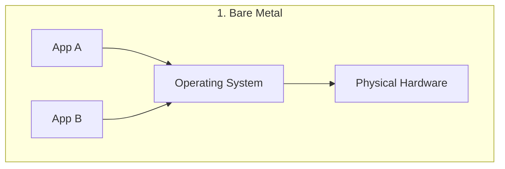

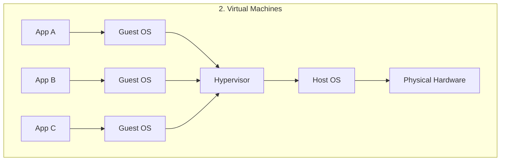

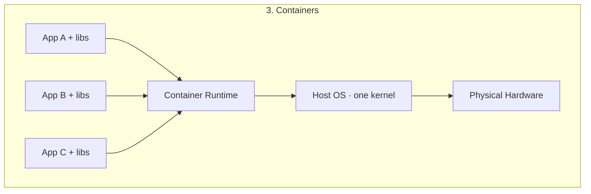

> [!tip] Docker Compose was the first taste of "desired state"
> `docker compose up -d` reconciles reality to a YAML file. But it's **single-host only** — the ceiling Kubernetes exists to break through.

### Where Compose stops

| Problem | Why Compose can't solve it |
|---|---|
| Host dies | Every container dies with it — nothing reschedules elsewhere |
| Traffic spike | Can `scale` on one box, then you run out of box |
| Zero-downtime release | Compose just restarts — no rolling strategy |
| Many machines | Nothing decides placement or reshuffles on node death |

### 🤔 Self-Check Q&A

1. **Q: Why is a container fundamentally different from a VM in terms of isolation?**
   A: Containers share the host kernel and are isolated via Linux namespaces + cgroups (fast, lightweight). VMs virtualize hardware and boot a full separate guest OS per app (strong isolation, heavy resource cost).
2. **Q: What single architectural assumption does Docker Compose make that Kubernetes removes?**
   A: That everything runs on **one host**. Kubernetes treats many nodes as one pool.
3. **Q: A container crashes under plain `docker run`. What restarts it?**
   A: Nothing, unless you set a `--restart` policy — and even then, only on that same host. There's no cross-host rescheduling without an orchestrator.

---

# 02 · Why Kubernetes — The Control Loop

Kubernetes = **you declare desired state → controllers continuously reconcile actual state toward it, forever.**

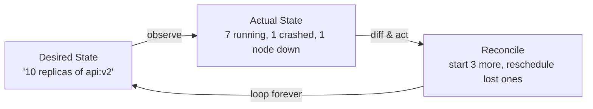

## Compose vs Kubernetes

| Concern | Docker Compose | Kubernetes |
|---|---|---|
| Scope | One host | Many nodes as one pool |
| Container dies | Optional restart, same host | Rescheduled anywhere, automatically |
| Scaling | `--scale` on one box | Replicas across nodes; autoscaling |
| Releases | Recreate containers | Rolling updates + instant rollback |
| Networking | One bridge network | Cluster-wide Services + DNS + Ingress |
| Best for | Local dev | **Production** at scale, HA |

> [!info] They're friends, not rivals
> You often use Compose on your laptop and Kubernetes in production — same images, bigger stage.

### 🤔 Self-Check Q&A

1. **Q: In the reconciliation loop, who writes `spec` and who writes `status`?**
   A: You (the human) write `spec` — the desired state. Controllers write `status` — the observed state. You never hand-edit `status`.
2. **Q: Is the reconciliation loop a one-time action or continuous?**
   A: Continuous, forever — "↻ forever." It never stops comparing desired vs actual.
3. **Q: Kubernetes and Docker Compose both use declarative YAML. What actually separates them in production?**
   A: Scope and automation depth — Compose reconciles one host; Kubernetes reconciles a fleet, reschedules across node failures, and adds rolling updates, autoscaling, and cluster-wide service discovery that Compose has no concept of.

---

# 03 · Cluster Architecture

## 🎯 Control Plane vs Worker Nodes

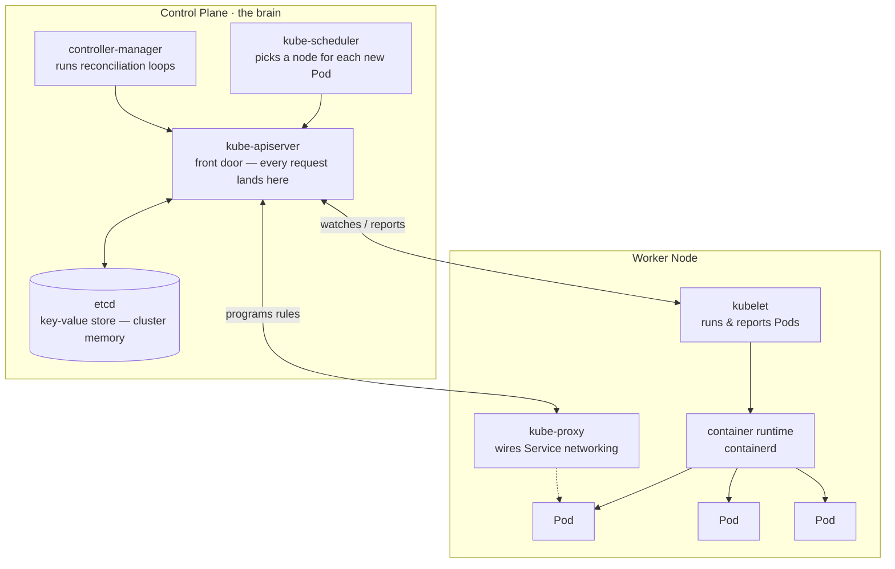

> [!info] Mental model
> Control plane **decides**. kubelet **does**. kube-proxy **connects**. Runtime **runs**.

## Component responsibilities

| Component | Job |
|---|---|
| **kube-apiserver** | The ONLY component everyone talks to. Validates, reads/writes etcd. |
| **etcd** | Consistent KV store — the entire cluster's state. Lose it, lose the cluster. |
| **kube-scheduler** | Watches unscheduled Pods, picks best-fit node. |
| **controller-manager** | Runs reconciliation loops (Deployment, ReplicaSet, Node controllers). |
| **kubelet** | Node agent — starts containers per spec, reports status. Node is `NotReady` if kubelet is down. |
| **kube-proxy** | Programs node network rules so Service traffic reaches the right Pods. |
| **container runtime** | containerd/CRI-O — actually pulls images and runs containers. |

## What happens on `kubectl apply` — full request flow

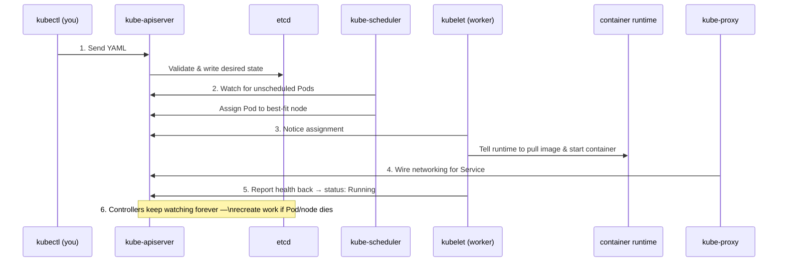

## The Object Model — every object, same 5 fields

```yaml
apiVersion: apps/v1        # which API group + version
kind: Deployment            # what type of object
metadata:                   # who am I (name, namespace, labels)
  name: vote
  namespace: vote
spec:                        # what I WANT (you write this)
  replicas: 3
status:                       # what IS (the cluster writes this)
  readyReplicas: 3
```

## Resource hierarchy / ownership chain

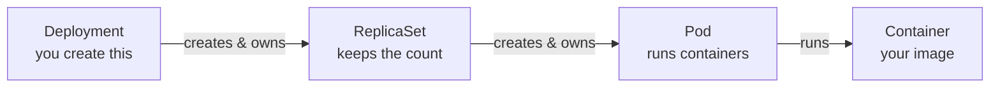

> [!important] Ownership & garbage collection
> Each object stores its parent in `metadata.ownerReferences`. Delete the parent → GC deletes the children. That's why deleting a Deployment removes its Pods. Other chains: `Service → Endpoints`, `PVC → PV`, `CronJob → Job → Pod`, `HPA → Deployment`.

| Scope | Examples | `-n` flag |
|---|---|---|
| **Namespaced** | Pod, Service, Deployment, ConfigMap, Secret, PVC | Required |
| **Cluster-scoped** | Node, Namespace, PersistentVolume, StorageClass, ClusterRole | Ignored |

### 🤔 Self-Check Q&A

1. **Q: If the api-server is unreachable, can the scheduler still assign Pods?**
   A: No. The api-server is the front door for everything — even control-plane components talk to each other **through** it, never directly.
2. **Q: You delete a Deployment. Why do its Pods disappear too?**
   A: Garbage collection follows `ownerReferences`. Pods are created and owned by the ReplicaSet (owned by the Deployment) — deleting the top of the chain cascades down.
3. **Q: Why does `kubectl get nodes -n vote` return all nodes, ignoring `-n vote`?**
   A: Node is a cluster-scoped resource type — the namespace flag is silently ignored for cluster-scoped kinds.
4. **Q: What actually happens to a control-plane Pod (like kube-scheduler) if you delete it manually?**
   A: The control-plane node's own kubelet — which runs static Pods for api-server, etcd, scheduler, and controller-manager — recreates it immediately. The brain heals itself the same way workloads do.

> [!example] 🎨 MANUAL EXCALIDRAW REQUIRED: Full Multi-Node Cluster Topology
> **Instructions for what I need to draw:**
> - Step 1: Draw a dashed boundary box labeled "Cluster". Inside it, draw 3 small rounded boxes at the top labeled "Control Plane Node 1/2/3" (for HA) — each containing tiny icons for api-server, etcd, scheduler, controller-manager.
> - Step 2: Below, draw 4-6 larger boxes labeled "Worker Node 1..N" — each containing several small "Pod" boxes (3-4 per node), plus a kubelet icon and kube-proxy icon docked to the node boundary.
> - Step 3: Draw a "Load Balancer" shape above the 3 control-plane nodes, with arrows down into each — label it "kubectl / external clients hit the LB, which spreads across api-servers".
> - Step 4: Connect every worker node's kubelet with a dashed line back to the LB (representing the watch/report connection to whichever api-server answers).
> - Step 5: Label the etcd boxes with a small padlock icon and text "Back this up — lose it, lose the cluster."

---

# 04 · Distributions

| Distribution | You operate | Footprint | Best for |
|---|---|---|---|
| **kubeadm** | Everything (CP + nodes) | Full | Learning internals, on-prem, exams |
| **k3s** | Everything, tiny | <40MB | Edge, IoT, CI, homelab |
| **EKS** | Only worker nodes | Cloud | Production on AWS, SLA |

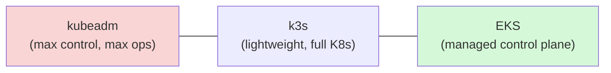

> [!tip] Portability payoff
> The **same YAML manifests** deploy unchanged on all three. Learn once, run anywhere.

### 🤔 Self-Check Q&A

1. **Q: For the AWS Cloud Architect / DevOps roles you're targeting, which distribution model mirrors what you'd operate day-to-day in production?**
   A: EKS — AWS runs the control plane; you manage worker nodes, networking, and workloads. This is the "least ops, most managed" end of the spectrum.
2. **Q: Why would you never use k3s for a CKA exam prep environment if you specifically want to learn control-plane internals?**
   A: k3s trims and bundles components for simplicity (e.g., SQLite instead of etcd by default, bundled Traefik). kubeadm gives you the raw, standard component set to inspect and reason about.
3. **Q: What's the actual trade-off you're making by choosing EKS over kubeadm on your own EC2 fleet?**
   A: You give up control over control-plane internals (you can't SSH into an EKS control-plane node or inspect its etcd directly) in exchange for an SLA, managed upgrades, and no operational burden for the hardest part of the cluster to run reliably.

```bash
# Install kind, kubectl & Docker on Ubuntu 22.04+ VPS
curl -fsSL https://get.docker.com | sh          # Docker — kind runs nodes as containers
sudo usermod -aG docker $USER && newgrp docker  # avoid re-login for docker group

curl -LO "https://dl.k8s.io/release/$(curl -Ls https://dl.k8s.io/release/stable.txt)/bin/linux/amd64/kubectl"
sudo install -m0755 kubectl /usr/local/bin/kubectl   # install kubectl binary

curl -Lo kind https://kind.sigs.k8s.io/dl/v0.24.0/kind-linux-amd64  # pin kind version for reproducibility
sudo install -m0755 kind /usr/local/bin/kind

kind version && kubectl version --client
```

```bash
# Create a 3-node kind cluster with port mappings
cat > kind.yaml <<'EOF'
kind: Cluster
apiVersion: kind.x-k8s.io/v1alpha4
nodes:
- role: control-plane
  kubeadmConfigPatches:
  - |
    kind: InitConfiguration
    nodeRegistration:
      kubeletExtraArgs: {node-labels: "ingress-ready=true"}   # lets ingress controller land here
  extraPortMappings:
  - {containerPort: 80,    hostPort: 80}      # Ingress HTTP
  - {containerPort: 443,   hostPort: 443}     # Ingress HTTPS
  - {containerPort: 30080, hostPort: 30080}   # NodePort mapping
- role: worker
- role: worker
EOF

kind create cluster --name iti --config kind.yaml
kubectl get nodes
```

```bash
# Look inside the cluster you built — every architecture box is a real process here
kubectl get pods -n kube-system     # kube-apiserver, etcd, scheduler, controller-manager, coredns, kube-proxy
docker ps --format 'table {{.Names}}\t{{.Image}}'          # the "nodes" are Docker containers
docker exec iti-control-plane crictl ps 2>/dev/null | head  # peek at containers inside a node
kubectl get pods -n kube-system -o wide                     # which node is each system Pod on?
```

---

# 05 · kubectl — The Command Grammar

```
kubectl get pods web-abc123 -n prod -o yaml
   │      │    │      │       │  │
   │      │    │      │       │  └─ output format
   │      │    │      │       └──── namespace
   │      │    │      └──────────── which one (name)
   │      │    └─────────────────── resource type
   │      └──────────────────────── verb
   └─────────────────────────────── the tool (client → api-server)
```

```bash
# --- inspect the cluster ---
kubectl get pods                       # list, add -A for all namespaces
kubectl get pods -o wide               # + node, IP
kubectl get deploy,svc                 # multiple resource types at once
kubectl describe pod web-abc123        # THE debugging command — read Events!
kubectl logs web-abc123 -f             # follow logs, like tail -f
kubectl exec -it web-abc123 -- sh      # shell inside the container

# --- change the cluster (declarative — preferred) ---
kubectl apply -f deployment.yaml       # source of truth = the file
kubectl scale deploy/web --replicas=5  # imperative scale
kubectl rollout status deploy/web      # block until rollout finishes
kubectl rollout undo deploy/web        # instant rollback
kubectl delete -f deployment.yaml
kubectl explain pod.spec.containers    # offline field docs
```

## Imperative vs Declarative

| | Imperative | Declarative |
|---|---|---|
| Style | `kubectl run web --image=nginx` | `kubectl apply -f ./k8s/` |
| Record | None — gone once terminal closes | YAML is source of truth, git-committed |
| Use for | Quick experiments, debugging | Everything beyond a quick test — **default choice**, base of GitOps |

## kubeconfig & contexts

A **context** = cluster + user + namespace.

```bash
kubectl config get-contexts               # which clusters do I know?
kubectl config current-context             # which one am I on RIGHT NOW?
kubectl config use-context eks-prod        # switch clusters
kubectl config set-context --current --namespace=team-a   # default namespace for this context
```

> [!warning] The classic mistake
> Running `delete` against **prod** when you thought you were on **dev**. ALWAYS check `kubectl config current-context` first.

### 🤔 Self-Check Q&A

1. **Q: What are the four "slots" in every kubectl command?**
   A: The tool (`kubectl`), the verb (`get`/`describe`/`apply`/...), the resource type, and name+flags (which one, namespace, output format).
2. **Q: Why is declarative (`apply -f`) considered the foundation of GitOps, while imperative commands are not?**
   A: Declarative YAML is a reviewable, version-controlled source of truth that can be diffed and re-applied — the exact mechanism GitOps pipelines rely on. Imperative commands leave no reproducible record.
3. **Q: You just ran a destructive `kubectl delete` and it hit the wrong cluster. What single command would have prevented this?**
   A: `kubectl config current-context` — check before every destructive command, especially across contexts.
4. **Q: What does `kubectl explain pod.spec.containers` actually give you, and why is it useful offline?**
   A: Field-level API documentation pulled from the cluster's own OpenAPI schema — no internet connection needed, and it's always accurate for the exact API version your cluster is running (unlike searching stale docs online).

---

# 06 · Namespaces — Virtual Sub-Clusters

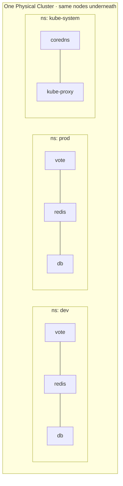

> [!warning] Namespaces are NOT network isolation
> A Pod in `dev` can reach a Service in `prod` by FQDN — nothing stops it. Namespaces scope **names, RBAC, and quota — not packets**. `NetworkPolicy` is what blocks traffic (a Day 4 topic).

| | Namespaced | Cluster-scoped |
|---|---|---|
| Examples | Pod, Service, Deployment, ConfigMap, Secret, PVC, Job | Node, Namespace, PersistentVolume, StorageClass, ClusterRole |
| Name unique... | within its namespace | across the whole cluster |
| `-n` flag | required (defaults to context) | ignored |
| Deleted with namespace? | **Yes — all of them** | No |

> [!tip] `kubectl get all` is a lie
> It shows a handful of common types — NOT Secrets, ConfigMaps, or PVCs. Ask for those by name.

## DNS impact — `<service>.<namespace>.svc.cluster.local`

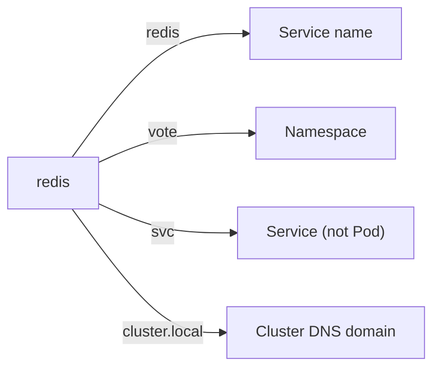

> [!important] The hardcoding trap
> The Voting App hardcodes `Redis(host="redis")`. The Service **must** be named exactly `redis`, same namespace as `vote`. Name it `redis-svc` and it breaks silently — no error you'd recognize.

```bash
kubectl create namespace vote
kubectl config set-context --current --namespace=vote   # stop typing -n vote 200 times

kubectl get pods -A     # -A / --all-namespaces = "where on earth did it go"
```

> [!warning] `kubectl delete namespace vote` deletes EVERYTHING inside it. No undo, no confirmation.

### 🤔 Self-Check Q&A

1. **Q: Are namespaces a security boundary?**
   A: No. They scope names, RBAC, and ResourceQuota — not network traffic. Cross-namespace traffic flows freely until a NetworkPolicy restricts it.
2. **Q: You have `redis` Services in both `dev` and `prod`. From a Pod in `dev`, what happens if you `curl http://redis`?**
   A: It resolves to the `dev` namespace's `redis` Service via the resolver's `search` suffix list — never `prod`'s. Cross-namespace access requires `redis.prod` or the full FQDN.
3. **Q: Why is `default` supposed to be empty in production?**
   A: Namespaces exist to organize and isolate names/RBAC/quota per team or environment. Dumping everything in `default` defeats that purpose and makes access control coarse-grained.
4. **Q: What's the fastest command to find a Pod when you've forgotten which namespace you put it in?**
   A: `kubectl get pods -A` (or `--all-namespaces`) — searches every namespace at once instead of guessing which one to `-n` into.

---

# 07 · Labels & Selectors — The Wiring of Kubernetes

```yaml
metadata:
  labels:
    app: vote            # what it is
    tier: frontend        # where it sits
    env: dev                # which environment
    version: v1               # which release
```

> [!important] Why labels instead of names?
> **Loose coupling.** A Service asks "everything with `app=vote`" and gets today's answer. Pods can be replaced a hundred times and the wiring never changes. Nothing in Kubernetes finds a Pod **by name** — Deployments, Services, ReplicaSets, and NetworkPolicies all find Pods by label.

```bash
# equality-based
kubectl get pods -l app=vote
kubectl get pods -l app=vote,tier=frontend   # AND (there is no OR)
kubectl get pods -l env!=prod

# set-based
kubectl get pods -l 'env in (dev, staging)'
kubectl get pods -l 'app notin (vote)'
kubectl get pods -l app            # key exists
kubectl get pods -l '!app'         # key absent
```

```yaml
# modern objects use matchLabels / matchExpressions
selector:
  matchLabels:
    app: vote
  matchExpressions:
    - key: tier
      operator: In
      values: [frontend, web]
```

## How a selector finds its Pods

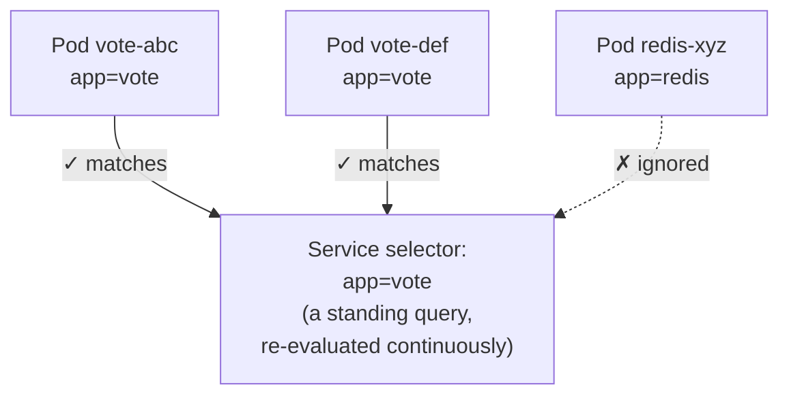

> [!warning] The silent failure
> Typo a label and nothing errors. Service is created, looks healthy, but selects **zero** Pods → every request times out. `kubectl get endpoints <svc>` showing `<none>` is the tell.

## Labels vs Annotations

| | Labels | Annotations |
|---|---|---|
| Purpose | **Identify** and group | **Attach** arbitrary metadata |
| Queryable? | **Yes** — indexed, selectable | **No** — never selectable |
| Size | ≤63 chars, restricted charset | Large — JSON, certs, configs |
| Used by | Services, Deployments, NetworkPolicy | Tools: ingress-nginx, cert-manager, Helm |

```bash
kubectl label pod cache app=web --overwrite   # --overwrite required to change existing label
kubectl label pod web-1 env-                  # trailing dash removes a label
kubectl get pods -L app,env                   # labels promoted to real columns
```

### 🤔 Self-Check Q&A

1. **Q: A Service has `selector: {app: vote}` but zero traffic reaches Pods labeled `app: Vote` (capital V). What's going on and how do you catch it fast?**
   A: Label matching is exact-string, case-sensitive. `kubectl get endpoints <svc>` would show `<none>` — that's the two-second diagnosis for a selector-mismatch problem.
2. **Q: Why can't you `-l app=vote OR app=redis` directly?**
   A: Multiple label terms are always ANDed. Use the set-based syntax instead: `-l 'app in (vote, redis)'`.
3. **Q: You need to record who owns a Deployment for auditing, but never want to query on it. Label or annotation?**
   A: Annotation — it's descriptive metadata for humans/tools, not something you'll ever select on with `-l`.
4. **Q: Why does `kubectl label pod cache app=web` fail without `--overwrite` if the Pod already has an `app` label?**
   A: It's a deliberate guardrail — `kubectl label` refuses to silently clobber an existing key rather than risk an accidental relabel that could reassign a Pod to the wrong controller's selector.

---

# 08 · Pods — The Atom of Kubernetes

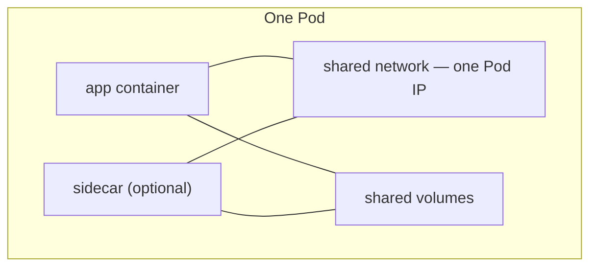

- Scheduled onto a node **as a whole** — never split across nodes.
- One Pod IP shared by all containers.
- **Ephemeral by design** — cattle, not pets. New IP every time.
- When a Pod dies, it's **not restarted in place** — a controller makes a fresh one.

```yaml
apiVersion: v1
kind: Pod
metadata:
  name: web
  labels:
    app: web
spec:
  containers:
    - name: nginx
      image: nginx:1.27
      ports:
        - containerPort: 80
```

## Pod phases (state machine)

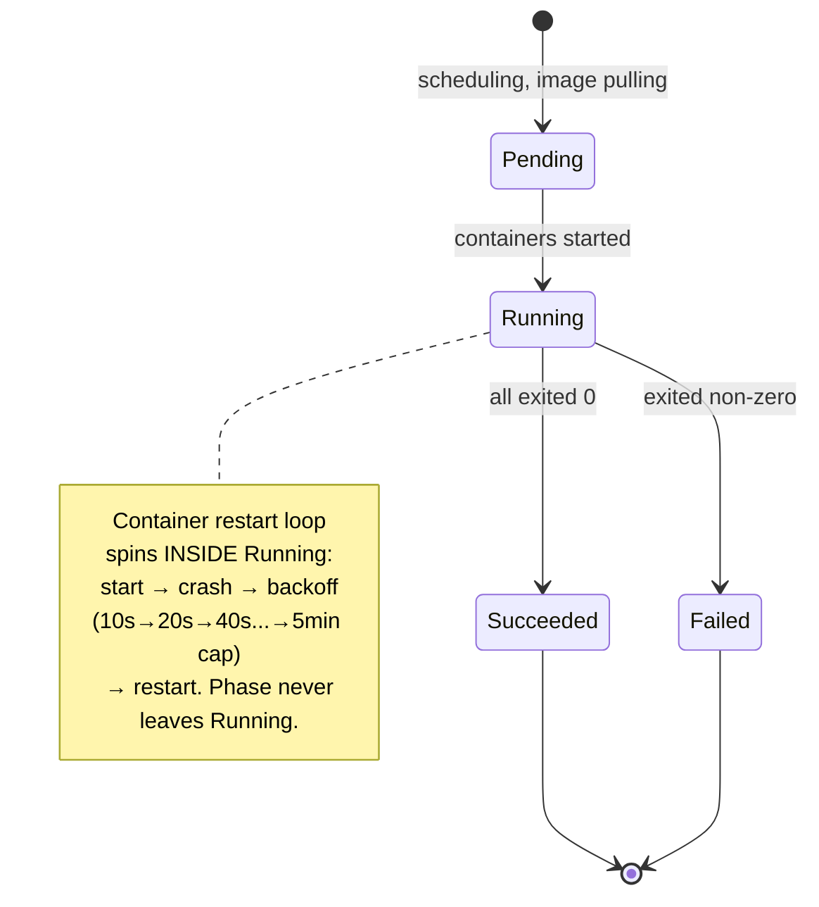

| Phase | Meaning | What to do |
|---|---|---|
| **Pending** | Accepted, not running — scheduling or pulling | `describe`, check Events |
| **Running** | Bound to node, ≥1 container running/starting | Check `READY`, not phase |
| **Succeeded** | All containers exited 0, won't restart | Normal for Jobs, suspicious for a web server |
| **Failed** | All terminated, ≥1 exited non-zero | `logs --previous` |
| **Unknown** | api-server lost contact with node | Node problem — `get nodes` |

> [!warning] READY, not STATUS
> `Running` doesn't mean **working**. Read the `READY` column: `0/1 Running` is up and serving nobody. Kubectl also substitutes friendlier reasons into `STATUS` — `CrashLoopBackOff`, `ImagePullBackOff`, `Terminating`, `Completed` — those are what you'll actually see day to day.

## restartPolicy

| Policy | Restarts when… | Use for |
|---|---|---|
| **Always** (default) | container exits — any code | long-running servers |
| **OnFailure** | exit code non-zero only | Jobs, batch work |
| **Never** | never | one-shot debug Pods |

> [!warning] It restarts CONTAINERS, not Pods
> `restartPolicy` never resurrects a **deleted Pod**. That's what Deployments are for.

## 🚨 Failure states

### CrashLoopBackOff
Container **starts fine and then dies**. Backoff doubles: 10s → 20s → 40s → ... capped at 5 min.

```bash
kubectl describe pod worker      # Last State + Exit Code
kubectl logs worker --previous   # logs of the run that DIED — the real evidence
kubectl get events --sort-by=.lastTimestamp | tail
```

Common causes: missing env var/bad config, dependency not up yet, command exits immediately, wrong command/args, OOMKilled (exit 137).

### ImagePullBackOff / ErrImagePull
Node couldn't fetch the image. **No container ever starts — no logs exist.** `describe` is the only tool that works.

```bash
kubectl describe pod vote | sed -n '/Events/,$p'
docker exec iti-control-plane crictl images | grep iti/     # is it actually on the node?
kind load docker-image iti/vote:v1 --name iti                # the fix for local images
```

Common causes: typo'd tag, tag never pushed, private registry with no `imagePullSecret`, **locally-built image never `kind load`-ed**.

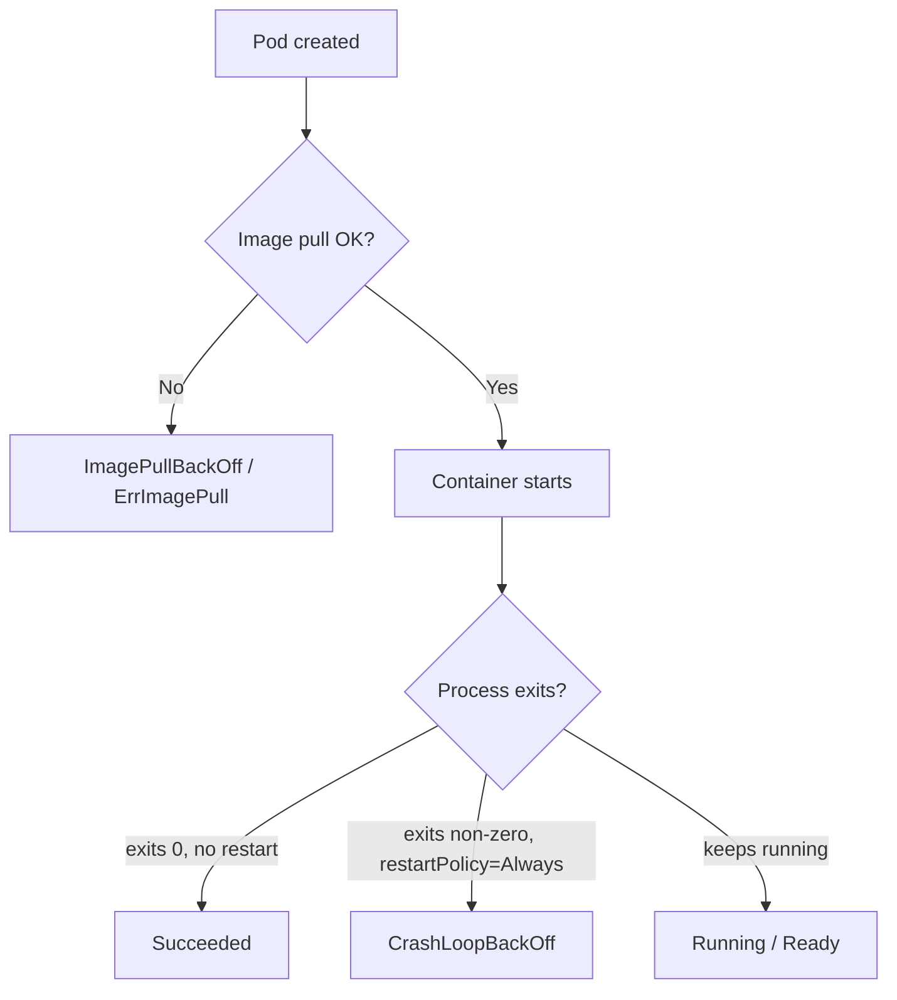

### 🤔 Self-Check Q&A

1. **Q: `kubectl logs broken-pod` returns nothing at all. What does that tell you, and what's your next command?**
   A: No output usually means no container ever started — classic sign of `ImagePullBackOff`. Next: `kubectl describe pod broken-pod` and read the Events tail.
2. **Q: A Pod shows `RESTARTS: 5` and `CrashLoopBackOff`. Is the image broken?**
   A: Not necessarily — the image pulled fine and the process started; it's exiting after starting. Check `kubectl logs --previous` for the death note (missing config, bad dependency, OOM, etc.), not the image itself.
3. **Q: Why does `restartPolicy: Always` NOT protect you from `kubectl delete pod redis`?**
   A: The policy governs container restarts within a live Pod object. Deleting the Pod object removes it entirely — there's nothing left to "restart." Only a controller (ReplicaSet/Deployment) recreates deleted Pods.

## Environment variables, command & args

```yaml
spec:
  containers:
    - name: vote
      image: iti/vote:v1
      env:
        - name: OPTION_A
          value: "Tabs"
        - name: MY_POD_IP            # Downward API — Pod reads its own metadata
          valueFrom:
            fieldRef:
              fieldPath: status.podIP
```

> [!warning] Env vars are set ONCE at container start. Change them → nothing happens to a running Pod. Must recreate/restart.

| Docker / Dockerfile | Kubernetes | Effect |
|---|---|---|
| `ENTRYPOINT` | `command` | the executable |
| `CMD` | `args` | the arguments |
| `docker run img` | neither field set | ENTRYPOINT + CMD as built |
| `--entrypoint sh img` | `command: ["sh"]` | sh only — CMD discarded |

> [!warning] No shell unless you ask
> `command`/`args` are YAML **lists**, not shell strings. `command: ["echo hi && sleep 60"]` fails — no shell to interpret `&&`. Use `["sh", "-c", "..."]`.

```bash
# Debugging toolkit — use in THIS order
kubectl describe pod vote -n vote | sed -n '/Events/,$p'   # 1. works even with no container
kubectl logs vote -n vote -f                                # 2. what the app said
kubectl get events -n vote --sort-by=.lastTimestamp | tail  # 3. cluster activity feed
kubectl exec -it vote -n vote -- sh                          # 4. stand where the app stands

kubectl port-forward pod/vote 8080:80 -n vote     # private tunnel, foreground only
kubectl cp vote:/app/app.py ./app.py -n vote      # copy files out
```

> [!tip] Order matters
> describe → logs → events → exec. Three of four are read-only and free. Reaching for `exec` first wastes time on a Pod that never started.

### 🤔 Self-Check Q&A

1. **Q: You set `command: ["sh"]` on a container whose image ships `CMD ["gunicorn", "app:app"]`. What actually runs?**
   A: Only `sh` — setting `command` replaces ENTRYPOINT AND discards CMD entirely, even though you didn't touch `args`.
2. **Q: `kubectl exec` fails with `executable file not found`. Why, and what's the fix?**
   A: Slim images often ship no shell/curl/nslookup. Fix: run a throwaway toolbox Pod like `kubectl run tmp --rm -it --image=nicolaka/netshoot -- bash` and debug from there.
3. **Q: You just deleted a bare Pod by accident. What actually brings it back?**
   A: Nothing, if it was truly a bare Pod — no controller believes it should exist, so there's no reconciliation loop to recreate it. This exact pain point is what section 09 (Deployments) exists to fix.

---

# 09 · ReplicaSets & Deployments

> [!warning] Course-mapping note
> This is genuinely **Day 2** content in the ITI roadmap ("Workloads & networking"), included here because it's a natural conceptual follow-on from "why bare Pods fail" in section 08.

## Why bare Pods fail

- Nothing owns a bare Pod — delete it/OOM it/drain its node and nothing recreates it.
- No replicas — one Pod is one point of failure.
- No versioning — image change = delete + recreate, hard cut, no rollback.
- No stable address — new IP every recreation.

## The ReplicaSet — a controller that only counts

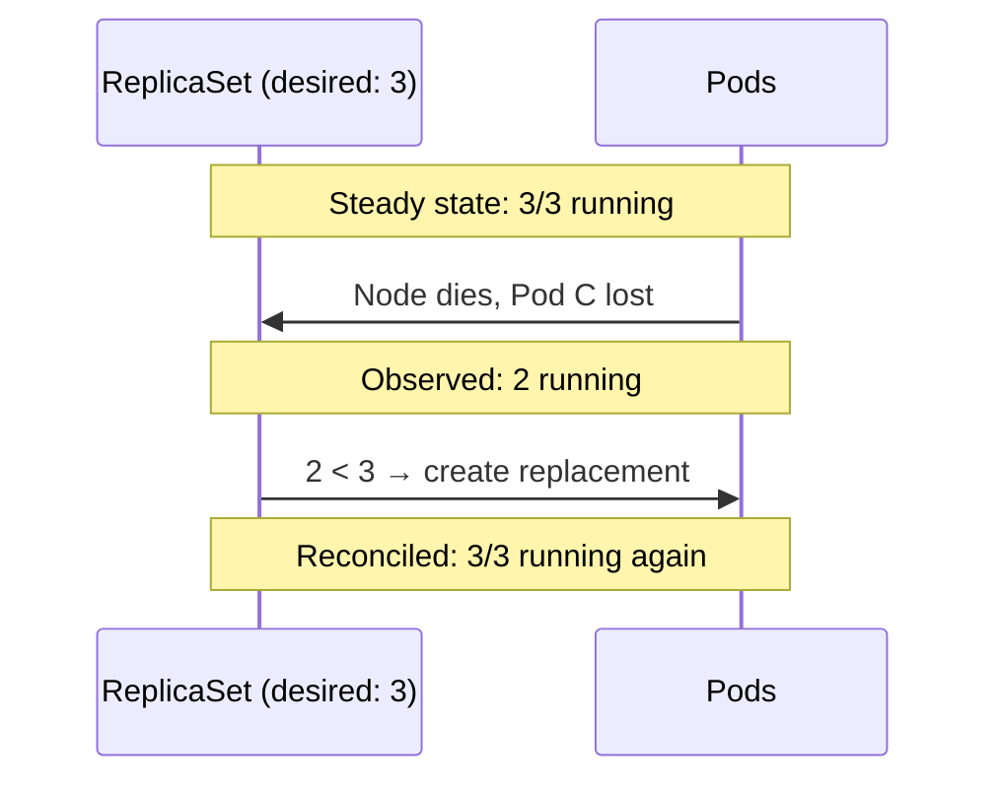

- Its ONLY job: keep `matching Pod count == spec.replicas`.
- Finds Pods **by label selector**, not by name — even a hand-made Pod with the right labels counts.
- **Never updates a Pod template on running Pods** — no rollout concept. That gap is what Deployment fills.

```yaml
apiVersion: apps/v1
kind: ReplicaSet
metadata:
  name: vote
  namespace: vote
spec:
  replicas: 3
  selector:
    matchLabels:
      app: vote
  template:            # a Pod, verbatim
    metadata:
      labels:
        app: vote       # MUST match the selector
    spec:
      containers:
        - name: vote
          image: iti/vote:v1
```

> [!warning] You will never write a ReplicaSet directly
> Deployments create ReplicaSets for you (one per revision, old ones kept at 0 replicas). Writing one manually loses rollouts/history/rollback for zero benefit. **Never `delete rs` under a live Deployment** — it just gets recreated. Delete the Deployment.

## The Deployment — what you actually create

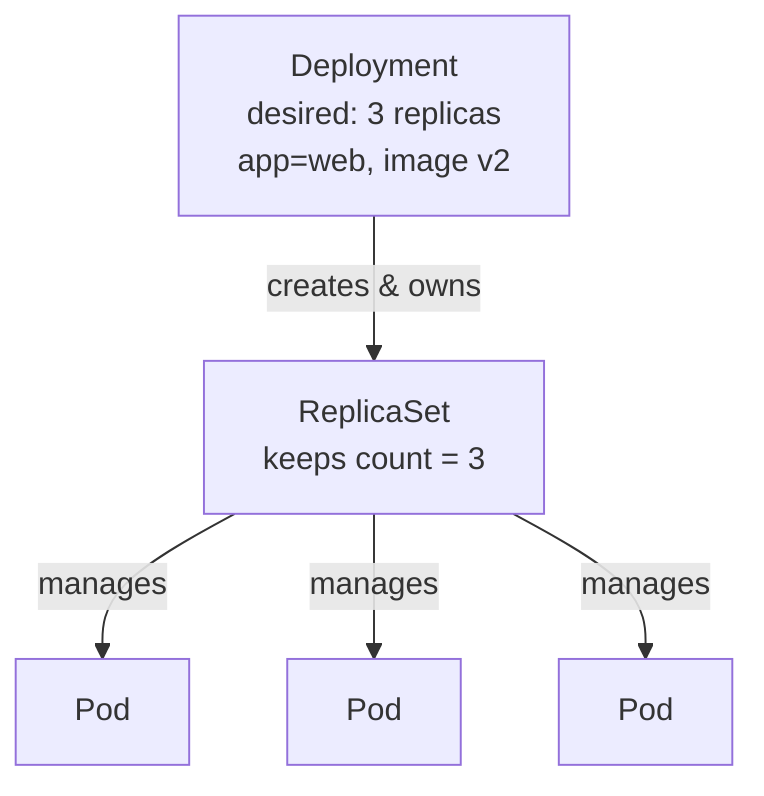

```yaml
apiVersion: apps/v1
kind: Deployment
metadata:
  name: web
spec:
  replicas: 3
  selector:
    matchLabels:
      app: web
  template:
    metadata:
      labels:
        app: web
    spec:
      containers:
        - name: nginx
          image: nginx:1.27
```

> [!warning] `spec.selector` is IMMUTABLE
> Change it on a live Deployment → API server rejects outright, no bypass flag exists. Because changing it would silently orphan every running Pod.

```bash
# Fix: replace the object, keep the Pods alive
kubectl -n vote delete deploy vote --cascade=orphan   # orphan Pods, keep traffic flowing
kubectl -n vote apply -f vote/deployment.yaml          # new selector
kubectl -n vote delete pod -l app=vote                 # sweep the orphans
```

## Scale · Rollout · Rollback

```bash
kubectl scale deploy/web --replicas=10
kubectl set image deploy/web nginx=nginx:1.29
kubectl rollout status deploy/web        # blocks until done, exits non-zero if stalled
kubectl rollout undo deploy/web          # instant — old ReplicaSet still exists

kubectl rollout history deploy/vote
kubectl rollout history deploy/vote --revision=2
kubectl annotate deploy/vote --overwrite kubernetes.io/change-cause="vote v2: heading change"
kubectl rollout restart deploy/vote      # new ReplicaSet, same image — for stale ConfigMap/Secret env vars
```

## Rolling update mechanics

```yaml
spec:
  replicas: 4
  strategy:
    type: RollingUpdate
    rollingUpdate:
      maxSurge: 1          # extra Pods allowed ABOVE replicas
      maxUnavailable: 0    # never dip BELOW ready count
```

| Field | Meaning |
|---|---|
| `maxSurge` | How far above `replicas` you may go. Costs capacity, buys safety. |
| `maxUnavailable` | How far below ready you may dip. `0` = capacity never drops. |

> [!warning] Ready ≠ able to serve
> "Ready" here just means the container started — not that the app can serve requests. Without a readiness probe, a rolling update still drops requests even at `maxUnavailable: 0`.

> [!info] Revisions
> One revision = one ReplicaSet. A revision is only created when the **Pod template** changes — scaling replicas does NOT create a new revision. `kubectl rollout undo` itself becomes a new revision (history is a log, not a stack) — revision numbers keep climbing.

### 🤔 Self-Check Q&A

1. **Q: What does a Deployment give you that a ReplicaSet does not?**
   A: Rolling updates, revision history, and rollback. A ReplicaSet only maintains a Pod count.
2. **Q: A rollout is stuck halfway. What's your diagnostic sequence, and does Kubernetes auto-rollback?**
   A: `kubectl rollout status` (see it's stalled) → `kubectl get pods` → `kubectl describe deploy` for Events. No, it does NOT auto-rollback — a stalled rollout sits half-old/half-new until `progressDeadlineSeconds` (default 600s) is exceeded, and even then a human must run `rollout undo`.
3. **Q: You scale a Deployment from 3 to 10 replicas. Does this create a new revision in `rollout history`?**
   A: No — revisions are tied to Pod **template** changes (image, env, etc.), not to `replicas` count changes.
4. **Q: A ReplicaSet you didn't create shows up under a Deployment when you `kubectl get rs`. Where did it come from, and is it safe to delete?**
   A: The Deployment created it automatically — one ReplicaSet per revision. It's not safe to delete casually: deleting the *current* one gets recreated instantly by the Deployment controller, and deleting an *old* (scaled-to-0) one permanently removes that rollback target from `rollout history`.

---

## 📌 Day 1 Recap Diagram

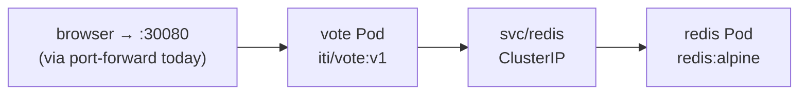

> [!warning] Where Day 1 leaves the app
> Bare Pods deleted → not recreated. No Services for most components. Passwords in plain YAML. This is intentionally broken — Deployments (section 09, technically Day 2) and Services close most of these gaps next.

## 📝 Interview Questions — Day 1 Combined

- **Pod vs container** → Pod = wrapper sharing network+volumes; smallest unit scheduler places, kubelet kills.
- **Five object fields** → apiVersion, kind, metadata, spec, status.
- **Namespaces = security boundary?** → No — names/RBAC/quota only.
- **Deployment vs ReplicaSet** → rollouts, history, rollback vs just count-maintenance.
- **`spec.selector` immutable — why** → prevents silent Pod orphaning; API refuses the change outright.
- **CrashLoopBackOff vs ImagePullBackOff** → app dies after starting vs the node never got the image at all.
- **Why does a locally-built image fail on a kind cluster?** → the node has its own image store, separate from your laptop's Docker daemon — `kind load docker-image` + `imagePullPolicy: IfNotPresent` fixes it.
- **kubectl current-context — why check it first** → prevents running destructive commands against the wrong cluster.

> [!example] 🎨 MANUAL EXCALIDRAW REQUIRED: Bare Pod vs Deployment-Managed Pod, Side by Side
> **Instructions for what I need to draw:**
> - Step 1: Split the canvas into two halves, left labeled "Bare Pod (Day 1, early)" and right labeled "Deployment-managed Pod (Day 1, section 09)".
> - Step 2: On the left, draw one Pod box with a red "X" over it and an arrow to a tombstone icon labeled "kubectl delete pod → gone forever, nothing watching".
> - Step 3: On the right, draw a Deployment box above a ReplicaSet box above 3 Pod boxes. Draw one Pod with a red "X", then a curved arrow looping back to a NEW Pod box appearing within seconds, labeled "ReplicaSet notices count dropped, creates a replacement".
> - Step 4: Add a caption under the whole diagram: "Same delete command. Completely different outcome — because one has an owner and one doesn't."
