#  Kubernetes — Networking, Multi-Container Pods & ConfigMaps (Expanded)

> [!info] What this note replaces
> This is an **expanded rebuild** of the Networking → ConfigMaps stretch from the Day 1–2 guide — same source material, but with extra explanation, more comparison tables, more diagrams, and a much bigger Self-Check bank. Slot this in to replace sections 10–12 of the original note.

---

# 10 · Networking — Services, Endpoints & DNS

## 10.1 The core problem: Pods are moving targets

Every Pod gets its own IP from the cluster's pod network (e.g., `10.244.x.x`). That IP is **not guaranteed to survive** a restart, a reschedule, a node failure, or a rolling update — a replacement Pod gets a brand-new IP every single time.

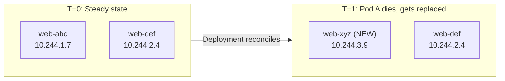

> [!important] Why this matters more than it looks
> If you hard-code a Pod IP anywhere — in another app's config, in a load balancer's target list, in a DNS `A` record you manage by hand — that reference goes stale the instant Kubernetes reschedules the Pod. In a system that self-heals by **replacing** things rather than repairing them in place, anything address-based must be indirect. That's the entire reason Services exist: they give you a layer of indirection that Kubernetes keeps in sync automatically.

## 10.2 The fix: the Service object

A **Service** is a stable virtual IP (called the **ClusterIP**) plus a DNS name, that continuously load-balances across whichever Pods currently match its label selector.

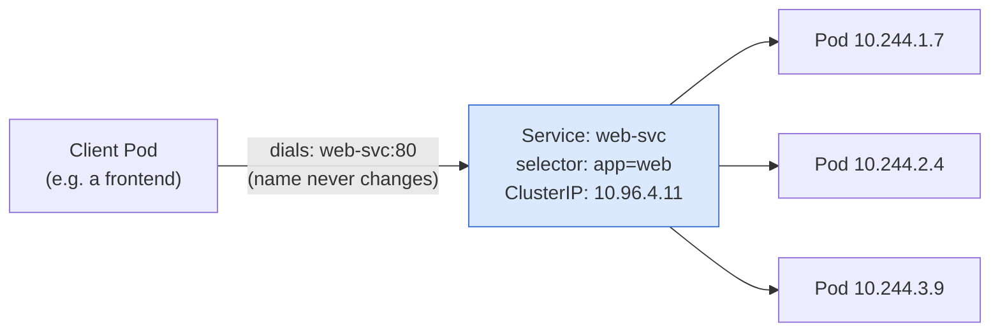

**What actually keeps this in sync:** the Service itself does nothing dynamic — it's just an object with a selector. Two other pieces of machinery do the real work:

1. The **endpoints controller** (part of controller-manager) continuously watches for Pods matching the selector and writes their IPs into an **EndpointSlice** object.
2. **kube-proxy**, running on every node, watches EndpointSlices and programs the node's packet-forwarding rules (iptables or IPVS) so that traffic to the Service's ClusterIP gets DNAT'd to one of the real Pod IPs.

> [!tip] Under the hood — iptables vs IPVS
> kube-proxy has two main implementation modes:
> - **iptables mode** (default, most common) — writes a chain of NAT rules per Service; works well up to a few thousand Services but rule evaluation is roughly linear, so very large clusters see latency creep.
> - **IPVS mode** — uses the Linux kernel's IP Virtual Server, a real hash-table-based load balancer; scales better and supports more balancing algorithms (round robin, least connection, etc.).
> You don't configure this for the ITI labs, but it's a very common cloud-architect interview question: *"How does a Service actually load-balance traffic?"* — the honest answer is "it doesn't, kube-proxy's kernel-level rules do."

## 10.3 The four Service types — full comparison

```mermaid
graph TD
    subgraph CIP["ClusterIP (default)"]
        c1["Only reachable\ninside the cluster"] --> csvc[web-svc]
        csvc --> cp[Pods]
    end
    subgraph NP["NodePort"]
        n1["NodeIP:30080\n(any node, external)"] --> nsvc[web-svc]
        nsvc --> np[Pods]
    end
    subgraph LB["LoadBalancer"]
        l1["Internet"] --> lcloud["Cloud LB\n(AWS ELB/NLB)"] --> lsvc[web-svc]
        lsvc --> lp[Pods]
    end
    subgraph HL["Headless (clusterIP: None)"]
        h1["Client does its own\nDNS-based load balancing"] --> hsvc["DNS returns\nPod IP LIST"]
        hsvc --> hp[Pods]
    end
```

| Type | Reachable from | Address given | Real-world analogy | Typical AWS parallel | When to use |
|---|---|---|---|---|---|
| **ClusterIP** | Inside cluster only | Virtual IP + DNS name | An internal-only hostname on a private VPC | Internal ALB/NLB with no public listener | Service-to-service traffic — 90% of Services |
| **NodePort** | Anywhere that can reach any node's IP, on a high port | `<any-node-IP>:30000-32767` | Punching one fixed port open on every EC2 instance in an ASG | Security-group rule opening one port cluster-wide | Dev/demo, or as the underlying mechanism a LoadBalancer builds on |
| **LoadBalancer** | Public internet (or an internal LB if annotated) | Cloud-provisioned public IP/DNS | A managed ELB in front of an Auto Scaling Group | AWS Classic/Network Load Balancer, auto-provisioned by the cloud controller manager | Production external exposure on a managed cloud |
| **Headless** (`clusterIP: None`) | Wherever DNS is queried from | No virtual IP — DNS returns the **Pod IP list directly** | Client-side service discovery, like a Route 53 multi-value answer | Route 53 weighted/multivalue records without an LB in front | Stateful workloads, DB replica sets, client-driven sharding |

> [!important] LoadBalancer is built ON TOP of NodePort
> A `type: LoadBalancer` Service isn't a fourth, separate mechanism — Kubernetes still allocates a NodePort under the hood, and the cloud provider's controller provisions an external LB that forwards to that NodePort on every node. Understanding this chain (`Internet → cloud LB → NodePort → Service ClusterIP → Pod`) is exactly the kind of detail that comes up in cloud infra interviews.

### Anatomy of a Service manifest

```yaml
apiVersion: v1
kind: Service
metadata:
  name: web-svc
spec:
  type: ClusterIP        # ClusterIP | NodePort | LoadBalancer
  selector:
    app: web              # which Pods receive traffic
  ports:
    - port: 80             # the Service's own port — what clients dial
      targetPort: 80        # the port ON THE POD traffic is forwarded to
```

## 10.4 Headless Services — when you don't want load balancing

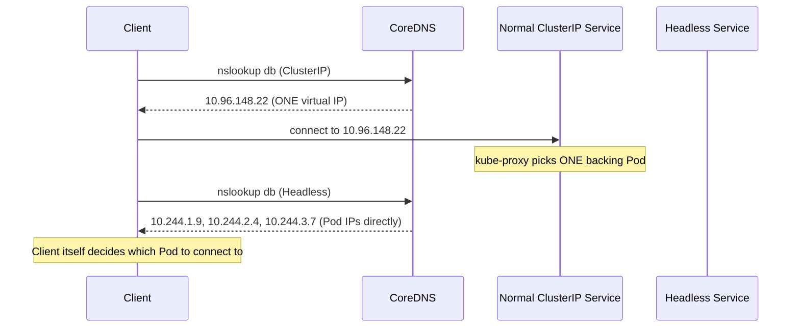

```yaml
apiVersion: v1
kind: Service
metadata:
  name: db
  namespace: vote
spec:
  clusterIP: None      # <-- this makes it headless
  selector:
    app: db
  ports:
    - port: 5432
      targetPort: 5432
```

- No virtual IP, no kube-proxy rules, no load balancing — **DNS does all the work**.
- Required by **StatefulSets** — it's what gives each Pod a stable, individually-addressable DNS name (`db-0.db.vote.svc.cluster.local`), covered on Day 3.
- Use when the client must pick a specific backend: a primary-replica DB topology, Kafka brokers doing their own partition assignment, anything with leader election.
- **95% of the time you want plain ClusterIP.** Reach for headless deliberately, not by default.

## 10.5 Endpoints & EndpointSlices — the missing link everyone forgets

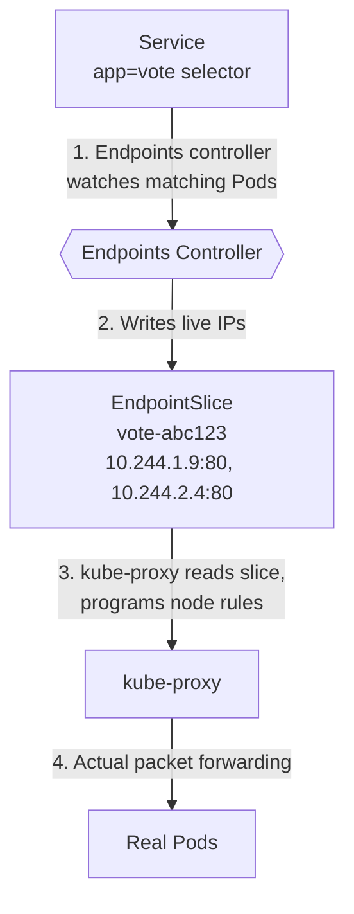

```bash
kubectl get endpoints vote
# NAME   ENDPOINTS                       AGE
# vote   10.244.1.9:80,10.244.2.4:80     4m

kubectl get endpointslices -l kubernetes.io/service-name=vote   # the modern object kube-proxy actually reads
kubectl describe endpoints vote
```

> [!warning] This is the fastest diagnostic in all of Kubernetes
> `Service returns connection refused / times out` → run `kubectl get endpoints <svc>` **before anything else**.
> - **Empty `<none>`** → the selector matches zero *ready* Pods. It's a labeling problem or a readiness-probe problem, not a networking problem. Half your troubleshooting search space is gone in one command.
> - **Populated with IPs** → networking is fine; the bug is inside the application itself (wrong port, app not listening, app crashing on that route).

> [!info] Why "Endpoints" (singular object) became "EndpointSlices" (plural, chunked)
> The original `Endpoints` object stored every backing Pod IP in **one single object per Service**. In clusters with thousands of Pods behind one Service, that object became enormous and every update had to be re-transmitted to every kube-proxy in full. EndpointSlices shard the same information into chunks of ~100 addresses each, so updates are incremental and far cheaper at scale. Functionally, for troubleshooting, treat them the same — `get endpoints` still works and is quicker to type.

## 10.6 The four ports — the #1 source of confusion in Kubernetes

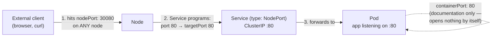

| Field | Lives in | What it actually controls | If you get it wrong |
|---|---|---|---|
| `containerPort` | Pod spec | Nothing — pure documentation for humans and tooling | Everything still works; it's informational only |
| `targetPort` | Service | The port ON THE POD that traffic is forwarded to | **Connection refused** — this must equal what the app inside the container is actually listening on |
| `port` | Service | The Service's own port — what other Pods/clients dial | Free choice, doesn't need to equal `targetPort` |
| `nodePort` | Service, `type: NodePort` only | A port opened on every node, range 30000–32767 | Omit it and Kubernetes assigns a random one for you |

**Worked trace, end to end:** a browser hits `http://<any-node-ip>:30080` → the kernel on that node, programmed by kube-proxy, DNATs the packet to the Service's ClusterIP on `port: 80` → kube-proxy's rules DNAT again to a live Pod IP on `targetPort: 80` → the container's process, which happens to be listening on port 80 (matching `containerPort: 80` purely by convention), receives the connection.

## 10.7 Cluster DNS — CoreDNS and the FQDN pattern

```
redis         .    vote      .   svc  .  cluster.local
  │                 │             │          │
Service name    Namespace   "it's a Service"  cluster DNS domain
```

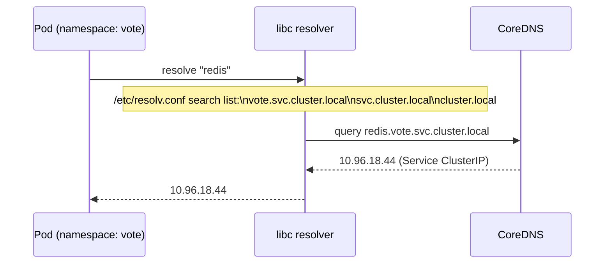

CoreDNS runs as a Deployment in `kube-system`, fronted by a Service called `kube-dns`. The kubelet writes `/etc/resolv.conf` into every Pod at creation time.

```bash
# from a Pod in namespace vote — four equivalent names, one Service
curl http://redis:6379                       # same namespace — short name
curl http://redis.vote:6379                  # + namespace — works cross-namespace
curl http://redis.vote.svc:6379              # + type
curl http://redis.vote.svc.cluster.local     # fully qualified
```

> [!warning] The #1 "but it worked in dev" bug
> The short name (`redis`) only resolves inside the **same namespace** it's queried from. Cross-namespace calls need at minimum `<service>.<namespace>`. A Pod in `staging` calling `redis` will silently hit `staging`'s own `redis` Service (if one exists) or fail to resolve (if it doesn't) — never `prod`'s.

### Why the short name works at all — `search` and `ndots`

```
# /etc/resolv.conf inside a Pod in namespace vote
nameserver 10.96.0.10
search vote.svc.cluster.local svc.cluster.local cluster.local
options ndots:5
```

- **`search`** — the resolver appends each suffix in turn until one answers. `redis` → tries `redis.vote.svc.cluster.local` first → hits.
- **`ndots:5`** — a name with fewer than 5 dots is tried against the search list *first*, before being treated as an absolute external name.

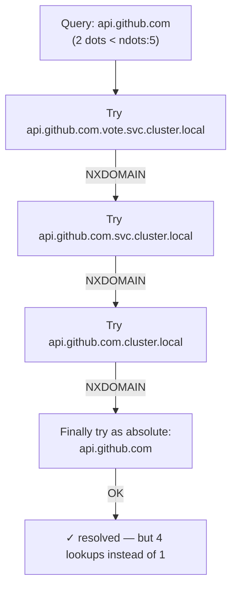

> [!tip] The fix, and when it matters
> A trailing dot makes a name absolute immediately: `curl https://api.github.com./`. In-cluster names are cheap (hit on the first suffix); it's chatty **external** calls that pay this 4x DNS tax. Worth tuning `spec.dnsConfig.options` on any Pod that makes lots of outbound internet calls.

## 10.8 Service troubleshooting decision tree

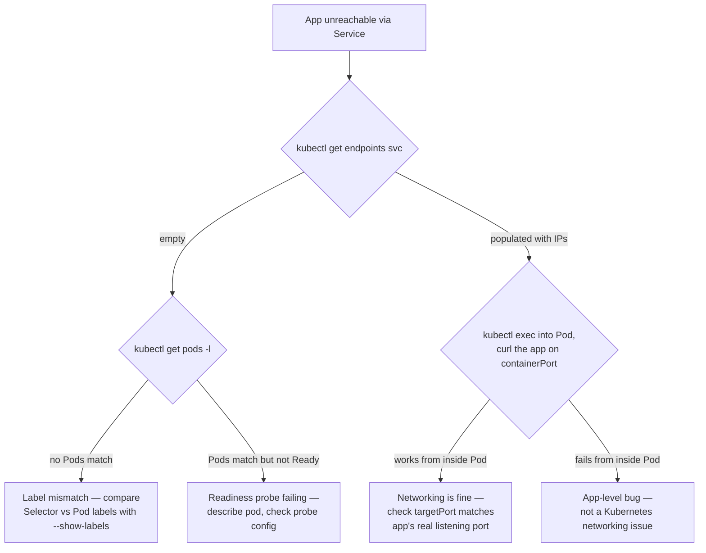

## 10.9 Networking Self-Check Q&A

1. **Q: A Service has a valid ClusterIP and `kubectl get svc` reports it as healthy. Why can that still be lying to you?**
   A: `get svc` only confirms the Service *object* exists with an allocated IP — it says nothing about whether the selector actually matches any live, ready Pods. A Service can look perfectly healthy while its EndpointSlice is completely empty.

2. **Q: What is the actual mechanism that load-balances traffic across Pods behind a Service — is it the Service object itself?**
   A: No. The Service is just a declarative object with a selector. The endpoints controller populates EndpointSlices, and `kube-proxy` on each node programs kernel-level rules (iptables or IPVS) that do the real packet DNAT/load-balancing.

3. **Q: You curl a NodePort Service from outside the cluster and get "connection refused." List the three ports involved and which one is the most likely culprit if the Pod is confirmed Running and Ready.**
   A: `nodePort` (external entry), `port` (Service's own port), `targetPort` (forwarded to the Pod). If the Pod is Running/Ready, `targetPort` mismatching the app's actual listening port is the most common cause — `containerPort` is purely documentation and can't cause this on its own.

4. **Q: Why would a StatefulSet require a headless Service instead of a normal ClusterIP one?**
   A: A StatefulSet needs each replica individually addressable by a stable, predictable DNS name (`pod-0.svc.ns.svc.cluster.local`), not load-balanced behind one virtual IP. A headless Service returns the full Pod IP list via DNS instead of one ClusterIP, which is exactly what per-Pod addressing requires.

5. **Q: A Pod in namespace `dev` calls `http://redis:6379` and it works. The same code, deployed to namespace `staging`, also calls `http://redis:6379` — and it silently connects to the wrong data. Why, and how would you make this fail loudly instead of silently?**
   A: The short name `redis` resolves relative to the calling Pod's own namespace via the DNS `search` list — so each namespace's own `redis` Service answers locally. If `staging` shouldn't have its own `redis`, the call would fail loudly (NXDOMAIN) instead of silently hitting the wrong data — the real danger here is namespace duplication of the same short name. Best practice: qualify cross-boundary calls explicitly or use distinct names to avoid this class of bug entirely.

6. **Q: What's the cost of DNS `ndots:5` for a Pod that frequently calls `api.stripe.com`, and how do you avoid paying it on every request?**
   A: With `ndots:5`, `api.stripe.com` (2 dots) is tried against all 3 cluster search suffixes first (3 guaranteed NXDOMAIN lookups) before being tried as absolute — 4 DNS round-trips per call instead of 1. Fix: use a trailing dot (`api.stripe.com.`) to force an absolute lookup, or tune `dnsConfig.options` on the Pod.

---

# 11 · Multi-Container Pods — Init Containers & Sidecars

## 11.1 What's actually shared inside one Pod

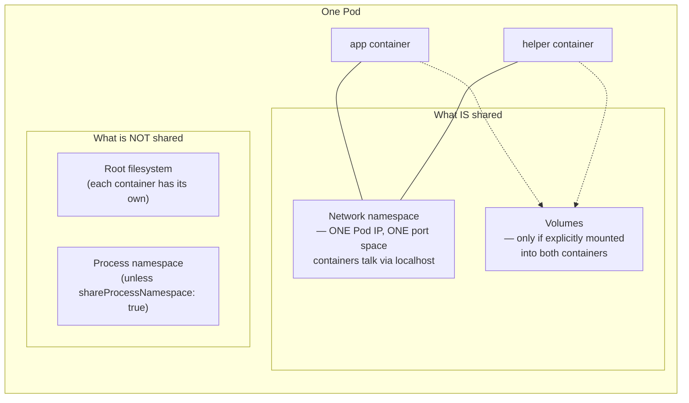

| Shared automatically | Shared only if you opt in | Never shared |
|---|---|---|
| Network namespace (one Pod IP, `localhost` between containers) | Volumes (must be explicitly mounted into each container that needs them) | Root filesystem per container |
| IPC namespace (by default) | Process namespace (`shareProcessNamespace: true`) | Environment variables (each container defines its own) |

> [!warning] The classic misuse
> Don't put your app and its database in one Pod. Ask: *would you ever scale, upgrade, or restart them independently?* For a database, the answer is always yes — so they must be separate Pods (with the DB likely as its own StatefulSet + Service).

> [!tip] Practical consequence of shared networking
> Because containers in a Pod share one port space, a sidecar that needs to proxy traffic (like an Envoy service-mesh sidecar) typically listens on a **different** port than the app and transparently intercepts traffic via iptables rules injected into the Pod's network namespace — this is literally how Istio/Linkerd sidecar injection works under the hood.

## 11.2 Init containers — a gate, not a companion

```yaml
spec:
  initContainers:
    - name: wait-for-db
      image: postgres:14
      command: ['sh', '-c', 'until pg_isready -h db -p 5432; do echo waiting; sleep 2; done']
  containers:
    - name: worker
      image: iti/worker:v1
```

- Run **sequentially, one at a time** — each must exit `0` before the next starts.
- App containers start ONLY after every init container has succeeded.
- Can use a completely **different image** than the app (put `psql`, `git`, `curl` in the init image, keep the app image minimal).
- A failing init container leaves the Pod at `Init:0/1` (or `Init:CrashLoopBackOff`) — the app never starts, which is exactly the desired, honest failure mode.

**Common init-container jobs:** wait for a dependency to be reachable, run a database schema migration before the app connects, fetch a secret/config file into a shared `emptyDir`, fix volume ownership/permissions (`chown`) before a non-root app container starts.

```bash
kubectl get pods -l app=worker -w
# worker-8c4...   0/1     Init:0/1    0     <- stuck here means the gate hasn't opened

kubectl logs -l app=worker -c wait-for-db --tail=5   # -c flag is REQUIRED for init container logs
kubectl describe pod -l app=worker | grep -A4 'Init Containers'   # exit codes + state per init container
```

## 11.3 The sidecar pattern — a companion, not a gate

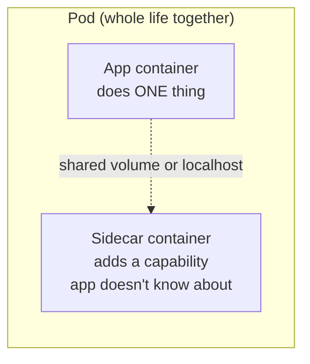

| Sidecar type | What it does | Why not build it into the app? |
|---|---|---|
|  **Log shipper** | Tails a file the app writes to a shared `emptyDir`, ships it to a logging backend | App stays logging-stack-agnostic; swap Fluentd for Vector without touching app code |
|  **Service mesh proxy** | Envoy intercepts ALL Pod traffic for mTLS, retries, tracing | This is literally what Istio/Linkerd are — injected transparently, zero app changes |
|  **Config reloader** | Watches a mounted ConfigMap, signals the app to reload | Decouples "watch for change" logic from business logic |

> [!info] The modern spelling (K8s 1.29+)
> A proper sidecar is now an **init container with `restartPolicy: Always`**. It starts before the app containers (like a normal init container), keeps running alongside them for the Pod's whole life (like old-style sidecars never quite guaranteed), and — critically — shuts down **after** the app containers terminate. This fixes the classic bug where a log-shipper sidecar died before the app finished flushing its last log lines.

> [!warning] The resource-cost trap
> A sidecar shares the Pod's CPU/memory budget and its restart lifecycle. Three sidecars around a small app is 3x the resource footprint and 3x the things that can crash or OOM the Pod. Every sidecar you add is something else that can fail.

## 11.4 Init container vs Sidecar — side-by-side

```mermaid
gantt
    dateFormat X
    axisFormat %s
    title Pod container timeline
    section Init phase (sequential)
    init-1 wait-for-db (exit 0)     :done, i1, 0, 2
    init-2 migrate-schema (exit 0)  :done, i2, 2, 4
    section Running phase (parallel)
    app container                   :active, app, 4, 10
    sidecar container                :active, sc, 4, 10
```

| | Init container | Sidecar |
|---|---|---|
| **When it runs** | Before app containers, sequentially | Alongside app containers, for the whole Pod life |
| **Must finish?** | Yes — exit 0 required to proceed | No — it's long-running by design |
| **Ordering guarantee** | Strict, one at a time | Parallel; no ordering guarantee pre-1.29 |
| **On failure** | App never starts — `Init:0/1` | App keeps running; Pod may go `NotReady` |
| **Typical jobs** | Wait for dependency, migrate schema, fetch secrets, fix permissions | Ship logs, proxy traffic (mesh), reload config, expose metrics |
| **Can use a different image?** | Yes, freely | Yes, freely |
| **Resource accounting** | Counted only while it runs (not concurrently with app) | Counted for the full Pod lifetime, alongside the app |

## 11.5 Multi-Container Pods Self-Check Q&A

1. **Q: Two containers in the same Pod both try to `curl localhost:8080` — one is the app serving on 8080, the other is a sidecar also trying to bind 8080. What happens?**
   A: The second container to attempt the bind crashes with "address already in use." All containers in a Pod share one network namespace and therefore one port space — you cannot have two listeners on the same port within one Pod.

2. **Q: Your worker's init container `wait-for-db` is stuck. `kubectl logs worker-xyz` shows nothing useful. What's the correct command, and why does the plain `logs` command fail here?**
   A: `kubectl logs worker-xyz -c wait-for-db`. Plain `kubectl logs` defaults to the (still-not-started) main app container; multi-container Pods (init or sidecar) require the `-c <container-name>` flag to select which container's logs you want.

3. **Q: Why is a database schema migration a better fit for an init container than for application startup code?**
   A: An init container makes the dependency and its failure mode **visible and observable at the platform level** (`Init:0/1`, distinct logs, distinct exit code) rather than buried inside application startup logic where a retry loop might mask the problem behind a misleading `1/1 Running` status.

4. **Q: You're designing a Pod where a log-shipping container needs to keep running slightly longer than the app container to flush the last few log lines on shutdown. Which K8s 1.29+ feature solves this cleanly, and how?**
   A: A native sidecar — an init container with `restartPolicy: Always`. It starts before the app, runs alongside it, and is guaranteed to shut down **after** the app containers terminate, solving the "sidecar dies before the app finishes writing" race condition that plagued older sidecar patterns.

5. **Q: Compare failure blast radius: an init container fails vs. a sidecar container fails, mid-life. What's the difference in user-facing impact?**
   A: An init container failure prevents the app from ever starting — full outage for that Pod, but an obvious, honest one (`Init:CrashLoopBackOff`). A sidecar failing mid-life doesn't necessarily kill the app container — the Pod might show `NotReady` (if the sidecar's own probe fails) while the app keeps serving traffic degraded (e.g., without log shipping or without the mesh proxy's retries), which is a subtler, easier-to-miss failure mode.

---

# 12 · ConfigMaps — Configuration Out of the Image

## 12.1 Why configuration must live outside the image

> [!important] The 12-factor principle
> The **same built image** should run unmodified in dev, staging, and prod — only configuration differs between environments. If config is baked into the image, you're rebuilding and repushing an image just to change a log level, which defeats the entire point of an immutable, versioned artifact.

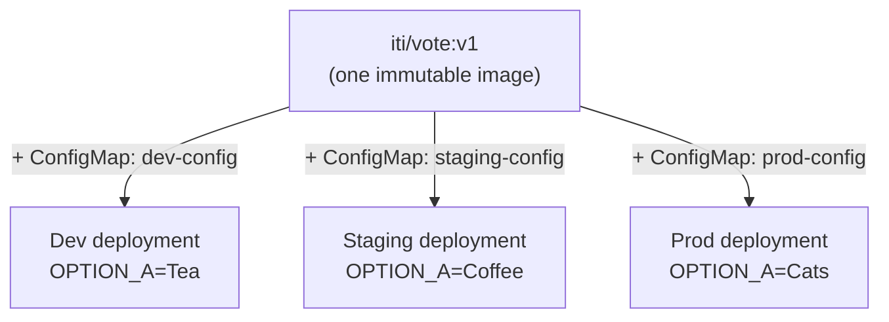

A **ConfigMap** is a namespaced object holding plain-text key/value pairs. Values can be a single word, a number-as-string, or an entire file's contents.

| Property | Detail |
|---|---|
| **Lifecycle** | Outlives the Pods that read it — delete every Pod, the ConfigMap and its data remain for the next replacements |
| **Format** | Key/value pairs, stored and displayed **in plain text** — never for secrets |
| **Delivery** | Two independent paths: as env vars, or as mounted files (same object, different injection mechanism) |
| **Change model** | Editing a ConfigMap does NOT touch running Pods automatically — see 12.3 below |

## 12.2 Three ways to create one

```bash
# 1) from literals — fast, good for demos/quick iteration
kubectl create configmap vote-config -n vote \
  --from-literal=OPTION_A=Tea \
  --from-literal=OPTION_B=Coffee

# 2) from a file — KEY = filename, VALUE = entire file content
kubectl create configmap vote-banner -n vote --from-file=banner.txt

# 3) from a whole directory — one key per file
kubectl create configmap app-conf -n vote --from-file=./conf.d/
```

```yaml
# declarative — the version you actually commit to git
apiVersion: v1
kind: ConfigMap
metadata:
  name: vote-config
  namespace: vote
data:
  OPTION_A: "Tea"
  OPTION_B: "Coffee"
  LOG_LEVEL: "info"
  banner.txt: |
    ITI DevOps 2026
    vote responsibly
```

> [!tip] Best of both worlds
> Generate the imperative way, but pipe it to a file before applying — this diffs cleanly in code review and still saves you hand-writing YAML:
> `kubectl create cm x --from-literal=k=v --dry-run=client -o yaml > configmap.yaml`

## 12.3 Two delivery paths — env vars vs mounted files

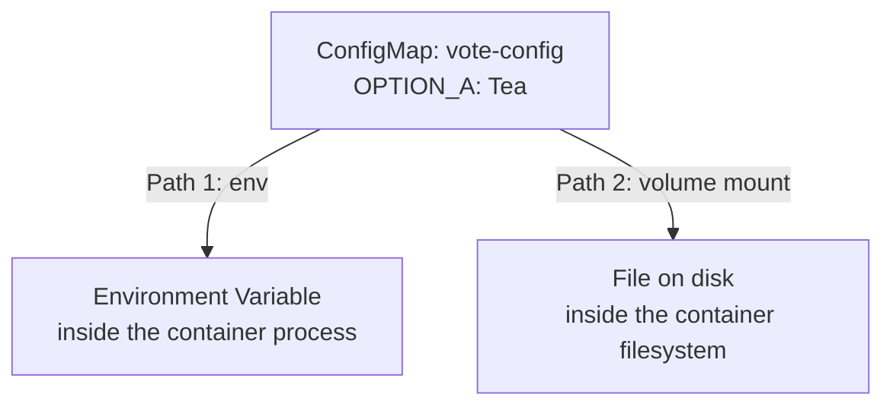

### Path 1 — Environment variables

```yaml
# individual key, WITH renaming power
env:
  - name: OPTION_A                 # env var name can differ from the key
    valueFrom:
      configMapKeyRef:
        name: vote-config
        key: OPTION_A
        # optional: true           # tolerate a missing key instead of failing

# every key at once — env var name = key name, NO renaming
envFrom:
  - configMapRef:
      name: vote-config
    prefix: DB_                    # optional, avoids name collisions across multiple ConfigMaps
```

### Path 2 — Mounted files

```yaml
volumeMounts:
  - name: conf
    mountPath: /etc/vote
    readOnly: true
volumes:
  - name: conf
    configMap:
      name: vote-config
      items:                        # optional: project only some keys, rename on the way in
        - key: banner.txt
          path: banner.txt
```

> [!warning] `mountPath` REPLACES the entire target directory
> Mounting a ConfigMap at `/etc` doesn't merge with the existing `/etc` — it **overwrites the whole directory** as far as that container sees it, potentially hiding `/etc/passwd` and everything else. Always mount into a dedicated, empty directory, or use `subPath` to place a single file without hiding its siblings (trade-off below).

## 12.4 Update behavior — the comparison that actually matters

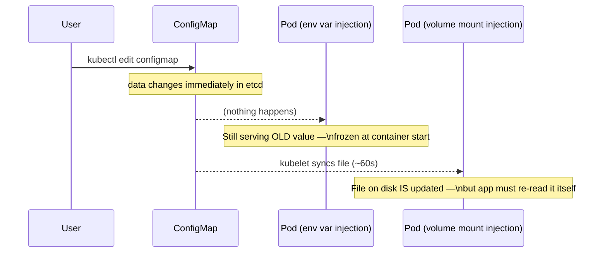

| | As environment variables | As mounted files |
|---|---|---|
| **Read when** | Once, at container start | Whenever the app chooses to open the file |
| **On ConfigMap change** | **Nothing** — stale until the container restarts | kubelet updates the file (~60s sync period) |
| **How to force a refresh** | `kubectl rollout restart deployment/x` | Nothing needed on the K8s side — *if* the app re-reads |
| **Best suited for** | Flags, hostnames, log levels, ports — values that rarely change | Real config files, TLS certs, large blobs, anything an app can hot-reload |
| **Common pitfall** | Leaks into `printenv`, crash dumps, child process environments | `subPath` mounts **never** auto-update (see below) |

> [!important] The half-truth about mounted files
> The file updating on disk is **not the same as the app noticing**. Most applications read their config file once at boot and cache it in memory — a mounted ConfigMap that changes still needs a `kubectl rollout restart` unless the application code specifically watches the file for changes (e.g., with `inotify`, or a sidecar config-reloader that signals `SIGHUP`).

> [!warning] `subPath` breaks live updates entirely
> If you mount a single file using `subPath` (to avoid hiding the rest of the target directory), Kubernetes copies the file in at Pod creation and **never updates it again**, even after the ~60s sync period that whole-directory mounts get. This is a very common silent trap — know the trade-off before reaching for `subPath`.

```bash
# demonstrating the env-var staleness trap
kubectl create configmap vote-config -n vote --from-literal=OPTION_A=Vim --dry-run=client -o yaml | kubectl apply -f -
kubectl exec deploy/vote -n vote -- printenv OPTION_A   # still "Tea" — the Pod never heard about it!
kubectl rollout restart deployment/vote -n vote          # the ONLY cure for env-var injection
```

## 12.5 Sneak peek — ConfigMap vs Secret

| | ConfigMap | Secret |
|---|---|---|
| Purpose | Non-sensitive config | Passwords, tokens, keys, certs |
| Storage in API | Plain text | base64-encoded ( **not encryption** — just encoding) |
| `kubectl describe` shows value? | Yes, in the clear | No — hidden by default |
| Mechanics (env/volume injection) | Identical to Secret | Identical to ConfigMap |
| At rest on node disk | Regular disk | `tmpfs` (RAM) — never written to node disk |

> [!info] Full Secrets coverage is in the next note
> Same delivery mechanics as ConfigMaps (env vs mounted files, same staleness trap), but with base64 encoding and tmpfs-backed volumes.

## 12.6 ConfigMap Self-Check Q&A

1. **Q: You change a ConfigMap that's injected as environment variables into a running Deployment. The Pods are still `1/1 Running`. Will they pick up the new values?**
   A: No — never, without intervention. Environment variables are copied into the container process at start and frozen for its entire lifetime. The fix is `kubectl rollout restart deployment/<name>`, which creates fresh Pods that read the current ConfigMap value at their (new) start time.

2. **Q: A teammate mounts a ConfigMap at `mountPath: /etc` inside a container to "add one config file." What breaks, and why?**
   A: Mounting a ConfigMap volume at a path **replaces the entire directory contents** as the container sees them — so `/etc/passwd`, `/etc/hosts`, and everything else that used to live in `/etc` effectively disappears from that container's view, likely breaking DNS resolution, user lookups, and anything else that depends on standard `/etc` files. The fix is to mount into a dedicated empty directory (e.g., `/etc/vote`), or use `subPath` for a single file.

3. **Q: You use `subPath` to mount just one file from a ConfigMap so you don't hide the rest of the target directory. Six months later, you edit the ConfigMap and the file never changes on disk. Why?**
   A: `subPath` mounts are a snapshot taken at Pod creation time — they are explicitly excluded from the kubelet's periodic ConfigMap-sync mechanism. Regular (whole-directory) ConfigMap volume mounts DO get updated (~60s sync); `subPath` mounts never do, by design.

4. **Q: What's the practical difference between using `configMapKeyRef` per-variable versus `envFrom` with a `configMapRef` for injecting a ConfigMap as environment variables?**
   A: `configMapKeyRef` lets you rename each key on the way in (env var name ≠ ConfigMap key name) and reference individual keys explicitly. `envFrom` dumps every key in at once with the env var name forced to match the ConfigMap key exactly — and if a key isn't a valid environment-variable identifier, it's silently skipped (with only an event logged, easy to miss).

5. **Q: Why can't a ConfigMap ever be an acceptable place to store a database password, even in a lab/demo environment?**
   A: ConfigMap values are stored and displayed as plain text everywhere — `kubectl get configmap -o yaml`, `kubectl describe configmap`, and the raw etcd data all show it unmasked. There's no confidentiality mechanism at all, unlike a Secret (which at least base64-encodes it, hides it from `describe`, and keeps it in `tmpfs` rather than node disk).

6. **Q: You need the same ConfigMap key injected into two different containers under two different env var names. Which injection method supports this, and which doesn't?**
   A: `configMapKeyRef` supports this — each container's `env` entry can independently choose its own variable name while pointing at the same ConfigMap key. `envFrom` does not — it forces the env var name to exactly match the ConfigMap key, with no per-container renaming.

> [!example]  MANUAL EXCALIDRAW REQUIRED: kube-proxy Packet Path (iptables mode)
> **Instructions for what I need to draw:**
> - Step 1: Draw a horizontal packet flow left to right: "Client packet" → "Node network stack (PREROUTING chain)" → "KUBE-SERVICES chain" → "KUBE-SVC-<hash> chain" → "KUBE-SEP-<hash> chain (one per backend Pod)" → "DNAT to Pod IP:port".
> - Step 2: At the "KUBE-SVC" stage, branch into 2-3 parallel arrows labeled with probability weights (e.g., "33% chance each") going to different KUBE-SEP chains — annotate "this is the load-balancing: random chain selection across equal-weight rules".
> - Step 3: Draw a small "kube-proxy" daemon icon off to the side with a dashed arrow pointing INTO the iptables rule chains, labeled "watches EndpointSlices, continuously rewrites these rules".
> - Step 4: Add a callout box: "ClusterIP itself is virtual — it never appears as a real interface. It only exists as a DNAT target inside these rules."

> [!example]  MANUAL EXCALIDRAW REQUIRED: ConfigMap Injection Paths, Side by Side
> **Instructions for what I need to draw:**
> - Step 1: Draw one ConfigMap box on the left labeled "vote-config { OPTION_A: Tea, banner.txt: '...' }".
> - Step 2: Draw two parallel Pod boxes on the right: "Pod A (env injection)" and "Pod B (volume injection)".
> - Step 3: From the ConfigMap to Pod A, draw an arrow labeled "configMapKeyRef / envFrom" ending in a small terminal/shell icon inside Pod A showing `$ echo $OPTION_A → Tea`.
> - Step 4: From the ConfigMap to Pod B, draw an arrow labeled "volumeMount" ending in a small file-tree icon inside Pod B showing `/etc/vote/banner.txt`.
> - Step 5: Below both Pods, draw a shared timeline arrow labeled "ConfigMap edited at T=0". Under Pod A write "value frozen — stays Tea forever until rollout restart". Under Pod B write "file updates ~60s later — but app must re-read it".
