#  Kubernetes — Secrets, Storage & Health Probes (Day 3, Part 2)

> [!warning] Sourcing note
> Everything through ConfigMaps was pulled verbatim from the ITI slide deck. This section was built from general Kubernetes knowledge, matching the topics listed in the course roadmap (Secrets, emptyDir/hostPath, PV/PVC/StorageClass, StatefulSet intro, liveness/readiness/startup probes) and the same explanation style — but treat specific command output/lab numbering as illustrative, not a verbatim transcript. Worth spot-checking against the live deck when you get to it.

---

# 13 · Secrets — ConfigMaps With Better Manners

## 13.1 What a Secret actually is (and isn't)

A **Secret** is mechanically almost identical to a ConfigMap — same namespaced key/value object, same two injection paths (env vars or mounted files). The differences are all about **handling discretion, not cryptographic protection**.

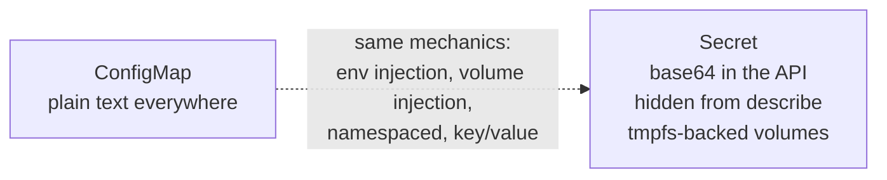

| | ConfigMap | Secret |
|---|---|---|
| Storage format in etcd/API | Plain text | base64-encoded |
| `kubectl describe` shows value? | Yes | No — hidden (`<set to the key 'x' in secret 'y'>`) |
| `kubectl get -o yaml` shows value? | Yes, plain | Yes, but base64 — one `echo ... \| base64 -d` away |
| At rest on node disk (volume mount) | Regular disk | `tmpfs` (RAM-backed) — never written to disk |
| Encrypted at rest in etcd by default? | No | **No, by default** — requires `EncryptionConfiguration` to actually encrypt |

> [!important] base64 is encoding, not encryption
> This is the single most-tested Secrets concept in interviews. Base64 is a **reversible, keyless transformation** — anyone with `kubectl get secret -o yaml` access (or read access to etcd) can decode it in one command:
> ```bash
> kubectl get secret db-creds -o jsonpath='{.data.password}' | base64 -d
> ```
> Real confidentiality requires: RBAC restricting who can `get`/`list` Secrets, **encryption at rest** configured on etcd (via an `EncryptionConfiguration` resource — not on by default), and ideally an external secrets manager (AWS Secrets Manager, HashiCorp Vault) with something like the External Secrets Operator syncing values in. For AWS-flavored roles, this is exactly the kind of distinction between "Kubernetes Secret" and "actually secret" that shows up in architecture interviews.

## 13.2 Creating Secrets

```bash
# generic — arbitrary key/value pairs
kubectl create secret generic db-creds -n vote \
  --from-literal=POSTGRES_USER=postgres \
  --from-literal=POSTGRES_PASSWORD='S3cur3Pass!'

# from files (e.g. TLS cert/key, or an entire config file)
kubectl create secret generic tls-demo \
  --from-file=tls.crt --from-file=tls.key

# a purpose-built type — validated shape, used by Ingress/kubelet automatically
kubectl create secret tls vote-tls --cert=tls.crt --key=tls.key
kubectl create secret docker-registry regcred \
  --docker-server=<registry> --docker-username=<u> \
  --docker-password=<p> --docker-email=<e>
```

```yaml
apiVersion: v1
kind: Secret
metadata:
  name: db-creds
  namespace: vote
type: Opaque              # generic key/value — most common type
data:
  POSTGRES_USER: cG9zdGdyZXM=          # base64, NOT encrypted
  POSTGRES_PASSWORD: UzNjdXIzUGFzcyE=
stringData:                            # write plain text HERE instead —
  DEBUG_NOTE: "stringData gets auto-base64'd on apply, never round-trips back"
```

> [!tip] Use `stringData` when hand-writing YAML
> Nobody wants to manually base64-encode values. `stringData` lets you write plain text in the manifest; the API server encodes it into `data` on write. It's write-only convenience — `kubectl get -o yaml` always shows you the `data` (base64) form back.

## 13.3 Secret types — not all Opaque

| `type` | Purpose | Special behavior |
|---|---|---|
| `Opaque` (default) | Arbitrary key/value — the vast majority of use cases | None — just a bag of bytes |
| `kubernetes.io/tls` | TLS certificate + private key | Requires exactly `tls.crt` + `tls.key` keys; Ingress controllers read this type directly |
| `kubernetes.io/dockerconfigjson` | Registry credentials | Consumed via `imagePullSecrets` on a Pod/ServiceAccount to authenticate private image pulls |
| `kubernetes.io/service-account-token` | Auto-created, mounted into every Pod | Gives the Pod's process an identity to talk to the api-server (ties into RBAC) |
| `kubernetes.io/basic-auth`, `kubernetes.io/ssh-auth` | Structured credential shapes | Validated key names (`username`/`password`, `ssh-privatekey`) |

## 13.4 Injection — identical mechanics to ConfigMaps, same staleness trap

```yaml
# as env vars (individual key)
env:
  - name: DB_PASSWORD
    valueFrom:
      secretKeyRef:
        name: db-creds
        key: POSTGRES_PASSWORD

# every key at once
envFrom:
  - secretRef:
      name: db-creds

# as a mounted volume — tmpfs-backed, RAM only
volumes:
  - name: db-secret-vol
    secret:
      secretName: db-creds
      defaultMode: 0400        # Secrets support restrictive file permissions — ConfigMaps rarely bother
```

> [!warning] Same env-var staleness bug as ConfigMaps
> Rotate a Secret's value while it's injected as an env var → running Pods keep the **old** password forever until `kubectl rollout restart`. This is a genuinely dangerous production trap: rotate a compromised DB password, forget to restart the Deployment, and the "rotated" credential is still live in every running Pod's memory. Mounted-file Secrets update on disk (~60s, same as ConfigMaps) but again require the app to re-read.

## 13.5 Real-world Secrets architecture (beyond the lab)

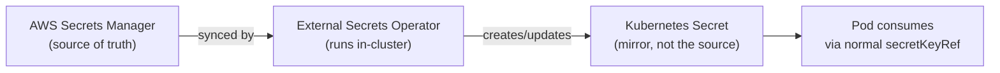

> [!info] Why not just use raw Kubernetes Secrets in production?
> Native Secrets have no built-in rotation, no audit trail comparable to a dedicated secrets manager, and (without extra configuration) aren't encrypted at rest. The common cloud-native pattern — directly relevant to AWS SAA/Cloud Architect work — is to keep AWS Secrets Manager (or Vault) as the actual source of truth and use an operator (External Secrets Operator, or AWS's own Secrets Store CSI Driver) to project those values into Kubernetes Secrets automatically, getting rotation and audit logging without changing how your Pods consume them.

## 13.6 Secrets Self-Check Q&A

1. **Q: A teammate says "we don't need RBAC restrictions on Secrets because Kubernetes already encrypts them." What's wrong with this statement?**
   A: Two errors: (1) Secrets are base64-**encoded**, not encrypted — trivially reversible by anyone who can read the object; (2) encryption at rest in etcd is **not enabled by default** at all — it requires explicitly configuring an `EncryptionConfiguration`. RBAC restricting `get`/`list` on Secrets is the actual access-control layer, and it's mandatory, not optional.

2. **Q: You rotate a database password in a Secret because it was accidentally committed to a public repo. Fifteen minutes later, the leaked password still works against your running Pods. Why, and what's the fix?**
   A: If the Secret is injected as an environment variable, running Pods keep the old value in memory indefinitely — env vars are frozen at container start. The fix is `kubectl rollout restart deployment/<name>` immediately after rotating, or better, design for mounted-file injection with an app that watches for changes.

3. **Q: What's the practical difference between `type: Opaque` and `type: kubernetes.io/tls` Secrets?**
   A: `Opaque` is a generic bag of arbitrary key/value pairs with no schema validation. `kubernetes.io/tls` enforces exactly two keys (`tls.crt`, `tls.key`) and is the type Ingress controllers and other TLS-terminating components expect and read directly — using the wrong type breaks that integration even if the data is technically correct.

4. **Q: Why does mounting a Secret as a volume use `tmpfs` instead of the node's regular disk?**
   A: `tmpfs` is RAM-backed and never persisted to physical disk — so a Secret's contents don't linger in node disk images, swap, or backups after the Pod is deleted. It's a defense-in-depth measure against forensic recovery of secret material from a compromised or decommissioned node.

---

# 14 · Volumes — emptyDir & hostPath

## 14.1 Why Pods need volumes at all

Recall: a Pod's containers don't share a filesystem by default — each has its own. A **Volume** is a directory (backed by something — disk, memory, a cloud disk, an NFS share) that gets mounted into one or more containers in a Pod, giving them either **shared storage between containers** or **storage that outlives a single container restart**.

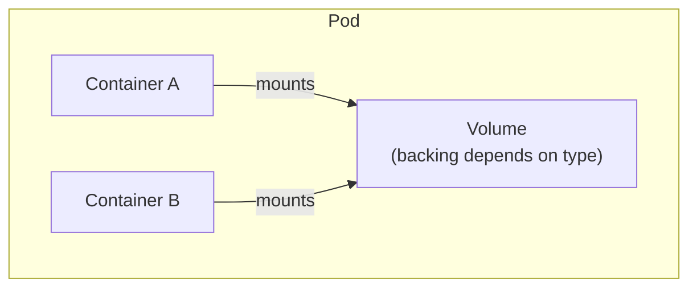

> [!important] Volume lifetime is tied to the Pod, not the container
> A container restarting **within** a live Pod does NOT lose volume data — the volume outlives individual container restarts. But most volume types (including `emptyDir`) are destroyed when the **Pod itself** is deleted. This is the critical distinction for the Voting App's `db` problem: `postgres` data lives in the container's writable layer or a basic volume today, so deleting the `db` Pod loses every vote — exactly the gap PersistentVolumes solve.

## 14.2 `emptyDir` — scratch space, born and destroyed with the Pod

```yaml
spec:
  containers:
    - name: app
      volumeMounts:
        - name: cache
          mountPath: /cache
    - name: sidecar
      volumeMounts:
        - name: cache
          mountPath: /cache
  volumes:
    - name: cache
      emptyDir: {}
      # emptyDir: {medium: Memory}   # optional — tmpfs-backed, RAM instead of disk
```

| Property | Detail |
|---|---|
| **Created** | Empty, when the Pod is assigned to a node |
| **Destroyed** | When the Pod is removed from the node (for ANY reason — deletion, eviction, node failure) |
| **Survives container restart?** | **Yes** — that's its whole purpose |
| **Survives Pod deletion?** | **No** |
| **Shared between containers in the Pod?** | Yes, if mounted into more than one |
| **Backing storage** | Node's disk (or RAM if `medium: Memory`) |

**Typical uses:** a scratch/cache directory, a hand-off point between an init container and the app (e.g., init container downloads a config file into `emptyDir`, app reads it), the shared directory a log-shipping sidecar tails.

## 14.3 `hostPath` — mounting the node's own filesystem

```yaml
volumes:
  - name: docker-sock
    hostPath:
      path: /var/run/docker.sock
      type: Socket
```

| `type` field | Meaning |
|---|---|
| `Directory` / `DirectoryOrCreate` | Must exist / created if missing |
| `File` / `FileOrCreate` | Must exist / created if missing |
| `Socket`, `CharDevice`, `BlockDevice` | Specific node-level resources |

> [!warning] `hostPath` is almost always the wrong answer for application data
> A `hostPath` volume ties a Pod to **whatever data happens to be on the specific node it lands on**. Reschedule the Pod to a different node (which Kubernetes does routinely) and it sees a completely different, likely empty, directory. It's appropriate for node-level system tooling that genuinely needs node access (a monitoring DaemonSet reading `/proc`, a CSI driver, log collectors reading `/var/log` on the node) — essentially never for stateful application storage like a database. This is a very common "gotcha" question: *"can I just use hostPath so my database survives a Pod restart?"* — no, because the Pod could reschedule to a different node with different (or no) local data.

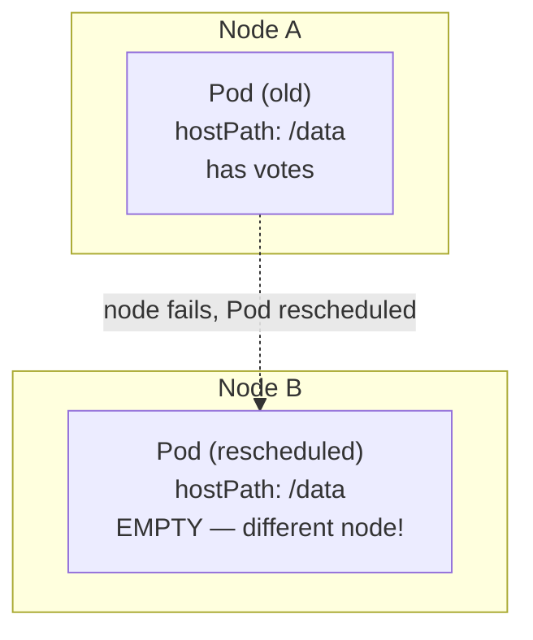

## 14.4 emptyDir vs hostPath — comparison

| | `emptyDir` | `hostPath` |
|---|---|---|
| Tied to a specific node? | No — created wherever the Pod lands | **Yes** — reads/writes THAT node's disk |
| Data survives Pod deletion? | No | Data physically remains on the node, but the next Pod may land elsewhere and never see it |
| Safe for stateful app data? | No (ephemeral by design) | No (node-coupled — worse for HA) |
| Appropriate use case | Cache, scratch space, init→app handoff | Node-level system access (monitoring, CSI drivers) |
| What actually solves durable storage? | Neither — see PV/PVC below | Neither |

---

# 15 · PersistentVolumes, PersistentVolumeClaims & StorageClass

## 15.1 The problem these solve

Neither `emptyDir` nor `hostPath` gives you storage that (a) survives Pod deletion AND (b) follows the Pod if it reschedules to a different node. For a real database, you need storage that exists **independently of any specific Pod or node** — backed by something like an EBS volume, an NFS share, or a cloud block-storage disk.

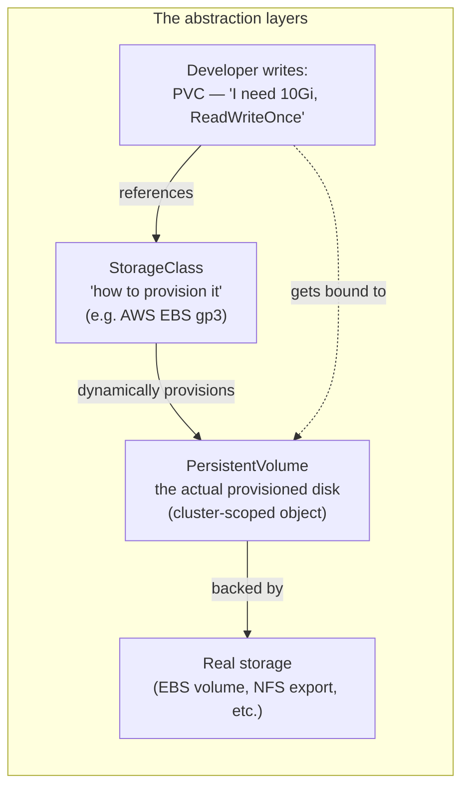

## 15.2 The three objects and their relationship

| Object | Scope | Analogy | Who creates it |
|---|---|---|---|
| **StorageClass** | Cluster-scoped | "A catalog of disk types you can order" (gp3, io2, NFS-backed, etc.) | Cluster admin (often pre-installed by the cloud provider, e.g. EKS ships a default `gp2`/`gp3` class) |
| **PersistentVolume (PV)** | Cluster-scoped | "An actual provisioned disk sitting in inventory" | Usually **auto-created** by the StorageClass's provisioner when a PVC requests one (dynamic provisioning) — rarely hand-written now |
| **PersistentVolumeClaim (PVC)** | **Namespaced** | "A request slip: I need 10Gi, ReadWriteOnce" | The application developer — this is what you actually write |

```yaml
# StorageClass — usually already exists in a real cluster (e.g. EKS's gp2)
apiVersion: storage.k8s.io/v1
kind: StorageClass
metadata:
  name: fast-ssd
provisioner: kubernetes.io/aws-ebs     # or ebs.csi.aws.com for the modern CSI driver
parameters:
  type: gp3
reclaimPolicy: Delete                   # what happens to the PV when the PVC is deleted
volumeBindingMode: WaitForFirstConsumer # don't provision until a Pod actually needs it
---
# PersistentVolumeClaim — what you actually write in your app manifests
apiVersion: v1
kind: PersistentVolumeClaim
metadata:
  name: db-pvc
  namespace: vote
spec:
  storageClassName: fast-ssd
  accessModes:
    - ReadWriteOnce
  resources:
    requests:
      storage: 10Gi
---
# Using it in a Pod/Deployment
spec:
  containers:
    - name: db
      volumeMounts:
        - name: data
          mountPath: /var/lib/postgresql/data
  volumes:
    - name: data
      persistentVolumeClaim:
        claimName: db-pvc
```

## 15.3 Static vs Dynamic provisioning

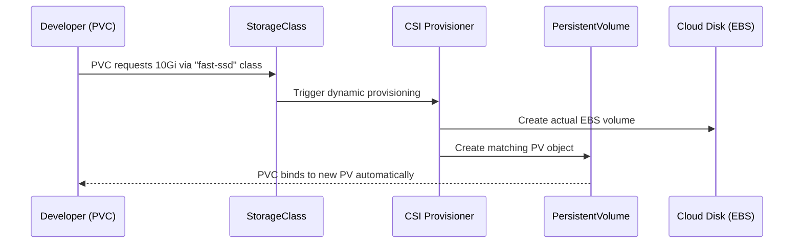

| | Static provisioning | Dynamic provisioning |
|---|---|---|
| Who creates the PV | An admin, by hand, in advance | The StorageClass's provisioner, on demand |
| When | Before any PVC needs it | The instant a matching PVC is created |
| Common in | Legacy on-prem, specific pre-existing disks | **Virtually all modern clusters**, especially cloud (EKS/GKE/AKS) |

## 15.4 Access modes

| Mode | Meaning | Typical backing storage |
|---|---|---|
| `ReadWriteOnce` (RWO) | Mounted read-write by a **single node** at a time | AWS EBS, most cloud block storage |
| `ReadOnlyMany` (ROX) | Mounted read-only by **many nodes** | Shared datasets |
| `ReadWriteMany` (RWX) | Mounted read-write by **many nodes** simultaneously | NFS, EFS, CephFS — NOT typically supported by EBS |
| `ReadWriteOncePod` (RWOP, newer) | Read-write by a single **Pod** (stricter than RWO's single-node) | Specific CSI drivers |

> [!warning] The RWX/EBS trap
> A very common real-world mistake: assuming any PVC can be mounted by multiple Pods simultaneously for write access. Standard AWS EBS volumes are **RWO** — one node at a time. Multi-Pod-writable shared storage on AWS needs EFS (RWX-capable) instead, with a different StorageClass/provisioner (`efs.csi.aws.com`).

## 15.5 Reclaim policy — what happens when the PVC is deleted

| Policy | Behavior when PVC is deleted |
|---|---|
| `Delete` (default for most dynamic classes) | The PV **and the underlying cloud disk are deleted** — data is gone |
| `Retain` | The PV survives, unbound and unavailable to new claims, until an admin manually cleans it up — data preserved but requires manual intervention |
| `Recycle` (deprecated) | Legacy scrub-and-reuse — don't use it |

> [!important] Production databases usually want `Retain`
> The default `Delete` policy is convenient for dev/test but dangerous for stateful production workloads — accidentally deleting a PVC (or the Deployment/StatefulSet that owns it) shouldn't silently destroy your actual data. Setting `reclaimPolicy: Retain` on the StorageClass (or PV) trades convenience for a manual recovery step, in exchange for making data loss much harder to trigger by accident.

## 15.6 PV/PVC/StorageClass Self-Check Q&A

1. **Q: You delete a PVC by mistake. Under what reclaim policy does your data survive, and what state is it in afterward?**
   A: Under `Retain`, the underlying PV and its data survive — but the PV moves to a `Released` state, unbound and unavailable for a new PVC to claim automatically. An admin must manually intervene (e.g., clear the `claimRef` or provision a fresh PV pointing at the same disk) before it can be reused.

2. **Q: A Deployment with 3 replicas all reference the same PVC with `accessModes: [ReadWriteOnce]`, backed by AWS EBS. What happens when the second and third Pods try to schedule, potentially on different nodes?**
   A: They fail to mount the volume — EBS-backed RWO volumes can only be attached read-write to one node at a time. This is exactly why StatefulSets (next section) give each replica its **own** PVC rather than sharing one, and why genuinely shared multi-writer storage needs an RWX-capable backend like EFS instead.

3. **Q: What's the actual difference between a PersistentVolume and a PersistentVolumeClaim — who "owns" which concept?**
   A: A PV represents the actual provisioned storage resource (cluster-scoped, admin/provisioner-facing). A PVC is a namespaced request for storage that an application developer writes, describing size and access mode needs without caring about the underlying implementation — the same abstraction pattern as a Pod requesting CPU/memory without knowing which node will supply it.

4. **Q: Why does `volumeBindingMode: WaitForFirstConsumer` matter in cloud environments with multiple Availability Zones?**
   A: Without it, a PV might get dynamically provisioned in AZ-A before the scheduler decides which node (possibly in AZ-B) the Pod will actually run on — since most cloud block storage can't attach across AZs, this causes the Pod to get permanently stuck unable to mount its volume. `WaitForFirstConsumer` delays provisioning until a Pod is actually scheduled, so the volume gets created in the correct AZ.

---

# 16 · StatefulSets — A First Look

## 16.1 Why Deployments aren't enough for stateful apps

A Deployment's Pods are interchangeable — same template, random hash suffixes, any one can be killed and replaced by an identical twin. That's exactly wrong for something like a database cluster, where each replica might have a distinct role (primary vs replica), its own dedicated storage, and needs a **stable, predictable identity** that survives rescheduling.

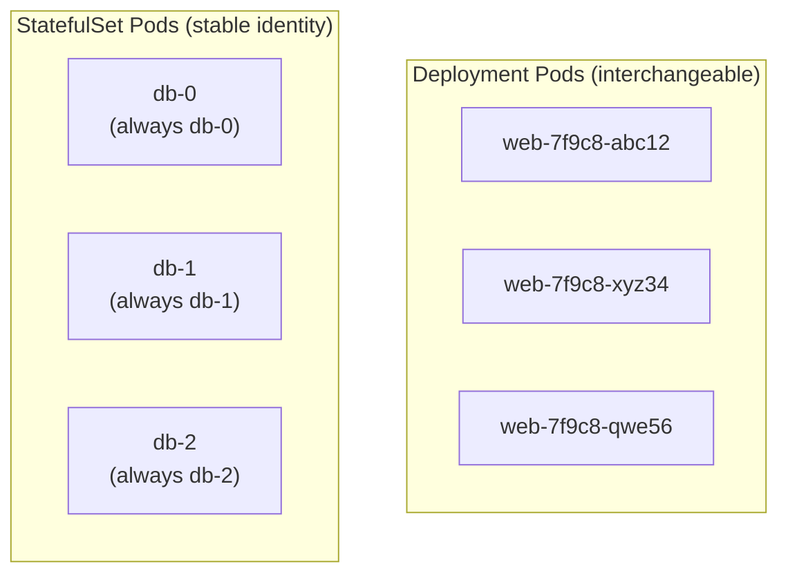

## 16.2 What a StatefulSet actually guarantees

| Guarantee | Deployment | StatefulSet |
|---|---|---|
| Pod naming | Random hash suffix | **Ordinal, predictable**: `<name>-0`, `<name>-1`, `<name>-2`... |
| Pod identity across reschedule | New random name | **Same name** — `db-1` deleted comes back as `db-1`, not a new random Pod |
| Startup/scale-down order | Parallel, any order | **Sequential**: `db-0` must be Running+Ready before `db-1` starts; scale-down happens in reverse |
| Storage per replica | Shared PVC (if any) — problematic for RWO | **Each replica gets its own PVC**, automatically, via `volumeClaimTemplates` |
| Network identity | One Service, load-balanced, no per-Pod DNS | **Requires a headless Service** — each Pod gets its own stable DNS: `db-0.db.vote.svc.cluster.local` |

```yaml
apiVersion: apps/v1
kind: StatefulSet
metadata:
  name: db
  namespace: vote
spec:
  serviceName: db          # MUST reference a headless Service
  replicas: 3
  selector:
    matchLabels:
      app: db
  template:
    metadata:
      labels:
        app: db
    spec:
      containers:
        - name: postgres
          image: postgres:14
          volumeMounts:
            - name: data
              mountPath: /var/lib/postgresql/data
  volumeClaimTemplates:      # <-- the key difference from a Deployment
    - metadata:
        name: data
      spec:
        accessModes: ["ReadWriteOnce"]
        resources:
          requests:
            storage: 10Gi
```

> [!important] `volumeClaimTemplates` — one PVC PER replica, automatically
> This is the mechanism that solves the "shared RWO volume" problem from section 15.6. Instead of one PVC referenced by every replica, Kubernetes stamps out a **uniquely-named PVC per Pod** (`data-db-0`, `data-db-1`, `data-db-2`), each bound to its own PV. When `db-1` reschedules to a different node, it reconnects to `data-db-1` specifically — not some other replica's disk.

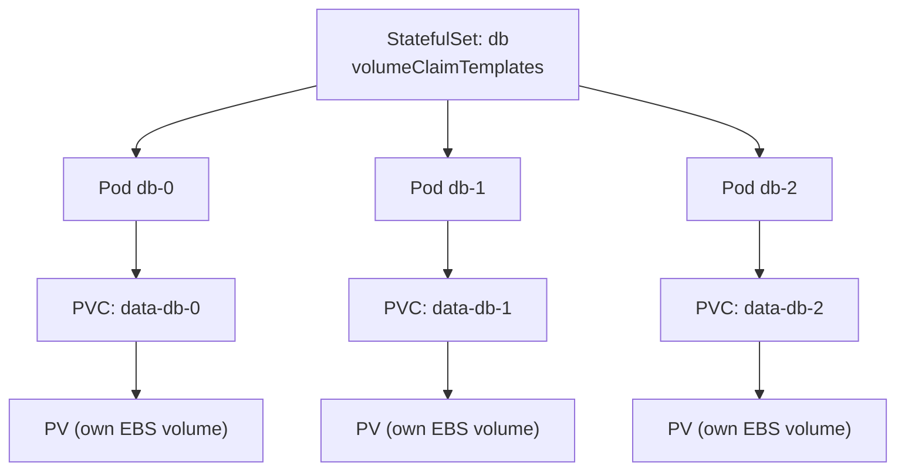

## 16.3 Why StatefulSets need a headless Service

```bash
kubectl get pods -l app=db
# db-0, db-1, db-2 — created and become Ready IN ORDER, one at a time

# each has its OWN resolvable DNS name:
# db-0.db.vote.svc.cluster.local
# db-1.db.vote.svc.cluster.local
# db-2.db.vote.svc.cluster.local
```

This is exactly the headless-Service mechanism — a normal ClusterIP Service load-balances across all backing Pods anonymously, which is the opposite of what a client needs when it must talk to `db-0` specifically (e.g., to write to the primary in a primary-replica topology).

> [!warning] StatefulSets are not "the database solution" — they're a building block
> A StatefulSet alone gives you stable identity + per-replica storage + ordered startup. It does **not** automatically give you replication, leader election, or failover logic — that's the database engine's own job (or a dedicated Kubernetes Operator, like the Zalando or CrunchyData Postgres Operators, built specifically to manage that on top of StatefulSets). For the ITI course's single-replica `db`, a StatefulSet mainly buys stable identity and a dedicated PVC — the "first look" framing is accurate; full multi-replica stateful architectures are a much deeper topic.

## 16.4 StatefulSet Self-Check Q&A

1. **Q: You scale a StatefulSet from 3 to 1 replica. Which Pods get terminated, and in what order?**
   A: The **highest-ordinal** Pods first, in reverse order — `db-2` terminates before `db-1`. Scale-down is the mirror of the sequential, ordered startup, specifically to avoid disrupting a lower-ordinal Pod (often a primary/leader) while higher-ordinal replicas are still shutting down.

2. **Q: Why can't you just use a Deployment with `volumeClaimTemplates` to get per-replica storage?**
   A: `volumeClaimTemplates` doesn't exist on Deployments/ReplicaSets at all — it's a StatefulSet-specific field. Deployments assume all replicas are identical and interchangeable, which is fundamentally incompatible with "each replica owns its own distinct disk."

3. **Q: A StatefulSet Pod `db-1` is deleted. Does its replacement get a new PVC, or reattach to the old one?**
   A: It reattaches to the **same** PVC (`data-db-1`) and therefore the same underlying PV/disk — that's the entire point of the per-ordinal naming scheme. Contrast this with a Deployment Pod dying: its replacement is a completely new, unrelated Pod with no storage continuity guarantee unless you engineered one yourself.

4. **Q: Why is a headless Service (`clusterIP: None`) mandatory for a StatefulSet, rather than just a nice-to-have?**
   A: The StatefulSet controller uses the headless Service to create individual DNS records for each Pod ordinal (`db-0.db...`, `db-1.db...`). A normal ClusterIP Service would only expose one load-balanced virtual IP, making it impossible for a client (or another replica, for replication traffic) to address a specific ordinal by name.

---

# 17 · Health Probes — Liveness, Readiness & Startup

## 17.1 The core problem: "Running" isn't "Working"

`READY: 1/1` and phase `Running` only mean the container process started — not that the application inside is actually able to serve traffic correctly. Probes are how you teach Kubernetes to tell the difference.

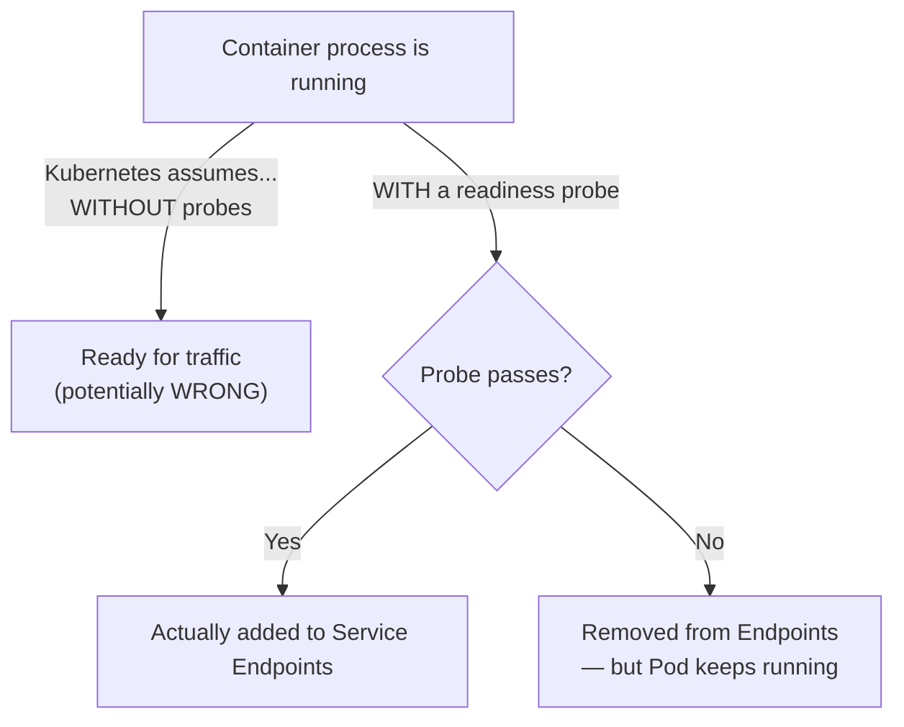

## 17.2 The three probe types

| Probe | Question it answers | Failure action | Typical use |
|---|---|---|---|
| **Liveness** | "Is this container still alive/healthy, or is it stuck/deadlocked?" | Kubelet **kills and restarts** the container | Detecting an app that's hung (accepting connections but never responding) |
| **Readiness** | "Is this container ready to receive traffic right now?" | Pod is **removed from Service Endpoints** — traffic stops routing to it — but the container is NOT killed | Warming up on startup, temporarily overloaded, lost a downstream dependency |
| **Startup** | "Has this SLOW-starting container finished initializing yet?" | Liveness/readiness probes are **suppressed** until startup succeeds; if startup itself fails enough times, the container is killed | Apps with long, variable startup time (JVM apps, apps doing a big cache warm-up) — protects them from being liveness-killed mid-startup |

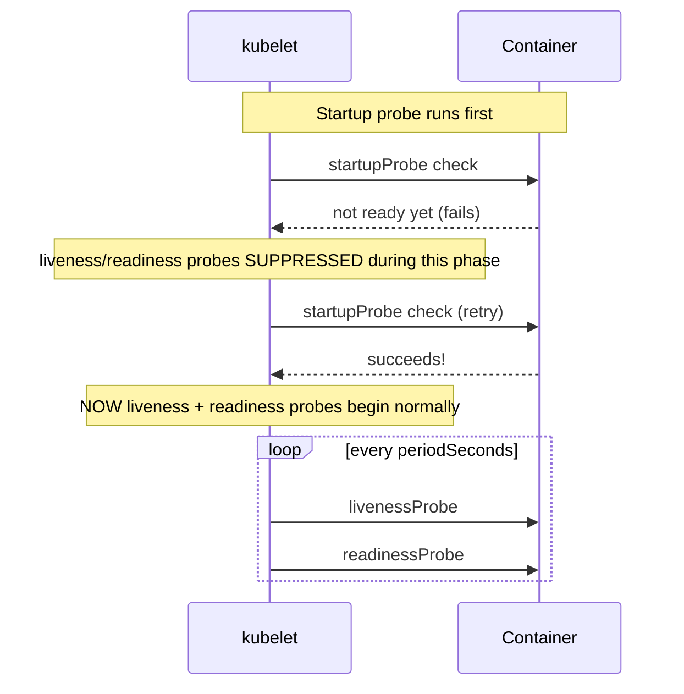

## 17.3 Probe mechanisms — three ways to check

```yaml
livenessProbe:
  httpGet:                    # 1. HTTP GET — success = 2xx/3xx response
    path: /healthz
    port: 80
  initialDelaySeconds: 15      # wait before the FIRST check
  periodSeconds: 10            # how often to check
  timeoutSeconds: 1            # how long to wait for a response
  failureThreshold: 3          # consecutive failures before acting
  successThreshold: 1          # consecutive successes to go back to "passing" (readiness only, must be 1 for liveness)

readinessProbe:
  exec:                        # 2. exec — success = exit code 0
    command: ["cat", "/tmp/ready"]
  periodSeconds: 5

startupProbe:
  tcpSocket:                   # 3. TCP socket — success = port accepts a connection
    port: 5432
  failureThreshold: 30         # 30 x 10s = 5 minutes to finish starting up
  periodSeconds: 10
```

| Mechanism | How it checks | Best for |
|---|---|---|
| `httpGet` | GETs a URL path, treats 2xx/3xx as success | Web apps/APIs with a dedicated health endpoint |
| `exec` | Runs a command inside the container, exit code 0 = success | Apps without an HTTP interface, custom health logic |
| `tcpSocket` | Attempts a TCP connection to a port | Simple "is something listening" checks — less precise than HTTP |
| `grpc` (newer) | Uses the gRPC health-checking protocol | Native gRPC services |

## 17.4 The Voting App applied — closing the rolling-update gap

Rolling updates with `maxUnavailable: 0` still drop requests without a readiness probe, because "Ready" defaults to meaning only "the container started." Wiring up a real readiness probe is exactly what closes that gap:

```yaml
apiVersion: apps/v1
kind: Deployment
metadata:
  name: vote
spec:
  replicas: 2
  strategy:
    rollingUpdate:
      maxSurge: 1
      maxUnavailable: 0
  template:
    spec:
      containers:
        - name: vote
          image: iti/vote:v2
          readinessProbe:
            httpGet:
              path: /
              port: 80
            initialDelaySeconds: 3
            periodSeconds: 5
          livenessProbe:
            httpGet:
              path: /
              port: 80
            initialDelaySeconds: 10
            periodSeconds: 10
            failureThreshold: 3
```

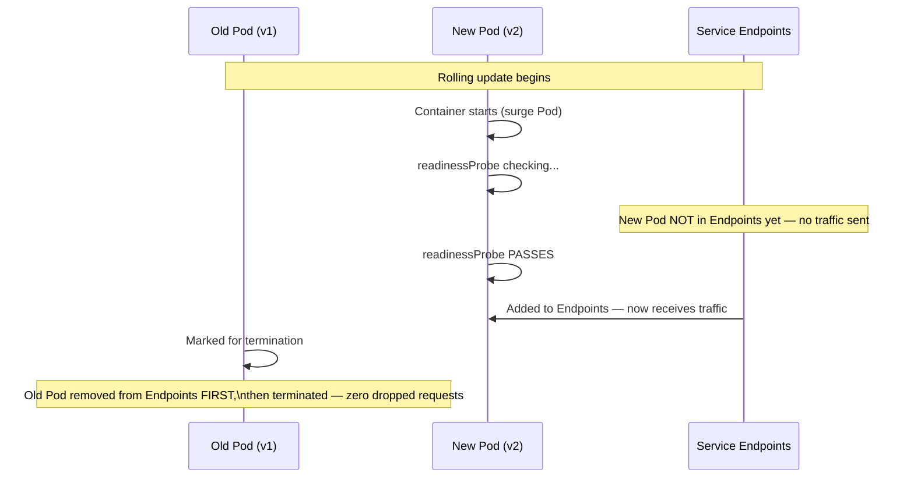

## 17.5 Common probe misconfigurations

> [!warning] The liveness-probe death spiral
> Setting a liveness probe too aggressively (short `periodSeconds`, low `failureThreshold`) on an app that's briefly slow — say, during a garbage-collection pause or a burst of traffic — causes Kubernetes to kill and restart a perfectly healthy container mid-request. Under load, this can cascade: killing Pods reduces capacity, increasing load on survivors, causing more probe failures, more restarts. **Liveness probes should be conservative** — they answer "is this fundamentally broken and needs a hard restart," not "is this momentarily slow."

> [!warning] Liveness and readiness pointed at the same endpoint, with the same thresholds
> If both probes check identical criteria, you lose the whole point of having two separate signals: a temporarily-overloaded-but-not-broken app should fail readiness (pull it from traffic, let it recover) without also triggering liveness (killing it entirely, which doesn't help an overload problem and adds cold-start cost on top).

## 17.6 Probe comparison table

| | Liveness | Readiness | Startup |
|---|---|---|---|
| **Failing means** | Container restarted | Pod pulled from Service Endpoints (stays running) | Liveness/readiness held off; enough failures = container killed |
| **Purpose** | Recover from a stuck/deadlocked process | Prevent traffic from reaching a not-yet-ready or temporarily-degraded Pod | Protect slow-starting apps from being liveness-killed during legitimate startup |
| **Runs when** | Continuously, after startup succeeds | Continuously, after startup succeeds | Only during initial startup, then stops |
| **Should be aggressive or conservative?** | Conservative — false positives are costly (unnecessary restarts) | Can be more sensitive — false positives just mean temporarily less capacity, not a restart | Generous `failureThreshold` × `periodSeconds` to cover worst-case startup time |

## 17.7 Health Probes Self-Check Q&A

1. **Q: A readiness probe starts failing for one Pod out of three behind a Service. What happens to that Pod, and what happens to the other two?**
   A: The failing Pod is removed from the Service's Endpoints (traffic stops routing to it) but keeps running — it is NOT restarted. The other two Pods are unaffected and continue receiving traffic normally; total capacity temporarily drops to 2/3.

2. **Q: Why does an aggressive liveness probe risk making an overload situation WORSE rather than better?**
   A: If the app is slow because it's overloaded (not broken), a liveness probe with a short timeout/low failure threshold will interpret "slow" as "dead" and kill the container — which removes capacity right when it's needed most, pushing more load onto the remaining Pods and potentially triggering their liveness failures too, in a cascading death spiral.

3. **Q: You have a JVM-based app that takes 90 seconds to fully initialize (class loading, cache warm-up) before it can respond to any HTTP request. Without a startup probe, what goes wrong with a normally-configured liveness probe (`initialDelaySeconds: 15`)?**
   A: The liveness probe starts checking at 15 seconds, well before the app is actually ready at 90 seconds — it will see failures, hit its `failureThreshold`, and kill the container mid-startup, restarting it into the exact same slow-startup cycle repeatedly (`CrashLoopBackOff`, even though the app was never actually broken).

4. **Q: What's the correct fix for the scenario in Q3, and why is it better than just setting `initialDelaySeconds: 120` on the liveness probe directly?**
   A: Add a `startupProbe` with a generous `failureThreshold × periodSeconds` (e.g., 30 × 10s = 5 minutes) covering worst-case startup time; liveness/readiness are suppressed until it succeeds. This is better than a huge `initialDelaySeconds` on liveness because it doesn't blindly wait the full worst-case time on every restart — a fast restart is detected as fast, while still tolerating a genuinely slow one. `initialDelaySeconds` alone is a fixed wait regardless of actual readiness.

5. **Q: A Pod is `1/1 Running` with no probes configured at all. A rolling update to that Deployment begins. What's the actual risk, concretely?**
   A: Without a readiness probe, the new surge Pod is added to Service Endpoints the instant its container process starts — even if the app hasn't finished loading its config, warming a cache, or opening its DB connection pool yet. Real user requests can be routed to it and fail or time out during that gap.

---

#  End of Day 3 — Summary Diagram

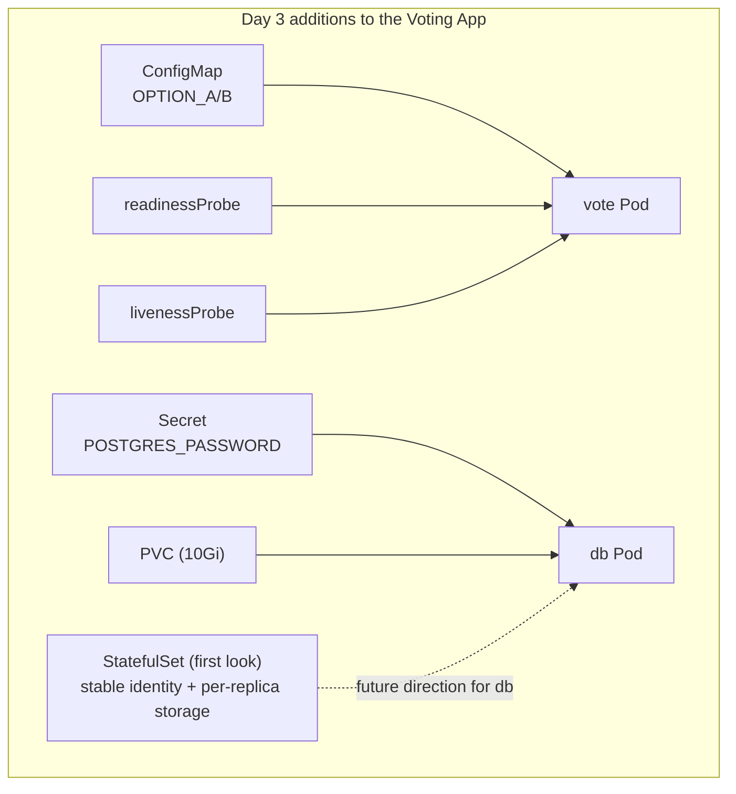

> [!tip] What Day 3 actually fixed, end to end
> - The Postgres password left the plain YAML → now a Secret.
> - Votes survive a `db` Pod kill → now backed by a PersistentVolumeClaim instead of ephemeral container storage.
> - "Zero-downtime" became real → readiness probes now gate traffic correctly during rollouts.
> - The database got a path toward genuine stable identity → StatefulSets, to be built on further with multi-replica topologies later.
