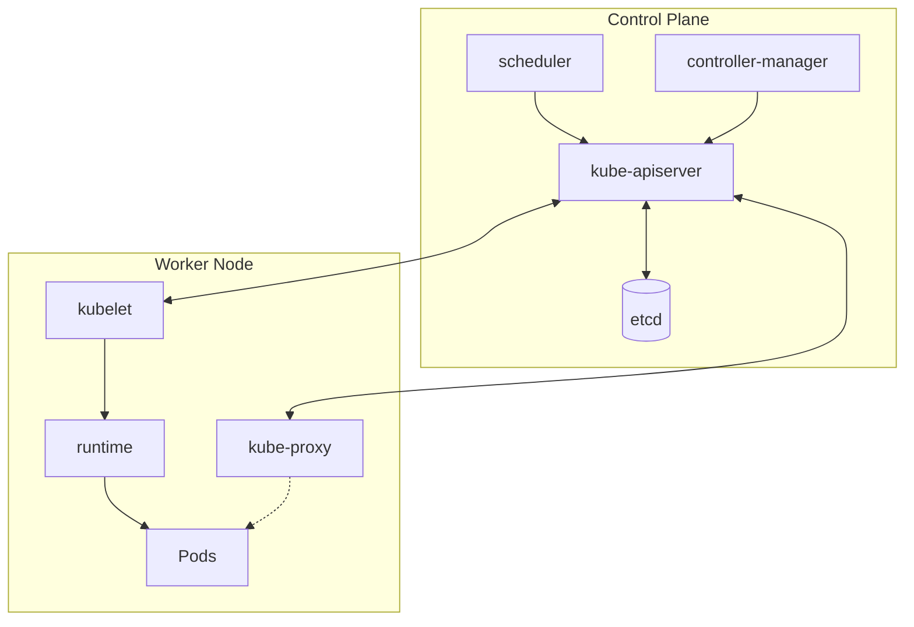
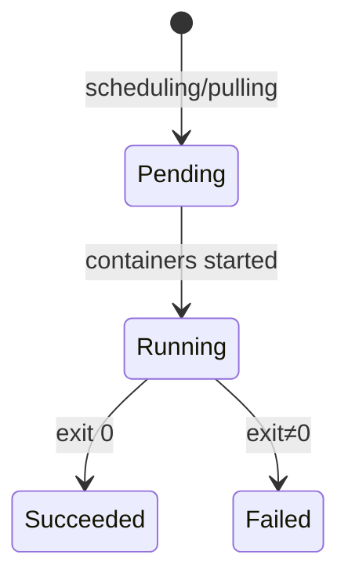
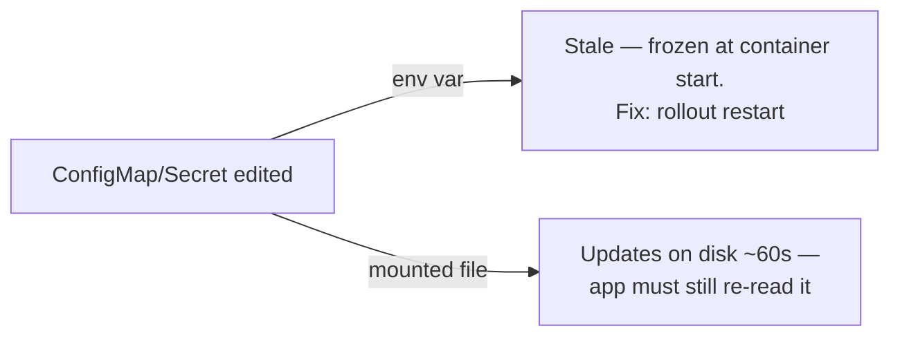

#  Kubernetes — Master Summary (Days 1–3)

> [!info] Purpose of this note
> This is a **cram sheet**, not a teaching doc — for fast review before a quiz, interview, or lab. Full explanations + diagrams live in your Day 1 / Day 2 / Day 3 detailed notes. Everything here should be recognizable at a glance.

```dataview
TABLE status, category, date FROM #devops WHERE contains(subject, "Kubernetes")
```

---

##  The Whole Course in One Table

| Day | Theme | Key objects introduced |
|---|---|---|
| 1 | Foundations | Cluster architecture, kubectl, Namespace, Label/Selector, Pod |
| 2 | Workloads & Networking | ReplicaSet, Deployment, Service, EndpointSlice, init/sidecar containers, ConfigMap |
| 3 | Config, Storage & Health | Secret, emptyDir, hostPath, PV/PVC/StorageClass, StatefulSet, Probes |
| 4 | Scale & Production | *(not yet covered)* requests/limits, HPA, Jobs/CronJobs, Ingress, NetworkPolicy, Helm |

---

##  Cluster Architecture — One Diagram



| Component | One-line job |
|---|---|
| kube-apiserver | Only front door — everyone talks through it |
| etcd | Cluster's entire state — lose it, lose the cluster |
| scheduler | Picks a node for each new Pod |
| controller-manager | Runs all reconciliation loops |
| kubelet | Node agent — starts containers, reports status |
| kube-proxy | Programs iptables/IPVS rules for Service traffic |

**Ownership chain (GC follows this):** `Deployment → ReplicaSet → Pod → Container` · also `Service → EndpointSlice`, `PVC → PV`, `CronJob → Job → Pod`, `HPA → Deployment`, `StatefulSet → Pod + PVC (per replica)`

**Distributions:** kubeadm (full DIY) · k3s (lightweight, edge) · **EKS** (AWS-managed control plane — your target production model)

---

##  kubectl Cheat Sheet

```bash
kubectl get pods -A -o wide                    # everywhere, extra columns
kubectl describe pod X                          # #1 debug command — read Events
kubectl logs X -f / --previous                  # live / the run that died
kubectl exec -it X -- sh                        # shell in
kubectl apply -f file.yaml                       # declarative — default choice
kubectl rollout status|undo|history|restart deploy/X
kubectl scale deploy/X --replicas=N
kubectl get endpoints X                          # #1 networking debug command
kubectl config current-context                   # ALWAYS check before destructive ops
```

`command:`/`args:` are **lists**, not shell strings → need `["sh","-c","..."]` for `&&` etc.
Imperative = fast/no record. Declarative = git source of truth = GitOps foundation.

---

##  Namespaces & Labels

| Namespaces | Labels |
|---|---|
| Scope names, RBAC, quota — **NOT network isolation** | How EVERYTHING finds Pods — never by name |
| `<svc>.<ns>.svc.cluster.local` | `matchLabels` / `matchExpressions` selectors |
| Deleting ns deletes everything inside | Typo'd label = silent zero-match, no error |
| `kubectl get all` ≠ everything (no Secrets/CM/PVC) | Labels = queryable; Annotations = not queryable |

---

##  Pods — Lifecycle Quick Reference



| Failure | Meaning | First command |
|---|---|---|
| `ImagePullBackOff` | Node never got the image — **no container ever started, no logs** | `describe pod` (only tool that works) |
| `CrashLoopBackOff` | Container starts, then dies — backoff 10s→20s→40s...5min cap | `logs --previous` |
| `OOMKilled` (exit 137) | Container exceeded memory limit | check `resources.limits.memory` |
| `0/1 Running` | Alive but NOT ready to serve — Ready ≠ Running | check readiness probe |

`restartPolicy` (Always/OnFailure/Never) restarts **containers**, never resurrects a **deleted Pod** — that needs a controller.

**Debug order:** `describe` → `logs` → `get events` → `exec` (cheapest/most informative first).

---

##  ReplicaSet vs Deployment

| | ReplicaSet | Deployment |
|---|---|---|
| Job | Keep Pod count == desired, by label selector | Everything RS does + rollouts/history/rollback |
| You write it? | **Never directly** | Yes — always |
| `spec.selector` | — | **Immutable** — API rejects changes outright |

```bash
kubectl set image deploy/web nginx=nginx:1.29
kubectl rollout status deploy/web
kubectl rollout undo deploy/web        # old RS still exists at 0 replicas
```

| Field | Meaning |
|---|---|
| `maxSurge` | How far ABOVE replicas you may go |
| `maxUnavailable` | How far BELOW ready you may dip (`0` = never drop capacity) |

 Revision created only on **Pod template** change, not on scaling. "Ready" without a probe just means "container started," not "app works."

---

##  Networking — Services, DNS, Ports

| Type | Reach | AWS parallel |
|---|---|---|
| **ClusterIP** (default) | Inside cluster only | Internal ALB/NLB |
| **NodePort** | `<node-ip>:30000-32767` | SG rule open cluster-wide |
| **LoadBalancer** | Public internet (built ON TOP of NodePort) | AWS ELB/NLB |
| **Headless** (`clusterIP: None`) | DNS returns Pod IP **list**, no LB | Route 53 multivalue |


| Field | Lives in | Meaning |
|---|---|---|
| `containerPort` | Pod | Documentation only — opens nothing |
| `targetPort` | Service | Forwarded TO the Pod — **must match app's real port** |
| `port` | Service | What clients dial |
| `nodePort` | Service | Opened on every node |

**DNS:** `<svc>.<ns>.svc.cluster.local` · short name only resolves in same namespace · `ndots:5` = external calls pay a 4x DNS tax unless trailing-dotted.

> [!warning] #1 debug command: `kubectl get endpoints <svc>`
> Empty = selector/label/readiness problem. Populated = app-level bug, not networking.

Service is just an object — **kube-proxy + iptables/IPVS** do the actual load balancing, driven by EndpointSlices the endpoints controller writes.

---

##  Multi-Container Pods

| Shared automatically | Shared if you opt in | Never shared |
|---|---|---|
| Network (`localhost`, one Pod IP, one port space) | Volumes (explicit mounts) | Root filesystem, env vars |

| | Init container | Sidecar |
|---|---|---|
| When | Before app, sequential, must exit 0 | Alongside app, whole Pod life |
| Failure | App never starts (`Init:0/1`) | App keeps running, Pod may go NotReady |
| Logs | `kubectl logs X -c <init-name>` required | same `-c` flag |
| K8s 1.29+ | — | native sidecar = init container + `restartPolicy: Always` |

---

##  ConfigMaps & Secrets

| | ConfigMap | Secret |
|---|---|---|
| Storage | Plain text | base64 ( encoding, NOT encryption) |
| `describe` shows value | Yes | No |
| Volume backing | Disk | `tmpfs` (RAM only) |
| Injection mechanics | Identical: env or mounted file | Identical: env or mounted file |



 `subPath` mounts **never** auto-update, unlike whole-directory mounts.
 `envFrom`/`secretRef` = no renaming, invalid keys silently dropped. `*KeyRef` = explicit, renameable.
Real production pattern: AWS Secrets Manager/Vault as source of truth → External Secrets Operator syncs into K8s Secrets.

---

##  Storage — emptyDir · hostPath · PV/PVC/StorageClass

| | Survives container restart | Survives Pod deletion | Tied to a node |
|---|---|---|---|
| `emptyDir` |  |  | No — wherever Pod lands |
| `hostPath` |  | data stays, but new Pod may land elsewhere | **Yes** — almost never right for app data |
| PV/PVC |  |  | No — follows the claim |


| Access mode | Meaning |
|---|---|
| RWO | One node, read-write (typical EBS) |
| ROX | Many nodes, read-only |
| RWX | Many nodes, read-write (needs EFS, not EBS) |

`reclaimPolicy: Delete` (default, risky) vs `Retain` (safer for prod — manual cleanup required).
`volumeBindingMode: WaitForFirstConsumer` avoids provisioning a PV in the wrong AZ.

---

##  StatefulSets — First Look

| | Deployment | StatefulSet |
|---|---|---|
| Pod names | Random hash | Ordinal: `db-0`, `db-1`... stable |
| Storage | Shared/none | `volumeClaimTemplates` → **one PVC per replica** |
| Start/scale order | Parallel | Sequential up, reverse down |
| Needs | Any Service | **Headless Service mandatory** (`db-0.db.ns.svc.cluster.local`) |

StatefulSet ≠ automatic replication/failover — that's the DB engine's or an Operator's job.

---

##  Probes

| | Liveness | Readiness | Startup |
|---|---|---|---|
| Fails → | Container **killed & restarted** | Pod pulled from Endpoints, stays running | Suppresses other probes until it passes |
| Purpose | Detect stuck/deadlocked process | Gate traffic during warm-up/overload | Protect slow-starting apps |
| Tune | **Conservative** — false positives = needless restarts | Can be sensitive | Generous `failureThreshold × periodSeconds` |

Mechanisms: `httpGet` (2xx/3xx) · `exec` (exit 0) · `tcpSocket` (connects) · `grpc`.
No readiness probe = rolling updates route traffic to not-actually-ready Pods, even at `maxUnavailable: 0`.

---

##  The "Gotcha" List — Every Silent Trap in One Place

| Trap | Symptom | Fix |
|---|---|---|
| Selector/label typo | Service healthy but 0 traffic | `get endpoints`, `--show-labels` |
| `spec.selector` change | API rejects Deployment update | `--cascade=orphan`, recreate, sweep |
| Env var from CM/Secret edited | Value never updates in running Pod | `kubectl rollout restart` |
| `subPath` mount | File never auto-updates | Avoid `subPath` if live updates matter |
| `mountPath: /etc` | Wipes the whole directory for that container | Mount into a dedicated empty dir |
| `command:` set | Silently discards image's CMD too | Know Dockerfile ENTRYPOINT/CMD mapping |
| Local image on kind | `ImagePullBackOff`, image "exists" on your laptop | `kind load docker-image` |
| RWO PVC + multi-replica Deployment | Only first Pod mounts, rest fail | Use StatefulSet + `volumeClaimTemplates`, or EFS/RWX |
| No readiness probe | Rolling update drops real requests anyway | Add `readinessProbe` |
| Aggressive liveness probe | Cascading restart death-spiral under load | Conservative thresholds, separate from readiness |
| `hostPath` for app data | Data "disappears" after reschedule | Use PV/PVC instead |
| ndots:5 + external DNS calls | 4x DNS latency on outbound calls | Trailing dot, or tune `dnsConfig` |

---

##  Rapid-Fire Interview Bank

- Pod vs container? → Pod = shared network+volume wrapper; smallest schedulable unit.
- 5 object fields? → apiVersion, kind, metadata, spec, status.
- Namespace = security boundary? → No.
- Why never write a ReplicaSet directly? → Deployments give rollout/history/rollback for free.
- `port` vs `targetPort` vs `nodePort` vs `containerPort`? → client-facing / Pod-facing / node-facing / documentation-only.
- Fastest Service debug command? → `kubectl get endpoints <svc>`.
- Headless Service — when? → Client needs individual Pod addresses (StatefulSets, DB replicas).
- Init vs sidecar? → Sequential/before-app-starts vs parallel/whole-Pod-life.
- ConfigMap vs Secret — real difference? → Handling discretion (hidden from describe, tmpfs, base64) — **not** encryption.
- Why does editing a ConfigMap/Secret not update a running Pod's env vars? → Frozen at container start; need `rollout restart`.
- emptyDir vs hostPath vs PV? → ephemeral-shared / node-coupled-dangerous / durable-and-portable.
- StatefulSet's core guarantee? → Stable ordinal identity + per-replica PVC + ordered start/stop.
- Liveness vs readiness — failure action? → Kill & restart vs pull from traffic (stays alive).
- Why is an aggressive liveness probe dangerous under load? → Kills healthy-but-slow Pods, shrinking capacity further → cascade.

---

##  Self-Assessment — Can You Explain These Without Notes?

- [ ] The full request path of `kubectl apply -f deploy.yaml` through to a running container
- [ ] Why `spec.selector` is immutable on a Deployment
- [ ] The difference between what kills a Pod: OOMKilled vs CrashLoopBackOff vs ImagePullBackOff
- [ ] Why a Service "looking healthy" doesn't mean it's routing traffic
- [ ] The four ports and which one is most likely to cause "connection refused"
- [ ] Why ConfigMap/Secret env vars go stale, and the one command that fixes it
- [ ] Why `hostPath` is wrong for a database, in your own words
- [ ] Why a StatefulSet needs a headless Service, specifically
- [ ] The difference between what liveness vs readiness probe failures actually do
