# Kubernetes Complete Monolithic Guide


# ☸️ Kubernetes — Day 1: Foundations

> [!info] Scope
> Containers → orchestration · cluster architecture · distributions · `kubectl` · namespaces · labels & selectors · Pods (lifecycle, failure states, env/command/args) · ReplicaSets & Deployments.
>
> [!warning] One heads-up
> Per the actual ITI course roadmap, **ReplicaSets & Deployments (section 09 below) are technically Day 2 content** ("Workloads & networking"), not Day 1 ("Foundations & first contact"). Included here as one consolidated note — easy to split out if you want a strict 1:1 match with the course's day boundaries.

## 🗺️ Where this sits in the course

| Day | Theme | Covered here? |
|---|---|---|
| **1** | Foundations & first contact | ✅ Sections 01–08 |
| **2** | Workloads & networking | ⚠️ Section 09 only (ReplicaSets/Deployments) — rest lives in a separate Day 2 note |
| 3 | Configuration, storage & health | Separate note |
| 4 | Scheduling, scale & production | Not yet built |

---

# 01 · The Old Way — Why We Need an Orchestrator

## Three eras

| Era | Isolation | Weakness |
|---|---|---|
| Bare metal | None — apps share OS | Snowflake servers, drift, waste |
| Virtual Machines | Full guest OS per app | Heavy — 3 apps = 3 booted OSes |
| Containers | namespaces + cgroups | Still **one process, one host** — nobody restarts it when it dies |

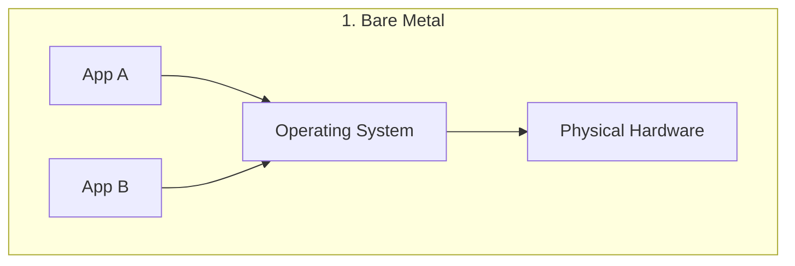

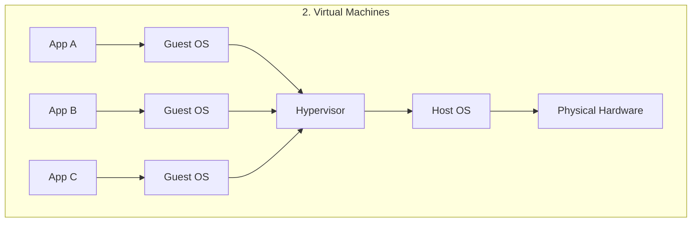

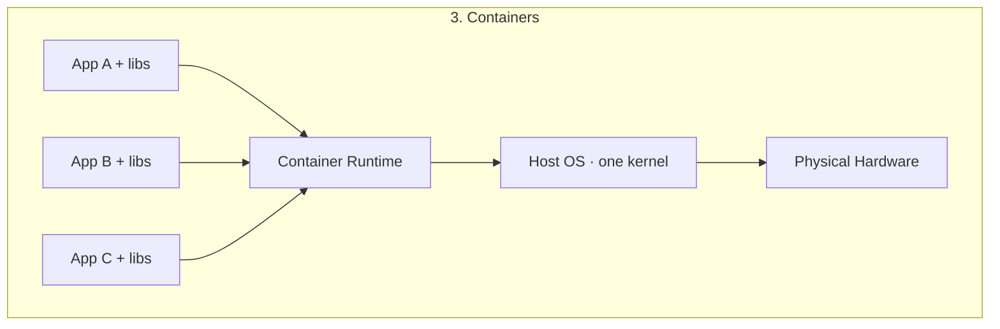

> [!tip] Docker Compose was the first taste of "desired state"
> `docker compose up -d` reconciles reality to a YAML file. But it's **single-host only** — the ceiling Kubernetes exists to break through.

### Where Compose stops

| Problem | Why Compose can't solve it |
|---|---|
| Host dies | Every container dies with it — nothing reschedules elsewhere |
| Traffic spike | Can `scale` on one box, then you run out of box |
| Zero-downtime release | Compose just restarts — no rolling strategy |
| Many machines | Nothing decides placement or reshuffles on node death |

### 🤔 Self-Check Q&A

1. **Q: Why is a container fundamentally different from a VM in terms of isolation?**
   A: Containers share the host kernel and are isolated via Linux namespaces + cgroups (fast, lightweight). VMs virtualize hardware and boot a full separate guest OS per app (strong isolation, heavy resource cost).
2. **Q: What single architectural assumption does Docker Compose make that Kubernetes removes?**
   A: That everything runs on **one host**. Kubernetes treats many nodes as one pool.
3. **Q: A container crashes under plain `docker run`. What restarts it?**
   A: Nothing, unless you set a `--restart` policy — and even then, only on that same host. There's no cross-host rescheduling without an orchestrator.

---

# 02 · Why Kubernetes — The Control Loop

Kubernetes = **you declare desired state → controllers continuously reconcile actual state toward it, forever.**

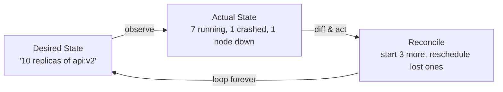

## Compose vs Kubernetes

| Concern | Docker Compose | Kubernetes |
|---|---|---|
| Scope | One host | Many nodes as one pool |
| Container dies | Optional restart, same host | Rescheduled anywhere, automatically |
| Scaling | `--scale` on one box | Replicas across nodes; autoscaling |
| Releases | Recreate containers | Rolling updates + instant rollback |
| Networking | One bridge network | Cluster-wide Services + DNS + Ingress |
| Best for | Local dev | **Production** at scale, HA |

> [!info] They're friends, not rivals
> You often use Compose on your laptop and Kubernetes in production — same images, bigger stage.

### 🤔 Self-Check Q&A

1. **Q: In the reconciliation loop, who writes `spec` and who writes `status`?**
   A: You (the human) write `spec` — the desired state. Controllers write `status` — the observed state. You never hand-edit `status`.
2. **Q: Is the reconciliation loop a one-time action or continuous?**
   A: Continuous, forever — "↻ forever." It never stops comparing desired vs actual.
3. **Q: Kubernetes and Docker Compose both use declarative YAML. What actually separates them in production?**
   A: Scope and automation depth — Compose reconciles one host; Kubernetes reconciles a fleet, reschedules across node failures, and adds rolling updates, autoscaling, and cluster-wide service discovery that Compose has no concept of.

---

# 03 · Cluster Architecture

## 🎯 Control Plane vs Worker Nodes

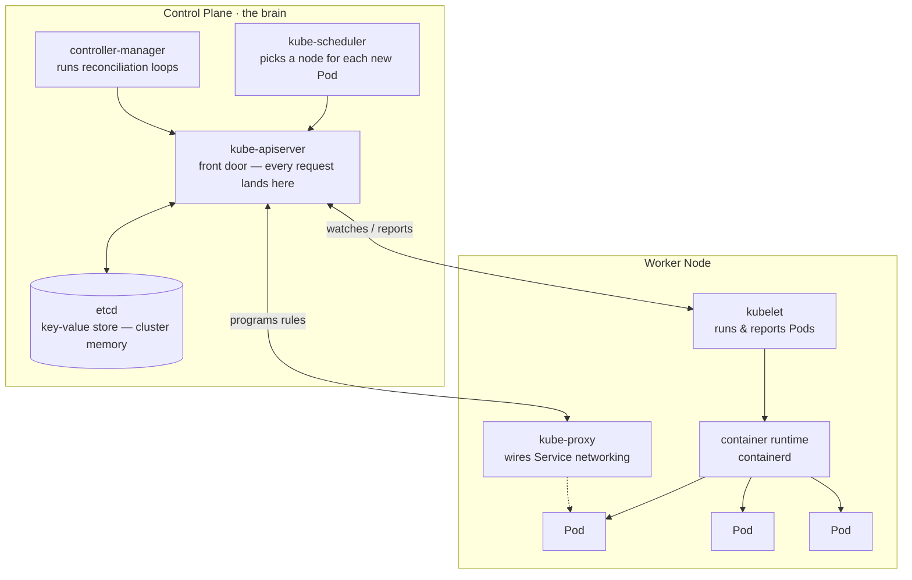

> [!info] Mental model
> Control plane **decides**. kubelet **does**. kube-proxy **connects**. Runtime **runs**.

## Component responsibilities

| Component | Job |
|---|---|
| **kube-apiserver** | The ONLY component everyone talks to. Validates, reads/writes etcd. |
| **etcd** | Consistent KV store — the entire cluster's state. Lose it, lose the cluster. |
| **kube-scheduler** | Watches unscheduled Pods, picks best-fit node. |
| **controller-manager** | Runs reconciliation loops (Deployment, ReplicaSet, Node controllers). |
| **kubelet** | Node agent — starts containers per spec, reports status. Node is `NotReady` if kubelet is down. |
| **kube-proxy** | Programs node network rules so Service traffic reaches the right Pods. |
| **container runtime** | containerd/CRI-O — actually pulls images and runs containers. |

## What happens on `kubectl apply` — full request flow

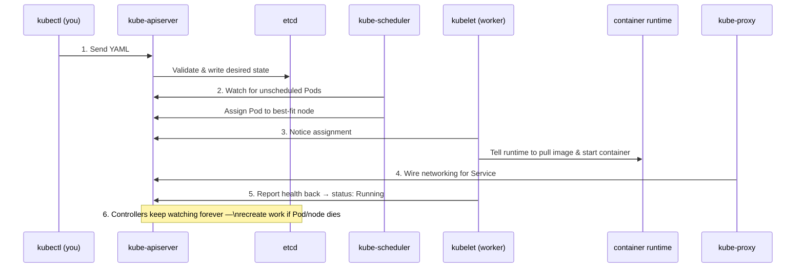

## The Object Model — every object, same 5 fields

```yaml
apiVersion: apps/v1        # which API group + version
kind: Deployment            # what type of object
metadata:                   # who am I (name, namespace, labels)
  name: vote
  namespace: vote
spec:                        # what I WANT (you write this)
  replicas: 3
status:                       # what IS (the cluster writes this)
  readyReplicas: 3
```

## Resource hierarchy / ownership chain

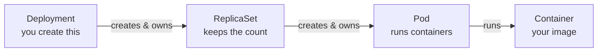

> [!important] Ownership & garbage collection
> Each object stores its parent in `metadata.ownerReferences`. Delete the parent → GC deletes the children. That's why deleting a Deployment removes its Pods. Other chains: `Service → Endpoints`, `PVC → PV`, `CronJob → Job → Pod`, `HPA → Deployment`.

| Scope | Examples | `-n` flag |
|---|---|---|
| **Namespaced** | Pod, Service, Deployment, ConfigMap, Secret, PVC | Required |
| **Cluster-scoped** | Node, Namespace, PersistentVolume, StorageClass, ClusterRole | Ignored |

### 🤔 Self-Check Q&A

1. **Q: If the api-server is unreachable, can the scheduler still assign Pods?**
   A: No. The api-server is the front door for everything — even control-plane components talk to each other **through** it, never directly.
2. **Q: You delete a Deployment. Why do its Pods disappear too?**
   A: Garbage collection follows `ownerReferences`. Pods are created and owned by the ReplicaSet (owned by the Deployment) — deleting the top of the chain cascades down.
3. **Q: Why does `kubectl get nodes -n vote` return all nodes, ignoring `-n vote`?**
   A: Node is a cluster-scoped resource type — the namespace flag is silently ignored for cluster-scoped kinds.
4. **Q: What actually happens to a control-plane Pod (like kube-scheduler) if you delete it manually?**
   A: The control-plane node's own kubelet — which runs static Pods for api-server, etcd, scheduler, and controller-manager — recreates it immediately. The brain heals itself the same way workloads do.

> [!example] 🎨 MANUAL EXCALIDRAW REQUIRED: Full Multi-Node Cluster Topology
> **Instructions for what I need to draw:**
> - Step 1: Draw a dashed boundary box labeled "Cluster". Inside it, draw 3 small rounded boxes at the top labeled "Control Plane Node 1/2/3" (for HA) — each containing tiny icons for api-server, etcd, scheduler, controller-manager.
> - Step 2: Below, draw 4-6 larger boxes labeled "Worker Node 1..N" — each containing several small "Pod" boxes (3-4 per node), plus a kubelet icon and kube-proxy icon docked to the node boundary.
> - Step 3: Draw a "Load Balancer" shape above the 3 control-plane nodes, with arrows down into each — label it "kubectl / external clients hit the LB, which spreads across api-servers".
> - Step 4: Connect every worker node's kubelet with a dashed line back to the LB (representing the watch/report connection to whichever api-server answers).
> - Step 5: Label the etcd boxes with a small padlock icon and text "Back this up — lose it, lose the cluster."

---

# 04 · Distributions

| Distribution | You operate | Footprint | Best for |
|---|---|---|---|
| **kubeadm** | Everything (CP + nodes) | Full | Learning internals, on-prem, exams |
| **k3s** | Everything, tiny | <40MB | Edge, IoT, CI, homelab |
| **EKS** | Only worker nodes | Cloud | Production on AWS, SLA |

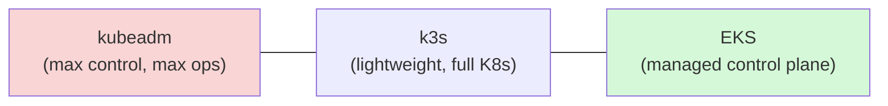

> [!tip] Portability payoff
> The **same YAML manifests** deploy unchanged on all three. Learn once, run anywhere.

### 🤔 Self-Check Q&A

1. **Q: For the AWS Cloud Architect / DevOps roles you're targeting, which distribution model mirrors what you'd operate day-to-day in production?**
   A: EKS — AWS runs the control plane; you manage worker nodes, networking, and workloads. This is the "least ops, most managed" end of the spectrum.
2. **Q: Why would you never use k3s for a CKA exam prep environment if you specifically want to learn control-plane internals?**
   A: k3s trims and bundles components for simplicity (e.g., SQLite instead of etcd by default, bundled Traefik). kubeadm gives you the raw, standard component set to inspect and reason about.
3. **Q: What's the actual trade-off you're making by choosing EKS over kubeadm on your own EC2 fleet?**
   A: You give up control over control-plane internals (you can't SSH into an EKS control-plane node or inspect its etcd directly) in exchange for an SLA, managed upgrades, and no operational burden for the hardest part of the cluster to run reliably.

```bash
# Install kind, kubectl & Docker on Ubuntu 22.04+ VPS
curl -fsSL https://get.docker.com | sh          # Docker — kind runs nodes as containers
sudo usermod -aG docker $USER && newgrp docker  # avoid re-login for docker group

curl -LO "https://dl.k8s.io/release/$(curl -Ls https://dl.k8s.io/release/stable.txt)/bin/linux/amd64/kubectl"
sudo install -m0755 kubectl /usr/local/bin/kubectl   # install kubectl binary

curl -Lo kind https://kind.sigs.k8s.io/dl/v0.24.0/kind-linux-amd64  # pin kind version for reproducibility
sudo install -m0755 kind /usr/local/bin/kind

kind version && kubectl version --client
```

```bash
# Create a 3-node kind cluster with port mappings
cat > kind.yaml <<'EOF'
kind: Cluster
apiVersion: kind.x-k8s.io/v1alpha4
nodes:
- role: control-plane
  kubeadmConfigPatches:
  - |
    kind: InitConfiguration
    nodeRegistration:
      kubeletExtraArgs: {node-labels: "ingress-ready=true"}   # lets ingress controller land here
  extraPortMappings:
  - {containerPort: 80,    hostPort: 80}      # Ingress HTTP
  - {containerPort: 443,   hostPort: 443}     # Ingress HTTPS
  - {containerPort: 30080, hostPort: 30080}   # NodePort mapping
- role: worker
- role: worker
EOF

kind create cluster --name iti --config kind.yaml
kubectl get nodes
```

```bash
# Look inside the cluster you built — every architecture box is a real process here
kubectl get pods -n kube-system     # kube-apiserver, etcd, scheduler, controller-manager, coredns, kube-proxy
docker ps --format 'table {{.Names}}\t{{.Image}}'          # the "nodes" are Docker containers
docker exec iti-control-plane crictl ps 2>/dev/null | head  # peek at containers inside a node
kubectl get pods -n kube-system -o wide                     # which node is each system Pod on?
```

---

# 05 · kubectl — The Command Grammar

```
kubectl get pods web-abc123 -n prod -o yaml
   │      │    │      │       │  │
   │      │    │      │       │  └─ output format
   │      │    │      │       └──── namespace
   │      │    │      └──────────── which one (name)
   │      │    └─────────────────── resource type
   │      └──────────────────────── verb
   └─────────────────────────────── the tool (client → api-server)
```

```bash
# --- inspect the cluster ---
kubectl get pods                       # list, add -A for all namespaces
kubectl get pods -o wide               # + node, IP
kubectl get deploy,svc                 # multiple resource types at once
kubectl describe pod web-abc123        # THE debugging command — read Events!
kubectl logs web-abc123 -f             # follow logs, like tail -f
kubectl exec -it web-abc123 -- sh      # shell inside the container

# --- change the cluster (declarative — preferred) ---
kubectl apply -f deployment.yaml       # source of truth = the file
kubectl scale deploy/web --replicas=5  # imperative scale
kubectl rollout status deploy/web      # block until rollout finishes
kubectl rollout undo deploy/web        # instant rollback
kubectl delete -f deployment.yaml
kubectl explain pod.spec.containers    # offline field docs
```

## Imperative vs Declarative

| | Imperative | Declarative |
|---|---|---|
| Style | `kubectl run web --image=nginx` | `kubectl apply -f ./k8s/` |
| Record | None — gone once terminal closes | YAML is source of truth, git-committed |
| Use for | Quick experiments, debugging | Everything beyond a quick test — **default choice**, base of GitOps |

## kubeconfig & contexts

A **context** = cluster + user + namespace.

```bash
kubectl config get-contexts               # which clusters do I know?
kubectl config current-context             # which one am I on RIGHT NOW?
kubectl config use-context eks-prod        # switch clusters
kubectl config set-context --current --namespace=team-a   # default namespace for this context
```

> [!warning] The classic mistake
> Running `delete` against **prod** when you thought you were on **dev**. ALWAYS check `kubectl config current-context` first.

### 🤔 Self-Check Q&A

1. **Q: What are the four "slots" in every kubectl command?**
   A: The tool (`kubectl`), the verb (`get`/`describe`/`apply`/...), the resource type, and name+flags (which one, namespace, output format).
2. **Q: Why is declarative (`apply -f`) considered the foundation of GitOps, while imperative commands are not?**
   A: Declarative YAML is a reviewable, version-controlled source of truth that can be diffed and re-applied — the exact mechanism GitOps pipelines rely on. Imperative commands leave no reproducible record.
3. **Q: You just ran a destructive `kubectl delete` and it hit the wrong cluster. What single command would have prevented this?**
   A: `kubectl config current-context` — check before every destructive command, especially across contexts.
4. **Q: What does `kubectl explain pod.spec.containers` actually give you, and why is it useful offline?**
   A: Field-level API documentation pulled from the cluster's own OpenAPI schema — no internet connection needed, and it's always accurate for the exact API version your cluster is running (unlike searching stale docs online).

---

# 06 · Namespaces — Virtual Sub-Clusters

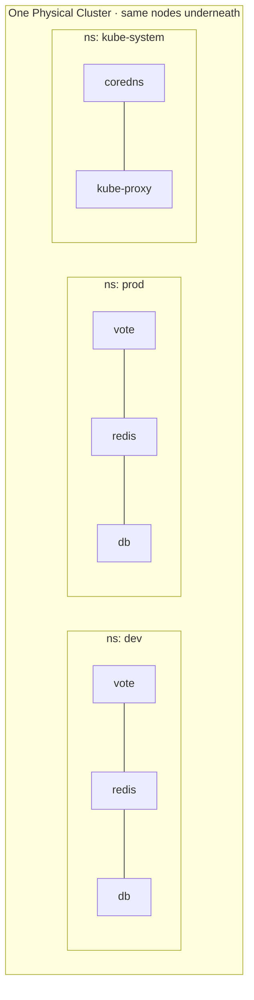

> [!warning] Namespaces are NOT network isolation
> A Pod in `dev` can reach a Service in `prod` by FQDN — nothing stops it. Namespaces scope **names, RBAC, and quota — not packets**. `NetworkPolicy` is what blocks traffic (a Day 4 topic).

| | Namespaced | Cluster-scoped |
|---|---|---|
| Examples | Pod, Service, Deployment, ConfigMap, Secret, PVC, Job | Node, Namespace, PersistentVolume, StorageClass, ClusterRole |
| Name unique... | within its namespace | across the whole cluster |
| `-n` flag | required (defaults to context) | ignored |
| Deleted with namespace? | **Yes — all of them** | No |

> [!tip] `kubectl get all` is a lie
> It shows a handful of common types — NOT Secrets, ConfigMaps, or PVCs. Ask for those by name.

## DNS impact — `<service>.<namespace>.svc.cluster.local`

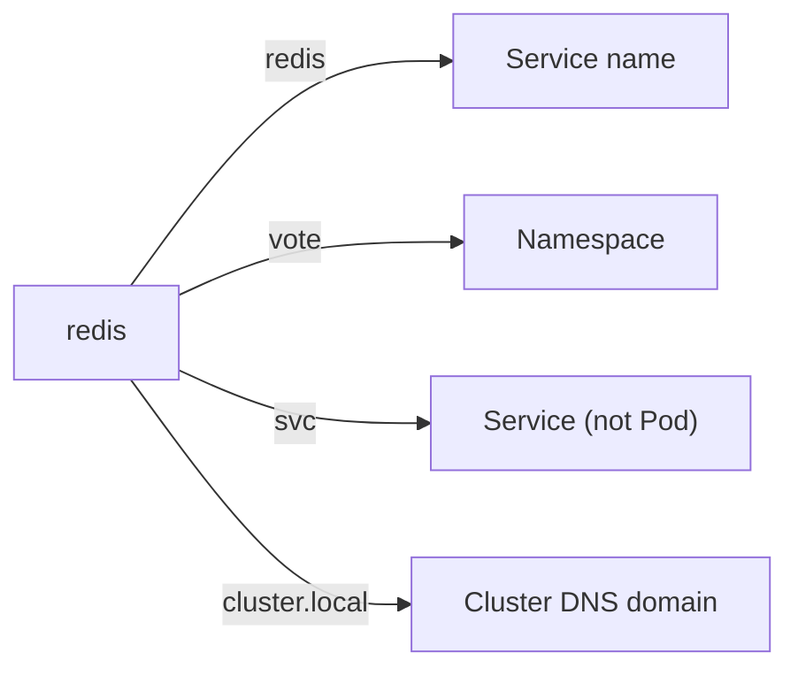

> [!important] The hardcoding trap
> The Voting App hardcodes `Redis(host="redis")`. The Service **must** be named exactly `redis`, same namespace as `vote`. Name it `redis-svc` and it breaks silently — no error you'd recognize.

```bash
kubectl create namespace vote
kubectl config set-context --current --namespace=vote   # stop typing -n vote 200 times

kubectl get pods -A     # -A / --all-namespaces = "where on earth did it go"
```

> [!warning] `kubectl delete namespace vote` deletes EVERYTHING inside it. No undo, no confirmation.

### 🤔 Self-Check Q&A

1. **Q: Are namespaces a security boundary?**
   A: No. They scope names, RBAC, and ResourceQuota — not network traffic. Cross-namespace traffic flows freely until a NetworkPolicy restricts it.
2. **Q: You have `redis` Services in both `dev` and `prod`. From a Pod in `dev`, what happens if you `curl http://redis`?**
   A: It resolves to the `dev` namespace's `redis` Service via the resolver's `search` suffix list — never `prod`'s. Cross-namespace access requires `redis.prod` or the full FQDN.
3. **Q: Why is `default` supposed to be empty in production?**
   A: Namespaces exist to organize and isolate names/RBAC/quota per team or environment. Dumping everything in `default` defeats that purpose and makes access control coarse-grained.
4. **Q: What's the fastest command to find a Pod when you've forgotten which namespace you put it in?**
   A: `kubectl get pods -A` (or `--all-namespaces`) — searches every namespace at once instead of guessing which one to `-n` into.

---

# 07 · Labels & Selectors — The Wiring of Kubernetes

```yaml
metadata:
  labels:
    app: vote            # what it is
    tier: frontend        # where it sits
    env: dev                # which environment
    version: v1               # which release
```

> [!important] Why labels instead of names?
> **Loose coupling.** A Service asks "everything with `app=vote`" and gets today's answer. Pods can be replaced a hundred times and the wiring never changes. Nothing in Kubernetes finds a Pod **by name** — Deployments, Services, ReplicaSets, and NetworkPolicies all find Pods by label.

```bash
# equality-based
kubectl get pods -l app=vote
kubectl get pods -l app=vote,tier=frontend   # AND (there is no OR)
kubectl get pods -l env!=prod

# set-based
kubectl get pods -l 'env in (dev, staging)'
kubectl get pods -l 'app notin (vote)'
kubectl get pods -l app            # key exists
kubectl get pods -l '!app'         # key absent
```

```yaml
# modern objects use matchLabels / matchExpressions
selector:
  matchLabels:
    app: vote
  matchExpressions:
    - key: tier
      operator: In
      values: [frontend, web]
```

## How a selector finds its Pods

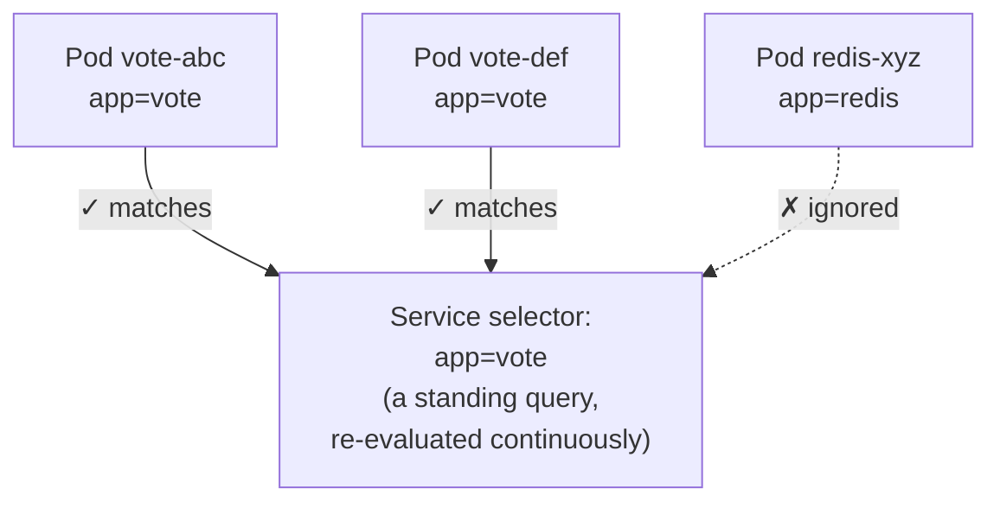

> [!warning] The silent failure
> Typo a label and nothing errors. Service is created, looks healthy, but selects **zero** Pods → every request times out. `kubectl get endpoints <svc>` showing `<none>` is the tell.

## Labels vs Annotations

| | Labels | Annotations |
|---|---|---|
| Purpose | **Identify** and group | **Attach** arbitrary metadata |
| Queryable? | **Yes** — indexed, selectable | **No** — never selectable |
| Size | ≤63 chars, restricted charset | Large — JSON, certs, configs |
| Used by | Services, Deployments, NetworkPolicy | Tools: ingress-nginx, cert-manager, Helm |

```bash
kubectl label pod cache app=web --overwrite   # --overwrite required to change existing label
kubectl label pod web-1 env-                  # trailing dash removes a label
kubectl get pods -L app,env                   # labels promoted to real columns
```

### 🤔 Self-Check Q&A

1. **Q: A Service has `selector: {app: vote}` but zero traffic reaches Pods labeled `app: Vote` (capital V). What's going on and how do you catch it fast?**
   A: Label matching is exact-string, case-sensitive. `kubectl get endpoints <svc>` would show `<none>` — that's the two-second diagnosis for a selector-mismatch problem.
2. **Q: Why can't you `-l app=vote OR app=redis` directly?**
   A: Multiple label terms are always ANDed. Use the set-based syntax instead: `-l 'app in (vote, redis)'`.
3. **Q: You need to record who owns a Deployment for auditing, but never want to query on it. Label or annotation?**
   A: Annotation — it's descriptive metadata for humans/tools, not something you'll ever select on with `-l`.
4. **Q: Why does `kubectl label pod cache app=web` fail without `--overwrite` if the Pod already has an `app` label?**
   A: It's a deliberate guardrail — `kubectl label` refuses to silently clobber an existing key rather than risk an accidental relabel that could reassign a Pod to the wrong controller's selector.

---

# 08 · Pods — The Atom of Kubernetes

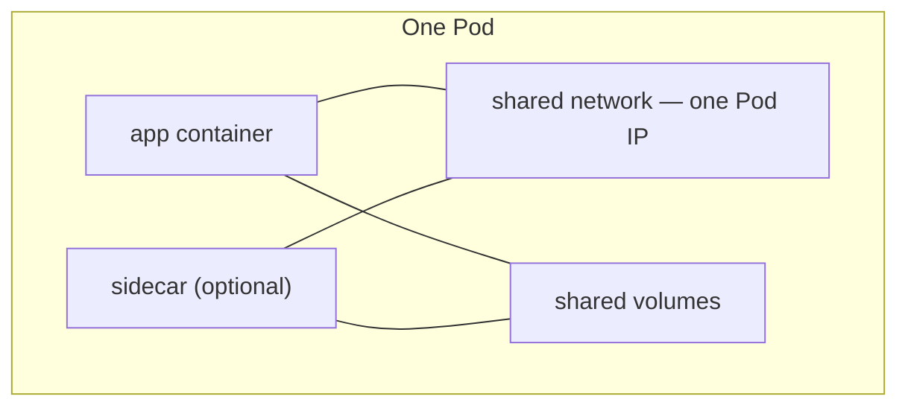

- Scheduled onto a node **as a whole** — never split across nodes.
- One Pod IP shared by all containers.
- **Ephemeral by design** — cattle, not pets. New IP every time.
- When a Pod dies, it's **not restarted in place** — a controller makes a fresh one.

```yaml
apiVersion: v1
kind: Pod
metadata:
  name: web
  labels:
    app: web
spec:
  containers:
    - name: nginx
      image: nginx:1.27
      ports:
        - containerPort: 80
```

## Pod phases (state machine)

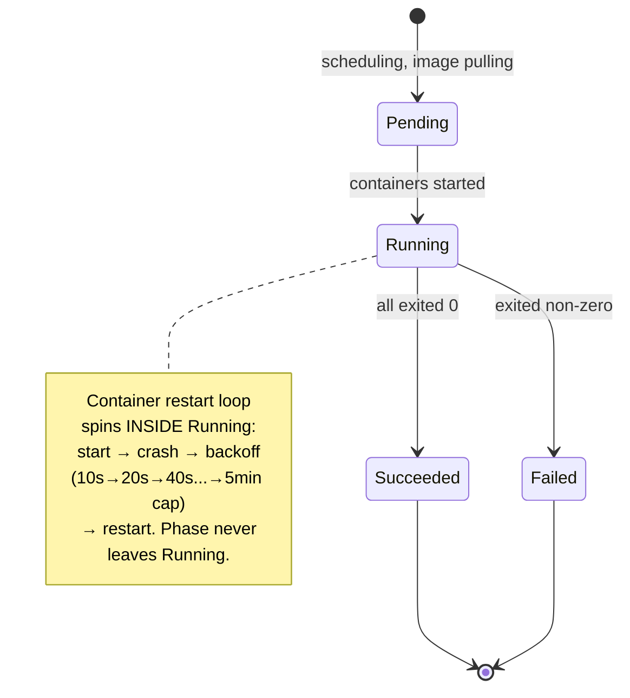

| Phase | Meaning | What to do |
|---|---|---|
| **Pending** | Accepted, not running — scheduling or pulling | `describe`, check Events |
| **Running** | Bound to node, ≥1 container running/starting | Check `READY`, not phase |
| **Succeeded** | All containers exited 0, won't restart | Normal for Jobs, suspicious for a web server |
| **Failed** | All terminated, ≥1 exited non-zero | `logs --previous` |
| **Unknown** | api-server lost contact with node | Node problem — `get nodes` |

> [!warning] READY, not STATUS
> `Running` doesn't mean **working**. Read the `READY` column: `0/1 Running` is up and serving nobody. Kubectl also substitutes friendlier reasons into `STATUS` — `CrashLoopBackOff`, `ImagePullBackOff`, `Terminating`, `Completed` — those are what you'll actually see day to day.

## restartPolicy

| Policy | Restarts when… | Use for |
|---|---|---|
| **Always** (default) | container exits — any code | long-running servers |
| **OnFailure** | exit code non-zero only | Jobs, batch work |
| **Never** | never | one-shot debug Pods |

> [!warning] It restarts CONTAINERS, not Pods
> `restartPolicy` never resurrects a **deleted Pod**. That's what Deployments are for.

## 🚨 Failure states

### CrashLoopBackOff
Container **starts fine and then dies**. Backoff doubles: 10s → 20s → 40s → ... capped at 5 min.

```bash
kubectl describe pod worker      # Last State + Exit Code
kubectl logs worker --previous   # logs of the run that DIED — the real evidence
kubectl get events --sort-by=.lastTimestamp | tail
```

Common causes: missing env var/bad config, dependency not up yet, command exits immediately, wrong command/args, OOMKilled (exit 137).

### ImagePullBackOff / ErrImagePull
Node couldn't fetch the image. **No container ever starts — no logs exist.** `describe` is the only tool that works.

```bash
kubectl describe pod vote | sed -n '/Events/,$p'
docker exec iti-control-plane crictl images | grep iti/     # is it actually on the node?
kind load docker-image iti/vote:v1 --name iti                # the fix for local images
```

Common causes: typo'd tag, tag never pushed, private registry with no `imagePullSecret`, **locally-built image never `kind load`-ed**.

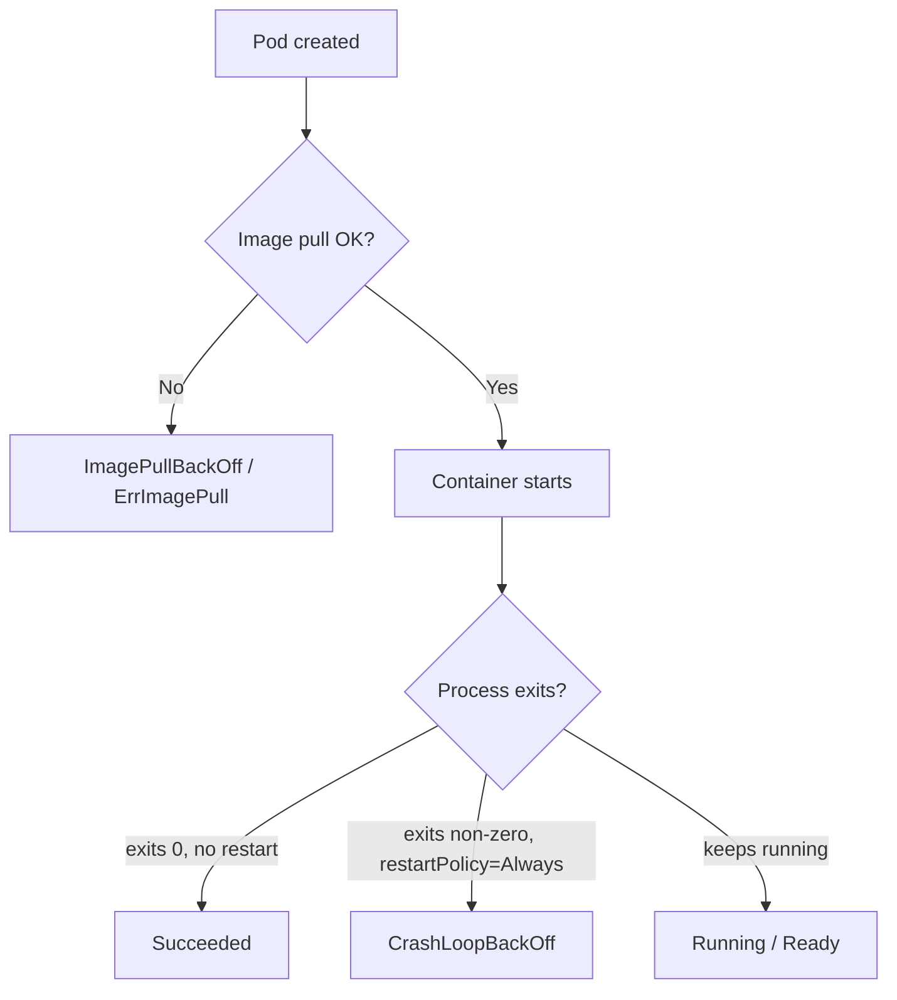

### 🤔 Self-Check Q&A

1. **Q: `kubectl logs broken-pod` returns nothing at all. What does that tell you, and what's your next command?**
   A: No output usually means no container ever started — classic sign of `ImagePullBackOff`. Next: `kubectl describe pod broken-pod` and read the Events tail.
2. **Q: A Pod shows `RESTARTS: 5` and `CrashLoopBackOff`. Is the image broken?**
   A: Not necessarily — the image pulled fine and the process started; it's exiting after starting. Check `kubectl logs --previous` for the death note (missing config, bad dependency, OOM, etc.), not the image itself.
3. **Q: Why does `restartPolicy: Always` NOT protect you from `kubectl delete pod redis`?**
   A: The policy governs container restarts within a live Pod object. Deleting the Pod object removes it entirely — there's nothing left to "restart." Only a controller (ReplicaSet/Deployment) recreates deleted Pods.

## Environment variables, command & args

```yaml
spec:
  containers:
    - name: vote
      image: iti/vote:v1
      env:
        - name: OPTION_A
          value: "Tabs"
        - name: MY_POD_IP            # Downward API — Pod reads its own metadata
          valueFrom:
            fieldRef:
              fieldPath: status.podIP
```

> [!warning] Env vars are set ONCE at container start. Change them → nothing happens to a running Pod. Must recreate/restart.

| Docker / Dockerfile | Kubernetes | Effect |
|---|---|---|
| `ENTRYPOINT` | `command` | the executable |
| `CMD` | `args` | the arguments |
| `docker run img` | neither field set | ENTRYPOINT + CMD as built |
| `--entrypoint sh img` | `command: ["sh"]` | sh only — CMD discarded |

> [!warning] No shell unless you ask
> `command`/`args` are YAML **lists**, not shell strings. `command: ["echo hi && sleep 60"]` fails — no shell to interpret `&&`. Use `["sh", "-c", "..."]`.

```bash
# Debugging toolkit — use in THIS order
kubectl describe pod vote -n vote | sed -n '/Events/,$p'   # 1. works even with no container
kubectl logs vote -n vote -f                                # 2. what the app said
kubectl get events -n vote --sort-by=.lastTimestamp | tail  # 3. cluster activity feed
kubectl exec -it vote -n vote -- sh                          # 4. stand where the app stands

kubectl port-forward pod/vote 8080:80 -n vote     # private tunnel, foreground only
kubectl cp vote:/app/app.py ./app.py -n vote      # copy files out
```

> [!tip] Order matters
> describe → logs → events → exec. Three of four are read-only and free. Reaching for `exec` first wastes time on a Pod that never started.

### 🤔 Self-Check Q&A

1. **Q: You set `command: ["sh"]` on a container whose image ships `CMD ["gunicorn", "app:app"]`. What actually runs?**
   A: Only `sh` — setting `command` replaces ENTRYPOINT AND discards CMD entirely, even though you didn't touch `args`.
2. **Q: `kubectl exec` fails with `executable file not found`. Why, and what's the fix?**
   A: Slim images often ship no shell/curl/nslookup. Fix: run a throwaway toolbox Pod like `kubectl run tmp --rm -it --image=nicolaka/netshoot -- bash` and debug from there.
3. **Q: You just deleted a bare Pod by accident. What actually brings it back?**
   A: Nothing, if it was truly a bare Pod — no controller believes it should exist, so there's no reconciliation loop to recreate it. This exact pain point is what section 09 (Deployments) exists to fix.

---

# 09 · ReplicaSets & Deployments

> [!warning] Course-mapping note
> This is genuinely **Day 2** content in the ITI roadmap ("Workloads & networking"), included here because it's a natural conceptual follow-on from "why bare Pods fail" in section 08.

## Why bare Pods fail

- Nothing owns a bare Pod — delete it/OOM it/drain its node and nothing recreates it.
- No replicas — one Pod is one point of failure.
- No versioning — image change = delete + recreate, hard cut, no rollback.
- No stable address — new IP every recreation.

## The ReplicaSet — a controller that only counts

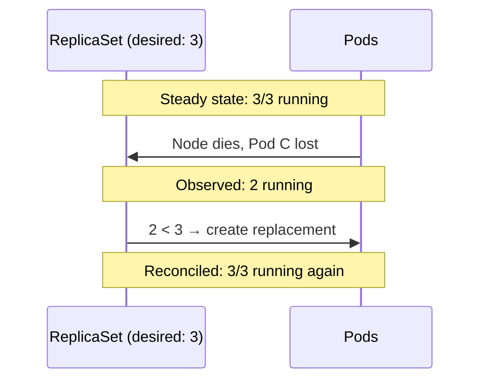

- Its ONLY job: keep `matching Pod count == spec.replicas`.
- Finds Pods **by label selector**, not by name — even a hand-made Pod with the right labels counts.
- **Never updates a Pod template on running Pods** — no rollout concept. That gap is what Deployment fills.

```yaml
apiVersion: apps/v1
kind: ReplicaSet
metadata:
  name: vote
  namespace: vote
spec:
  replicas: 3
  selector:
    matchLabels:
      app: vote
  template:            # a Pod, verbatim
    metadata:
      labels:
        app: vote       # MUST match the selector
    spec:
      containers:
        - name: vote
          image: iti/vote:v1
```

> [!warning] You will never write a ReplicaSet directly
> Deployments create ReplicaSets for you (one per revision, old ones kept at 0 replicas). Writing one manually loses rollouts/history/rollback for zero benefit. **Never `delete rs` under a live Deployment** — it just gets recreated. Delete the Deployment.

## The Deployment — what you actually create

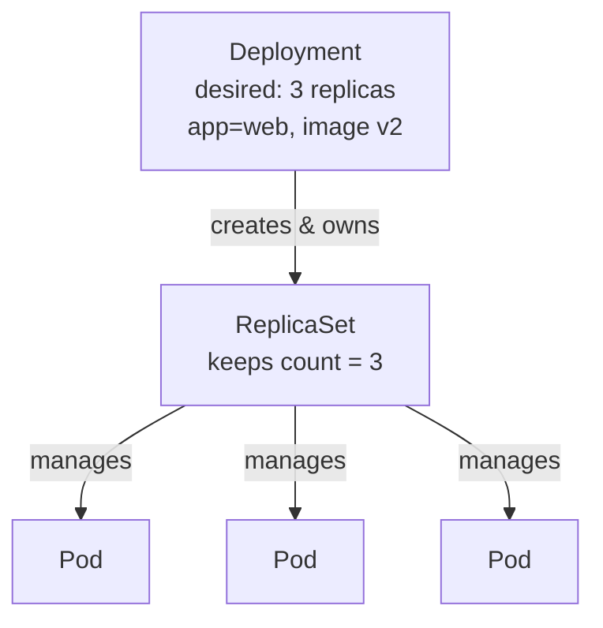

```yaml
apiVersion: apps/v1
kind: Deployment
metadata:
  name: web
spec:
  replicas: 3
  selector:
    matchLabels:
      app: web
  template:
    metadata:
      labels:
        app: web
    spec:
      containers:
        - name: nginx
          image: nginx:1.27
```

> [!warning] `spec.selector` is IMMUTABLE
> Change it on a live Deployment → API server rejects outright, no bypass flag exists. Because changing it would silently orphan every running Pod.

```bash
# Fix: replace the object, keep the Pods alive
kubectl -n vote delete deploy vote --cascade=orphan   # orphan Pods, keep traffic flowing
kubectl -n vote apply -f vote/deployment.yaml          # new selector
kubectl -n vote delete pod -l app=vote                 # sweep the orphans
```

## Scale · Rollout · Rollback

```bash
kubectl scale deploy/web --replicas=10
kubectl set image deploy/web nginx=nginx:1.29
kubectl rollout status deploy/web        # blocks until done, exits non-zero if stalled
kubectl rollout undo deploy/web          # instant — old ReplicaSet still exists

kubectl rollout history deploy/vote
kubectl rollout history deploy/vote --revision=2
kubectl annotate deploy/vote --overwrite kubernetes.io/change-cause="vote v2: heading change"
kubectl rollout restart deploy/vote      # new ReplicaSet, same image — for stale ConfigMap/Secret env vars
```

## Rolling update mechanics

```yaml
spec:
  replicas: 4
  strategy:
    type: RollingUpdate
    rollingUpdate:
      maxSurge: 1          # extra Pods allowed ABOVE replicas
      maxUnavailable: 0    # never dip BELOW ready count
```

| Field | Meaning |
|---|---|
| `maxSurge` | How far above `replicas` you may go. Costs capacity, buys safety. |
| `maxUnavailable` | How far below ready you may dip. `0` = capacity never drops. |

> [!warning] Ready ≠ able to serve
> "Ready" here just means the container started — not that the app can serve requests. Without a readiness probe, a rolling update still drops requests even at `maxUnavailable: 0`.

> [!info] Revisions
> One revision = one ReplicaSet. A revision is only created when the **Pod template** changes — scaling replicas does NOT create a new revision. `kubectl rollout undo` itself becomes a new revision (history is a log, not a stack) — revision numbers keep climbing.

### 🤔 Self-Check Q&A

1. **Q: What does a Deployment give you that a ReplicaSet does not?**
   A: Rolling updates, revision history, and rollback. A ReplicaSet only maintains a Pod count.
2. **Q: A rollout is stuck halfway. What's your diagnostic sequence, and does Kubernetes auto-rollback?**
   A: `kubectl rollout status` (see it's stalled) → `kubectl get pods` → `kubectl describe deploy` for Events. No, it does NOT auto-rollback — a stalled rollout sits half-old/half-new until `progressDeadlineSeconds` (default 600s) is exceeded, and even then a human must run `rollout undo`.
3. **Q: You scale a Deployment from 3 to 10 replicas. Does this create a new revision in `rollout history`?**
   A: No — revisions are tied to Pod **template** changes (image, env, etc.), not to `replicas` count changes.
4. **Q: A ReplicaSet you didn't create shows up under a Deployment when you `kubectl get rs`. Where did it come from, and is it safe to delete?**
   A: The Deployment created it automatically — one ReplicaSet per revision. It's not safe to delete casually: deleting the *current* one gets recreated instantly by the Deployment controller, and deleting an *old* (scaled-to-0) one permanently removes that rollback target from `rollout history`.

---

## 📌 Day 1 Recap Diagram

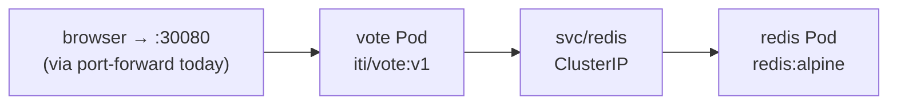

> [!warning] Where Day 1 leaves the app
> Bare Pods deleted → not recreated. No Services for most components. Passwords in plain YAML. This is intentionally broken — Deployments (section 09, technically Day 2) and Services close most of these gaps next.

## 📝 Interview Questions — Day 1 Combined

- **Pod vs container** → Pod = wrapper sharing network+volumes; smallest unit scheduler places, kubelet kills.
- **Five object fields** → apiVersion, kind, metadata, spec, status.
- **Namespaces = security boundary?** → No — names/RBAC/quota only.
- **Deployment vs ReplicaSet** → rollouts, history, rollback vs just count-maintenance.
- **`spec.selector` immutable — why** → prevents silent Pod orphaning; API refuses the change outright.
- **CrashLoopBackOff vs ImagePullBackOff** → app dies after starting vs the node never got the image at all.
- **Why does a locally-built image fail on a kind cluster?** → the node has its own image store, separate from your laptop's Docker daemon — `kind load docker-image` + `imagePullPolicy: IfNotPresent` fixes it.
- **kubectl current-context — why check it first** → prevents running destructive commands against the wrong cluster.

> [!example] 🎨 MANUAL EXCALIDRAW REQUIRED: Bare Pod vs Deployment-Managed Pod, Side by Side
> **Instructions for what I need to draw:**
> - Step 1: Split the canvas into two halves, left labeled "Bare Pod (Day 1, early)" and right labeled "Deployment-managed Pod (Day 1, section 09)".
> - Step 2: On the left, draw one Pod box with a red "X" over it and an arrow to a tombstone icon labeled "kubectl delete pod → gone forever, nothing watching".
> - Step 3: On the right, draw a Deployment box above a ReplicaSet box above 3 Pod boxes. Draw one Pod with a red "X", then a curved arrow looping back to a NEW Pod box appearing within seconds, labeled "ReplicaSet notices count dropped, creates a replacement".
> - Step 4: Add a caption under the whole diagram: "Same delete command. Completely different outcome — because one has an owner and one doesn't."


---


#  Kubernetes — Networking, Multi-Container Pods & ConfigMaps (Expanded)

> [!info] What this note replaces
> This is an **expanded rebuild** of the Networking → ConfigMaps stretch from the Day 1–2 guide — same source material, but with extra explanation, more comparison tables, more diagrams, and a much bigger Self-Check bank. Slot this in to replace sections 10–12 of the original note.

---

# 10 · Networking — Services, Endpoints & DNS

## 10.1 The core problem: Pods are moving targets

Every Pod gets its own IP from the cluster's pod network (e.g., `10.244.x.x`). That IP is **not guaranteed to survive** a restart, a reschedule, a node failure, or a rolling update — a replacement Pod gets a brand-new IP every single time.

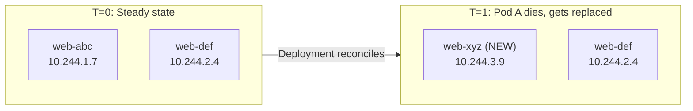

> [!important] Why this matters more than it looks
> If you hard-code a Pod IP anywhere — in another app's config, in a load balancer's target list, in a DNS `A` record you manage by hand — that reference goes stale the instant Kubernetes reschedules the Pod. In a system that self-heals by **replacing** things rather than repairing them in place, anything address-based must be indirect. That's the entire reason Services exist: they give you a layer of indirection that Kubernetes keeps in sync automatically.

## 10.2 The fix: the Service object

A **Service** is a stable virtual IP (called the **ClusterIP**) plus a DNS name, that continuously load-balances across whichever Pods currently match its label selector.

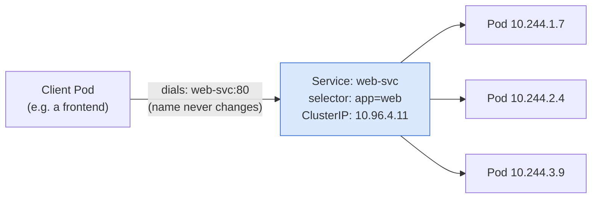

**What actually keeps this in sync:** the Service itself does nothing dynamic — it's just an object with a selector. Two other pieces of machinery do the real work:

1. The **endpoints controller** (part of controller-manager) continuously watches for Pods matching the selector and writes their IPs into an **EndpointSlice** object.
2. **kube-proxy**, running on every node, watches EndpointSlices and programs the node's packet-forwarding rules (iptables or IPVS) so that traffic to the Service's ClusterIP gets DNAT'd to one of the real Pod IPs.

> [!tip] Under the hood — iptables vs IPVS
> kube-proxy has two main implementation modes:
> - **iptables mode** (default, most common) — writes a chain of NAT rules per Service; works well up to a few thousand Services but rule evaluation is roughly linear, so very large clusters see latency creep.
> - **IPVS mode** — uses the Linux kernel's IP Virtual Server, a real hash-table-based load balancer; scales better and supports more balancing algorithms (round robin, least connection, etc.).
> You don't configure this for the ITI labs, but it's a very common cloud-architect interview question: *"How does a Service actually load-balance traffic?"* — the honest answer is "it doesn't, kube-proxy's kernel-level rules do."

## 10.3 The four Service types — full comparison

```mermaid
graph TD
    subgraph CIP["ClusterIP (default)"]
        c1["Only reachable\ninside the cluster"] --> csvc[web-svc]
        csvc --> cp[Pods]
    end
    subgraph NP["NodePort"]
        n1["NodeIP:30080\n(any node, external)"] --> nsvc[web-svc]
        nsvc --> np[Pods]
    end
    subgraph LB["LoadBalancer"]
        l1["Internet"] --> lcloud["Cloud LB\n(AWS ELB/NLB)"] --> lsvc[web-svc]
        lsvc --> lp[Pods]
    end
    subgraph HL["Headless (clusterIP: None)"]
        h1["Client does its own\nDNS-based load balancing"] --> hsvc["DNS returns\nPod IP LIST"]
        hsvc --> hp[Pods]
    end
```

| Type | Reachable from | Address given | Real-world analogy | Typical AWS parallel | When to use |
|---|---|---|---|---|---|
| **ClusterIP** | Inside cluster only | Virtual IP + DNS name | An internal-only hostname on a private VPC | Internal ALB/NLB with no public listener | Service-to-service traffic — 90% of Services |
| **NodePort** | Anywhere that can reach any node's IP, on a high port | `<any-node-IP>:30000-32767` | Punching one fixed port open on every EC2 instance in an ASG | Security-group rule opening one port cluster-wide | Dev/demo, or as the underlying mechanism a LoadBalancer builds on |
| **LoadBalancer** | Public internet (or an internal LB if annotated) | Cloud-provisioned public IP/DNS | A managed ELB in front of an Auto Scaling Group | AWS Classic/Network Load Balancer, auto-provisioned by the cloud controller manager | Production external exposure on a managed cloud |
| **Headless** (`clusterIP: None`) | Wherever DNS is queried from | No virtual IP — DNS returns the **Pod IP list directly** | Client-side service discovery, like a Route 53 multi-value answer | Route 53 weighted/multivalue records without an LB in front | Stateful workloads, DB replica sets, client-driven sharding |

> [!important] LoadBalancer is built ON TOP of NodePort
> A `type: LoadBalancer` Service isn't a fourth, separate mechanism — Kubernetes still allocates a NodePort under the hood, and the cloud provider's controller provisions an external LB that forwards to that NodePort on every node. Understanding this chain (`Internet → cloud LB → NodePort → Service ClusterIP → Pod`) is exactly the kind of detail that comes up in cloud infra interviews.

### Anatomy of a Service manifest

```yaml
apiVersion: v1
kind: Service
metadata:
  name: web-svc
spec:
  type: ClusterIP        # ClusterIP | NodePort | LoadBalancer
  selector:
    app: web              # which Pods receive traffic
  ports:
    - port: 80             # the Service's own port — what clients dial
      targetPort: 80        # the port ON THE POD traffic is forwarded to
```

## 10.4 Headless Services — when you don't want load balancing

```mermaid
sequenceDiagram
    participant Client
    participant DNS as CoreDNS
    participant SvcNormal as Normal ClusterIP Service
    participant SvcHeadless as Headless Service

    Client->>DNS: nslookup db (ClusterIP)
    DNS-->>Client: 10.96.148.22 (ONE virtual IP)
    Client->>SvcNormal: connect to 10.96.148.22
    Note over SvcNormal: kube-proxy picks ONE backing Pod

    Client->>DNS: nslookup db (Headless)
    DNS-->>Client: 10.244.1.9, 10.244.2.4, 10.244.3.7 (Pod IPs directly)
    Note over Client: Client itself decides which Pod to connect to
```

```yaml
apiVersion: v1
kind: Service
metadata:
  name: db
  namespace: vote
spec:
  clusterIP: None      # <-- this makes it headless
  selector:
    app: db
  ports:
    - port: 5432
      targetPort: 5432
```

- No virtual IP, no kube-proxy rules, no load balancing — **DNS does all the work**.
- Required by **StatefulSets** — it's what gives each Pod a stable, individually-addressable DNS name (`db-0.db.vote.svc.cluster.local`), covered on Day 3.
- Use when the client must pick a specific backend: a primary-replica DB topology, Kafka brokers doing their own partition assignment, anything with leader election.
- **95% of the time you want plain ClusterIP.** Reach for headless deliberately, not by default.

## 10.5 Endpoints & EndpointSlices — the missing link everyone forgets

```mermaid
flowchart TD
    Svc["Service\napp=vote selector"] -->|"1. Endpoints controller\nwatches matching Pods"| EC{{Endpoints Controller}}
    EC -->|"2. Writes live IPs"| ES["EndpointSlice\nvote-abc123\n10.244.1.9:80, 10.244.2.4:80"]
    ES -->|"3. kube-proxy reads slice,\nprograms node rules"| KP[kube-proxy]
    KP -->|"4. Actual packet forwarding"| Pods["Real Pods"]
```

```bash
kubectl get endpoints vote
# NAME   ENDPOINTS                       AGE
# vote   10.244.1.9:80,10.244.2.4:80     4m

kubectl get endpointslices -l kubernetes.io/service-name=vote   # the modern object kube-proxy actually reads
kubectl describe endpoints vote
```

> [!warning] This is the fastest diagnostic in all of Kubernetes
> `Service returns connection refused / times out` → run `kubectl get endpoints <svc>` **before anything else**.
> - **Empty `<none>`** → the selector matches zero *ready* Pods. It's a labeling problem or a readiness-probe problem, not a networking problem. Half your troubleshooting search space is gone in one command.
> - **Populated with IPs** → networking is fine; the bug is inside the application itself (wrong port, app not listening, app crashing on that route).

> [!info] Why "Endpoints" (singular object) became "EndpointSlices" (plural, chunked)
> The original `Endpoints` object stored every backing Pod IP in **one single object per Service**. In clusters with thousands of Pods behind one Service, that object became enormous and every update had to be re-transmitted to every kube-proxy in full. EndpointSlices shard the same information into chunks of ~100 addresses each, so updates are incremental and far cheaper at scale. Functionally, for troubleshooting, treat them the same — `get endpoints` still works and is quicker to type.

## 10.6 The four ports — the #1 source of confusion in Kubernetes

```mermaid
graph LR
    Ext["External client\n(browser, curl)"] -->|"1. hits nodePort: 30080\non ANY node"| Node["Node"]
    Node -->|"2. Service programs:\nport 80 → targetPort 80"| Svc["Service (type: NodePort)\nClusterIP :80"]
    Svc -->|"3. forwards to"| Pod["Pod\napp listening on :80"]
    Pod -.->|"containerPort: 80\n(documentation only —\nopens nothing by itself)"| Pod
```

| Field | Lives in | What it actually controls | If you get it wrong |
|---|---|---|---|
| `containerPort` | Pod spec | Nothing — pure documentation for humans and tooling | Everything still works; it's informational only |
| `targetPort` | Service | The port ON THE POD that traffic is forwarded to | **Connection refused** — this must equal what the app inside the container is actually listening on |
| `port` | Service | The Service's own port — what other Pods/clients dial | Free choice, doesn't need to equal `targetPort` |
| `nodePort` | Service, `type: NodePort` only | A port opened on every node, range 30000–32767 | Omit it and Kubernetes assigns a random one for you |

**Worked trace, end to end:** a browser hits `http://<any-node-ip>:30080` → the kernel on that node, programmed by kube-proxy, DNATs the packet to the Service's ClusterIP on `port: 80` → kube-proxy's rules DNAT again to a live Pod IP on `targetPort: 80` → the container's process, which happens to be listening on port 80 (matching `containerPort: 80` purely by convention), receives the connection.

## 10.7 Cluster DNS — CoreDNS and the FQDN pattern

```
redis         .    vote      .   svc  .  cluster.local
  │                 │             │          │
Service name    Namespace   "it's a Service"  cluster DNS domain
```

```mermaid
sequenceDiagram
    participant Pod as Pod (namespace: vote)
    participant Resolver as libc resolver
    participant CoreDNS
    Pod->>Resolver: resolve "redis"
    Note over Resolver: /etc/resolv.conf search list:\nvote.svc.cluster.local\nsvc.cluster.local\ncluster.local
    Resolver->>CoreDNS: query redis.vote.svc.cluster.local
    CoreDNS-->>Resolver: 10.96.18.44 (Service ClusterIP)
    Resolver-->>Pod: 10.96.18.44
```

CoreDNS runs as a Deployment in `kube-system`, fronted by a Service called `kube-dns`. The kubelet writes `/etc/resolv.conf` into every Pod at creation time.

```bash
# from a Pod in namespace vote — four equivalent names, one Service
curl http://redis:6379                       # same namespace — short name
curl http://redis.vote:6379                  # + namespace — works cross-namespace
curl http://redis.vote.svc:6379              # + type
curl http://redis.vote.svc.cluster.local     # fully qualified
```

> [!warning] The #1 "but it worked in dev" bug
> The short name (`redis`) only resolves inside the **same namespace** it's queried from. Cross-namespace calls need at minimum `<service>.<namespace>`. A Pod in `staging` calling `redis` will silently hit `staging`'s own `redis` Service (if one exists) or fail to resolve (if it doesn't) — never `prod`'s.

### Why the short name works at all — `search` and `ndots`

```
# /etc/resolv.conf inside a Pod in namespace vote
nameserver 10.96.0.10
search vote.svc.cluster.local svc.cluster.local cluster.local
options ndots:5
```

- **`search`** — the resolver appends each suffix in turn until one answers. `redis` → tries `redis.vote.svc.cluster.local` first → hits.
- **`ndots:5`** — a name with fewer than 5 dots is tried against the search list *first*, before being treated as an absolute external name.

```mermaid
flowchart TD
    Q["Query: api.github.com\n(2 dots < ndots:5)"] --> S1["Try api.github.com.vote.svc.cluster.local"] -->|NXDOMAIN| S2["Try api.github.com.svc.cluster.local"] -->|NXDOMAIN| S3["Try api.github.com.cluster.local"] -->|NXDOMAIN| S4["Finally try as absolute:\napi.github.com"] -->|OK| Done["✓ resolved — but 4 lookups instead of 1"]
```

> [!tip] The fix, and when it matters
> A trailing dot makes a name absolute immediately: `curl https://api.github.com./`. In-cluster names are cheap (hit on the first suffix); it's chatty **external** calls that pay this 4x DNS tax. Worth tuning `spec.dnsConfig.options` on any Pod that makes lots of outbound internet calls.

## 10.8 Service troubleshooting decision tree

```mermaid
flowchart TD
    A["App unreachable via Service"] --> B{"kubectl get endpoints svc"}
    B -->|"empty <none>"| C{"kubectl get pods -l <selector>"}
    C -->|"no Pods match"| D["Label mismatch — compare\nSelector vs Pod labels with --show-labels"]
    C -->|"Pods match but not Ready"| E["Readiness probe failing —\ndescribe pod, check probe config"]
    B -->|"populated with IPs"| F{"kubectl exec into Pod,\ncurl the app on containerPort"}
    F -->|"works from inside Pod"| G["Networking is fine —\ncheck targetPort matches\napp's real listening port"]
    F -->|"fails from inside Pod"| H["App-level bug —\nnot a Kubernetes networking issue"]
```

## 10.9 Networking Self-Check Q&A

1. **Q: A Service has a valid ClusterIP and `kubectl get svc` reports it as healthy. Why can that still be lying to you?**
   A: `get svc` only confirms the Service *object* exists with an allocated IP — it says nothing about whether the selector actually matches any live, ready Pods. A Service can look perfectly healthy while its EndpointSlice is completely empty.

2. **Q: What is the actual mechanism that load-balances traffic across Pods behind a Service — is it the Service object itself?**
   A: No. The Service is just a declarative object with a selector. The endpoints controller populates EndpointSlices, and `kube-proxy` on each node programs kernel-level rules (iptables or IPVS) that do the real packet DNAT/load-balancing.

3. **Q: You curl a NodePort Service from outside the cluster and get "connection refused." List the three ports involved and which one is the most likely culprit if the Pod is confirmed Running and Ready.**
   A: `nodePort` (external entry), `port` (Service's own port), `targetPort` (forwarded to the Pod). If the Pod is Running/Ready, `targetPort` mismatching the app's actual listening port is the most common cause — `containerPort` is purely documentation and can't cause this on its own.

4. **Q: Why would a StatefulSet require a headless Service instead of a normal ClusterIP one?**
   A: A StatefulSet needs each replica individually addressable by a stable, predictable DNS name (`pod-0.svc.ns.svc.cluster.local`), not load-balanced behind one virtual IP. A headless Service returns the full Pod IP list via DNS instead of one ClusterIP, which is exactly what per-Pod addressing requires.

5. **Q: A Pod in namespace `dev` calls `http://redis:6379` and it works. The same code, deployed to namespace `staging`, also calls `http://redis:6379` — and it silently connects to the wrong data. Why, and how would you make this fail loudly instead of silently?**
   A: The short name `redis` resolves relative to the calling Pod's own namespace via the DNS `search` list — so each namespace's own `redis` Service answers locally. If `staging` shouldn't have its own `redis`, the call would fail loudly (NXDOMAIN) instead of silently hitting the wrong data — the real danger here is namespace duplication of the same short name. Best practice: qualify cross-boundary calls explicitly or use distinct names to avoid this class of bug entirely.

6. **Q: What's the cost of DNS `ndots:5` for a Pod that frequently calls `api.stripe.com`, and how do you avoid paying it on every request?**
   A: With `ndots:5`, `api.stripe.com` (2 dots) is tried against all 3 cluster search suffixes first (3 guaranteed NXDOMAIN lookups) before being tried as absolute — 4 DNS round-trips per call instead of 1. Fix: use a trailing dot (`api.stripe.com.`) to force an absolute lookup, or tune `dnsConfig.options` on the Pod.

---

# 11 · Multi-Container Pods — Init Containers & Sidecars

## 11.1 What's actually shared inside one Pod

```mermaid
graph TD
    subgraph Pod["One Pod"]
        direction TB
        App["app container"]
        Helper["helper container"]
        subgraph Shared["What IS shared"]
            Net["Network namespace\n— ONE Pod IP, ONE port space\ncontainers talk via localhost"]
            Vol["Volumes\n— only if explicitly mounted\ninto both containers"]
        end
        subgraph NotShared["What is NOT shared"]
            FS["Root filesystem\n(each container has its own)"]
            Proc["Process namespace\n(unless shareProcessNamespace: true)"]
        end
        App --- Net
        Helper --- Net
        App -.-> Vol
        Helper -.-> Vol
    end
```

| Shared automatically | Shared only if you opt in | Never shared |
|---|---|---|
| Network namespace (one Pod IP, `localhost` between containers) | Volumes (must be explicitly mounted into each container that needs them) | Root filesystem per container |
| IPC namespace (by default) | Process namespace (`shareProcessNamespace: true`) | Environment variables (each container defines its own) |

> [!warning] The classic misuse
> Don't put your app and its database in one Pod. Ask: *would you ever scale, upgrade, or restart them independently?* For a database, the answer is always yes — so they must be separate Pods (with the DB likely as its own StatefulSet + Service).

> [!tip] Practical consequence of shared networking
> Because containers in a Pod share one port space, a sidecar that needs to proxy traffic (like an Envoy service-mesh sidecar) typically listens on a **different** port than the app and transparently intercepts traffic via iptables rules injected into the Pod's network namespace — this is literally how Istio/Linkerd sidecar injection works under the hood.

## 11.2 Init containers — a gate, not a companion

```yaml
spec:
  initContainers:
    - name: wait-for-db
      image: postgres:14
      command: ['sh', '-c', 'until pg_isready -h db -p 5432; do echo waiting; sleep 2; done']
  containers:
    - name: worker
      image: iti/worker:v1
```

- Run **sequentially, one at a time** — each must exit `0` before the next starts.
- App containers start ONLY after every init container has succeeded.
- Can use a completely **different image** than the app (put `psql`, `git`, `curl` in the init image, keep the app image minimal).
- A failing init container leaves the Pod at `Init:0/1` (or `Init:CrashLoopBackOff`) — the app never starts, which is exactly the desired, honest failure mode.

**Common init-container jobs:** wait for a dependency to be reachable, run a database schema migration before the app connects, fetch a secret/config file into a shared `emptyDir`, fix volume ownership/permissions (`chown`) before a non-root app container starts.

```bash
kubectl get pods -l app=worker -w
# worker-8c4...   0/1     Init:0/1    0     <- stuck here means the gate hasn't opened

kubectl logs -l app=worker -c wait-for-db --tail=5   # -c flag is REQUIRED for init container logs
kubectl describe pod -l app=worker | grep -A4 'Init Containers'   # exit codes + state per init container
```

## 11.3 The sidecar pattern — a companion, not a gate

```mermaid
graph LR
    subgraph Pod["Pod (whole life together)"]
        App["App container\ndoes ONE thing"]
        SC["Sidecar container\nadds a capability\napp doesn't know about"]
        App -.->|shared volume or localhost| SC
    end
```

| Sidecar type | What it does | Why not build it into the app? |
|---|---|---|
|  **Log shipper** | Tails a file the app writes to a shared `emptyDir`, ships it to a logging backend | App stays logging-stack-agnostic; swap Fluentd for Vector without touching app code |
|  **Service mesh proxy** | Envoy intercepts ALL Pod traffic for mTLS, retries, tracing | This is literally what Istio/Linkerd are — injected transparently, zero app changes |
|  **Config reloader** | Watches a mounted ConfigMap, signals the app to reload | Decouples "watch for change" logic from business logic |

> [!info] The modern spelling (K8s 1.29+)
> A proper sidecar is now an **init container with `restartPolicy: Always`**. It starts before the app containers (like a normal init container), keeps running alongside them for the Pod's whole life (like old-style sidecars never quite guaranteed), and — critically — shuts down **after** the app containers terminate. This fixes the classic bug where a log-shipper sidecar died before the app finished flushing its last log lines.

> [!warning] The resource-cost trap
> A sidecar shares the Pod's CPU/memory budget and its restart lifecycle. Three sidecars around a small app is 3x the resource footprint and 3x the things that can crash or OOM the Pod. Every sidecar you add is something else that can fail.

## 11.4 Init container vs Sidecar — side-by-side

```mermaid
gantt
    dateFormat X
    axisFormat %s
    title Pod container timeline
    section Init phase (sequential)
    init-1 wait-for-db (exit 0)     :done, i1, 0, 2
    init-2 migrate-schema (exit 0)  :done, i2, 2, 4
    section Running phase (parallel)
    app container                   :active, app, 4, 10
    sidecar container                :active, sc, 4, 10
```

| | Init container | Sidecar |
|---|---|---|
| **When it runs** | Before app containers, sequentially | Alongside app containers, for the whole Pod life |
| **Must finish?** | Yes — exit 0 required to proceed | No — it's long-running by design |
| **Ordering guarantee** | Strict, one at a time | Parallel; no ordering guarantee pre-1.29 |
| **On failure** | App never starts — `Init:0/1` | App keeps running; Pod may go `NotReady` |
| **Typical jobs** | Wait for dependency, migrate schema, fetch secrets, fix permissions | Ship logs, proxy traffic (mesh), reload config, expose metrics |
| **Can use a different image?** | Yes, freely | Yes, freely |
| **Resource accounting** | Counted only while it runs (not concurrently with app) | Counted for the full Pod lifetime, alongside the app |

## 11.5 Multi-Container Pods Self-Check Q&A

1. **Q: Two containers in the same Pod both try to `curl localhost:8080` — one is the app serving on 8080, the other is a sidecar also trying to bind 8080. What happens?**
   A: The second container to attempt the bind crashes with "address already in use." All containers in a Pod share one network namespace and therefore one port space — you cannot have two listeners on the same port within one Pod.

2. **Q: Your worker's init container `wait-for-db` is stuck. `kubectl logs worker-xyz` shows nothing useful. What's the correct command, and why does the plain `logs` command fail here?**
   A: `kubectl logs worker-xyz -c wait-for-db`. Plain `kubectl logs` defaults to the (still-not-started) main app container; multi-container Pods (init or sidecar) require the `-c <container-name>` flag to select which container's logs you want.

3. **Q: Why is a database schema migration a better fit for an init container than for application startup code?**
   A: An init container makes the dependency and its failure mode **visible and observable at the platform level** (`Init:0/1`, distinct logs, distinct exit code) rather than buried inside application startup logic where a retry loop might mask the problem behind a misleading `1/1 Running` status.

4. **Q: You're designing a Pod where a log-shipping container needs to keep running slightly longer than the app container to flush the last few log lines on shutdown. Which K8s 1.29+ feature solves this cleanly, and how?**
   A: A native sidecar — an init container with `restartPolicy: Always`. It starts before the app, runs alongside it, and is guaranteed to shut down **after** the app containers terminate, solving the "sidecar dies before the app finishes writing" race condition that plagued older sidecar patterns.

5. **Q: Compare failure blast radius: an init container fails vs. a sidecar container fails, mid-life. What's the difference in user-facing impact?**
   A: An init container failure prevents the app from ever starting — full outage for that Pod, but an obvious, honest one (`Init:CrashLoopBackOff`). A sidecar failing mid-life doesn't necessarily kill the app container — the Pod might show `NotReady` (if the sidecar's own probe fails) while the app keeps serving traffic degraded (e.g., without log shipping or without the mesh proxy's retries), which is a subtler, easier-to-miss failure mode.

---

# 12 · ConfigMaps — Configuration Out of the Image

## 12.1 Why configuration must live outside the image

> [!important] The 12-factor principle
> The **same built image** should run unmodified in dev, staging, and prod — only configuration differs between environments. If config is baked into the image, you're rebuilding and repushing an image just to change a log level, which defeats the entire point of an immutable, versioned artifact.

```mermaid
graph TD
    Image["iti/vote:v1\n(one immutable image)"]
    Image -->|+ ConfigMap: dev-config| Dev["Dev deployment\nOPTION_A=Tea"]
    Image -->|+ ConfigMap: staging-config| Stg["Staging deployment\nOPTION_A=Coffee"]
    Image -->|+ ConfigMap: prod-config| Prod["Prod deployment\nOPTION_A=Cats"]
```

A **ConfigMap** is a namespaced object holding plain-text key/value pairs. Values can be a single word, a number-as-string, or an entire file's contents.

| Property | Detail |
|---|---|
| **Lifecycle** | Outlives the Pods that read it — delete every Pod, the ConfigMap and its data remain for the next replacements |
| **Format** | Key/value pairs, stored and displayed **in plain text** — never for secrets |
| **Delivery** | Two independent paths: as env vars, or as mounted files (same object, different injection mechanism) |
| **Change model** | Editing a ConfigMap does NOT touch running Pods automatically — see 12.3 below |

## 12.2 Three ways to create one

```bash
# 1) from literals — fast, good for demos/quick iteration
kubectl create configmap vote-config -n vote \
  --from-literal=OPTION_A=Tea \
  --from-literal=OPTION_B=Coffee

# 2) from a file — KEY = filename, VALUE = entire file content
kubectl create configmap vote-banner -n vote --from-file=banner.txt

# 3) from a whole directory — one key per file
kubectl create configmap app-conf -n vote --from-file=./conf.d/
```

```yaml
# declarative — the version you actually commit to git
apiVersion: v1
kind: ConfigMap
metadata:
  name: vote-config
  namespace: vote
data:
  OPTION_A: "Tea"
  OPTION_B: "Coffee"
  LOG_LEVEL: "info"
  banner.txt: |
    ITI DevOps 2026
    vote responsibly
```

> [!tip] Best of both worlds
> Generate the imperative way, but pipe it to a file before applying — this diffs cleanly in code review and still saves you hand-writing YAML:
> `kubectl create cm x --from-literal=k=v --dry-run=client -o yaml > configmap.yaml`

## 12.3 Two delivery paths — env vars vs mounted files

```mermaid
graph TD
    CM["ConfigMap: vote-config\nOPTION_A: Tea"]
    CM -->|"Path 1: env"| E["Environment Variable\ninside the container process"]
    CM -->|"Path 2: volume mount"| F["File on disk\ninside the container filesystem"]
```

### Path 1 — Environment variables

```yaml
# individual key, WITH renaming power
env:
  - name: OPTION_A                 # env var name can differ from the key
    valueFrom:
      configMapKeyRef:
        name: vote-config
        key: OPTION_A
        # optional: true           # tolerate a missing key instead of failing

# every key at once — env var name = key name, NO renaming
envFrom:
  - configMapRef:
      name: vote-config
    prefix: DB_                    # optional, avoids name collisions across multiple ConfigMaps
```

### Path 2 — Mounted files

```yaml
volumeMounts:
  - name: conf
    mountPath: /etc/vote
    readOnly: true
volumes:
  - name: conf
    configMap:
      name: vote-config
      items:                        # optional: project only some keys, rename on the way in
        - key: banner.txt
          path: banner.txt
```

> [!warning] `mountPath` REPLACES the entire target directory
> Mounting a ConfigMap at `/etc` doesn't merge with the existing `/etc` — it **overwrites the whole directory** as far as that container sees it, potentially hiding `/etc/passwd` and everything else. Always mount into a dedicated, empty directory, or use `subPath` to place a single file without hiding its siblings (trade-off below).

## 12.4 Update behavior — the comparison that actually matters

```mermaid
sequenceDiagram
    participant User
    participant CM as ConfigMap
    participant EnvPod as Pod (env var injection)
    participant VolPod as Pod (volume mount injection)

    User->>CM: kubectl edit configmap
    Note over CM: data changes immediately in etcd

    CM-->>EnvPod: (nothing happens)
    Note over EnvPod: Still serving OLD value —\nfrozen at container start

    CM-->>VolPod: kubelet syncs file (~60s)
    Note over VolPod: File on disk IS updated —\nbut app must re-read it itself
```

| | As environment variables | As mounted files |
|---|---|---|
| **Read when** | Once, at container start | Whenever the app chooses to open the file |
| **On ConfigMap change** | **Nothing** — stale until the container restarts | kubelet updates the file (~60s sync period) |
| **How to force a refresh** | `kubectl rollout restart deployment/x` | Nothing needed on the K8s side — *if* the app re-reads |
| **Best suited for** | Flags, hostnames, log levels, ports — values that rarely change | Real config files, TLS certs, large blobs, anything an app can hot-reload |
| **Common pitfall** | Leaks into `printenv`, crash dumps, child process environments | `subPath` mounts **never** auto-update (see below) |

> [!important] The half-truth about mounted files
> The file updating on disk is **not the same as the app noticing**. Most applications read their config file once at boot and cache it in memory — a mounted ConfigMap that changes still needs a `kubectl rollout restart` unless the application code specifically watches the file for changes (e.g., with `inotify`, or a sidecar config-reloader that signals `SIGHUP`).

> [!warning] `subPath` breaks live updates entirely
> If you mount a single file using `subPath` (to avoid hiding the rest of the target directory), Kubernetes copies the file in at Pod creation and **never updates it again**, even after the ~60s sync period that whole-directory mounts get. This is a very common silent trap — know the trade-off before reaching for `subPath`.

```bash
# demonstrating the env-var staleness trap
kubectl create configmap vote-config -n vote --from-literal=OPTION_A=Vim --dry-run=client -o yaml | kubectl apply -f -
kubectl exec deploy/vote -n vote -- printenv OPTION_A   # still "Tea" — the Pod never heard about it!
kubectl rollout restart deployment/vote -n vote          # the ONLY cure for env-var injection
```

## 12.5 Sneak peek — ConfigMap vs Secret

| | ConfigMap | Secret |
|---|---|---|
| Purpose | Non-sensitive config | Passwords, tokens, keys, certs |
| Storage in API | Plain text | base64-encoded ( **not encryption** — just encoding) |
| `kubectl describe` shows value? | Yes, in the clear | No — hidden by default |
| Mechanics (env/volume injection) | Identical to Secret | Identical to ConfigMap |
| At rest on node disk | Regular disk | `tmpfs` (RAM) — never written to node disk |

> [!info] Full Secrets coverage is in the next note
> Same delivery mechanics as ConfigMaps (env vs mounted files, same staleness trap), but with base64 encoding and tmpfs-backed volumes.

## 12.6 ConfigMap Self-Check Q&A

1. **Q: You change a ConfigMap that's injected as environment variables into a running Deployment. The Pods are still `1/1 Running`. Will they pick up the new values?**
   A: No — never, without intervention. Environment variables are copied into the container process at start and frozen for its entire lifetime. The fix is `kubectl rollout restart deployment/<name>`, which creates fresh Pods that read the current ConfigMap value at their (new) start time.

2. **Q: A teammate mounts a ConfigMap at `mountPath: /etc` inside a container to "add one config file." What breaks, and why?**
   A: Mounting a ConfigMap volume at a path **replaces the entire directory contents** as the container sees them — so `/etc/passwd`, `/etc/hosts`, and everything else that used to live in `/etc` effectively disappears from that container's view, likely breaking DNS resolution, user lookups, and anything else that depends on standard `/etc` files. The fix is to mount into a dedicated empty directory (e.g., `/etc/vote`), or use `subPath` for a single file.

3. **Q: You use `subPath` to mount just one file from a ConfigMap so you don't hide the rest of the target directory. Six months later, you edit the ConfigMap and the file never changes on disk. Why?**
   A: `subPath` mounts are a snapshot taken at Pod creation time — they are explicitly excluded from the kubelet's periodic ConfigMap-sync mechanism. Regular (whole-directory) ConfigMap volume mounts DO get updated (~60s sync); `subPath` mounts never do, by design.

4. **Q: What's the practical difference between using `configMapKeyRef` per-variable versus `envFrom` with a `configMapRef` for injecting a ConfigMap as environment variables?**
   A: `configMapKeyRef` lets you rename each key on the way in (env var name ≠ ConfigMap key name) and reference individual keys explicitly. `envFrom` dumps every key in at once with the env var name forced to match the ConfigMap key exactly — and if a key isn't a valid environment-variable identifier, it's silently skipped (with only an event logged, easy to miss).

5. **Q: Why can't a ConfigMap ever be an acceptable place to store a database password, even in a lab/demo environment?**
   A: ConfigMap values are stored and displayed as plain text everywhere — `kubectl get configmap -o yaml`, `kubectl describe configmap`, and the raw etcd data all show it unmasked. There's no confidentiality mechanism at all, unlike a Secret (which at least base64-encodes it, hides it from `describe`, and keeps it in `tmpfs` rather than node disk).

6. **Q: You need the same ConfigMap key injected into two different containers under two different env var names. Which injection method supports this, and which doesn't?**
   A: `configMapKeyRef` supports this — each container's `env` entry can independently choose its own variable name while pointing at the same ConfigMap key. `envFrom` does not — it forces the env var name to exactly match the ConfigMap key, with no per-container renaming.

> [!example]  MANUAL EXCALIDRAW REQUIRED: kube-proxy Packet Path (iptables mode)
> **Instructions for what I need to draw:**
> - Step 1: Draw a horizontal packet flow left to right: "Client packet" → "Node network stack (PREROUTING chain)" → "KUBE-SERVICES chain" → "KUBE-SVC-<hash> chain" → "KUBE-SEP-<hash> chain (one per backend Pod)" → "DNAT to Pod IP:port".
> - Step 2: At the "KUBE-SVC" stage, branch into 2-3 parallel arrows labeled with probability weights (e.g., "33% chance each") going to different KUBE-SEP chains — annotate "this is the load-balancing: random chain selection across equal-weight rules".
> - Step 3: Draw a small "kube-proxy" daemon icon off to the side with a dashed arrow pointing INTO the iptables rule chains, labeled "watches EndpointSlices, continuously rewrites these rules".
> - Step 4: Add a callout box: "ClusterIP itself is virtual — it never appears as a real interface. It only exists as a DNAT target inside these rules."

> [!example]  MANUAL EXCALIDRAW REQUIRED: ConfigMap Injection Paths, Side by Side
> **Instructions for what I need to draw:**
> - Step 1: Draw one ConfigMap box on the left labeled "vote-config { OPTION_A: Tea, banner.txt: '...' }".
> - Step 2: Draw two parallel Pod boxes on the right: "Pod A (env injection)" and "Pod B (volume injection)".
> - Step 3: From the ConfigMap to Pod A, draw an arrow labeled "configMapKeyRef / envFrom" ending in a small terminal/shell icon inside Pod A showing `$ echo $OPTION_A → Tea`.
> - Step 4: From the ConfigMap to Pod B, draw an arrow labeled "volumeMount" ending in a small file-tree icon inside Pod B showing `/etc/vote/banner.txt`.
> - Step 5: Below both Pods, draw a shared timeline arrow labeled "ConfigMap edited at T=0". Under Pod A write "value frozen — stays Tea forever until rollout restart". Under Pod B write "file updates ~60s later — but app must re-read it".


---


#  Kubernetes — Secrets, Storage & Health Probes (Day 3, Part 2)

> [!warning] Sourcing note
> Everything through ConfigMaps was pulled verbatim from the ITI slide deck. This section was built from general Kubernetes knowledge, matching the topics listed in the course roadmap (Secrets, emptyDir/hostPath, PV/PVC/StorageClass, StatefulSet intro, liveness/readiness/startup probes) and the same explanation style — but treat specific command output/lab numbering as illustrative, not a verbatim transcript. Worth spot-checking against the live deck when you get to it.

---

# 13 · Secrets — ConfigMaps With Better Manners

## 13.1 What a Secret actually is (and isn't)

A **Secret** is mechanically almost identical to a ConfigMap — same namespaced key/value object, same two injection paths (env vars or mounted files). The differences are all about **handling discretion, not cryptographic protection**.

```mermaid
graph LR
    CM["ConfigMap\nplain text everywhere"]
    S["Secret\nbase64 in the API\nhidden from describe\ntmpfs-backed volumes"]
    CM -.->|"same mechanics:\nenv injection, volume injection,\nnamespaced, key/value"| S
```

| | ConfigMap | Secret |
|---|---|---|
| Storage format in etcd/API | Plain text | base64-encoded |
| `kubectl describe` shows value? | Yes | No — hidden (`<set to the key 'x' in secret 'y'>`) |
| `kubectl get -o yaml` shows value? | Yes, plain | Yes, but base64 — one `echo ... \| base64 -d` away |
| At rest on node disk (volume mount) | Regular disk | `tmpfs` (RAM-backed) — never written to disk |
| Encrypted at rest in etcd by default? | No | **No, by default** — requires `EncryptionConfiguration` to actually encrypt |

> [!important] base64 is encoding, not encryption
> This is the single most-tested Secrets concept in interviews. Base64 is a **reversible, keyless transformation** — anyone with `kubectl get secret -o yaml` access (or read access to etcd) can decode it in one command:
> ```bash
> kubectl get secret db-creds -o jsonpath='{.data.password}' | base64 -d
> ```
> Real confidentiality requires: RBAC restricting who can `get`/`list` Secrets, **encryption at rest** configured on etcd (via an `EncryptionConfiguration` resource — not on by default), and ideally an external secrets manager (AWS Secrets Manager, HashiCorp Vault) with something like the External Secrets Operator syncing values in. For AWS-flavored roles, this is exactly the kind of distinction between "Kubernetes Secret" and "actually secret" that shows up in architecture interviews.

## 13.2 Creating Secrets

```bash
# generic — arbitrary key/value pairs
kubectl create secret generic db-creds -n vote \
  --from-literal=POSTGRES_USER=postgres \
  --from-literal=POSTGRES_PASSWORD='S3cur3Pass!'

# from files (e.g. TLS cert/key, or an entire config file)
kubectl create secret generic tls-demo \
  --from-file=tls.crt --from-file=tls.key

# a purpose-built type — validated shape, used by Ingress/kubelet automatically
kubectl create secret tls vote-tls --cert=tls.crt --key=tls.key
kubectl create secret docker-registry regcred \
  --docker-server=<registry> --docker-username=<u> \
  --docker-password=<p> --docker-email=<e>
```

```yaml
apiVersion: v1
kind: Secret
metadata:
  name: db-creds
  namespace: vote
type: Opaque              # generic key/value — most common type
data:
  POSTGRES_USER: cG9zdGdyZXM=          # base64, NOT encrypted
  POSTGRES_PASSWORD: UzNjdXIzUGFzcyE=
stringData:                            # write plain text HERE instead —
  DEBUG_NOTE: "stringData gets auto-base64'd on apply, never round-trips back"
```

> [!tip] Use `stringData` when hand-writing YAML
> Nobody wants to manually base64-encode values. `stringData` lets you write plain text in the manifest; the API server encodes it into `data` on write. It's write-only convenience — `kubectl get -o yaml` always shows you the `data` (base64) form back.

## 13.3 Secret types — not all Opaque

| `type` | Purpose | Special behavior |
|---|---|---|
| `Opaque` (default) | Arbitrary key/value — the vast majority of use cases | None — just a bag of bytes |
| `kubernetes.io/tls` | TLS certificate + private key | Requires exactly `tls.crt` + `tls.key` keys; Ingress controllers read this type directly |
| `kubernetes.io/dockerconfigjson` | Registry credentials | Consumed via `imagePullSecrets` on a Pod/ServiceAccount to authenticate private image pulls |
| `kubernetes.io/service-account-token` | Auto-created, mounted into every Pod | Gives the Pod's process an identity to talk to the api-server (ties into RBAC) |
| `kubernetes.io/basic-auth`, `kubernetes.io/ssh-auth` | Structured credential shapes | Validated key names (`username`/`password`, `ssh-privatekey`) |

## 13.4 Injection — identical mechanics to ConfigMaps, same staleness trap

```yaml
# as env vars (individual key)
env:
  - name: DB_PASSWORD
    valueFrom:
      secretKeyRef:
        name: db-creds
        key: POSTGRES_PASSWORD

# every key at once
envFrom:
  - secretRef:
      name: db-creds

# as a mounted volume — tmpfs-backed, RAM only
volumes:
  - name: db-secret-vol
    secret:
      secretName: db-creds
      defaultMode: 0400        # Secrets support restrictive file permissions — ConfigMaps rarely bother
```

> [!warning] Same env-var staleness bug as ConfigMaps
> Rotate a Secret's value while it's injected as an env var → running Pods keep the **old** password forever until `kubectl rollout restart`. This is a genuinely dangerous production trap: rotate a compromised DB password, forget to restart the Deployment, and the "rotated" credential is still live in every running Pod's memory. Mounted-file Secrets update on disk (~60s, same as ConfigMaps) but again require the app to re-read.

## 13.5 Real-world Secrets architecture (beyond the lab)

```mermaid
graph LR
    AWS["AWS Secrets Manager\n(source of truth)"] -->|"synced by"| ESO["External Secrets Operator\n(runs in-cluster)"]
    ESO -->|"creates/updates"| K8sSecret["Kubernetes Secret\n(mirror, not the source)"]
    K8sSecret --> Pod["Pod consumes\nvia normal secretKeyRef"]
```

> [!info] Why not just use raw Kubernetes Secrets in production?
> Native Secrets have no built-in rotation, no audit trail comparable to a dedicated secrets manager, and (without extra configuration) aren't encrypted at rest. The common cloud-native pattern — directly relevant to AWS SAA/Cloud Architect work — is to keep AWS Secrets Manager (or Vault) as the actual source of truth and use an operator (External Secrets Operator, or AWS's own Secrets Store CSI Driver) to project those values into Kubernetes Secrets automatically, getting rotation and audit logging without changing how your Pods consume them.

## 13.6 Secrets Self-Check Q&A

1. **Q: A teammate says "we don't need RBAC restrictions on Secrets because Kubernetes already encrypts them." What's wrong with this statement?**
   A: Two errors: (1) Secrets are base64-**encoded**, not encrypted — trivially reversible by anyone who can read the object; (2) encryption at rest in etcd is **not enabled by default** at all — it requires explicitly configuring an `EncryptionConfiguration`. RBAC restricting `get`/`list` on Secrets is the actual access-control layer, and it's mandatory, not optional.

2. **Q: You rotate a database password in a Secret because it was accidentally committed to a public repo. Fifteen minutes later, the leaked password still works against your running Pods. Why, and what's the fix?**
   A: If the Secret is injected as an environment variable, running Pods keep the old value in memory indefinitely — env vars are frozen at container start. The fix is `kubectl rollout restart deployment/<name>` immediately after rotating, or better, design for mounted-file injection with an app that watches for changes.

3. **Q: What's the practical difference between `type: Opaque` and `type: kubernetes.io/tls` Secrets?**
   A: `Opaque` is a generic bag of arbitrary key/value pairs with no schema validation. `kubernetes.io/tls` enforces exactly two keys (`tls.crt`, `tls.key`) and is the type Ingress controllers and other TLS-terminating components expect and read directly — using the wrong type breaks that integration even if the data is technically correct.

4. **Q: Why does mounting a Secret as a volume use `tmpfs` instead of the node's regular disk?**
   A: `tmpfs` is RAM-backed and never persisted to physical disk — so a Secret's contents don't linger in node disk images, swap, or backups after the Pod is deleted. It's a defense-in-depth measure against forensic recovery of secret material from a compromised or decommissioned node.

---

# 14 · Volumes — emptyDir & hostPath

## 14.1 Why Pods need volumes at all

Recall: a Pod's containers don't share a filesystem by default — each has its own. A **Volume** is a directory (backed by something — disk, memory, a cloud disk, an NFS share) that gets mounted into one or more containers in a Pod, giving them either **shared storage between containers** or **storage that outlives a single container restart**.

```mermaid
graph TD
    subgraph Pod["Pod"]
        C1[Container A] -->|mounts| V["Volume\n(backing depends on type)"]
        C2[Container B] -->|mounts| V
    end
```

> [!important] Volume lifetime is tied to the Pod, not the container
> A container restarting **within** a live Pod does NOT lose volume data — the volume outlives individual container restarts. But most volume types (including `emptyDir`) are destroyed when the **Pod itself** is deleted. This is the critical distinction for the Voting App's `db` problem: `postgres` data lives in the container's writable layer or a basic volume today, so deleting the `db` Pod loses every vote — exactly the gap PersistentVolumes solve.

## 14.2 `emptyDir` — scratch space, born and destroyed with the Pod

```yaml
spec:
  containers:
    - name: app
      volumeMounts:
        - name: cache
          mountPath: /cache
    - name: sidecar
      volumeMounts:
        - name: cache
          mountPath: /cache
  volumes:
    - name: cache
      emptyDir: {}
      # emptyDir: {medium: Memory}   # optional — tmpfs-backed, RAM instead of disk
```

| Property | Detail |
|---|---|
| **Created** | Empty, when the Pod is assigned to a node |
| **Destroyed** | When the Pod is removed from the node (for ANY reason — deletion, eviction, node failure) |
| **Survives container restart?** | **Yes** — that's its whole purpose |
| **Survives Pod deletion?** | **No** |
| **Shared between containers in the Pod?** | Yes, if mounted into more than one |
| **Backing storage** | Node's disk (or RAM if `medium: Memory`) |

**Typical uses:** a scratch/cache directory, a hand-off point between an init container and the app (e.g., init container downloads a config file into `emptyDir`, app reads it), the shared directory a log-shipping sidecar tails.

## 14.3 `hostPath` — mounting the node's own filesystem

```yaml
volumes:
  - name: docker-sock
    hostPath:
      path: /var/run/docker.sock
      type: Socket
```

| `type` field | Meaning |
|---|---|
| `Directory` / `DirectoryOrCreate` | Must exist / created if missing |
| `File` / `FileOrCreate` | Must exist / created if missing |
| `Socket`, `CharDevice`, `BlockDevice` | Specific node-level resources |

> [!warning] `hostPath` is almost always the wrong answer for application data
> A `hostPath` volume ties a Pod to **whatever data happens to be on the specific node it lands on**. Reschedule the Pod to a different node (which Kubernetes does routinely) and it sees a completely different, likely empty, directory. It's appropriate for node-level system tooling that genuinely needs node access (a monitoring DaemonSet reading `/proc`, a CSI driver, log collectors reading `/var/log` on the node) — essentially never for stateful application storage like a database. This is a very common "gotcha" question: *"can I just use hostPath so my database survives a Pod restart?"* — no, because the Pod could reschedule to a different node with different (or no) local data.

```mermaid
graph TD
    subgraph NodeA["Node A"]
        PodOld["Pod (old)\nhostPath: /data\nhas votes"]
    end
    subgraph NodeB["Node B"]
        PodNew["Pod (rescheduled)\nhostPath: /data\nEMPTY — different node!"]
    end
    PodOld -.->|"node fails, Pod rescheduled"| PodNew
```

## 14.4 emptyDir vs hostPath — comparison

| | `emptyDir` | `hostPath` |
|---|---|---|
| Tied to a specific node? | No — created wherever the Pod lands | **Yes** — reads/writes THAT node's disk |
| Data survives Pod deletion? | No | Data physically remains on the node, but the next Pod may land elsewhere and never see it |
| Safe for stateful app data? | No (ephemeral by design) | No (node-coupled — worse for HA) |
| Appropriate use case | Cache, scratch space, init→app handoff | Node-level system access (monitoring, CSI drivers) |
| What actually solves durable storage? | Neither — see PV/PVC below | Neither |

---

# 15 · PersistentVolumes, PersistentVolumeClaims & StorageClass

## 15.1 The problem these solve

Neither `emptyDir` nor `hostPath` gives you storage that (a) survives Pod deletion AND (b) follows the Pod if it reschedules to a different node. For a real database, you need storage that exists **independently of any specific Pod or node** — backed by something like an EBS volume, an NFS share, or a cloud block-storage disk.

```mermaid
graph LR
    subgraph "The abstraction layers"
        Dev["Developer writes:\nPVC — 'I need 10Gi, ReadWriteOnce'"]
        SC["StorageClass\n'how to provision it'\n(e.g. AWS EBS gp3)"]
        PV["PersistentVolume\nthe actual provisioned disk\n(cluster-scoped object)"]
        Disk["Real storage\n(EBS volume, NFS export, etc.)"]
        Dev -->|"references"| SC
        SC -->|"dynamically provisions"| PV
        PV -->|"backed by"| Disk
        Dev -.->|"gets bound to"| PV
    end
```

## 15.2 The three objects and their relationship

| Object | Scope | Analogy | Who creates it |
|---|---|---|---|
| **StorageClass** | Cluster-scoped | "A catalog of disk types you can order" (gp3, io2, NFS-backed, etc.) | Cluster admin (often pre-installed by the cloud provider, e.g. EKS ships a default `gp2`/`gp3` class) |
| **PersistentVolume (PV)** | Cluster-scoped | "An actual provisioned disk sitting in inventory" | Usually **auto-created** by the StorageClass's provisioner when a PVC requests one (dynamic provisioning) — rarely hand-written now |
| **PersistentVolumeClaim (PVC)** | **Namespaced** | "A request slip: I need 10Gi, ReadWriteOnce" | The application developer — this is what you actually write |

```yaml
# StorageClass — usually already exists in a real cluster (e.g. EKS's gp2)
apiVersion: storage.k8s.io/v1
kind: StorageClass
metadata:
  name: fast-ssd
provisioner: kubernetes.io/aws-ebs     # or ebs.csi.aws.com for the modern CSI driver
parameters:
  type: gp3
reclaimPolicy: Delete                   # what happens to the PV when the PVC is deleted
volumeBindingMode: WaitForFirstConsumer # don't provision until a Pod actually needs it
---
# PersistentVolumeClaim — what you actually write in your app manifests
apiVersion: v1
kind: PersistentVolumeClaim
metadata:
  name: db-pvc
  namespace: vote
spec:
  storageClassName: fast-ssd
  accessModes:
    - ReadWriteOnce
  resources:
    requests:
      storage: 10Gi
---
# Using it in a Pod/Deployment
spec:
  containers:
    - name: db
      volumeMounts:
        - name: data
          mountPath: /var/lib/postgresql/data
  volumes:
    - name: data
      persistentVolumeClaim:
        claimName: db-pvc
```

## 15.3 Static vs Dynamic provisioning

```mermaid
sequenceDiagram
    participant Dev as Developer (PVC)
    participant SC as StorageClass
    participant Provisioner as CSI Provisioner
    participant PV as PersistentVolume
    participant Cloud as Cloud Disk (EBS)

    Dev->>SC: PVC requests 10Gi via "fast-ssd" class
    SC->>Provisioner: Trigger dynamic provisioning
    Provisioner->>Cloud: Create actual EBS volume
    Provisioner->>PV: Create matching PV object
    PV-->>Dev: PVC binds to new PV automatically
```

| | Static provisioning | Dynamic provisioning |
|---|---|---|
| Who creates the PV | An admin, by hand, in advance | The StorageClass's provisioner, on demand |
| When | Before any PVC needs it | The instant a matching PVC is created |
| Common in | Legacy on-prem, specific pre-existing disks | **Virtually all modern clusters**, especially cloud (EKS/GKE/AKS) |

## 15.4 Access modes

| Mode | Meaning | Typical backing storage |
|---|---|---|
| `ReadWriteOnce` (RWO) | Mounted read-write by a **single node** at a time | AWS EBS, most cloud block storage |
| `ReadOnlyMany` (ROX) | Mounted read-only by **many nodes** | Shared datasets |
| `ReadWriteMany` (RWX) | Mounted read-write by **many nodes** simultaneously | NFS, EFS, CephFS — NOT typically supported by EBS |
| `ReadWriteOncePod` (RWOP, newer) | Read-write by a single **Pod** (stricter than RWO's single-node) | Specific CSI drivers |

> [!warning] The RWX/EBS trap
> A very common real-world mistake: assuming any PVC can be mounted by multiple Pods simultaneously for write access. Standard AWS EBS volumes are **RWO** — one node at a time. Multi-Pod-writable shared storage on AWS needs EFS (RWX-capable) instead, with a different StorageClass/provisioner (`efs.csi.aws.com`).

## 15.5 Reclaim policy — what happens when the PVC is deleted

| Policy | Behavior when PVC is deleted |
|---|---|
| `Delete` (default for most dynamic classes) | The PV **and the underlying cloud disk are deleted** — data is gone |
| `Retain` | The PV survives, unbound and unavailable to new claims, until an admin manually cleans it up — data preserved but requires manual intervention |
| `Recycle` (deprecated) | Legacy scrub-and-reuse — don't use it |

> [!important] Production databases usually want `Retain`
> The default `Delete` policy is convenient for dev/test but dangerous for stateful production workloads — accidentally deleting a PVC (or the Deployment/StatefulSet that owns it) shouldn't silently destroy your actual data. Setting `reclaimPolicy: Retain` on the StorageClass (or PV) trades convenience for a manual recovery step, in exchange for making data loss much harder to trigger by accident.

## 15.6 PV/PVC/StorageClass Self-Check Q&A

1. **Q: You delete a PVC by mistake. Under what reclaim policy does your data survive, and what state is it in afterward?**
   A: Under `Retain`, the underlying PV and its data survive — but the PV moves to a `Released` state, unbound and unavailable for a new PVC to claim automatically. An admin must manually intervene (e.g., clear the `claimRef` or provision a fresh PV pointing at the same disk) before it can be reused.

2. **Q: A Deployment with 3 replicas all reference the same PVC with `accessModes: [ReadWriteOnce]`, backed by AWS EBS. What happens when the second and third Pods try to schedule, potentially on different nodes?**
   A: They fail to mount the volume — EBS-backed RWO volumes can only be attached read-write to one node at a time. This is exactly why StatefulSets (next section) give each replica its **own** PVC rather than sharing one, and why genuinely shared multi-writer storage needs an RWX-capable backend like EFS instead.

3. **Q: What's the actual difference between a PersistentVolume and a PersistentVolumeClaim — who "owns" which concept?**
   A: A PV represents the actual provisioned storage resource (cluster-scoped, admin/provisioner-facing). A PVC is a namespaced request for storage that an application developer writes, describing size and access mode needs without caring about the underlying implementation — the same abstraction pattern as a Pod requesting CPU/memory without knowing which node will supply it.

4. **Q: Why does `volumeBindingMode: WaitForFirstConsumer` matter in cloud environments with multiple Availability Zones?**
   A: Without it, a PV might get dynamically provisioned in AZ-A before the scheduler decides which node (possibly in AZ-B) the Pod will actually run on — since most cloud block storage can't attach across AZs, this causes the Pod to get permanently stuck unable to mount its volume. `WaitForFirstConsumer` delays provisioning until a Pod is actually scheduled, so the volume gets created in the correct AZ.

---

# 16 · StatefulSets — A First Look

## 16.1 Why Deployments aren't enough for stateful apps

A Deployment's Pods are interchangeable — same template, random hash suffixes, any one can be killed and replaced by an identical twin. That's exactly wrong for something like a database cluster, where each replica might have a distinct role (primary vs replica), its own dedicated storage, and needs a **stable, predictable identity** that survives rescheduling.

```mermaid
graph TD
    subgraph Deployment["Deployment Pods (interchangeable)"]
        D1["web-7f9c8-abc12"]
        D2["web-7f9c8-xyz34"]
        D3["web-7f9c8-qwe56"]
    end
    subgraph StatefulSet["StatefulSet Pods (stable identity)"]
        S1["db-0\n(always db-0)"]
        S2["db-1\n(always db-1)"]
        S3["db-2\n(always db-2)"]
    end
```

## 16.2 What a StatefulSet actually guarantees

| Guarantee | Deployment | StatefulSet |
|---|---|---|
| Pod naming | Random hash suffix | **Ordinal, predictable**: `<name>-0`, `<name>-1`, `<name>-2`... |
| Pod identity across reschedule | New random name | **Same name** — `db-1` deleted comes back as `db-1`, not a new random Pod |
| Startup/scale-down order | Parallel, any order | **Sequential**: `db-0` must be Running+Ready before `db-1` starts; scale-down happens in reverse |
| Storage per replica | Shared PVC (if any) — problematic for RWO | **Each replica gets its own PVC**, automatically, via `volumeClaimTemplates` |
| Network identity | One Service, load-balanced, no per-Pod DNS | **Requires a headless Service** — each Pod gets its own stable DNS: `db-0.db.vote.svc.cluster.local` |

```yaml
apiVersion: apps/v1
kind: StatefulSet
metadata:
  name: db
  namespace: vote
spec:
  serviceName: db          # MUST reference a headless Service
  replicas: 3
  selector:
    matchLabels:
      app: db
  template:
    metadata:
      labels:
        app: db
    spec:
      containers:
        - name: postgres
          image: postgres:14
          volumeMounts:
            - name: data
              mountPath: /var/lib/postgresql/data
  volumeClaimTemplates:      # <-- the key difference from a Deployment
    - metadata:
        name: data
      spec:
        accessModes: ["ReadWriteOnce"]
        resources:
          requests:
            storage: 10Gi
```

> [!important] `volumeClaimTemplates` — one PVC PER replica, automatically
> This is the mechanism that solves the "shared RWO volume" problem from section 15.6. Instead of one PVC referenced by every replica, Kubernetes stamps out a **uniquely-named PVC per Pod** (`data-db-0`, `data-db-1`, `data-db-2`), each bound to its own PV. When `db-1` reschedules to a different node, it reconnects to `data-db-1` specifically — not some other replica's disk.

```mermaid
graph TD
    STS["StatefulSet: db\nvolumeClaimTemplates"]
    STS --> P0["Pod db-0"] --> PVC0["PVC: data-db-0"] --> PV0["PV (own EBS volume)"]
    STS --> P1["Pod db-1"] --> PVC1["PVC: data-db-1"] --> PV1["PV (own EBS volume)"]
    STS --> P2["Pod db-2"] --> PVC2["PVC: data-db-2"] --> PV2["PV (own EBS volume)"]
```

## 16.3 Why StatefulSets need a headless Service

```bash
kubectl get pods -l app=db
# db-0, db-1, db-2 — created and become Ready IN ORDER, one at a time

# each has its OWN resolvable DNS name:
# db-0.db.vote.svc.cluster.local
# db-1.db.vote.svc.cluster.local
# db-2.db.vote.svc.cluster.local
```

This is exactly the headless-Service mechanism — a normal ClusterIP Service load-balances across all backing Pods anonymously, which is the opposite of what a client needs when it must talk to `db-0` specifically (e.g., to write to the primary in a primary-replica topology).

> [!warning] StatefulSets are not "the database solution" — they're a building block
> A StatefulSet alone gives you stable identity + per-replica storage + ordered startup. It does **not** automatically give you replication, leader election, or failover logic — that's the database engine's own job (or a dedicated Kubernetes Operator, like the Zalando or CrunchyData Postgres Operators, built specifically to manage that on top of StatefulSets). For the ITI course's single-replica `db`, a StatefulSet mainly buys stable identity and a dedicated PVC — the "first look" framing is accurate; full multi-replica stateful architectures are a much deeper topic.

## 16.4 StatefulSet Self-Check Q&A

1. **Q: You scale a StatefulSet from 3 to 1 replica. Which Pods get terminated, and in what order?**
   A: The **highest-ordinal** Pods first, in reverse order — `db-2` terminates before `db-1`. Scale-down is the mirror of the sequential, ordered startup, specifically to avoid disrupting a lower-ordinal Pod (often a primary/leader) while higher-ordinal replicas are still shutting down.

2. **Q: Why can't you just use a Deployment with `volumeClaimTemplates` to get per-replica storage?**
   A: `volumeClaimTemplates` doesn't exist on Deployments/ReplicaSets at all — it's a StatefulSet-specific field. Deployments assume all replicas are identical and interchangeable, which is fundamentally incompatible with "each replica owns its own distinct disk."

3. **Q: A StatefulSet Pod `db-1` is deleted. Does its replacement get a new PVC, or reattach to the old one?**
   A: It reattaches to the **same** PVC (`data-db-1`) and therefore the same underlying PV/disk — that's the entire point of the per-ordinal naming scheme. Contrast this with a Deployment Pod dying: its replacement is a completely new, unrelated Pod with no storage continuity guarantee unless you engineered one yourself.

4. **Q: Why is a headless Service (`clusterIP: None`) mandatory for a StatefulSet, rather than just a nice-to-have?**
   A: The StatefulSet controller uses the headless Service to create individual DNS records for each Pod ordinal (`db-0.db...`, `db-1.db...`). A normal ClusterIP Service would only expose one load-balanced virtual IP, making it impossible for a client (or another replica, for replication traffic) to address a specific ordinal by name.

---

# 17 · Health Probes — Liveness, Readiness & Startup

## 17.1 The core problem: "Running" isn't "Working"

`READY: 1/1` and phase `Running` only mean the container process started — not that the application inside is actually able to serve traffic correctly. Probes are how you teach Kubernetes to tell the difference.

```mermaid
graph TD
    A["Container process is running"] -->|"Kubernetes assumes...\nWITHOUT probes"| B[" Ready for traffic\n(potentially WRONG)"]
    A -->|"WITH a readiness probe"| C{"Probe passes?"}
    C -->|Yes| D[" Actually added to Service Endpoints"]
    C -->|No| E[" Removed from Endpoints\n— but Pod keeps running"]
```

## 17.2 The three probe types

| Probe | Question it answers | Failure action | Typical use |
|---|---|---|---|
| **Liveness** | "Is this container still alive/healthy, or is it stuck/deadlocked?" | Kubelet **kills and restarts** the container | Detecting an app that's hung (accepting connections but never responding) |
| **Readiness** | "Is this container ready to receive traffic right now?" | Pod is **removed from Service Endpoints** — traffic stops routing to it — but the container is NOT killed | Warming up on startup, temporarily overloaded, lost a downstream dependency |
| **Startup** | "Has this SLOW-starting container finished initializing yet?" | Liveness/readiness probes are **suppressed** until startup succeeds; if startup itself fails enough times, the container is killed | Apps with long, variable startup time (JVM apps, apps doing a big cache warm-up) — protects them from being liveness-killed mid-startup |

```mermaid
sequenceDiagram
    participant K as kubelet
    participant C as Container

    Note over K,C: Startup probe runs first
    K->>C: startupProbe check
    C-->>K: not ready yet (fails)
    Note over K: liveness/readiness probes SUPPRESSED during this phase
    K->>C: startupProbe check (retry)
    C-->>K: succeeds!
    Note over K: NOW liveness + readiness probes begin normally
    loop every periodSeconds
        K->>C: livenessProbe
        K->>C: readinessProbe
    end
```

## 17.3 Probe mechanisms — three ways to check

```yaml
livenessProbe:
  httpGet:                    # 1. HTTP GET — success = 2xx/3xx response
    path: /healthz
    port: 80
  initialDelaySeconds: 15      # wait before the FIRST check
  periodSeconds: 10            # how often to check
  timeoutSeconds: 1            # how long to wait for a response
  failureThreshold: 3          # consecutive failures before acting
  successThreshold: 1          # consecutive successes to go back to "passing" (readiness only, must be 1 for liveness)

readinessProbe:
  exec:                        # 2. exec — success = exit code 0
    command: ["cat", "/tmp/ready"]
  periodSeconds: 5

startupProbe:
  tcpSocket:                   # 3. TCP socket — success = port accepts a connection
    port: 5432
  failureThreshold: 30         # 30 x 10s = 5 minutes to finish starting up
  periodSeconds: 10
```

| Mechanism | How it checks | Best for |
|---|---|---|
| `httpGet` | GETs a URL path, treats 2xx/3xx as success | Web apps/APIs with a dedicated health endpoint |
| `exec` | Runs a command inside the container, exit code 0 = success | Apps without an HTTP interface, custom health logic |
| `tcpSocket` | Attempts a TCP connection to a port | Simple "is something listening" checks — less precise than HTTP |
| `grpc` (newer) | Uses the gRPC health-checking protocol | Native gRPC services |

## 17.4 The Voting App applied — closing the rolling-update gap

Rolling updates with `maxUnavailable: 0` still drop requests without a readiness probe, because "Ready" defaults to meaning only "the container started." Wiring up a real readiness probe is exactly what closes that gap:

```yaml
apiVersion: apps/v1
kind: Deployment
metadata:
  name: vote
spec:
  replicas: 2
  strategy:
    rollingUpdate:
      maxSurge: 1
      maxUnavailable: 0
  template:
    spec:
      containers:
        - name: vote
          image: iti/vote:v2
          readinessProbe:
            httpGet:
              path: /
              port: 80
            initialDelaySeconds: 3
            periodSeconds: 5
          livenessProbe:
            httpGet:
              path: /
              port: 80
            initialDelaySeconds: 10
            periodSeconds: 10
            failureThreshold: 3
```

```mermaid
sequenceDiagram
    participant Old as Old Pod (v1)
    participant New as New Pod (v2)
    participant Svc as Service Endpoints

    Note over Old,Svc: Rolling update begins
    New->>New: Container starts (surge Pod)
    New->>New: readinessProbe checking...
    Note over Svc: New Pod NOT in Endpoints yet — no traffic sent
    New->>New: readinessProbe PASSES
    Svc->>New: Added to Endpoints — now receives traffic
    Old->>Old: Marked for termination
    Note over Old: Old Pod removed from Endpoints FIRST,\nthen terminated — zero dropped requests
```

## 17.5 Common probe misconfigurations

> [!warning] The liveness-probe death spiral
> Setting a liveness probe too aggressively (short `periodSeconds`, low `failureThreshold`) on an app that's briefly slow — say, during a garbage-collection pause or a burst of traffic — causes Kubernetes to kill and restart a perfectly healthy container mid-request. Under load, this can cascade: killing Pods reduces capacity, increasing load on survivors, causing more probe failures, more restarts. **Liveness probes should be conservative** — they answer "is this fundamentally broken and needs a hard restart," not "is this momentarily slow."

> [!warning] Liveness and readiness pointed at the same endpoint, with the same thresholds
> If both probes check identical criteria, you lose the whole point of having two separate signals: a temporarily-overloaded-but-not-broken app should fail readiness (pull it from traffic, let it recover) without also triggering liveness (killing it entirely, which doesn't help an overload problem and adds cold-start cost on top).

## 17.6 Probe comparison table

| | Liveness | Readiness | Startup |
|---|---|---|---|
| **Failing means** | Container restarted | Pod pulled from Service Endpoints (stays running) | Liveness/readiness held off; enough failures = container killed |
| **Purpose** | Recover from a stuck/deadlocked process | Prevent traffic from reaching a not-yet-ready or temporarily-degraded Pod | Protect slow-starting apps from being liveness-killed during legitimate startup |
| **Runs when** | Continuously, after startup succeeds | Continuously, after startup succeeds | Only during initial startup, then stops |
| **Should be aggressive or conservative?** | Conservative — false positives are costly (unnecessary restarts) | Can be more sensitive — false positives just mean temporarily less capacity, not a restart | Generous `failureThreshold` × `periodSeconds` to cover worst-case startup time |

## 17.7 Health Probes Self-Check Q&A

1. **Q: A readiness probe starts failing for one Pod out of three behind a Service. What happens to that Pod, and what happens to the other two?**
   A: The failing Pod is removed from the Service's Endpoints (traffic stops routing to it) but keeps running — it is NOT restarted. The other two Pods are unaffected and continue receiving traffic normally; total capacity temporarily drops to 2/3.

2. **Q: Why does an aggressive liveness probe risk making an overload situation WORSE rather than better?**
   A: If the app is slow because it's overloaded (not broken), a liveness probe with a short timeout/low failure threshold will interpret "slow" as "dead" and kill the container — which removes capacity right when it's needed most, pushing more load onto the remaining Pods and potentially triggering their liveness failures too, in a cascading death spiral.

3. **Q: You have a JVM-based app that takes 90 seconds to fully initialize (class loading, cache warm-up) before it can respond to any HTTP request. Without a startup probe, what goes wrong with a normally-configured liveness probe (`initialDelaySeconds: 15`)?**
   A: The liveness probe starts checking at 15 seconds, well before the app is actually ready at 90 seconds — it will see failures, hit its `failureThreshold`, and kill the container mid-startup, restarting it into the exact same slow-startup cycle repeatedly (`CrashLoopBackOff`, even though the app was never actually broken).

4. **Q: What's the correct fix for the scenario in Q3, and why is it better than just setting `initialDelaySeconds: 120` on the liveness probe directly?**
   A: Add a `startupProbe` with a generous `failureThreshold × periodSeconds` (e.g., 30 × 10s = 5 minutes) covering worst-case startup time; liveness/readiness are suppressed until it succeeds. This is better than a huge `initialDelaySeconds` on liveness because it doesn't blindly wait the full worst-case time on every restart — a fast restart is detected as fast, while still tolerating a genuinely slow one. `initialDelaySeconds` alone is a fixed wait regardless of actual readiness.

5. **Q: A Pod is `1/1 Running` with no probes configured at all. A rolling update to that Deployment begins. What's the actual risk, concretely?**
   A: Without a readiness probe, the new surge Pod is added to Service Endpoints the instant its container process starts — even if the app hasn't finished loading its config, warming a cache, or opening its DB connection pool yet. Real user requests can be routed to it and fail or time out during that gap.

---

#  End of Day 3 — Summary Diagram

```mermaid
graph TD
    subgraph "Day 3 additions to the Voting App"
        CM["ConfigMap\nOPTION_A/B"] --> VotePod["vote Pod"]
        Sec["Secret\nPOSTGRES_PASSWORD"] --> DbPod["db Pod"]
        PVC["PVC (10Gi)"] --> DbPod
        Probe1["readinessProbe"] --> VotePod
        Probe2["livenessProbe"] --> VotePod
        STS["StatefulSet (first look)\nstable identity + per-replica storage"] -.->|"future direction for db"| DbPod
    end
```

> [!tip] What Day 3 actually fixed, end to end
> - The Postgres password left the plain YAML → now a Secret.
> - Votes survive a `db` Pod kill → now backed by a PersistentVolumeClaim instead of ephemeral container storage.
> - "Zero-downtime" became real → readiness probes now gate traffic correctly during rollouts.
> - The database got a path toward genuine stable identity → StatefulSets, to be built on further with multi-replica topologies later.


---


#  Kubernetes — Master Summary (Days 1–3)

> [!info] Purpose of this note
> This is a **cram sheet**, not a teaching doc — for fast review before a quiz, interview, or lab. Full explanations + diagrams live in your Day 1 / Day 2 / Day 3 detailed notes. Everything here should be recognizable at a glance.

```dataview
TABLE status, category, date FROM #devops WHERE contains(subject, "Kubernetes")
```

---

##  The Whole Course in One Table

| Day | Theme | Key objects introduced |
|---|---|---|
| 1 | Foundations | Cluster architecture, kubectl, Namespace, Label/Selector, Pod |
| 2 | Workloads & Networking | ReplicaSet, Deployment, Service, EndpointSlice, init/sidecar containers, ConfigMap |
| 3 | Config, Storage & Health | Secret, emptyDir, hostPath, PV/PVC/StorageClass, StatefulSet, Probes |
| 4 | Scale & Production | *(not yet covered)* requests/limits, HPA, Jobs/CronJobs, Ingress, NetworkPolicy, Helm |

---

##  Cluster Architecture — One Diagram

```mermaid
graph TB
    subgraph CP["Control Plane"]
        API[kube-apiserver] <--> ETCD[(etcd)]
        SCHED[scheduler] --> API
        CTRL[controller-manager] --> API
    end
    subgraph Node["Worker Node"]
        KL[kubelet] --> CR[runtime] --> Pods
        KP[kube-proxy] -.-> Pods
    end
    API <--> KL
    API <--> KP
```

| Component | One-line job |
|---|---|
| kube-apiserver | Only front door — everyone talks through it |
| etcd | Cluster's entire state — lose it, lose the cluster |
| scheduler | Picks a node for each new Pod |
| controller-manager | Runs all reconciliation loops |
| kubelet | Node agent — starts containers, reports status |
| kube-proxy | Programs iptables/IPVS rules for Service traffic |

**Ownership chain (GC follows this):** `Deployment → ReplicaSet → Pod → Container` · also `Service → EndpointSlice`, `PVC → PV`, `CronJob → Job → Pod`, `HPA → Deployment`, `StatefulSet → Pod + PVC (per replica)`

**Distributions:** kubeadm (full DIY) · k3s (lightweight, edge) · **EKS** (AWS-managed control plane — your target production model)

---

##  kubectl Cheat Sheet

```bash
kubectl get pods -A -o wide                    # everywhere, extra columns
kubectl describe pod X                          # #1 debug command — read Events
kubectl logs X -f / --previous                  # live / the run that died
kubectl exec -it X -- sh                        # shell in
kubectl apply -f file.yaml                       # declarative — default choice
kubectl rollout status|undo|history|restart deploy/X
kubectl scale deploy/X --replicas=N
kubectl get endpoints X                          # #1 networking debug command
kubectl config current-context                   # ALWAYS check before destructive ops
```

`command:`/`args:` are **lists**, not shell strings → need `["sh","-c","..."]` for `&&` etc.
Imperative = fast/no record. Declarative = git source of truth = GitOps foundation.

---

##  Namespaces & Labels

| Namespaces | Labels |
|---|---|
| Scope names, RBAC, quota — **NOT network isolation** | How EVERYTHING finds Pods — never by name |
| `<svc>.<ns>.svc.cluster.local` | `matchLabels` / `matchExpressions` selectors |
| Deleting ns deletes everything inside | Typo'd label = silent zero-match, no error |
| `kubectl get all` ≠ everything (no Secrets/CM/PVC) | Labels = queryable; Annotations = not queryable |

---

##  Pods — Lifecycle Quick Reference

```mermaid
stateDiagram-v2
    [*]-->Pending: scheduling/pulling
    Pending-->Running: containers started
    Running-->Succeeded: exit 0
    Running-->Failed: exit≠0
```

| Failure | Meaning | First command |
|---|---|---|
| `ImagePullBackOff` | Node never got the image — **no container ever started, no logs** | `describe pod` (only tool that works) |
| `CrashLoopBackOff` | Container starts, then dies — backoff 10s→20s→40s...5min cap | `logs --previous` |
| `OOMKilled` (exit 137) | Container exceeded memory limit | check `resources.limits.memory` |
| `0/1 Running` | Alive but NOT ready to serve — Ready ≠ Running | check readiness probe |

`restartPolicy` (Always/OnFailure/Never) restarts **containers**, never resurrects a **deleted Pod** — that needs a controller.

**Debug order:** `describe` → `logs` → `get events` → `exec` (cheapest/most informative first).

---

##  ReplicaSet vs Deployment

| | ReplicaSet | Deployment |
|---|---|---|
| Job | Keep Pod count == desired, by label selector | Everything RS does + rollouts/history/rollback |
| You write it? | **Never directly** | Yes — always |
| `spec.selector` | — | **Immutable** — API rejects changes outright |

```bash
kubectl set image deploy/web nginx=nginx:1.29
kubectl rollout status deploy/web
kubectl rollout undo deploy/web        # old RS still exists at 0 replicas
```

| Field | Meaning |
|---|---|
| `maxSurge` | How far ABOVE replicas you may go |
| `maxUnavailable` | How far BELOW ready you may dip (`0` = never drop capacity) |

 Revision created only on **Pod template** change, not on scaling. "Ready" without a probe just means "container started," not "app works."

---

##  Networking — Services, DNS, Ports

| Type | Reach | AWS parallel |
|---|---|---|
| **ClusterIP** (default) | Inside cluster only | Internal ALB/NLB |
| **NodePort** | `<node-ip>:30000-32767` | SG rule open cluster-wide |
| **LoadBalancer** | Public internet (built ON TOP of NodePort) | AWS ELB/NLB |
| **Headless** (`clusterIP: None`) | DNS returns Pod IP **list**, no LB | Route 53 multivalue |

```mermaid
graph LR
    Ext[External] -->|nodePort| Node --> |port→targetPort| Svc --> Pod
```

| Field | Lives in | Meaning |
|---|---|---|
| `containerPort` | Pod | Documentation only — opens nothing |
| `targetPort` | Service | Forwarded TO the Pod — **must match app's real port** |
| `port` | Service | What clients dial |
| `nodePort` | Service | Opened on every node |

**DNS:** `<svc>.<ns>.svc.cluster.local` · short name only resolves in same namespace · `ndots:5` = external calls pay a 4x DNS tax unless trailing-dotted.

> [!warning] #1 debug command: `kubectl get endpoints <svc>`
> Empty = selector/label/readiness problem. Populated = app-level bug, not networking.

Service is just an object — **kube-proxy + iptables/IPVS** do the actual load balancing, driven by EndpointSlices the endpoints controller writes.

---

##  Multi-Container Pods

| Shared automatically | Shared if you opt in | Never shared |
|---|---|---|
| Network (`localhost`, one Pod IP, one port space) | Volumes (explicit mounts) | Root filesystem, env vars |

| | Init container | Sidecar |
|---|---|---|
| When | Before app, sequential, must exit 0 | Alongside app, whole Pod life |
| Failure | App never starts (`Init:0/1`) | App keeps running, Pod may go NotReady |
| Logs | `kubectl logs X -c <init-name>` required | same `-c` flag |
| K8s 1.29+ | — | native sidecar = init container + `restartPolicy: Always` |

---

##  ConfigMaps & Secrets

| | ConfigMap | Secret |
|---|---|---|
| Storage | Plain text | base64 ( encoding, NOT encryption) |
| `describe` shows value | Yes | No |
| Volume backing | Disk | `tmpfs` (RAM only) |
| Injection mechanics | Identical: env or mounted file | Identical: env or mounted file |

```mermaid
graph LR
    CM[ConfigMap/Secret edited] -->|env var| E[" Stale — frozen at container start.\nFix: rollout restart"]
    CM -->|mounted file| F[" Updates on disk ~60s —\napp must still re-read it"]
```

 `subPath` mounts **never** auto-update, unlike whole-directory mounts.
 `envFrom`/`secretRef` = no renaming, invalid keys silently dropped. `*KeyRef` = explicit, renameable.
Real production pattern: AWS Secrets Manager/Vault as source of truth → External Secrets Operator syncs into K8s Secrets.

---

##  Storage — emptyDir · hostPath · PV/PVC/StorageClass

| | Survives container restart | Survives Pod deletion | Tied to a node |
|---|---|---|---|
| `emptyDir` |  |  | No — wherever Pod lands |
| `hostPath` |  | data stays, but new Pod may land elsewhere | **Yes** — almost never right for app data |
| PV/PVC |  |  | No — follows the claim |

```mermaid
graph LR
    PVC["PVC: 'I need 10Gi RWO'"] -->|references| SC[StorageClass] -->|dynamically provisions| PV --> Disk[Real cloud disk]
```

| Access mode | Meaning |
|---|---|
| RWO | One node, read-write (typical EBS) |
| ROX | Many nodes, read-only |
| RWX | Many nodes, read-write (needs EFS, not EBS) |

`reclaimPolicy: Delete` (default, risky) vs `Retain` (safer for prod — manual cleanup required).
`volumeBindingMode: WaitForFirstConsumer` avoids provisioning a PV in the wrong AZ.

---

##  StatefulSets — First Look

| | Deployment | StatefulSet |
|---|---|---|
| Pod names | Random hash | Ordinal: `db-0`, `db-1`... stable |
| Storage | Shared/none | `volumeClaimTemplates` → **one PVC per replica** |
| Start/scale order | Parallel | Sequential up, reverse down |
| Needs | Any Service | **Headless Service mandatory** (`db-0.db.ns.svc.cluster.local`) |

StatefulSet ≠ automatic replication/failover — that's the DB engine's or an Operator's job.

---

##  Probes

| | Liveness | Readiness | Startup |
|---|---|---|---|
| Fails → | Container **killed & restarted** | Pod pulled from Endpoints, stays running | Suppresses other probes until it passes |
| Purpose | Detect stuck/deadlocked process | Gate traffic during warm-up/overload | Protect slow-starting apps |
| Tune | **Conservative** — false positives = needless restarts | Can be sensitive | Generous `failureThreshold × periodSeconds` |

Mechanisms: `httpGet` (2xx/3xx) · `exec` (exit 0) · `tcpSocket` (connects) · `grpc`.
No readiness probe = rolling updates route traffic to not-actually-ready Pods, even at `maxUnavailable: 0`.

---

##  The "Gotcha" List — Every Silent Trap in One Place

| Trap | Symptom | Fix |
|---|---|---|
| Selector/label typo | Service healthy but 0 traffic | `get endpoints`, `--show-labels` |
| `spec.selector` change | API rejects Deployment update | `--cascade=orphan`, recreate, sweep |
| Env var from CM/Secret edited | Value never updates in running Pod | `kubectl rollout restart` |
| `subPath` mount | File never auto-updates | Avoid `subPath` if live updates matter |
| `mountPath: /etc` | Wipes the whole directory for that container | Mount into a dedicated empty dir |
| `command:` set | Silently discards image's CMD too | Know Dockerfile ENTRYPOINT/CMD mapping |
| Local image on kind | `ImagePullBackOff`, image "exists" on your laptop | `kind load docker-image` |
| RWO PVC + multi-replica Deployment | Only first Pod mounts, rest fail | Use StatefulSet + `volumeClaimTemplates`, or EFS/RWX |
| No readiness probe | Rolling update drops real requests anyway | Add `readinessProbe` |
| Aggressive liveness probe | Cascading restart death-spiral under load | Conservative thresholds, separate from readiness |
| `hostPath` for app data | Data "disappears" after reschedule | Use PV/PVC instead |
| ndots:5 + external DNS calls | 4x DNS latency on outbound calls | Trailing dot, or tune `dnsConfig` |

---

##  Rapid-Fire Interview Bank

- Pod vs container? → Pod = shared network+volume wrapper; smallest schedulable unit.
- 5 object fields? → apiVersion, kind, metadata, spec, status.
- Namespace = security boundary? → No.
- Why never write a ReplicaSet directly? → Deployments give rollout/history/rollback for free.
- `port` vs `targetPort` vs `nodePort` vs `containerPort`? → client-facing / Pod-facing / node-facing / documentation-only.
- Fastest Service debug command? → `kubectl get endpoints <svc>`.
- Headless Service — when? → Client needs individual Pod addresses (StatefulSets, DB replicas).
- Init vs sidecar? → Sequential/before-app-starts vs parallel/whole-Pod-life.
- ConfigMap vs Secret — real difference? → Handling discretion (hidden from describe, tmpfs, base64) — **not** encryption.
- Why does editing a ConfigMap/Secret not update a running Pod's env vars? → Frozen at container start; need `rollout restart`.
- emptyDir vs hostPath vs PV? → ephemeral-shared / node-coupled-dangerous / durable-and-portable.
- StatefulSet's core guarantee? → Stable ordinal identity + per-replica PVC + ordered start/stop.
- Liveness vs readiness — failure action? → Kill & restart vs pull from traffic (stays alive).
- Why is an aggressive liveness probe dangerous under load? → Kills healthy-but-slow Pods, shrinking capacity further → cascade.

---

##  Self-Assessment — Can You Explain These Without Notes?

- [ ] The full request path of `kubectl apply -f deploy.yaml` through to a running container
- [ ] Why `spec.selector` is immutable on a Deployment
- [ ] The difference between what kills a Pod: OOMKilled vs CrashLoopBackOff vs ImagePullBackOff
- [ ] Why a Service "looking healthy" doesn't mean it's routing traffic
- [ ] The four ports and which one is most likely to cause "connection refused"
- [ ] Why ConfigMap/Secret env vars go stale, and the one command that fixes it
- [ ] Why `hostPath` is wrong for a database, in your own words
- [ ] Why a StatefulSet needs a headless Service, specifically
- [ ] The difference between what liveness vs readiness probe failures actually do


---

