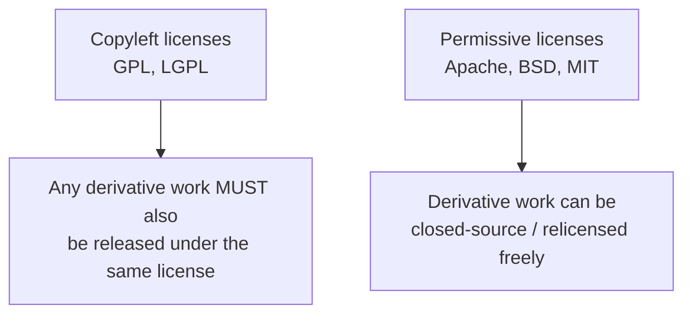
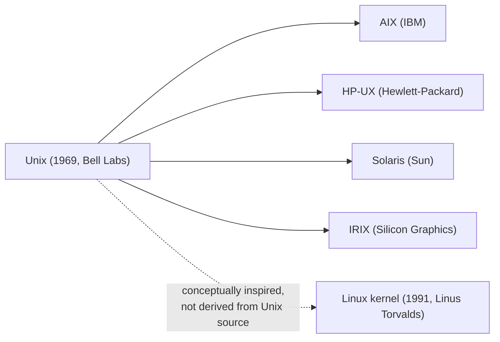
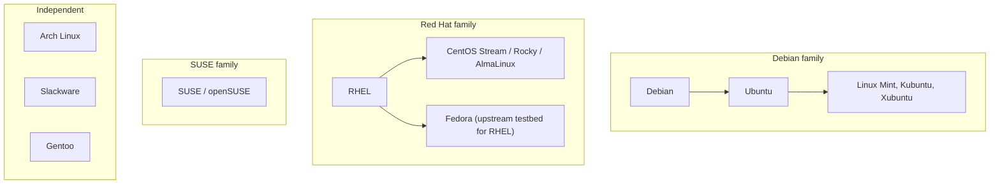
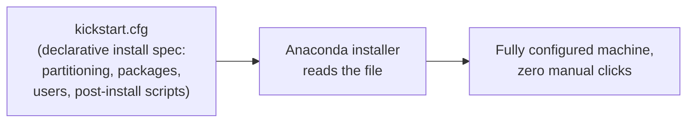
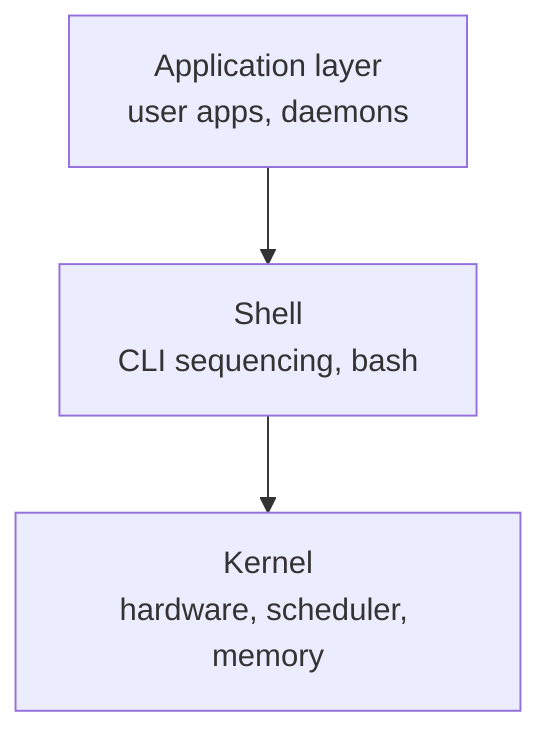
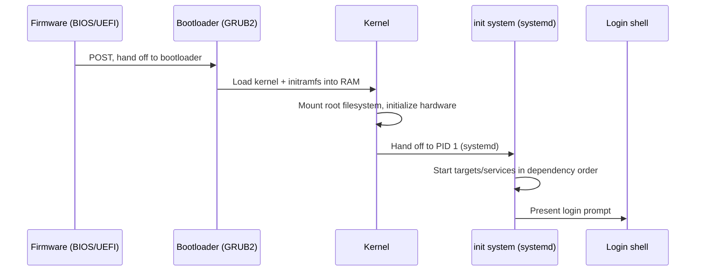

# RHSA1 - Red Hat System Administration I - Complete Notes (Day 1 + Day 2)

> [!info] How to read this note
> Everything traces back to the two slide decks unless a line, block, or section is tagged **[EXTRA]** in bold. This course (RHSA1) is an entry-level Linux fundamentals course - it deliberately does not cover package management, text processing, I/O redirection, systemd/services, SSH, or process management, all of which a working DevOps engineer needs day one on the job. A large **[EXTRA]** section is added at the end to close that gap. No emoji are used anywhere in this file.

## Course Roadmap (from the decks' own contents slides)

| Day | Topics |
|---|---|
| 1 | FOSS and licenses, Linux history, Linux components, installation, basic commands, Linux documentation, file and directory basics |
| 2 | User and group administration, permissions, switching to other accounts, shutting down the system |

---

# DAY 1

# 01 - What is FOSS

> [!quote] Deck definition
> Free/Open Source Software (FOSS) provides many freedoms, including the ability to: view the source code used to compile programs; make modifications; distribute these modifications. Most FOSS is covered under a public license. The most common public license is the GNU General Public License (GPL).

## FOSS Licenses

> [!quote] Deck definition
> An open-source license is a type of license for computer software and other products that allows the source code, blueprint or design to be used, modified and/or shared under defined terms and conditions.

| Deck's listed examples |
|---|
| GPL |
| LGPL |
| Apache |
| Mozilla Public License |
| BSD |

**[EXTRA]** The deck lists five license names without distinguishing what actually separates them. The practical distinction that matters for a DevOps engineer choosing or vetting dependencies is copyleft versus permissive:

| License | Category | Practical consequence |
|---|---|---|
| GPL | Strong copyleft | Any software that links against or incorporates GPL code and is distributed must itself be released under GPL - this is why many companies ban GPL dependencies in proprietary products |
| LGPL | Weak copyleft | Linking against an LGPL library does not force your own code to be GPL, as long as the library itself stays separately replaceable |
| Apache 2.0 | Permissive | Free to use, modify, and relicense as closed-source; includes an explicit patent grant, which GPL/BSD do not |
| BSD | Permissive | Free to use, modify, and relicense as closed-source, minimal restrictions |
| MPL | Weak copyleft | File-level copyleft - only the specific modified files must stay open, not the whole project |

> [!important] Why this matters on the job
> Corporate legal/security teams routinely scan dependency trees for license compliance before a build ships. Pulling in a GPL-licensed library into a closed-source product can create real legal exposure. Tools like `license-checker` (npm), `pip-licenses` (Python), or FOSSA/Snyk license scanning in CI pipelines exist specifically to catch this automatically - a genuinely common real-world DevOps/platform responsibility.

### Self-Check Q and A

1. **Q: A company wants to use an open-source logging library inside their closed-source SaaS product without ever redistributing the modified source. Does the GPL allow this?**
   A: **[EXTRA]** Generally yes for internal/SaaS use without redistribution - the GPL's copyleft obligation is triggered by distributing the software, and many interpretations hold that running modified GPL code as a network service without distributing the binary does not trigger the copyleft clause (this specific gap is what the AGPL exists to close). This is exactly the kind of nuance that makes license scanning tools and legal review necessary rather than assuming licenses are interchangeable.
2. **Q: Why would Apache 2.0 be preferred over BSD for a company contributing a library that competitors might want to use and later sue over patents?**
   A: **[EXTRA]** Apache 2.0 includes an explicit patent grant clause - contributors grant users a license to any patents they hold covering the contributed code, and includes patent-litigation retaliation terms. BSD has no patent clause at all, leaving that risk unaddressed.

---

# 02 - Linux History

> [!quote] Deck's content
> Unix first version created in Bell Labs in 1969. Unix flavors: IBM to AIX, Hewlett-Packard to HP/UX, Sun to Solaris, Silicon Graphics to IRIX. They operate in a same manner and offer the same standard utilities and commands. Linus Torvalds finished his college in 1991 and created the Linux kernel.

> [!important] Correction/clarification on the deck's framing
> **[EXTRA]** The deck's diagram-style list implies Linux sits in the same lineage as AIX/HP-UX/Solaris/IRIX. It does not - those four are all genuine derivatives of the original Bell Labs Unix source code (Unix flavors, licensed from AT&T). Linux is a completely independent, from-scratch kernel written by Linus Torvalds that merely follows the POSIX standard and Unix design philosophy - it shares no original Unix source code at all. This distinction matters technically: Linux is "Unix-like," not "a Unix."

**[EXTRA]** Distros - Linux's actual defining structural feature the deck's history slide skips: the Linux kernel alone is not an operating system. A distribution (distro) bundles the kernel with GNU userland tools (bash, coreutils, compilers), a package manager, and often a desktop environment. This is why "Linux" in casual conversation usually means a full distro like RHEL or Ubuntu, not the bare kernel.

### Self-Check Q and A

1. **Q: Is Linux technically a Unix derivative in the same sense as AIX or Solaris?**
   A: **[EXTRA]** No - AIX, HP-UX, Solaris, and IRIX are licensed derivatives of the original AT&T Unix source code. Linux is an independently written, from-scratch kernel that follows the same POSIX standards and design philosophy but shares no original Unix source - it is "Unix-like," not a genuine Unix derivative.
2. **Q: What is the actual difference between "the Linux kernel" and "a Linux distribution"?**
   A: **[EXTRA]** The kernel alone only manages hardware, processes, and memory - it provides no shell, no package manager, no user-facing tools at all. A distribution bundles the kernel with the GNU userland (bash, coreutils), a package manager, init system, and often a desktop environment into something actually installable and usable.

---

# 03 - Distros and Contributors

> [!quote] Deck's content
> Linux Flavors are listed at http://distrowatch.com, with logos shown for arch, debian, fedora, foresight, gentoo, mandriva, linux mint, kubuntu, opensuse, pclinuxos, redhat, sabayon, slackware, slax, ubuntu, xubuntu. A contributors pie chart shows Red Hat at 10.2 percent, Intel at 8.8 percent, Texas Instruments at 4.1 percent, Linaro at 3.5 percent, SUSE at 3.1 percent, IBM at 2.6 percent, Samsung at 2.4 percent, Google at 2.3 percent, Vision Engraving Systems at 1.6 percent, Wolfson Microelectronics, and Others at 57.3 percent.

**[EXTRA]** The deck presents distros as an unordered logo wall with no explanation of what actually distinguishes them structurally. For a DevOps engineer, the family a distro belongs to determines the package manager, the config file locations, and the command syntax used every day - this is genuinely more important than knowing the logos.

| Family | Package manager | Package format | Config example |
|---|---|---|---|
| Debian (Debian, Ubuntu, Mint, Kubuntu) | `apt` / `apt-get` / `dpkg` | `.deb` | `/etc/apt/sources.list` |
| Red Hat (RHEL, Fedora, CentOS, Rocky, AlmaLinux) | `dnf` (modern) / `yum` (legacy) / `rpm` | `.rpm` | `/etc/yum.repos.d/` |
| SUSE (SUSE, openSUSE) | `zypper` | `.rpm` | `/etc/zypp/repos.d/` |
| Arch | `pacman` | `.pkg.tar.zst` | `/etc/pacman.conf` |

> [!important] Why this matters more than the logo wall
> **[EXTRA]** Since this is a Red Hat course (RHSA1), everything downstream in this note assumes RHEL/Fedora/CentOS-family conventions - `dnf`/`yum`, `/etc/yum.repos.d/`, `systemctl` and `firewalld` defaults, and SELinux enabled by default. A DevOps engineer moving between a RHEL-based production fleet and Ubuntu-based CI runners needs to consciously translate between these two command sets - a very common real-world friction point.

### Self-Check Q and A

1. **Q: What determines whether a distro uses `apt` or `dnf`, and why does this matter beyond installing software?**
   A: **[EXTRA]** It's determined by which family the distro descends from (Debian versus Red Hat). Beyond installation syntax, it affects config file locations, service defaults, default firewall tooling (`ufw` versus `firewalld`), and how patches/security updates are delivered - operational knowledge that does not transfer 1:1 between families.
2. **Q: Why does knowing a distro's family matter more for a DevOps engineer than knowing its logo or release history?**
   A: **[EXTRA]** Because day-to-day operational tasks - installing packages, managing services, reading logs, configuring firewalls - all follow family-specific conventions. Two distros in the same family (RHEL and Fedora, or Debian and Ubuntu) transfer skills almost completely; two distros in different families require relearning basic operational muscle memory.

---

# 04 - Why Linux, Why Red Hat

> [!quote] Deck's content on Why Linux
> Linux is growing in the home users sector and the dominant of the professional and servers sector. Internet service providers (ISPs), e-commerce sites, and other commercial applications all use Linux today and continue to increase their commitment to Linux.

> [!quote] Deck's content on Why Red Hat
> More than 90 percent of Fortune Global 500 companies use Red Hat products and solutions. The most demanding applications run better on Red Hat Enterprise Linux. RHEL scales well, and is more reliable. RHEL is secure. Red Hat partnership with hardware vendors. Red Hat training and support.

**[EXTRA]** The single most relevant "why Red Hat" fact for someone targeting cloud/DevOps roles, which the deck does not mention: RHEL is the direct upstream for Amazon Linux's design conventions and is a first-class supported OS on every major cloud (AWS, Azure, GCP), with subscription-based support models (Red Hat Enterprise Linux subscriptions bundled into cloud marketplace images) that enterprises pay for specifically to get vendor-backed SLAs on a production OS.

### Self-Check Q and A

1. **Q: Beyond stability and support, why is RHEL specifically relevant to someone targeting AWS Cloud Architect or DevOps roles?**
   A: **[EXTRA]** RHEL is a first-class supported guest OS across every major cloud provider with paid support SLAs available through the cloud marketplace, and its conventions (SELinux, `dnf`, `systemd`, `firewalld`) are the same conventions used across the broader Red Hat-family ecosystem an enterprise cloud environment is likely to standardize on.

---

# 05 - Types of Installation

> [!quote] Deck's content
> Kickstart Mode permits automated installation. Graphical Installation. Text Based Installation.

**[EXTRA]** The deck names Kickstart without explaining what it actually is or why it matters operationally. Kickstart is Red Hat's declarative, unattended-installation configuration file format - genuinely relevant to a DevOps engineer because it is the direct conceptual ancestor of "infrastructure as code" applied to OS installation itself, decades before Terraform existed.

## minimal illustrative kickstart snippet

lang en_US.UTF-8  
keyboard us  
timezone America/New_York  
rootpw --iscrypted 66 6...  
network --bootproto=dhcp  
%packages  
@core  
httpd  
%end

> [!info] Why this is still relevant today
> **[EXTRA]** Kickstart files are commonly baked into custom AMIs, PXE-boot network installs for bare-metal fleets, and automated CI pipelines that build golden images. Conceptually it is the same "describe the desired end state, apply it unattended" pattern you already know from Terraform and Kubernetes manifests, just applied at the OS-installation layer rather than the infrastructure or container layer.

### Self-Check Q and A

1. **Q: What conceptual pattern does Kickstart share with tools like Terraform or Ansible, despite predating both?**
   A: **[EXTRA]** Declarative, unattended provisioning - you describe the desired end state (partitions, packages, users, post-install scripts) in a file, and a tool (Anaconda) reconciles a machine to that state with no manual interaction, the same "describe once, apply repeatedly" philosophy Terraform applies to cloud infrastructure.

---

# 06 - Linux Components

> [!quote] Deck's content on Kernel
> Is the core of the operating system. Contains components like device drivers. It loads into RAM when the machine boots and stays resident in RAM until the machine powers off.

> [!quote] Deck's content on Shell
> Provides an interface by which the user can communicate with the kernel. Bash is the most commonly used shell on Linux. The shell parses commands entered by the user and translates them into logical segments to be executed by the kernel or other utilities.

> [!quote] Deck's content on Terminal
> Gives the shell a place to accept typed commands and to display their results.

**[EXTRA]** The deck's three-layer diagram (kernel, shell, terminal/application) is accurate but leaves out the actual boot sequence that gets a machine from power-on to that shell prompt - genuinely relevant troubleshooting knowledge for a DevOps engineer working with bare-metal or cloud instances that fail to boot.

| Stage | What actually happens |
|---|---|
| Firmware (BIOS/UEFI) | Power-on self-test, locates a bootable device |
| Bootloader (GRUB2 on RHEL) | Presents kernel choices, loads chosen kernel + initramfs into RAM |
| Kernel | Initializes hardware via drivers, mounts the real root filesystem, hands control to PID 1 |
| Init system (systemd on modern RHEL) | Starts services/targets in dependency order, eventually reaches a login prompt or graphical target |

> [!important] Kernel versus shell versus terminal versus console - four terms often confused
> **[EXTRA]** Kernel: the actual privileged code managing hardware. Shell: the command interpreter (bash, zsh) that parses what you type. Terminal: historically a physical device, today a program (or pseudo-terminal, `pty`) that displays text and captures keystrokes. Console: specifically the physical/virtual system console tied directly to the machine (see the deck's own virtual consoles slide later) - distinct from a terminal emulator window or an SSH session, which is a pseudo-terminal, not a console.

### Self-Check Q and A

1. **Q: Why does the deck's kernel definition specifically mention it "stays resident in RAM until the machine powers off"?**
   A: The kernel must always be immediately available to service hardware interrupts, schedule processes, and manage memory for every running program - it cannot be paged out or unloaded the way an application can, since literally everything else depends on it being present.
2. **Q: A production server fails to reach a login prompt after a power cycle. At which of the four boot stages would you start investigating first, and why?**
   A: **[EXTRA]** Check bootloader output first (does GRUB even appear, can you select a kernel), then kernel boot messages (is it stuck initializing a driver or failing to mount root), then systemd (`systemctl status`, failed units) - working through the sequence in order narrows the failure to a specific stage rather than guessing.
3. **Q: What is the actual difference between a terminal and a console?**
   A: **[EXTRA]** A console is tied directly to the physical machine's own display/keyboard (or the virtual console mechanism the deck describes later, `Ctrl-Alt-F_key`). A terminal (or terminal emulator) is a program presenting a shell inside a window or over a network connection (SSH) - technically a pseudo-terminal, not a genuine console device.

---
