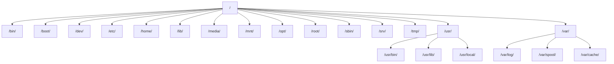
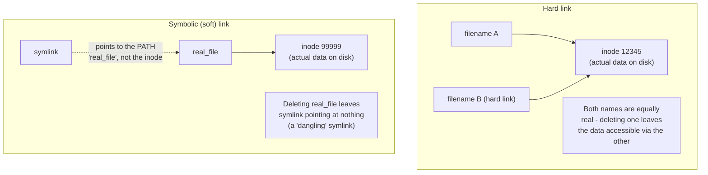

# 07 - Command-Line Shells

> [!quote] Deck's content
> There are lot of shells as Bourne Shell (sh), Korn Shell (ksh), C Shell (csh) and Bourne Again Shell (bash). They have different features that will be discussed later.

| Shell | Notable trait |
|---|---|
| sh (Bourne) | 1977, the original - minimal, POSIX baseline |
| ksh (Korn) | Adds scripting features, arrays, better job control |
| csh (C Shell) | C-like syntax, historically popular interactively, poor scripting reputation |
| bash (Bourne Again) | Default on almost all Linux distros - superset of sh with history, tab completion, job control |

**[EXTRA]** The deck names four shells without saying why the choice matters practically. Two distinctions actually affect a DevOps engineer daily:

> [!warning] `#!/bin/sh` versus `#!/bin/bash` in scripts is not cosmetic
> On many distros (notably Debian/Ubuntu), `/bin/sh` is symlinked to `dash`, a minimal POSIX-only shell - NOT bash. A script written with bash-specific syntax (arrays, `[[ ]]` test syntax, `local` keyword nuances) but shebanged `#!/bin/sh` will silently behave differently or fail outright on such systems. Always match the shebang to the actual syntax used in the script.

```bash
#!/bin/bash          # explicit - guarantees bash-specific features work
echo ${array[@]}      # bash array syntax - fails under dash

#!/bin/sh             # POSIX-only - portable across sh implementations, but no bash extensions allowed
```

### Self-Check Q and A

1. **Q: A CI pipeline script works fine on a developer's Ubuntu laptop but fails with a syntax error when run inside a minimal Alpine or Debian-based container. The script begins with `#!/bin/sh` but uses bash arrays. What's actually happening?**
   A: **[EXTRA]** `/bin/sh` on many minimal/Debian-based systems is not bash - it is `dash`, a strict POSIX shell with no array support. The shebang lied about what interpreter would actually run the script's bash-specific syntax. Fix: change the shebang to `#!/bin/bash` (and ensure bash is installed in the image), or rewrite the script to be POSIX-compliant.

---

# 08 - Running Commands

> [!quote] Deck's content
> Commands have the following syntax: `command [options] [arguments]`. Each item is separated by a space. Options modify the command's behavior. Arguments are files name or other information needed by the command. Separate commands with semicolon.

command [options] [arguments]
```bash
uname
uname -n
uname -a
cal
cal 5 2004
cal; uname
cal 5 2002; date; uname
```

**[EXTRA]** The deck's `command [options] [arguments]` grammar and semicolon chaining is correct but incomplete for real command-line work. Command chaining has several distinct operators with genuinely different behavior, which is essential for writing correct shell scripts and one-liners:

| Operator | Behavior |
|---|---|
| `;` | Run the next command regardless of whether the previous one succeeded or failed |
| `&&` | Run the next command ONLY if the previous one succeeded (exit code 0) |
| `\|\|` | Run the next command ONLY if the previous one failed (non-zero exit code) |
| `&` | Run the command in the background, don't wait for it |
| `\|` | Pipe - feed the first command's output as the second command's input (covered in the Beyond the Slides section) |

```bash
mkdir /tmp/work && cd /tmp/work    # only cd if mkdir succeeded - avoids operating in the wrong directory
apt update || echo "update failed"  # run the echo only if apt update failed
long_running_task &                  # backgrounded, shell prompt returns immediately
```

> [!warning] `;` silently masks failures
> **[EXTRA]** `cmd1; cmd2` runs `cmd2` even if `cmd1` failed catastrophically. This is a genuinely common scripting bug - a failed `cd` followed by a destructive `rm -rf *` intended for a different directory, chained with `;`, executes the `rm` in the wrong (current) directory anyway. `&&` is almost always the safer choice for sequential operations that depend on each other.

### Self-Check Q and A

1. **Q: `cd /some/path; rm -rf *` is run and `/some/path` does not exist. What actually happens, and why is this dangerous?**
   A: **[EXTRA]** `cd` fails and prints an error, but because the two commands are joined with `;` (not `&&`), the shell proceeds to run `rm -rf *` anyway - in whatever directory the shell was already in, potentially deleting unintended files. Joining with `&&` instead would have stopped execution the moment `cd` failed.
2. **Q: What's the exit-code difference in behavior between `cmdA && cmdB` and `cmdA || cmdB`?**
   A: `&&` runs `cmdB` only when `cmdA` exits 0 (success). `||` runs `cmdB` only when `cmdA` exits non-zero (failure) - they are complementary conditionals based on the previous command's exit status.

---

# 09 - Interrupting Execution

> [!quote] Deck's content
> To interrupt a command that's taking too long to execute, use Ctrl-c. Occasionally, you might enter a command without an argument that expects input to come from the keyboard. In this case, use Ctrl-d to terminate the command.

| Key combination | Effect |
|---|---|
| Ctrl-c | Sends SIGINT - interrupts/terminates the running foreground process |
| Ctrl-d | Sends EOF (end-of-file) on stdin - terminates a command waiting on keyboard input, or logs out of an empty shell |

**[EXTRA]** The deck presents these as two isolated keyboard shortcuts without connecting them to the underlying signal mechanism, which matters once you move beyond interactive use into process management:

| Key/command | Signal sent | Can be caught/ignored by the process? |
|---|---|---|
| Ctrl-c | SIGINT (2) | Yes - a program can install a handler and ignore it |
| Ctrl-z | SIGTSTP (20) - suspends the process, does not terminate it | Yes |
| Ctrl-\ | SIGQUIT (3) - terminate + core dump | Yes |
| `kill -9 <pid>` | SIGKILL (9) | No - cannot be caught, ignored, or handled; the kernel terminates it unconditionally |

> [!important] Ctrl-c not working means the process is ignoring SIGINT
> **[EXTRA]** A hung process that does not respond to Ctrl-c is very common with processes that have installed a custom SIGINT handler (often to do graceful cleanup) that is itself stuck, or that are in an uninterruptible kernel wait state (`D` state, usually blocked on I/O). `kill -9` is the escalation, since SIGKILL cannot be intercepted - but it also means the process gets zero chance to clean up open files or connections.

### Self-Check Q and A

1. **Q: Ctrl-c does nothing to a hung process. What's the actual reason this can happen, and what's the practical escalation?**
   A: **[EXTRA]** Ctrl-c sends SIGINT, which a process can catch, ignore, or handle with custom cleanup logic - so a process that installed a handler (stuck or otherwise) simply doesn't terminate on SIGINT. Escalate to `kill -9 <pid>` (SIGKILL), which the kernel enforces unconditionally and cannot be intercepted - at the cost of the process getting no chance to clean up gracefully.
2. **Q: Why does Ctrl-d work to "terminate a command waiting on keyboard input" specifically, rather than being a kill signal like Ctrl-c?**
   A: Ctrl-d does not send a signal at all - it sends an EOF marker on standard input, which tells a program reading from stdin that there is no more input coming. A program written to read until EOF (like `cat` with no filename argument) then naturally exits because its read loop ends.

---

# 10 - Linux Documentation

> [!quote] Deck's content on manual pages
> Manual page consists of: Name (the name of the command and a one-line description), Synopsis (the syntax of the command), Description (explanation how the command works and what it does), Files (the file used by the command), Bugs (known bugs and errors), See also (other commands related to this one).

```bash
man -k keyword       # shows commands whose manual pages contain any of the given keywords
man -s keyword
whatis command        # shows the command's one-line description
```

> [!quote] Deck's content on --help
> Another way to get help about a command. help is built in the command itself (if supported).

**[EXTRA]** Two gaps in the deck's documentation coverage worth closing:

```bash
man 5 passwd      # man pages are organized into numbered SECTIONS -
                    # section 1 = user commands, section 5 = file formats,
                    # section 8 = admin/system commands. "man passwd" alone
                    # shows section 1 (the passwd COMMAND); "man 5 passwd"
                    # shows the /etc/passwd FILE FORMAT - different pages entirely

info command        # a separate, often more detailed documentation system
                     # (GNU project's alternative to man, hyperlinked, less commonly used today)

apropos keyword      # equivalent to "man -k" - searches man page descriptions
```

> [!warning] `man passwd` versus `man 5 passwd` is a genuinely common confusion point
> **[EXTRA]** Running `man passwd` with no section number returns the FIRST matching section found (usually section 1, the `passwd` command that changes a user's password) - not the file format documentation for `/etc/passwd` you might actually be looking for, which lives in section 5. This is directly relevant given the deck's own upcoming coverage of `/etc/passwd` and `/etc/shadow` file formats in Day 2.

### Self-Check Q and A

1. **Q: You run `man passwd` looking for the exact field layout of the `/etc/passwd` file, but the page you get describes changing a user's password instead. What went wrong, and what's the fix?**
   A: **[EXTRA]** `man passwd` without a section number defaults to section 1 (user commands), showing the `passwd` command's man page rather than the file format. `man 5 passwd` explicitly requests section 5 (file formats), which documents the actual `/etc/passwd` field layout.

---

# 11 - Directories

> [!quote] Deck's content
> Think of file system as a building, directory is a room, file is a desk. The current working directory is the room you are. To find out where you are at any time, use pwd.

```bash
pwd
/home/guest
```

> [!quote] Deck's content on pathnames
> Pathnames: absolute pathname, relative pathname.



| Directory | Purpose |
|---|---|
| `/bin`, `/sbin` | Common programs, system administration programs |
| `/boot` | Kernel and other boot files |
| `/dev` | Device files |
| `/etc` | Configuration files |
| `/home` | User's home directories |
| `/lib` | Shared libraries |
| `/mnt`, `/media` | Mounted filesystems |
| `/opt` | Optional/third-party application installs |
| `/root` | The root user's home directory |
| `/tmp` | Temporary files |
| `/usr` | User programs, documentation, shared libraries |
| `/var` | Log files, spool files, and other dynamic/variable data |

> [!important] Absolute versus relative pathnames
> Absolute: starts from `/`, unambiguous regardless of current location, e.g. `/home/user1/work`. Relative: starts from the current working directory, e.g. `work` or `../user2`.

**[EXTRA]** Two directories the deck's tree diagram omits that a DevOps engineer will use constantly:

| Directory | Purpose |
|---|---|
| `/proc` | Virtual filesystem - not real files on disk, a live window into kernel/process state (`/proc/cpuinfo`, `/proc/<pid>/status`) |
| `/sys` | Virtual filesystem exposing kernel and device driver information/tuning, used heavily for hardware and kernel parameter inspection |

### Self-Check Q and A

1. **Q: What's the practical difference in reliability between `cd work` and `cd /home/user1/work` when used inside a script that might run from an unpredictable starting directory?**
   A: The relative form (`cd work`) depends entirely on where the script happens to be invoked from - it silently does the wrong thing (or errors) if the script's current directory assumption is wrong. The absolute form is unambiguous regardless of starting location, which is why scripts almost always prefer absolute paths for anything beyond trivial local operations.
2. **Q: You run `cat /proc/cpuinfo` and get real-looking output, but `ls -l /proc/cpuinfo` shows a file size of 0 bytes. Why?**
   A: **[EXTRA]** `/proc` is a virtual (pseudo) filesystem - its "files" are not stored on disk at all; they are generated on-the-fly by the kernel when read. The 0-byte size reflects that there's no static file content, only a live kernel data feed presented through a filesystem-like interface.

## Changing Directories

```bash
cd /home/user1/work
cd ..
cd ~
cd -
```

| Command | Meaning |
|---|---|
| `cd ..` | Move up one level |
| `cd ~` | Go to home directory |
| `cd -` | Go to the PREVIOUS directory (toggle back and forth) |

**[EXTRA]** `cd -` is genuinely underused - it toggles between the current and immediately-previous working directory, useful for quickly bouncing between two locations without retyping paths.

## Listing Directory Contents

```bash
ls
ls /home/user1/dir1
ls dir1
ls -a dir1        # show hidden files (dotfiles) too
ls -l dir1         # long format - permissions, owner, size, date
ls -F              # append type indicators: / for dirs, * for executables, @ for symlinks
ls -ld dir1         # show the DIRECTORY's own info, not its contents
ls -R              # recursive listing
```

> [!important] Hidden files (dotfiles)
> Any file or directory beginning with `.` is hidden from a plain `ls` and requires `-a` to see. This is the standard Linux convention for user config files (`.bashrc`, `.ssh/`, `.gitconfig`) - not a security mechanism, purely a display convention to reduce clutter.

**[EXTRA]** Reading an `ls -l` line, since the deck shows the output but does not decode it field by field:

-rw-r--r-- 1 islam islam 20 2 May 21 16:11 f1

| Field | Value | Meaning |
|---|---|---|
| 1 | `-rw-r--r--` | File type + permissions (covered fully in the permissions section) |
| 2 | `1` | Number of hard links |
| 3 | `islam` | Owning user |
| 4 | `islam` | Owning group |
| 5 | `20` | (In this deck's slightly non-standard example) size-related field |
| 6-8 | `2 May 21 16:11` | Last modification date and time |
| 9 | `f1` | Filename |

### Self-Check Q and A

1. **Q: `ls dir1` shows nothing, but you know files exist inside it. What's the most likely reason, and what flag reveals them?**
   A: The files are dotfiles (hidden files, names starting with `.`) - `ls` hides them by default. `ls -a dir1` reveals all entries including hidden ones.
2. **Q: `ls -l dir1` and `ls -ld dir1` produce very different output for the same directory. What's the difference?**
   A: `ls -l dir1` lists the CONTENTS of `dir1` in long format. `ls -ld dir1` shows information ABOUT the `dir1` entry itself (its own permissions, owner, size as a directory) without descending into it - the `-d` flag treats the directory as a single entry rather than a container to list.

## File Naming

> [!quote] Deck's content
> File names may be up to 255 characters. There are no extensions in Linux. Avoid special characters as greater-than, less-than, question mark, asterisk, hash, apostrophe. File names are case sensitive.

> [!important] "No extensions in Linux" - what this actually means
> **[EXTRA]** This does not mean extensions are forbidden - `report.pdf`, `script.sh`, `image.png` all work fine. It means the OS/kernel attaches NO special meaning to whatever comes after a dot - unlike Windows, where the extension itself determines how the OS handles a double-clicked file. On Linux, a file's actual type is determined by its content (checked via the `file` command using magic-byte signatures) or by execute permission plus a shebang line, never by the name alone. `mv script.txt script` still runs perfectly fine as a script if it has execute permission and a valid shebang.

```bash
file somefile          # inspects actual content to report the real file type, regardless of name/extension
```

### Self-Check Q and A

1. **Q: A colleague renames `deploy.sh` to `deploy` (no extension) and it still runs perfectly when executed as `./deploy`. Why does removing the extension not break it, unlike on Windows?**
   A: **[EXTRA]** Linux never uses the filename extension to determine executability or file type - it uses the execute permission bit combined with the shebang line (`#!/bin/bash`) at the top of the file to know how to run it. The `.sh` was purely a human-readable convention, carrying zero meaning to the OS itself.

## Viewing File Content

```bash
cat fname
more fname
head -n fname
tail [-n|+n] fname
```

> [!quote] Deck's more scrolling keys
> Spacebar moves forward on screen. Return scrolls one line at a time. b moves back one screen. /string searches forward for pattern. n finds the next occurrence. q quits and returns to the shell prompt.

**[EXTRA]** `more` only scrolls forward by default (its `b` back-scroll support is limited/inconsistent across systems). `less` is the modern, near-universal replacement that supports full bidirectional scrolling, search in both directions, and does not require loading the entire file before displaying it - genuinely the tool reached for in practice over `more` today, even though the deck only teaches `more`.

```bash
less fname             # preferred over more - "less is more": full scrollback, search, no full-file read needed
tail -f /var/log/messages   # -f = follow, keep printing new lines as they're appended - ESSENTIAL for live log watching
```

> [!important] `tail -f` is one of the single most-used commands in DevOps work
> **[EXTRA]** Watching a log file grow in real time while reproducing a bug, deploying a change, or debugging a crash loop is a daily activity - `tail -f logfile` (or `tail -f` combined with `grep` via a pipe, covered in the Beyond the Slides section) is the standard tool for this.

### Self-Check Q and A

1. **Q: Why would `less` be preferred over `more` for viewing a very large log file, beyond just having more features?**
   A: **[EXTRA]** `more` (on many implementations) must read through the file linearly and has weak or no backward-scrolling support. `less` does not need to read the whole file upfront to start displaying it and supports full bidirectional scrolling and searching - meaningful for genuinely large files where `more`'s limitations become a real obstacle.

## File Globbing and Metacharacters

> [!quote] Deck's content
> When typing commands, it is often necessary to issue the same command on more than one file at a time. The use of wildcards, or metacharacters, allows one pattern to expand to multiple filenames.

| Metacharacter | Meaning | Deck's example |
|---|---|---|
| `*` | 0 or more characters, except a leading dot | `ls f*` matches file.1, file1, etc; `ls *3` matches names ending in 3 |
| `?` | Exactly one character, except a leading dot | `ls file?` matches file4, file1, file2 but not file10 |
| `[...]` | A range or set of characters for a single position | `ls [a-f]*`, `ls [pf]*`, `ls [ab]*` |

```bash
ls ???            # exactly three characters
ls ?a?             # 3 chars, 'a' in the middle
ls ?a*             # starts with any char, then 'a', then anything
ls *a*             # 'a' anywhere in the name
ls .*              # dotfiles only (matches the leading dot explicitly)
ls [a-zA-Z]*       # starts with any letter, upper or lower case
```

> [!important] Globbing is expanded BY THE SHELL, not by the command itself
> **[EXTRA]** This is a critical mechanical detail the deck's examples don't make explicit. When you type `ls *.txt`, the shell itself expands `*.txt` into the actual matching filenames BEFORE `ls` ever runs - `ls` never sees the asterisk at all, only a list of real filenames. This matters because it means globbing works identically for every command (`rm *.txt`, `cp *.log /backup/`, `grep -l TODO *.py`) since it's a shell-level feature, not something each individual command has to implement.

> [!warning] A dangerous consequence of shell-side expansion
> **[EXTRA]** `rm *` in a directory with hundreds of matching files expands to `rm file1 file2 file3 ...` (every name spelled out) before `rm` runs - if there are more matching files than the shell's argument-length limit allows, this can fail with "argument list too long." This is exactly why tools like `find ... -exec` or `xargs` exist for operating on very large file sets - they avoid expanding everything into one gigantic command line at once.

### Self-Check Q and A

1. **Q: When you run `rm *.log`, does the `rm` command itself understand the asterisk wildcard?**
   A: No - the shell expands `*.log` into the literal list of matching filenames before `rm` is ever invoked. `rm` only ever receives a plain list of real filenames as arguments; it has no wildcard-matching logic of its own.
2. **Q: `rm *` fails with "argument list too long" in a directory containing tens of thousands of files. Why does this happen, and what's the standard alternative?**
   A: **[EXTRA]** The shell expands `*` into every matching filename as literal command-line arguments before executing, and the kernel enforces a maximum total length for a single command's argument list (`ARG_MAX`) - exceeding it causes this exact error. `find /path -name '*' -exec rm {} \;` or piping through `xargs` processes files in batches instead of expanding everything into one command line at once.
3. **Q: Why does `ls *3` NOT match a hidden file named `.file3`, even though the name contains a 3 at the end matching the pattern shape?**
   A: `*` explicitly excludes matching a LEADING dot - this is a deliberate glob convention so that wildcards don't accidentally sweep up dotfiles/config files unless you explicitly ask for them (e.g., with `.* ` or `-a` style patterns).

## File and Directory Manipulation

```bash
cp options source(s) target
mv options source(s) target
touch file(s)_name
mkdir [-p] dir(s)_name
rm [-i] file(s)_name
rmdir dir(s)_name
rm [-r] dir(s)_name
```

| Command | Option | Meaning |
|---|---|---|
| `cp` | `-i` | Prevents accidentally overwriting existing files/directories |
| `cp` | `-r` | Copy a directory including contents of all subdirectories |
| `mv` | `-i` | Prevents accidentally overwriting existing files/directories |
| `mkdir` | `-p` | Create parent directories as needed (no error if they already exist) |
| `rm` | `-i` | Prompt before each removal |
| `rm` | `-r` | Recursive - required to remove a directory and its contents |

**[EXTRA]** Two significant gaps the deck's file-manipulation slides leave open, both essential daily-use knowledge:

```bash
ln target linkname          # create a HARD link
ln -s target linkname        # create a SYMBOLIC (soft) link
```



| | Hard link | Symbolic (soft) link |
|---|---|---|
| Points to | The same inode (actual data) directly | The target's PATH/name |
| Can cross filesystems? | No - must be on the same filesystem | Yes |
| Can link to a directory? | No (with rare exceptions) | Yes |
| Original deleted | Data survives via the remaining hard link | Symlink becomes "dangling" - broken, points nowhere |
| `ls -l` appearance | Looks like a normal file | Shown with `l` type and an arrow to the target: `lrwxrwxrwx ... symlink -> real_file` |

> [!important] Why this matters for a DevOps engineer specifically
> **[EXTRA]** Symlinks are the standard mechanism for versioned release directories (`/opt/app/current -> /opt/app/releases/v1.4.2`), for switching active configuration/binary versions atomically during deployments, and for tools like `alternatives`/`update-alternatives` on RHEL that manage which binary a generic command name points to. Genuinely essential knowledge, absent entirely from this deck.

```bash
rsync -avz source/ destination/     # far more capable than cp for large transfers, syncing, or remote copies
```

### Self-Check Q and A

1. **Q: You delete `real_file`, and a symlink named `link_to_real_file` still exists pointing at it. What happens if you try to `cat link_to_real_file` now?**
   A: **[EXTRA]** It fails with a "No such file or directory" error - the symlink only stored the PATH `real_file`, not the data itself. With the target gone, the symlink is now "dangling" and resolves to nothing.
2. **Q: You create a hard link `file_B` to `file_A`, then delete `file_A`. Is the data still accessible?**
   A: **[EXTRA]** Yes, fully - a hard link is a second name pointing at the exact same inode (the actual data on disk). The data is only truly removed once ALL hard links to that inode are deleted (the link count reaches zero), regardless of which name was created first.
3. **Q: Why can't you create a hard link across two different mounted filesystems (e.g., from `/` to a separately mounted `/data` partition), but a symlink works fine for the same case?**
   A: **[EXTRA]** A hard link references an inode number, and inode numbers are only unique WITHIN a single filesystem - the same inode number could legitimately refer to a completely different file on another filesystem. A symlink instead just stores a text path string, which works regardless of filesystem boundaries since it's resolved fresh at access time.
4. **Q: Why is a symlink like `/opt/app/current -> /opt/app/releases/v1.4.2` a common deployment pattern?**
   A: **[EXTRA]** Repointing the symlink to a new release directory is a single, near-instantaneous atomic operation - the application always reads from the stable `current` path, and a rollback is just re-pointing the symlink back to the previous release directory, with no file copying or downtime involved.

---
