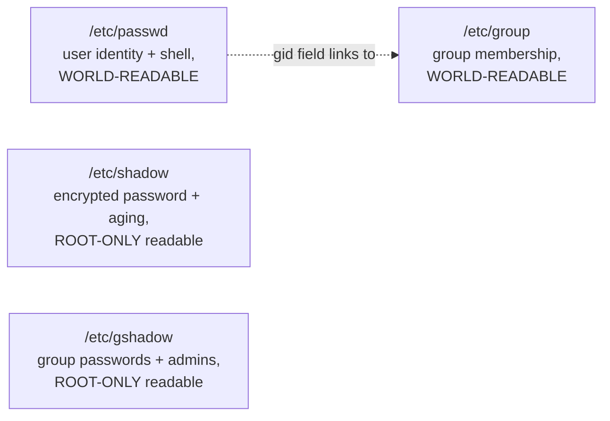
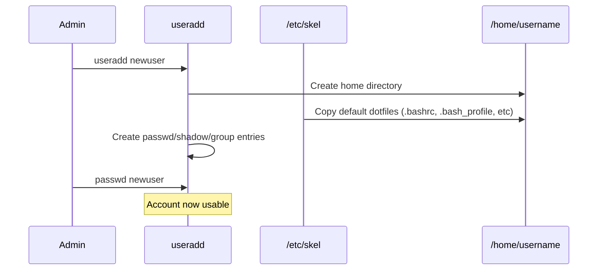
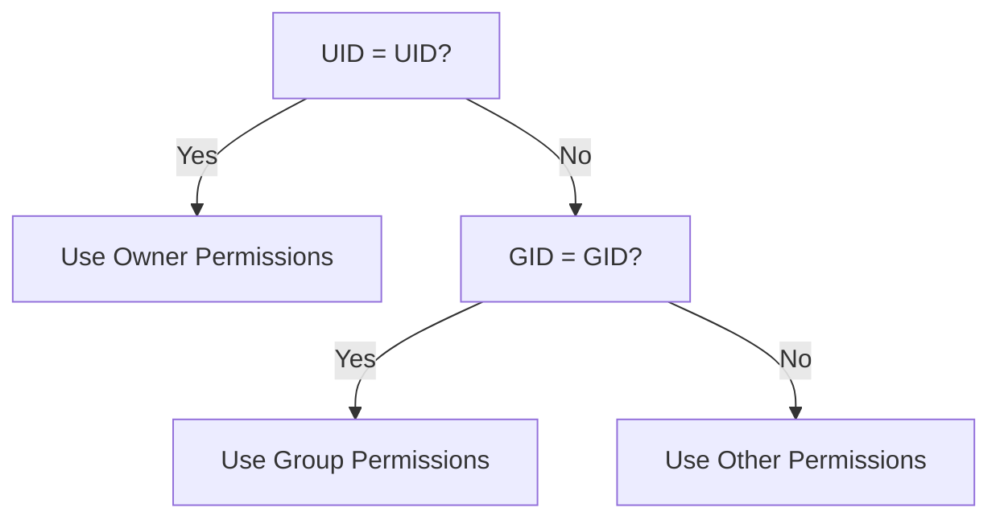

# DAY 2

# 12 - Users and Groups - The Core Files

> [!quote] Deck's content on /etc/passwd
> `loginname:x:uid:gid:comment:home-directory:login-shell`. Included fields are: Login name, User Id (uid), Group Id (gid), Comment about the user, Home Directory, Login shell.

> [!quote] Deck's content on /etc/shadow
> `username:encrypted passwd:last changed:min:max:warn:inactive:expire:future-use`. Included fields are: Login name, Encrypted password, Days since Jan 1 1970 that password was last changed, Days before password may not be changed, Days after which password must be changed, Days before password is to expire that user is warned, Days after password expires that account is disabled, Days since Jan 1 1970 that account is disabled.

> [!quote] Deck's content on /etc/group
> `groupname:x:gid:comma-separated list of group members`. The deck poses `/etc/gshadow` as an open question without answering it.



**[EXTRA]** Answering the deck's own open question about `/etc/gshadow`: it is the group-level counterpart to `/etc/shadow` - it stores encrypted group passwords (used with `newgrp` when a group has a password) and the list of group administrators (users allowed to add/remove members via `gpasswd` without being root). Format: `groupname:encrypted_password:administrators:members`.

> [!important] Why passwords moved from /etc/passwd into /etc/shadow
> **[EXTRA]** In very old Unix systems, the encrypted password lived directly inside `/etc/passwd`, which must remain world-readable (every program that needs to resolve a UID to a username, or check group membership, reads it). This meant every user's encrypted password hash was readable by anyone on the system - a serious weakness once offline password-cracking became practical. The "shadow password" system split password hashes into a SEPARATE file, `/etc/shadow`, readable only by root, while `/etc/passwd` keeps an `x` placeholder in the password field indicating "the real hash lives in shadow." This split is exactly why `/etc/passwd` has permissions `644` while `/etc/shadow` has `600` or `000`, owned by root.

```bash
ls -l /etc/passwd /etc/shadow
# -rw-r--r--  1 root root ... /etc/passwd     <- world-readable
# ----------  1 root root ... /etc/shadow     <- root only
```

### Self-Check Q and A

1. **Q: Why does `/etc/passwd` contain an `x` in the password field instead of an actual encrypted hash on any modern Linux system?**
   A: The `x` is a placeholder indicating that shadow passwords are in use - the real encrypted hash lives in `/etc/shadow` instead, which (unlike `/etc/passwd`) is not world-readable. This split protects password hashes from being harvested by any local user for offline cracking, while still allowing `/etc/passwd` to remain world-readable for username/UID resolution.
2. **Q: What's the actual difference in purpose between `/etc/group` and `/etc/gshadow`?**
   A: **[EXTRA]** `/etc/group` (world-readable) lists group names, GIDs, and member usernames. `/etc/gshadow` (root-only) stores encrypted group passwords and the list of group administrators who can manage membership via `gpasswd` without needing full root access - the same public/private split pattern as passwd/shadow, applied to groups.

## Adding, Modifying, and Deleting Users

> [!quote] Deck's content
> `# useradd username`. The useradd command populates user home directories from the /etc/skel directory. To view and modify default setting: `useradd -D`. `# passwd username`. Adding multiple user accounts: `# newusers filename`.

> [!quote] Deck's content on modifying
> To change a user's account information, you can edit the /etc/passwd or /etc/shadow files manually, or use the chage or usermod commands. Use the usermod command: `usermod [options] username`. Useful options: to change the login name use `-l <login name>`, to lock the password use `-L`, to unlock the password use `-U`.

> [!quote] Deck's content on deleting
> To delete a user account you can manually remove the user from /etc/passwd, /etc/shadow, /etc/group files, remove the user's home directory (/home/username) and mail spool file (/var/spool/mail/username). Use the userdel command: `# userdel [-r] username`.



**[EXTRA]** `/etc/skel` is worth expanding on beyond the deck's one-line mention - it is literally a template home directory. Anything placed in `/etc/skel` (a custom `.bashrc`, a company-standard `.vimrc`, a welcome README) gets copied into every NEW user's home directory automatically at creation time. This is the standard mechanism for enforcing baseline shell configuration across all users on a system.

```bash
useradd -m -s /bin/bash -c "Full Name" username   # -m force home dir creation, -s set shell, -c comment field
usermod -aG groupname username                      # -aG = APPEND to a supplementary group, without this flag
                                                       # usermod -G REPLACES all existing supplementary groups!
```

> [!warning] `usermod -G` versus `usermod -aG` - a very common destructive mistake
> **[EXTRA]** `usermod -G newgroup username` REPLACES the user's entire supplementary group list with just `newgroup`, silently removing them from every other group they belonged to (sudo/wheel, docker, etc). The `-a` (append) flag is required to ADD a group without wiping the existing ones: `usermod -aG newgroup username`. Forgetting `-a` is one of the most common real-world sysadmin mistakes, and it silently breaks a user's other permissions with no warning.

### Self-Check Q and A

1. **Q: What is `/etc/skel` actually for, and why would a company place a custom `.bashrc` there?**
   A: `/etc/skel` is a template directory - its entire contents are copied into every new user's home directory at creation time by `useradd`. Placing a standardized `.bashrc` there ensures every new account gets the same baseline shell configuration (aliases, PATH additions, prompt style) automatically, without manual per-user setup.
2. **Q: A colleague runs `usermod -G docker jsmith` to add jsmith to the docker group. Afterward, jsmith can no longer run `sudo`. What went wrong?**
   A: **[EXTRA]** `-G` without `-a` REPLACES the entire supplementary group list rather than adding to it - jsmith was silently removed from `wheel`/`sudo` (or whatever group granted sudo access) in the process. The correct command was `usermod -aG docker jsmith`, which appends rather than replaces.

## Password Aging Policies

> [!quote] Deck's content
> The chage command sets up password aging: `# chage [options] username`. Options: -m to change the min number of days between password changes, -M to change the max number of days between password changes, -E date to change the expiration date for the account, -W to change the number of days to start warning before a password change will be required.

```bash
chage -l username    # LIST current aging settings for a user - the deck omits this genuinely essential read-only option
```

**[EXTRA]** `chage -l username` is worth adding since the deck only covers the write/modify options - it's the command actually used most often, to audit a user's current password aging status without changing anything, e.g., during a security review.

### Self-Check Q and A

1. **Q: You need to audit whether a specific user account's password has expired or is close to expiring, without modifying anything. Which chage option does this?**
   A: **[EXTRA]** `chage -l username` - lists all current aging information (last change date, min/max days, warning period, expiration) in read-only form, distinct from the deck's modification-focused options (`-m`, `-M`, `-E`, `-W`).

## Private Group Scheme

> [!quote] Deck's content
> A traditional problem found in many UNIX/Linux environments is when administrators place all users in the same primary group. When users on such systems use a umask value of 002. Ubuntu solves this problem by assigning user a primary group for which they are the sole members. This "private" primary group has the same name as the user's username.

**[EXTRA]** The deck's explanation cuts off mid-thought (the sentence about umask 002 has no conclusion). Completing it: with a traditional shared primary group (commonly `users`) and a permissive `umask 002`, every newly created file is group-writable by ALL users in that shared group by default - meaning any user could accidentally (or maliciously) modify any other user's freshly created files. The private group scheme (also called "user private groups," used by RHEL as well as Ubuntu, not just Ubuntu as the deck implies) sidesteps this entirely: since each user's primary group contains only that one user, `umask 002`'s group-writable default only ever grants write access back to the file's own owner, not to a wide shared pool of unrelated users.

### Self-Check Q and A

1. **Q: The deck states the private group scheme solves a problem related to `umask 002` but doesn't explain what the problem actually was. What was it?**
   A: **[EXTRA]** With a single shared primary group for all users and a permissive `umask 002` (which makes new files group-writable by default), every user's newly created files become writable by every OTHER user sharing that same group - a broad, usually unintended write permission across unrelated users' files. Giving each user their own private, single-member primary group means that same `umask 002` default only ever grants write-back access to the file's own creator, eliminating the unintended cross-user write access.

## Managing Groups

> [!quote] Deck's content
> Creating new group: `# groupadd groupname`. Modifying an existing group: `# groupmod [options] groupname`. Deleting a certain group: `# groupdel groupname`. List all files which are owned by groups not defined in /etc/group file: `# find / -nogroup`. You can use the gpasswd command to define group members, group administrators, and to create or change group passwords. Use the -r option to the groupadd command to avoid using a GID within the range typically assigned to users and their private groups.

```bash
groupadd groupname
groupmod [options] groupname
groupdel groupname
find / -nogroup
gpasswd groupname
groupadd -r groupname       # system group - GID outside the normal user range
```

**[EXTRA]** `find / -nogroup` (and its counterpart `find / -nouser`) is presented in the deck without explaining when you'd actually need it: it surfaces orphaned files left behind after a user or group account was deleted without cleaning up their file ownership first - files that now reference a UID/GID with no corresponding entry in `/etc/passwd`/`/etc/group` at all. This is a genuine security/hygiene audit task, since such orphaned ownership can silently be reassigned if a NEW account later reuses that same numeric UID/GID.

### Self-Check Q and A

1. **Q: Why would `find / -nogroup` ever return results on a real system, and why does this matter for security?**
   A: **[EXTRA]** It surfaces files whose GID no longer corresponds to any group in `/etc/group` - typically leftover from a group being deleted without first reassigning or cleaning up files it owned. This matters because if a future new group happens to be created with that same now-orphaned GID, it would silently inherit ownership/access to those old files without anyone intending it.

## Changing Active Group

> [!quote] Deck's content
> To switch between groups you are member in, use `newgrp` command: `newgrp group`. To display the groups you are member in use `groups` command.

```bash
newgrp group
groups
```

**[EXTRA]** `newgrp` changes which group is treated as your CURRENT effective primary group for newly created files within that shell session, without needing to log out - relevant specifically because file ownership (`chown`) and the group-write behavior discussed under the private group scheme both depend on which group is currently "active" for the session.

---

# 13 - Switching Accounts

> [!quote] Deck's content
> `# su [-] [username]`. `# su [-] [username] -c command`.

```bash
su username
su - username
su - username -c command
```

> [!important] The `-` flag in `su` is not decorative
> **[EXTRA]** The deck shows `su [-]` as an optional bracket without explaining the actual difference. Plain `su username` switches identity but KEEPS the calling shell's existing environment (PATH, working directory, environment variables). `su - username` performs a full LOGIN shell simulation - it resets the environment as if that user had genuinely logged in fresh, sourcing their own profile/bashrc, resetting PATH, and changing to their home directory. Forgetting the `-` is a very common source of "why does this command work under sudo but not under `su someuser`" confusion, since the environment (especially PATH) may differ significantly.

```bash
sudo -i username           # roughly the sudo equivalent of "su - username" - full login shell
sudo -u username command    # run a single command as another user without a shell switch at all
```

### Self-Check Q and A

1. **Q: `su appuser` followed by running a deployment script fails with "command not found" for a tool that's clearly installed and normally works fine for appuser directly. What's the likely cause?**
   A: **[EXTRA]** `su appuser` (without the `-`) keeps the CALLING user's environment, including their PATH, rather than loading appuser's own environment/profile. If the tool's directory is only in appuser's PATH (set via their own `.bashrc`/`.bash_profile`), it won't be found under a non-login `su` switch. `su - appuser` performs a full login-shell environment reset and would resolve it.

---

# 14 - The whoami, id, who, w, and finger Commands

> [!quote] Deck's content
> After switching into several users, it is a sever issue to know your current (effective) user. `whoami` returns the effective username.

> [!quote] Deck's content on id
> Displays effective user id, effective user name, effective group id, effective group name.

> [!quote] Deck's content on who
> Displays who is on the system: user login name, login device (tty), login date and time.

> [!quote] Deck's content on w
> The w command displays a summary of the current activity on the system, including what each user is doing: `w [user]`.

> [!quote] Deck's content on finger
> finger is a useful command that reveals details of users: login name, full name, TTY, idle time, login time, office, office phone. `finger username` shows detailed info: login directory, shell, on-since time, idle time, mail status, plan.

**[EXTRA]** The deck presents these five commands as an unordered list without distinguishing WHY you'd reach for each one specifically - they overlap significantly and picking the right one matters for efficiency:

| Command | Answers |
|---|---|
| `whoami` | "Who am I right now, after however many `su`/`sudo` switches?" - fastest, single-purpose |
| `id` | "What's my full identity - UID, GID, and every group I belong to?" - the most complete identity picture |
| `who` | "Who is currently logged into this system, and from where/when?" |
| `w` | "Who is logged in AND what are they currently doing (load average, active command)?" - `who` plus system load plus current process |
| `finger` | "Give me a detailed profile of a specific user" - largely a legacy/security-risk tool today |

> [!warning] `finger` is a security liability on modern production systems
> **[EXTRA]** The deck teaches `finger` without any caveat, but it is essentially never installed or enabled on modern production servers. It's historically been implicated in information-disclosure and even worm-propagation incidents (the original 1988 Morris worm exploited a `finger` daemon buffer overflow), and revealing detailed user activity/idle-time information to any local or (if the finger daemon is network-exposed) remote user is now considered bad security practice. Genuinely useful to know it exists for legacy-system familiarity, but it should not be treated as a tool to reach for on any modern server you're responsible for securing.

### Self-Check Q and A

1. **Q: What's the practical difference between running `whoami` and running `id` after several nested `su` commands?**
   A: `whoami` returns only the current effective username. `id` returns the full identity picture - UID, primary GID, and every supplementary group the current effective user belongs to - genuinely more useful when debugging a permissions issue that depends on group membership, not just username.
2. **Q: Why would a security-conscious DevOps engineer disable or avoid installing the `finger` service on a production server, despite it being a legitimate part of classic Unix tooling?**
   A: **[EXTRA]** `finger` (especially as a network-exposed daemon) discloses detailed information about user activity, login patterns, and idle time to anyone who can query it - useful reconnaissance for an attacker profiling active accounts, and it has a documented history of exploited vulnerabilities (the 1988 Morris worm). Modern hardened server baselines simply don't install it.

---

# 15 - Using the sudo Command

> [!quote] Deck's content
> sudo is more secure. sudo access is controlled by /etc/sudoers. This file is edited by visudo, an editor and syntax checker. To give a specific group of users limited root privileges: `User_Alias LIMITEDTRUST=st1,st2`; `Cmnd_Alias MINIMUM=/etc/init.d/httpd`; `Cmnd_Alias SHELLS=/bin/sh,/bin/bash`; `LIMITEDTRUST ALL=MINIMUM`; `user5 ALL=ALL,!SHELLS`; `%development station1=ALL, !SHELL`.

## /etc/sudoers syntax pattern

User_Alias LIMITEDTRUST = st1, st2  
Cmnd_Alias MINIMUM = /etc/init.d/httpd  
Cmnd_Alias SHELLS = /bin/sh, /bin/bash

LIMITEDTRUST ALL = MINIMUM  
user5 ALL = ALL, !SHELLS  
%development station1 = ALL, !SHELL
**[EXTRA]** The deck presents this sudoers syntax without decoding the grammar or explaining why `visudo` specifically (rather than any text editor) is mandatory:

who where = (as_whom) what

| Piece | Meaning in the deck's examples |
|---|---|
| `who` | A username, `%groupname` (note the leading percent sign for groups), or a `User_Alias` |
| `where` | The hostname this rule applies on - `ALL` means every host, `station1` means only that specific host |
| `what` | `ALL` (any command) or a `Cmnd_Alias`; `!` negates - explicitly DENIES that specific command even if otherwise allowed |

> [!important] Why `visudo` is mandatory, not just recommended
> **[EXTRA]** The deck states visudo is "an editor and syntax checker" but doesn't explain the actual danger it prevents. Editing `/etc/sudoers` directly with a plain text editor (`vi /etc/sudoers`) and introducing a syntax error can lock EVERY user, including root via sudo, out of using `sudo` entirely on that system - since the file is checked at every sudo invocation. `visudo` locks the file during editing (preventing simultaneous conflicting edits) and, critically, validates syntax before saving, refusing to write a broken file and giving you the chance to fix it in place.

```bash
visudo                    # the ONLY safe way to edit /etc/sudoers
sudo -l                    # list what commands the CURRENT user is permitted to run via sudo
```

### Self-Check Q and A

1. **Q: A sysadmin edits `/etc/sudoers` directly with `vi` instead of `visudo` and makes a typo. What's the actual consequence, and why is it worse than a typo in most other config files?**
   A: **[EXTRA]** A syntax error in `/etc/sudoers` can cause `sudo` to refuse to run for anyone at all, since the file is parsed on every invocation - potentially locking out even root's own sudo access if root normally relies on sudo rather than direct root login. `visudo` prevents this specific failure mode by validating syntax before allowing the save to actually take effect.
2. **Q: In the rule `user5 ALL=ALL,!SHELLS`, what does the `!` before SHELLS actually accomplish, given that user5 is already granted ALL commands?**
   A: The `!` explicitly excludes the SHELLS command alias from an otherwise unrestricted grant - user5 can run any command via sudo EXCEPT the ones defined as SHELLS (`/bin/sh`, `/bin/bash`). This is a deliberate technique to prevent someone with broad sudo access from trivially escalating to an interactive root shell, forcing them to run specific commands instead - though this pattern is well known to be imperfect, since many programs can spawn a shell internally, bypassing the intended restriction.
3. **Q: What does the `%` prefix mean in `%development station1=ALL, !SHELL`?**
   A: It denotes a GROUP name rather than an individual username - this rule applies to every member of the `development` group, not to a user literally named "development."

---

# 16 - Ownership and Permissions

> [!quote] Deck's content
> Every file and directory has both user and group ownership. A newly-created file will be owned by the user who creates it, and that user's primary group (unless the file is created in a set group ID (SGID) directory).

```bash
chown user1 file1
chown user1:group1 file1
chown :group1 file1
```

**[EXTRA]** The deck mentions SGID directories in passing as a forward-reference ("more on this file in the next lesson") that the deck never actually returns to. Completing it here, since it directly extends the deck's own ownership explanation and is genuinely important for shared team directories:

```bash
chmod g+s /shared/team_dir      # set the SGID bit on a directory
```

> [!important] SGID on a directory changes the ownership inheritance rule the deck describes
> **[EXTRA]** Normally (per the deck's own rule), a new file inherits the CREATING user's primary group. Inside an SGID-marked directory, this rule is overridden: every new file created inside instead inherits the DIRECTORY's group, regardless of who created it. This is exactly how shared team directories are set up so that files created by any team member automatically belong to the shared team group rather than each person's own private group - directly solving the coordination problem that motivated the private group scheme discussed earlier.

## Security Scheme

> [!quote] Deck's content
> Each file has an owner and assigned to a group. Linux allows users to set permissions on files and directories to protect them. Permissions are assigned to file owner, members of the group the file is assigned to, and all other users. The most specific permissions apply. Permissions can only be changed by the owner and root.

## Permission Notations

> [!quote] Deck's content
> Read - for a file: display file contents and copy the file; for a directory: list the directory contents with the ls command. Write - for a file: modify the file contents; for a directory: if you also have execute access, you can add and delete files in the directory. Execute - for a file: execute the file if it is an executable, or execute a shell script if you also have read and execute permissions; for a directory: use the cd command to access the directory, and if you also have read access, run ls -l to list contents.

| Permission | On a file | On a directory |
|---|---|---|
| Read | View/copy contents | List directory contents |
| Write | Modify contents | Add/delete files inside (requires execute too) |
| Execute | Run the file if executable | Traverse into (cd) the directory |

> [!important] Execute on a directory means something completely different from execute on a file
> **[EXTRA]** This is the single most commonly misunderstood permission distinction, and worth stating explicitly since the deck's table format can obscure it: execute permission on a DIRECTORY does not mean "run the directory" - it means the ability to actually enter/traverse it (`cd` into it, or access files inside by full path) and to look up file metadata (like via `ls -l`) for entries inside. A directory with read but no execute permission will show you the NAMES of files inside (`ls` works) but you cannot `cd` into it, access any file inside by path, or see their details with `ls -l` - a very common practical trap.

## Determining Permissions



**[EXTRA]** The deck's own flowchart is accurate but its consequence is worth stating explicitly: the kernel checks owner, then group, then other, IN THAT ORDER, and stops at the FIRST match - it does not combine or take the most-permissive of the three categories. This means a file's owner can actually have FEWER effective permissions than "other" if the permission bits are set unusually (e.g., `rwx` for other but only `r--` for the owner) - the owner category is checked first and wins regardless of what "other" grants, which can produce a genuinely counter-intuitive result the deck's flowchart implies but doesn't state outright.

### Self-Check Q and A

1. **Q: A directory has permissions `d-wx------` - write and execute for the owner, nothing else, no read at all. Can the owner list the directory's contents with a plain `ls`?**
   A: No - listing contents requires READ permission on the directory, which is absent here. The owner CAN, however, still create/delete files inside if they know the exact filenames (write + execute without read is a legitimate, if unusual, "write-only drop box" pattern) and can `cd` into it (execute), just not enumerate what's there via `ls`.
2. **Q: A file has permissions `rw-rwxrwx` - owner has only read/write, but group and other both have full read/write/execute. The file's owner tries to execute it and is denied, while another user in a different unrelated group with only "other" access can execute it fine. Why?**
   A: **[EXTRA]** The kernel checks owner/group/other in strict order and applies the FIRST matching category - since the accessing user IS the owner, the owner permission bits (`rw-`, no execute) apply and execution is denied, even though the "other" category (which the kernel never reaches for the owner) does grant execute. This demonstrates that the owner category isn't automatically "most permissive" - it's simply checked first.

## Changing Permissions

> [!quote] Deck's content on symbolic mode
> `chmod permission filename`. Who: u owner, g group, o other, a all. Operator: plus adds permissions, minus removes permissions, equals assigns permissions absolutely. Permissions: r read, w write, x execute.

> [!quote] Deck's content on octal mode
> 4 read, 2 write, 1 execute.

```bash
chmod o-r file1
chmod g-r file1
chmod u+x,go+r file1
chmod a=rw file1
chmod 555 file1
chmod 775 file1
chmod 755 file1
```

**[EXTRA]** The deck's octal-mode examples show the results without walking through how a three-digit number like `755` actually maps to `rwxr-xr-x` - worth making explicit since this is where beginners most often make arithmetic mistakes:

7 5 5  
│ │ └── other: 4(r) + 0 + 1(x) = 5 -> r-x  
│ └────── group: 4(r) + 0 + 1(x) = 5 -> r-x  
└────────── owner: 4(r) + 2(w) + 1(x) = 7 -> rwx

Result: rwxr-xr-x

| Octal digit | Binary | Permission bits |
|---|---|---|
| 7 | 111 | rwx |
| 6 | 110 | rw- |
| 5 | 101 | r-x |
| 4 | 100 | r-- |
| 3 | 011 | -wx |
| 2 | 010 | -w- |
| 1 | 001 | --x |
| 0 | 000 | --- |

**[EXTRA]** Three critically important permission bits the deck's Day 2 slides never mention at all - genuinely essential production knowledge:

```bash
chmod u+s executable_file     # SUID - set-user-ID bit
chmod g+s directory_or_file    # SGID - set-group-ID bit (used above for shared directories)
chmod +t /tmp                   # sticky bit
```

| Bit | Octal prefix | On an executable file | On a directory |
|---|---|---|---|
| SUID | 4xxx | Program runs with the FILE OWNER's privileges, not the invoking user's - this is exactly how `passwd` lets a regular user change their own password despite needing to write to root-owned `/etc/shadow` | Has no standard effect |
| SGID | 2xxx | Program runs with the file's GROUP privileges | New files created inside inherit the directory's group (covered above under Ownership) |
| Sticky | 1xxx | No standard effect | Only the FILE's OWNER (or root) can delete/rename a file inside, even if others have write permission to the directory - this is exactly why `/tmp` (world-writable) doesn't let any user delete another user's files |

```bash
ls -ld /tmp
# drwxrwxrwt ... /tmp        <- note the 't' at the end instead of 'x' - sticky bit is set
```

> [!important] SUID on a program is a genuine, well-documented security risk category
> **[EXTRA]** A SUID root-owned binary runs with full root privileges regardless of who invokes it - if such a program has an exploitable bug (buffer overflow, unsafe input handling, or an unintended shell-escape feature), any unprivileged user who can execute it gains a path to root. Security audits routinely run `find / -perm -4000` to enumerate every SUID binary on a system and verify each one is genuinely necessary and free of known vulnerabilities - a real, recurring hardening task.

```bash
find / -perm -4000 2>/dev/null    # find every SUID binary on the system - a standard security audit command
```

### Self-Check Q and A

1. **Q: Walk through why `chmod 640 file` results in `rw-r-----`.**
   A: 6 for owner = 4(r)+2(w) = rw-. 4 for group = 4(r) only = r--. 0 for other = nothing = ---. Combined: `rw-r-----`.
2. **Q: Why can a regular, unprivileged user successfully run `passwd` to change their own password, even though the actual password data is stored in root-owned, root-only-readable `/etc/shadow`?**
   A: **[EXTRA]** The `/usr/bin/passwd` binary has the SUID bit set and is owned by root - when any user executes it, it runs with root's effective privileges for the duration of that execution, which is what allows it to write to `/etc/shadow` despite the invoking user having no direct permission to do so themselves.
3. **Q: `/tmp` is world-writable (`rwxrwxrwx`-ish) so any user can create files there. Why can't a malicious user simply delete another user's temp files out from under them?**
   A: **[EXTRA]** `/tmp` has the sticky bit set (shown as `t` in `ls -ld /tmp` output) - this specifically restricts deletion/renaming inside the directory to only the file's own owner (or root), overriding the otherwise-permissive world-writable directory permission for that one operation.
4. **Q: A security audit finds a SUID root binary installed by a third-party tool that nobody remembers the purpose of. Why is this a genuine finding worth investigating rather than ignoring?**
   A: **[EXTRA]** Any exploitable bug in a SUID-root binary is a direct, unauthenticated local privilege escalation path for any user who can execute it - an unrecognized or unnecessary SUID binary is exactly the kind of forgotten attack surface that `find / -perm -4000` audits are specifically designed to surface and eliminate.

## Default Permissions

> [!quote] Deck's content
> The umask command sets the default permissions for files and directories. `# umask 002`. `# umask` returns `022`.

**[EXTRA]** The deck shows the umask command and its output without explaining the actual subtraction mechanism - genuinely necessary to predict what permissions a newly created file will actually get:


Default MAXIMUM for a new FILE: 666 (rw-rw-rw-, files never default to executable)  
Default MAXIMUM for a new DIRECTORY: 777 (rwxrwxrwx)

umask value is SUBTRACTED (bitwise) from that maximum:

666 (file max)

- 022 (umask)

---

644 -> rw-r--r-- (typical actual result for a new file with umask 022)

777 (directory max)

- 022 (umask)

---

755 -> rwxr-xr-x (typical actual result for a new directory with umask 022)


> [!important] Why files never default to executable even with umask 000
> **[EXTRA]** Files start from a maximum of `666`, never `777` - the execute bit is deliberately never granted by default at file-creation time regardless of umask, specifically so that data files you create (documents, downloaded scripts, config files) don't accidentally become executable just from a permissive umask setting. Execute permission must always be added explicitly afterward with `chmod +x` when genuinely intended.

### Self-Check Q and A

1. **Q: With `umask 022` in effect, what permissions will a brand-new file actually get, and why isn't it `rwxr-xr-x`?**
   A: `644` (`rw-r--r--`) - calculated as the file maximum `666` minus umask `022`. It can never come out as `rwx...` for a plain new file regardless of umask value, because the starting maximum for files is `666`, which contains no execute bit to begin with; only directories start from a `777` maximum that can include execute bits by default.
2. **Q: A user sets `umask 000`. What actual permissions would a newly created directory get, and why might this be a security concern on a shared system?**
   A: **[EXTRA]** `777` (`rwxrwxrwx`) - the full directory maximum with nothing subtracted, meaning every user on the system can read, write, and traverse into that directory by default. On a shared/multi-user system this is a real exposure - any file dropped into such a directory inherits a wide-open default unless explicitly tightened afterward.

---
