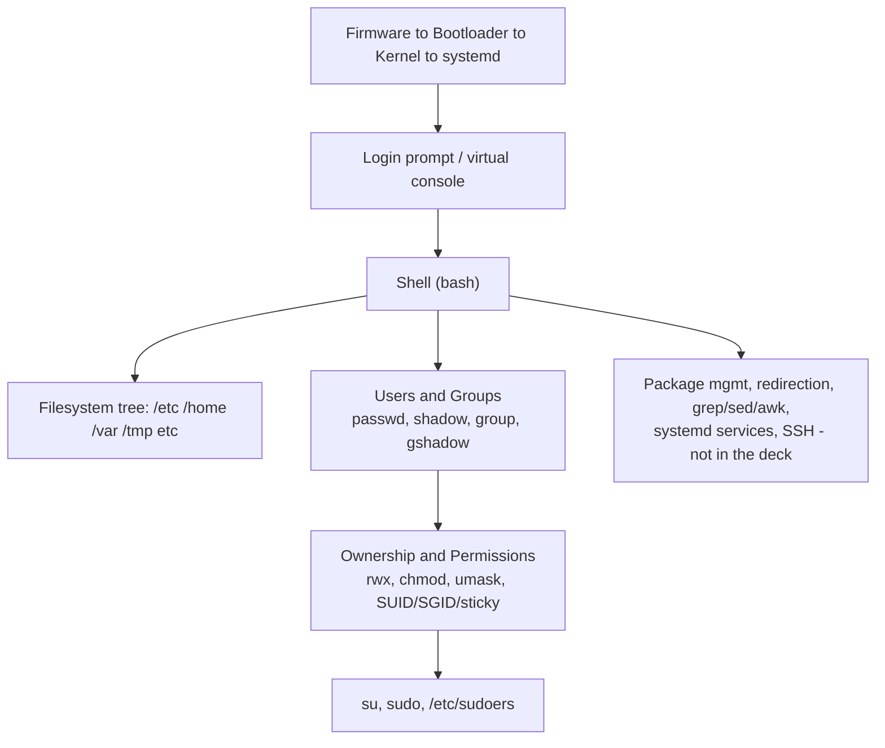

# Master Recap Diagram

# Rapid-Fire Interview Bank

- FOSS versus proprietary: source availability and modification/redistribution rights, per deck's own definition.
- Copyleft versus permissive licensing: derivative works forced open versus freely relicensable.
- Linux versus genuine Unix: independently written kernel following POSIX, not a licensed Unix derivative.
- Kernel versus shell versus terminal versus console: privileged hardware manager, command interpreter, display/input program, physical/virtual system-tied session.
- `/etc/passwd` versus `/etc/shadow`: world-readable identity fields versus root-only encrypted password and aging data.
- `usermod -G` versus `usermod -aG`: replaces versus appends to supplementary groups.
- Absolute versus relative pathname: unambiguous from `/` versus dependent on current directory.
- Hard link versus symbolic link: same inode directly versus a stored path reference.
- `su` versus `su -`: keeps calling environment versus full login-shell environment reset.
- SUID/SGID/sticky bit: run-as-owner, run-as-group or group-inherit-on-directories, delete-restricted-to-owner-in-shared-dirs.
- umask arithmetic: subtracted from 666 (files) or 777 (directories) maximums.
- **[EXTRA]** `init 0` versus `systemctl poweroff`: legacy SysV-compatible shim versus native systemd command on modern RHEL.

# Self-Assessment - Can You Explain These Without Notes

- [ ] Why Linux is "Unix-like" rather than a genuine Unix derivative
- [ ] The actual boot sequence from firmware to login prompt, in your own words
- [ ] Why `/etc/shadow` exists as a separate file from `/etc/passwd`, historically and today
- [ ] The `usermod -G` versus `-aG` distinction, with a concrete failure scenario
- [ ] Hard link versus symbolic link, including what happens to each when the original file is deleted
- [ ] Why execute permission means something different on a directory than on a file
- [ ] The umask subtraction arithmetic for both a new file and a new directory
- [ ] What SUID accomplishes, using the `passwd` command as the worked example
- [ ] Why `su appuser` (without the dash) can produce a different PATH than `su - appuser`
- [ ] Why shell globbing (`*`, `?`, `[]`) is expanded by the shell itself, not by the individual command