# RHSA1 - Red Hat System Administration I - Complete Notes (Day 1 + Day 2)

> [!info] How to read this note
> Everything traces back to the two slide decks unless a line, block, or section is tagged **[EXTRA]** in bold. This course (RHSA1) is an entry-level Linux fundamentals course - it deliberately does not cover package management, text processing, I/O redirection, systemd/services, SSH, or process management, all of which a working DevOps engineer needs day one on the job. A large **[EXTRA]** section is added at the end to close that gap. No emoji are used anywhere in this file.

## Course Roadmap (from the decks' own contents slides)

| Day | Topics |
|---|---|
| 1 | FOSS and licenses, Linux history, Linux components, installation, basic commands, Linux documentation, file and directory basics |
| 2 | User and group administration, permissions, switching to other accounts, shutting down the system |

---

# DAY 1

# 01 - What is FOSS

> [!quote] Deck definition
> Free/Open Source Software (FOSS) provides many freedoms, including the ability to: view the source code used to compile programs; make modifications; distribute these modifications. Most FOSS is covered under a public license. The most common public license is the GNU General Public License (GPL).

## FOSS Licenses

> [!quote] Deck definition
> An open-source license is a type of license for computer software and other products that allows the source code, blueprint or design to be used, modified and/or shared under defined terms and conditions.

| Deck's listed examples |
|---|
| GPL |
| LGPL |
| Apache |
| Mozilla Public License |
| BSD |

**[EXTRA]** The deck lists five license names without distinguishing what actually separates them. The practical distinction that matters for a DevOps engineer choosing or vetting dependencies is copyleft versus permissive:

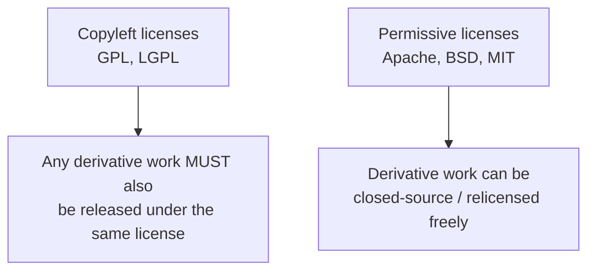

| License | Category | Practical consequence |
|---|---|---|
| GPL | Strong copyleft | Any software that links against or incorporates GPL code and is distributed must itself be released under GPL - this is why many companies ban GPL dependencies in proprietary products |
| LGPL | Weak copyleft | Linking against an LGPL library does not force your own code to be GPL, as long as the library itself stays separately replaceable |
| Apache 2.0 | Permissive | Free to use, modify, and relicense as closed-source; includes an explicit patent grant, which GPL/BSD do not |
| BSD | Permissive | Free to use, modify, and relicense as closed-source, minimal restrictions |
| MPL | Weak copyleft | File-level copyleft - only the specific modified files must stay open, not the whole project |

> [!important] Why this matters on the job
> Corporate legal/security teams routinely scan dependency trees for license compliance before a build ships. Pulling in a GPL-licensed library into a closed-source product can create real legal exposure. Tools like `license-checker` (npm), `pip-licenses` (Python), or FOSSA/Snyk license scanning in CI pipelines exist specifically to catch this automatically - a genuinely common real-world DevOps/platform responsibility.

### Self-Check Q and A

1. **Q: A company wants to use an open-source logging library inside their closed-source SaaS product without ever redistributing the modified source. Does the GPL allow this?**
   A: **[EXTRA]** Generally yes for internal/SaaS use without redistribution - the GPL's copyleft obligation is triggered by distributing the software, and many interpretations hold that running modified GPL code as a network service without distributing the binary does not trigger the copyleft clause (this specific gap is what the AGPL exists to close). This is exactly the kind of nuance that makes license scanning tools and legal review necessary rather than assuming licenses are interchangeable.
2. **Q: Why would Apache 2.0 be preferred over BSD for a company contributing a library that competitors might want to use and later sue over patents?**
   A: **[EXTRA]** Apache 2.0 includes an explicit patent grant clause - contributors grant users a license to any patents they hold covering the contributed code, and includes patent-litigation retaliation terms. BSD has no patent clause at all, leaving that risk unaddressed.

---

# 02 - Linux History

> [!quote] Deck's content
> Unix first version created in Bell Labs in 1969. Unix flavors: IBM to AIX, Hewlett-Packard to HP/UX, Sun to Solaris, Silicon Graphics to IRIX. They operate in a same manner and offer the same standard utilities and commands. Linus Torvalds finished his college in 1991 and created the Linux kernel.

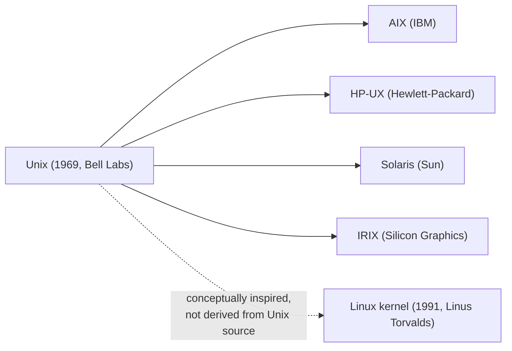

> [!important] Correction/clarification on the deck's framing
> **[EXTRA]** The deck's diagram-style list implies Linux sits in the same lineage as AIX/HP-UX/Solaris/IRIX. It does not - those four are all genuine derivatives of the original Bell Labs Unix source code (Unix flavors, licensed from AT&T). Linux is a completely independent, from-scratch kernel written by Linus Torvalds that merely follows the POSIX standard and Unix design philosophy - it shares no original Unix source code at all. This distinction matters technically: Linux is "Unix-like," not "a Unix."

**[EXTRA]** Distros - Linux's actual defining structural feature the deck's history slide skips: the Linux kernel alone is not an operating system. A distribution (distro) bundles the kernel with GNU userland tools (bash, coreutils, compilers), a package manager, and often a desktop environment. This is why "Linux" in casual conversation usually means a full distro like RHEL or Ubuntu, not the bare kernel.

### Self-Check Q and A

1. **Q: Is Linux technically a Unix derivative in the same sense as AIX or Solaris?**
   A: **[EXTRA]** No - AIX, HP-UX, Solaris, and IRIX are licensed derivatives of the original AT&T Unix source code. Linux is an independently written, from-scratch kernel that follows the same POSIX standards and design philosophy but shares no original Unix source - it is "Unix-like," not a genuine Unix derivative.
2. **Q: What is the actual difference between "the Linux kernel" and "a Linux distribution"?**
   A: **[EXTRA]** The kernel alone only manages hardware, processes, and memory - it provides no shell, no package manager, no user-facing tools at all. A distribution bundles the kernel with the GNU userland (bash, coreutils), a package manager, init system, and often a desktop environment into something actually installable and usable.

---

# 03 - Distros and Contributors

> [!quote] Deck's content
> Linux Flavors are listed at http://distrowatch.com, with logos shown for arch, debian, fedora, foresight, gentoo, mandriva, linux mint, kubuntu, opensuse, pclinuxos, redhat, sabayon, slackware, slax, ubuntu, xubuntu. A contributors pie chart shows Red Hat at 10.2 percent, Intel at 8.8 percent, Texas Instruments at 4.1 percent, Linaro at 3.5 percent, SUSE at 3.1 percent, IBM at 2.6 percent, Samsung at 2.4 percent, Google at 2.3 percent, Vision Engraving Systems at 1.6 percent, Wolfson Microelectronics, and Others at 57.3 percent.

**[EXTRA]** The deck presents distros as an unordered logo wall with no explanation of what actually distinguishes them structurally. For a DevOps engineer, the family a distro belongs to determines the package manager, the config file locations, and the command syntax used every day - this is genuinely more important than knowing the logos.

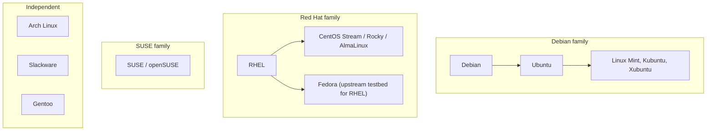

| Family | Package manager | Package format | Config example |
|---|---|---|---|
| Debian (Debian, Ubuntu, Mint, Kubuntu) | `apt` / `apt-get` / `dpkg` | `.deb` | `/etc/apt/sources.list` |
| Red Hat (RHEL, Fedora, CentOS, Rocky, AlmaLinux) | `dnf` (modern) / `yum` (legacy) / `rpm` | `.rpm` | `/etc/yum.repos.d/` |
| SUSE (SUSE, openSUSE) | `zypper` | `.rpm` | `/etc/zypp/repos.d/` |
| Arch | `pacman` | `.pkg.tar.zst` | `/etc/pacman.conf` |

> [!important] Why this matters more than the logo wall
> **[EXTRA]** Since this is a Red Hat course (RHSA1), everything downstream in this note assumes RHEL/Fedora/CentOS-family conventions - `dnf`/`yum`, `/etc/yum.repos.d/`, `systemctl` and `firewalld` defaults, and SELinux enabled by default. A DevOps engineer moving between a RHEL-based production fleet and Ubuntu-based CI runners needs to consciously translate between these two command sets - a very common real-world friction point.

### Self-Check Q and A

1. **Q: What determines whether a distro uses `apt` or `dnf`, and why does this matter beyond installing software?**
   A: **[EXTRA]** It's determined by which family the distro descends from (Debian versus Red Hat). Beyond installation syntax, it affects config file locations, service defaults, default firewall tooling (`ufw` versus `firewalld`), and how patches/security updates are delivered - operational knowledge that does not transfer 1:1 between families.
2. **Q: Why does knowing a distro's family matter more for a DevOps engineer than knowing its logo or release history?**
   A: **[EXTRA]** Because day-to-day operational tasks - installing packages, managing services, reading logs, configuring firewalls - all follow family-specific conventions. Two distros in the same family (RHEL and Fedora, or Debian and Ubuntu) transfer skills almost completely; two distros in different families require relearning basic operational muscle memory.

---

# 04 - Why Linux, Why Red Hat

> [!quote] Deck's content on Why Linux
> Linux is growing in the home users sector and the dominant of the professional and servers sector. Internet service providers (ISPs), e-commerce sites, and other commercial applications all use Linux today and continue to increase their commitment to Linux.

> [!quote] Deck's content on Why Red Hat
> More than 90 percent of Fortune Global 500 companies use Red Hat products and solutions. The most demanding applications run better on Red Hat Enterprise Linux. RHEL scales well, and is more reliable. RHEL is secure. Red Hat partnership with hardware vendors. Red Hat training and support.

**[EXTRA]** The single most relevant "why Red Hat" fact for someone targeting cloud/DevOps roles, which the deck does not mention: RHEL is the direct upstream for Amazon Linux's design conventions and is a first-class supported OS on every major cloud (AWS, Azure, GCP), with subscription-based support models (Red Hat Enterprise Linux subscriptions bundled into cloud marketplace images) that enterprises pay for specifically to get vendor-backed SLAs on a production OS.

### Self-Check Q and A

1. **Q: Beyond stability and support, why is RHEL specifically relevant to someone targeting AWS Cloud Architect or DevOps roles?**
   A: **[EXTRA]** RHEL is a first-class supported guest OS across every major cloud provider with paid support SLAs available through the cloud marketplace, and its conventions (SELinux, `dnf`, `systemd`, `firewalld`) are the same conventions used across the broader Red Hat-family ecosystem an enterprise cloud environment is likely to standardize on.

---

# 05 - Types of Installation

> [!quote] Deck's content
> Kickstart Mode permits automated installation. Graphical Installation. Text Based Installation.

**[EXTRA]** The deck names Kickstart without explaining what it actually is or why it matters operationally. Kickstart is Red Hat's declarative, unattended-installation configuration file format - genuinely relevant to a DevOps engineer because it is the direct conceptual ancestor of "infrastructure as code" applied to OS installation itself, decades before Terraform existed.

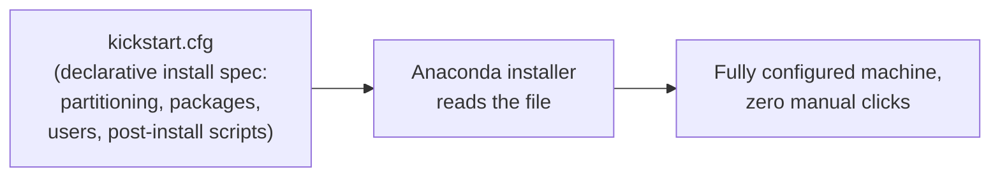
## minimal illustrative kickstart snippet

lang en_US.UTF-8  
keyboard us  
timezone America/New_York  
rootpw --iscrypted 66 6...  
network --bootproto=dhcp  
%packages  
@core  
httpd  
%end

> [!info] Why this is still relevant today
> **[EXTRA]** Kickstart files are commonly baked into custom AMIs, PXE-boot network installs for bare-metal fleets, and automated CI pipelines that build golden images. Conceptually it is the same "describe the desired end state, apply it unattended" pattern you already know from Terraform and Kubernetes manifests, just applied at the OS-installation layer rather than the infrastructure or container layer.

### Self-Check Q and A

1. **Q: What conceptual pattern does Kickstart share with tools like Terraform or Ansible, despite predating both?**
   A: **[EXTRA]** Declarative, unattended provisioning - you describe the desired end state (partitions, packages, users, post-install scripts) in a file, and a tool (Anaconda) reconciles a machine to that state with no manual interaction, the same "describe once, apply repeatedly" philosophy Terraform applies to cloud infrastructure.

---

# 06 - Linux Components

> [!quote] Deck's content on Kernel
> Is the core of the operating system. Contains components like device drivers. It loads into RAM when the machine boots and stays resident in RAM until the machine powers off.

> [!quote] Deck's content on Shell
> Provides an interface by which the user can communicate with the kernel. Bash is the most commonly used shell on Linux. The shell parses commands entered by the user and translates them into logical segments to be executed by the kernel or other utilities.

> [!quote] Deck's content on Terminal
> Gives the shell a place to accept typed commands and to display their results.

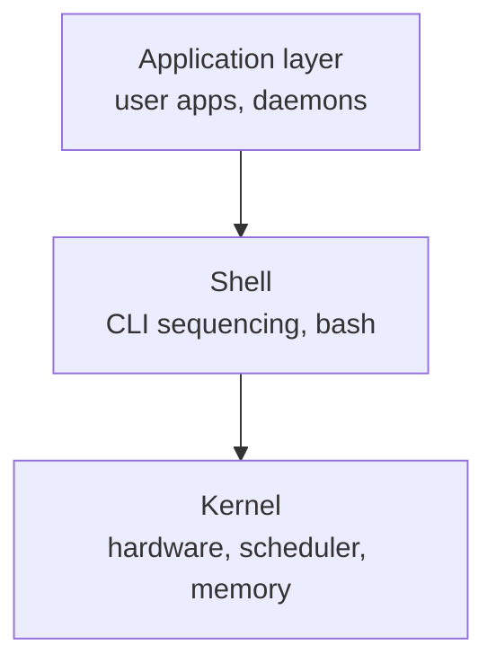

**[EXTRA]** The deck's three-layer diagram (kernel, shell, terminal/application) is accurate but leaves out the actual boot sequence that gets a machine from power-on to that shell prompt - genuinely relevant troubleshooting knowledge for a DevOps engineer working with bare-metal or cloud instances that fail to boot.

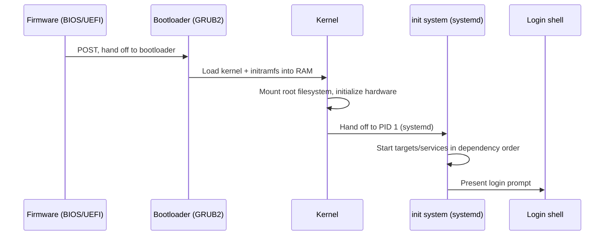

| Stage | What actually happens |
|---|---|
| Firmware (BIOS/UEFI) | Power-on self-test, locates a bootable device |
| Bootloader (GRUB2 on RHEL) | Presents kernel choices, loads chosen kernel + initramfs into RAM |
| Kernel | Initializes hardware via drivers, mounts the real root filesystem, hands control to PID 1 |
| Init system (systemd on modern RHEL) | Starts services/targets in dependency order, eventually reaches a login prompt or graphical target |

> [!important] Kernel versus shell versus terminal versus console - four terms often confused
> **[EXTRA]** Kernel: the actual privileged code managing hardware. Shell: the command interpreter (bash, zsh) that parses what you type. Terminal: historically a physical device, today a program (or pseudo-terminal, `pty`) that displays text and captures keystrokes. Console: specifically the physical/virtual system console tied directly to the machine (see the deck's own virtual consoles slide later) - distinct from a terminal emulator window or an SSH session, which is a pseudo-terminal, not a console.

### Self-Check Q and A

1. **Q: Why does the deck's kernel definition specifically mention it "stays resident in RAM until the machine powers off"?**
   A: The kernel must always be immediately available to service hardware interrupts, schedule processes, and manage memory for every running program - it cannot be paged out or unloaded the way an application can, since literally everything else depends on it being present.
2. **Q: A production server fails to reach a login prompt after a power cycle. At which of the four boot stages would you start investigating first, and why?**
   A: **[EXTRA]** Check bootloader output first (does GRUB even appear, can you select a kernel), then kernel boot messages (is it stuck initializing a driver or failing to mount root), then systemd (`systemctl status`, failed units) - working through the sequence in order narrows the failure to a specific stage rather than guessing.
3. **Q: What is the actual difference between a terminal and a console?**
   A: **[EXTRA]** A console is tied directly to the physical machine's own display/keyboard (or the virtual console mechanism the deck describes later, `Ctrl-Alt-F_key`). A terminal (or terminal emulator) is a program presenting a shell inside a window or over a network connection (SSH) - technically a pseudo-terminal, not a genuine console device.

---

# 07 - Command-Line Shells

> [!quote] Deck's content
> There are lot of shells as Bourne Shell (sh), Korn Shell (ksh), C Shell (csh) and Bourne Again Shell (bash). They have different features that will be discussed later.

| Shell | Notable trait |
|---|---|
| sh (Bourne) | 1977, the original - minimal, POSIX baseline |
| ksh (Korn) | Adds scripting features, arrays, better job control |
| csh (C Shell) | C-like syntax, historically popular interactively, poor scripting reputation |
| bash (Bourne Again) | Default on almost all Linux distros - superset of sh with history, tab completion, job control |

**[EXTRA]** The deck names four shells without saying why the choice matters practically. Two distinctions actually affect a DevOps engineer daily:

> [!warning] `#!/bin/sh` versus `#!/bin/bash` in scripts is not cosmetic
> On many distros (notably Debian/Ubuntu), `/bin/sh` is symlinked to `dash`, a minimal POSIX-only shell - NOT bash. A script written with bash-specific syntax (arrays, `[[ ]]` test syntax, `local` keyword nuances) but shebanged `#!/bin/sh` will silently behave differently or fail outright on such systems. Always match the shebang to the actual syntax used in the script.

```bash
#!/bin/bash          # explicit - guarantees bash-specific features work
echo ${array[@]}      # bash array syntax - fails under dash

#!/bin/sh             # POSIX-only - portable across sh implementations, but no bash extensions allowed
```

### Self-Check Q and A

1. **Q: A CI pipeline script works fine on a developer's Ubuntu laptop but fails with a syntax error when run inside a minimal Alpine or Debian-based container. The script begins with `#!/bin/sh` but uses bash arrays. What's actually happening?**
   A: **[EXTRA]** `/bin/sh` on many minimal/Debian-based systems is not bash - it is `dash`, a strict POSIX shell with no array support. The shebang lied about what interpreter would actually run the script's bash-specific syntax. Fix: change the shebang to `#!/bin/bash` (and ensure bash is installed in the image), or rewrite the script to be POSIX-compliant.

---

# 08 - Running Commands

> [!quote] Deck's content
> Commands have the following syntax: `command [options] [arguments]`. Each item is separated by a space. Options modify the command's behavior. Arguments are files name or other information needed by the command. Separate commands with semicolon.

command [options] [arguments]
```bash
uname
uname -n
uname -a
cal
cal 5 2004
cal; uname
cal 5 2002; date; uname
```

**[EXTRA]** The deck's `command [options] [arguments]` grammar and semicolon chaining is correct but incomplete for real command-line work. Command chaining has several distinct operators with genuinely different behavior, which is essential for writing correct shell scripts and one-liners:

| Operator | Behavior |
|---|---|
| `;` | Run the next command regardless of whether the previous one succeeded or failed |
| `&&` | Run the next command ONLY if the previous one succeeded (exit code 0) |
| `\|\|` | Run the next command ONLY if the previous one failed (non-zero exit code) |
| `&` | Run the command in the background, don't wait for it |
| `\|` | Pipe - feed the first command's output as the second command's input (covered in the Beyond the Slides section) |

```bash
mkdir /tmp/work && cd /tmp/work    # only cd if mkdir succeeded - avoids operating in the wrong directory
apt update || echo "update failed"  # run the echo only if apt update failed
long_running_task &                  # backgrounded, shell prompt returns immediately
```

> [!warning] `;` silently masks failures
> **[EXTRA]** `cmd1; cmd2` runs `cmd2` even if `cmd1` failed catastrophically. This is a genuinely common scripting bug - a failed `cd` followed by a destructive `rm -rf *` intended for a different directory, chained with `;`, executes the `rm` in the wrong (current) directory anyway. `&&` is almost always the safer choice for sequential operations that depend on each other.

### Self-Check Q and A

1. **Q: `cd /some/path; rm -rf *` is run and `/some/path` does not exist. What actually happens, and why is this dangerous?**
   A: **[EXTRA]** `cd` fails and prints an error, but because the two commands are joined with `;` (not `&&`), the shell proceeds to run `rm -rf *` anyway - in whatever directory the shell was already in, potentially deleting unintended files. Joining with `&&` instead would have stopped execution the moment `cd` failed.
2. **Q: What's the exit-code difference in behavior between `cmdA && cmdB` and `cmdA || cmdB`?**
   A: `&&` runs `cmdB` only when `cmdA` exits 0 (success). `||` runs `cmdB` only when `cmdA` exits non-zero (failure) - they are complementary conditionals based on the previous command's exit status.

---

# 09 - Interrupting Execution

> [!quote] Deck's content
> To interrupt a command that's taking too long to execute, use Ctrl-c. Occasionally, you might enter a command without an argument that expects input to come from the keyboard. In this case, use Ctrl-d to terminate the command.

| Key combination | Effect |
|---|---|
| Ctrl-c | Sends SIGINT - interrupts/terminates the running foreground process |
| Ctrl-d | Sends EOF (end-of-file) on stdin - terminates a command waiting on keyboard input, or logs out of an empty shell |

**[EXTRA]** The deck presents these as two isolated keyboard shortcuts without connecting them to the underlying signal mechanism, which matters once you move beyond interactive use into process management:

| Key/command | Signal sent | Can be caught/ignored by the process? |
|---|---|---|
| Ctrl-c | SIGINT (2) | Yes - a program can install a handler and ignore it |
| Ctrl-z | SIGTSTP (20) - suspends the process, does not terminate it | Yes |
| Ctrl-\ | SIGQUIT (3) - terminate + core dump | Yes |
| `kill -9 <pid>` | SIGKILL (9) | No - cannot be caught, ignored, or handled; the kernel terminates it unconditionally |

> [!important] Ctrl-c not working means the process is ignoring SIGINT
> **[EXTRA]** A hung process that does not respond to Ctrl-c is very common with processes that have installed a custom SIGINT handler (often to do graceful cleanup) that is itself stuck, or that are in an uninterruptible kernel wait state (`D` state, usually blocked on I/O). `kill -9` is the escalation, since SIGKILL cannot be intercepted - but it also means the process gets zero chance to clean up open files or connections.

### Self-Check Q and A

1. **Q: Ctrl-c does nothing to a hung process. What's the actual reason this can happen, and what's the practical escalation?**
   A: **[EXTRA]** Ctrl-c sends SIGINT, which a process can catch, ignore, or handle with custom cleanup logic - so a process that installed a handler (stuck or otherwise) simply doesn't terminate on SIGINT. Escalate to `kill -9 <pid>` (SIGKILL), which the kernel enforces unconditionally and cannot be intercepted - at the cost of the process getting no chance to clean up gracefully.
2. **Q: Why does Ctrl-d work to "terminate a command waiting on keyboard input" specifically, rather than being a kill signal like Ctrl-c?**
   A: Ctrl-d does not send a signal at all - it sends an EOF marker on standard input, which tells a program reading from stdin that there is no more input coming. A program written to read until EOF (like `cat` with no filename argument) then naturally exits because its read loop ends.

---

# 10 - Linux Documentation

> [!quote] Deck's content on manual pages
> Manual page consists of: Name (the name of the command and a one-line description), Synopsis (the syntax of the command), Description (explanation how the command works and what it does), Files (the file used by the command), Bugs (known bugs and errors), See also (other commands related to this one).

```bash
man -k keyword       # shows commands whose manual pages contain any of the given keywords
man -s keyword
whatis command        # shows the command's one-line description
```

> [!quote] Deck's content on --help
> Another way to get help about a command. help is built in the command itself (if supported).

**[EXTRA]** Two gaps in the deck's documentation coverage worth closing:

```bash
man 5 passwd      # man pages are organized into numbered SECTIONS -
                    # section 1 = user commands, section 5 = file formats,
                    # section 8 = admin/system commands. "man passwd" alone
                    # shows section 1 (the passwd COMMAND); "man 5 passwd"
                    # shows the /etc/passwd FILE FORMAT - different pages entirely

info command        # a separate, often more detailed documentation system
                     # (GNU project's alternative to man, hyperlinked, less commonly used today)

apropos keyword      # equivalent to "man -k" - searches man page descriptions
```

> [!warning] `man passwd` versus `man 5 passwd` is a genuinely common confusion point
> **[EXTRA]** Running `man passwd` with no section number returns the FIRST matching section found (usually section 1, the `passwd` command that changes a user's password) - not the file format documentation for `/etc/passwd` you might actually be looking for, which lives in section 5. This is directly relevant given the deck's own upcoming coverage of `/etc/passwd` and `/etc/shadow` file formats in Day 2.

### Self-Check Q and A

1. **Q: You run `man passwd` looking for the exact field layout of the `/etc/passwd` file, but the page you get describes changing a user's password instead. What went wrong, and what's the fix?**
   A: **[EXTRA]** `man passwd` without a section number defaults to section 1 (user commands), showing the `passwd` command's man page rather than the file format. `man 5 passwd` explicitly requests section 5 (file formats), which documents the actual `/etc/passwd` field layout.

---

# 11 - Directories

> [!quote] Deck's content
> Think of file system as a building, directory is a room, file is a desk. The current working directory is the room you are. To find out where you are at any time, use pwd.

```bash
pwd
/home/guest
```

> [!quote] Deck's content on pathnames
> Pathnames: absolute pathname, relative pathname.

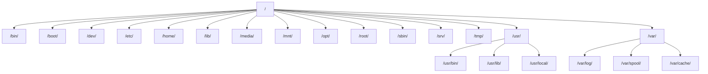

| Directory | Purpose |
|---|---|
| `/bin`, `/sbin` | Common programs, system administration programs |
| `/boot` | Kernel and other boot files |
| `/dev` | Device files |
| `/etc` | Configuration files |
| `/home` | User's home directories |
| `/lib` | Shared libraries |
| `/mnt`, `/media` | Mounted filesystems |
| `/opt` | Optional/third-party application installs |
| `/root` | The root user's home directory |
| `/tmp` | Temporary files |
| `/usr` | User programs, documentation, shared libraries |
| `/var` | Log files, spool files, and other dynamic/variable data |

> [!important] Absolute versus relative pathnames
> Absolute: starts from `/`, unambiguous regardless of current location, e.g. `/home/user1/work`. Relative: starts from the current working directory, e.g. `work` or `../user2`.

**[EXTRA]** Two directories the deck's tree diagram omits that a DevOps engineer will use constantly:

| Directory | Purpose |
|---|---|
| `/proc` | Virtual filesystem - not real files on disk, a live window into kernel/process state (`/proc/cpuinfo`, `/proc/<pid>/status`) |
| `/sys` | Virtual filesystem exposing kernel and device driver information/tuning, used heavily for hardware and kernel parameter inspection |

### Self-Check Q and A

1. **Q: What's the practical difference in reliability between `cd work` and `cd /home/user1/work` when used inside a script that might run from an unpredictable starting directory?**
   A: The relative form (`cd work`) depends entirely on where the script happens to be invoked from - it silently does the wrong thing (or errors) if the script's current directory assumption is wrong. The absolute form is unambiguous regardless of starting location, which is why scripts almost always prefer absolute paths for anything beyond trivial local operations.
2. **Q: You run `cat /proc/cpuinfo` and get real-looking output, but `ls -l /proc/cpuinfo` shows a file size of 0 bytes. Why?**
   A: **[EXTRA]** `/proc` is a virtual (pseudo) filesystem - its "files" are not stored on disk at all; they are generated on-the-fly by the kernel when read. The 0-byte size reflects that there's no static file content, only a live kernel data feed presented through a filesystem-like interface.

## Changing Directories

```bash
cd /home/user1/work
cd ..
cd ~
cd -
```

| Command | Meaning |
|---|---|
| `cd ..` | Move up one level |
| `cd ~` | Go to home directory |
| `cd -` | Go to the PREVIOUS directory (toggle back and forth) |

**[EXTRA]** `cd -` is genuinely underused - it toggles between the current and immediately-previous working directory, useful for quickly bouncing between two locations without retyping paths.

## Listing Directory Contents

```bash
ls
ls /home/user1/dir1
ls dir1
ls -a dir1        # show hidden files (dotfiles) too
ls -l dir1         # long format - permissions, owner, size, date
ls -F              # append type indicators: / for dirs, * for executables, @ for symlinks
ls -ld dir1         # show the DIRECTORY's own info, not its contents
ls -R              # recursive listing
```

> [!important] Hidden files (dotfiles)
> Any file or directory beginning with `.` is hidden from a plain `ls` and requires `-a` to see. This is the standard Linux convention for user config files (`.bashrc`, `.ssh/`, `.gitconfig`) - not a security mechanism, purely a display convention to reduce clutter.

**[EXTRA]** Reading an `ls -l` line, since the deck shows the output but does not decode it field by field:

-rw-r--r-- 1 islam islam 20 2 May 21 16:11 f1

| Field | Value | Meaning |
|---|---|---|
| 1 | `-rw-r--r--` | File type + permissions (covered fully in the permissions section) |
| 2 | `1` | Number of hard links |
| 3 | `islam` | Owning user |
| 4 | `islam` | Owning group |
| 5 | `20` | (In this deck's slightly non-standard example) size-related field |
| 6-8 | `2 May 21 16:11` | Last modification date and time |
| 9 | `f1` | Filename |

### Self-Check Q and A

1. **Q: `ls dir1` shows nothing, but you know files exist inside it. What's the most likely reason, and what flag reveals them?**
   A: The files are dotfiles (hidden files, names starting with `.`) - `ls` hides them by default. `ls -a dir1` reveals all entries including hidden ones.
2. **Q: `ls -l dir1` and `ls -ld dir1` produce very different output for the same directory. What's the difference?**
   A: `ls -l dir1` lists the CONTENTS of `dir1` in long format. `ls -ld dir1` shows information ABOUT the `dir1` entry itself (its own permissions, owner, size as a directory) without descending into it - the `-d` flag treats the directory as a single entry rather than a container to list.

## File Naming

> [!quote] Deck's content
> File names may be up to 255 characters. There are no extensions in Linux. Avoid special characters as greater-than, less-than, question mark, asterisk, hash, apostrophe. File names are case sensitive.

> [!important] "No extensions in Linux" - what this actually means
> **[EXTRA]** This does not mean extensions are forbidden - `report.pdf`, `script.sh`, `image.png` all work fine. It means the OS/kernel attaches NO special meaning to whatever comes after a dot - unlike Windows, where the extension itself determines how the OS handles a double-clicked file. On Linux, a file's actual type is determined by its content (checked via the `file` command using magic-byte signatures) or by execute permission plus a shebang line, never by the name alone. `mv script.txt script` still runs perfectly fine as a script if it has execute permission and a valid shebang.

```bash
file somefile          # inspects actual content to report the real file type, regardless of name/extension
```

### Self-Check Q and A

1. **Q: A colleague renames `deploy.sh` to `deploy` (no extension) and it still runs perfectly when executed as `./deploy`. Why does removing the extension not break it, unlike on Windows?**
   A: **[EXTRA]** Linux never uses the filename extension to determine executability or file type - it uses the execute permission bit combined with the shebang line (`#!/bin/bash`) at the top of the file to know how to run it. The `.sh` was purely a human-readable convention, carrying zero meaning to the OS itself.

## Viewing File Content

```bash
cat fname
more fname
head -n fname
tail [-n|+n] fname
```

> [!quote] Deck's more scrolling keys
> Spacebar moves forward on screen. Return scrolls one line at a time. b moves back one screen. /string searches forward for pattern. n finds the next occurrence. q quits and returns to the shell prompt.

**[EXTRA]** `more` only scrolls forward by default (its `b` back-scroll support is limited/inconsistent across systems). `less` is the modern, near-universal replacement that supports full bidirectional scrolling, search in both directions, and does not require loading the entire file before displaying it - genuinely the tool reached for in practice over `more` today, even though the deck only teaches `more`.

```bash
less fname             # preferred over more - "less is more": full scrollback, search, no full-file read needed
tail -f /var/log/messages   # -f = follow, keep printing new lines as they're appended - ESSENTIAL for live log watching
```

> [!important] `tail -f` is one of the single most-used commands in DevOps work
> **[EXTRA]** Watching a log file grow in real time while reproducing a bug, deploying a change, or debugging a crash loop is a daily activity - `tail -f logfile` (or `tail -f` combined with `grep` via a pipe, covered in the Beyond the Slides section) is the standard tool for this.

### Self-Check Q and A

1. **Q: Why would `less` be preferred over `more` for viewing a very large log file, beyond just having more features?**
   A: **[EXTRA]** `more` (on many implementations) must read through the file linearly and has weak or no backward-scrolling support. `less` does not need to read the whole file upfront to start displaying it and supports full bidirectional scrolling and searching - meaningful for genuinely large files where `more`'s limitations become a real obstacle.

## File Globbing and Metacharacters

> [!quote] Deck's content
> When typing commands, it is often necessary to issue the same command on more than one file at a time. The use of wildcards, or metacharacters, allows one pattern to expand to multiple filenames.

| Metacharacter | Meaning | Deck's example |
|---|---|---|
| `*` | 0 or more characters, except a leading dot | `ls f*` matches file.1, file1, etc; `ls *3` matches names ending in 3 |
| `?` | Exactly one character, except a leading dot | `ls file?` matches file4, file1, file2 but not file10 |
| `[...]` | A range or set of characters for a single position | `ls [a-f]*`, `ls [pf]*`, `ls [ab]*` |

```bash
ls ???            # exactly three characters
ls ?a?             # 3 chars, 'a' in the middle
ls ?a*             # starts with any char, then 'a', then anything
ls *a*             # 'a' anywhere in the name
ls .*              # dotfiles only (matches the leading dot explicitly)
ls [a-zA-Z]*       # starts with any letter, upper or lower case
```

> [!important] Globbing is expanded BY THE SHELL, not by the command itself
> **[EXTRA]** This is a critical mechanical detail the deck's examples don't make explicit. When you type `ls *.txt`, the shell itself expands `*.txt` into the actual matching filenames BEFORE `ls` ever runs - `ls` never sees the asterisk at all, only a list of real filenames. This matters because it means globbing works identically for every command (`rm *.txt`, `cp *.log /backup/`, `grep -l TODO *.py`) since it's a shell-level feature, not something each individual command has to implement.

> [!warning] A dangerous consequence of shell-side expansion
> **[EXTRA]** `rm *` in a directory with hundreds of matching files expands to `rm file1 file2 file3 ...` (every name spelled out) before `rm` runs - if there are more matching files than the shell's argument-length limit allows, this can fail with "argument list too long." This is exactly why tools like `find ... -exec` or `xargs` exist for operating on very large file sets - they avoid expanding everything into one gigantic command line at once.

### Self-Check Q and A

1. **Q: When you run `rm *.log`, does the `rm` command itself understand the asterisk wildcard?**
   A: No - the shell expands `*.log` into the literal list of matching filenames before `rm` is ever invoked. `rm` only ever receives a plain list of real filenames as arguments; it has no wildcard-matching logic of its own.
2. **Q: `rm *` fails with "argument list too long" in a directory containing tens of thousands of files. Why does this happen, and what's the standard alternative?**
   A: **[EXTRA]** The shell expands `*` into every matching filename as literal command-line arguments before executing, and the kernel enforces a maximum total length for a single command's argument list (`ARG_MAX`) - exceeding it causes this exact error. `find /path -name '*' -exec rm {} \;` or piping through `xargs` processes files in batches instead of expanding everything into one command line at once.
3. **Q: Why does `ls *3` NOT match a hidden file named `.file3`, even though the name contains a 3 at the end matching the pattern shape?**
   A: `*` explicitly excludes matching a LEADING dot - this is a deliberate glob convention so that wildcards don't accidentally sweep up dotfiles/config files unless you explicitly ask for them (e.g., with `.* ` or `-a` style patterns).

## File and Directory Manipulation

```bash
cp options source(s) target
mv options source(s) target
touch file(s)_name
mkdir [-p] dir(s)_name
rm [-i] file(s)_name
rmdir dir(s)_name
rm [-r] dir(s)_name
```

| Command | Option | Meaning |
|---|---|---|
| `cp` | `-i` | Prevents accidentally overwriting existing files/directories |
| `cp` | `-r` | Copy a directory including contents of all subdirectories |
| `mv` | `-i` | Prevents accidentally overwriting existing files/directories |
| `mkdir` | `-p` | Create parent directories as needed (no error if they already exist) |
| `rm` | `-i` | Prompt before each removal |
| `rm` | `-r` | Recursive - required to remove a directory and its contents |

**[EXTRA]** Two significant gaps the deck's file-manipulation slides leave open, both essential daily-use knowledge:

```bash
ln target linkname          # create a HARD link
ln -s target linkname        # create a SYMBOLIC (soft) link
```

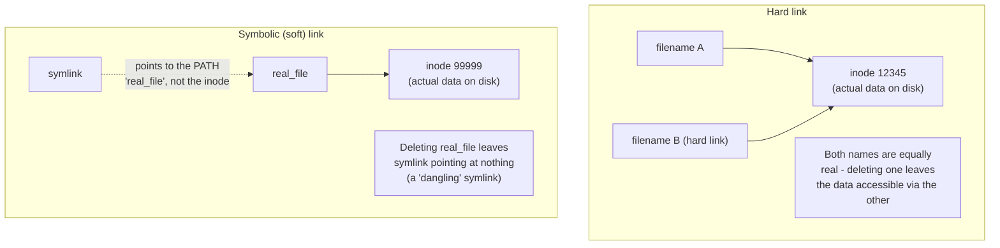

| | Hard link | Symbolic (soft) link |
|---|---|---|
| Points to | The same inode (actual data) directly | The target's PATH/name |
| Can cross filesystems? | No - must be on the same filesystem | Yes |
| Can link to a directory? | No (with rare exceptions) | Yes |
| Original deleted | Data survives via the remaining hard link | Symlink becomes "dangling" - broken, points nowhere |
| `ls -l` appearance | Looks like a normal file | Shown with `l` type and an arrow to the target: `lrwxrwxrwx ... symlink -> real_file` |

> [!important] Why this matters for a DevOps engineer specifically
> **[EXTRA]** Symlinks are the standard mechanism for versioned release directories (`/opt/app/current -> /opt/app/releases/v1.4.2`), for switching active configuration/binary versions atomically during deployments, and for tools like `alternatives`/`update-alternatives` on RHEL that manage which binary a generic command name points to. Genuinely essential knowledge, absent entirely from this deck.

```bash
rsync -avz source/ destination/     # far more capable than cp for large transfers, syncing, or remote copies
```

### Self-Check Q and A

1. **Q: You delete `real_file`, and a symlink named `link_to_real_file` still exists pointing at it. What happens if you try to `cat link_to_real_file` now?**
   A: **[EXTRA]** It fails with a "No such file or directory" error - the symlink only stored the PATH `real_file`, not the data itself. With the target gone, the symlink is now "dangling" and resolves to nothing.
2. **Q: You create a hard link `file_B` to `file_A`, then delete `file_A`. Is the data still accessible?**
   A: **[EXTRA]** Yes, fully - a hard link is a second name pointing at the exact same inode (the actual data on disk). The data is only truly removed once ALL hard links to that inode are deleted (the link count reaches zero), regardless of which name was created first.
3. **Q: Why can't you create a hard link across two different mounted filesystems (e.g., from `/` to a separately mounted `/data` partition), but a symlink works fine for the same case?**
   A: **[EXTRA]** A hard link references an inode number, and inode numbers are only unique WITHIN a single filesystem - the same inode number could legitimately refer to a completely different file on another filesystem. A symlink instead just stores a text path string, which works regardless of filesystem boundaries since it's resolved fresh at access time.
4. **Q: Why is a symlink like `/opt/app/current -> /opt/app/releases/v1.4.2` a common deployment pattern?**
   A: **[EXTRA]** Repointing the symlink to a new release directory is a single, near-instantaneous atomic operation - the application always reads from the stable `current` path, and a rollback is just re-pointing the symlink back to the previous release directory, with no file copying or downtime involved.

---

# DAY 2

# 12 - Users and Groups - The Core Files

> [!quote] Deck's content on /etc/passwd
> `loginname:x:uid:gid:comment:home-directory:login-shell`. Included fields are: Login name, User Id (uid), Group Id (gid), Comment about the user, Home Directory, Login shell.

> [!quote] Deck's content on /etc/shadow
> `username:encrypted passwd:last changed:min:max:warn:inactive:expire:future-use`. Included fields are: Login name, Encrypted password, Days since Jan 1 1970 that password was last changed, Days before password may not be changed, Days after which password must be changed, Days before password is to expire that user is warned, Days after password expires that account is disabled, Days since Jan 1 1970 that account is disabled.

> [!quote] Deck's content on /etc/group
> `groupname:x:gid:comma-separated list of group members`. The deck poses `/etc/gshadow` as an open question without answering it.

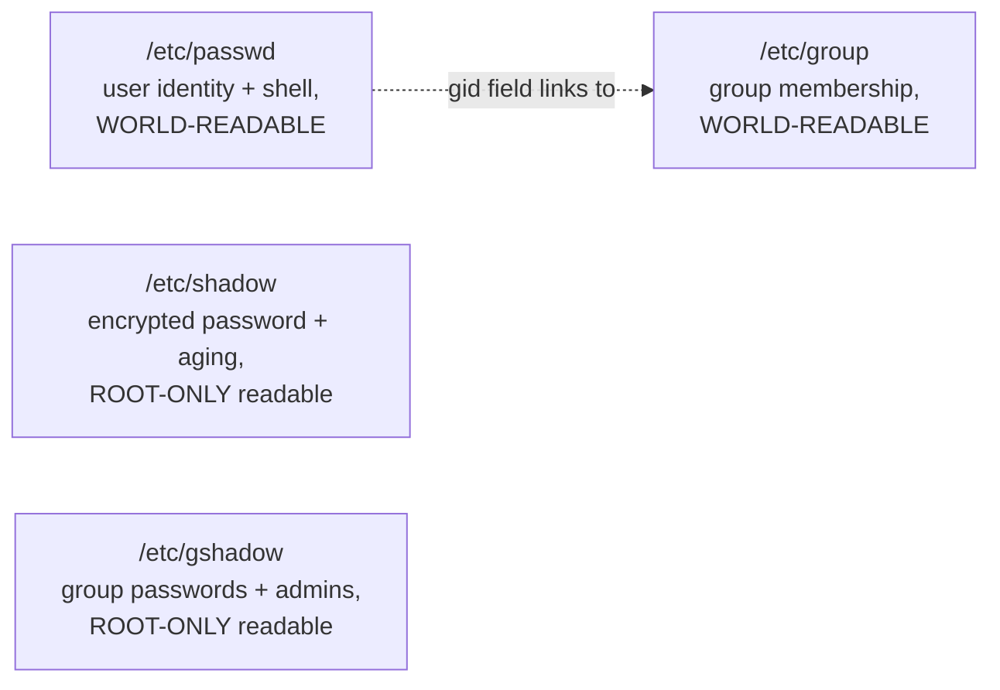

**[EXTRA]** Answering the deck's own open question about `/etc/gshadow`: it is the group-level counterpart to `/etc/shadow` - it stores encrypted group passwords (used with `newgrp` when a group has a password) and the list of group administrators (users allowed to add/remove members via `gpasswd` without being root). Format: `groupname:encrypted_password:administrators:members`.

> [!important] Why passwords moved from /etc/passwd into /etc/shadow
> **[EXTRA]** In very old Unix systems, the encrypted password lived directly inside `/etc/passwd`, which must remain world-readable (every program that needs to resolve a UID to a username, or check group membership, reads it). This meant every user's encrypted password hash was readable by anyone on the system - a serious weakness once offline password-cracking became practical. The "shadow password" system split password hashes into a SEPARATE file, `/etc/shadow`, readable only by root, while `/etc/passwd` keeps an `x` placeholder in the password field indicating "the real hash lives in shadow." This split is exactly why `/etc/passwd` has permissions `644` while `/etc/shadow` has `600` or `000`, owned by root.

```bash
ls -l /etc/passwd /etc/shadow
# -rw-r--r--  1 root root ... /etc/passwd     <- world-readable
# ----------  1 root root ... /etc/shadow     <- root only
```

### Self-Check Q and A

1. **Q: Why does `/etc/passwd` contain an `x` in the password field instead of an actual encrypted hash on any modern Linux system?**
   A: The `x` is a placeholder indicating that shadow passwords are in use - the real encrypted hash lives in `/etc/shadow` instead, which (unlike `/etc/passwd`) is not world-readable. This split protects password hashes from being harvested by any local user for offline cracking, while still allowing `/etc/passwd` to remain world-readable for username/UID resolution.
2. **Q: What's the actual difference in purpose between `/etc/group` and `/etc/gshadow`?**
   A: **[EXTRA]** `/etc/group` (world-readable) lists group names, GIDs, and member usernames. `/etc/gshadow` (root-only) stores encrypted group passwords and the list of group administrators who can manage membership via `gpasswd` without needing full root access - the same public/private split pattern as passwd/shadow, applied to groups.

## Adding, Modifying, and Deleting Users

> [!quote] Deck's content
> `# useradd username`. The useradd command populates user home directories from the /etc/skel directory. To view and modify default setting: `useradd -D`. `# passwd username`. Adding multiple user accounts: `# newusers filename`.

> [!quote] Deck's content on modifying
> To change a user's account information, you can edit the /etc/passwd or /etc/shadow files manually, or use the chage or usermod commands. Use the usermod command: `usermod [options] username`. Useful options: to change the login name use `-l <login name>`, to lock the password use `-L`, to unlock the password use `-U`.

> [!quote] Deck's content on deleting
> To delete a user account you can manually remove the user from /etc/passwd, /etc/shadow, /etc/group files, remove the user's home directory (/home/username) and mail spool file (/var/spool/mail/username). Use the userdel command: `# userdel [-r] username`.

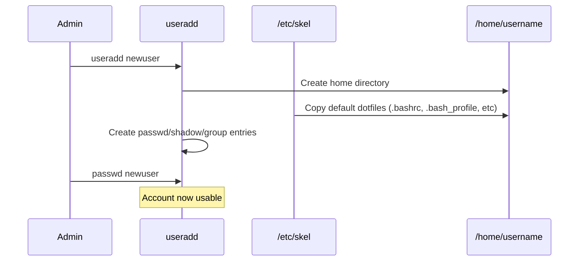

**[EXTRA]** `/etc/skel` is worth expanding on beyond the deck's one-line mention - it is literally a template home directory. Anything placed in `/etc/skel` (a custom `.bashrc`, a company-standard `.vimrc`, a welcome README) gets copied into every NEW user's home directory automatically at creation time. This is the standard mechanism for enforcing baseline shell configuration across all users on a system.

```bash
useradd -m -s /bin/bash -c "Full Name" username   # -m force home dir creation, -s set shell, -c comment field
usermod -aG groupname username                      # -aG = APPEND to a supplementary group, without this flag
                                                       # usermod -G REPLACES all existing supplementary groups!
```

> [!warning] `usermod -G` versus `usermod -aG` - a very common destructive mistake
> **[EXTRA]** `usermod -G newgroup username` REPLACES the user's entire supplementary group list with just `newgroup`, silently removing them from every other group they belonged to (sudo/wheel, docker, etc). The `-a` (append) flag is required to ADD a group without wiping the existing ones: `usermod -aG newgroup username`. Forgetting `-a` is one of the most common real-world sysadmin mistakes, and it silently breaks a user's other permissions with no warning.

### Self-Check Q and A

1. **Q: What is `/etc/skel` actually for, and why would a company place a custom `.bashrc` there?**
   A: `/etc/skel` is a template directory - its entire contents are copied into every new user's home directory at creation time by `useradd`. Placing a standardized `.bashrc` there ensures every new account gets the same baseline shell configuration (aliases, PATH additions, prompt style) automatically, without manual per-user setup.
2. **Q: A colleague runs `usermod -G docker jsmith` to add jsmith to the docker group. Afterward, jsmith can no longer run `sudo`. What went wrong?**
   A: **[EXTRA]** `-G` without `-a` REPLACES the entire supplementary group list rather than adding to it - jsmith was silently removed from `wheel`/`sudo` (or whatever group granted sudo access) in the process. The correct command was `usermod -aG docker jsmith`, which appends rather than replaces.

## Password Aging Policies

> [!quote] Deck's content
> The chage command sets up password aging: `# chage [options] username`. Options: -m to change the min number of days between password changes, -M to change the max number of days between password changes, -E date to change the expiration date for the account, -W to change the number of days to start warning before a password change will be required.

```bash
chage -l username    # LIST current aging settings for a user - the deck omits this genuinely essential read-only option
```

**[EXTRA]** `chage -l username` is worth adding since the deck only covers the write/modify options - it's the command actually used most often, to audit a user's current password aging status without changing anything, e.g., during a security review.

### Self-Check Q and A

1. **Q: You need to audit whether a specific user account's password has expired or is close to expiring, without modifying anything. Which chage option does this?**
   A: **[EXTRA]** `chage -l username` - lists all current aging information (last change date, min/max days, warning period, expiration) in read-only form, distinct from the deck's modification-focused options (`-m`, `-M`, `-E`, `-W`).

## Private Group Scheme

> [!quote] Deck's content
> A traditional problem found in many UNIX/Linux environments is when administrators place all users in the same primary group. When users on such systems use a umask value of 002. Ubuntu solves this problem by assigning user a primary group for which they are the sole members. This "private" primary group has the same name as the user's username.

**[EXTRA]** The deck's explanation cuts off mid-thought (the sentence about umask 002 has no conclusion). Completing it: with a traditional shared primary group (commonly `users`) and a permissive `umask 002`, every newly created file is group-writable by ALL users in that shared group by default - meaning any user could accidentally (or maliciously) modify any other user's freshly created files. The private group scheme (also called "user private groups," used by RHEL as well as Ubuntu, not just Ubuntu as the deck implies) sidesteps this entirely: since each user's primary group contains only that one user, `umask 002`'s group-writable default only ever grants write access back to the file's own owner, not to a wide shared pool of unrelated users.

### Self-Check Q and A

1. **Q: The deck states the private group scheme solves a problem related to `umask 002` but doesn't explain what the problem actually was. What was it?**
   A: **[EXTRA]** With a single shared primary group for all users and a permissive `umask 002` (which makes new files group-writable by default), every user's newly created files become writable by every OTHER user sharing that same group - a broad, usually unintended write permission across unrelated users' files. Giving each user their own private, single-member primary group means that same `umask 002` default only ever grants write-back access to the file's own creator, eliminating the unintended cross-user write access.

## Managing Groups

> [!quote] Deck's content
> Creating new group: `# groupadd groupname`. Modifying an existing group: `# groupmod [options] groupname`. Deleting a certain group: `# groupdel groupname`. List all files which are owned by groups not defined in /etc/group file: `# find / -nogroup`. You can use the gpasswd command to define group members, group administrators, and to create or change group passwords. Use the -r option to the groupadd command to avoid using a GID within the range typically assigned to users and their private groups.

```bash
groupadd groupname
groupmod [options] groupname
groupdel groupname
find / -nogroup
gpasswd groupname
groupadd -r groupname       # system group - GID outside the normal user range
```

**[EXTRA]** `find / -nogroup` (and its counterpart `find / -nouser`) is presented in the deck without explaining when you'd actually need it: it surfaces orphaned files left behind after a user or group account was deleted without cleaning up their file ownership first - files that now reference a UID/GID with no corresponding entry in `/etc/passwd`/`/etc/group` at all. This is a genuine security/hygiene audit task, since such orphaned ownership can silently be reassigned if a NEW account later reuses that same numeric UID/GID.

### Self-Check Q and A

1. **Q: Why would `find / -nogroup` ever return results on a real system, and why does this matter for security?**
   A: **[EXTRA]** It surfaces files whose GID no longer corresponds to any group in `/etc/group` - typically leftover from a group being deleted without first reassigning or cleaning up files it owned. This matters because if a future new group happens to be created with that same now-orphaned GID, it would silently inherit ownership/access to those old files without anyone intending it.

## Changing Active Group

> [!quote] Deck's content
> To switch between groups you are member in, use `newgrp` command: `newgrp group`. To display the groups you are member in use `groups` command.

```bash
newgrp group
groups
```

**[EXTRA]** `newgrp` changes which group is treated as your CURRENT effective primary group for newly created files within that shell session, without needing to log out - relevant specifically because file ownership (`chown`) and the group-write behavior discussed under the private group scheme both depend on which group is currently "active" for the session.

---

# 13 - Switching Accounts

> [!quote] Deck's content
> `# su [-] [username]`. `# su [-] [username] -c command`.

```bash
su username
su - username
su - username -c command
```

> [!important] The `-` flag in `su` is not decorative
> **[EXTRA]** The deck shows `su [-]` as an optional bracket without explaining the actual difference. Plain `su username` switches identity but KEEPS the calling shell's existing environment (PATH, working directory, environment variables). `su - username` performs a full LOGIN shell simulation - it resets the environment as if that user had genuinely logged in fresh, sourcing their own profile/bashrc, resetting PATH, and changing to their home directory. Forgetting the `-` is a very common source of "why does this command work under sudo but not under `su someuser`" confusion, since the environment (especially PATH) may differ significantly.

```bash
sudo -i username           # roughly the sudo equivalent of "su - username" - full login shell
sudo -u username command    # run a single command as another user without a shell switch at all
```

### Self-Check Q and A

1. **Q: `su appuser` followed by running a deployment script fails with "command not found" for a tool that's clearly installed and normally works fine for appuser directly. What's the likely cause?**
   A: **[EXTRA]** `su appuser` (without the `-`) keeps the CALLING user's environment, including their PATH, rather than loading appuser's own environment/profile. If the tool's directory is only in appuser's PATH (set via their own `.bashrc`/`.bash_profile`), it won't be found under a non-login `su` switch. `su - appuser` performs a full login-shell environment reset and would resolve it.

---

# 14 - The whoami, id, who, w, and finger Commands

> [!quote] Deck's content
> After switching into several users, it is a sever issue to know your current (effective) user. `whoami` returns the effective username.

> [!quote] Deck's content on id
> Displays effective user id, effective user name, effective group id, effective group name.

> [!quote] Deck's content on who
> Displays who is on the system: user login name, login device (tty), login date and time.

> [!quote] Deck's content on w
> The w command displays a summary of the current activity on the system, including what each user is doing: `w [user]`.

> [!quote] Deck's content on finger
> finger is a useful command that reveals details of users: login name, full name, TTY, idle time, login time, office, office phone. `finger username` shows detailed info: login directory, shell, on-since time, idle time, mail status, plan.

**[EXTRA]** The deck presents these five commands as an unordered list without distinguishing WHY you'd reach for each one specifically - they overlap significantly and picking the right one matters for efficiency:

| Command | Answers |
|---|---|
| `whoami` | "Who am I right now, after however many `su`/`sudo` switches?" - fastest, single-purpose |
| `id` | "What's my full identity - UID, GID, and every group I belong to?" - the most complete identity picture |
| `who` | "Who is currently logged into this system, and from where/when?" |
| `w` | "Who is logged in AND what are they currently doing (load average, active command)?" - `who` plus system load plus current process |
| `finger` | "Give me a detailed profile of a specific user" - largely a legacy/security-risk tool today |

> [!warning] `finger` is a security liability on modern production systems
> **[EXTRA]** The deck teaches `finger` without any caveat, but it is essentially never installed or enabled on modern production servers. It's historically been implicated in information-disclosure and even worm-propagation incidents (the original 1988 Morris worm exploited a `finger` daemon buffer overflow), and revealing detailed user activity/idle-time information to any local or (if the finger daemon is network-exposed) remote user is now considered bad security practice. Genuinely useful to know it exists for legacy-system familiarity, but it should not be treated as a tool to reach for on any modern server you're responsible for securing.

### Self-Check Q and A

1. **Q: What's the practical difference between running `whoami` and running `id` after several nested `su` commands?**
   A: `whoami` returns only the current effective username. `id` returns the full identity picture - UID, primary GID, and every supplementary group the current effective user belongs to - genuinely more useful when debugging a permissions issue that depends on group membership, not just username.
2. **Q: Why would a security-conscious DevOps engineer disable or avoid installing the `finger` service on a production server, despite it being a legitimate part of classic Unix tooling?**
   A: **[EXTRA]** `finger` (especially as a network-exposed daemon) discloses detailed information about user activity, login patterns, and idle time to anyone who can query it - useful reconnaissance for an attacker profiling active accounts, and it has a documented history of exploited vulnerabilities (the 1988 Morris worm). Modern hardened server baselines simply don't install it.

---

# 15 - Using the sudo Command

> [!quote] Deck's content
> sudo is more secure. sudo access is controlled by /etc/sudoers. This file is edited by visudo, an editor and syntax checker. To give a specific group of users limited root privileges: `User_Alias LIMITEDTRUST=st1,st2`; `Cmnd_Alias MINIMUM=/etc/init.d/httpd`; `Cmnd_Alias SHELLS=/bin/sh,/bin/bash`; `LIMITEDTRUST ALL=MINIMUM`; `user5 ALL=ALL,!SHELLS`; `%development station1=ALL, !SHELL`.

## /etc/sudoers syntax pattern

User_Alias LIMITEDTRUST = st1, st2  
Cmnd_Alias MINIMUM = /etc/init.d/httpd  
Cmnd_Alias SHELLS = /bin/sh, /bin/bash

LIMITEDTRUST ALL = MINIMUM  
user5 ALL = ALL, !SHELLS  
%development station1 = ALL, !SHELL
**[EXTRA]** The deck presents this sudoers syntax without decoding the grammar or explaining why `visudo` specifically (rather than any text editor) is mandatory:

who where = (as_whom) what

| Piece | Meaning in the deck's examples |
|---|---|
| `who` | A username, `%groupname` (note the leading percent sign for groups), or a `User_Alias` |
| `where` | The hostname this rule applies on - `ALL` means every host, `station1` means only that specific host |
| `what` | `ALL` (any command) or a `Cmnd_Alias`; `!` negates - explicitly DENIES that specific command even if otherwise allowed |

> [!important] Why `visudo` is mandatory, not just recommended
> **[EXTRA]** The deck states visudo is "an editor and syntax checker" but doesn't explain the actual danger it prevents. Editing `/etc/sudoers` directly with a plain text editor (`vi /etc/sudoers`) and introducing a syntax error can lock EVERY user, including root via sudo, out of using `sudo` entirely on that system - since the file is checked at every sudo invocation. `visudo` locks the file during editing (preventing simultaneous conflicting edits) and, critically, validates syntax before saving, refusing to write a broken file and giving you the chance to fix it in place.

```bash
visudo                    # the ONLY safe way to edit /etc/sudoers
sudo -l                    # list what commands the CURRENT user is permitted to run via sudo
```

### Self-Check Q and A

1. **Q: A sysadmin edits `/etc/sudoers` directly with `vi` instead of `visudo` and makes a typo. What's the actual consequence, and why is it worse than a typo in most other config files?**
   A: **[EXTRA]** A syntax error in `/etc/sudoers` can cause `sudo` to refuse to run for anyone at all, since the file is parsed on every invocation - potentially locking out even root's own sudo access if root normally relies on sudo rather than direct root login. `visudo` prevents this specific failure mode by validating syntax before allowing the save to actually take effect.
2. **Q: In the rule `user5 ALL=ALL,!SHELLS`, what does the `!` before SHELLS actually accomplish, given that user5 is already granted ALL commands?**
   A: The `!` explicitly excludes the SHELLS command alias from an otherwise unrestricted grant - user5 can run any command via sudo EXCEPT the ones defined as SHELLS (`/bin/sh`, `/bin/bash`). This is a deliberate technique to prevent someone with broad sudo access from trivially escalating to an interactive root shell, forcing them to run specific commands instead - though this pattern is well known to be imperfect, since many programs can spawn a shell internally, bypassing the intended restriction.
3. **Q: What does the `%` prefix mean in `%development station1=ALL, !SHELL`?**
   A: It denotes a GROUP name rather than an individual username - this rule applies to every member of the `development` group, not to a user literally named "development."

---

# 16 - Ownership and Permissions

> [!quote] Deck's content
> Every file and directory has both user and group ownership. A newly-created file will be owned by the user who creates it, and that user's primary group (unless the file is created in a set group ID (SGID) directory).

```bash
chown user1 file1
chown user1:group1 file1
chown :group1 file1
```

**[EXTRA]** The deck mentions SGID directories in passing as a forward-reference ("more on this file in the next lesson") that the deck never actually returns to. Completing it here, since it directly extends the deck's own ownership explanation and is genuinely important for shared team directories:

```bash
chmod g+s /shared/team_dir      # set the SGID bit on a directory
```

> [!important] SGID on a directory changes the ownership inheritance rule the deck describes
> **[EXTRA]** Normally (per the deck's own rule), a new file inherits the CREATING user's primary group. Inside an SGID-marked directory, this rule is overridden: every new file created inside instead inherits the DIRECTORY's group, regardless of who created it. This is exactly how shared team directories are set up so that files created by any team member automatically belong to the shared team group rather than each person's own private group - directly solving the coordination problem that motivated the private group scheme discussed earlier.

## Security Scheme

> [!quote] Deck's content
> Each file has an owner and assigned to a group. Linux allows users to set permissions on files and directories to protect them. Permissions are assigned to file owner, members of the group the file is assigned to, and all other users. The most specific permissions apply. Permissions can only be changed by the owner and root.

## Permission Notations

> [!quote] Deck's content
> Read - for a file: display file contents and copy the file; for a directory: list the directory contents with the ls command. Write - for a file: modify the file contents; for a directory: if you also have execute access, you can add and delete files in the directory. Execute - for a file: execute the file if it is an executable, or execute a shell script if you also have read and execute permissions; for a directory: use the cd command to access the directory, and if you also have read access, run ls -l to list contents.

| Permission | On a file | On a directory |
|---|---|---|
| Read | View/copy contents | List directory contents |
| Write | Modify contents | Add/delete files inside (requires execute too) |
| Execute | Run the file if executable | Traverse into (cd) the directory |

> [!important] Execute on a directory means something completely different from execute on a file
> **[EXTRA]** This is the single most commonly misunderstood permission distinction, and worth stating explicitly since the deck's table format can obscure it: execute permission on a DIRECTORY does not mean "run the directory" - it means the ability to actually enter/traverse it (`cd` into it, or access files inside by full path) and to look up file metadata (like via `ls -l`) for entries inside. A directory with read but no execute permission will show you the NAMES of files inside (`ls` works) but you cannot `cd` into it, access any file inside by path, or see their details with `ls -l` - a very common practical trap.

## Determining Permissions

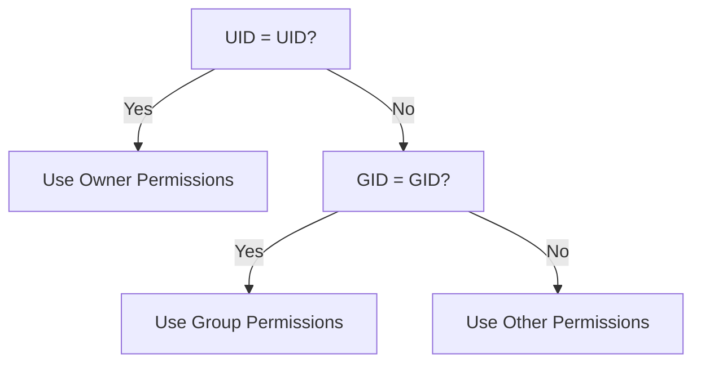

**[EXTRA]** The deck's own flowchart is accurate but its consequence is worth stating explicitly: the kernel checks owner, then group, then other, IN THAT ORDER, and stops at the FIRST match - it does not combine or take the most-permissive of the three categories. This means a file's owner can actually have FEWER effective permissions than "other" if the permission bits are set unusually (e.g., `rwx` for other but only `r--` for the owner) - the owner category is checked first and wins regardless of what "other" grants, which can produce a genuinely counter-intuitive result the deck's flowchart implies but doesn't state outright.

### Self-Check Q and A

1. **Q: A directory has permissions `d-wx------` - write and execute for the owner, nothing else, no read at all. Can the owner list the directory's contents with a plain `ls`?**
   A: No - listing contents requires READ permission on the directory, which is absent here. The owner CAN, however, still create/delete files inside if they know the exact filenames (write + execute without read is a legitimate, if unusual, "write-only drop box" pattern) and can `cd` into it (execute), just not enumerate what's there via `ls`.
2. **Q: A file has permissions `rw-rwxrwx` - owner has only read/write, but group and other both have full read/write/execute. The file's owner tries to execute it and is denied, while another user in a different unrelated group with only "other" access can execute it fine. Why?**
   A: **[EXTRA]** The kernel checks owner/group/other in strict order and applies the FIRST matching category - since the accessing user IS the owner, the owner permission bits (`rw-`, no execute) apply and execution is denied, even though the "other" category (which the kernel never reaches for the owner) does grant execute. This demonstrates that the owner category isn't automatically "most permissive" - it's simply checked first.

## Changing Permissions

> [!quote] Deck's content on symbolic mode
> `chmod permission filename`. Who: u owner, g group, o other, a all. Operator: plus adds permissions, minus removes permissions, equals assigns permissions absolutely. Permissions: r read, w write, x execute.

> [!quote] Deck's content on octal mode
> 4 read, 2 write, 1 execute.

```bash
chmod o-r file1
chmod g-r file1
chmod u+x,go+r file1
chmod a=rw file1
chmod 555 file1
chmod 775 file1
chmod 755 file1
```

**[EXTRA]** The deck's octal-mode examples show the results without walking through how a three-digit number like `755` actually maps to `rwxr-xr-x` - worth making explicit since this is where beginners most often make arithmetic mistakes:

7 5 5  
│ │ └── other: 4(r) + 0 + 1(x) = 5 -> r-x  
│ └────── group: 4(r) + 0 + 1(x) = 5 -> r-x  
└────────── owner: 4(r) + 2(w) + 1(x) = 7 -> rwx

Result: rwxr-xr-x

| Octal digit | Binary | Permission bits |
|---|---|---|
| 7 | 111 | rwx |
| 6 | 110 | rw- |
| 5 | 101 | r-x |
| 4 | 100 | r-- |
| 3 | 011 | -wx |
| 2 | 010 | -w- |
| 1 | 001 | --x |
| 0 | 000 | --- |

**[EXTRA]** Three critically important permission bits the deck's Day 2 slides never mention at all - genuinely essential production knowledge:

```bash
chmod u+s executable_file     # SUID - set-user-ID bit
chmod g+s directory_or_file    # SGID - set-group-ID bit (used above for shared directories)
chmod +t /tmp                   # sticky bit
```

| Bit | Octal prefix | On an executable file | On a directory |
|---|---|---|---|
| SUID | 4xxx | Program runs with the FILE OWNER's privileges, not the invoking user's - this is exactly how `passwd` lets a regular user change their own password despite needing to write to root-owned `/etc/shadow` | Has no standard effect |
| SGID | 2xxx | Program runs with the file's GROUP privileges | New files created inside inherit the directory's group (covered above under Ownership) |
| Sticky | 1xxx | No standard effect | Only the FILE's OWNER (or root) can delete/rename a file inside, even if others have write permission to the directory - this is exactly why `/tmp` (world-writable) doesn't let any user delete another user's files |

```bash
ls -ld /tmp
# drwxrwxrwt ... /tmp        <- note the 't' at the end instead of 'x' - sticky bit is set
```

> [!important] SUID on a program is a genuine, well-documented security risk category
> **[EXTRA]** A SUID root-owned binary runs with full root privileges regardless of who invokes it - if such a program has an exploitable bug (buffer overflow, unsafe input handling, or an unintended shell-escape feature), any unprivileged user who can execute it gains a path to root. Security audits routinely run `find / -perm -4000` to enumerate every SUID binary on a system and verify each one is genuinely necessary and free of known vulnerabilities - a real, recurring hardening task.

```bash
find / -perm -4000 2>/dev/null    # find every SUID binary on the system - a standard security audit command
```

### Self-Check Q and A

1. **Q: Walk through why `chmod 640 file` results in `rw-r-----`.**
   A: 6 for owner = 4(r)+2(w) = rw-. 4 for group = 4(r) only = r--. 0 for other = nothing = ---. Combined: `rw-r-----`.
2. **Q: Why can a regular, unprivileged user successfully run `passwd` to change their own password, even though the actual password data is stored in root-owned, root-only-readable `/etc/shadow`?**
   A: **[EXTRA]** The `/usr/bin/passwd` binary has the SUID bit set and is owned by root - when any user executes it, it runs with root's effective privileges for the duration of that execution, which is what allows it to write to `/etc/shadow` despite the invoking user having no direct permission to do so themselves.
3. **Q: `/tmp` is world-writable (`rwxrwxrwx`-ish) so any user can create files there. Why can't a malicious user simply delete another user's temp files out from under them?**
   A: **[EXTRA]** `/tmp` has the sticky bit set (shown as `t` in `ls -ld /tmp` output) - this specifically restricts deletion/renaming inside the directory to only the file's own owner (or root), overriding the otherwise-permissive world-writable directory permission for that one operation.
4. **Q: A security audit finds a SUID root binary installed by a third-party tool that nobody remembers the purpose of. Why is this a genuine finding worth investigating rather than ignoring?**
   A: **[EXTRA]** Any exploitable bug in a SUID-root binary is a direct, unauthenticated local privilege escalation path for any user who can execute it - an unrecognized or unnecessary SUID binary is exactly the kind of forgotten attack surface that `find / -perm -4000` audits are specifically designed to surface and eliminate.

## Default Permissions

> [!quote] Deck's content
> The umask command sets the default permissions for files and directories. `# umask 002`. `# umask` returns `022`.

**[EXTRA]** The deck shows the umask command and its output without explaining the actual subtraction mechanism - genuinely necessary to predict what permissions a newly created file will actually get:


Default MAXIMUM for a new FILE: 666 (rw-rw-rw-, files never default to executable)  
Default MAXIMUM for a new DIRECTORY: 777 (rwxrwxrwx)

umask value is SUBTRACTED (bitwise) from that maximum:

666 (file max)

- 022 (umask)

---

644 -> rw-r--r-- (typical actual result for a new file with umask 022)

777 (directory max)

- 022 (umask)

---

755 -> rwxr-xr-x (typical actual result for a new directory with umask 022)


> [!important] Why files never default to executable even with umask 000
> **[EXTRA]** Files start from a maximum of `666`, never `777` - the execute bit is deliberately never granted by default at file-creation time regardless of umask, specifically so that data files you create (documents, downloaded scripts, config files) don't accidentally become executable just from a permissive umask setting. Execute permission must always be added explicitly afterward with `chmod +x` when genuinely intended.

### Self-Check Q and A

1. **Q: With `umask 022` in effect, what permissions will a brand-new file actually get, and why isn't it `rwxr-xr-x`?**
   A: `644` (`rw-r--r--`) - calculated as the file maximum `666` minus umask `022`. It can never come out as `rwx...` for a plain new file regardless of umask value, because the starting maximum for files is `666`, which contains no execute bit to begin with; only directories start from a `777` maximum that can include execute bits by default.
2. **Q: A user sets `umask 000`. What actual permissions would a newly created directory get, and why might this be a security concern on a shared system?**
   A: **[EXTRA]** `777` (`rwxrwxrwx`) - the full directory maximum with nothing subtracted, meaning every user on the system can read, write, and traverse into that directory by default. On a shared/multi-user system this is a real exposure - any file dropped into such a directory inherits a wide-open default unless explicitly tightened afterward.

---

# 17 - Virtual Consoles

> [!quote] Deck's content
> Accessed with Ctrl-Alt-F_key. Consoles 1-6 accept logins. X server starts on the console 7.

**[EXTRA]** Genuinely relevant caveat the deck omits: on modern systemd-based RHEL/Fedora systems, this virtual-console-to-key mapping is managed by `systemd-logind`, and the exact console assigned to the graphical session can differ from the classic "console 7" convention the deck describes (which reflects older, pre-systemd/pre-Wayland conventions). The underlying concept - multiple independent text login sessions accessible via `Ctrl-Alt-F<n>`, separate from any graphical session - still holds and remains genuinely useful for recovering a system whose graphical desktop or main SSH session has become unresponsive.

```bash
who       # each virtual console session shows up as tty1, tty2, etc in "who" output
```

### Self-Check Q and A

1. **Q: A server's graphical desktop environment freezes completely. Why is knowing about virtual consoles operationally useful here, beyond just being a historical curiosity?**
   A: **[EXTRA]** Switching to a different virtual console (`Ctrl-Alt-F2` for example) provides a completely independent text-mode login session, unaffected by whatever caused the graphical session to hang - allowing you to log in, diagnose, and potentially kill the frozen graphical session or restart the display manager without needing to power-cycle the machine.

---

# 18 - System Shutdown

> [!quote] Deck's content
> It only requires reboot or shutdown when you need to add or remove hardware, upgrade to a new version of Ubuntu, or upgrade your kernel. `shutdown -k now` doesn't really shut down, only sends warning messages and disables logins. `shutdown -h time` halts after shutdown. `poweroff`. `init 0`.

```bash
shutdown -k now              # warn only, don't actually shut down
shutdown -h now                # halt now
shutdown -r now                 # reboot now
shutdown -h +10 "maintenance in 10 minutes"   # scheduled, with a broadcast message
poweroff
init 0
```

> [!important] `init 0` is a legacy reference on modern RHEL
> **[EXTRA]** The deck's `init 0` reflects the older SysV init system's runlevel model, where runlevel 0 meant "halt." Modern RHEL/Fedora (and most current distros) use systemd as PID 1, where the equivalent operations are `systemctl poweroff` and `systemctl reboot` - `init 0` and `shutdown` commands still work on systemd systems (systemd provides backward-compatible shims for them), but the underlying mechanism and the actual unit-dependency-based shutdown sequence is entirely systemd's, not the old SysV init's.

```bash
systemctl poweroff       # modern systemd-native equivalent
systemctl reboot
systemctl status          # see current system state / any failed units before deciding to reboot
```

### Self-Check Q and A

1. **Q: `init 0` still works to shut down a modern RHEL 9 system. Does this mean the system is actually using SysV init under the hood?**
   A: **[EXTRA]** No - modern RHEL uses systemd as PID 1. `init 0` (and the classic `shutdown` command syntax) still works because systemd provides backward-compatible command shims that translate these legacy invocations into the equivalent systemd operations (`systemctl poweroff`), preserving compatibility with old scripts and muscle memory without actually running SysV init.

---

# Beyond the Slides - Essential Linux Knowledge for a DevOps Engineer

**[EXTRA]** This entire section is additional to both decks. RHSA1 is an entry-level fundamentals course and deliberately stops short of package management, text processing, I/O redirection, service management, and remote access - all things a working DevOps engineer uses daily from week one on the job.

## Package Management

Since this note follows RHEL conventions (per the distros section), the RHEL-family tools:

```bash
dnf install httpd              # install a package (modern RHEL/Fedora - replaces yum)
dnf remove httpd                 # uninstall
dnf update                        # update all packages
dnf search keyword                  # search available packages
dnf list installed                   # list what's installed
dnf info httpd                        # package details
rpm -qa                                 # list all installed packages (lower-level than dnf)
rpm -qi httpd                            # query info about a specific installed package
rpm -ql httpd                             # list files owned by a package
```

For contrast, the Debian-family equivalents referenced earlier in this note:

```bash
apt install httpd
apt remove httpd
apt update && apt upgrade
apt search keyword
dpkg -l
```

## I/O Redirection and Pipes

Not covered anywhere in either deck, despite being fundamental to virtually every real command-line workflow:

```bash
command > file           # redirect stdout to a file, OVERWRITING it
command >> file            # redirect stdout to a file, APPENDING
command 2> file              # redirect stderr (errors) specifically
command > file 2>&1            # redirect BOTH stdout and stderr to the same file
command < file                  # feed a file as stdin

command1 | command2              # PIPE - command1's stdout becomes command2's stdin
```

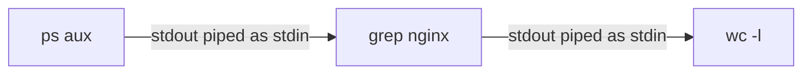

```bash
ps aux | grep nginx | wc -l      # count running nginx processes - classic pipe chain
cat access.log | grep "500" | wc -l   # count error responses in a log file
```

## Text Processing - grep, sed, awk

The single largest practical gap in the deck for a DevOps engineer, who spends enormous amounts of time parsing logs and config files:

```bash
grep "ERROR" logfile              # find lines matching a pattern
grep -i "error" logfile             # case-insensitive
grep -v "DEBUG" logfile               # INVERT - show lines NOT matching
grep -r "TODO" /path/to/code/           # recursive search through a directory
grep -c "ERROR" logfile                   # count matching lines
grep -n "ERROR" logfile                    # show line numbers

sed 's/old/new/' file                        # substitute first occurrence per line
sed 's/old/new/g' file                         # substitute ALL occurrences per line
sed -i 's/old/new/g' file                        # edit the file IN PLACE

awk '{print $1}' file                              # print the first whitespace-separated field of each line
awk -F: '{print $1}' /etc/passwd                     # use : as the field separator - print just usernames
```

## Environment Variables and PATH

```bash
echo $PATH                       # colon-separated list of directories the shell searches for commands
export MY_VAR="value"              # set an environment variable, visible to child processes
env                                  # list all current environment variables
which command                         # show which PATH directory a command actually resolves to
```

> [!important] Why PATH order matters
> **[EXTRA]** `PATH` is searched left to right, and the FIRST matching executable found wins. A very common real-world issue: a user or CI environment has an unexpected or outdated version of a tool (Python, Node, a custom script) shadowing the intended one earlier in PATH - `which toolname` immediately reveals which actual binary is being invoked.

## Service Management with systemd

Not covered at all in either deck despite being the actual mechanism behind the shutdown discussion:

```bash
systemctl status httpd           # check a service's current state
systemctl start httpd              # start it now
systemctl stop httpd                # stop it now
systemctl restart httpd              # restart
systemctl enable httpd                # start automatically on boot
systemctl disable httpd                 # don't start automatically on boot
systemctl enable --now httpd             # enable AND start in one command
journalctl -u httpd                        # view that service's logs
journalctl -u httpd -f                       # follow that service's logs live
```

## SSH and Remote Access

```bash
ssh user@hostname                          # connect to a remote machine
ssh -i keyfile.pem user@hostname             # connect using a specific private key
scp file.txt user@hostname:/remote/path/       # copy a file to a remote machine
ssh-keygen -t ed25519                            # generate a new SSH keypair
```

## Process Management

```bash
ps aux                # list all running processes
top / htop              # live, interactively updating process view
kill <pid>                 # send SIGTERM (graceful stop request)
kill -9 <pid>                # send SIGKILL (unconditional termination, per the interrupting-execution section above)
```

## Disk and Filesystem Basics

```bash
df -h              # disk space usage per mounted filesystem, human-readable
du -sh /path/         # total size of a directory, human-readable
mount / umount           # attach/detach a filesystem to the directory tree
lsblk                      # list block devices (disks and their partitions)
```

## Scheduled Tasks - cron

```bash
crontab -e                    # edit the current user's scheduled jobs
crontab -l                      # list current scheduled jobs
# 0 2 * * * /path/to/backup.sh   <- example: run daily at 2:00 AM
```

---

# Master Recap Diagram

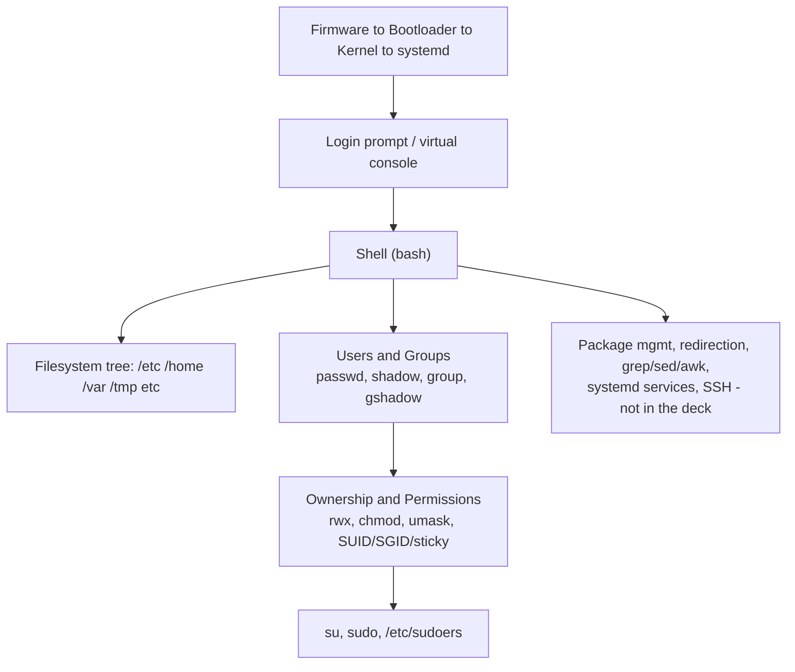

# Rapid-Fire Interview Bank

- FOSS versus proprietary: source availability and modification/redistribution rights, per deck's own definition.
- Copyleft versus permissive licensing: derivative works forced open versus freely relicensable.
- Linux versus genuine Unix: independently written kernel following POSIX, not a licensed Unix derivative.
- Kernel versus shell versus terminal versus console: privileged hardware manager, command interpreter, display/input program, physical/virtual system-tied session.
- `/etc/passwd` versus `/etc/shadow`: world-readable identity fields versus root-only encrypted password and aging data.
- `usermod -G` versus `usermod -aG`: replaces versus appends to supplementary groups.
- Absolute versus relative pathname: unambiguous from `/` versus dependent on current directory.
- Hard link versus symbolic link: same inode directly versus a stored path reference.
- `su` versus `su -`: keeps calling environment versus full login-shell environment reset.
- SUID/SGID/sticky bit: run-as-owner, run-as-group or group-inherit-on-directories, delete-restricted-to-owner-in-shared-dirs.
- umask arithmetic: subtracted from 666 (files) or 777 (directories) maximums.
- **[EXTRA]** `init 0` versus `systemctl poweroff`: legacy SysV-compatible shim versus native systemd command on modern RHEL.

# Self-Assessment - Can You Explain These Without Notes

- [ ] Why Linux is "Unix-like" rather than a genuine Unix derivative
- [ ] The actual boot sequence from firmware to login prompt, in your own words
- [ ] Why `/etc/shadow` exists as a separate file from `/etc/passwd`, historically and today
- [ ] The `usermod -G` versus `-aG` distinction, with a concrete failure scenario
- [ ] Hard link versus symbolic link, including what happens to each when the original file is deleted
- [ ] Why execute permission means something different on a directory than on a file
- [ ] The umask subtraction arithmetic for both a new file and a new directory
- [ ] What SUID accomplishes, using the `passwd` command as the worked example
- [ ] Why `su appuser` (without the dash) can produce a different PATH than `su - appuser`
- [ ] Why shell globbing (`*`, `?`, `[]`) is expanded by the shell itself, not by the individual command