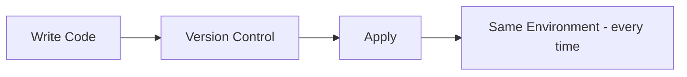
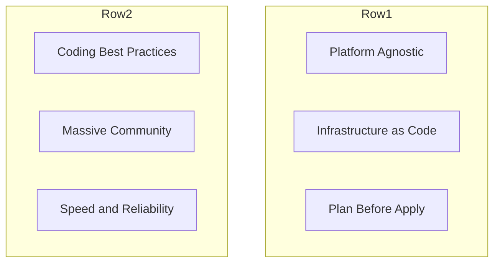
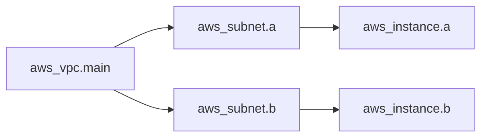
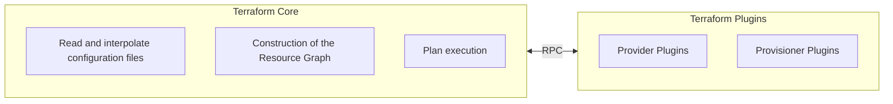
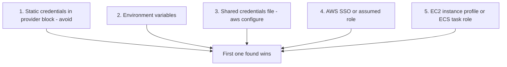

# Terraform - Complete Course Notes (Day 1 + Day 2)

> [!info] How to read this note
> Everything here traces back to the slide deck unless a line, block, or section is tagged **[EXTRA]** in bold. Tagged content is knowledge a working DevOps engineer needs that the deck did not cover, or a deeper explanation of something the deck only stated briefly. No emoji are used anywhere in this file, including callout titles - Obsidian renders its own callout icon automatically regardless.

## Course Roadmap (from the deck's own agenda slide)

| Order | Topic |
|---|---|
| 01 | Infrastructure as Code |
| 02 | What is Terraform |
| 03 | Why Terraform |
| 04 | How Terraform Works |
| 05 | Core Concepts |
| 06 | CLI Commands |
| 07 | Advanced Features |
| 08 | Hands-on Exercise |

**[EXTRA]** The deck itself is organized into two real teaching days, marked directly on its own slides ("Day 1 ·", "Day 2 ·"). This note keeps that same Day 1 / Day 2 split since it is the actual structure your instructor used.

---

# DAY 1

# 01 - Infrastructure as Code

> [!quote] Deck definition
> IaC is the management of infrastructure - networks, VMs, load balancers - in a descriptive model, using the same versioning as source code. The same IaC model generates the same environment every time it is applied.

## Idempotence - the deck's core claim



> [!important] Idempotence, as defined in the deck
> A deployment command always sets the target environment into the same configuration, regardless of the environment's starting state.

| Property (from the deck) |
|---|
| Same code leads to same infrastructure, every time |
| Version controlled |
| Repeatable deploys |
| Peer reviewed |
| Automated testing |

**[EXTRA]** "Idempotent" specifically means: running the same `apply` twice in a row produces no additional changes the second time, because the system is already in the desired state. This is different from "repeatable" - a script that blindly runs `create-vpc` every time is repeatable but NOT idempotent, since the second run would either error (duplicate name) or create a second VPC. Terraform achieves idempotence by comparing desired state against real, current state before deciding what to change - covered in the state sections below.

**[EXTRA]** IaC tool landscape, for context the deck does not give:

| Tool | Model | Scope |
|---|---|---|
| Terraform | Declarative | Multi-cloud |
| AWS CloudFormation | Declarative | AWS-only, state managed internally by AWS |
| Ansible | Mostly procedural | Configuration management, some provisioning |
| Pulumi | Declarative, written in real code | Multi-cloud |

### Self-Check Q and A

1. **Q: The deck says "same code, same infrastructure, every time." What specific Terraform mechanism makes this true rather than just aspirational?**
   A: **[EXTRA]** Terraform compares its state file (what it believes exists) against real queried infrastructure and against the desired configuration before every apply, only changing what is actually different. It does not blindly re-run creation commands, which is what would break idempotence.
2. **Q: Why does the deck list "peer reviewed" and "automated testing" as properties of IaC, when those sound like software practices rather than infrastructure concepts?**
   A: The entire point of IaC is that infrastructure changes become files in a version control system, so every practice that already applies to application code - pull requests, code review, CI checks - now applies to infrastructure changes as well.

---

# 02 - What is Terraform

> [!quote] Deck definition
> A tool for building, changing, and versioning infrastructure safely and efficiently. Terraform can manage existing and popular service providers as well as custom in-house solutions.

| Property | Value (from the deck) |
|---|---|
| License | Mozilla Public License 2.0 |
| Created by | HashiCorp |
| Since | 2014 |
| Language | Written in Go |
| Open source | github.com/hashicorp/terraform - community-driven development with thousands of providers |

**[EXTRA]** "Custom in-house solutions" in the deck's definition refers to the fact that anyone can write a Terraform provider for literally any API with a request/response model - not just the big public clouds. Companies write internal providers for things like their own service-catalog systems.

### Self-Check Q and A

1. **Q: The deck says Terraform is written in Go. Why does the implementation language matter at all to someone just using the CLI?**
   A: **[EXTRA]** It explains why Terraform ships as a single static binary with no separate runtime to install (Go compiles to a standalone executable) - directly relevant to the installation step later in this note.

---

# 03 - Why Terraform

The deck gives six reasons, presented as two rows of three:



| Reason | Deck's explanation |
|---|---|
| Platform Agnostic | The only sophisticated tool completely platform agnostic - supports AWS, Azure, GCP, and hundreds of other providers |
| Infrastructure as Code | Define infrastructure in config files. Rebuild, change, and track changes with ease. High-level, human-readable syntax |
| Plan Before Apply | The plan command lets you see exactly what changes will be applied before they happen - no surprises in production |
| Coding Best Practices | Source control, automated tests, code review, CI/CD pipelines - apply all software engineering practices to your infra |
| Massive Community | Lively open-source community. Thousands of reusable modules, providers, and integrations available on the registry |
| Speed and Reliability | Parallel resource creation, dependency graphs, and optimized API calls ensure fast, reliable deployments every time |

**[EXTRA]** "Parallel resource creation" and "dependency graphs" are the same mechanism: Terraform reads every resource block, notices which ones reference each other's attributes, and builds a directed graph. Anything with no dependency relationship to something else gets created in parallel automatically - you never write parallel/sequential instructions yourself.



**[EXTRA]** InstanceA and InstanceB above have no reference to each other, so Terraform applies both branches in parallel once their respective subnets exist.

### Self-Check Q and A

1. **Q: "Plan Before Apply" is listed as a reason to use Terraform. What actually happens if you skip straight to apply without ever running plan?**
   A: `apply` runs its own internal plan first and shows you the same diff before asking for confirmation - so you are never fully blind. Running `plan` as a separate step is about reviewing changes ahead of time (in a pull request, for a teammate, or for your own sanity check) before you are standing at the confirmation prompt.
2. **Q: How does the "dependency graph" reason connect back to the idempotence idea from Section 01?**
   A: **[EXTRA]** Both depend on Terraform actually understanding the relationships between resources and their current real state, rather than just running a linear script - the graph is what allows Terraform to know what changed and in what order to fix it.

---

# 04 - How Terraform Works

> [!quote] Deck definition
> Terraform is logically split into two main parts that communicate via Remote Procedure Calls (RPC).



| Component | Job, per the deck |
|---|---|
| Terraform Core | Read and interpolate configuration files; construction of the Resource Graph; plan execution |
| Provider Plugins | API call initialization; resource state management; authentication with infrastructure; define resources to services |
| Provisioner Plugins | Execute commands on resources; run scripts on creation or destroy; communication with plugins via RPC |

**[EXTRA]** This Core/Plugin split is exactly why `terraform init` has to download provider binaries before anything else can run - Core itself contains zero knowledge of AWS, Azure, or any other platform. Every single `aws_*` resource type is defined entirely inside the AWS provider plugin, not inside Terraform itself. This also explains why Terraform can support "thousands of providers" (Section 03) without the Core binary growing - providers are downloaded and versioned independently.

### Self-Check Q and A

1. **Q: Why does Terraform Core need to talk to Provider Plugins via RPC instead of having provider logic built directly into Core?**
   A: **[EXTRA]** This separation lets providers be developed, versioned, and released independently of Terraform Core itself, and lets any provider (including ones HashiCorp did not write) plug into the same engine through a stable protocol - which is the actual mechanism behind the "thousands of providers" claim from Section 03.
2. **Q: Which of Core's three listed jobs happens before the Resource Graph can be built?**
   A: Reading and interpolating configuration files - Core must first know every resource block and every reference between them before it can construct the graph connecting them.

---

# 05 - AWS Provider Setup

**Day 1 - provider.tf.** The provider tells Terraform which cloud platform and account to use.

```hcl
# Static credentials - NOT recommended for version control
provider "aws" {
  region     = "us-east-1"
  access_key = "AKIAxxxxxxxx"
  secret_key = "xxxxxxxxxxxx"
}
```

```bash
# Environment Variables - recommended, works with STS/CI-CD
export AWS_ACCESS_KEY_ID="AKIA..."
export AWS_SECRET_ACCESS_KEY="..."
export AWS_REGION="us-east-1"
```

```hcl
# minimal provider block, once env vars or CLI config are set:
provider "aws" {}
```

```bash
# AWS CLI Config - recommended, no secrets in code
aws configure
```

```hcl
# Provider block used alongside AWS CLI config:
provider "aws" {
  region = "us-east-1"
}
```

| Method | Deck's rating |
|---|---|
| Static Credentials | Not recommended for version control |
| Environment Variables | Recommended - no secrets in code |
| AWS CLI Config | Recommended - works with STS/CI-CD |

> [!warning] Deck's own warning
> Static credentials directly in the provider block are not recommended for version control.

**[EXTRA]** The full credential lookup order Terraform actually uses, which the deck lists three of but does not order:



**[EXTRA]** Verifying which identity you are actually authenticated as, before ever running Terraform against it:

```bash
aws sts get-caller-identity
```

**[EXTRA]** If `terraform plan` fails with "No valid credential sources found," run the command above first. If it fails too, the problem is your AWS CLI setup, not Terraform. If it succeeds but Terraform still fails, check for an `AWS_PROFILE` mismatch or a `profile` argument in the provider block pointing at the wrong named profile.

**[EXTRA]** For a CI/CD pipeline specifically, the modern best practice is OIDC federation to a scoped IAM role rather than storing static `AWS_ACCESS_KEY_ID` / `AWS_SECRET_ACCESS_KEY` values as repository secrets - no long-lived credential exists to leak.

### Self-Check Q and A

1. **Q: Between the three methods the deck shows, which one is actually reading a file on disk, and which file?**
   A: AWS CLI Config - `aws configure` writes to `~/.aws/credentials` and `~/.aws/config`, and `provider "aws" {}` with no arguments picks those up automatically.
2. **Q: A teammate hardcodes `access_key` and `secret_key` directly in `provider.tf` and commits it. What is the actual, concrete risk, beyond "it is bad practice"?**
   A: **[EXTRA]** Anyone with read access to the git repository - including its full history, even after a later commit removes the keys - can extract valid AWS credentials and use them directly, since git history is not automatically purged by a follow-up commit.

---

# 06 - Terraform AWS VPC Resource

**Day 1 - main.tf.**

```hcl
resource "aws_vpc" "main" {
  cidr_block = "10.0.0.0/16"
}
```

```hcl
# Generic structure:
resource "<PROVIDER_TYPE>" "<LOCAL_NAME>" {
  argument = value
}
```

| Piece | Deck's explanation |
|---|---|
| `resource` | Keyword for defining an infrastructure resource in Terraform |
| `"aws_vpc"` | Resource type from the AWS provider. Tells Terraform to create an AWS VPC |
| `"main"` | Local name for referencing this resource, e.g. `aws_vpc.main.id` |
| `{ ... }` | Resource block containing config arguments (`cidr_block`, `tags`, etc.) |

> [!important] Deck's own note
> What Terraform tracks in state after apply: `aws_vpc.main` maps to `vpc-0ab123456` (id, cidr_block, arn, owner_id, tags, and more). The local name "main" is only known to Terraform; the real AWS resource is identified by its ID.

**[EXTRA]** This is worth sitting with: `main` is entirely your own naming choice inside the config file. AWS itself has never heard of "main" - AWS only knows `vpc-0ab123456`. If you rename the local name from `main` to `primary` in the config with no other change, Terraform's plan will show this as destroying `aws_vpc.main` and creating `aws_vpc.primary` - a full replacement - unless you first run `terraform state mv aws_vpc.main aws_vpc.primary` (Section 13) to tell Terraform this is a rename, not a new resource.

**[EXTRA]** `resource` blocks are one of two ways to reference infrastructure in Terraform. The other is `data` blocks, which read something that already exists rather than creating it:

```hcl
data "aws_vpc" "existing" {
  filter {
    name   = "tag:Name"
    values = ["shared-vpc"]
  }
}
```

A `data` block is read-only - removing it from your config never deletes real infrastructure, unlike removing a `resource` block.

### Self-Check Q and A

1. **Q: You change the local name of a VPC resource from "main" to "primary" with nothing else different in the block. What does `terraform plan` show, and how do you avoid it?**
   A: It shows the old one being destroyed and a new one being created, because Terraform tracks resources by their full address (`aws_vpc.main`), and `aws_vpc.primary` is, as far as state is concerned, a completely different resource. `terraform state mv aws_vpc.main aws_vpc.primary` renames it in state without touching the real VPC.
2. **Q: What is the actual difference between a `resource` block and a `data` block?**
   A: **[EXTRA]** `resource` means Terraform owns the lifecycle - it creates, updates, and will destroy this thing if the block is removed. `data` means Terraform only reads an already-existing object - removing a `data` block has zero effect on real infrastructure.

---
