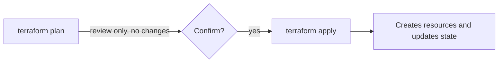
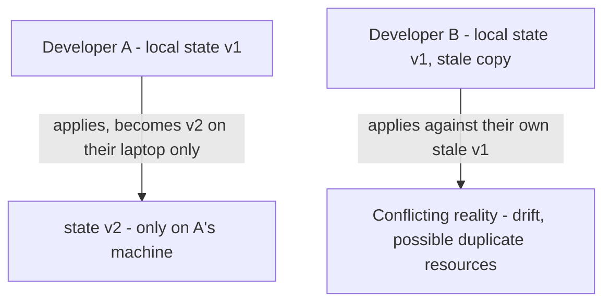

# 07 - terraform init - What It Creates

**Day 1 - Initializing a working directory.**
.terraform/  
├── providers/  
│ └── registry.terraform.io/  
│ └── hashicorp/aws/  
│ └── aws_plugin_binary  
├── modules/  
│ └── vpc/ (if modules used)  
└── backend metadata

| Item | Deck's explanation |
|---|---|
| `providers/` | Downloaded provider plugins (e.g. AWS provider binary). Terraform uses this to call AWS APIs |
| `modules/` | If config uses external modules, Terraform downloads them here after init |
| `.terraform.lock.hcl` | Locks provider versions so every team member installs the exact same versions |

> [!important] Deck's own .gitignore guidance
> Always exclude: `.terraform/`, `.terraform.lock.hcl`, `terraform.tfstate`, `terraform.tfstate.backup`

**[EXTRA]** This one line in the deck is actually slightly incomplete and worth correcting carefully: `.terraform.lock.hcl` should usually be **committed** to git, not excluded. It pins the exact provider version and checksum so that everyone on the team - and CI - installs the identical provider binary on `init`, which is precisely the guarantee the deck's own bullet above it describes. What genuinely belongs in `.gitignore` is the `.terraform/` directory itself (the actual downloaded binaries, which are large and fully reproducible from the lock file) and the state files (which contain real resource IDs and potentially secrets, and belong in a remote backend instead - Section 14).

## Corrected .gitignore

.terraform/  
terraform.tfstate  
terraform.tfstate.backup  
*.tfvars # only if it contains secrets - non-secret tfvars are often committed deliberately


**[EXTRA]** `terraform init` is also the command that reads your `backend` block (Section 14) and connects to remote state, and is the command you re-run any time you add a new provider or module reference to your config, or after a backend configuration change (`-reconfigure` or `-migrate-state` flags).

### Self-Check Q and A

1. **Q: The deck's .gitignore list includes `.terraform.lock.hcl`. Why would most real teams actually want to commit this file instead?**
   A: **[EXTRA]** The lock file is exactly what guarantees every team member and every CI run downloads the identical provider version and checksum - excluding it means `init` could silently resolve to a newer provider version on someone else's machine, defeating the reproducibility the lock file exists to provide.
2. **Q: You add a new `module` block to your config that was not there before. What command must you run before `plan` will work?**
   A: `terraform init` - it is responsible for downloading module sources in addition to provider plugins, and will error on `plan` if a referenced module has never been fetched.

---

# 08 - plan, apply, tfstate

**Day 1 - The core Terraform workflow.**



| Command | Deck's explanation |
|---|---|
| `terraform plan` | Previews what Terraform will create, update, or destroy. No changes made - safe to run anytime for review |
| `terraform apply` | Executes the plan against the cloud provider. Creates/updates `terraform.tfstate` with current state. Prompts for confirmation (skip with `-auto-approve`) |

Plan symbols, per the deck: `+ add`  `~ change`  `- destroy`

> [!quote] Deck's list of what terraform.tfstate stores
> Resource IDs and attributes; IP addresses, ARNs; resource dependencies; provider metadata.

**[EXTRA]** Reading a fuller plan diff than the deck's three symbols alone:

## aws_instance.web will be updated in-place

~ resource "aws_instance" "web" {  
id = "i-0abc123"  
~ instance_type = "t3.micro" -> "t3.small"  
}

## aws_db_instance.main will be destroyed and re-created

-/+ resource "aws_db_instance" "main" {  
~ engine_version = "13.4" -> "14.1" # forces replacement  
}

`~` means an in-place update, no data loss. `-/+` means Terraform will destroy the resource and create a fresh one to make the change - for a database or anything stateful, this line must be read carefully every single time before typing `yes`, since it means data loss unless the resource is genuinely disposable.

**[EXTRA]** `apply` requires typing the literal word `yes` at the confirmation prompt - not `y`, not Enter. This is a deliberate friction point against reflexively confirming a real infrastructure change.

### Self-Check Q and A

1. **Q: The deck says plan makes "no changes." What does plan actually do behind the scenes to produce its diff, given that it must know the real current state of every resource?**
   A: **[EXTRA]** Plan performs a refresh step, querying the real cloud API for each tracked resource's current attributes, then diffs that refreshed reality against both the state file and the desired configuration - this is also how plan can detect drift caused by someone manually changing something in the AWS console.
2. **Q: You see `-/+` next to a resource in a plan. What does that specifically mean, and why is it more dangerous than a plain `~`?**
   A: **[EXTRA]** `-/+` means the resource will be destroyed and completely recreated to apply the change, rather than updated in place. For anything holding data - a database, a stateful volume - this line means data loss unless you have confirmed the replacement is actually safe or acceptable.

---

# 09 - Providers

> [!quote] Deck definition
> A provider is responsible for understanding API interactions and exposing resources. Providers cover IaaS, PaaS, and SaaS services.

| Provider type | Examples, per the deck |
|---|---|
| IaaS | AWS, GCP, Azure, Alibaba |
| PaaS | Heroku, Render |
| SaaS | Cloudflare, Terraform Cloud |

```hcl
provider "aws" {
  version = "~> 2.0"
  region  = "us-east-1"
}
```

**[EXTRA]** The `version` argument shown directly inside the `provider` block, as in the slide's example, is old-style syntax. Modern Terraform (0.13+) expects provider version constraints inside a `required_providers` block instead:

```hcl
terraform {
  required_providers {
    aws = {
      source  = "hashicorp/aws"
      version = "~> 5.0"
    }
  }
}

provider "aws" {
  region = "us-east-1"
}
```

**[EXTRA]** The `~>` operator (sometimes called the pessimistic or twiddle-wakka constraint) allows the rightmost version segment to increase but blocks a major version jump: `~> 5.0` permits 5.1, 5.2, and so on up through any 5.x, but refuses to move to 6.0 automatically. This is the practical default for pinning provider versions - strict enough to avoid a surprise breaking change, loose enough to still receive bug fixes.

### Self-Check Q and A

1. **Q: Providers are grouped into IaaS, PaaS, and SaaS in the deck. Which category does the AWS provider itself fall into when you use it to manage something like Terraform Cloud settings via the `tfe` provider instead of EC2/VPC resources?**
   A: **[EXTRA]** That would actually be the `tfe` provider (SaaS category), not the AWS provider - the categorization is about what kind of service the specific provider talks to, not which company built it. A single AWS account can be touched by multiple different providers depending on which service you are configuring.
2. **Q: What does `~> 5.0` allow and block, specifically?**
   A: **[EXTRA]** Allows any 5.x release (5.1, 5.31, and so on); blocks a move to 6.0.0 or higher without explicitly changing the constraint yourself.

---

# 10 - Core CLI Commands

| Command | Syntax | Deck's explanation |
|---|---|---|
| Initialize | `terraform init [options] [DIR]` | Initialize a working directory. Downloads providers and modules. First command to run in any new project. Safe to run multiple times |
| Plan | `terraform plan [options] [dir]` | Creates an execution plan. Shows what actions will be taken to reach the desired state. No changes are made - review before applying |
| Apply | `terraform apply [options] [dir-or-plan]` | Applies the changes required to reach the desired state. Executes the plan and provisions/modifies real infrastructure resources |
| Destroy | `terraform destroy [options] [dir]` | Destroys all Terraform-managed infrastructure. Use with caution - this tears down everything defined in your configuration |

**[EXTRA]** `apply` accepting `[dir-or-plan]` in its syntax is worth noticing: you can pass it either a directory of `.tf` files (it re-plans fresh), or a saved plan file from a previous `plan -out=tfplan` run (it applies exactly that plan, with no re-planning). The second form removes any possibility of drift happening between the moment a plan was reviewed and the moment it is applied - the standard pattern in CI/CD pipelines:

```bash
terraform plan -out=tfplan
# reviewed, e.g. posted as a pull request comment
terraform apply tfplan
```

### Self-Check Q and A

1. **Q: What is the practical difference between `terraform apply` on its own and `terraform apply tfplan` where `tfplan` is a file saved from an earlier `plan -out=tfplan`?**
   A: **[EXTRA]** A bare `apply` re-runs its own plan internally immediately before applying, which could differ from a plan reviewed earlier if real infrastructure changed in between. `apply tfplan` applies the exact, already-reviewed plan with no re-planning step, removing that race condition entirely - the reason CI/CD pipelines use this two-step pattern.

---

# 11 - Terraform State File - What and Why

**Day 1 - terraform.tfstate.**

```json
{
  "resources": [
    {
      "type": "aws_vpc",
      "name": "main",
      "instances": [{
        "attributes": {
          "id": "vpc-0ab123456"
        }
      }]
    }
  ]
}
```

The deck lists four jobs of the state file:

| Job | Deck's explanation |
|---|---|
| 1. Track Resources | Records which infrastructure resources exist. Example: `aws_instance.web` maps to `i-012345` |
| 2. Compare Desired vs Actual | Code vs State vs Real Cloud, decides Create / Update / Destroy |
| 3. Store Metadata | Resource IDs, IPs, ARNs, dependencies - all saved for future operations |
| 4. Improve Performance | Avoids querying the cloud for every resource on every run |

> [!important] Deck's own summary
> `config "aws_vpc" "main" { }` maps to real resource `vpc-0ab123456`.

**[EXTRA]** Point 4 ("Improve Performance") deserves unpacking, because it explains why `plan` still needs to talk to AWS at all if the state file already has everything cached: state avoids re-*discovering* which resources exist and how they relate (the graph, the metadata), but `plan` still refreshes each tracked resource's live attributes from the real API to catch drift. State is a cache of identity and structure, not a guarantee that the cached attribute values are still accurate - that is exactly what the refresh step re-checks.

**[EXTRA]** Everything in the state file, including any attribute a provider marks as sensitive (like a generated database password), is stored in **plain text**. Marking a Terraform variable `sensitive = true` only hides it from console output during plan/apply - it does not encrypt or redact it inside the state file itself. This is the single biggest reason remote state (Section 14) must itself be encrypted and access-controlled.

### Self-Check Q and A

1. **Q: If the state file already stores every resource's attributes as point 3 describes, why does `terraform plan` still need to make real API calls to AWS?**
   A: **[EXTRA]** State records what Terraform last knew, not necessarily what is true right now - someone could have changed a resource manually outside of Terraform. Plan's refresh step re-queries AWS for live attribute values specifically to catch this kind of drift before deciding what changes are needed.
2. **Q: A variable holding a database password is marked `sensitive = true`. Does this protect the password inside `terraform.tfstate`?**
   A: **[EXTRA]** No. `sensitive = true` only suppresses the value from plan/apply console output. The state file stores the actual value in plain text regardless, which is why state files themselves must be encrypted at rest and access-restricted, not relied upon to protect secrets by themselves.

---

# 12 - State File - Risks and Remote Backend

**Day 1 - Why local state is dangerous.**

| Risk | Deck's explanation |
|---|---|
| 1. Terraform Forgets Everything | Deleting tfstate makes Terraform think nothing exists. Re-running apply may create duplicate resources |
| 2. Infrastructure Drift | Resources exist in AWS but Terraform can no longer track or manage them |
| 3. Possible Data Loss | Terraform may recreate databases, storage, or networking - destroying existing data |

```hcl
terraform {
  backend "s3" {
    bucket = "terraform-state-bucket"
    key    = "dev/terraform.tfstate"
    region = "us-east-1"
  }
}
```

Deck's listed benefits of a remote backend: shared state across team; more secure (encrypted); no accidental deletion; state locking support.

**[EXTRA]** "Shared state across team" is worth expanding on with a concrete failure mode the deck does not spell out. Without a remote backend, each developer has their own local `terraform.tfstate`:



This is the actual, mechanical reason "shared state across team" matters - it is not just a convenience, it prevents two people from making conflicting changes against two different beliefs about what currently exists.

### Self-Check Q and A

1. **Q: A developer deletes their local `terraform.tfstate` file by accident, with real infrastructure already provisioned. What actually happens the next time you run `terraform apply`, per risk 1 in the deck?**
   A: Terraform has no memory of anything it previously created, so it treats every resource in the config as brand new and attempts to create it again - this can fail outright on naming conflicts, or worse, succeed and create genuine duplicates that are now completely untracked.
2. **Q: Why does the deck list "state locking support" as a benefit specifically of a remote backend, rather than something local state could also offer?**
   A: A single local file with no coordinating service has no way to prevent two people from reading and writing it at the same time. Locking requires a separate, shared mechanism (in the deck's example, DynamoDB) that both people's Terraform runs check against - something a local-only file cannot provide on its own. Covered in full in the next section.

---
