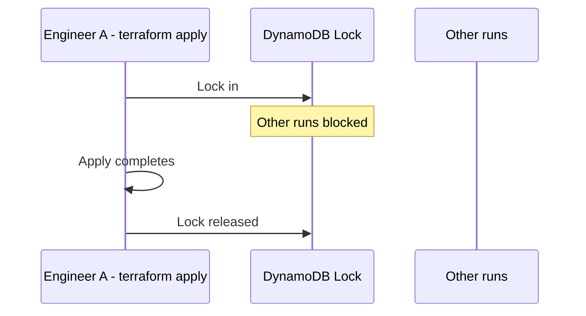

# 13 - State Locking and force-unlock

**Day 1 - Preventing concurrent Terraform runs.**

> [!quote] Deck's explanation
> Two engineers running `terraform apply` simultaneously can corrupt the state file. Terraform prevents this with state locking via DynamoDB.



```hcl
terraform {
  backend "s3" {
    bucket         = "terraform-state-bucket"
    key            = "dev/terraform.tfstate"
    region         = "us-east-1"
    dynamodb_table = "terraform-locks"  # locking
  }
}
```

```bash
# force-unlock - manual unlock after failed/interrupted operations
terraform force-unlock 12345678-1234-1234-1234-123456789012
```

> [!important] Deck's own note
> Find the Lock ID in the DynamoDB table's LockID column.

**[EXTRA]** `force-unlock` should be treated as an emergency-only command, used specifically when you have confirmed (by checking with the rest of the team, or checking whether the process that held the lock actually crashed) that no other `apply` is genuinely still running. Force-unlocking while another apply is legitimately still in progress reintroduces exactly the corruption risk the lock exists to prevent.

**[EXTRA]** Without the `dynamodb_table` argument, an S3 backend still stores state remotely and shares it across the team, but offers no locking at all - the two-engineers-apply-at-once scenario from the deck's own explanation becomes possible again. The `dynamodb_table` line is not optional if you want the full protection described.

### Self-Check Q and A

1. **Q: Two engineers both run `terraform apply` at nearly the same moment against an S3 backend with a `dynamodb_table` configured. What happens to the second one?**
   A: The second apply is blocked at the lock-acquisition step with an error stating the state is locked, rather than proceeding and potentially corrupting the state file - it must wait until the first apply completes and releases the lock, then can retry.
2. **Q: Under what circumstance is running `terraform force-unlock` actually safe, versus when could it cause the exact corruption locking is meant to prevent?**
   A: **[EXTRA]** It is safe when you have confirmed the process holding the lock has genuinely crashed or been interrupted and is not still running. It is dangerous if run while another apply is legitimately still in progress, since it would allow two concurrent writes to the state file - the very race condition the lock exists to block.

---

# 14 - Terraform State Commands

**Day 1 - Managing state from the CLI.**

| Command | Deck's explanation |
|---|---|
| `terraform state list` | List all resources tracked in state |
| `terraform state show aws_vpc.main` | Display attributes of a specific resource |
| `terraform state pull` | Retrieve raw state file in JSON format - useful for debugging |
| `terraform state mv aws_vpc.main aws_vpc.production` | Rename resource in state after code refactor - avoids recreate |
| `terraform state rm aws_vpc.main` | Remove from state without deleting from AWS. Terraform stops managing it |
| `terraform import aws_vpc.main vpc-123456` | Bring an existing AWS resource under Terraform management |

**[EXTRA]** `state rm` and `destroy` are opposites and are easy to confuse under pressure - worth stating plainly:

| Command | Effect on the state file | Effect on real AWS resource |
|---|---|---|
| `terraform state rm X` | Removes tracking | Resource keeps running, completely untouched |
| `terraform destroy -target=X` | Removes tracking | Resource is actually deleted |

**[EXTRA]** `terraform import` (also listed again in Section 16) is how you adopt a resource that already exists in AWS - created by hand in the console, or by an older tool - under Terraform's management going forward. The import command alone only updates the state file; you must also write a matching `resource` block in your `.tf` files yourself, or the very next `plan` will show Terraform wanting to destroy the "unmanaged" resource it now believes should not exist.

```bash
# 1. Write a resource block that matches the real thing, even roughly
resource "aws_vpc" "main" {
  cidr_block = "10.0.0.0/16"   # your best guess at the real value
}

# 2. Import - links the block to the real resource ID
terraform import aws_vpc.main vpc-123456

# 3. Run plan - it will show any mismatch between your guessed arguments
#    and the real resource's actual attributes, which you then correct by hand
terraform plan
```

### Self-Check Q and A

1. **Q: What is the practical difference between `terraform state rm aws_s3_bucket.data` and `terraform destroy -target=aws_s3_bucket.data`, and when would you deliberately choose the former?**
   A: `state rm` stops Terraform tracking the bucket while leaving it and its data fully intact in AWS. `destroy -target` actually deletes it. You would choose `state rm` when handing a resource off to be managed by a different config or team, without wanting to destroy the real thing.
2. **Q: You run `terraform import aws_vpc.main vpc-123456` successfully. Is your config file now automatically correct and complete for this resource?**
   A: **[EXTRA]** No - import only updates the state file's link between your local resource address and the real resource ID. You must still write (or correct) the actual `resource` block in your `.tf` files to match the real resource's arguments, or the next plan will propose changes to "fix" arguments that were never actually written down correctly.

---

# 15 - terraform fmt and terraform destroy

**Day 1 - Format code and clean up infrastructure.**

```hcl
# Before:
resource "aws_vpc" "main"{cidr_block="10.0.0.0/16"}

# After terraform fmt:
resource "aws_vpc" "main" {
  cidr_block = "10.0.0.0/16"
}
```

```bash
terraform destroy
terraform destroy -auto-approve
```

| `terraform fmt` (deck) | `terraform destroy` (deck) |
|---|---|
| Auto-formats all .tf files | Removes all Terraform-managed resources |
| Ensures consistent code style | Destroys all resources in configuration |
| Improves readability | Asks for confirmation (unless `-auto-approve`) |
| Run before git commit | Updates state file - removes destroyed resources |
| | Useful for test environments and cleanup |

> [!warning] Deck's own warning
> Permanently deletes AWS resources. Use with caution.

**[EXTRA]** For CI, `terraform fmt -check -recursive` is the variant worth knowing: instead of rewriting files, it exits with a non-zero status if anything is unformatted, which is what you actually want in a pipeline check step (you want the pipeline to fail and tell a human to run `fmt`, not silently rewrite their files for them).

**[EXTRA]** `-target` works on `destroy` the same way it does on `apply` - `terraform destroy -target=aws_instance.web` tears down a single resource rather than everything in the config. It still asks for confirmation, and should still be treated as a scalpel rather than a routine tool - repeated targeted destroys can leave your state in a shape the rest of your config no longer fully accounts for.

### Self-Check Q and A

1. **Q: Why does `terraform fmt` matter enough for the deck to specifically say "run before git commit"?**
   A: **[EXTRA]** Consistent formatting means diffs in pull requests show only actual logical changes, not incidental whitespace/alignment differences - an unformatted commit can make a one-line change look like it touched dozens of lines, making review much harder.
2. **Q: What is the CI-friendly variant of `terraform fmt`, and how does its behavior differ from the plain command?**
   A: **[EXTRA]** `terraform fmt -check -recursive` - instead of rewriting files in place, it only checks whether they are already correctly formatted and exits with an error code if not, which is what a CI pipeline needs in order to fail the check rather than silently mutate someone's branch.

---

# 16 - More CLI Commands

| Command | Syntax | Deck's explanation |
|---|---|---|
| `terraform fmt` | `terraform fmt [options] [DIR]` | Rewrites config files to canonical format and style. Run before committing code |
| `terraform graph` | `terraform graph \| dot -Tsvg > graph.svg` | Generates a visual DOT-format representation of the dependency graph. Pipe to GraphViz |
| `terraform import` | `terraform import [args]` | Import existing infrastructure into Terraform state. Bring unmanaged resources under Terraform control |
| `terraform state` | `terraform state <subcommand>` | Advanced state management subcommand. List, show, move, or remove items from state without editing files directly |

**[EXTRA]** `terraform graph` connects directly back to Section 03's "dependency graph" explanation - this command lets you actually see the graph Terraform builds internally, rather than taking the concept on faith. Running it on even a small config with a VPC, subnet, and instance will visibly show the same chain drawn in Section 03's diagram.

**[EXTRA]** Two more commands worth knowing that are not in this deck at all:

```bash
terraform validate     # checks syntax and internal type consistency, no network calls at all
terraform console       # interactive REPL - test expressions and functions against your real loaded config
```

`validate` is useful as a fast pre-check before `plan`, since it catches syntax errors without needing real AWS credentials or network access at all. `console` lets you test an unfamiliar expression or function safely:

$ terraform console

> upper("hello")  
> "HELLO"  
> aws_vpc.main.cidr_block  
> "10.0.0.0/16"  
> exit


### Self-Check Q and A

1. **Q: `terraform validate` passes with no errors, but `terraform apply` later fails with an AWS permissions error. Why did validate not catch this?**
   A: **[EXTRA]** Validate only checks configuration syntax and internal type consistency - it never makes real API calls. Permission errors, quota limits, or anything about whether the config actually works against the real cloud only surface at plan (which refreshes real state) or apply (which makes the real mutating calls).
2. **Q: How does `terraform graph` relate back to the "Construction of the Resource Graph" job listed under Terraform Core in Section 04?**
   A: **[EXTRA]** `graph` is a direct way to visualize that same internal structure Core builds during planning - it is not a separate feature, but a window into the exact dependency graph Core already constructs every time it plans or applies.

---
