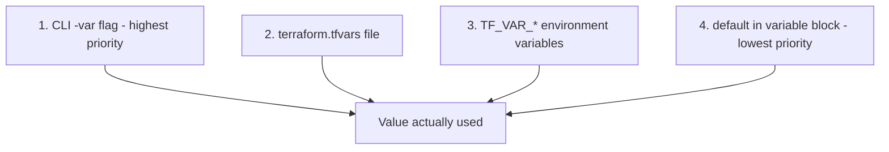
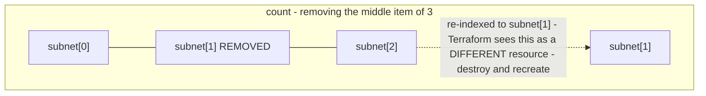

# DAY 2

# 17 - Terraform Variables

**Day 2 - variables.tf - Making configuration dynamic.**

> [!quote] Deck's explanation
> Variables avoid hardcoding values, make configs reusable across environments, and support type checking and defaults.

```hcl
# variables.tf
variable "vpc_cidr" {
  description = "CIDR block for the VPC"
  type        = string
  default     = "10.0.0.0/16"
}

variable "public_subnet_cidr" {
  description = "CIDR block for the public subnet"
  type        = string
  default     = "10.0.1.0/24"
}

variable "region" {
  description = "AWS region"
  type        = string
  default     = "us-east-1"
}
```

```hcl
# main.tf - using variables
provider "aws" {
  region = var.region
}

resource "aws_vpc" "main" {
  cidr_block = var.vpc_cidr
}

resource "aws_subnet" "public" {
  vpc_id     = aws_vpc.main.id
  cidr_block = var.public_subnet_cidr
}
```

**[EXTRA]** The full HCL type system, beyond the `string` type the deck's examples use:

| Type | Example |
|---|---|
| `string`, `number`, `bool` | Primitives |
| `list(string)` | `["a", "b", "c"]` - ordered, duplicates allowed |
| `set(string)` | Unordered, automatically deduplicated |
| `map(string)` | `{ key = "value" }` |
| `object({...})` | Structured, named and typed fields together |

**[EXTRA]** Variables also support a `validation` block, which catches bad input immediately with a clear error rather than letting a malformed value fail confusingly deep inside whatever resource actually consumes it:

```hcl
variable "region" {
  type = string
  validation {
    condition     = contains(["us-east-1", "us-west-2", "eu-west-1"], var.region)
    error_message = "region must be one of the approved regions."
  }
}
```

**[EXTRA]** Marking a variable `sensitive = true` (relevant for anything like a database password passed as a variable) hides it from console output during plan and apply - but, as covered in Section 11, it does not protect the value inside the state file itself.

### Self-Check Q and A

1. **Q: The deck's `vpc_cidr` variable has both a `type` and a `default`. What happens if someone passes a value that does not match the declared type?**
   A: **[EXTRA]** Terraform raises a type-mismatch error before planning even begins - this is exactly the "type checking" benefit the deck's own definition mentions, catching a wrong-shaped value early rather than letting it silently cause strange behavior deep in a resource block.
2. **Q: Why might a team add a `validation` block to the `region` variable specifically, beyond just declaring it `type = string`?**
   A: **[EXTRA]** `type = string` only confirms the value is text - it says nothing about whether it is a real, approved AWS region for this organization. A validation block can enforce business rules (only these three regions are allowed) that the type system alone cannot express.

---

# 18 - Passing Variables - 4 Methods

**Day 2 - Priority order: -var greater than tfvars greater than env vars greater than defaults.**



> [!warning] Correction to the deck's stated order
> The deck's subtitle states the priority as `-var greater than tfvars greater than env vars greater than defaults`. Terraform's actual documented precedence places environment variables (`TF_VAR_*`) **below** `.tfvars` files but **above** the `default` in the variable block - so the correct order is: CLI `-var` flag highest, then `.tfvars` files, then `TF_VAR_*` environment variables, then the variable block's `default` lowest. This matches the order shown in the diagram above and in the numbered list below, and matters in practice: do not assume an exported `TF_VAR_region` will override a value sitting in `terraform.tfvars` - it will not.

| Method | Deck's explanation |
|---|---|
| 1. Default Values | If nothing else provided, Terraform uses the value in the variable block |
| 2. terraform.tfvars | File auto-loaded on plan/apply. Best for environment-specific overrides |
| 3. CLI -var Flag | Pass inline on the command line. Useful for one-off overrides |
| 4. TF_VAR_* Env Vars | Prefix variable names with TF_VAR_. Great for CI/CD pipelines and secrets |

```hcl
# terraform.tfvars
vpc_cidr           = "10.1.0.0/16"
public_subnet_cidr = "10.1.1.0/24"
region             = "us-west-2"
```

```bash
# CLI flag
terraform apply \
  -var="vpc_cidr=10.2.0.0/16" \
  -var="region=eu-central-1"
```

```bash
# Environment variables
export TF_VAR_vpc_cidr="10.3.0.0/16"
export TF_VAR_region="ap-southeast-1"
terraform apply
```

**[EXTRA]** Practical guidance on which method to use for what, since the deck lists all four without saying when to prefer each:

| Method | Best for |
|---|---|
| `.tfvars` committed to git | Per-environment, non-secret values everyone should see and review |
| `TF_VAR_*` env vars | Secrets injected by CI/CD - never commit a secret into a `.tfvars` file |
| `-var` CLI flag | One-off overrides while testing, scripting |
| `default` in variable block | Sensible fallback so the config still works with zero extra setup |

### Self-Check Q and A

1. **Q: A value is set in both `terraform.tfvars` and as a `TF_VAR_*` environment variable. Which one actually wins, and how does this differ from what the deck's subtitle states?**
   A: The `.tfvars` file value wins - Terraform's real precedence places `.tfvars` files above environment variables, which is the opposite of the order implied by the deck's subtitle line. The CLI `-var` flag is the only thing that outranks `.tfvars`.
2. **Q: Why does the deck recommend `TF_VAR_*` environment variables specifically for secrets, rather than putting the secret value directly in a `.tfvars` file?**
   A: A `.tfvars` file is a file on disk that risks being committed to git by accident. An environment variable set by a CI/CD pipeline's own secret-storage mechanism is never written to a file in the repository at all, removing that specific accidental-commit risk.

---

# 19 - Terraform Workspaces

**Day 2 - Manage multiple environments with one config.**

> [!quote] Deck's explanation
> Workspaces isolate state files for different environments (dev, staging, prod) without separate Terraform configurations.

```bash
terraform workspace list                # List all existing workspaces. Current workspace marked with *
terraform workspace new dev              # Create a new workspace called "dev" and switch to it
terraform workspace select dev           # Switch to an existing workspace
terraform workspace show                 # Display the name of the current workspace
```

> [!important] Deck's own note
> Each workspace gets its own isolated state file - dev changes never affect prod. The default workspace cannot be deleted.

**[EXTRA]** Workspaces are genuinely useful but have one real limitation worth knowing before relying on them for prod isolation: because all workspaces share the exact same `.tf` configuration files, any structural difference between environments (say, prod needs a database read replica that dev does not) has to be expressed as a conditional inside shared code:

```hcl
resource "aws_db_instance" "replica" {
  count = terraform.workspace == "prod" ? 1 : 0
  # ...
}
```

**[EXTRA]** A widely used alternative pattern, especially once environments genuinely diverge in structure and not just in values, is separate directories per environment that each call the same shared modules:


environments/  
├── dev/main.tf -> module "vpc" { source = "../../modules/vpc" cidr = "10.0.0.0/16" }  
├── staging/main.tf -> module "vpc" { source = "../../modules/vpc" cidr = "10.1.0.0/16" }  
└── prod/main.tf -> module "vpc" { source = "../../modules/vpc" cidr = "10.2.0.0/16" }

This trades the convenience of one shared config for physically separated files - which also makes it much harder to accidentally apply a change intended for dev against prod, since you would have to be `cd`'d into the wrong directory rather than just have forgotten which workspace is currently selected. Both patterns are legitimate; workspaces suit near-identical environments, separate directories suit environments that genuinely differ in structure or that need stronger blast-radius isolation.

### Self-Check Q and A

1. **Q: You run `terraform apply` intending to update dev, but you are actually still in the prod workspace from an earlier session. What happens, and what single command would have caught this beforehand?**
   A: The apply proceeds against whatever workspace is currently selected, meaning it would apply dev-intended changes to production infrastructure. `terraform workspace show` before any apply is the direct check.
2. **Q: Prod needs one extra resource dev and staging do not need at all. How would you express this using workspaces, and what is the tradeoff of that approach compared to separate directories?**
   A: **[EXTRA]** With workspaces, a `count = terraform.workspace == "prod" ? 1 : 0` conditional on that resource. The tradeoff is that structural differences between environments become buried inside conditionals in shared code, rather than being visible directly in a directory structure - separate directories make "what does prod actually contain" answerable just by looking at prod's own files.

---

# 20 - Advanced HCL: count, for_each and output

```hcl
resource "aws_subnet" "public" {
  count             = 2
  vpc_id            = aws_vpc.myvpc.id
  cidr_block        = var.sub_pub_cidr_list[count.index]
  availability_zone = var.azs[count.index]
}
```

> [!quote] Deck's explanation of count
> Create multiple resource instances from one definition.

```hcl
resource "aws_subnet" "subnets" {
  for_each = {
    for subnet in var.sub_map :
    subnet.cidr => subnet
  }
  map_public_ip_on_launch =
    each.value.type == "public"
}
```

> [!quote] Deck's explanation of for_each
> Iterate over a map or set for conditional/named resources.

```hcl
output "instance_ip_addr" {
  value       = aws_instance.server.private_ip
  description = "The private IP address"
}
```

> [!quote] Deck's explanation of output
> Output values expose resource attributes to users or other modules. Printed in CLI after apply. Accessible via remote state.

**[EXTRA]** The deck introduces both `count` and `for_each` but does not compare them directly - this comparison matters a great deal in practice:

| | `count` | `for_each` |
|---|---|---|
| Index type | Numeric - `[0]`, `[1]` | String key - `["frontend"]` |
| Removing an item from the middle | Re-indexes everything after it | Only the removed key is affected |
| Input | A number | A `set` or `map` |



`for_each` avoids this because each resource is keyed by a stable string, not a position - removing one key affects only that key. This is exactly why the deck's own second example uses `for_each` keyed by `subnet.cidr` rather than `count` - a genuinely more resilient pattern for anything with a natural identity.

**[EXTRA]** `for` expressions (not the same thing as `for_each`, though related) transform collections into new values, used heavily inside `locals`:

```hcl
locals {
  all_subnet_ids = [for s in aws_subnet.public : s.id]
  name_to_ip     = { for i in aws_instance.web : i.tags.Name => i.private_ip }
}
```

### Self-Check Q and A

1. **Q: You manage 3 subnets with `count = 3` and need to delete the middle one specifically. What actually happens to the subnet that used to be index 2, and why does the deck's own for_each example avoid this problem?**
   A: **[EXTRA]** Removing the middle item re-indexes everything after it, so what was `subnet[2]` becomes `subnet[1]` - Terraform reads this as a completely different resource at that address and plans a destroy-and-recreate, not a no-op. The deck's `for_each` example keys each subnet by `subnet.cidr` instead, so removing one entry only affects that specific key, leaving the others untouched.
2. **Q: The deck says outputs are "accessible via remote state." What mechanism actually makes that true?**
   A: A separate config can read another config's published outputs through the `terraform_remote_state` data source, pointed at the same backend and state file key the first config uses - this is covered in more depth in Section 21.

---

# 21 - Terraform Outputs

**Day 2 - Displaying and sharing resource values.**

```hcl
# outputs.tf
output "vpc_id" {
  value = aws_vpc.main.id
}

output "subnet_id" {
  value = aws_subnet.public.id
}
```

## After terraform apply:

## Outputs:

## vpc_id = vpc-0abc123456

## subnet_id = subnet-0ab456789

The deck lists four use cases for outputs:

| Use case | Deck's explanation |
|---|---|
| Display After Apply | Print public IPs, VPC IDs, or DNS names to the terminal for quick reference |
| Share Between Modules | A child module exposes outputs; the parent module consumes them as input |
| Remote State Access | Other configs read root outputs via `terraform_remote_state` data source |
| CI/CD Integration | Parse output values in pipelines to pass resource IDs to deployment steps |

> [!important] Deck's own summary
> `output "<name>" { value = <resource>.<local_name>.<attribute> }` - use `terraform output` to print after apply.

**[EXTRA]** The "Remote State Access" use case, spelled out concretely:

```hcl
data "terraform_remote_state" "network" {
  backend = "s3"
  config = {
    bucket = "terraform-state-bucket"
    key    = "prod/vpc/terraform.tfstate"
    region = "us-east-1"
  }
}

resource "aws_instance" "app" {
  subnet_id = data.terraform_remote_state.network.outputs.subnet_id
}
```

This is how one team's config can read another team's or component's published output without needing to know anything about how that VPC was actually built - only its bucket, key, and output names.

**[EXTRA]** Reading outputs from the CLI directly:

```bash
terraform output                    # show all outputs
terraform output vpc_id              # one value, script-friendly
terraform output -json                # machine-readable, feeds other tools
```

**[EXTRA]** If an output's value derives from anything marked `sensitive` (a sensitive variable, or a provider attribute the AWS provider itself marks sensitive - like a generated RDS password), Terraform forces the output itself to also be marked `sensitive = true`, and refuses to apply otherwise. This propagation is automatic and cannot be bypassed - it exists specifically to stop a sensitive value from surfacing in plain console output just because it passed through an output block.

### Self-Check Q and A

1. **Q: Team B's Terraform config needs the VPC ID that Team A's completely separate config created and manages in its own state file. Per the deck's "Remote State Access" use case, what is the actual mechanism, and what does Team B need to know about Team A's setup to use it?**
   A: The `terraform_remote_state` data source, pointed at Team A's backend configuration (bucket, key, region). Team B needs to know Team A's state location and the exact output name Team A published - nothing about how Team A's VPC was actually built internally.
2. **Q: An output references an RDS instance's password attribute, which the AWS provider marks sensitive. You forget to add `sensitive = true` on the output block. What happens?**
   A: **[EXTRA]** Terraform refuses to plan or apply, raising an error insisting the output be explicitly marked sensitive - sensitivity propagates automatically through the expression graph and cannot be silently bypassed by simply omitting the flag.

---
