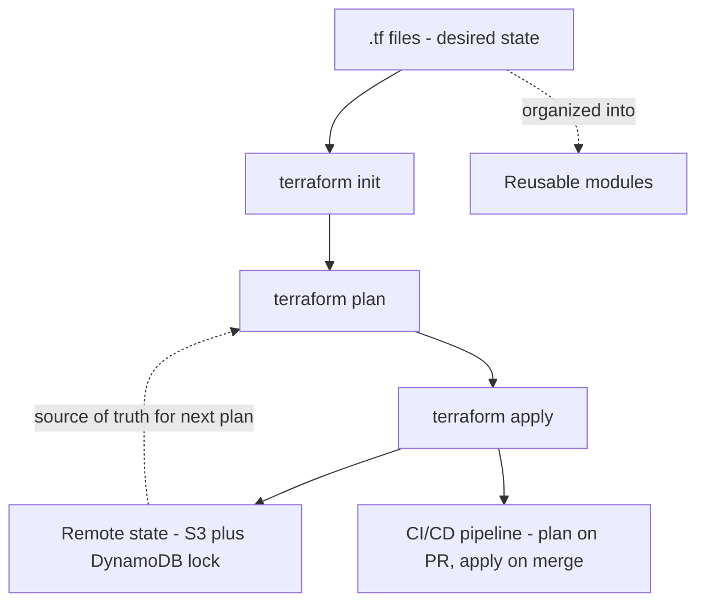

# Master Recap Diagram

# Rapid-Fire Interview Bank

- Idempotence, per the deck: same command always sets the target into the same configuration regardless of starting state.
- Core versus Plugins: Core reads config and builds the graph; Provider Plugins do the actual API calls; they talk via RPC.
- Local name versus real resource ID: local name is only known to Terraform; the real thing is identified by its cloud-assigned ID.
- Four things state tracks, per the deck: resource IDs and attributes, dependencies, provider metadata, and drift comparison.
- Why remote state: shared across team, encrypted, prevents accidental deletion, supports locking.
- `state rm` versus `destroy`: stops tracking without deleting, versus actually deleting the real resource.
- `count` versus `for_each`: numeric and fragile to reordering, versus keyed and stable.
- Provisioners: last resort, only run on initial creation, do not re-run on in-place updates.
- Modules: a directory of `.tf` files with `variable` and `output` blocks as its interface; the root module is not structurally special.
- **[EXTRA]** `-/+` in a plan: destroy and recreate, always worth a second look on anything stateful before confirming.

# Self-Assessment - Can You Explain These Without Notes

- [ ] The Core versus Plugins split and why it explains what `terraform init` downloads
- [ ] Why a local resource name is not the same thing as the real AWS resource ID, using the deck's own VPC example
- [ ] All four risks of local state, in your own words
- [ ] The correct variable precedence order, and where the deck's stated order was wrong
- [ ] Why `count` re-indexing can silently destroy and recreate unrelated resources
- [ ] Why provisioners are called "last resort" twice in this deck, with a concrete failure scenario
- [ ] **[EXTRA]** Why `sensitive = true` on a variable or output does not protect the state file itself'

