# Terraform - Complete Course Notes (Day 1 + Day 2)

> [!info] How to read this note
> Everything here traces back to the slide deck unless a line, block, or section is tagged **[EXTRA]** in bold. Tagged content is knowledge a working DevOps engineer needs that the deck did not cover, or a deeper explanation of something the deck only stated briefly. No emoji are used anywhere in this file, including callout titles - Obsidian renders its own callout icon automatically regardless.

## Course Roadmap (from the deck's own agenda slide)

| Order | Topic |
|---|---|
| 01 | Infrastructure as Code |
| 02 | What is Terraform |
| 03 | Why Terraform |
| 04 | How Terraform Works |
| 05 | Core Concepts |
| 06 | CLI Commands |
| 07 | Advanced Features |
| 08 | Hands-on Exercise |

**[EXTRA]** The deck itself is organized into two real teaching days, marked directly on its own slides ("Day 1 ·", "Day 2 ·"). This note keeps that same Day 1 / Day 2 split since it is the actual structure your instructor used.

---

# DAY 1

# 01 - Infrastructure as Code

> [!quote] Deck definition
> IaC is the management of infrastructure - networks, VMs, load balancers - in a descriptive model, using the same versioning as source code. The same IaC model generates the same environment every time it is applied.

## Idempotence - the deck's core claim

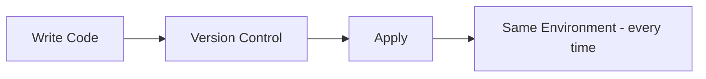

> [!important] Idempotence, as defined in the deck
> A deployment command always sets the target environment into the same configuration, regardless of the environment's starting state.

| Property (from the deck) |
|---|
| Same code leads to same infrastructure, every time |
| Version controlled |
| Repeatable deploys |
| Peer reviewed |
| Automated testing |

**[EXTRA]** "Idempotent" specifically means: running the same `apply` twice in a row produces no additional changes the second time, because the system is already in the desired state. This is different from "repeatable" - a script that blindly runs `create-vpc` every time is repeatable but NOT idempotent, since the second run would either error (duplicate name) or create a second VPC. Terraform achieves idempotence by comparing desired state against real, current state before deciding what to change - covered in the state sections below.

**[EXTRA]** IaC tool landscape, for context the deck does not give:

| Tool | Model | Scope |
|---|---|---|
| Terraform | Declarative | Multi-cloud |
| AWS CloudFormation | Declarative | AWS-only, state managed internally by AWS |
| Ansible | Mostly procedural | Configuration management, some provisioning |
| Pulumi | Declarative, written in real code | Multi-cloud |

### Self-Check Q and A

1. **Q: The deck says "same code, same infrastructure, every time." What specific Terraform mechanism makes this true rather than just aspirational?**
   A: **[EXTRA]** Terraform compares its state file (what it believes exists) against real queried infrastructure and against the desired configuration before every apply, only changing what is actually different. It does not blindly re-run creation commands, which is what would break idempotence.
2. **Q: Why does the deck list "peer reviewed" and "automated testing" as properties of IaC, when those sound like software practices rather than infrastructure concepts?**
   A: The entire point of IaC is that infrastructure changes become files in a version control system, so every practice that already applies to application code - pull requests, code review, CI checks - now applies to infrastructure changes as well.

---

# 02 - What is Terraform

> [!quote] Deck definition
> A tool for building, changing, and versioning infrastructure safely and efficiently. Terraform can manage existing and popular service providers as well as custom in-house solutions.

| Property | Value (from the deck) |
|---|---|
| License | Mozilla Public License 2.0 |
| Created by | HashiCorp |
| Since | 2014 |
| Language | Written in Go |
| Open source | github.com/hashicorp/terraform - community-driven development with thousands of providers |

**[EXTRA]** "Custom in-house solutions" in the deck's definition refers to the fact that anyone can write a Terraform provider for literally any API with a request/response model - not just the big public clouds. Companies write internal providers for things like their own service-catalog systems.

### Self-Check Q and A

1. **Q: The deck says Terraform is written in Go. Why does the implementation language matter at all to someone just using the CLI?**
   A: **[EXTRA]** It explains why Terraform ships as a single static binary with no separate runtime to install (Go compiles to a standalone executable) - directly relevant to the installation step later in this note.

---

# 03 - Why Terraform

The deck gives six reasons, presented as two rows of three:

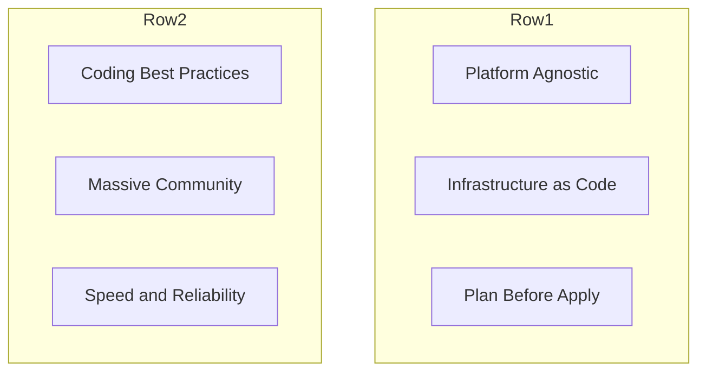

| Reason | Deck's explanation |
|---|---|
| Platform Agnostic | The only sophisticated tool completely platform agnostic - supports AWS, Azure, GCP, and hundreds of other providers |
| Infrastructure as Code | Define infrastructure in config files. Rebuild, change, and track changes with ease. High-level, human-readable syntax |
| Plan Before Apply | The plan command lets you see exactly what changes will be applied before they happen - no surprises in production |
| Coding Best Practices | Source control, automated tests, code review, CI/CD pipelines - apply all software engineering practices to your infra |
| Massive Community | Lively open-source community. Thousands of reusable modules, providers, and integrations available on the registry |
| Speed and Reliability | Parallel resource creation, dependency graphs, and optimized API calls ensure fast, reliable deployments every time |

**[EXTRA]** "Parallel resource creation" and "dependency graphs" are the same mechanism: Terraform reads every resource block, notices which ones reference each other's attributes, and builds a directed graph. Anything with no dependency relationship to something else gets created in parallel automatically - you never write parallel/sequential instructions yourself.

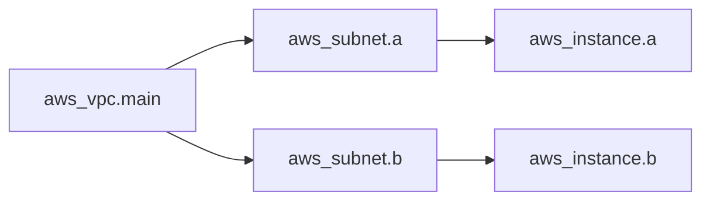

**[EXTRA]** InstanceA and InstanceB above have no reference to each other, so Terraform applies both branches in parallel once their respective subnets exist.

### Self-Check Q and A

1. **Q: "Plan Before Apply" is listed as a reason to use Terraform. What actually happens if you skip straight to apply without ever running plan?**
   A: `apply` runs its own internal plan first and shows you the same diff before asking for confirmation - so you are never fully blind. Running `plan` as a separate step is about reviewing changes ahead of time (in a pull request, for a teammate, or for your own sanity check) before you are standing at the confirmation prompt.
2. **Q: How does the "dependency graph" reason connect back to the idempotence idea from Section 01?**
   A: **[EXTRA]** Both depend on Terraform actually understanding the relationships between resources and their current real state, rather than just running a linear script - the graph is what allows Terraform to know what changed and in what order to fix it.

---

# 04 - How Terraform Works

> [!quote] Deck definition
> Terraform is logically split into two main parts that communicate via Remote Procedure Calls (RPC).

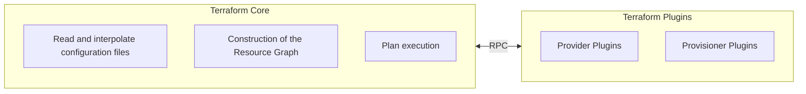

| Component | Job, per the deck |
|---|---|
| Terraform Core | Read and interpolate configuration files; construction of the Resource Graph; plan execution |
| Provider Plugins | API call initialization; resource state management; authentication with infrastructure; define resources to services |
| Provisioner Plugins | Execute commands on resources; run scripts on creation or destroy; communication with plugins via RPC |

**[EXTRA]** This Core/Plugin split is exactly why `terraform init` has to download provider binaries before anything else can run - Core itself contains zero knowledge of AWS, Azure, or any other platform. Every single `aws_*` resource type is defined entirely inside the AWS provider plugin, not inside Terraform itself. This also explains why Terraform can support "thousands of providers" (Section 03) without the Core binary growing - providers are downloaded and versioned independently.

### Self-Check Q and A

1. **Q: Why does Terraform Core need to talk to Provider Plugins via RPC instead of having provider logic built directly into Core?**
   A: **[EXTRA]** This separation lets providers be developed, versioned, and released independently of Terraform Core itself, and lets any provider (including ones HashiCorp did not write) plug into the same engine through a stable protocol - which is the actual mechanism behind the "thousands of providers" claim from Section 03.
2. **Q: Which of Core's three listed jobs happens before the Resource Graph can be built?**
   A: Reading and interpolating configuration files - Core must first know every resource block and every reference between them before it can construct the graph connecting them.

---

# 05 - AWS Provider Setup

**Day 1 - provider.tf.** The provider tells Terraform which cloud platform and account to use.

```hcl
# Static credentials - NOT recommended for version control
provider "aws" {
  region     = "us-east-1"
  access_key = "AKIAxxxxxxxx"
  secret_key = "xxxxxxxxxxxx"
}
```

```bash
# Environment Variables - recommended, works with STS/CI-CD
export AWS_ACCESS_KEY_ID="AKIA..."
export AWS_SECRET_ACCESS_KEY="..."
export AWS_REGION="us-east-1"
```

```hcl
# minimal provider block, once env vars or CLI config are set:
provider "aws" {}
```

```bash
# AWS CLI Config - recommended, no secrets in code
aws configure
```

```hcl
# Provider block used alongside AWS CLI config:
provider "aws" {
  region = "us-east-1"
}
```

| Method | Deck's rating |
|---|---|
| Static Credentials | Not recommended for version control |
| Environment Variables | Recommended - no secrets in code |
| AWS CLI Config | Recommended - works with STS/CI-CD |

> [!warning] Deck's own warning
> Static credentials directly in the provider block are not recommended for version control.

**[EXTRA]** The full credential lookup order Terraform actually uses, which the deck lists three of but does not order:

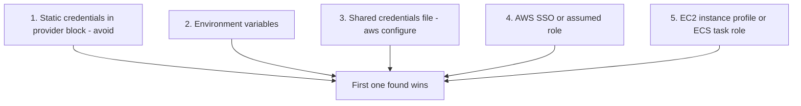

**[EXTRA]** Verifying which identity you are actually authenticated as, before ever running Terraform against it:

```bash
aws sts get-caller-identity
```

**[EXTRA]** If `terraform plan` fails with "No valid credential sources found," run the command above first. If it fails too, the problem is your AWS CLI setup, not Terraform. If it succeeds but Terraform still fails, check for an `AWS_PROFILE` mismatch or a `profile` argument in the provider block pointing at the wrong named profile.

**[EXTRA]** For a CI/CD pipeline specifically, the modern best practice is OIDC federation to a scoped IAM role rather than storing static `AWS_ACCESS_KEY_ID` / `AWS_SECRET_ACCESS_KEY` values as repository secrets - no long-lived credential exists to leak.

### Self-Check Q and A

1. **Q: Between the three methods the deck shows, which one is actually reading a file on disk, and which file?**
   A: AWS CLI Config - `aws configure` writes to `~/.aws/credentials` and `~/.aws/config`, and `provider "aws" {}` with no arguments picks those up automatically.
2. **Q: A teammate hardcodes `access_key` and `secret_key` directly in `provider.tf` and commits it. What is the actual, concrete risk, beyond "it is bad practice"?**
   A: **[EXTRA]** Anyone with read access to the git repository - including its full history, even after a later commit removes the keys - can extract valid AWS credentials and use them directly, since git history is not automatically purged by a follow-up commit.

---

# 06 - Terraform AWS VPC Resource

**Day 1 - main.tf.**

```hcl
resource "aws_vpc" "main" {
  cidr_block = "10.0.0.0/16"
}
```

```hcl
# Generic structure:
resource "<PROVIDER_TYPE>" "<LOCAL_NAME>" {
  argument = value
}
```

| Piece | Deck's explanation |
|---|---|
| `resource` | Keyword for defining an infrastructure resource in Terraform |
| `"aws_vpc"` | Resource type from the AWS provider. Tells Terraform to create an AWS VPC |
| `"main"` | Local name for referencing this resource, e.g. `aws_vpc.main.id` |
| `{ ... }` | Resource block containing config arguments (`cidr_block`, `tags`, etc.) |

> [!important] Deck's own note
> What Terraform tracks in state after apply: `aws_vpc.main` maps to `vpc-0ab123456` (id, cidr_block, arn, owner_id, tags, and more). The local name "main" is only known to Terraform; the real AWS resource is identified by its ID.

**[EXTRA]** This is worth sitting with: `main` is entirely your own naming choice inside the config file. AWS itself has never heard of "main" - AWS only knows `vpc-0ab123456`. If you rename the local name from `main` to `primary` in the config with no other change, Terraform's plan will show this as destroying `aws_vpc.main` and creating `aws_vpc.primary` - a full replacement - unless you first run `terraform state mv aws_vpc.main aws_vpc.primary` (Section 13) to tell Terraform this is a rename, not a new resource.

**[EXTRA]** `resource` blocks are one of two ways to reference infrastructure in Terraform. The other is `data` blocks, which read something that already exists rather than creating it:

```hcl
data "aws_vpc" "existing" {
  filter {
    name   = "tag:Name"
    values = ["shared-vpc"]
  }
}
```

A `data` block is read-only - removing it from your config never deletes real infrastructure, unlike removing a `resource` block.

### Self-Check Q and A

1. **Q: You change the local name of a VPC resource from "main" to "primary" with nothing else different in the block. What does `terraform plan` show, and how do you avoid it?**
   A: It shows the old one being destroyed and a new one being created, because Terraform tracks resources by their full address (`aws_vpc.main`), and `aws_vpc.primary` is, as far as state is concerned, a completely different resource. `terraform state mv aws_vpc.main aws_vpc.primary` renames it in state without touching the real VPC.
2. **Q: What is the actual difference between a `resource` block and a `data` block?**
   A: **[EXTRA]** `resource` means Terraform owns the lifecycle - it creates, updates, and will destroy this thing if the block is removed. `data` means Terraform only reads an already-existing object - removing a `data` block has zero effect on real infrastructure.

---

# 07 - terraform init - What It Creates

**Day 1 - Initializing a working directory.**
.terraform/  
├── providers/  
│ └── registry.terraform.io/  
│ └── hashicorp/aws/  
│ └── aws_plugin_binary  
├── modules/  
│ └── vpc/ (if modules used)  
└── backend metadata

| Item | Deck's explanation |
|---|---|
| `providers/` | Downloaded provider plugins (e.g. AWS provider binary). Terraform uses this to call AWS APIs |
| `modules/` | If config uses external modules, Terraform downloads them here after init |
| `.terraform.lock.hcl` | Locks provider versions so every team member installs the exact same versions |

> [!important] Deck's own .gitignore guidance
> Always exclude: `.terraform/`, `.terraform.lock.hcl`, `terraform.tfstate`, `terraform.tfstate.backup`

**[EXTRA]** This one line in the deck is actually slightly incomplete and worth correcting carefully: `.terraform.lock.hcl` should usually be **committed** to git, not excluded. It pins the exact provider version and checksum so that everyone on the team - and CI - installs the identical provider binary on `init`, which is precisely the guarantee the deck's own bullet above it describes. What genuinely belongs in `.gitignore` is the `.terraform/` directory itself (the actual downloaded binaries, which are large and fully reproducible from the lock file) and the state files (which contain real resource IDs and potentially secrets, and belong in a remote backend instead - Section 14).

## Corrected .gitignore

.terraform/  
terraform.tfstate  
terraform.tfstate.backup  
*.tfvars # only if it contains secrets - non-secret tfvars are often committed deliberately


**[EXTRA]** `terraform init` is also the command that reads your `backend` block (Section 14) and connects to remote state, and is the command you re-run any time you add a new provider or module reference to your config, or after a backend configuration change (`-reconfigure` or `-migrate-state` flags).

### Self-Check Q and A

1. **Q: The deck's .gitignore list includes `.terraform.lock.hcl`. Why would most real teams actually want to commit this file instead?**
   A: **[EXTRA]** The lock file is exactly what guarantees every team member and every CI run downloads the identical provider version and checksum - excluding it means `init` could silently resolve to a newer provider version on someone else's machine, defeating the reproducibility the lock file exists to provide.
2. **Q: You add a new `module` block to your config that was not there before. What command must you run before `plan` will work?**
   A: `terraform init` - it is responsible for downloading module sources in addition to provider plugins, and will error on `plan` if a referenced module has never been fetched.

---

# 08 - plan, apply, tfstate

**Day 1 - The core Terraform workflow.**

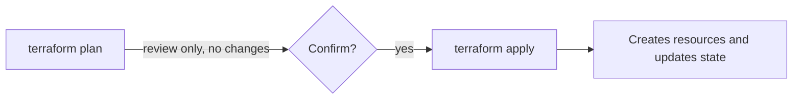

| Command | Deck's explanation |
|---|---|
| `terraform plan` | Previews what Terraform will create, update, or destroy. No changes made - safe to run anytime for review |
| `terraform apply` | Executes the plan against the cloud provider. Creates/updates `terraform.tfstate` with current state. Prompts for confirmation (skip with `-auto-approve`) |

Plan symbols, per the deck: `+ add`  `~ change`  `- destroy`

> [!quote] Deck's list of what terraform.tfstate stores
> Resource IDs and attributes; IP addresses, ARNs; resource dependencies; provider metadata.

**[EXTRA]** Reading a fuller plan diff than the deck's three symbols alone:

## aws_instance.web will be updated in-place

~ resource "aws_instance" "web" {  
id = "i-0abc123"  
~ instance_type = "t3.micro" -> "t3.small"  
}

## aws_db_instance.main will be destroyed and re-created

-/+ resource "aws_db_instance" "main" {  
~ engine_version = "13.4" -> "14.1" # forces replacement  
}

`~` means an in-place update, no data loss. `-/+` means Terraform will destroy the resource and create a fresh one to make the change - for a database or anything stateful, this line must be read carefully every single time before typing `yes`, since it means data loss unless the resource is genuinely disposable.

**[EXTRA]** `apply` requires typing the literal word `yes` at the confirmation prompt - not `y`, not Enter. This is a deliberate friction point against reflexively confirming a real infrastructure change.

### Self-Check Q and A

1. **Q: The deck says plan makes "no changes." What does plan actually do behind the scenes to produce its diff, given that it must know the real current state of every resource?**
   A: **[EXTRA]** Plan performs a refresh step, querying the real cloud API for each tracked resource's current attributes, then diffs that refreshed reality against both the state file and the desired configuration - this is also how plan can detect drift caused by someone manually changing something in the AWS console.
2. **Q: You see `-/+` next to a resource in a plan. What does that specifically mean, and why is it more dangerous than a plain `~`?**
   A: **[EXTRA]** `-/+` means the resource will be destroyed and completely recreated to apply the change, rather than updated in place. For anything holding data - a database, a stateful volume - this line means data loss unless you have confirmed the replacement is actually safe or acceptable.

---

# 09 - Providers

> [!quote] Deck definition
> A provider is responsible for understanding API interactions and exposing resources. Providers cover IaaS, PaaS, and SaaS services.

| Provider type | Examples, per the deck |
|---|---|
| IaaS | AWS, GCP, Azure, Alibaba |
| PaaS | Heroku, Render |
| SaaS | Cloudflare, Terraform Cloud |

```hcl
provider "aws" {
  version = "~> 2.0"
  region  = "us-east-1"
}
```

**[EXTRA]** The `version` argument shown directly inside the `provider` block, as in the slide's example, is old-style syntax. Modern Terraform (0.13+) expects provider version constraints inside a `required_providers` block instead:

```hcl
terraform {
  required_providers {
    aws = {
      source  = "hashicorp/aws"
      version = "~> 5.0"
    }
  }
}

provider "aws" {
  region = "us-east-1"
}
```

**[EXTRA]** The `~>` operator (sometimes called the pessimistic or twiddle-wakka constraint) allows the rightmost version segment to increase but blocks a major version jump: `~> 5.0` permits 5.1, 5.2, and so on up through any 5.x, but refuses to move to 6.0 automatically. This is the practical default for pinning provider versions - strict enough to avoid a surprise breaking change, loose enough to still receive bug fixes.

### Self-Check Q and A

1. **Q: Providers are grouped into IaaS, PaaS, and SaaS in the deck. Which category does the AWS provider itself fall into when you use it to manage something like Terraform Cloud settings via the `tfe` provider instead of EC2/VPC resources?**
   A: **[EXTRA]** That would actually be the `tfe` provider (SaaS category), not the AWS provider - the categorization is about what kind of service the specific provider talks to, not which company built it. A single AWS account can be touched by multiple different providers depending on which service you are configuring.
2. **Q: What does `~> 5.0` allow and block, specifically?**
   A: **[EXTRA]** Allows any 5.x release (5.1, 5.31, and so on); blocks a move to 6.0.0 or higher without explicitly changing the constraint yourself.

---

# 10 - Core CLI Commands

| Command | Syntax | Deck's explanation |
|---|---|---|
| Initialize | `terraform init [options] [DIR]` | Initialize a working directory. Downloads providers and modules. First command to run in any new project. Safe to run multiple times |
| Plan | `terraform plan [options] [dir]` | Creates an execution plan. Shows what actions will be taken to reach the desired state. No changes are made - review before applying |
| Apply | `terraform apply [options] [dir-or-plan]` | Applies the changes required to reach the desired state. Executes the plan and provisions/modifies real infrastructure resources |
| Destroy | `terraform destroy [options] [dir]` | Destroys all Terraform-managed infrastructure. Use with caution - this tears down everything defined in your configuration |

**[EXTRA]** `apply` accepting `[dir-or-plan]` in its syntax is worth noticing: you can pass it either a directory of `.tf` files (it re-plans fresh), or a saved plan file from a previous `plan -out=tfplan` run (it applies exactly that plan, with no re-planning). The second form removes any possibility of drift happening between the moment a plan was reviewed and the moment it is applied - the standard pattern in CI/CD pipelines:

```bash
terraform plan -out=tfplan
# reviewed, e.g. posted as a pull request comment
terraform apply tfplan
```

### Self-Check Q and A

1. **Q: What is the practical difference between `terraform apply` on its own and `terraform apply tfplan` where `tfplan` is a file saved from an earlier `plan -out=tfplan`?**
   A: **[EXTRA]** A bare `apply` re-runs its own plan internally immediately before applying, which could differ from a plan reviewed earlier if real infrastructure changed in between. `apply tfplan` applies the exact, already-reviewed plan with no re-planning step, removing that race condition entirely - the reason CI/CD pipelines use this two-step pattern.

---

# 11 - Terraform State File - What and Why

**Day 1 - terraform.tfstate.**

```json
{
  "resources": [
    {
      "type": "aws_vpc",
      "name": "main",
      "instances": [{
        "attributes": {
          "id": "vpc-0ab123456"
        }
      }]
    }
  ]
}
```

The deck lists four jobs of the state file:

| Job | Deck's explanation |
|---|---|
| 1. Track Resources | Records which infrastructure resources exist. Example: `aws_instance.web` maps to `i-012345` |
| 2. Compare Desired vs Actual | Code vs State vs Real Cloud, decides Create / Update / Destroy |
| 3. Store Metadata | Resource IDs, IPs, ARNs, dependencies - all saved for future operations |
| 4. Improve Performance | Avoids querying the cloud for every resource on every run |

> [!important] Deck's own summary
> `config "aws_vpc" "main" { }` maps to real resource `vpc-0ab123456`.

**[EXTRA]** Point 4 ("Improve Performance") deserves unpacking, because it explains why `plan` still needs to talk to AWS at all if the state file already has everything cached: state avoids re-*discovering* which resources exist and how they relate (the graph, the metadata), but `plan` still refreshes each tracked resource's live attributes from the real API to catch drift. State is a cache of identity and structure, not a guarantee that the cached attribute values are still accurate - that is exactly what the refresh step re-checks.

**[EXTRA]** Everything in the state file, including any attribute a provider marks as sensitive (like a generated database password), is stored in **plain text**. Marking a Terraform variable `sensitive = true` only hides it from console output during plan/apply - it does not encrypt or redact it inside the state file itself. This is the single biggest reason remote state (Section 14) must itself be encrypted and access-controlled.

### Self-Check Q and A

1. **Q: If the state file already stores every resource's attributes as point 3 describes, why does `terraform plan` still need to make real API calls to AWS?**
   A: **[EXTRA]** State records what Terraform last knew, not necessarily what is true right now - someone could have changed a resource manually outside of Terraform. Plan's refresh step re-queries AWS for live attribute values specifically to catch this kind of drift before deciding what changes are needed.
2. **Q: A variable holding a database password is marked `sensitive = true`. Does this protect the password inside `terraform.tfstate`?**
   A: **[EXTRA]** No. `sensitive = true` only suppresses the value from plan/apply console output. The state file stores the actual value in plain text regardless, which is why state files themselves must be encrypted at rest and access-restricted, not relied upon to protect secrets by themselves.

---

# 12 - State File - Risks and Remote Backend

**Day 1 - Why local state is dangerous.**

| Risk | Deck's explanation |
|---|---|
| 1. Terraform Forgets Everything | Deleting tfstate makes Terraform think nothing exists. Re-running apply may create duplicate resources |
| 2. Infrastructure Drift | Resources exist in AWS but Terraform can no longer track or manage them |
| 3. Possible Data Loss | Terraform may recreate databases, storage, or networking - destroying existing data |

```hcl
terraform {
  backend "s3" {
    bucket = "terraform-state-bucket"
    key    = "dev/terraform.tfstate"
    region = "us-east-1"
  }
}
```

Deck's listed benefits of a remote backend: shared state across team; more secure (encrypted); no accidental deletion; state locking support.

**[EXTRA]** "Shared state across team" is worth expanding on with a concrete failure mode the deck does not spell out. Without a remote backend, each developer has their own local `terraform.tfstate`:

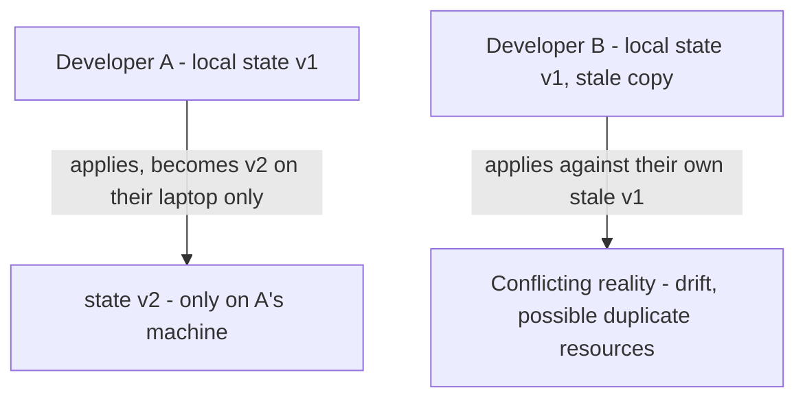

This is the actual, mechanical reason "shared state across team" matters - it is not just a convenience, it prevents two people from making conflicting changes against two different beliefs about what currently exists.

### Self-Check Q and A

1. **Q: A developer deletes their local `terraform.tfstate` file by accident, with real infrastructure already provisioned. What actually happens the next time you run `terraform apply`, per risk 1 in the deck?**
   A: Terraform has no memory of anything it previously created, so it treats every resource in the config as brand new and attempts to create it again - this can fail outright on naming conflicts, or worse, succeed and create genuine duplicates that are now completely untracked.
2. **Q: Why does the deck list "state locking support" as a benefit specifically of a remote backend, rather than something local state could also offer?**
   A: A single local file with no coordinating service has no way to prevent two people from reading and writing it at the same time. Locking requires a separate, shared mechanism (in the deck's example, DynamoDB) that both people's Terraform runs check against - something a local-only file cannot provide on its own. Covered in full in the next section.

---

# 13 - State Locking and force-unlock

**Day 1 - Preventing concurrent Terraform runs.**

> [!quote] Deck's explanation
> Two engineers running `terraform apply` simultaneously can corrupt the state file. Terraform prevents this with state locking via DynamoDB.

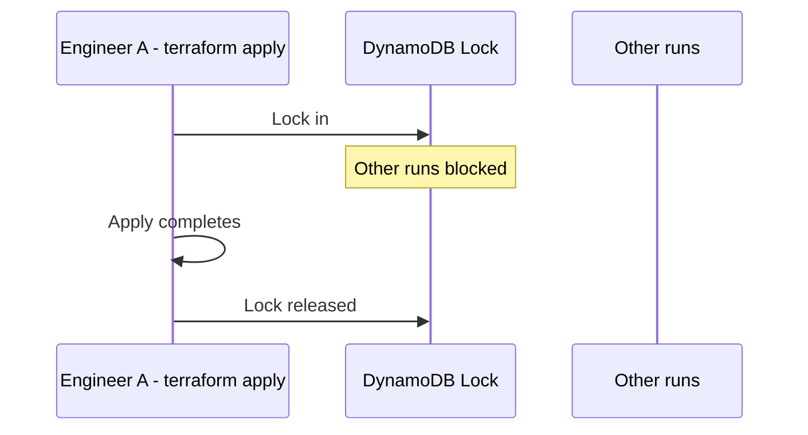

```hcl
terraform {
  backend "s3" {
    bucket         = "terraform-state-bucket"
    key            = "dev/terraform.tfstate"
    region         = "us-east-1"
    dynamodb_table = "terraform-locks"  # locking
  }
}
```

```bash
# force-unlock - manual unlock after failed/interrupted operations
terraform force-unlock 12345678-1234-1234-1234-123456789012
```

> [!important] Deck's own note
> Find the Lock ID in the DynamoDB table's LockID column.

**[EXTRA]** `force-unlock` should be treated as an emergency-only command, used specifically when you have confirmed (by checking with the rest of the team, or checking whether the process that held the lock actually crashed) that no other `apply` is genuinely still running. Force-unlocking while another apply is legitimately still in progress reintroduces exactly the corruption risk the lock exists to prevent.

**[EXTRA]** Without the `dynamodb_table` argument, an S3 backend still stores state remotely and shares it across the team, but offers no locking at all - the two-engineers-apply-at-once scenario from the deck's own explanation becomes possible again. The `dynamodb_table` line is not optional if you want the full protection described.

### Self-Check Q and A

1. **Q: Two engineers both run `terraform apply` at nearly the same moment against an S3 backend with a `dynamodb_table` configured. What happens to the second one?**
   A: The second apply is blocked at the lock-acquisition step with an error stating the state is locked, rather than proceeding and potentially corrupting the state file - it must wait until the first apply completes and releases the lock, then can retry.
2. **Q: Under what circumstance is running `terraform force-unlock` actually safe, versus when could it cause the exact corruption locking is meant to prevent?**
   A: **[EXTRA]** It is safe when you have confirmed the process holding the lock has genuinely crashed or been interrupted and is not still running. It is dangerous if run while another apply is legitimately still in progress, since it would allow two concurrent writes to the state file - the very race condition the lock exists to block.

---

# 14 - Terraform State Commands

**Day 1 - Managing state from the CLI.**

| Command | Deck's explanation |
|---|---|
| `terraform state list` | List all resources tracked in state |
| `terraform state show aws_vpc.main` | Display attributes of a specific resource |
| `terraform state pull` | Retrieve raw state file in JSON format - useful for debugging |
| `terraform state mv aws_vpc.main aws_vpc.production` | Rename resource in state after code refactor - avoids recreate |
| `terraform state rm aws_vpc.main` | Remove from state without deleting from AWS. Terraform stops managing it |
| `terraform import aws_vpc.main vpc-123456` | Bring an existing AWS resource under Terraform management |

**[EXTRA]** `state rm` and `destroy` are opposites and are easy to confuse under pressure - worth stating plainly:

| Command | Effect on the state file | Effect on real AWS resource |
|---|---|---|
| `terraform state rm X` | Removes tracking | Resource keeps running, completely untouched |
| `terraform destroy -target=X` | Removes tracking | Resource is actually deleted |

**[EXTRA]** `terraform import` (also listed again in Section 16) is how you adopt a resource that already exists in AWS - created by hand in the console, or by an older tool - under Terraform's management going forward. The import command alone only updates the state file; you must also write a matching `resource` block in your `.tf` files yourself, or the very next `plan` will show Terraform wanting to destroy the "unmanaged" resource it now believes should not exist.

```bash
# 1. Write a resource block that matches the real thing, even roughly
resource "aws_vpc" "main" {
  cidr_block = "10.0.0.0/16"   # your best guess at the real value
}

# 2. Import - links the block to the real resource ID
terraform import aws_vpc.main vpc-123456

# 3. Run plan - it will show any mismatch between your guessed arguments
#    and the real resource's actual attributes, which you then correct by hand
terraform plan
```

### Self-Check Q and A

1. **Q: What is the practical difference between `terraform state rm aws_s3_bucket.data` and `terraform destroy -target=aws_s3_bucket.data`, and when would you deliberately choose the former?**
   A: `state rm` stops Terraform tracking the bucket while leaving it and its data fully intact in AWS. `destroy -target` actually deletes it. You would choose `state rm` when handing a resource off to be managed by a different config or team, without wanting to destroy the real thing.
2. **Q: You run `terraform import aws_vpc.main vpc-123456` successfully. Is your config file now automatically correct and complete for this resource?**
   A: **[EXTRA]** No - import only updates the state file's link between your local resource address and the real resource ID. You must still write (or correct) the actual `resource` block in your `.tf` files to match the real resource's arguments, or the next plan will propose changes to "fix" arguments that were never actually written down correctly.

---

# 15 - terraform fmt and terraform destroy

**Day 1 - Format code and clean up infrastructure.**

```hcl
# Before:
resource "aws_vpc" "main"{cidr_block="10.0.0.0/16"}

# After terraform fmt:
resource "aws_vpc" "main" {
  cidr_block = "10.0.0.0/16"
}
```

```bash
terraform destroy
terraform destroy -auto-approve
```

| `terraform fmt` (deck) | `terraform destroy` (deck) |
|---|---|
| Auto-formats all .tf files | Removes all Terraform-managed resources |
| Ensures consistent code style | Destroys all resources in configuration |
| Improves readability | Asks for confirmation (unless `-auto-approve`) |
| Run before git commit | Updates state file - removes destroyed resources |
| | Useful for test environments and cleanup |

> [!warning] Deck's own warning
> Permanently deletes AWS resources. Use with caution.

**[EXTRA]** For CI, `terraform fmt -check -recursive` is the variant worth knowing: instead of rewriting files, it exits with a non-zero status if anything is unformatted, which is what you actually want in a pipeline check step (you want the pipeline to fail and tell a human to run `fmt`, not silently rewrite their files for them).

**[EXTRA]** `-target` works on `destroy` the same way it does on `apply` - `terraform destroy -target=aws_instance.web` tears down a single resource rather than everything in the config. It still asks for confirmation, and should still be treated as a scalpel rather than a routine tool - repeated targeted destroys can leave your state in a shape the rest of your config no longer fully accounts for.

### Self-Check Q and A

1. **Q: Why does `terraform fmt` matter enough for the deck to specifically say "run before git commit"?**
   A: **[EXTRA]** Consistent formatting means diffs in pull requests show only actual logical changes, not incidental whitespace/alignment differences - an unformatted commit can make a one-line change look like it touched dozens of lines, making review much harder.
2. **Q: What is the CI-friendly variant of `terraform fmt`, and how does its behavior differ from the plain command?**
   A: **[EXTRA]** `terraform fmt -check -recursive` - instead of rewriting files in place, it only checks whether they are already correctly formatted and exits with an error code if not, which is what a CI pipeline needs in order to fail the check rather than silently mutate someone's branch.

---

# 16 - More CLI Commands

| Command | Syntax | Deck's explanation |
|---|---|---|
| `terraform fmt` | `terraform fmt [options] [DIR]` | Rewrites config files to canonical format and style. Run before committing code |
| `terraform graph` | `terraform graph \| dot -Tsvg > graph.svg` | Generates a visual DOT-format representation of the dependency graph. Pipe to GraphViz |
| `terraform import` | `terraform import [args]` | Import existing infrastructure into Terraform state. Bring unmanaged resources under Terraform control |
| `terraform state` | `terraform state <subcommand>` | Advanced state management subcommand. List, show, move, or remove items from state without editing files directly |

**[EXTRA]** `terraform graph` connects directly back to Section 03's "dependency graph" explanation - this command lets you actually see the graph Terraform builds internally, rather than taking the concept on faith. Running it on even a small config with a VPC, subnet, and instance will visibly show the same chain drawn in Section 03's diagram.

**[EXTRA]** Two more commands worth knowing that are not in this deck at all:

```bash
terraform validate     # checks syntax and internal type consistency, no network calls at all
terraform console       # interactive REPL - test expressions and functions against your real loaded config
```

`validate` is useful as a fast pre-check before `plan`, since it catches syntax errors without needing real AWS credentials or network access at all. `console` lets you test an unfamiliar expression or function safely:

$ terraform console

> upper("hello")  
> "HELLO"  
> aws_vpc.main.cidr_block  
> "10.0.0.0/16"  
> exit


### Self-Check Q and A

1. **Q: `terraform validate` passes with no errors, but `terraform apply` later fails with an AWS permissions error. Why did validate not catch this?**
   A: **[EXTRA]** Validate only checks configuration syntax and internal type consistency - it never makes real API calls. Permission errors, quota limits, or anything about whether the config actually works against the real cloud only surface at plan (which refreshes real state) or apply (which makes the real mutating calls).
2. **Q: How does `terraform graph` relate back to the "Construction of the Resource Graph" job listed under Terraform Core in Section 04?**
   A: **[EXTRA]** `graph` is a direct way to visualize that same internal structure Core builds during planning - it is not a separate feature, but a window into the exact dependency graph Core already constructs every time it plans or applies.

---

# DAY 2

# 17 - Terraform Variables

**Day 2 - variables.tf - Making configuration dynamic.**

> [!quote] Deck's explanation
> Variables avoid hardcoding values, make configs reusable across environments, and support type checking and defaults.

```hcl
# variables.tf
variable "vpc_cidr" {
  description = "CIDR block for the VPC"
  type        = string
  default     = "10.0.0.0/16"
}

variable "public_subnet_cidr" {
  description = "CIDR block for the public subnet"
  type        = string
  default     = "10.0.1.0/24"
}

variable "region" {
  description = "AWS region"
  type        = string
  default     = "us-east-1"
}
```

```hcl
# main.tf - using variables
provider "aws" {
  region = var.region
}

resource "aws_vpc" "main" {
  cidr_block = var.vpc_cidr
}

resource "aws_subnet" "public" {
  vpc_id     = aws_vpc.main.id
  cidr_block = var.public_subnet_cidr
}
```

**[EXTRA]** The full HCL type system, beyond the `string` type the deck's examples use:

| Type | Example |
|---|---|
| `string`, `number`, `bool` | Primitives |
| `list(string)` | `["a", "b", "c"]` - ordered, duplicates allowed |
| `set(string)` | Unordered, automatically deduplicated |
| `map(string)` | `{ key = "value" }` |
| `object({...})` | Structured, named and typed fields together |

**[EXTRA]** Variables also support a `validation` block, which catches bad input immediately with a clear error rather than letting a malformed value fail confusingly deep inside whatever resource actually consumes it:

```hcl
variable "region" {
  type = string
  validation {
    condition     = contains(["us-east-1", "us-west-2", "eu-west-1"], var.region)
    error_message = "region must be one of the approved regions."
  }
}
```

**[EXTRA]** Marking a variable `sensitive = true` (relevant for anything like a database password passed as a variable) hides it from console output during plan and apply - but, as covered in Section 11, it does not protect the value inside the state file itself.

### Self-Check Q and A

1. **Q: The deck's `vpc_cidr` variable has both a `type` and a `default`. What happens if someone passes a value that does not match the declared type?**
   A: **[EXTRA]** Terraform raises a type-mismatch error before planning even begins - this is exactly the "type checking" benefit the deck's own definition mentions, catching a wrong-shaped value early rather than letting it silently cause strange behavior deep in a resource block.
2. **Q: Why might a team add a `validation` block to the `region` variable specifically, beyond just declaring it `type = string`?**
   A: **[EXTRA]** `type = string` only confirms the value is text - it says nothing about whether it is a real, approved AWS region for this organization. A validation block can enforce business rules (only these three regions are allowed) that the type system alone cannot express.

---

# 18 - Passing Variables - 4 Methods

**Day 2 - Priority order: -var greater than tfvars greater than env vars greater than defaults.**

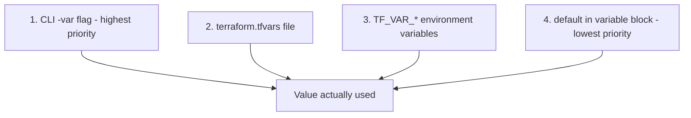

> [!warning] Correction to the deck's stated order
> The deck's subtitle states the priority as `-var greater than tfvars greater than env vars greater than defaults`. Terraform's actual documented precedence places environment variables (`TF_VAR_*`) **below** `.tfvars` files but **above** the `default` in the variable block - so the correct order is: CLI `-var` flag highest, then `.tfvars` files, then `TF_VAR_*` environment variables, then the variable block's `default` lowest. This matches the order shown in the diagram above and in the numbered list below, and matters in practice: do not assume an exported `TF_VAR_region` will override a value sitting in `terraform.tfvars` - it will not.

| Method | Deck's explanation |
|---|---|
| 1. Default Values | If nothing else provided, Terraform uses the value in the variable block |
| 2. terraform.tfvars | File auto-loaded on plan/apply. Best for environment-specific overrides |
| 3. CLI -var Flag | Pass inline on the command line. Useful for one-off overrides |
| 4. TF_VAR_* Env Vars | Prefix variable names with TF_VAR_. Great for CI/CD pipelines and secrets |

```hcl
# terraform.tfvars
vpc_cidr           = "10.1.0.0/16"
public_subnet_cidr = "10.1.1.0/24"
region             = "us-west-2"
```

```bash
# CLI flag
terraform apply \
  -var="vpc_cidr=10.2.0.0/16" \
  -var="region=eu-central-1"
```

```bash
# Environment variables
export TF_VAR_vpc_cidr="10.3.0.0/16"
export TF_VAR_region="ap-southeast-1"
terraform apply
```

**[EXTRA]** Practical guidance on which method to use for what, since the deck lists all four without saying when to prefer each:

| Method | Best for |
|---|---|
| `.tfvars` committed to git | Per-environment, non-secret values everyone should see and review |
| `TF_VAR_*` env vars | Secrets injected by CI/CD - never commit a secret into a `.tfvars` file |
| `-var` CLI flag | One-off overrides while testing, scripting |
| `default` in variable block | Sensible fallback so the config still works with zero extra setup |

### Self-Check Q and A

1. **Q: A value is set in both `terraform.tfvars` and as a `TF_VAR_*` environment variable. Which one actually wins, and how does this differ from what the deck's subtitle states?**
   A: The `.tfvars` file value wins - Terraform's real precedence places `.tfvars` files above environment variables, which is the opposite of the order implied by the deck's subtitle line. The CLI `-var` flag is the only thing that outranks `.tfvars`.
2. **Q: Why does the deck recommend `TF_VAR_*` environment variables specifically for secrets, rather than putting the secret value directly in a `.tfvars` file?**
   A: A `.tfvars` file is a file on disk that risks being committed to git by accident. An environment variable set by a CI/CD pipeline's own secret-storage mechanism is never written to a file in the repository at all, removing that specific accidental-commit risk.

---

# 19 - Terraform Workspaces

**Day 2 - Manage multiple environments with one config.**

> [!quote] Deck's explanation
> Workspaces isolate state files for different environments (dev, staging, prod) without separate Terraform configurations.

```bash
terraform workspace list                # List all existing workspaces. Current workspace marked with *
terraform workspace new dev              # Create a new workspace called "dev" and switch to it
terraform workspace select dev           # Switch to an existing workspace
terraform workspace show                 # Display the name of the current workspace
```

> [!important] Deck's own note
> Each workspace gets its own isolated state file - dev changes never affect prod. The default workspace cannot be deleted.

**[EXTRA]** Workspaces are genuinely useful but have one real limitation worth knowing before relying on them for prod isolation: because all workspaces share the exact same `.tf` configuration files, any structural difference between environments (say, prod needs a database read replica that dev does not) has to be expressed as a conditional inside shared code:

```hcl
resource "aws_db_instance" "replica" {
  count = terraform.workspace == "prod" ? 1 : 0
  # ...
}
```

**[EXTRA]** A widely used alternative pattern, especially once environments genuinely diverge in structure and not just in values, is separate directories per environment that each call the same shared modules:


environments/  
├── dev/main.tf -> module "vpc" { source = "../../modules/vpc" cidr = "10.0.0.0/16" }  
├── staging/main.tf -> module "vpc" { source = "../../modules/vpc" cidr = "10.1.0.0/16" }  
└── prod/main.tf -> module "vpc" { source = "../../modules/vpc" cidr = "10.2.0.0/16" }

This trades the convenience of one shared config for physically separated files - which also makes it much harder to accidentally apply a change intended for dev against prod, since you would have to be `cd`'d into the wrong directory rather than just have forgotten which workspace is currently selected. Both patterns are legitimate; workspaces suit near-identical environments, separate directories suit environments that genuinely differ in structure or that need stronger blast-radius isolation.

### Self-Check Q and A

1. **Q: You run `terraform apply` intending to update dev, but you are actually still in the prod workspace from an earlier session. What happens, and what single command would have caught this beforehand?**
   A: The apply proceeds against whatever workspace is currently selected, meaning it would apply dev-intended changes to production infrastructure. `terraform workspace show` before any apply is the direct check.
2. **Q: Prod needs one extra resource dev and staging do not need at all. How would you express this using workspaces, and what is the tradeoff of that approach compared to separate directories?**
   A: **[EXTRA]** With workspaces, a `count = terraform.workspace == "prod" ? 1 : 0` conditional on that resource. The tradeoff is that structural differences between environments become buried inside conditionals in shared code, rather than being visible directly in a directory structure - separate directories make "what does prod actually contain" answerable just by looking at prod's own files.

---

# 20 - Advanced HCL: count, for_each and output

```hcl
resource "aws_subnet" "public" {
  count             = 2
  vpc_id            = aws_vpc.myvpc.id
  cidr_block        = var.sub_pub_cidr_list[count.index]
  availability_zone = var.azs[count.index]
}
```

> [!quote] Deck's explanation of count
> Create multiple resource instances from one definition.

```hcl
resource "aws_subnet" "subnets" {
  for_each = {
    for subnet in var.sub_map :
    subnet.cidr => subnet
  }
  map_public_ip_on_launch =
    each.value.type == "public"
}
```

> [!quote] Deck's explanation of for_each
> Iterate over a map or set for conditional/named resources.

```hcl
output "instance_ip_addr" {
  value       = aws_instance.server.private_ip
  description = "The private IP address"
}
```

> [!quote] Deck's explanation of output
> Output values expose resource attributes to users or other modules. Printed in CLI after apply. Accessible via remote state.

**[EXTRA]** The deck introduces both `count` and `for_each` but does not compare them directly - this comparison matters a great deal in practice:

| | `count` | `for_each` |
|---|---|---|
| Index type | Numeric - `[0]`, `[1]` | String key - `["frontend"]` |
| Removing an item from the middle | Re-indexes everything after it | Only the removed key is affected |
| Input | A number | A `set` or `map` |

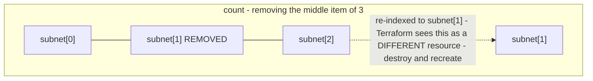

`for_each` avoids this because each resource is keyed by a stable string, not a position - removing one key affects only that key. This is exactly why the deck's own second example uses `for_each` keyed by `subnet.cidr` rather than `count` - a genuinely more resilient pattern for anything with a natural identity.

**[EXTRA]** `for` expressions (not the same thing as `for_each`, though related) transform collections into new values, used heavily inside `locals`:

```hcl
locals {
  all_subnet_ids = [for s in aws_subnet.public : s.id]
  name_to_ip     = { for i in aws_instance.web : i.tags.Name => i.private_ip }
}
```

### Self-Check Q and A

1. **Q: You manage 3 subnets with `count = 3` and need to delete the middle one specifically. What actually happens to the subnet that used to be index 2, and why does the deck's own for_each example avoid this problem?**
   A: **[EXTRA]** Removing the middle item re-indexes everything after it, so what was `subnet[2]` becomes `subnet[1]` - Terraform reads this as a completely different resource at that address and plans a destroy-and-recreate, not a no-op. The deck's `for_each` example keys each subnet by `subnet.cidr` instead, so removing one entry only affects that specific key, leaving the others untouched.
2. **Q: The deck says outputs are "accessible via remote state." What mechanism actually makes that true?**
   A: A separate config can read another config's published outputs through the `terraform_remote_state` data source, pointed at the same backend and state file key the first config uses - this is covered in more depth in Section 21.

---

# 21 - Terraform Outputs

**Day 2 - Displaying and sharing resource values.**

```hcl
# outputs.tf
output "vpc_id" {
  value = aws_vpc.main.id
}

output "subnet_id" {
  value = aws_subnet.public.id
}
```

## After terraform apply:

## Outputs:

## vpc_id = vpc-0abc123456

## subnet_id = subnet-0ab456789

The deck lists four use cases for outputs:

| Use case | Deck's explanation |
|---|---|
| Display After Apply | Print public IPs, VPC IDs, or DNS names to the terminal for quick reference |
| Share Between Modules | A child module exposes outputs; the parent module consumes them as input |
| Remote State Access | Other configs read root outputs via `terraform_remote_state` data source |
| CI/CD Integration | Parse output values in pipelines to pass resource IDs to deployment steps |

> [!important] Deck's own summary
> `output "<name>" { value = <resource>.<local_name>.<attribute> }` - use `terraform output` to print after apply.

**[EXTRA]** The "Remote State Access" use case, spelled out concretely:

```hcl
data "terraform_remote_state" "network" {
  backend = "s3"
  config = {
    bucket = "terraform-state-bucket"
    key    = "prod/vpc/terraform.tfstate"
    region = "us-east-1"
  }
}

resource "aws_instance" "app" {
  subnet_id = data.terraform_remote_state.network.outputs.subnet_id
}
```

This is how one team's config can read another team's or component's published output without needing to know anything about how that VPC was actually built - only its bucket, key, and output names.

**[EXTRA]** Reading outputs from the CLI directly:

```bash
terraform output                    # show all outputs
terraform output vpc_id              # one value, script-friendly
terraform output -json                # machine-readable, feeds other tools
```

**[EXTRA]** If an output's value derives from anything marked `sensitive` (a sensitive variable, or a provider attribute the AWS provider itself marks sensitive - like a generated RDS password), Terraform forces the output itself to also be marked `sensitive = true`, and refuses to apply otherwise. This propagation is automatic and cannot be bypassed - it exists specifically to stop a sensitive value from surfacing in plain console output just because it passed through an output block.

### Self-Check Q and A

1. **Q: Team B's Terraform config needs the VPC ID that Team A's completely separate config created and manages in its own state file. Per the deck's "Remote State Access" use case, what is the actual mechanism, and what does Team B need to know about Team A's setup to use it?**
   A: The `terraform_remote_state` data source, pointed at Team A's backend configuration (bucket, key, region). Team B needs to know Team A's state location and the exact output name Team A published - nothing about how Team A's VPC was actually built internally.
2. **Q: An output references an RDS instance's password attribute, which the AWS provider marks sensitive. You forget to add `sensitive = true` on the output block. What happens?**
   A: **[EXTRA]** Terraform refuses to plan or apply, raising an error insisting the output be explicitly marked sensitive - sensitivity propagates automatically through the expression graph and cannot be silently bypassed by simply omitting the flag.

---

# 22 - Provisioners and Modules

```hcl
resource "aws_instance" "web" {
  # ...
  provisioner "local-exec" {
    command = "echo IP: ${self.private_ip}"
  }
  provisioner "remote-exec" {
    inline = ["sudo apt-get update"]
  }
}
```

> [!quote] Deck's explanation of Provisioners
> Execute commands or scripts on a resource after creation or before destruction. Use as a last resort - prefer provider features when possible.

```hcl
module "vpc" {
  source = "./modules/vpc"
  cidr   = var.vpc_cidr
}
```

> [!quote] Deck's explanation of Modules
> A container for multiple resources used together. Every Terraform configuration has at least one - the root module. Modules can call other modules, enabling reuse, packaging, and consistent patterns across teams.

## Hands-on Exercise (as stated in the deck)

> [!example] Deck's exercise outline
> Provider leads to VPC leads to 2 Subnets leads to 2 Instances per Subnet leads to Security Group (HTTPS) leads to Output Private IPs leads to Provisioner leads to Destroy.

**[EXTRA]** The deck names modules but does not show the anatomy of one. A module is simply a directory of `.tf` files with its own `variable` and `output` blocks acting as its interface - nothing more special than that:

modules/vpc/  
├── main.tf -> the actual resources  
├── variables.tf -> its inputs  
└── outputs.tf -> what it exposes to whoever calls it


```hcl
# modules/vpc/variables.tf
variable "cidr" {
  type = string
}

# modules/vpc/main.tf
resource "aws_vpc" "this" {
  cidr_block = var.cidr
}

# modules/vpc/outputs.tf
output "vpc_id" {
  value = aws_vpc.this.id
}
```

```hcl
# root config calling it, matching the deck's own module example
module "vpc" {
  source = "./modules/vpc"
  cidr   = var.vpc_cidr
}

resource "aws_subnet" "public" {
  vpc_id = module.vpc.vpc_id      # reading the module's output
}
```

**[EXTRA]** Module sources beyond a local path, since real teams rarely keep every module inside their own repository:

| Source type | Example |
|---|---|
| Local path | `source = "./modules/vpc"` |
| Git, versioned by tag | `source = "git::https://github.com/org/tf-modules.git//vpc?ref=v1.2.0"` |
| Terraform Registry | `source = "terraform-aws-modules/vpc/aws"`, `version = "5.0.0"` |

The Terraform Registry option is worth knowing specifically - `terraform-aws-modules/vpc/aws` is an extremely widely used, battle-tested community module handling subnets, NAT gateways, and route tables correctly, and is often a more sensible starting point than hand-rolling a VPC module from scratch for a real project.

### Self-Check Q and A

1. **Q: The deck says "every Terraform configuration has at least one module - the root module." What actually makes something the root module, structurally?**
   A: **[EXTRA]** There is no special syntax marking a directory as "the root" - it is simply the directory you run `terraform` commands from directly. Any directory referenced by a `module` block, local or remote, is structurally identical to the root; it is purely a matter of which one you are standing in when you invoke the CLI.
2. **Q: Following the deck's module example, `module "vpc" { source = "./modules/vpc" cidr = var.vpc_cidr }`, how would `aws_subnet.public` in the root config actually get the VPC's ID without hardcoding it?**
   A: Through the module's own output - `module.vpc.vpc_id`, assuming the module's `outputs.tf` exposes `vpc_id` as shown above. The module's outputs are its only interface for exposing internal values to whatever calls it.

---

# 23 - Terraform Provisioners

**Day 2 - Execute scripts on resources after creation.**

> [!quote] Deck's explanation
> Provisioners run scripts or commands on a local machine or remote server after a resource is created. Use as a last resort - prefer cloud-init or user data when possible.

```hcl
provisioner "local-exec" {
  command = "echo Instance created"
}
```

> [!quote] Deck's explanation of local-exec
> Runs a command on the machine where Terraform executes.

```hcl
provisioner "remote-exec" {
  inline = ["sudo apt update",
    "sudo apt install nginx -y"]
}
```

> [!quote] Deck's explanation of remote-exec
> Runs commands on the created resource (e.g. EC2 instance) via SSH.

```hcl
resource "aws_instance" "web" {
  ami           = "ami-123456"
  instance_type = "t2.micro"

  provisioner "remote-exec" {
    inline = [
      "sudo apt update",
      "sudo apt install nginx -y"
    ]
  }
}
```

> [!warning] Deck's own important note
> Provisioners only run when the resource is created for the first time. If the resource has not changed on re-apply, the provisioner will NOT run again. They re-run only if the resource is destroyed and recreated.

**[EXTRA]** This last point deserves a concrete failure scenario, since it explains exactly why the deck (twice, in this section and Section 22) tells you to prefer other options first. A `remote-exec` provisioner fails partway through its `inline` command list - say, the `nginx` install step errors. The EC2 instance still exists and is marked as successfully created in state, but is only partially configured. On the next `plan`, nothing shows as needing to change, because Terraform has no concept of "partially provisioned" - it only knows the instance exists, not which of the inline commands actually completed. The broken, half-configured instance sits there indefinitely unless someone notices manually.

**[EXTRA]** The deck's own guidance, "prefer cloud-init or user data when possible," refers to this alternative for the exact same nginx-install task:

```hcl
resource "aws_instance" "web" {
  ami           = "ami-123456"
  instance_type = "t2.micro"
  user_data = <<-EOF
              #!/bin/bash
              apt update
              apt install nginx -y
              EOF
}
```

`user_data` runs as part of the instance's own boot process (cloud-init), managed by the instance itself rather than requiring Terraform to hold open an SSH connection mid-apply. It automatically re-runs on any freshly launched replacement instance, and its content is a plain, visible attribute of the resource - reviewable in a `plan` diff like any other argument, unlike a provisioner's imperative, undiffable execution.

### Self-Check Q and A

1. **Q: A `remote-exec` provisioner's `inline` list has three commands. The second one fails. What state is the real EC2 instance left in, and how would you discover this from `terraform plan` alone?**
   A: **[EXTRA]** The instance exists, with the first command's effects applied and the second and third never run or only partially run - a broken, half-configured machine. You would not discover this from `plan` at all: Terraform's state shows the instance as successfully created with no further changes needed, since it has no way to represent "partially provisioned."
2. **Q: You change `instance_type` from `t2.micro` to `t2.small` on the resource in this section's final example, and re-apply. Does the `remote-exec` provisioner run again?**
   A: No - per the deck's own note, provisioners only run on initial creation, and re-run only if the resource is destroyed and recreated entirely. An in-place update, like a simple instance type change (assuming it does not force replacement), does not trigger the provisioner again.

---

# Closing

> [!quote] Deck's closing slide
> Thank You. Questions and Discussion.
> registry.terraform.io
> developer.hashicorp.com/terraform
> github.com/hashicorp/terraform

---

# Everything Beyond This Deck - What a DevOps Engineer Also Needs

**[EXTRA]** This whole section is additional to the deck, covering ground a working DevOps engineer needs that these 26 slides did not touch on at all.

## Security scanning

| Tool | Catches |
|---|---|
| `terraform validate` | Syntax and type errors only, no security awareness |
| tfsec / Trivy | Open security groups, unencrypted S3/EBS, public RDS, overly broad IAM |
| checkov | Similar security and compliance scanning, broader policy library |

```bash
tfsec .
checkov -d . --framework terraform
```

## IAM least privilege, in Terraform specifically

```hcl
resource "aws_iam_role_policy" "s3_read" {
  name = "s3-read-only"
  role = aws_iam_role.ec2_role.id
  policy = jsonencode({
    Version = "2012-10-17"
    Statement = [{
      Effect   = "Allow"
      Action   = ["s3:GetObject", "s3:ListBucket"]
      Resource = ["arn:aws:s3:::my-app-bucket", "arn:aws:s3:::my-app-bucket/*"]
    }]
  })
}
```

Scope `Resource` to the exact ARN needed, never `"*"` "to make it work" - a policy this specific is fully visible in a pull request review, which is precisely the "coding best practices" advantage the deck itself claims for Terraform in Section 03.

## The lifecycle block

```hcl
resource "aws_instance" "web" {
  lifecycle {
    create_before_destroy = true    # new resource created before old one destroyed - avoids downtime
    prevent_destroy         = true    # destroy / removal REFUSES to touch this resource
    ignore_changes           = [tags] # stop fighting drift on this specific attribute
  }
}
```

## CI/CD pipeline for Terraform

```yaml
# .github/workflows/terraform.yml
name: Terraform
on:
  pull_request:
  push:
    branches: [main]

jobs:
  plan:
    if: github.event_name == 'pull_request'
    runs-on: ubuntu-latest
    steps:
      - uses: actions/checkout@v4
      - uses: hashicorp/setup-terraform@v3
      - run: terraform init
      - run: terraform fmt -check -recursive
      - run: terraform validate
      - run: terraform plan -out=tfplan

  apply:
    if: github.ref == 'refs/heads/main'
    runs-on: ubuntu-latest
    steps:
      - uses: actions/checkout@v4
      - uses: hashicorp/setup-terraform@v3
      - run: terraform init
      - run: terraform apply -auto-approve
```

`plan` runs on every pull request as the human-reviewed step; `apply` only runs after merge to `main`, so `-auto-approve` there is automating the mechanical step after review already happened, not skipping review itself.

## Common gotchas, gathered in one table

| Trap | Symptom | Fix |
|---|---|---|
| Renaming a resource's local name | Plan shows destroy plus create instead of a rename | `terraform state mv` first |
| Env var secret in a committed `.tfvars` | Secret leaked in git history | Use `TF_VAR_*` from CI secrets instead |
| `count` with a middle item removed | Unrelated resources show as destroy and recreate | Use `for_each` with stable keys instead |
| `-/+` on a stateful resource, unnoticed | Real data loss on apply | Always read the plan diff for `-/+` before typing yes |
| Provisioner fails partway | Instance silently left half-configured, state shows no issue | Prefer `user_data`; treat provisioners as last resort per the deck's own guidance |
| No `dynamodb_table` on an S3 backend | Two applies can corrupt state | Always pair S3 backend with a lock table |
| Hardcoded AMI ID | Config breaks in a different region or when AMI is deprecated | Use a `data "aws_ami"` lookup with filters instead |

## Functions and terraform console

```hcl
locals {
  joined   = join(",", ["a", "b", "c"])          # "a,b,c"
  merged   = merge({a = 1}, {b = 2})               # {a=1, b=2}
  policy   = jsonencode({Version = "2012-10-17"})    # common for IAM policies
}
```

Terraform has no user-defined functions - only a fixed built-in library. Reusable logic is expressed through modules instead, not custom functions. Test unfamiliar functions safely in `terraform console` before dropping them into a real config, exactly as shown in Section 16.

---

# Master Recap Diagram

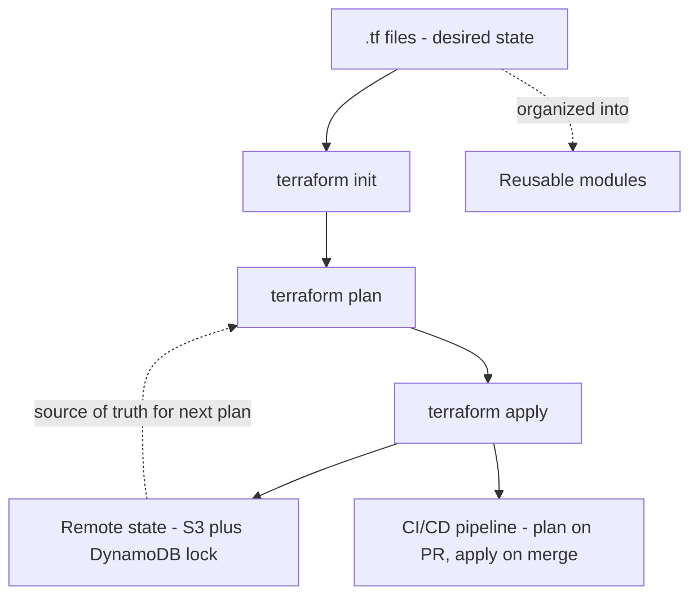

# Rapid-Fire Interview Bank

- Idempotence, per the deck: same command always sets the target into the same configuration regardless of starting state.
- Core versus Plugins: Core reads config and builds the graph; Provider Plugins do the actual API calls; they talk via RPC.
- Local name versus real resource ID: local name is only known to Terraform; the real thing is identified by its cloud-assigned ID.
- Four things state tracks, per the deck: resource IDs and attributes, dependencies, provider metadata, and drift comparison.
- Why remote state: shared across team, encrypted, prevents accidental deletion, supports locking.
- `state rm` versus `destroy`: stops tracking without deleting, versus actually deleting the real resource.
- `count` versus `for_each`: numeric and fragile to reordering, versus keyed and stable.
- Provisioners: last resort, only run on initial creation, do not re-run on in-place updates.
- Modules: a directory of `.tf` files with `variable` and `output` blocks as its interface; the root module is not structurally special.
- **[EXTRA]** `-/+` in a plan: destroy and recreate, always worth a second look on anything stateful before confirming.

# Self-Assessment - Can You Explain These Without Notes

- [ ] The Core versus Plugins split and why it explains what `terraform init` downloads
- [ ] Why a local resource name is not the same thing as the real AWS resource ID, using the deck's own VPC example
- [ ] All four risks of local state, in your own words
- [ ] The correct variable precedence order, and where the deck's stated order was wrong
- [ ] Why `count` re-indexing can silently destroy and recreate unrelated resources
- [ ] Why provisioners are called "last resort" twice in this deck, with a concrete failure scenario
- [ ] **[EXTRA]** Why `sensitive = true` on a variable or output does not protect the state file itself'

